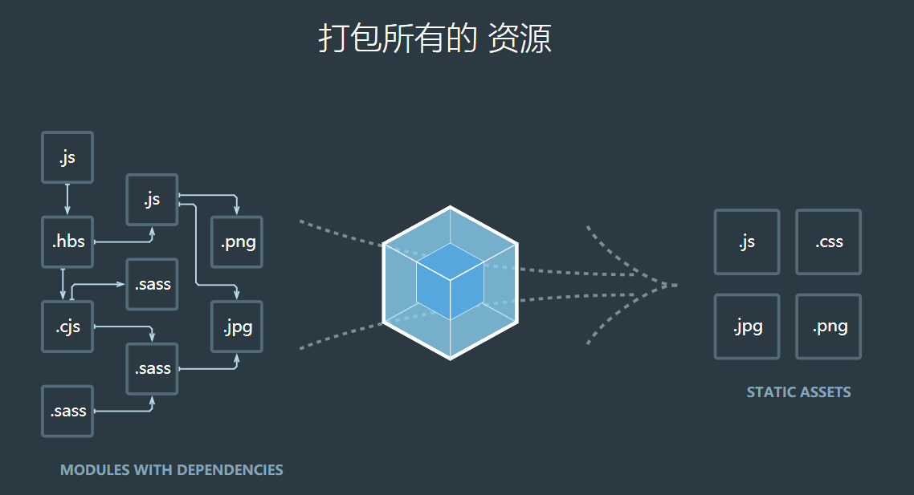

# 第2章 webpack

如今，前端项目日益复杂，构建系统已经成为开发过程中不可或缺的一个部分，而模块打包（module bundler）正是前端构建系统的核心。

正如前面介绍到，前端的模块系统经理了长久的演变，对应的

模块打包方案也几经变迁。从最初简单的文件合并，到AMD的模块具名化并合并，再到browserify将CommonJS模块转换成为浏览器端可运行的代码，打包器做的事情越来越复杂，角色也越来越重要。

在这样一个竞争激烈的细分领域中，webpack以极快的速度风靡全球，成为当下最流行的打包解决方案，并不是偶然。它功能强大、配置灵活，特有的code spliting方案正戳中了大规模复杂Web应用的痛点，简单的loader/plugin开发使它很快拥有了丰富的配套工具与生态。

对多种模块方案的支持与视一切资源为可管理模块的思路让它天然地适合React项目的开发，成为React官方推荐的打包工具。在本章中将着重介绍webpack这个工具的特点与使用，作为接下来使用webpack辅助开发React项目的准备。

## 2.1 webpack的特点与优势

正如前面提到的，打包工具也有不同的开源方案，那么相比其他的流行打包工具，webpack有着怎样的特点与优势呢？本节将对RequireJS、browserify及webpack这三者做一个全面的比较。

### 2.1.1 webpack与RequireJS、browserify

首先对三者做一下简要的介绍。

RequireJS是一个JavaScript模块加载器，基于AMD规范实现。它同时也提供了对模块进行打包与构建的工具r.js，通过将开发时单独的匿名模块具名化并进行合并，实现线上页面资源加载的性能优化。这里拿来对比的是由RequireJS与r.js等一起提供的一个模块化构建方案。开发时的RequireJS模块往往是一个个单独的文件，RequireJS从入口文件开始，递归地进行静态分析，找出所有直接或间接被依赖（require）的模块，然后进行转换与合并，结果大致如下（未压缩）。

```js
// bundle.js
define('hello', [], function (require) {
    module.exports = 'hello';
});
define('say', ['require', 'hello'], function (require) {
    var hello = require('./hello');
    alert(hello);
});
```

browserify是一个以在浏览器中使用Node.js模块为出发点的工具。它最大的特点在于以下两点。

* 对CommonJS规范（Node.js模块所采用的规范）的模块代码进行的转换与包装。
* 对很多Node.js的标准package进行了浏览器端的适配，只要是遵循CommonJS规范的JavaScript模块，即使是纯前端代码，也可以使用它进行打包。

webpack则是一个为前端模块打包构建而生的工具。它既吸收了大量已有方案的优点与教训，也解决了很多前端开发过程中已存在的痛点，如代码的拆分与异步加载、对非JavaScript资源的支持等。强大的loader设计使得它更像是一个构建平台，而不只是一个打包工具。

### 2.1.2 模块规范

模块规范是模块打包的基础，我们首先对这三者所支持的模块化方案进行比较。

RequireJS项目本身是最流行的AMD规范实现的，格式如下。

```js
// hello.js
define(function (require) {
    module.exports = 'hello!';
});
```

AMD通过将模块的实现代码包在匿名函数（即AMD的工厂方法，factory）中实现作用域的隔离，通过文件路径作为天然的模块ID实现命名空间的控制，将模块的工厂方法作为参数传入全局的define（由模块加载器事先定义），使得工厂方法的执行时机可控，也就变相模拟出了同步的局部require，因而AMD的模块可以直接以原文件的形式在浏览器中加载并调试，这也称为RequireJS方案不多的优点之一。

browserify支持的则是符合CommonJS规范的JavaScript模块。不严格地说，CommonJS可以看成去掉了define及工厂方法外壳的AMD。上述hello.js对应CommonJS版本是如下这样的。

```js
// hello.js
module.exports = 'hello!';
```

正如我们在前面提到的define函数的作用，没有define函数的CommonJS模块是无法直接在浏览器中执行的——浏览器环境中无法实现同Node.js环境一样的同步require方法。同样也因为没有define与工厂方法，CommonJS模块书写起来要更简单、干净。在这个显而易见的好处下，越来越多的前端项目开始采用CommonJS规范的模块书写方式。

考虑到AMD规范与CommonJS规范各有各的优点，且都有着客观的使用率，webpack同时支持这两种模块格式，甚至支持二者混用。而且通过使用loader，webpack也可以支持ES6 module（这一特性在即将到来的webpack2中原生支持），可以说覆盖了现有的所有主流的JavaScript模块化方案。通过特定的插件实现shim后，在webpack中，甚至可以把以最传统变量形式暴露的库当作模块require进来。

2.1.3 非javascript模块支持

在现代的前端开发中，组件化开发成为越来越流行的趋势。将局部的逻辑进行封装，通过尽可能少的必要的接口与其他组件进行组装与交互，可以将大的项目逻辑拆分成一个个小的相对独立的部分，减少开发与维护的负担。在传统的前端开发中，页面的局部组成所依赖的各种资源（JavaScript、CSS、图片等）是分开维护的，一个常见的目录组织方式（以Less为例对样式代码进行组织）如下。

```bash
- static/
	- javascript/
		- main.js
		- part-A/
		- ...
    - less/
    	- main.less
    	- part-A/
    	- ...
    - ...
- ...
```

这意味着一个局部组件（如part A）的引入至少需要：

* 在main.js中引入（require）part A对应的JavaScript文件。
* 在main.less中引入（import）part A对应的Less文件。

如果part A需要用到特定的模版，可能还需要在页面HTML文件中插入特定ID的template标签。而引入组件的入口越多，意味着组件内部与外部需要的约定约定，耦合度也越高。因此减少组件的入口文件数，尽可能将其所有依赖进行内部声明，可以提高组件的内聚度，便于开发与维护，这也是模块打包工具支持多种前端资源的意义所在。如上例中，在打包工具支持Less资源依赖的引入与合并的情况下，目录结构可以改成：

```bash
- app/
	- main/
		- index.js
		- index.less
	- part-A/
		- index.js
		- index.less
		- ...
	- ...
```

part A的样式实现从JavaScript中直接引入。

```js
// part-A/index.js
require('./index.less');
```

这样，仅需在main/index.js里声明对part-A/index.js的依赖，即可实现对组件part A的引入。说了这么多，我们来看一下这里提到的3个打包方案对非JavaScript模块资源的支持情况。

很多人不知道的是，RequireJS是支持除AMD格式的JavaScript模块以外的其他类型的资源加载的，而且有着相当丰富的plugin，从纯文本到模版，从CSS到字体等都有覆盖。然而基于AMD规范的非JavaScript资源加载有着本质的如下缺陷。

* 加载与构建的分离导致plugin需要分别实现两套逻辑。
* 浏览器的安全策略决定了绝大多数需要读取文本内容进行解析的静态资源无法被跨域加载（即使是JavaScript模块本身，也要依靠define方法包裹，类似于JSONP原理实现的跨域加载）。

因此在RequireJS的方案中，非JavaScript模块的资源虽然得到了支持，但支持得并不完善。

browserify可以通过各种transform插件实现不同类型资源的引入与打包。

在webpack中，与browserify的transform相对应的是loader，但是功能更加丰富。

### 2.1.4 构建产物

另外一个三者较大的区别在于构建产物。r.js构建的结果是上述define(function(){…});的集合。其结果文件的执行以来页面上事先引入一个AMD模块加载器（如RequireJS自身），所以常见的AMD项目线上页面往往存在两个JavaScript文件：loader.js及bundle.js，而browserify与webpack的构建结果都是可以直接执行的JavaScript代码。它们也都支持通过配置生成符合特定格式的结果文件，如以UMD的形式暴露库的exports，以便其他页面代码调用。后者的这种形式更加适用于JavaScript库（library）的构建。

### 2.1.5 使用

在使用上，三者也是有较大差异的。

作为npm包的RequireJS提供了一个可执行的r.js工具，通过命令执行，使用方式如下。

```bash
npm install -g requirejs
r.js -o app.build.js
```

RequireJS包也可以作为一个本地的Node.js依赖被安装，然后通过函数调用的形式执行打包。

```js
var requirejs = require('requirejs');
requirejs.optimize({
    baseUrl:'.../appDir/scripts',
    name:'main',
    out:'../build/main-built.js'
},function(buildResponse){
    // success callback
},function(err){
    // err callback
});
```

显然，前者使用更简单，而后者更适合需要进行复杂配置的场合。不过r.js的可配置项相当有限，其功能也比较简单，仅仅是实现了AMD模块的合并，并输出为字符串。如果需要如监视等功能，则需要自己编码实现。

browserify提供的命令行工具，用法与r.js很像，相当简洁。

```bash
npm install -g browserify
browserify main.js -o bundle.js
```

不过，它通过对大量配置项的支持，使得仅仅通过命令行工具也可以进行较复杂的任务。通过browserify --help及browserify --help advanced可以查看所有的配置项，覆盖了从输入/输出位置、格式到使用插件等各个方面。

browserify同样支持直接调用其Node.js的API。

```js
var browserify = require('browserify');
var b = browserify();
b.add('./browser/main.js');
b.bundle().pipe(process.stdout);
```

通过调用browserify提供的方法，手工实现脚本构建，可以进行更为灵活的配置及精细的流程控制。

webpack的使用与前两者大同小异，主要也支持命令行工具及Node.js的API两种使用方式，前者更常用一点，最简单的形式如下。

```bash
npm install webpack -g
webpack main.js bundle.js
```

不过它的特点是，虽然它会支持部分命令行参数形式的配置项，但是其主要配置信息需要通过额外的文件（默认是webpack.config.js）进行配置。这个文件只需要是一个Node.js模块，且export一个JavaScript对象作为配置信息。相比命令行参数式配置，这种配置方式更为灵活强大，因为配置文件会在Node.js环境中运行，甚至可以在其中require其他模块，这样对复杂项目中不同任务的配置信息进行组织变得更容易。例如，可以实现一个webpack.config.common.js，然后分别实现webpack.config.dev.js与webpack.config.prod.js，用于开发环境与生产环境的构建（通过命令行参数指定配置文件），后两者可以直接通过require使用webpack.config.common.js中的公共配置信息，并在此基础上添加或修改以实现各自特有的部分。

得益于webpack众多的配置项、强大的配置方式以及丰富的插件体系，大多数时候，我们仅仅书写配置文件，然后通过命令行工具就可以完成项目的构建工作。不过，webpack也提供了Node.js的API，使用也很简单。

```js
var webpack = require("webpack");

// 返回一个Compiler实例
webpack({
    // webpack配置
},function（err,stats){
    // ...
});
```

### 2.1.6 webpack的特色

在经过多方面的对比之后，我们能发现，在吸取了各前辈优点的基础上，webpack几乎在每个方面都做到了优秀。不过除此之外，webpack还有一些特色功能也是不得不提的。

**1. 代码拆分（code splitting）方案**

对于较大规模的Web应用（特别是单页应用），把所有代码合并到单个文件是比较低效的做法，单个文件体积过大会导致应用初始加载缓慢。尤其如果其中很多逻辑只在特定情况下需要执行，每次都完整地加载所有模块就变得很浪费。webpack提供了代码拆分的方案，可以将应用代码拆分为多个块（chunk），每个块包含一个或多个模块，块可以按需被异步加载。这一特性最早并不是由webpack提出的，但webpack直接使用模块规范中定义的异步加载语法作为拆分点，将这一特性实现得极为简单易用，下面以CommonJS规范为例。

```js
require.ensure(["module-a"],function(require){
    var a = require("module-a");
});
```

如上例，通过require.ensure声明依赖module-a，module-a的实现及其依赖会被合并为一个单独的块，对应一个结果文件。当执行到require.ensure时才去加载module-a所在的结果文件，并在module-a加载就绪后再执行传入的回调函数。其中的加载行为及回调函数的执行时机控制都由webpack实现，这对业务代码的侵入性极小。在真实使用中，需要被拆分出来的可能是某个体积较大的第三方库（延后加载并使用），也可能是一个点击触发浮层的内部逻辑（除非触发条件得到满足，否则不需要加载执行），将这些内容按需地异步加载可以让我们以较小的代价，来极大地提升大规模单页应用的初始化加载速度。

**2. 智能的静态分析**

熟悉AMD规范的都知道，在AMD模块中使用模块内的require方法声明依赖的时候，传入的moduleId必须是字符串常量，而不可以是含变量的表达式。原因在于模块打包工具在打包前需要通过静态分析获取整个应用的依赖关系，如果传入require方法的moduleId是含变量的表达式，其值需要在执行期才能确定，那么静态分析就无法确定依赖的到底是哪个模块，自然也就没办法把这个模块的代码事先打包进来。如果依赖模块没有被事先打包进来，在执行期再去加载，那么由于网络请求的时间不可忽视，请求时阻塞JavaScript的执行也不可行，模块内的同步require也就无从实现。

在Node.js中，模块文件都是直接从本地文件系统读取，其加载与执行是同步的，因此require一个表达式成为可能，在执行到require方法时再根据当前传入的moduleId进行实时查找、加载并执行依赖模块。然而当CommonJS规范被用于浏览器端，如通过browserify进行打包，出于与AMD模块构建类似的考虑，这一特性也无法被支持。

虽然未能从根本上解决这个问题，webpack在这个问题上还是尽可能地为开发者提供了便利。首先，webpack支持简单的不含变量的表达式，如下。

```js
require(expr ? "a":"b");
require("a"+"b");
require("not a".substr(4).replace("a","b"));
```

其次，webpack还支持含变量的简单表达式，如下。

```js
require("./template/"+name+".jade");
```

对于这种情况，webpack会从表达式“.template/”+name+“.jade”中提取出以下信息。

* 目录./template下。
* 相对路径符合正则表达式：`/^.*\.jade$/`。

然后将符合以上条件的所有模块都打包进来，在执行期，依据当前传入的实际值决定最终使用哪个模块。

这样的特性平时并不常用，但在一些特殊的情况/dist下会让代码变得更简洁清晰，如下。

```js
function render (tplName,data){
    const render = require('./tpls/'+tplName)；
    return render(data);
}
```

作为对比，如果不依赖这样的特性，可能要像下面这样实现。

```js
const tpls={
    'a.tpl':require('./tpls.a.tpl'),
    'b.tpl':require('./tpls.b.tpl'),
    'c.tpl':require('./tpls.c.tpl'),
};

function render(tplName,data){
    const render=tpls(tplName);
    return render(data);
}
```

一方面，代码变得冗长了；另一方面，当添加新的tpl时，不仅需要向./tpls目录添加新的模版文件，还需要手动维护这里的tpls表，这增加了编码时的心理负担。

**3. 模块热替换（Hot Module Replacement）**

在传统的前端开发中，每次修改完代码都需要刷新页面才能让修改生效，并验证改动是否正确。虽然像LiveReload这样的功能可以帮助我们自动刷新页面，但当项目变大时，刷新页面往往要耗费好几秒，只有等待页面刷新完成才能验证改动。而且有些功能需要经过特定的操作、应用处于特定状态时才能验证，刷新完页面后还需要手动操作并恢复状态，较为烦琐。针对这一问题，webpack提供了模块热替换的能力，它使得在修改完某一个模块后无须刷新页面，即可动态将受影响的模块替换为新的模块，在后续的执行中使用新的模块逻辑。

这一功能需要配合修改module本身，但一些第三方工具已经帮我们做了这些工作。如配合style-loader，样式模块可以被热替换；配合react-hot-loader，可以对React class模块进行热替换。

配置webpack启用这一功能也相当简单，通过参数--hot 启动 webpack-dev-server即可。

```bash
webpack-dev-server --hot
```

为了准确起见，需要说明的是，虽然这里说模块热替换是webpack的特色功能，但是有人借鉴webpack的方案，实现了插件browserify-hmr，这让browserify也支持了模块热替换这一特性。

### 2.1.7 小结

除了上面介绍过的，业界还有一些其他的打包方案，如rollup、jspm提供的bundle工具等，不过它们或者还不够成熟，或者缺乏特点，所以没有在这里介绍。本节主要选取了3个相对成熟、主流的模块打包工具进行了比较，webpack在功能、使用等方面均有一定的优势，且提供了一些很有用的特色功能，说它是目前最好的前端模块打包工具并不为过，这也真是越来越多的前端项目选择使用webpack的原因。此外，考虑到React官方也推荐使用webpack，本书中介绍的React开发项目将全部使用webpack进行构建。

## 2.2 基于webpack进行开发

### 2.2.1 安装

webpack是使用Node.js开发的工具，可以通过npm进行安装。npm是Node.js的包管理工具，在这里我们首先需要确保Node.js的运行环境及已安装了npm（安装过程可参考Node.js官网），然后通过npm进行webpack的安装。

```bash
npm install webpack -g
```

这个命令会默认安装webpack最新的稳定版本。本书示例中所使用的为webpack@1.12.14。读者也可以在安装时指定版本为1.12.14，以确保与本书保持一致的运行结果，如下。

```bash
npm install webpack@1.12.14 -g
```

大部分情况下需要以命令行工具的形式使用webpack，所以我们这里将它安装在全局（-g），方便使用。有时候会希望编写自己的构建脚本，或是由项目指定需要依赖的webpack，在这种情况下将webpack安装到本地会更合适。对前端项目来说，webpack扮演的是构建工具的角色，并不是代码依赖，应该被安装在dev-dependencies中，即：

```bash
npm install webpack --save-dev
```

在这里，采用第一种方式即可。

本章最终完成的示例代码都在https://github.com/vikingmute/webpack-react-codes/tree/master/chapter2，读者阅读时可以进行参考。

### 2.2.2 Hello world

在这个示例中，将使用webpack构建一个简单的Hello world应用。应用包括两个JavaScript模块（完整代码见chapter2/part1/）。

1. 生成文本“Hello world！”的hello模块（hello.js)。

```js
module.exports = 'Hello world!';
```

2. 打印文本的index模块（index.js）。

```js
import hello from './hello';
console.log(hello);
```

页面内容（index.html）很简单。

```html
<!DOCTYPE html>
<html lang="en">

<head>
    <meta charset="UTF-8">
    <meta name="viewport" content="width=device-width, initial-scale=1.0">
    <meta http-equiv="X-UA-Compatible" content="ie=edge">
    <title>hello</title>
</head>

<body>
    <script src="./main.js"></script>
</body>

</html>
```

需要注意的是，index.html中引入的bundle.js并不存在，它就是我们使用webpack将会生成的结果文件。

现在我们的目录结构是如下这样的。

```bash
- index.html
- index.js
- hello.js
```

我们知道，如果在index.html中直接引用index.js，代码是无法正常执行的，因为上面的代码是按照CommonJS的模块规范书写的，浏览器环境并不支持。那么基于webpack的做法是什么呢？其实很简单，一行命令就够了。

```bash
webpack ./index.js bundle.js
```

这个命令会告诉webpack将index.js作为项目的入口文件进行构建，并将结果输出为bundle.js。然后就可以看到在当前目录下新增了一个文件bundle.js，现在在浏览器中打开index.html，bundle.js会被加载进来并执行，控制台打印出“Hello world！”。

下面通过查看bundle.js的内容来分析一下webpack所施展的魔法到底是怎么一回事。

```js
/******/ (function(modules) { // webpackBootstrap
/******/ 	// The module cache
/******/ 	var installedModules = {};
/******/
/******/ 	// The require function
/******/ 	function __webpack_require__(moduleId) {
/******/
/******/ 		// Check if module is in cache
/******/ 		if(installedModules[moduleId]) {
/******/ 			return installedModules[moduleId].exports;
/******/ 		}
/******/ 		// Create a new module (and put it into the cache)
/******/ 		var module = installedModules[moduleId] = {
/******/ 			i: moduleId,
/******/ 			l: false,
/******/ 			exports: {}
/******/ 		};
/******/
/******/ 		// Execute the module function
/******/ 		modules[moduleId].call(module.exports, module, module.exports, __webpack_require__);
/******/
/******/ 		// Flag the module as loaded
/******/ 		module.l = true;
/******/
/******/ 		// Return the exports of the module
/******/ 		return module.exports;
/******/ 	}
/******/
/******/
/******/ 	// expose the modules object (__webpack_modules__)
/******/ 	__webpack_require__.m = modules;
/******/
/******/ 	// expose the module cache
/******/ 	__webpack_require__.c = installedModules;
/******/
/******/ 	// define getter function for harmony exports
/******/ 	__webpack_require__.d = function(exports, name, getter) {
/******/ 		if(!__webpack_require__.o(exports, name)) {
/******/ 			Object.defineProperty(exports, name, { enumerable: true, get: getter });
/******/ 		}
/******/ 	};
/******/
/******/ 	// define __esModule on exports
/******/ 	__webpack_require__.r = function(exports) {
/******/ 		if(typeof Symbol !== 'undefined' && Symbol.toStringTag) {
/******/ 			Object.defineProperty(exports, Symbol.toStringTag, { value: 'Module' });
/******/ 		}
/******/ 		Object.defineProperty(exports, '__esModule', { value: true });
/******/ 	};
/******/
/******/ 	// create a fake namespace object
/******/ 	// mode & 1: value is a module id, require it
/******/ 	// mode & 2: merge all properties of value into the ns
/******/ 	// mode & 4: return value when already ns object
/******/ 	// mode & 8|1: behave like require
/******/ 	__webpack_require__.t = function(value, mode) {
/******/ 		if(mode & 1) value = __webpack_require__(value);
/******/ 		if(mode & 8) return value;
/******/ 		if((mode & 4) && typeof value === 'object' && value && value.__esModule) return value;
/******/ 		var ns = Object.create(null);
/******/ 		__webpack_require__.r(ns);
/******/ 		Object.defineProperty(ns, 'default', { enumerable: true, value: value });
/******/ 		if(mode & 2 && typeof value != 'string') for(var key in value) __webpack_require__.d(ns, key, function(key) { return value[key]; }.bind(null, key));
/******/ 		return ns;
/******/ 	};
/******/
/******/ 	// getDefaultExport function for compatibility with non-harmony modules
/******/ 	__webpack_require__.n = function(module) {
/******/ 		var getter = module && module.__esModule ?
/******/ 			function getDefault() { return module['default']; } :
/******/ 			function getModuleExports() { return module; };
/******/ 		__webpack_require__.d(getter, 'a', getter);
/******/ 		return getter;
/******/ 	};
/******/
/******/ 	// Object.prototype.hasOwnProperty.call
/******/ 	__webpack_require__.o = function(object, property) { return Object.prototype.hasOwnProperty.call(object, property); };
/******/
/******/ 	// __webpack_public_path__
/******/ 	__webpack_require__.p = "";
/******/
/******/
/******/ 	// Load entry module and return exports
/******/ 	return __webpack_require__(__webpack_require__.s = "./src/index.js");
/******/ })
/************************************************************************/
/******/ ({

/***/ "./src/hello.js":
/*!**********************!*\
  !*** ./src/hello.js ***!
  \**********************/
/*! exports provided: default */
/***/ (function(module, __webpack_exports__, __webpack_require__) {

"use strict";
eval("__webpack_require__.r(__webpack_exports__);\n/* harmony default export */ __webpack_exports__[\"default\"] = ('Hello world!');\n\n//# sourceURL=webpack:///./src/hello.js?");

/***/ }),

/***/ "./src/index.js":
/*!**********************!*\
  !*** ./src/index.js ***!
  \**********************/
/*! no exports provided */
/***/ (function(module, __webpack_exports__, __webpack_require__) {

"use strict";
eval("__webpack_require__.r(__webpack_exports__);\n/* harmony import */ var _hello__WEBPACK_IMPORTED_MODULE_0__ = __webpack_require__(/*! ./hello */ \"./src/hello.js\");\n\r\nconsole.log(_hello__WEBPACK_IMPORTED_MODULE_0__[\"default\"]);\n\n//# sourceURL=webpack:///./src/index.js?");

/***/ })

/******/ });
```

整段代码的结构是一个立即执行函数表达式（IIFE），这是JavaScript中常见的独立作用域的方法。上段代码的匿名函数的定义旁有个注释webpackBootstrap，这里我们就将这个函数称为webpackBootstrap。

暂且不管webpackBootstrap的内部做了什么，先来看一下它的参数，webpackBootstrap接收一个参数modules，在函数最下面的注释中，我们看到实参是一个数组，数组的每一项都是一个匿名函数，分别定义在最后两个特定注释的地方。不难发现，这两个匿名函数的内容分别对应了刚才定义的两个模块index及hello。

值得注意的是，在构建命令中只指定了index模块所对应的JavaScript文件，webpack通过静态分析语法树，递归地检测到了所有依赖模块，以及依赖的依赖，并合并到最终的代码中。

这里的匿名函数称为工厂方法（factory），即运行就可以得到模块的方法，就像一个生产特定模块的工厂一样。如果你了解过AMD模块或Node.js中CommonJS模块运行的机制，你应该不会对这种将代码包装成工厂方法的做法感到陌生。模块代码被包装成函数之后，其运行时机变得可控，而且也拥有了独立的作用域，定义变量、声明函数都不会污染全局作用域。不过如果你细心的话，就不难发现工厂方法的内部代码与实现的模块源代码还是有区别的。require(“./hello”)这个表达式被替换成了`__webpack_require_(1)`，对应地，工厂方法的参数列表中除了CommonJS规范所要求的module与exports外还包含了`__webpack_require__`，即用来替换require的方法。`__webpack_require__`提供的功能与require是一致的：声明对其他模块的依赖并获得该模块的exports。不同之处在于`__webpack_require__`不需要提供模块的相对路径或其他形式的ID，直接传入该模块在modules列表中的索引值即可。

那么这个替换有什么好处呢？首先，我们知道，CommonJS中的require方法接收一个模块标识符（module identifier）作为参数，而模块标识符有以下两种形式。

* .或..开头的相对ID（Relative ID），如./hello。
* 非.或..开头的顶级ID（Top-Level ID），如hello。

而不管是哪种形式，文件的“.js”后缀名都是可选省略的。也就是说，在指定了根目录（如这里指定index.js与hello.js所在的目录）的情况下，index模块依赖hello模块有以下4种写法。

* require(‘./hello’)
* require(‘./hello.js’)
* require(‘hello’)
* require(‘hello.js’)

然而，这4种写法所指向的hello模块是同一个，从模块标识符到真实模块映射关系的实现被称为模块标识符的解析（resolve）过程。而 使用`__webpack_require__`的好处在于，其接收的参数（数组modules中的索引值）与真实模块的实现是意义对应的，也就省掉了模块标识符的解析过程（准确地说，是把解析过程提前到了构建期），从而可以获得更好的运行性能。

然后，来看一下让我们的代码真正拥有了在浏览器环境中执行能力的函数webpackBootstrap。这里的Bootstrap跟UI框架Bootstrap没什么关系，计算机领域中常用来表达引导程序的意思，如操作系统的启动过程。同样地，webpackBootstrap函数是整个应用的启动程序。

首先，它通过参数modules获取到所有模块的工厂方法，接着在此基础上构造了`__webpack_require__`。方法`__webpack_require__`就是刚才提到的会传递给模块的工厂方法，用于加载指定模块的方法。加载模块的过程很简单，从modules数组中获得指定索引值所对应的项（即指定模块的工厂方法），构造一个空的module，作为参数调用工厂方法。工厂方法的执行结果会体现在module.exports上，返回该内容即可。这边通过installedModules缓存了模块工厂方法的执行结果，确保了每个模块的实现代码只会执行一次，后续的调用会直接返回已缓存的结果。

构造完`__webpack_require__`之后，在之后直接使用这个方法执行了入口模块（webpack构建时，会将入口模块放在数组modules的第1项）。至此，应用的引导启动便完成了。入口模块内部会继续通过传入的`__webpack_require__`方法执行其依赖的模块，整个应用便运行了起来。

总结一下的话，webpack主要做了两部分工作，如下。

* 分析得到所有必需模块并合并。
* 提供了让这些模块有序、正常执行的环境。

### 2.2.3 使用loader

通过最简单的Hello world应用，我们大概了解了webpack基本的使用于工作原理。在这一点上，各模块打包工具基本都是一致的，下面将进一步了解webpack的一些特别而强大的功能。首先要介绍的就是loader。下面将借助webpack的官方文档的来定义一下loader。

```txt
Loaders are transformations that are applied on a resource file of your app. They are functions (funning in node.js) that take the source of a resource file as the parameter and return the new source.
```

翻译一下，“loader是作用于应用中资源文件的转换行为。它们是函数（运行在Node.js环境中），接收资源文件的源代码作为参数，并返回性的代码。“举个例子，你可以通过jsx-loader将React的JSX代码转换为JS代码，从而可以被浏览器执行。

在本节中，将以前端开发的另一个主要开发内容CSS为例，介绍一下loader的功能与使用（完整代码将chapter2/part2）。在webpack中，每个loader往往表现为一个命名为xxx-loader的npm包，针对特定的资源类型（xxx）进行转换。而为了将CSS资源添加到项目中，下面要介绍两个loader：style-loader与css-loader。前者将CSS代码以`<style>`标签的形式插入到页面上从而生效；后者通过检查CSS代码中的import语句找到依赖并合并。大部分情况下，我们将二者搭配使用。首先要安装这两个loader对应的npm包（你需要先在该目录下添加package.json文件或通过npm init自动生成。

```bash
npm install style-loader css-loader --save-dev
```

接着创建一个简单的CSS文件index.css。

```css
div {
    width: 100px;
    height: 100px;
    background-color: red;
}
```

我们在入口文件index.js中通过require方法引入index.css。

```js
import hello from './hello';
import 'style-loader!css-loader!./index.css';
console.log(hello);
document.body.appendChild(document.createElement('div'));
```

注意这里的`style-loader!css-loader!`，类似xxx-loader!这样的写法是为了指定特定的loader。这里是告诉webpack使用style-loader及css-loader这两个loader对index.css的内容进行处理。然后在页面上创建一个div元素，以验证在index.css中编写的样式是否生效。

然后同样执行以下命令。

```bash
webpack ./index.js bundle.js
```

得到结果文件后，在页面中引入bundle.js，在浏览器中打开页面即可看到效果。

与常规的前端开发不同的是，我们的页面上最终并没有插入`<link>`标签，结果文件中也没有CSS文件，却通过引入一个JS文件实现了样式的引入。这正是webpack的特点之一，任何类型的模块（资源文件），理论上都可以通过被转换为JavaScript代码实现与其他模块的合并与加载。webpack官网的站长图（如图2-1所示）也很好地体现了这一点。



正如前面所述，这里通过JavaScript加载CSS是借助了style-loader的能力（将CSS代码以`<style>`标签的形式插入到页面，标签内容通过JavaScript生成）。与传统页面直接插入标签相比，该方法也存在着不可忽视的缺陷：样式内容的生效时间被延后。

如果遵循常见的前端页面性能优化建议，一般会把`<link>`插入在页面的`<head>`中，而把`<script>`放在`<body>`的最后，这样在文档被解析到`<head>`的时候，样式文件就会被下载并解析，JavaScript内容则会被延后到整个文档几乎被解析完成时才被加载与执行。在现在的做法中，样式内容其实是与JavaScript内容一起加载的，它的插入与解析甚至会被延后到JavaScript内容的执行期。相比前者，生效时间不可避免地会晚很多，因而如果页面上本来就有内容，这部分内容会有一个短暂的无样式的瞬间，用户体验很不好。

当然，这个缺陷是可以避免的。借助extract-text-webpack-plugin这个插件，webpack可以在打包时将样式内容抽取并输出到额外的CSS文件中，然后在页面中直接引入结果CSS文件即可。插件（plugin）在webpack的使用中是另一个很重要的概念，我们将在后面的详细介绍webpack的插件及其使用。

### 2.2.4 配置文件

2.2.3节介绍了使用webpack及其loader进行前端代码构建的方法，然而它还不够简单。

* 每次构建都需要指定项目的入口文件（./index.js）与构建输出文件（bundle.js）。
* 使用loader需要以xxx!的形式指定，意味着每个有require CSS资源的地方，都需要写成如下形式。

`require('style!css!./index.css')`

作为天生厌倦重复劳动的程序员，我们有没有办法把这些事做得更优雅一点呢？答案就是本节的内容。

本节将介绍如何通过配置文件的形式对webpack的构建行为进行配置（完整代码见chapter2/part3/），这也是webpack与RequireJS、browserify等相比一个很便利的特性。

webpack支持Node.js模块格式的配置文件，默认会使用当前目录下的webpack.config.js，配置文件只需export的一个配置信息对象即可，形式如下。

```js
module.exports={
    // configuration
};
```

首先将以2.2.3节内容为例，介绍一些配置文件的编写及使用。一个最简单的配置信息对象包含以下信息。

* entry项目的入口文件。
* output构建的输出结果描述。本身是一个对象，包括很多字段，比较重要的如下。
  * path：输出目录。
  * filename：输出文件名。
  * publicPath：输出目录所对应的外部路径（从浏览器中访问）。

其中publicPath是一个很容易被忽略但是很重要的配置，它表示构建结果最终被真正访问时的路径。一个常见的前端构建上线过程是这样的：配置构建输出目录为dist，构建完成后对dist目录进行打包，然后将其内容（结果文件往往不止一个）发布到CDN上。比如其中的dist/bundle.js，假设它最终发布的线上地址为http://cdn.example.com/static/bundle.js，则这里的publicPath应当取输出目录（dist/）所对应的线上路径，即http://cdn.example.com/static/。在我们的演示项目中，直接通过相对路径访问静态资源，不涉及打包上线CDN的过程，故不做配置。

所以对于先前的例子，我们的配置文件是以下这样的（webpack.config.js）。

```js
var path = require('path');
module.exports = {
    entry: path.join(__dirname, 'index'),
    output: {
        path: __dirname,
        filename: 'bundle.js'
    },
    module: {
        loader: [{
            test: /\.css$/,
            loaders: ['style', 'css']
        }]
    }
};
```

其中module字段是上面没有介绍到的，module.loaders是对于模块中的loader使用的配置，值为一个数组。数组的每一项指定一个规则，规则的test字段是正则表达式，若被依赖模块的ID符合该正则表达式，则对依赖模块依次使用规则中loaders字段所指定的loader进行转换。在这里，我们配置了对所有符合/\.css$/，即后缀名为.css的资源使用style-loader与css-loader，这样的话在JavaScript代码中require CSS模块的时候就不用每次都写一遍style!css!了，只需要像依赖JavaScript模块一样写成：

```js
require('./index.css');
```

这样每次构建的时候也不需要手动指定入口文件与输出文件了，直接在项目目录下执行：

```bash
webpack
```

webpack会默认从webpack.config.js中获取配置信息，并执行构建过程，是不是方便很多呢？

### 2.2.5 使用plugin

除了loader外，plugin（插件）是另一个扩展webpack能力的方式。与loader专注于处理资源内容的转换不同。plugin的功能范围更广，也往往更为灵活强大。plugin的存在可以看成是为了实现这些loader实现不了或不适合在loader中实现的功能，如自动生成项目的HTML页面（HtmlWebpackPlugin）、向构建过程中注入环境变量（EnvironmentPlugin）、向块（chunk）的结果文件中添加注释信息（BannerPlugin）等。

**1. HtmlWebpackPlugin**

webpack内置了一些常用的plugin，如上面提到的EnvironmentPlugin及BannerPlugin，更多第三方的plugin可以通过安装npm包的形式引入，如HtmlWebpackPlugin对应的npm包是html-webpack-plugin。这里就以HtmlWebpackPlugin为例介绍一下webpack plugin的使用。

在前面Hello world的示例中，我们看到，因为逻辑均实现在JavaScript中，页面（index.html）的实现中基本没有逻辑，除了提供一个几乎为空的HTML结构外，引入了将要被构建生成的结果文件bundle.js。一方面，bundle.js是在webpack.config.js中配置的output.filename的值，在这里直接取固定值不方便后续维护；另一方面，为了充分利用浏览器缓存，提高页面的加载速度，在生产环境中常常向静态文件的文件名添加MD5戳，即使用bundle_[hash].js而不是bundle.js，这里的[hash]会在构建时被该chunk内容的MD5结果替换，以实现内容不变则文件名不变，内容改变导致文件名改变。在这样的情况下，在HTML页面中给定结果文件的路径就变得不太现实。而HtmlWebpackPlugin正是为了解决这一问题而生，它会自动生成一个几乎为空的HTML页面，并向其中注入构建的结果文件路径，即使路径中包含动态的内容，如MD5戳，也能够完美处理。

了解了HtmlWebpackPlugin的能力，下面来将它引入到先前的项目中（完整代码见chapter2/part4/）。

**2. 安装plugin**

前面介绍到，webpack会内置一部分plugin，想要使用这些plugin，不需要额外安装，直接使用即可。

```js
var webpack = require('webpack');
webpack.BannerPlugin; // 这样就可以直接获取BannerPlugin
```

但是，这里介绍的HtmlWebpackPlugin并不是内置plugin，它在npm包html-webpack-plugin中实现，因此，首先需要安装这个报（这里使用的是1.7.0版本，注意对不同版本的包html-webpack-plugin，其用法与配置格式可能会不一致）。

```bash
npm i html-webpack-plugin@1.7.0 --save-dev
```

安装完成后，在webpack.config.js中就可以获取这个插件了。

```js
var HtmlWebpackPlugin = require('html-webpack-plugin');
```

**3. 配置plugin**

接下来是让webpack使用HtmlWebpackPlugin，并对其行为进行配置。plugin相关配置对应webpack配置信息中的plugins字段，它的值要求是一个数组，数组的每一项为一个plugin实例。

```js
var path = require('path');
var HtmlWebpackPlugin = require('html-webpack-plugin');
module.exports = {
    entry: path.join(__dirname, 'index'),
    output: {
        path: __dirname,
        filename: 'bundle.js'
    },
    module: {
        loader: [{
            test: /\.css$/,
            loaders: ['style', 'css']
        }]
    },
    plugins: [
        new HtmlWebpackPlugin({
            title: 'use plugin'
        })
    ]
};
```

我们看到，我们构建了一个HtmlWebpackPlugin实例，并将其添加进了配置信息的plugins字段。在实例化时，传入了{title:‘use plugin’}，这是传递给HtmlWebpackPlugin的配置信息，它告诉HtmlWebpackPlugin给生成的HTML页面设置`<title>`的内容为use plugin。这样，原来的index.html就可以删除了。在构建完成后，这个插件会自动在output目录（在这里即当前目录）下生成文件index.html。

再次执行构建命令webpack，便可以看到效果。

### 2.2.6 实时构建

与RequireJS的小文件开发方式相比，基于browserify与webpack的开发方式多出了构建的步骤。如果每一次小的改动都要手动执行一遍构建才能看到效果，开发会变得非常烦琐。监听文件改动并实时构建的能力成为新一代打包工具的标配。在webpack中，通过添加--watch选项即可开启监视功能，webpack会首先进行一次构建，然后依据构建得到的依赖关系，对项目所依赖的所有文件进行监听，一旦发生改动则触发重新构建。命令也可以简写成如下形式。

```bash
webpack -w
```

除了watch格式外，webpack提供了webpack-dev-server来辅助开发与调试。webpack-dev-server是一个基于Express框架的Node.js服务器。它还提供了一个客户端的运行环境，会被注入到页面代码中执行，并通过Socket.IO与服务器通信。这样，服务器端的每次改动与重新构建都会被通知到页面上，页面可以随之做出反应。除了最基本的自动刷新，还提供有如模块热替换（Hot Module Replacement）这样强大的功能。

使用webpack-dev-server需要额外安装webpack-dev-server包。

```bash
npm install webpack-dev-server -g
```

然后启动webpack-dev-server即可。

```bash
webpack-dev-server
```

webpack-dev-server默认会监听8080端口，因此直接在浏览器里打开http://localhost:8080，即可看到结果页面。

对于webpack-dev-server的配置，既可以通过命令行参数的形式传递，也可以通过在webpack.config.js的export中添加指定devServer实现。详细的使用可以参考webpack的官方文档，这里就不做赘述了。