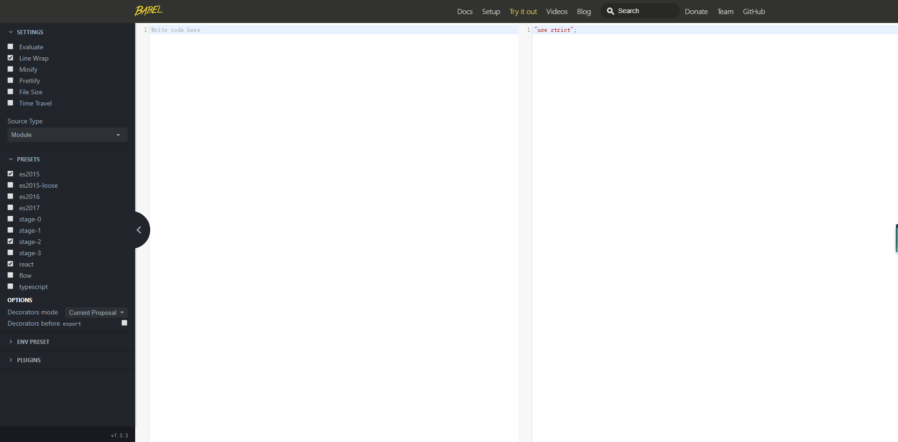
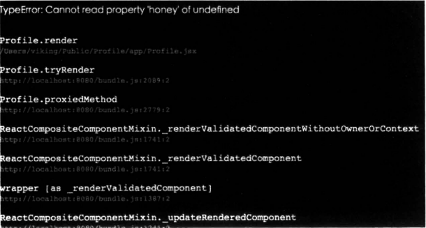
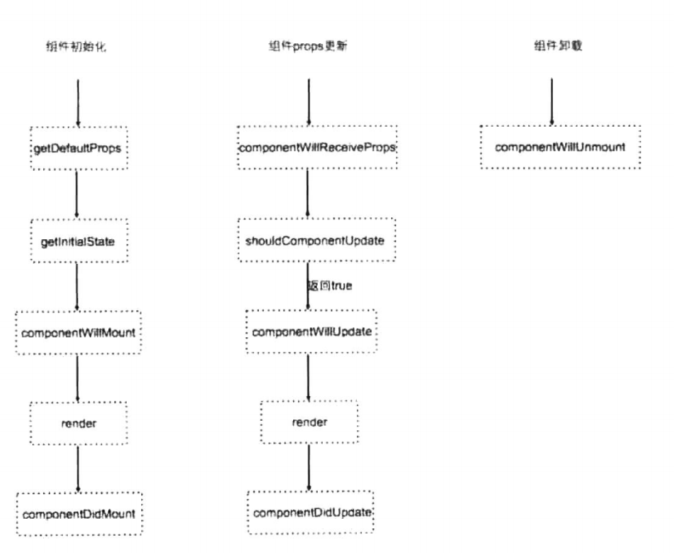

# 第3章 初识React

React是Facebook推出的一个JavaScript库，它的口号就是”**用来创建用户界面的JavaScript库**“，所以它只是和用户的界面打交道，你可以把它看成MVC的V（视图）这一层。现在前端领域各种框架和库层出不穷，那么是什么原因让React如此流行呢？在本章中，我们会探索React非同寻常的特色。

简单来说，它有三大颠覆性的特点。

**1. 组件**

**React的一切都是基于组件的。**Web世界的构成是基于各种HTML标签的组合，这些标签天生就是语义化组件的表现，还有一些内容是这些标签的组合，比如说一组幻灯片、一个人物简介界面、一组侧边栏导航等，可以称之为自定义组件。React最重要的特性是基于组件的设计流程。使用React，你唯一要关心的就是构建组件。组件 有着良好的封装性，组件让代码的复用、测试和分离都变得更加简单。各个组件都有各自的状态，当状态变更时，便会重新渲染整个组件。组件特性不仅仅是React的专利，也是未来Web的发展趋势。React顺应了时代发展的方向，所以它如此流行也就变得顺其自然。

一个组件的例子如下。

```jsx
//Profile.jsx
import React from 'react';
export default Class Profile extends React.Component{
    render(){
        return (
            <div className="profile-component">
                <h2>Hi, I am {this.props.name}</h2>
            </div>
        )
    }
}
```

用这种方式，就实现了一个React的组件，在其他的组件中，可以像HTML标签一样引用它。

```js
import Profile from './profile';
export default function (props) {
    return {
        <Profile />
    }
}
```

**2. JSX**

通过上面的例子可以看出，在render方法中有一种直接把HTML嵌套在JS中的写法，它被称为JSX。这是一种类似XML的写法，它可以定义类似HTML一样简洁的树状结构。这种语法结合了JavaScript和HTML的优点，既可以像平常一样使用HTML，也可以在里面嵌套JavaScript语法。这种友好的格式，让开发者易于阅读和开发。而且，对于组件来说，直接使用类似HTML的格式，也是非常合理的。但是，需要注意的是。JSX和HTML完全不是一回事，JSX只是作为编译器，把类似HTML的结构编译成JavaScript。

当然，在浏览器中不能直接使用这种格式，需要添加JSX编译器来完成这项工作。

**3. Virtual DOM**

在React的设计中，开发者不太需要操作真正的DOM结点，每个React组件都是用Virtual DOM渲染的，它是一种对于HTML DOM结点的抽象描述，你可以把它看成是一种用JavaScript实现的结构，它不需要浏览器的DOM API支持，所以它在Node.js中也可以使用。它和DOM的一大区别就是它采用了更高效的渲染方式，组件的DOM结构映射到Virtual DOM上，当需要重新渲染组件时，React在Virtual DOM上实现了一个Diff算法，通过这个算法寻找需要变更的结点，再把里面的修改更新到实际需要修改的DOM结点上，这样就避免了整个渲染DOM带来的巨大成本。

React改变了传统强队开发的固定模式，当然还有React Native，把它的魔力扩展到Web应用以外。在下面的章节里，会根据这三大特性做详细的讲解。

## 3.1 使用React与传统前端开发的比较

凡事都有动机，在开始使用React之前，首先要搞清楚一件事：React到底给前端开发带来了什么改变，是什么支撑我们接受这样一个新事物的学习成本，把它的方案引入到工作中。

为了回答这些问题，我们决定从一个前端工程师的日常触发。

首先，以一个可选列表（单选）为例，列表由多个列表项组成，每个列表项有选中状态和普通状态，单击某项选中该项。最多可选中一项，即选中某项后先前的选中项变回普通状态。

### 3.1.1 传统做法

下面使用传统的方式来实现这个列表的逻辑。

```js
// 列表容器
const wrapper=${'#list-wrapper'};

// 列表所需数据
const data:{
    list:[1,2,3],
    activeIndex:-1
};

// 初始化行为
function init(){
    wrapper.on('click','li',function(){
        activate($(this).data('index'));
    });
    wrapper.html(template.render(data))
)

// 选中某项的行为
function activate(index){
    wrapper.find('li').removeClass('active');
    wrapper.find('li[data-index='+index+']').addClass('active');
    data.activeIndex = index;
}
```

下面是模版的内容。

```html
<ul>
    {{ each list item index }}
    	{{ if index === activeIndex }}
    		<li data-index="{{index}}" class="active">{{item}}</li>
    	{{ else }}
    		<li data-index="{{index}}">{{item}}</li>
    	{{ /if }}
    {{ /each }}
</ul>
```

列表组件的数据包含两部分：list及activeIndex。list是列表内容，activeIndex是当前选中项的索引。初始化（init）的时候，使用data渲染模版来产生原始DOM。在后续的交互中，每次单击列表项都触发一次选中（activate），activate方法会移除其他项的active状态，并给本次选中的项添加active状态，它同时也会更新activeIndex信息，使其与DOM元素的表现相符。

这是一种很常见的做法，尤其在许多比本例复杂得多的组件实现中很常见。我们习惯于以这种方式实现UI组件，而忽略了它严重的缺陷：需要同时维护数据及视图。模版引擎帮助我们解决了初始状态下二者的对应关系，即初始化时给出一个合理的数据就行了，视图会自动（通过模版渲染）生成。然而，在组件状态变化时，它们依然是需要被各自维护的。

对此，一般的MVVM框架的做法是，通过对模版的分析获取数据与视图元素（DOM节点）细致而具体的对应关系，然后对数据进行监控，在数据变化时更新对应的视图元素。然而，传统的流行模版基本都是通用模版，渲染仅仅是文本替换的过程，在语法上不足以支持MVVM的需求，因此一般的MVVM框架都会在HTML的基础上扩展得到一套独特的模版语法，使用自定义的指令（Directive）进行逻辑的描述，从而使得这部分逻辑可以被解析并复用。

独特的语法和丰富的指令同时也成为MVVM的门槛之一，我们可不可以不学习这些，也能得到复用“数据生成视图”逻辑的效果呢？其实有一个简单（然而问题很大）的做法。

### 3.1.2 全量更新

下面对先前的实现稍作改动。

```js
const wrapper = $('#list-wrapper');

const data: {
    list: [1, 2, 3],
    activeIndex: -1
};

function render() {
    wrapper.html(template.render(data));
}

function init() {
    wrapper.on('click', 'li', function () {
        activate($(this).data('index'));
    });
    render();
}

function activate(index) {
    data.activeIndex = index;
    render();
}
```

可以看到，把初始化时渲染的逻辑单独抽出为render方法，除在init时调用外，在选中某项（或任意的状态变更）时、更新数据后，同样可以通过直接调用render方法进行视图的更新。

模版本身就是一份“数据生成视图”的逻辑。这份逻辑得到复用的时候，只需要维护数据，每次数据发生变化时，渲染一下就能更新视图。如果对数据本身进行监听，这个行为甚至可以自动化完成。对于开发用户界面应用，这实在是一个再自然不过的做法，逻辑清晰，更容易被理解与维护。

然而，这只是一个再简单不过的Demo，在真实的业务中，这么做的缺陷比第一种做法更突出：①每次数据变动都要整体重新渲染，性能会非常差，尤其在数据变动频繁、界面复杂时；②每次渲染都重新生成所有的DOM节点，那么在这些DOM节点上绑定的事件及外部持有的对这些DOM节点的引用都将失效。

那么可不可以既享受第二种做法带来的逻辑实现上的优势，又避开它的缺陷呢？答案是React。

### 3.1.3 使用React

如果使用React把这个例子重新实现一遍的话，它可能是如下这样的（为了清晰简单，这里把list也放在组件的state中，在实际的实现中，通过props将list传入组件会更合适）。

```jsx
class List extends React.Component {
    constructor(props) {
        super(props);
        this.state = {
            list: [1, 2, 3],
            activeIndex: -1
        };
    }
    activate(index) {
        this.setState({
            activeIndex: index
        });
    }
    render() {
        const { list, activeIndex } = this.state;
        const lis = list.map(
            (item, index) => {
                const cls = index === activeIndex ? 'active' : '';
                return (
                    <li
                        key={index}
                        className={cls}
                        onClick={() => this.activate(index)} >
                    </li >
                )
            }
        )
        return (
            <ul> {lis}</ul >
        );
    }
}
```

不难看出，除了React特有的Component接口、字段及JSX语法等，在基于React Component的实现中，整体逻辑组成与第二个例子是类似的：首次选了通过render得到界面，每个li的点击出发activate方法，activate方法调用setState更新状态信息，setState会出发重新render（React提供了这一机制），从而使界面得到更新。

那么刚才的两个缺点是怎么解决的呢？

在具体分析之前，首先要说明一点：JSX内容的渲染结果其实不是真实的DOM节点，本质上是JavaScript对象的虚拟DOM节点，它记录了这个节点的所有信息，可以依据一定的规则生成对应的真实DOM节点。

**1. 性能问题**

我们知道前端的性能瓶颈大多数时候都在于操作DOM，所以如果避开操作DOM，只是重新生成虚拟的DOM节点（JavaScript对象），本身是很快的。在将虚拟的DOM对应生成真实DOM节点之前，React会将虚拟的DOM树与先前的进行比较（Diff），计算出变化的部分，再将变化的部分作用到真实DOM上，实现最终界面的更新。得益于Diff算法的高效，整个过程的代价大致接近于最终操作真实DOM的代价，即与最初的实例很接近了。二者的区别在于，React以额外的计算量换取了对于更新点的自动定位，以框架本身复杂的代码实现换取了业务代码逻辑的清晰简单。

**2. DOM事件与引用失效**

在React的哲学里，直接操作DOM是典型的反模式。React对DOM事件进行了封装并提供了相应的接口。值得注意的是，React提供的事件绑定接口与其界面声明方式是一脉相承的，事件绑定表现为，值为回调函数的组件属性（props）。这样的好处是，绑定事件的过程自然地变成了界面渲染（render）的一部分，无须特别处理。

在事件绑定与读/写操作都被React通过抽象层屏蔽后，业务代码基本无须接触真实DOM，需要持有引用的场景自然也不复存在，引用失效也就无从说起。

### 3.1.4 小结

最后总结一下，React的出现允许我们以简单粗暴的方式构建我们的界面：仅仅声明数据到视图的转换逻辑，然后维护数据的变动，自动更新视图。它看起来很像每次状态更新时，都需要整体地更新一次视图，但React的抽象层避免了这一做法带来的弊端，让这一开发方式变得可行。

## 3.2 JSX

### 3.2.1 来历

下面这一段是官方文档中的引用，它可以解释JSX这种写法诞生的初衷。

We strongly believe that components are the right way to sparate concerns rather than “templates” and “display logic.” We think that markup and the code that generates it are intimately tied together. Additionally, display logic is often very complex and using template languages to express it becomes cumbersome.

多年依赖，在传统的开发中，把模板和功能分离看作是最佳实践的完美例子，翻阅形形色色的框架文档，总有一个模板文件夹里面放置了对应的模板文件，然后通过模板引擎处理这些字符串，来生成把数据和模板结合起来的字符。而React认为世界是基于组件的，组件自然而然和模板相连，把逻辑和模板分开放置是一种笨重的思路。所以，React创造了一种名为JSX的语法格式来架起他们之间的桥梁。

### 3.2.2 语法

**1. JSX不是必需的**

JSX编译器把类似HTML的写法转换成原生的JavaScript方法，并且会将传入的属性转化为对应的对象。它就类似于一种语法糖，把标签类型的写法转换成React提供的一个用来创建ReactElement的方法。

```jsx
const MyComponent;
//input JSX,在JS中直接写类似HTML的内容，前所未有的感觉。其实它返回的是一个
//ReactElement
let app = <h1 title="my title">this is my title</h1>;
//JSX转换后的结果
let app = React.createElement('h1',{title:'my title'},'this is my title');
```

**2. HTML标签与React组件**

React可以直接渲染HTML类型的标签，也可以渲染React的组件。

React组件会在下面几章详细介绍，这里读者可以把它看作一个特殊对象。

HTML类型的标签第一个字母用小写来表示。

```jsx
import React from 'react';
// 当一个标签里面为空的时候，可以直接使用自闭和标签
// 注意class是一个JavaScript保留字，所以如果要写class应该替换成className
let divElement = <div className="foo" />
// 等同于
let divElement = React.createElement('div', { className: 'foo' });
```

React组件标签第一个字母用大写来表示。

```jsx
import React from 'react';
class Headline extends React.component {

    render() {
        // 直接return JSX语法
        return <h1>Hello React</h1>
    }
}
let headline = <Headline />
// 等同于
let headline = React.createElement(Headline);
```

JSX语法使用第一个字母大小写来区分是一个普通HTML标签还是一个React组件。

注意：因为JSX本身是JavaScript语法，所以一些JavaScript中的保留字要用其他的方式书写，比如第一个例子中class要写成className。

**3. JavaScript表达式**

在给组件传入属性的时候，有一大部分的情况是要传入一个JavaScript对象的，那么基本的规则就是当遇到{}这个表达式的情况下，里面的代码会被当作JavaScript代码处理。

属性表达式如下。

```jsx
const MyComponent;
let isLoggedIn = true;
let app = <MyComponent name={isLoggedIn ? 'viking' : 'please login'} />
```

子组件表达式如下。

```jsx
const MyComponent, LoginForm, Nav;
let isLoggedIn = true;
let app = <MyComponent>{isLoggedIn ? <Nav /> : <LoginForm />}</MyComponent>
```

由上面两个例子可以得到一个基本规律。在JSX语法中，当遇到标签的时候就解释成组件或者HTML标签，当遇到{}包裹的时候就当成JavaScript代码来执行。

布尔类型属性如下。

当省略一个属性的值的时候，JSX会自动把它的值认为是true。

```jsx
let myButton = <input type="button" disabled />
//等同于
let myButton = <input type="button" disabled={true} />
```

**4. 注释**

要在JSX中使用注释，沿用JavaScript的方法，需要注意的是，在子组件位置需要用{}括起来。

```jsx
let component = (
    <div>
        {/*这里是一个注释*/}
        <Headline />
    </div>
);
```

**5. JSX属性扩散**

加入一个组件有很多属性，当然可以如下这样做。

```jsx
const Profile;
let props = {
    name: 'viking',
    age: 10,
    gender: 'Male'
};
// 用这种方式可以很方便地完成上一个例子里面的操作
let component = <Profile {...props} />;
```

你可以多次使用这种方法，还可以和别的属性组合在一起。需要注意的是，顺序是重要的，越往后的属性会覆盖前面的属性。

```jsx
...
let component = <Prefile {...props} name='viking2' />
console.log(component.props.name);
// viking2
```

神奇的“…”到底是什么？“…”操作符（扩散操作符）在ES6的数组上已经获得了广泛的使用，在第1章介绍ES6语法的时候也有所提及。对象的扩散操作符也会在ES7中得到实现，这里，JSX直接实现了未来的JavaScript，带来了更多的便利。

### 3.2.3 编译JSX

JSX不能直接在浏览器中使用，需要一种编译工具把它编译成React.CreateElement方法。有很多种方法可以来完成这个任务。

Facebook提供了一个简单的工具为JSXTransformer，它是面向浏览器的，你可以把它直接引入到HTML文档中。

```html’
<script src="http://fb.me/JSXTransformer-0.14.7.js"></script>
<script type="text/jsx">
// JSX写在这里
</script>
```

这是一种简单但是非常笨拙的方法，因为要在浏览器端完成这些编译工作，那样肯定会大大地影响效率。所以，这里推荐使用第1章中介绍过的Babel来完成编译的任务。在第4章中会介绍如何使用webpack配合Babel搭建一个完整的开发环境。在这里，读者可以使用Babel提供的在线编译器来观察一下代码编译的过程。如图3-1所示为Babel在线编译器编译JSX。



> 网址为：https://babeljs.io/repl/。

### 3.2.4 小结

JSX看起来就是HTML，每个前端开发者都可以很快地熟悉上手。但是，请记住它不是真正的HTML，也和DOM没有关系。它像是一种React.createElement写法的语法糖，是快速高效书写这个函数的方法，它返回的是ReactElement，一种JavaScript的数据结构。

## 3.3 React+webpack开发环境

前面学习了JSX的一些语法特性，但是需要一些工具把JSX这种语法编译成浏览器可以读懂的语言。那么，在开始介绍组件之前，先来为项目配置webpack和React的开发环境，webpack易于配置，与React配合简单易用，同时引入具有强大魔力的Babel，让你可以轻松地用最新的标准来书写你的React代码。

本在完成的完整代码示例可以参考https://github.com/vikongmute/webpack-react-codes/tree/master/chapter3/part3。

创建一个项目文件夹，并且用`npm init –yes`命令生成一个`package.json`文件作为开始。确认是否安装了webpack和webpack-dev-server，使用`npm install webpack webpack-dev-server -g`进行全局安装，或者也可以使用`npm install webpack webpack-dev-server –save-dev `直接作为项目的依赖。

### 3.3.1 安装配置Babel

在第1章中介绍过Babel，它是一个JavaScript编译器。现在在这里使用Babel的目的有两个，一个是让代码支持ES6的语法，一个是支持React的一些特性（例如：JSX语法）。正好有两个presets可以完成这两个任务。

* babel-preset-es2015 ES6语法包，有了这个语法包，你的代码可以随意地使用ES6的新特性，const、箭头操作符等信手拈来。
* babel-preset-react React语法包，这个语法包专门用于React的优化，让你在代码中可以使用React ES6 classes的写法，同时直接支持JSX语法格式。

**1. 安装Babel loader**

在第2章中介绍过webpack中的loader，它作用于文件特定格式的转换，那么在这里需要安装Babel loader。

```bash
// 安装babel-core核心模块和babel-loader
npm install babel-core babel-loader --save-dev
// 安装ES6和React支持
npm install babel-preset-es2015 babel-preset-react --save-dev
```

**2. 配置.babelrc**

安装完Babel和它的插件，配置一下它的规则。在项目根目录下新建一个.babelrc空文件。

用编译器打开，然后输入如下内容。

```json
// 告诉Babel，编译JavaScript代码的时候要用这两个presets编译
{
    "presets": ["es2015", "react"]
}
```

### 3.3.2 安装配置ESLint

在多人开发项目中，代码规范也是非常重要的环节，不同的人有着不同的习惯，有时候会给开发造成很大的影响，所以各种代码检查工具开始陆续登场。读者也许听说过JSLint、JSHint、JSCS等工具，那么这里使用一个最新的后起之秀，它就是ESLint。它的强大之处和Babel有点相似，提供一个完成 可配置的检查规则，而且提供了非常多的第三方plugin，适合不同的开发场景，输出的错误信息也非常清晰，同时最酷的一点是它有着ES6语法的最佳支持，还支持JSX语法，它简直就是React应用代码规范的绝配。

**1. 安装ESLint loader**

同样为webpack添加这个loader，其实更严格来说，它应该被称为preLoaders。preLoaders，顾名思义，就是在loader处理该资源之前，先用preLoaders进行处理，因为代码检查肯定是要在转换代码之前进行的。

```bash
npm install eslint eslint-loader --save-dev
```

刚才说过ESLint有很多第三方配置好的格式插件，那么在这里使用AIrbnb开发配置合集eslint-config-airbnb，这个配置合集里面还包括如下3个插件。

```bash
npm install eslint-plugin-import eslint-plugin-react eslint-plugin-jsx-ally --save-dev
npm install eslint-config-airbnb --save-dev
```

**2. 配置.eslintrc**

和Babel类似，ESLint也是通过配置文件来定义它的检查规则的，在根目录下新建一个.eslintrc的文件，同时写入如下代码。

```json
{
    "extends": "airbnb",
    "rules": {
        "comma-dangle": ["error", "never"]
    }
}
```

这个配置文件的意思就是直接继承eslint-config-airbnb的配置规则，同时也可以写入自己特定的规则，后面的内容会覆盖默认的规则。例如，comma-dangle:[“error”,“never”]，在自定义这项之前，一个对象或数组的最后一项是要加逗号的，要写成[1,2,3,4,]才可以，但是对于我个人来说，我喜欢最后一项不加逗号，所以我修改了这条规则。想了解ESLint的更多用法，可以去官方网站一探究竟。

### 3.3.3 配置webpack

已经配置好了两大工具——Babel和ESLint，那么现在可以使用webpack把它们结合在一起。

这里再安装一个webpack的插件，称作html-webpack-plugin，它可以帮助我们自动生成HTML页面，并且引入正确的JavaScript文件依赖。

```bash
npm install html-webpack-plugin --save-dev
```

在项目根目录下新建一个webpack.config.js文件。

```js
var path = require('path');
var webpack = require('webpack');
var HtmlwebpackPlugin = require('html-webpack-plugin');
//一些常用路径
var ROOT_PATH = path.resolve(__dirname);
var APP_PATH = path.relative(ROOT_PATH, 'app');
var BUILD_PATH = path.relative(ROOT_PATH, 'build');

module.exports = {
    entry: {
        app: path.resolve(APP_PATH, 'index.jsx')
    },
    output: {
        path: BUILD_PATH,
        filename: 'bundle.js'
    },
    //开启dev source map
    devtool: 'eval-source-map',
    //开启webpack dev server
    devServer: {
        historyApiFallback: true,
        hot: true,
        inline: true,
        progress: true
    },
    module: {
        //配置preLoaders，将eslint添加进入
        preLoaders: [{
            test: /\.jsx?$/,
            loaders: ['eslint'],
            include: APP_PATH
        }],
        //配置loader，将Babel添加进去
        loaders: [{
            test: /\.jsx?$/,
            loaders: ['babel'],
            include: APP_PATH
        }]
    },
    //配置plugin
    plugins: [
        new HtmlwebpackPlugin({
            title: 'My first react app'
        })
    ]
}
```

上面的配置文件并不特殊，复习一下第2章的知识，把app文件夹中的index.jsx作为入口，用配置好的babel-loader处理它，在Babel处理之前先用ESLint检查代码的格式，最后使用HtmlwebpackPlugin在build文件夹中生成处理后的HTML文件。

这里还需要添加一个resolve的参数，把JSX扩展名添加进去，这样就可以在JS中import加载JSX扩展名的脚本。

```js
... 
resolve: {
     extensions: ['', '.js', '.jsx']
 }
...
```

下面在npm中添加webpack启动命令。

npm可以添加自定义命令，将两条命令添加到package.json里面，一个是运行webpack命令、build整个项目，一个是启动本地的webpack-dev-server来进行开发：

```bash
...
"scripts": {
    "build":"webpack",
    "dev": "webpack-dev-server --hot"
},
...
```

### 3.3.4 添加测试页面

工具都已经配置完毕，添加一个简单的测试页面。

把React库添加到项目中。

```bash
npm install react react-dom --savec
```

新建app.jsx文件。

```jsx
import React from 'react';
import ReactDOM from 'react-dom';

class App extends React.Component {
    constructor(props) {
        super(props);
    }
    render() {
        return (
            <div className="container">
                <h1>Hello React!</h1>
            </div>
        )
    }
};

const app = document.createElement('div');
document.body.appendChild(app);
ReactDOM.render(<APP />, app);
```

在根目录下运行`npm run dev`，webpack-dev-server会新建一个基于Express的服务器，打开服务器的http://localhost:8080发现大标题出现，但是打开控制台或者终端界面，会发现了一些ESLint的错误，如图3-2所示。


错误提示的很清楚，有各种各样的错误，有缺少空额、分号等错误，也有组件书写格式的错误。关于组件的格式规范，会在第4章进行讲解，这里只需要了解即可。接下来把上面的代码修改一下。

```js
import React from 'react';
import ReactDOM from 'react-dom';

function App() {
    return (
        <div className="container">
            <h1>Hello React!</h1>
        </div>
    );
}

const app = document.createElement('div');
document.body.appendChild(app);
ReactDOM.render(<App />, app);
```

这次大功告成，错误提示全部都消失了。

### 3.3.5 添加组件热加载（HMR）功能

现在每次修改一次组件的代码，页面都会重新刷新，这会造成很糟糕的问题，程序会丢失状态。当然，现在在简单的程序中，这完全无所谓，但是，假如程序变得越来越复杂，想要返回这种状态，你可能又要经历一系列的点击等操作，会耗费一些时间。如果更新代码以后只更新局部组件，而对全局页面不要求直接强制刷新，那岂不是非常美妙？

第2章讲到webpack支持HMR（Hot Module Replacement），这里自然而然地会想到这种解决方案。不过早就有一些人帮我们做好了类似的工作，只要简单安装一个Babel的preset，就可以轻松地完成这项工作。

```
npm install babel-preset-react-hmre –save-dev
```

这个preset里面其实包含两方面。

* react-transform-hmr用来实现上面所说的热加载；
* react-transform-catch-errors用来捕获render里面的方法，并且直接展示在界面上。

配置一下.babelrc如下。

```json
{
    "presets": ["react", "es2015"],
    //在开发的时候才启用HMR和Catch Error
    "env": {
        "development": {
            "presets": ["react-hmre"]
        }
    }
}
```

配置完毕，启动npm run dev。

看一下效果，然后随便改动h1标签里面的文字，发现页面没有被刷新，但是内容自动改变了。在render方法中故意设置一些错误，出现了红色错误提示，大功告成，如图3-3所示。



### 3.3.6 小结

本节的内容到此结束。已经设置好React和webpack的开发环境，它支持的特性有以下几点。

* 支持ES6的语言特性。
* 支持JSX语法。
* 使用ESLint作为代码检查工具。
* 支持HMR热加载。

有了这几个优点，在下面的React开发章节中，就可以把它作为通用的开发环境了。

## 3.4 组件

**组件是React的基石，所有的React应用程序都是基于组件的。**

在3.3节中，开发环境已经成功配置完毕。在本节中我们会最终完成一个React组件的设计，并通过这个例子慢慢展开描述各种关于React组件的概念。

之前的React组件，是使用React.createClass来声明的。

```jsx
var List = React.createClass({
    getInitialState: function () {
        return ['a', 'b', 'c']
    },
    render: function () {
        return (...);
    }
});
```

就像第1章描述过的一样，本书中的代码全都使用了ES6的写法。当然，React官方也在第一时间就支持了ES6 class的写法，这种写法可读性更高，一个直观的表现就是不用写getInitialState方法了，可以直接在constructor里面定义this.state的值。所以，以后的代码全部采用了这样的格式。

```jsx
import React from 'react';

class List extends React.Component {
    constructor() {
        super();
        this.state = ['a', 'b', 'c'];
    }
    render() {
        return (...);
    }
}
```

现在要建立的是一个个人的页面，成为Profile。最后完成的效果如图3-4所示。


这个例子几乎涵盖了关于React的所有概念。

完整代码可以参考https://github.com/vikingmute/webpack-react-codes/tree/master/chapter3/part4。

### 3.4.1 props属性

现在来新建一个组件，称为Profile.jsx。

```jsx
// Profile.jsx
import React from 'react';

export default Class Profile extends React.Component {
    // render是这个组件渲染的Virtual DOM结构
    render() {
        return (
            <div className="profile-component">
                {/*this.props就是传入的属性*/}
                <h1>我的名字叫{this.props.name} </h1>
                <h2>我今年{this.props.age}岁</h2>
            </div>
        );
    }
}
```

它只是简单地输出了一个标题，3.2.2节讲到用JSX直接引入HTML标签也能完成相同的效果。

```jsx
let profile = <div className="profile-component">
    	<h1>我的名字叫viking</h1>
        <h2>我今年20岁</h2>
    </div>
```

有了组件以后，可以使用React提供的另外一个库ReactDOM把这个组件挂载到DOM节点上。

```jsx
// app.jsx
import { render } from 'react-dom';
import Profile from './profile';

render(<Profilename="viking"age=20/>,document.getElementById('container'));
// 或者可以使用"..."属性扩展
const props = {
    name: 'viking',
    age: 20
};
render(<Profile {...props} />,document.getElementById('container'));
```

实现后的截图如图3-5所示。


在JSX一节中已经提到过props就是传入组件的属性，由外部的JSX传入，在组件内部可以通过this.props来访问。在上面的例子中，name、age就是传入的属性，传入多个属性时可以使用“…”属性扩展。

下面来验证组件的属性。

当程序结构变得越来越复杂的时候，组件的复杂程度也会成倍地提高，所以一项很重要的工作就是验证组件传入的属性。比如说上面组件的age属性，应该传入数字类型，那么如果传入一个数组，肯定就会出现问题，所以React可以让用户定义组件属性的变量类型。

```jsx
import { PropTypes } from 'react';

const propTypes = {
    // 验证不同类型的JavaScript变量
    optionalArray: PropTypes.array,
    optionalBool: PropTypes.bool,
    optionalFunc: PropTypes.func,
    optionalNumber: PropTypes.number,
    optionalObject: PropTypes.object,
    optionalString: PropTypes.string,

    // 可以是一个ReactElement类型
    optionalElement: PropTypes.element,

    // 可以是别的组件的实例
    optionalMessage: PropTypes.instanceOf(Message),

    // 可以规定为一组值其中的一个
    optionalEnum: PropTypes.oneOf(['News', 'Photos']),

    // 可以规定是一组类型中的一个
    optionalUnion: PropTypes.oneOfType([
        PropTypes.string,
        PropTypes.number,
        PropTypes.instanceOf(Message)
    ]),

    // 可以在最后加一个isReauired，表明这个属性是必需的，否则就会返回一个错误
    requiredFunc: React.PropTypes.func.isRequired
}
```

了解了这么多种属性的验证，接下来给刚才简单的组件添加验证。

```jsx
import React, { PropTypes } from 'react';
// 需要验证的属性
const propTypes = {
    name: PropTypes.string.isRequired,
    age: PropTypes.number.isRequired
};

class Profile extends React.Component {
    // render是这个组件渲染的Vitrual DOM结构
    render() {
        return (
            <div className="profile-component">
                {/* this.props就是传入的属性 */}
                <h1>我的名字叫{this.props.name}</h1>
                <h2>我今年{this.props.age}</h2>
            </div>
        )
    }
}

// 将验证赋值给这个组件的propTypes属性
Profile.propTypes = propTypes;

export default Profile;
```

### 3.4.2 state状态

state是组件内部的属性。组件本身是一个状态机，它可以在constructor中通过this.state直接定义它的值，然后根据这些值来渲染不同的UI。当state的值发生改变时，可以通过this.setState方法让组件再次调用render方法，来渲染新的UI。

现在改造一下简单的组件，给它添加一个状态，一个“点赞”的按钮，每单击一次，就给赞的次数加1。

```jsx
import React, { PropTypes } from 'react';
export default class Profile extends React.Component {
    constructor(props) {
        super(props);
        this.state = {
            liked: 0
        };
        this.likedCallback = this.likedCallback.bind(this);
    }

    likedCallback() {
        let liked = this.state.liked;
        liked++;
        this.setState({
            liked
        });
    }

    render() {
        return (
            <div>
                <h1>我的名字叫{this.props.name}</h1>
                <h2>我今年{this.props.age}</h2>
                <button onClick={this.likedCallback}>给我点赞</button>
                <h2>总点赞数：{this.state.liked}</h2>
            </div>
        )
    }
}
```

实现后的截图如图3-6所示。


和上面描述的一样，在constructor中添加this.state的定义，每次单击按钮以后调用回调函数，当当前liked值加1，然后更新this.setState，完全UI的重新渲染。因为在ES6 class类型的component组件声明方式汇总，不会把一些自定义的classback函数绑定到实例上，所以需要手动在constructor里面绑定。

```jsx
this.likedCallback = this.likedCallback.bind(this);
```

React组件通过props和state的值，使用render方法生成一个组件的实例。

上面通过单击的event handler可以看到，这种写法和在普通的DOM元素上写事件回调没有任何差异，接收起来完全没有成本。其实这是React自己实现的合成事件，它完成符合W3C的标准，并且处理了不同浏览器不同的兼容性问题。React并未把事件绑定在特定的DOM结点上，实际上它是用事件代理的方式在最外层绑定了一个事件回调，当组件unmounted的时候，这个事件回调会被自动删除。

### 3.4.4 组件声明周期

每个生物都有它自己的生命周期，从出生、少年、成年再到死亡。同理，组件也有它特定的生命周期，React用不同的方法来描述它的整个生命周期。现在，要稍微修改一下组件的代码，当组件加载完毕1秒以后，使liked的值自动加1。

```jsx
...
componentDidMount(){
    setTimeout(()=>{
        this.likedCallback();
    },1000);
}
...
```

componentDidMount这个方法就是在render完成并且组件装载完成之后调用的方法，所以界面中先显示0,1秒以后此方法被调用，界面被重新渲染，liked值变成了1。

整个生命周期可以用途3-7描述。



如图3-7所示，生命周期可以分为以下几部分。

**1. 组件首次加载**

* **getDefaultProps **只会在装载之前调用一次，在组件中赋值的数据会被设置到this.props中。
* **getInitialState** 只会在装载之前调用一次，这个函数的返回值会被设置到this.state 中。需要注意的是，在ES6的写法中，只需写在constructor中即可，如下。

```jsx
class MyComponent extends React.Component {
    constructor(props){
        super(props);
        // 在这里声明state
        this.state = {count: 0};
    }
}
```

* **componentWillMount** 在render之前被调用，可以在渲染之前做一些准备工作。
* **render** 这个方法是组件的一个**必要**方法。当这个方法被调用的时候，应该返回一个ReactElement对象，该对象在3.2.2节中被提到过。render是一个纯函数，它的意义就是在给定相同的条件时，它的返回结果应该每次都是完全一致的。不应该有任何修改组件state的代码或者是和浏览器交互的情况。
* **componentDidMount** 只会在装载完全之后调用一次，在render之后调用，从这里开始获取组件的DOM结构。如果想让组件加载完毕后做一些额外的操作（比如AJAX请求等），可以在这个方法中添加相应的代码。

**2. 组件props更新**

当组件接收到新的props的时候，会依次触发下列方法。

* **componentWillreceiveProps(object nextProps)**，在组件接收到新的props的时候被触发，参数nextProps就是传入的新的props，你可以用它和this.props比较，来决定是否用this.setState实现UI重新渲染。
* **shouldComponentUpdate**，在重新render之前被调用，可以返回一个布尔值来决定一个组件是否要更新，如果返回false，那么前面的流程都不会被触发。这个方法默认的返回值都是true。
* **componentWillUpdate**，在render之前被调用，可以在渲染之前做一些准备工作，和componentWillMount类似。
* **render**，和组件首次加载的方法相同。
* **componentDidUpdate**，重新渲染完成以后立即调用，和componentDidMount类似。

**3. 组件卸载**

componentWillUnmount，在组件被卸载和销毁之前调用的方法，可以在这里做一些清理的工作。

### 3.4.4 组合组件

React应用建立在各种组件基础上，那么自然地，一个组件也可以包含多个其他组件。现在，扩展一下刚才的应用，显示一个爱好列表，那么这个新的组件被称为Hobby.jsx。

```jsx
import React, { PropTypes } from 'react';

const propTypes = {
    hobby: PropTypes.String.isRequired
};

class Hobby extends React.Component {
    render() {
        return <li>{this.props.hobby}</li>;
    }
}

Hobby.prototypes = propTypes;

export default Hobby;
```

非常简单，只是输出列表中的一项。现在把它引入到Profile中，在3.2.2节讲过，组件可以直接用标签的形式放入JSX中。

```jsx
import Hobby from './Hobby';

...
constructor(props){
    super(props);
    // 在state中添加两个爱好
    this.state = {
        liked: 0,
        hobbies: [
            'skateboarding', 'rock music'
        ]
    };
    ...
    render() {
        return (
            <div>
                <h1>我的名字叫{this.props.name}</h1>
                <h2>我今年{this.props.age}</h2>
                <button onClick={this.likedCallBack}>给我点赞</button>
                <h2>总点赞数：{this.state.liked}</h2>
                <h2>我的爱好：</h2>
                <ul>
                    {this.state.hobbies.map((hobby, i) => <Hobby key={i} hobby={hobby} />)}
                </ul>
            </div>
        )
    }
}
...
```

只要将子组件看成自定义HTML标签就好了，然后传入想要的属性，特别注意要给每个循环组件添加一个唯一的key值。实现后的截图如图3-8所示。


### 3.4.5 无状态函数式组件

Hobby组件非常简单，没有内部state，不需要组件生命周期函数，那么，可以把这类组件写成一个纯函数的形式，成为stateless functional component（无状态函数式组件）。它做的事情只是根据输入生成组件，没有其他的副作用，而且简洁明了。

```jsx
...
// 用一个纯函数表示组件
function Hobby(props) {
    return <li>{props.hobby}</li>;
}
...
```

这种写法很简单，直接导出一个函数，它只有一个参数props，就是传入的属性。在实际的项目中，大部分的组件都是无状态函数式组件，所以这是React推荐的写法。在以后的版本中也会对这种形式进行优化。

### 3.4.6 state设计原则

什么组件应该有state，而且应该遵循最小化state的准则？那就是尽量让大多数的组件都是无状态的。为了实现这样的结构，应该尽量把状态分离在一些特定的组件中，来降低组件的复杂程度。最常见的做法就是创建尽量多的无状态组件，这些组件唯一要关心的事情就是渲染数据。而在这些组件的外层，应该有一个包含state的父级别的组件。这个组件用于处理各种事件、交流逻辑、修改state，对应的子组件要关心的只是传入的属性而已。

state应该包含什么数据？state中应该包含组件的事件回调函数可能引发UI更新的这类数据。在实际的项目中，这些应该是轻量化的JSON数据，应该尽量把数据的表现设计到最小，而更多的数据可以在render方法中通过各种计算来得到。这里举一个例子，比如说现在有一个商品列表，还有一个用户已经选购的商品列表。最直观的设计方法是如下这样的。

```json
{
    goods:[
        {
            "id":1,
            "name":"paper"
        },
        {
            "id":2,
            "name":"pencil"
        }
        ...
    ],
    selectedGoods:[
        {
            "id":1,
            "title":"hello world"
        }
    ],
}
```

这样做当然可以，但是，根据最小化设计state原则，有没有更好的方法呢？ selectedGoods的商品就是goods里面的几项，数据是完全一致的，所以说这里只需保存ID，就可以完成同样的功能。所以可以修改成如下。

```json
selectedGoods:[1,2,3]
```

在渲染这个组件的时候，只需要把要渲染的条目从goods中取出来就可以了。

state不应该包含什么数据？就像上面的例子所描述的一样，为了达到state的最小化，下面这几种数据不应该包含到state中。

* 可以由state计算得出的数据。就像刚才的selectedGoods一样，可以由goods列表计算得出。
* 组件。组件不需要保存到state中，只需要在render方法中渲染。
* props中的数据。props可以看作是组件的数据来源，它不需要保存在state中。

### 3.4.7 DOM操作

在大多数情况下，不需要通过操作DOM的方式去更新UI，应该使用setState来重新渲染UI。但是，有一些情况确实需要范围一些DOM结构（例如表单的值），那么可以采用refs这种方式来获得DOM节点，它的做法就是在要应用的节点上面设置一个ref属性，然后通过this.refs.name获得对应的DOM结构。

继续改造程序，添加一个输入框和一个按钮，能完成添加爱好的功能。

```jsx
render(){
    return (
    	<div>
        ...
            <input type="text" ref="hobby" />
            <button onClick={this.addHobbyCallback}>添加爱好</button>
        </div>
    )
}
```

在button上添加事件——取得input的值，添加到state的值里面。逻辑还是很简单的，下面来完成这个单击的回调。

```jsx
addHobbyCallback(){
    // 用this.refs.name来取得DOM节点
    let hobbyInput = this.refs.hobby;
    let val = hobbyInput.value;
    if (val){
        let hobbies = this.state.hobbies;
        // 添加值到数组
        hobbies = [...hobbies,val];
        // 更新state，刷新UI
        this.setState({
            hobbies
        },()=>{
            hobbyInput.value = '';
        });
    }
}
```

完成后的截图如图3-9所示。


到这里，这个小项目就结束了。通过这个例子了解到了组件的声明、状态和属性、生命周期、与DOM的交互和事件，还有组合组件的用法。组件是React的核心所在，一个基于React的项目都是由各种各样不同的组件所构成的。

## 3.5 Virtual DOM

提起Virtual DOM，总是给人一种高深莫测的感觉，听到的很多说法就是它要比DOM快，那么Virtual DOM到底是何方神圣呢？下面就对Virtual DOM 做一个简单的介绍。

### 3.5.1 DOM

在了解Virtual DOM 之前，不妨再来了解一下和我们息息相关的DOM。它被称为文档对象模型，相信很多前端开发工程师是从一本叫《JavaScript DOM编程艺术》的书开始了解它。它是HTML、XML、XHTML的一种抽象描述，它会把这些文档转成树类型的数据结构，被称为DOM tree。每一片树叶被称为节点。浏览器会提供一系列的API的JavaScript，让它可以拥有操作DOM的魔力。这些API大家都已经很熟悉，比如getElementById，它们就像是一道桥梁连接了DOM和JavaScript。

```js
var item = document.getElementById('test');
item.parentNode.removeChild(item);
```

在当今的Web程序中，由于SPA类型项目的出现，DOM tree的结构也变得越来越复杂，它的改变也变得越来越频繁，有可能有非常多的DOM操作，比如添加、删除或修改一些节点，还有许多的事件监听、事件回调、事件销毁需要处理。由于DOM tree结构的变化，会导致大量的reflow，从而影响性能。

### 3.5.2 虚拟元素

首先要说的是，Virtual DOM是独立React所存在的，只不过React在渲染的时候采用了这个技术来提高效率。前面已经介绍过DOM是笨重而庞大的，它包含非常多个API方法。DOM结构也不过是一些属性和方法的集合，那么可不可以用原生JavaScript的方法来表述它呢？用轻量级的数据能完全代替庞杂的DOM结构来表述相同的内容吗？答案是肯定的。

```js
/* 一个DOM结构，可以用JavaScript这么来表示
* 结构如下
*	<div id="container">
*		<h1>Hello world</h1>
*	</div>
*/
var element = {
    tagName:'div',
    attr:{
        props:{
            id:'container'
        },
        styles:{
            color:'red'
        }
    },
    children:{
        tagName:'h1',
        children:'Hello world'
    }
}
// 用构造函数来模拟一下
function Element(tagName,attr,children){
    this.tagName = tagName;
    this.props = props;
    this.children = children;
};
var headline = new Element('h1',null,'Hello world')
var div = new Element('div',{
    props:{
        id:'container'
    },
    styles:{
        color:'red'
    }
},headline);
```

这样就用一个对象表述了一个类似DOM节点的结构，看起来有点眼熟，对吧？还记得在JSX一节里面讲的内容吗？

```jsx
// JSX转换以后真正调用的API
let headline = React.createElement('h1', null, 'Hello world');
let app = React.createElement('div', { id: 'container', styles: { color: 'red' } }, headline);
// JSX写法
let styles = {
    color: 'red'
};
let app = <div id="container" styles={styles}>
        	<h1>Hello world</h1>
    	</div>
```

从上面的例子可以看出，JSX是一种创造ReactElement的便捷写法，而ReactElement是什么呢？

ReactElement是一种轻量级的、无状态的、不可改变的、DOM元素的虚拟表述。

其实就是用一个JavaScript对象来表述DOM元素而已。我们自己创建的Element对象和ReactElement看起来是完全一致的。

将ReactElement插入真正的DOM中，可以调用ReactDOM的render方法。

```jsx
import React from 'react';
import { render } from 'react-dom';
import App from './app';

render(<App />, document.getElementById('root'));
```

render这个方法大体可以这样写：创建DOM元素，用属性列表循环新建DOM元素的属性。可以用Element对象写一段伪协议。

```jsx
function render(element, root) {
    var realDOM = document.createElement(element.tagName);
    // 循环设置属性和演示，代码简化了解即可
    var props = element.attr.props;
    var styles = element.attr.styles;
    for (var i in props) {
        realDOM.setAttribute(i, props[i]);
    }
    for (var j in styles) {
        realDOM.styles[j] = styles[j];
    }
    // 循环子节点，做同样的事情
    element.children.forEach(function (child) {
        if (child instanceof Element) {
            // 如果是Element对象，递归该方法
            render(child, realDOM);
        } else {
            // 如果是文本，创建文本节点
            realDOM.appendChild(document.createTextNode(child));
        }
    });
    // 最后插入到真实的DOM中
    root.appendChild(realDOM);
    return realDOM;
}
```

注意上面的代码是伪代码，只是让大家了解一下render的大体过程，并不能良好运行。

介绍到这里，感觉没什么稀奇的。Virtual DOM只不过就是DOM结构的JavaScript对象描述。那它比DOM更高效、速度更快体现在哪里呢？下面进行介绍。

### 3.5.3 比较差异

在了解了Virtual DOM的结构后，当发生任何更新的时候，这些变更都会发生在Virtual DOM树上面，这些操作都是对JavaScript对象的操作，速度很快。当一系列更新完成的时候，就会产生一棵新的Virtual DOM树。为了比较两棵树的异同，引入了一种Diff算法，该算法可以计算出新旧两棵树之间的差异。到目前为止，没有做任何的DOM的操作，只是对JavaScript的计算和操作而已。最后，这个差异会作用到真正的DOM元素上，通过这种方法，让DOM操作最小化，做到效率最高。

由于这里的算法比较复杂，就不再深入讲解下去了，这里只讲明白它的原理和过程即可，感兴趣的读者可以自行参阅文档。

现在用伪代码的形式来总结一下整个流程。

```js
// 1. 构建Virtual DOM树结构
var tree = new Element('div',{props:{id:'test'}},'Hello there')；

// 2. 将Virtual DOM树插入到真正的DOM中
var root = render(tree,document.getElementById('container'));

// 3. 变化后的新Virtual DOM数
var newTree = new Element('div',{props:{id:'test2'}},'Hello React');

// 4. 通过Diff算法计算出两棵树的不同
var patches = diff(tree,newTree);

// 5. 在DOM元素中使用变更，这里引入了patch方法，用来将计算出来的不同作用到DOM上
patch(root,patches);
```

通过这5个步骤，就完成了整个Virtual DOM的流程。

现在，通过官方实现的文档，来比较一下和我们的流程是否有出入。

它的实现来自如下Matt Esch的virtual-dom库。

```js
// 引入依赖，分别等同于我们描述的Element、Diff算法、patch方法和render方法
var h = require('virtual-dom/h');
var diff = require('virtual-dom/diff');
var patch = require('virtual-dom/patch');
var createElement = require('virtual-dom/create-element');

// 1. 一个返回Virtual DOM tree的方法
function render(count) {
    // 看起来和我们实现的Element大同小异
    return h('div', {
        style: {
            textAlign: 'center',
            lineHeight: (100 + count) + 'px',
            border: '1px solid red',
            width: (100 + count) + 'px',
            height: (100 + count) + 'px'
        }
    }, [String(count)]);
}

// 初始化一个变量
var count = 0;
// 2. 生成Virtual DOM tree
var tree = render(count);
// 3. 通过虚拟树生成真正的DOM结构并且插入到文档中
var rootNode = createElement(tree);
document.body.appendChild(rootNode);

// 设置一个计时器，1秒后触发
setInterval(function () {
    count++;
    // 4. 生成一棵新的Virtual DOM tree
    var newTree = render(count);
    // 5. 通过Diff算法计算出两棵树的不同
    var patches = diff(tree, newTree);
    // 6. 将计算出来的不同作用到DOM上
    rootNode = patch(rootNode, patchs);
    tree = newTree;
}, 1000);
```

可以看出官方文档流程和之前的流程几乎完全一致。它的核心在于用JavaScript对象来表述DOM结构，使用Diff算法来取得两个对象之间的差异，并且用最少的DOM操作完成更新。

