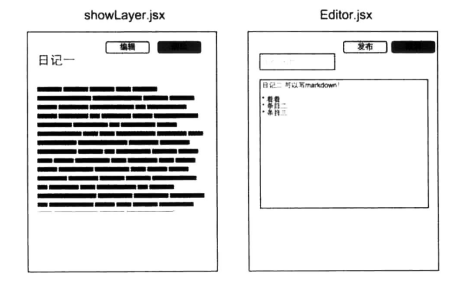

# 第4章 实践React

第3章 讲解了React的基本知识和三大特性，那么本章就结合第3章的内容来开发一个比较简单的实际应用，来加深对React的理解。

下面以被称为Deskmark的项目为例介绍。它优点类似Evernote，就是平常的记事本程序。不过为了迎合各位程序员的喜爱，书写的时候使用Markdown格式，这个程序像Evernote一样都是左右分栏的，左边是文章列表，右边是预览和编辑器。

在本章中，将会介绍React官方推荐的Thinking in React的方式来开发整个项目。经过这个流程，读者肯定会对React的开发方式有一个新的认识。

## 4.1 开发项目

有了本章开始的项目梗概，我们要做的第一件事情不是写代码，而是要画一个简单的原型图，将不同的功能可视化地表现出来。

这个项目会采用React推荐的Thinking in React的开发方式，所以本章不仅是讲这个简单的项目时怎样实现的，而且会给读者提供一个更好的开发React项目的流程。

本章完成的完整代码示例可以参考https://github.com/vikingmute/webpack-react-codes/tree/master/chapter4/part1。

### 4.1.1 将原型图分割成不同组件

经过一番讨论和设计之后，得到了如下的原型图，如图4-1和图4-2所示。




看到原型图后，要做的事情就是在原型图上画方块，然后给它们命名，就像我在图上做的事情一样，这就像是把一个已经拼好的积木拆成一块一块的个体。如果你和设计师一起工作，你可以看到他的PSD文件，也许他已经命名了不同图层。组件的原则是，一个组件理想情况下应该只做一件事情。如果发现它有过多的功能，那么你可以把它分割成更多的子组件。

最终的结果是会有一个被各种颜色方框覆盖的并且命名好了的原型图，这些形形色色的方块就是最后要实现的各个组件。

有了上面的图，就可以很容易地建立起项目的结构。

对项目的结构做出如下规定，所以的组件都放到新建好的components文件夹下，每个组件新建一个文件夹，并将组件的名称作为文件夹的名称，组件的命名统一采用index.jsx的形式，同时样式文件命名为style.scss。

现在可以得出整个组件的简单结构：

* components/
  * Deskmark(整个程序的框架)/
    * index.jsx
    * style.scss
  * CreateBar(新建按钮)/
  * List(左侧文章列表)/
  * ListItem(左侧列表中的每个条目)/
  * ItemEditor(右侧文章编辑器，包含保存和取消两个按钮)/
  * ItemShowLayer(右侧文章展示，包含编辑和删除两个按钮)/

### 4.1.2 创造每个静态组件

在前面React章节中，已经介绍过stateless function（无状态函数）这个概念。当一个组件不需要内部的state、不需要组件的生命周期这些方法的时候，可以把它简写成一个纯函数。这种简便的写法，可以减少代码量。

从功能层面审视所有的组件，不难发现有一些组件只是传入属性、**展示属性的值或者对外输出方法**。ListItem就是典型的例子，它什么都不关心，只是接收一个属性、展示一条文章列表。在这个版本中，不会考虑任何的交互，组件只是静态地展示数据就可以了，那么很自然地，第一个无状态组件就出现了。

```jsx
// 当声明一个组件的时候，采用下面的顺序规则

// 加载依赖
import React, { PropTypes } from 'react';

// 属性验证
const propTyoes = {
    item: PropTypes.object.isRequired,
    onClick: PropTypes.func.isRequired
};

// 组件主体，这里是stateless function，所以直接就是一个函数
function ListItem({ item }) {
    // 返回JSX函数
    return (
        <a href="#" className="list-group-item item-component">
            <span className="label label-default label-pill pull-xs-right">
                {item.time}
            </span>
            {item.title}
        </a>
    );
}

// 添加验证
ListItem.prototype = propTyoes;

// 导出组件
export default ListItem;
```

组件的一个重要特性就是可以复用。别看上面的ListItem非常简单，但它不只可以用于Deskmark程序中，任何项目若需要一条列表条目，它都可以很轻松地胜任，整个程序不用关心它的内部实现，只需要知道可以给它数据，就可以展示一条数据。

同样，List组件也是无状态组件，它只是根据传入的数组展示列表而已，就像是第3章介绍过的组合组件一样，将ListItem组件循环输出，它应该是如下这样的。

```jsx
import ListItem from '../ListItem/index';
...
function List({ items }) {
    // 循环插入子组件
    items = items.map(
        item => (
            <ListItem
                item={item}
                key={item.id}
            />
        )
    );

    return (
        <div className="list-component col-md-4 list-group">
            {items}
        </div>
    );
}
...
```

这一部分并无特殊之处，值得注意的是，在循环展示子组件的时候，每一个子组件都有一个唯一的key值，这是为了保证重新渲染的效率，提高内部Diff算法的效率。所以，当你循环展示一个组件时，这个值是必需的。

左边的组件已经完成，再来创建右边的组件。右边有ItemShowLayer.jsx和ItemEditor.jsx两个组件。

ItemShowLayer也没有什么特殊，只是展示文章标题和内容。只不过唯一要注意的就是，因为要显示的是Markdown转换以后的内容，所以需要装一个库来将Markdown格式转化为HTML文档格式。

```bash
npm install marked -save
```

