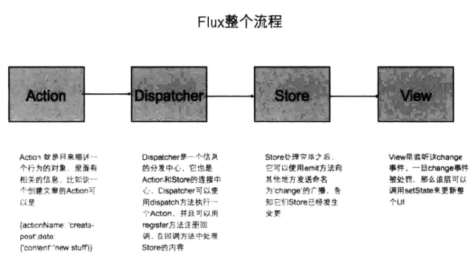
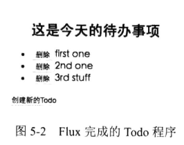
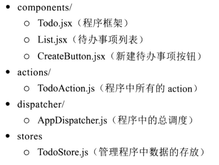
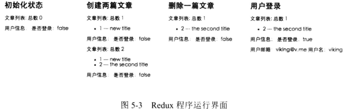

# 第5章 Flux架构及其实现


由第4章开发完毕的Deskmark可以看出，React的核心就是组件，而且它负责的就是view的处理。但是当应用的复杂程度增加的时候，Deskmark的state就会变得越来越复杂，那么只用React开发将会变得力不从心，需要新的工具处理。不仅仅是view层级的内容，还有其他层级的内容，比如说数据流向、state管理、路由解决方案等。React的开发者推出了Flux架构及官方实现，力图解决这些问题。同时，业内也推出了很多其他的Flux实现，其中又以Redux这个库为翘楚。那么，在本章中将会学习到Flux和Redux的基础实现，同时每个库都会配合一个实例来帮助理解。

## 5.1 Flux

Flux是Facebook官方提出的一套前端应用架构模式。它的核心概念就是单向数据流。

它更像是一种软件开发模式，而不是具体的一个架构，所以基于Flux存在很多的实现方式。其实，用Flux架构开发程序不需要引入很多代码，关键是它内在的思想。

### 5.1.1 单向数据流

单向数据流是Flux的核心。读者有可能接触过MVC这种软件架构，它的数据流动是双向的。controller是model和view之间交互的媒介，它要处理view的交互操作，通知model进行更新，同时在操作成功后通知view更新。这种双向的模式在model和view的对应关系变得越来越复杂的时候，就会遇到很多困难，难以维护和调试。

针对MVC的这个弊端，Flux的单向数据流是怎么具体运作的呢？

下面的图5-1可以给你一个粗略的印象。



看完这张图，也许你还是蒙在鼓里，那么，现在来用Flux架构完成一个Todo待办事项的小程序。下面会把其中3个步骤分解开来，让你一步一步地理解Flux的含义。

本章完成的完整代码示例可以参考https://github.com/vikingmute/webpack-react-codes/tree/master/chapter5/part1。

最后完成的程序如图5-2所示。



### 5.1.2 项目结构

按照Flux数据流的几个模块，把程序分为下面这种结构。



### 5.1.3 Dispatcher和action

你可以把Dispatcher看作是一个调度中心，可以把action看作是应用程序的各种交互动作，而每一个动作产生后（例如例子中的新建Todo或者是删除Todo）都会交给Dispatcher这个调度中心来处理。Dispatcher有Facebook的官方实现，成为Flux Dispatcher。

```jsx
// ./dispatcher/AppDispatcher.js
import Flux from 'flux';

export default new Flux.Dispatcher();
```

新建或者删除一个Todo都会产生一个action。

```jsx
// ./components/Todo.jsx
import React from 'react';
import List from './List';
import CreateButton from './CreateButton';
import TodoStore from '../stores/TodoStore';
import TodoAction from '../actions/TodoAction';
import uuid from 'uuid';

class Todo extends React.Component {
    constructor(props) {
        super(props);
        this.state = {
            todos: TodoStore.getAll()
        };
        this.createTodo = this.createTodo.bind(this);
        this.deleteTodo = this.deleteTodo.bind(this);
        this.onChange = this.onChange.bind(this);
    }
    componentDidMount() {
        // 初始化的时候在store中注册这个事件
        TodoStore.addChangeListener(this.onChange);
    }
    componentWillUnmount() {
        // 组件卸载的时候记得要清除这个事件绑定
        TodoStore.removeChangeListener(this.onChange);
    }
    onChange() {
        // store改变后触发的回调，用setState来更新整个UI
        this.setState({
            todos: TodoStore.getAll()
        });
    }
    createTodo() {
        // 创建Todo的事件回调
        TodoAction.create(
            {
                id: uuid.v4(),
                content: '3rd stuff'
            }
        );
    }
    deleteTodo(id) {
        // 删除Todo的事件回调
        TodoAction.delete(id);
    }
    render() {
        return (
            <div>
                <List items={this.state.todos} onDelete={this.deleteTodo} />
                <CreateButton onClick={this.createTodo} />
            </div>
        );
    }
}

export default Todo;
```

当按钮被单击时会发生什么？一个特殊的action会被触发，并且交给Dispatcher处理。下面在TodoAction这个文件里面一探究竟。

```jsx
// ./actions/TodoAction
import AppDispatcher from '../dispatcher/AppDispatcher';

const TodoAction = {
    create(todo) {
        // 创建Todo的action
        AppDispatcher.dispatch({ actionType: 'CREATE_TODO', todo });
    },
    delete(id) {
        // 删除Todo的action
        AppDispatcher.dispatch({ actionType: 'DELETE_TODO', id });
    }
};

export default TodoAction;
```

action没有什么神奇的地方，它只不过是一个普通的JavaScript Object，用一个actionType字段来表明这个action的用途，另外一个字段表明它所传递的信息。在上面的文件中：

```jsx
// 创建Todo的action
{ actionType: 'CREATE_TODO', todo }
// 删除Todo的action
{ actionType: 'DELETE_TODO', id }
```

在这里，dispatch的是一个对象，但是当应用的复杂程度不断增加的时候，就可能在不同的view中dispatch相同的对象，而且必须有着相同的actionType，还要记牢数据的格式，这都不利于代码复用，所以Flux提出了一个新的概念，称为action creator，其实就是把这些数据抽象到一些函数中。就像在TodoAction里面写的一样。

```jsx
// ./actions/TodoAction
import AppDispatcher from '../dispatcher/AppDispatcher';

const TodoAction = {
    create(todo) {
        // 创建Todo的action
        AppDispatcher.dispatch({
            actionType: 'CREATE_TODO',
            todo
        });
    },
    delete(id) {
        // 删除Todo的action
        AppDispatcher.dispatch({
            actionType: 'DELETE_TODO',
            id
        });
    }
};

export default TodoAction;
```

那么现在调用action就可以像Todo.jsx中写的一样。

```jsx
// 创建Todo的事件回调
TodoAction.create( { id: uuid.v4(), content: '3rd stuff' } );
```

### 5.1.4 store和Dispatcher

store顾名思义，就是整个程序所需要的数据。store是单例（Singleton）模式的，在整个程序中，每种store都仅有一个实例。现在来创建TodoStore，它存放了所有的文章列表。不同类型的数据应该创建多个store，假如程序里面存在用户信息，那么还可以新建一个UserStore.js。

```jsx
import EventEmitter from 'events';
import assign from 'object-assign';
import AppDispatcher from '../dispatcher/AppDispatcher';
import uuid from 'uuid';

// 单件类型的一个JavaScript Object
const TodoStore = assign({}, EventEmitter.prototype, {
    // 存放所有文章的列表，里面有两条默认的数据
    todos: [{
        id: uuid.v4(),
        content: 'first one'
    }, {
        id: uuid.v4(),
        content: '2nd one'
    }],
    getAll() {
        return this.todos;
    },
    addTodo(todo) {
        this.todos.push(todo);
    },
    deleteTodo(id) {
        this.todos = this.todos.filter(item => item.id !== id);
    },
    emitChange() {
        this.emit('change');
    },
    addChangeListener(callback) {
        this.on('change', callback);
    },
    removeChangeListener(callback) {
        this.removeChangeListener('change', callback);
    }
});

AppDispatcher.register((action) => {
    switch (action.actionType) {
        case 'CREATE_TODO':
            TodoStore.addTodo(action.todo);
            // TodoStore已经更改，发送一个广播
            TodoStore.emitChange();
            break;
        case 'DELETE_TODO':
            TodoStore.deleteTodo(action.id);
            TodoStore.emitChange();
            break;
        default:
            //默认操作
    }
});

export default TodoStore;
```

Dispatcher的另外一个API方法是register，它可以注册不同事件的处理回调，并且在回调中对store进行处理。

```jsx
AppDispatcher.register((action) => {
    switch (action.actionType) {
        case 'CREATE_TODO':
            TodoStore.addTodo(action.todo);
            // TodoStore已经更改，发送一个广播
            TodoStore.emitChange();
            break;
        case 'DELETE_TODO':
            TodoStore.deleteTodo(action.id);
            TodoStore.emitChange();
            break;
        default:
            //默认操作
    }
});
```

每个action对应dispatch传过来的action，包含actionType和对应的数据。store是更新数据的唯一场所，这是Flux的重要概念。action和Dispatcher并不和数据打交道，无法做数据操作。

现在了解了Dispatcher的两个重要方法。一个是register方法，负责注册各种actionType的回调，并且在回调中操作store；而另一个是dispatch方法，这个方法用来触发对应类型的回调。

这是不是看起来非常眼熟？如果你接触过Pub-Sub（订阅-发布）这种模式，肯定会不假思索地想到它，这两者确实有着很高的相似度。

```js
var EventEmitter = require('events');

var myEmitter = new EventEmitter();

myEmitter.on('event',function(name){
    console.log('message is '+name);
});

myEmitter.emit('event','viking');

// message is viking
```

它们两者之间有两大区别。

* Dispatcher的回调函数未订阅到一个特定的事件或频道中，register只接受一个函数作为回调，所有动作都会发送到这个回调中。
* Dispatcher的回调可以被延迟执行，直到其他的回调 函数执行完毕。

### 5.1.5 store和view

现在，store已经发生了变化，是时候由它来通知view，然后让view来展示新的数据了。现在的代码还没法完成这个功能，上面讲到了订阅-发布这种模型，如果给store添加上这个特性，那不是很方便就可以把store和view联系在一起了吗？在这里可以借助Node.js标准库EventEmitter在浏览器中的实现。

```bash
npm install events --save-devv
```

```jsx
import EventEmitter from 'events';
import assign from 'object-assign';
import AppDispatcher from '../dispatcher/AppDispatcher';
import uuid from 'uuid';

// 单件类型的一个JavaScript Object
const TodoStore = assign({}, EventEmitter.prototype, {
    // 存放所有文章的列表，里面有两条默认的数据
    todos: [{
        id: uuid.v4(),
        content: 'first one'
    }, {
        id: uuid.v4(),
        content: '2nd one'
    }],
    getAll() {
        return this.todos;
    },
    addTodo(todo) {
        this.todos.push(todo);
    },
    deleteTodo(id) {
        this.todos = this.todos.filter(item => item.id !== id);
    },
    emitChange() {
        this.emit('change');
    },
    addChangeListener(callback) {
        this.on('change', callback);
    },
    removeChangeListener(callback) {
        this.removeChangeListener('change', callback);
    }
});

AppDispatcher.register((action) => {
    switch (action.actionType) {
        case 'CREATE_TODO':
            TodoStore.addTodo(action.todo);
            // TodoStore已经更改，发送一个广播
            TodoStore.emitChange();
            break;
        case 'DELETE_TODO':
            TodoStore.deleteTodo(action.id);
            TodoStore.emitChange();
            break;
        default:
            //默认操作
    }
});

export default TodoStore;
```

store的变化已经使用emit方法广播出去，那么view层现在要做的就是接收到这个变化的信号，同时更新UI。首先，要在组件刚初始化完毕的时候监听store的change事件，这样在store触发这个事件的时候，就会触发回调。那么，让我们回到最早的Todo.jsx组件中，在它的生命周期函数中加上这些事件监听，如下。

```jsx
// ./components/Todo.jsx
import React from 'react';
import List from './List';
import CreateButton from './CreateButton';
import TodoStore from '../stores/TodoStore';
import TodoAction from '../actions/TodoAction';
import uuid from 'uuid';

class Todo extends React.Component {
    constructor(props) {
        super(props);
        this.state = {
            todos: TodoStore.getAll()
        };
        this.createTodo = this.createTodo.bind(this);
        this.deleteTodo = this.deleteTodo.bind(this);
        this.onChange = this.onChange.bind(this);
    }
    componentDidMount() {
        // 初始化的时候在store中注册这个事件
        TodoStore.addChangeListener(this.onChange);
    }
    componentWillUnmount() {
        // 组件卸载的时候记得要清除这个事件绑定
        TodoStore.removeChangeListener(this.onChange);
    }
    onChange() {
        // store改变后触发的回调，用setState来更新整个UI
        this.setState({
            todos: TodoStore.getAll()
        });
    }
    createTodo() {
        // 创建Todo的事件回调
        TodoAction.create(
            {
                id: uuid.v4(),
                content: '3rd stuff'
            }
        );
    }
    deleteTodo(id) {
        // 删除Todo的事件回调
        TodoAction.delete(id);
    }
    render() {
        return (
            <div>
                <List items={this.state.todos} onDelete={this.deleteTodo} />
                <CreateButton onClick={this.createTodo} />
            </div>
        );
    }
}

export default Todo;
```

到现在就完成了Flux的整个流程。当用户在view上有一个交互时，Dispatcher广播（dispatch方法）一个action（就是Object对象，里面包含action的类型和要传播的数据），在整个程序的总调度台（Dispatcher）里面注册了各种类型的action类型，在对应的类型中，store（也是一个Object对象，实现了订阅-发布的功能）对这个action进行响应，对数据做相应的处理，然后触发一个自定义事件，同时，在view上注册这个store的事件回调，响应这个事件并且重新渲染界面。再来回顾本章刚开始那张描述Flux流程的图，是不是清晰了很多？

### 5.1.6 Flux的优缺点

每种软件架构都有它特定的适用场景，Flux也不例外。

实现Flux架构会增加你的代码量，本章的示例项目就是这样，它引入了大量的概念和文件，其实完全可以在一个组件内完成所有的需求。

使用Flux并不是为了简化代码量，而是因为它带来了清晰的数据流，并且合理地把数据和组件的state分离，对于做比较复杂的多人项目来说，这样是大有裨益的，保持了清晰的逻辑，数据流动更加明了，提供了可预测的状态，避免了多向数据流动带来的混乱和维护困难的问题。

所以不是所有的场景都适合Flux ，如果你的应用足够简单，全都是静态组件，组件之间没有共享数据，那么Flux只会给你徒增烦恼。根据项目决定使用正确的架构，也是要重点思考的部分。

### 5.1.7 Flux的实现

Flux只是一种单向数据流的思想，它不是一个具体的框架，从前面的代码可以看出，其实只需要一个简单的Dispatcher就实现了整个Flux的流程。所以，现在在业界有非常多基于Flux的框架。当下有一个Redux库非常流行，它提取了Flux的核心概念，并且还融入了自己独特的想法，同时这个库非常轻便（2KB），那么下面来讲一下Redux，看看它蕴含了什么新的思想。

## 5.2 Redux

Redux读写是JavaScript的状态容器，它提供了可预测的状态管理。Redux可以运行在不同的环境下，不论是客户端、服务器端，还是原生应用都可以运行Redux。注意Redux和React之间并没有特别的关系，不管你使用的是什么框架，Redux都可以作为一个状态管理器应用到这些框架上。

### 5.2.1 动机

只看简介也许还是难以理解，那么先来谈论一下Redux的动机。就像本书刚开始介绍的一样，前端开发的应用真正变得越来越复杂，随着各种框架的推出，单页应用也层出不穷，这些应用的状态（state）也变得复杂起来。状态其实就是这个应用运行的时候需要的各种各样的动态数据，它们可能来自服务器端返回的数据、本地生成还没有持久化到服务器的数据、本地缓存数据、服务器数据加载状态、当前路由等。

管理这些不断的变化令人非常苦恼，改变一个model的时候可能会引起其他无法预料的副作用，比如说其他model的变化或者view的变化。state在何时、什么原因发生了改变都变得完全无法预测。

Redux正是试图解决这个问题、让state的变化可以预测的工具。它是如何做到的呢？先来看一下它提出的三大定律。

### 5.2.2 三大定律

**1. 单一数据源**

整个应用的state存储在一个JavaScript对象中，Redux用一个称为store的对象来存储整个state。比如，在Deskmark添加上用户的概念的话，我们可以设计一个这样的结构来存储所有数据。

```js
state = {
    posts: {
        isLoading: false,
        items: [{
            id: 1,
            content: 'hello world'
        }]
    },
    user: {
        isLoading: false,
        userInfo: {
            name: 'viking',
            email: 'viking@me.com'
        }
    }
}
```

**2. state是只读的**

不能在state上面直接修改数据，改变state的唯一方法是触发action。action只是一个信息载体，一个普通的JavaScript对象。

这样确保了其他操作都无法修改state数据，整个修改都被集中处理，而且严格按顺序执行。

```js
// 使用dispatch触发store的改变
store.dispatch({
    type:'CREATE_POST',
    post:{
        id:2,content:'hello there'
    }
});
// 使用getState方法返回当前的state
store.getState();
```

**3. 使用纯函数执行修改**

为了描述action怎样改变state，需要编写reducer来规定修改的规则。

reducer是纯函数，接收先前的state和处理的action，返回新的state。reducer可以根据应用的大小拆分成多个，分别操纵state的不同部分。

纯函数的好处是它无副作用，仅仅依赖函数的输入，当输入确定时输出也一定保持一致。

```js
// 这就是一个reducer，负责处理action，返回新的state
function posts(state = [], action){
    switch(action.type){
        case 'CREATE_POST':
            return [...state,action.post]
        default:
            return state;
    }  
}
```

### 5.2.3 组成

上面讲述了Redux的兴起和三大特性。现在，借助这三大特点及一个例子，完整地讲述一下Redux几部分的组成。现在假设一个应用的state是如下这样的。

```js
const initalState = {
    posts:[],
    user:{
        isLogin:false,
        userData:{
            
        }
    }
}
// 一个典型的blog结构，posts代表发布过的文章列表，user代表用户的信息
```

现在用一个小例子来模拟一下Redux的整个流程。在这个例子中，会进行3个操作：新建文章、删除文章和用户登录，然后关注整个程序的state是如何变化的。

本章完成的完整代码示例可以参考 https://github.com/vikingmute/webpack-react-codes/tree/master/chapter5/part2 。

**1. action**

action是信息的载体，里面有action的名称和要传递的信息，然后可以被传递到store中去。传递的方法是利用store的dispatch方法，action是store的*唯一*信息来源。上面提到的需求是完成3个操作，那么按如下方式来定义它们的action。

```js
// 3个action的命名
const CREATE_POST = 'CREATE_POST';
const DELETE_POST = 'DELETE_POST';
const USER_LOGIN = 'USER_LOGIN';

// 对应地构造3个action的值
let createPostAction = {
    type: CREATE_POST,
    data: {
        id: 1,
        title: 'new title'
    }
};
let deletePostAction = {
    type: DELETE_POST,
    id: 1
};
let userLoginAction = {
    type: USER_LOGIN,
    data: {
        name: 'viking',
        email: 'viking@v.me'
    }
};
```

和Flux中一样，action只是普通的JavaScript Object，action必须有一个type的属性值，它就像这个action的身份证一样，来表示这个action完成的功能。type应该被定义成常量，因为它是唯一的，不能被修改的。当应用复杂程度上升的时候，可以把所有action的type统一到一个特定的模块下。

**action creator**。action creator其实就是一个函数，用来创建不同的action。这其实就是将一个函数改装了一下，返回的还是一个对象。

```js
function createPost(data) {
    return {
        type: CREATE_POST,
        data: data
    }
}

function deletePost(id) {
    return {
        type: DELETE_POST,
        id: id
    }
}

function userLogin(data) {
    return {
        type: USER_LOGIN,
        data: data
    }
}
```

也许读者在这里会疑惑，为什么要用函数包装创建action的过程呢？看起来完全是多此一举。在同步的应用中，看起来没有什么特殊之处，但是在异步的应用中，就可以看出action creator的作用，在后面的章节会讲到这部分内容。

这个概念和5.1节Flux中讲的不同。在Flux中，一个Action Creator也是一个函数，但是它并不会返回一个action，它通常会调用dispatch方法。

```js
function createPostInFlux(content) {
    const action = {
        actionName: CREATE_POST,
        data: data
    };
    AppDispatcher.dispatch(action);
}
```

在Redux中，Action Creator只是一个返回action的函数。

**2. reducer**

action定义了要执行的操作，但是没有规定state怎样变化。reducer的任务就是定义整个程序的state如何响应。

在Redux中，整个程序的所有数据存储在唯一一个Object中。

这是Redux不同于Flux的一个重要特性。Flux可以有多个store来处理不同类型的数据，而Redux整个应用程序的state都在一个单独的Object中。

完全可以只写一个reducer来处理所有的action，但是，当数据和action变得越来越复杂的时候，这个唯一的reducer就会变得臃肿不堪，所以最好的方法是将复杂的reducer拆分然后合并。根据初始的state，很自然地想到把它拆分成posts和user两部分。

那么不妨写两个reducer来分别处理。reducer没有什么神奇的地方，它只是一个**纯函数**，接收两个参数，输入之前的state和action对象，返回新的state。纯函数没有副作用，给定相同的参数，它返回的结果永远都是相同的。

```js
// 将最初的结构分解成两个分离的state
// 初始化states
const initalPostsState = [];
const initalUserState = {
    isLogin: false,
    userData: {

    }
};

function posts(state = initalPostsState, action) {
    switch (action.type) {
        //处理新建文章action
        case CREATE_POST:
            return [...state, action.data];
            // 处理删除文章action
        case DELETE_POST:
            return state.filter((post) => {
                return post.id != action.id;
            });
        default:
            return state;
    }
}

function user(state = initalUserState, action) {
    switch (action.type) {
        // 处理用户登录
        case USER_LOGIN:
            return Object.assign({}, state, {
                isLogin: true,
                userData: action.data
            })
        default:
            return state;
    }
}
```

将3个action的操作在reducer中一一对应起来。

特别注意：**不能改变state值**。在上面的函数中，使用Object.assign创建了一个state的备份，每次返回的都是新的对象，而不是直接改变了state的值，例如state.items.append(action.content)。

上文中提到，所有的state数据在Redux中都存储在一个对象中，那么现在需要把两个reducer合并在一起。

```js
const initalState = {
    posts: [],
    user: {
        isLogin: false,
        userData: {

        }
    }
}
// 将这两个函数合并在一起
// 还是一个纯函数，只不过是返回一个对象，并且分别把两个函数的运行返回值包含进去
function rootReducer(state = initalState, action) {
    return {
        posts: posts(state.posts, action),
        user: user(state.user, action)
    }
}
```

每一个函数只关心state的一部分，当应用变得越来越复杂时，可以把不同的reducer拆分到不同的文件中，这样会让文件结构和代码更加清晰合理。

同时Redux还提供了一个函数，可以完成和上面那个合并函数效果相同的工作。

```js
import { combineReducers } from 'redux';

const rootReducer = combineReducers({
    posts,
    user
});

// 效果等同于
function rootReducer(state = initalState, action) {
    return {
        posts: posts(state.posts, action),
        user: user(state.user, action)
    }
}
```

**3. store**

在了解Redux之前，action和reducer听起来比较晦涩，其实它们没什么难懂的地方，action不过是一个特殊的Object，它描述了一个特定的行为：而reducer就是一个函数，接收数据和action，返回唯一的值，它会根据这些不同的action更新对应的state值。

store就是这两者的粘合剂，它能完成以下这些任务。

* 保存这个程序的state。
* 可以通过getState()方法访问state的值。
* 可以通过dispatch()方法执行一个action。
* 还可以通过subscribe(listener)注册回调，监听state的变化。

在前面的介绍中，其实没有用到任何Redux的代码，而store是Redux实现的第一个概念。

```js
import { createStore } from 'redux';

// 创建了store，reducer这个纯函数作为参数
let store = createStore(rootReducer);
```

使用Redux的createStore方法创建了store，现在来调用action。

```js
// 看一下store的初始状态
console.log(store.getState());

// [object Object]{
//     posts: [],
//         user: [object Object]{
//         isLogin: false,
//             userData: [object Object]{... }
//     }
// }

// 监听state的变化，每次变化以后都console.log出来
store.subscribe(() => {
    console.log(store.getState());
});

// 创建一篇文章
store.dispatch(createPost({ id: 1, title: 'new title' }));
// 不用actionCreator也可以，直接dispatch这个action
// store.dispatch({type:CREATE_POST,data:{id:1,title:'new title'}});

// [object Object]{
//     posts: [[object Object]{
//         id: 1,
//         title:"new title"
//     }],
//     user: [object Object]{
//         isLogin: false,
//         userData:[object Object]{...}
//     }
// }

// 再创建一篇文章
store.dispatch(createPost({ id: 2, title: 'the second title' }));

// [object Object]{
//     posts: [[object Object]{
//         id: 1,
//         title: "new title"
//     }, [object Object]{
//         id: 2,
//         title: "the second title"
//     }],
//     user: [object Object]{
//         isLogin: false,
//         userData: [object Object]{... }
//     }
// }

// 删除第一篇文章
store.dispatch(deletePost(1));

// 用户登录
store.dispatch(userLogin({ name: 'viking', email: 'viking@v.me' }));

// [object Object]{
//     posts: [[object Object]{
//         id: 2,
//         title: "the second title"
//     }],
//     user: [object Object]{
//         isLogin: false,
//         userData: [object Object]{... }
//     }
// }
```

再改造一下程序，用Handlebar渲染数据到页面上看一下，如图5-3所示。



就这样完成了例子中的几项交互，可以看出state的变化非常清楚，很容易回溯、调试错误，这就是整个Redux的核心思想。

### 5.2.4 数据流

Redux是严格的单向数据流，类似Flux，可以让程序逻辑更加清晰、数据完全可控。应用中的数据变化都遵循相同的周期，这就是Redux的口号，可以预测的JavaScript状态容器。

根据上面的例子，可以总结出Redux的数据流分为这样几步。

* 调用store.dispatch(action)，来执行一个action。
* store调用传入的reducer函数，store的来源就是reducer，const store=createStore(rootReducer)。当前的state和action会传入到reducer这个函数中。
* reducer处理action并且返回新的state。在reducer这个纯函数中，可以根据传入的action，来生成新的state并且返回。
* store保存reducer返回的完整state。可以根据store.getState()来取得当前的state，也可以通过store.subscribe(listener)来监听state的变化。

### 5.2.5 使用middleware

middleware，顾名思义，即中间件。如果你开发过基于Express/Koa的Web服务器，你很可能接触过这个概念。在Express/Koa这样的服务器端框架中，中间件扮演着对request/response统一进行特定处理行为的角色，它们可以接触到request、response以及触发下一个middleware继续处理的next方法。

Redux中middleware的设计也较为相似，它们在action被dispatch时触发，并提供了调用最终reducer之前的扩展能力。middleware可以同时接触到action信息与store的getState、dispatch方法。middleware可以在原有action的基础上创建一个新的action和dispatch（action转换，用于可异步action处理等），也可以触发一些额外的行为（如日志记录）。最后，它也可以通过next触发后续的middleware与reducer本身的执行。

在这里，用打印日志作为例子，一步步地改造这个功能，不仅让读者知道Redux是怎样使用middleware对应的API的，还要了解middleware是怎样产生和运作的。

**1. 手动添加log信息**

现在，需求是这样的，每次dispatch一个action的时候，若想记录下当前被触发的action和state的状态，那么可以像如下这样来写。

```js
let action = addTodo('Use Redux');

console.log('dispatching', action);
store.dispatch(action);
console.log('next state', store.getState());
```

这样就可以完成任务，但是每次使用的时候都要写这些重复的代码来完成同样的任务，这显然不是一种简便的方法。

**2. 覆盖store.dispatch方法**

store.dispatch只不过是对象上面的一个方法而已，那么，直接覆盖掉这个方法是不是就可以完成这个任务了呢？来尝试一下。

```js
// 保存一份备份
let next = store.dispatch;

// 覆盖这个方法
store.dispatch = function dispatchAndLog(action) {
    console.log('dispatching', action);
    let result = next(action);
    console.log('next state', store.getState());
    // 返回action
    return result;
}

store.dispatch(addTodo('Use Redux'));
```

现在已经能够完成当前提出的任务了。当然，直接覆盖掉原生API这种做法看起来不是一个很好的办法。

**3. 添加多个middleware**

现在又要提出一个新的问题，如果要完成多个功能怎么办？另外，又有一个新的需求，要在触发action的时候添加一个try/catch来捕获里面有可能出现的错误，依然使用上面的方法照猫画虎即可。

```js
function patchStoreToAddLogging(store) {
    let next = store.dispatch;
    store.dispatch = function dispatchAndLog(action) {
        console.log('dispatching', action);
        let result = next(action);
        console.log('next state', store.getState());
        return result;
    }
}
function patchStoreToAddCrashReporting(store) {
    let next = store.dispatch;
    store.dispatch = function dispatchAndReportErrors(action) {
        try {
            return next(action);
        } catch (err) {
            console.error('Caught an exception!', err);
            throw err;
        }
    }
}

// 依次调用这两个函数就可以覆盖掉原来的store.dispatch，最后获得增强的store.dispatch
// 方法
patchStoreToAddLogging(store);
patchStoreToAddCrashReporting(store);

// 这时候再调用store.dispatch方法，已经具有了log和try/catch的功能
store.dispatch(addTodo('Use Redux'));
```

**4. curry化middleware**

前面已经说过直接覆盖API是一种另类的hack做法，当时为什么会覆盖store.dispatch方法呢？第一当然是为了调用这个函数获得新的功能，还有一个重点是获取前一个middleware已经修改过的这个方法，这样，store.dispatch方法就会像滚雪球一样，功能越来越多，其实这就是一种链式调用的方法。还有一种方法可以实现这种方法，那就是把store.dispatch的引用作为参数传递到函数中，而不是直接改变它的值。那么可以尝试修改成如下这种类型。

```js
function logger(store) {
    return function wrapDispatchToAddLogging(next) {
        return function dispatchAndLog(action) {
            console.log('dispatching', action);
            let result = next(action);
            console.log('next state', store.getState());
            return result;
        }
    }
}
```

这是一种currying的写法，curry化的本质是在调用函数的时候传入更少的参数，而这个函数会返回另外一个函数并且还能继续接收其他的参数。这里再用ES6的写法改造一下，可以看得更明确一些。

```js
const logger = store => next => action => {
    console.log('dispatching', action);
    let result = next(action);
    console.log('next state', store.getState());
    return result;
}
```

这其实就是Redux middleware的最终写法，它将store、next（store.dispatch的副本）和action依次传入。在中间件中，可以直接使用store.getState()等API方法。

**5. 简单版本的applyMiddleware方法**

最后需要把middleware和store.dispatch方法结合起来，提供一个叫applyMiddleware的方法来完成这项任务。

```js
import { logger } from "handlebars";

// 这不是Redux最终的实现，在这里只是写出了这个方法的工作原理
function applyMiddleware(store, middlewares) {
    // 读入middleware的函数数组
    middlewares = middlewares.slice();
    middlewares.reverse();

    // 保存一份副本
    let dispatch = store.dispatch;
    // 循环middleware，将其依次覆盖到dispatch方法中，还是一种类似滚雪球的方法
    middlewares.forEach(middlewares =>
        dispatch = middlewares(store)(dispatch)
    )
    // 到这里dispatch这个函数已经拥有了多个middleware的魔力
    // 返回一份store对象修改的副本
    return Object.assign({}, store, { dispatch });
}

store = applyMiddleware(store, [logger, crashReporter]);
store.dispatch(addTodo('Use Redux'));
```

注意，这个方法不是Redux的最终实现，这里仅仅是写出了工作原理，使用applyMiddleware后返回的是一个增强型的store，store.dispatch方法也将两个中间件融合了进去。

**6. Redux的最终实现**

Redux最终提供的middleware使用方式也很简单，它暴露了一个辅助方法applyMiddleware，传入所有需要被使用的middleware，返回一个store enhancer，如下。

```js
applyMiddleware(...mids): createStore => enhancedCreateStore
```

因此，一个简单使用middleware的方式就是使用这里的enhancer来处理原先的createStore方法，得到新的createStore方法，并使用新的createStore方法来创建store。

```js
const createStoreWithMiddleware = applyMiddleware(logger, crashReporter)(createStore);
const store = createStoreWithMiddleware(rootReducer);
```

不过，从Redux v3.1.0开始，createStore方法特定添加了enhancer参数，它作为最后一个可选参数存在，我们就可以不用手动创建createStoreWithMiddleware了。

```js
import { createStore, combineReducers, applyMiddleware } from 'redux';
import { logger } from 'handlebars';

let rootReducer = combineReducers(reducers);
let store = createStore(
    rootReducer,
    // applyMiddleware()作为createStore的第二个参数
    applyMiddleware(logger, crashReporter)
)

// 现在store.dispatch已经有了两个中间件的效果了
store.dispatch(addTodo('Use Redux'))
```

大多数时候我们都使用第三方开发的、提供特定扩展能力的middleware。必要的时候，也可以自己实现middleware用于自己的项目，它们往往是那些具有一定普遍性（适用于一类，而不是有限的action）处理逻辑。