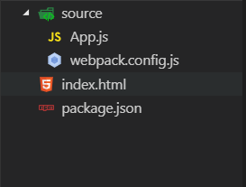

# 第1章 React入门

React是由Facebook创建的一个开源项目。它提供了一种在JavaScript中构建用户界面的全新方式。自从它公开发布后，这个库迅速风靡全球，并且围绕着它培育了一个生机勃勃的社区。

通过阅读本书，你将掌握在项目中使用React所需的方方面面。因为React只关注UI界面的渲染，而不会对应用程序的其他模块所使用的技术做任何假设，所以本书同时也将介绍能匹配React模式的路由（Routing）和应用程序架构。

在本章中，我们将从一个较高的层面讲述一些主题，以便你能尽快开始创建应用程序。这些主题包括：

* React的完整定义，以及优点概览
* 如何使用JSX，这是一个在React中用来渲染UI的JavaScript语法扩展
* 如何创建包含属性和状态的React组件

## 1.1 开始学习之前

React针对的是现代风格的JavaScript开发生态系统。为能亲自尝试本书中的代码示例，你需要安装Node.js和npm。此外，还需要熟悉函数式JavaScript语法风格和这门语言的最新特性，如箭头函数（arrow functions）和类。

### 1.1.1 Node.js和npm

JavaScript自诞生之日起就运行在浏览器上，但是通过Node.js的开源命令行工具，可以使JavaScript运行在你的本地计算机和服务器上。与npm（Node Package Manager）一道，Node.js已经成为一项在本地计算机上进行JavaScript应用程序开发的极有用工具，它使得开发人员可以创建脚本来运行任务（例如，复制和移动文件，或是启动一个本地开发服务器），以及自动下载应用程序所依赖的组件。

如果你尚未安装Node.js，现在就下载它的Windows、Mac或者Linux版本，将其安装到你的计算机上。下载地址为https://nodejs.org/。

### 1.1.2 JavaScript ES6

JavaScript是一门自诞生起多年一直在不断进化的语言。最近，JavaScript技术社区已经认同了一组新的语言特性。有一些最新的浏览器已经能够支持这些特性，React社区也广泛地使用了这些新的特性（例如，箭头函数、类、展开操作符）。React同时鼓励在JavaScript代码中使用函数式编程模式，所以你也需要熟悉在JavaScript中函数和上下文时如何工作的，这样你才能了解map、reduce和assign等方法。如果你对这些细节有些模糊，可参阅Apress网站（www.apress.com/）和本书的GitHub页面（http://pro-react.github.io/）上有关这些主题的在线附录说明。

## 1.2 定义React

为清楚地说明React究竟为何物，我将对它做如下定义：

**React是一个使用JavaScript和XML技术（可选）构建可组合用户界面的引擎。**

下面对React定义的每个部分再详加说明：

**React是一个引擎：** React的网站将它定义为一个库，但是我觉得使用”引擎“这个词更能体现出React的核心优势：用来实现响应式UI渲染的方式。React的方式是将状态（在一个给定的时间点，所有用来定义应用程序的内部数据）从展现给用户的UI中分离出来。在React中，你可以声明如何将应用程序的状态表现为DOM的虚拟元素，然后自动更新DOM以反映出状态的变化。

“引擎”这个术语首先被Justin Deal用来描述React，因为他觉得React渲染UI界面的方式和游戏引擎渲染的工作方式十分相似（https://zapier.com/engineering/react-js-tutorial-guide-gotchas/）。

**创建可组合用户界面：**减少创建和维护用户界面的复杂性一直是React的核心目标。React拥抱了这样一种理念：将UI”打散“成易于重用、扩展和维护的组件与自包含的、关注特定用途的构件（building blocks）。

**使用JavaScript和XML技术（可选）：**React是一个可用于浏览器、服务器和移动设备之上的纯JavaScript库。如你将在本章中所见，React有一种可选的语法来让你使用XML来描述UI。一开始你可能会对这种语法感到有些陌生，但使用XML对于描述用户界面其实有诸多优点，包括：XML是声明性的，很容易通过XML观察元素之间的关系，也很容易使UI的整体结构可视化。

## 1.3 React的优点

市面上有许多的JavaScript MVC框架。Facebook有什么理由还要创建React？你有什么理由要使用React？下面的三节内容将探索React的一些优点，从而回答这两个问题。

### 1.3.1 简单易学的响应式渲染

在Web开发的早期，那时还根本没有单页应用程序这个概念，用户每次在页面上进行一次交互（比如单击了一个按钮），就算新的页面只和原有页面仅有一点不同，服务器都会将一整页新的页面发送会客户端浏览器。从用户的角度来看，体验会非常糟糕，不过程序员倒是很容易规划处用户在某一时刻能看到哪些内容。

单页应用程序持续地从服务器获取新数据，并在用户进行交互时交换DOM上面的部分内容。在用户界面逐渐变得复杂时，应用程序也要实现越来越复杂的逻辑来检验应用程序的当前状态，并对DOM及时进行所需的修改。

许多JavaScript框架（特别是那些在React出现之前的框架）都使用了数据绑定技术，来处理这种日益增加的复杂性并保持用户界面和应用程序状态的同步，但是数据绑定在可维护性、可扩展性和性能上，都有一些缺陷。

响应式渲染比传统的数据绑定技术要更容易使用一些。它让我们用一种声明方式，来定义组件的外观和行为。当数据发生变化时，React在概念上会重新渲染整个用户界面。

当然，每次在状态数据发生变化时就真的重新渲染整个用户界面，在性能上是不可接受的，React使用了一种存在于内存中的轻量级DOM表示法，这被称为“虚拟DOM”。

处理这种内存中的虚拟DOM要比处理真正的DOM更快、更有效。当因为用户的交互或者数据的获取而导致应用程序的状态发生改变时，React快速地将UI的当前状态与期望的状态进行比较，然后计算出要对真实DOM所需进行的最小更改。这种工作方式使得React非常快、非常高效。即使在一个移动设备上，React应用程序也能轻松地达到60fps的刷新率。

### 1.3.2 使用纯JavaScript进行面向组件开发

在一个React应用程序中，一切都由组件组成，组件就是应用程序中的自包含的、关注特定用途的基础构件。基于组件来开发应用程序使用了一种“分而治之”的途径，来避免在某个地方有太高的复杂性。由于组件可以组合起来，每个组件都可以尽量保持小巧，通过将更小的组件组合起来，创建负责的包含更多功能的组件就变得简单了。

不同于使用特定的模版语言或是传统Web应用程序UI中用到的HTML标记，React组件由普通的JavaScript写就。使用普通JavaScript代码编写组件有一个很好的理由：模块限定了你可用来构建UI界时能使用到的功能特性。React则是使用一门功能完整的编程语言来渲染界面，这相对于使用模版具备很大的优势。

另外，通过使用组件成为自包含的、并在相关视图逻辑中使用一个统一的标记，React组件实现了关注点的分离。在Web开发的早期岁月，关注点的分离是通过在不同部分使用不同的语言来强制实现的：内容结构使用HTML，样式使用CSS，逻辑行为使用JavaScript。这种方法在问世之初工作得很好，因为那个时候Web页面还是静态呈现的。但是现在用户界面变得更有交互性、更复杂，显示逻辑和HTML标记不可避免地被绑定在一起：标记、样式和JavaScript之间的分离变成了仅是技术上的分离，而非关注点的分离。

React假设显示逻辑和HTML标记是高度粘合的：它们同时用来实现UI的展现，并通过为每个关注点创建离散的、可重用的组件，来鼓励实现关注点的分离。

### 1.3.3 灵活的文档类型抽象表现

React内置了自己的一个UI轻量级表现模型，以抽象出UI底层的文档模型。这种方式最值得一提的优点，就是不论在Web页面，还是在原生的iOS和Android界面上，它都可以使用同样的原则来渲染HMTL。这种抽象表现同时带来了下面这些特性：

* 事件在所有浏览器和设备上都会以一种统一、标准的方式，自动地使用代理，来达到行为的一致性。
* 为实现SEO（搜索引擎优化）和更好的性能，React组件可在服务器上被渲染。

## 1.4 创建你的第一个React应用程序

现在你已经知道了组件是React UI的基础构件，但是组件到底看起来是什么样子的？怎么样才能创建一个组件呢？简单来说，一个React组件就是一个带有render方法，并且返回组件UI描述的JavaScript类，如下所示：

```javascript
class Hello extends React.Component {
    render (){
        return (
        	<h1>Hello World</h1>
        )
    }
}
```

你也许已经注意到了JavaScript代码中间的HTML标记。之前曾经提到过，React有一种成为JSX的JavaScript语法扩展，可以让我们在代码中直接书写XML（以生成HTML）。

是否使用JSX是可选的，但是它已经成为一种被广泛接受的在React组件中定义UI的标准方案，由于JSX使用了具有丰富表达能力的声明式与语法，以及这些内容最终会被转换成普通的JavaScript函数调用，所以这意味着JSX并没有影响JavaScript语言原本的语义。

我们会在下一章更详尽地介绍JSX，但是现在要提醒你注意的是，React需要一个额外的“转换”步骤（或者说是翻译步骤），将JSX转换成JavaScript代码。

在现代的JavaScript开发生态系统中，有许多工具可处理这种需要额外转换步骤的情况。下面花一点时间来讨论如何为React项目搭建出一套流畅的开发流程。

### 1.4.1 React开发流程

想当年，我们都是将所有JavaScript代码都写到一个文件里面，手工下载一两个JavaScript库，然后将自己的代码和第三方的库统统塞到一个页面上。当然，现在你仍然可将React库的压缩JavaScript文件通过下载或复制粘贴的方法获得，然后立即用它来运行组件，并在运行时转换JSX。只不过现在除了小的演示和原型之外，没人会在真正的项目里面这样做。

即使是创建一个最简单的应用程序，我们也希望通过开发流程满足如下需求：

* 编写JSX并随时将它转换成标准的JavaScript代码
* 使用模板化模式编写代码
* 管理依赖性
* 打包多个JavaScript文件并使用source maps进行调试

为了满足上述需求，一个React项目的基础结构包含如下内容：

（1）一个soure文件夹，里面包含了你所编写的所有JavaScript模块。

（2）一个index.html文件。在React应用程序中，这个HTML页面通常差不多是一个空页面。它仅用来加载应用程序的JavaScript，并提供一个div元素（或者其他任何元素）来让React在该元素中渲染出应用程序的组件。

（3）一个package.json文件。这个package.json是一个独立的npm清单文件，它包含了有关项目的诸多信息，例如名称、描述、作者的信息等。它让开发人员在其中指定依赖关系（通过指定依赖关系可以实现模块的自动下载和安装）并定义脚本任务。

（4） 一个模块打包或build工具，用来实现JSX转换和模块/依赖项打包。模块的应用使得JavaScript代码被组织到了多个文件汇总，每个模块都声明了它自己的依赖项。模块打包工具在编写完代码之后，就可以根据依赖关系，以正确顺序将所有代码文件打包在一起。有许多工具都可以实现这样的功能，包含Grunt、Gulp和Brunch等。在任何上述工具的文档中，你都能找到如何配合React使用的内容，不过通常来说，React社区将webpack用作完成这项工作的首选工具。本质上，webpack是一个模块打包工具，但它也可将源代码通过加载器进行转换和编译。

图1-1展示了上面所提到的文件和文件夹结构。



**提示：**

在本书的在线资料中，你可以找到一个关于如何使用webpack设置一个React项目的完整附录说明。附录中涵盖了webpack的详细信息，并展示了如何设置高级选项，例如，热重载（Hot Reloading）React组件。在线附录位于Apress网站（www.apress.com）和本书的GitHub页面（pro-react.github.io）上。

