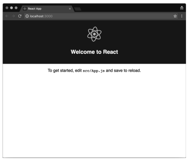

# 第1章 React基础

你好！

本书假设你已经知道React是什么并且了解它能为你解决什么问题。你可能使用React开发过中小型应用，但希望进一步提升自己的技能并得到所有未解决问题的答案。

你应该知道，React由Facebook的开发人员及JavaScript社区的数百名贡献者所维护。

React是最流行的UI开发库之一，因高性能而为人所熟知，这得益于它操作DOM的方式很巧妙。

React包含了全新的JSX语法，该语法用于在JavaScript中编写标记，则需要你重新思考[^1] 。React还包含了许多很棒的特性，如服务端渲染，该特性让你可以开发通用应用。

为了学习本书，你需要了解如何使用终端程序在Node.js环境中安装并运行npm包。

本书中的所有代码示例都遵循ES2015标准，以方便你阅读与理解。

本章会讲解你需要掌握的一些基本概念，了解这些概念有助于你高效使用React。对于初学者来说，理解这些概念意义重大。

* 命令式编程与声明式编程的区别。
* React组件与组件实例，以及React如何使用元素来控制UI流程。
* React如何改变Web应用的开发方式，它主张的另一种全新的关注点分离概念是什么。它选择不寻常的设计理念的原因是什么。
* 为什么人们会对JavaScript框架感到疲劳？在React生态系统中，怎样避免开发人员最常犯的错误？

## 1.1 声明式编程

只要阅读过React文档或者相关博文，那么你肯定遇到过**声明式**这一术语。

其实，React如此强大的原因之一就在于它推行声明式编程范式。

因此，要想掌握React，就需要理解声明式编程的含义，以及其与命令式编程之间的主要区别。

理解该问题的最简方式是：命令式编程描述代码如何工作，而声明式编程则表明想要实现什么目的。

与命令式世界及其相似的一个真实示例就是去酒吧喝啤酒并对服务员做出以下指示：

* 从架子上拿一个玻璃杯；
* 将杯子放到酒桶前；
* 按下酒桶开关，将杯子倒满；
* 把杯子递给我。

但在声明式世界中，你只需要说：“请给我一杯啤酒。”

按声明式方式点一杯啤酒，需要假设服务员知道如何提供啤酒，这是声明式编程工作原理的一个重要方面。

我们来看一个JavaScript代码的实例。编写一个简单的函数，给定包含大写字符串的数组时，该函数返回包含相同的小写字符串的数组。

```javascript
toLowerCase(['FOO','BAR']) // ['foo','bar']
```

解决该问题的命令式函数的实现如下所示：

```js
const toLowerCase = input => {
    const output = []
    for (let i = 0; i < input.length; i++){
        output.push(input[i].toLowerCase())
    }
    return output
}
```

首先，创建一个空数组来保存结果。接着，函数循环遍历输入数组中的所有元素，并将小写值推进空数组中。最后，返回需要输出的数组。

声明式实现如下所示：

```js
const toLowerCase = input => input.map(
	value => value.toLowerCase()
)
```

输入数组中的元素会传递到map函数，然后map函数会返回包含小写值的新数组。

这里需要注意几点比较重要的差别：前一个示例不够优雅，而且需要花更多精力才能理解；后者更加简洁、易读，这对注重可维护性的大型代码库来说非常重要。

另外值得一提的是，声明式编程中无须使用变量，也不用在执行过程中持续更新变量的值。事实上，声明式编程往往避免了创建和修改状态。

我们来看最后一个示例，了解一下React的声明式具体指什么、

我们要解决的问题是Web开发中常见的一个需求：展示带有标记的地图。

JavaScript的实现（使用Google Maps SDK）如下所示：

```js
const map = new google.maps.Map(document.getElementById('map'),{
    zoom: 4,
    cener: myLatLng,
})

const marker = new google.maps.Marker({
    position: myLatLng,
    title: 'Hello World!',
})
marker.setMap(map)
```

这显然是命令式的，因为代码逐条描述了创建地图、创建标记以及在地图上添加标记的指令。

改用React组件在页面上显示地图的方式如下所示：

```jsx
<Gmaps zoom={4} center={myLatLng}>
	<Marker position={myLatLng} title=”Hello world!“ />
</Gmaps>
```

使用声明式编程方法时，开发人员只需要描述他们想要实现什么目的，无须列出实现效果的所有步骤。

声明式编程方式使得React很容易使用，因此最终的代码也很简单，这样产生的bug也更少，可维护性也更强。

## 1.2 React元素

本书假设你已经熟悉组件及其实例，但要想高效地使用React，你还需要了解另一种对象：**元素**。

无论是调用createClass方法、继承Component类还是声明一个无状态函数，其实都是在创建组件。React管理着运行环境中的所有组件实例，在某个特定时刻，内存中可能存在同一个组件的多个实例。

如前文所述，React遵循声明式范式，因此无须告诉它如何与DOM交互。你只要声明希望在屏幕上看到的内容，React就会完成剩下的工作。

或许你之前体会过，大部分其他UI库都是按相反方式工作的：它们让开发人员负责更新界面，这就需要手动管理DOM元素的创建与销毁。

React使用了元素这种特殊类型的对象来控制UI流程。元素描述了屏幕上需要显示的内容。这些不可变对象比组件和组件实例要简单得多，而且只包含了展示界面所必需的信息。

以下示例展示了一个元素：

```js
{
    type: Title，
    props: {
        color: 'red',
        children: 'Hello, Title!'
	}
}
```

元素最重要的属性是type，另一个比较特殊的属性是children，它是可选的，用于表示元素的直接后代。当然，元素还具有其他一些属性。

type属性很重要，因为它告诉React如何处理元素本身。实际上，如果type属性是字符串，那么元素就表示DOM节点；如果type属性是函数，那么元素就是组件。

DOM元素和组件可以互相嵌套，以表示整个渲染树：

```js
{
    type: Title，
    props: {
        color: 'red',
        children: {
        	type: 'h1',
            props: {
            	children: 'Hello, H1!'        
            }    
        }
	}
}
```

当元素的type属性是函数时，React会调用它，传入props来取回底层元素。React会一直对返回结果递归地执行相同的操作，直到取回完整的DOM节点树，然后就可以将它渲染到屏幕。这个过程称作**一致性比较**，React DOM和React Native都利用它在各自的平台上创建UI。

## 1.3 忘掉所学的一切

初次使用React需要持开放的心态，因为它带来了设计Web应用和移动应用的一种全新方式。实际上，React试图打破我们熟知的大部分最佳实践，并革新UI的构建方式。

过去的20年里，我们学到了十分重要的关注点分离原则，并习惯性地将其理解为从模版中分离逻辑。我们的目标始终是将JavaScript和HTML写入不同文件。

各种各样的模版方案被创建出来，以帮助开发人员实现这个目标。

问题在于，这种形式的分离大多数情况下只是一种假象。真相是，无论JavaScript和HTML写在什么地方，它们都是紧密耦合的。

我们来看一个模版的示例：

```text
{{#items}}
	{{#first}}
    	<li><strong>{{name}}</strong></li>
    {{/first}}
    {{#link}}
     	<li><a href="{{url}}">{{name}}</a></li>
    {{/link}}
{{/items}}
```

以上代码段摘自Mustache官网，它是最流行的模版系统之一。

第一行代码让Mustache循环遍历项目集合。循环内部包含了一些条件逻辑，以检查#first和#link属性是否存在，并根据它们的值渲染不同的HTML片段。变量位于双花括号中。

如果应用只需要显示一些变量，那么模版库就是很好的解决方案，但需要操作复杂的数据结构时，情况就不一样了。

实际上，模版系统及其领域专用语言（domain-specific language，DSL）提供了一个功能子集，它们试图提供一门真正编程语言的功能，而又不用像语言那样完备。

如以上示例所示，模版高度依赖从逻辑层接收到的数据模型来显示信息。

另一方面，JavaScript操作模版渲染出的DOM元素来更新UI，即使它们是从独立文件中加载的。

样式也存在同样的问题：它们定义在不同的文件中，但模版引用了样式文件，而且CSS选择器也遵循了文档标记结构，因此，几乎不可能在不影响其他文件的前提下修改某个文件。这就是耦合的定义。

这就是为何传统的关注点分离原则更像是技术分离，这种做法当然说不上不好，但没有解决任何真正的问题。

React尝试更进一步，将模版放到其所属位置，即与逻辑在一起。React这么做的理由在于，它建议你通过编写名为组件的小型代码块来组织应用。

框架不应该指导你如何分离关注点，因为每个应用都有自己的方式，只有开发人员才能决定如何划分应用的界限。

组件式开发彻底改变了Web应用的开发方式，这也是关注点分离这一经典概念逐渐被更现代化的架构所替代的原因。

React所主张的范式并不新奇，也不是由React的开发人员所发明的，但是React为这个概念的主流化做出了巨大贡献。最重要的是，不同专业水平的开发人员能够轻松理解这个概念，它也因此流行起来。

React组件的渲染方法如下所示：

```jsx
render(){
    return(
    	<button style={{color:'red'}} onClick={this.handleClick}>
        	Click me!
        </button>
    )
}
```

一开始都会觉得这种语法有些奇怪，不过这只是因为我们还没有习惯而已。

一旦学会，我们就会意识到它的强大之处并理解其潜力。

同时使用JavaScript来编写逻辑和模板不但有助于更好地分离关注点，也赋予我们更强的能力和表达力，这正是构建复杂UI所必需的。

所以，即使混用JavaScript和HTML的做法咋听起来很奇怪，也请花5分钟试用React。

学习新技术的最佳方式是在小项目中试用，并观察具体的应用情况。一般来说，如果新技术能带来长远利益，那么正确的做法就是忘掉学过的一切并改变思维模式。

此外，开发React的工程师一直在社区中推广另一个概念：将样式的逻辑也放到组件中。这个概念颇具争议，而且很难被接受。

React的最终目标是将创建组件所用到的每项技术都封装起来，并根据它们的领域和功能进行关注点分离。

以下示例展示了React文档中的一个样式对象：

```jsx
var divStyle = {
    color:'white',
    backgroundImage:'url('+imgUrl+')',
    WebkitTransition:'all',// 注意此处大写的'W'
    msTransition:'all' // ‘ms'是唯一小写的厂商前缀
}；

ReactDOM.render(
    <div style={divStyle}>Hello World!</div>,
    mountNode
);
```

开发者使用JavaScript编写样式的这套方案称作CSS in JavaScript。第7章将对其进行详细介绍。

## 1.4 常见误解

一种常见的观点认为，React是一个庞大的技术和工具集，要想使用它，就必须与包管理器、转译器、模块打包器以及无数的库打交道。

这种观念相当普遍，人们口口相传，以至于它有了明确的定义，还被赋予了**JavaScript疲劳**这一名称。

理解这种观念背后的缘由并不难。实际上，React生态系统中的所有代码仓库和类库都源自炫酷的新技术、最新版的JavaScript以及最先进的技术和范式。

此外，GitHub上还有大量的React构建模版，每个模版都包含了数十个能够解决各种问题的依赖项。

这很容易让人觉得使用React就一定要使用这些工具，但事实并非如此。

虽然人们普遍持有以上观点，但React其实是一个很小的库。像之前使用jQuery或Backbone那样，我们可以在任何页面（甚至JSFiddle）中使用它：只要在关闭主体元素前引入脚本即可。

实际需要引入两个脚本，因为React拆分成了两个包：核心包react实现了React库的核心特性，react-dom则包含了与浏览器相关的所有特性。这样做的理由是，核心包可以用于支持不同的目标平台，如浏览器中的React DOM 以及移动设备上的React Native。

在单个HTML页面中运行React应用不需要任何包管理器和复杂操作。只需下载发行包并托管到自己的服务器上（或者使用https://unpkg.com），你就可以在短短几分钟类开始使用React及其特性。

要想使用React，可以在HTML代码中添加一下URL：

* https://cdn.bootcss.com/react/15.3.2/react.min.js
* https://cdn.bootcss.com/react/15.3.2/react-dom.min.js

如果只引入核心包，则无法使用JSX语法，因为它不是浏览器支持的标准语言。不过，重点在于先从最小特性集入手，需要时再加入更多功能。

对于简单的UI，只需使用createElement方法。只有当开发更复杂的UI时，才需要引入转译器来启动JSX语法并将其转换成JavaScript。

一旦应用变得更大，就需要使用路由库来处理不同的页面和视图。与上同理，引入路由库即可。

有些情况下，我们需要从API路径加载数据。如果应用继续扩增，就需要利用外部依赖项对复杂操作进行抽象，此时才应该引入包管理器。

然后就需要将应用拆分成独立的模块并按正确的形式组织文件。此时应该开始考虑使用模块打包器。

使用这种非常简单的方法，就不会再感到疲劳了。

如果代码模版带有数百个依赖和数十个npm包，不熟悉它们必然会感到不知所措。

值得注意的是，与编程相关的每种工作（特别是前端工程）都需要持续的学习。Web的本质决定了它要根据用户与开发者的需求快速进化和改变。我们的生态环境从一开始就按这种方式发展，这也正是它如此令人激动的原因。

积累了一些Web开发经验后，我们了解到掌握一切知识是不可能的，但应该用正确的方法学习新知识，以避免疲劳感。只要能跟上所有的新趋势，就不需要为了掌握新类库而实际运用它，除非我们有时间做业余项目。

JavaScript领域很令人吃惊：只要发布或者起草了一个规范，社区中就会有人以转译器插件或腻子脚本的形式实现它，这使得在浏览器厂商赞成并开始支持该规范前，大家就可以使用它。

以上事实使得JavaScript和浏览器生态环境与任何其他语言或平台完全不同。

其弊端是一切变化得太快，不过问题也只是如何在押宝新技术和保持稳妥间找到平衡。

任何情况下，Facebook的开发人员都很注重开发体验，并且善于倾听社区反馈。因此，仅管使用React并非一定要学习数百种工具，但他们也意识到了这种令人疲劳的现象，于是发布了一个CLI工具，让构建和运行真正的React应用变得非常简单。

这个CLI工具只需要Node.js/npm环境，然后就可以全局安装：

```bash
npm install -g create-react-app
```

安装好这个可执行程序后，就可以向它传递文件夹名称来创建应用了。

```bash
create-react-app hello-world
```

最后，执行cd hello-world命令进入应用的文件夹，接着运行一下命令：

```bash
npm start
```

应用神奇地只靠一项依赖就可以运行了，但包括了用最先进的技术开发完整React应用所需的一切特性。以下截图展示了create-react-app创建的应用的默认页面。



本书将利用这个工具运行每章中的代码示例，你也可以在本书主页中获取它们：http://www.ituring.com.cn/book/2007。

## 1.5 小结

我们在本章中学习了一些基本概念，它们对于学习后续章节很重要，对于平时开发React应用也至关重要。

现在我们知道了如何编写声明式代码，并清晰地理解了自己开发的组件与React元素的区别，React元素的实例会显示在屏幕上。

我们了解了将逻辑和模版放在一起的原因，以及为什么这种不太流行的决策能为React带来巨大成功。

我们深入探讨了为什么JavaScript生态系统中的人们会普遍感到疲劳，也研究了如何通过迭代的方式来避免这些问题。

最后，我们探讨了新的CLI工具create-react-app。现在是时候动手编写一些真正的代码了。


[^1]: 关注点分离是软件设计原则之一，前端开发中一般指文档结构、样式表现以及脚本行为的分离。

