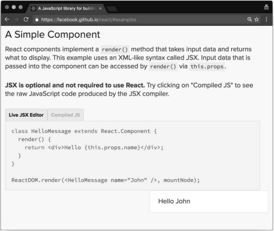

# 第2章 整理代码

本章假设你已经具有JSX语法的使用经验，并且希望提升自己的技能以高效使用它。

要想使用JSX时不产生任何问题或不可预测的行为，重点要理解它的内部工作原理及其在UI构建上用处很大的原因。

我们的目的是编写整洁且可维护的JSX代码，为了实现该目的，我们需要了解其起源、怎样转换为JavaScript以及有哪些特性。

一开始我们会进行回顾，请耐心一点，因为掌握好基础对应用最佳实践至关重要。

本章内容具体如下所示。

* JSX是什么，为什么要使用JSX。
* Babel是什么，怎样利用它来编写现代JavaScript代码。
* JSX的主要特性以及其与HTML之间的区别。
* 编写优雅且可维护的JSX代码的最佳实践。
* 代码检查（尤其是ESLint）怎样使得多个应用或团队的JavaScript代码风格保持一致。
* 函数是编程的基础，以及为何遵循函数范式可以使得我们写出更好的React组件。

## 2.1 JSX

我们在第1章中看到React融合了组件内部的技术界限，改变了关注点分离的概念。

我们还学习了React如何使用组件返回的元素来展示屏幕上的UI。

现在我们来看看如何在组件内声明元素。

React提供了两种定义元素的方式。一种是使用JavaScript函数，另一种是使用类似XML的JSX语法。以下是React.js官网的示例：



一开始就要接触JSX是阻碍人们进一步了解React的主要原因之一，因为大多数人看到官网首页示例将JavaScript和HTML写在一起都会觉得很奇怪。

只要习惯了这种语法，就会认识到使用它很方便，因为它和HTML很相似，编写过Web平台UI的人都会觉得很熟悉。

开始和闭合标签可以使得嵌套元素树的表示变得非常简单，但如果用普通的JavaScript语法来做，那么嵌套元素数会变得难以阅读和维护。

### 2.1.1 Babel

为了在代码中使用JSX（及ES2015的特性），我们需要安装Babel。

首先，需要清除地理解Babel能为我们解决什么问题，以及为什么需要在开发流程中增加这个步骤。原因是我们想在浏览器这个目标环境中使用尚未实现的语言特性。这些高级特性允许开发者编写更整洁的代码，但浏览器无法识别并执行。

解决方案就是用JSX和ES2015语法编写脚本，准备发布时再将代码编译成当今主流浏览器都已实现的ES5标准规范。

> Babel是React社区广泛使用的一个流行JavaScript编译器。

Babel可以将ES2015的JavaScript代码编译成ES5的，也可以将JSX编译成JavaScript函数。这个过程称为转译，因为它将源代码编译成另一份新源代码，而不是可执行文件。

使用Babel相当简单，安装即可。

```bash
npm install --global bable-cli
```

如果不想全局（开发人员往往不喜欢）安装Babel，也可以将它安装到项目中，然后通过npm脚本来运行，但考虑到本章的目的，需要暂且采用全局安装的做法。

安装完成后，可以运行一下命令来编译任何JavaScript文件。

```bash
babel source.js -o output.js
```

Babel如此强大的原因之一在于可以灵活配置。它只是一个将源文件转译成输出文件的工具，配置后才能使用一些转换规则。

好在有很多非常有用的预设配置，其安装和用法都非常简单：

```bash
npm install --global babel-preset-es2015
babel-preset-react
```

安装完成后，在根文件夹下创建名为.babelrc的配置文件，并写入一下代码来告诉Babel使用这些预设配置。

```babelrc
{
    "presets":[
        "es2015",
        "react"
    ]
}
```

从现在起，我们就可以用ES2015和JSX来编写代码源文件，并在浏览器中运行输出文件了。

### 2.1.2 Hello, World!

支持JSX的环境搭建好后，我们就可以深入学习最基础的示例：生成div元素。

以下代码展示了如何用React的createElement函数创建div元素：

```jsx
React.createElement('div');
```

以下是JSX写法：

```jsx
<div />
```

它看起来很像普通的HTML。

最大的区别在于我们将标记写在了.js文件中，值得注意的是，JSX仅仅是语法糖，在浏览器中运行前需要转译成JavaScript。

实际上，运行Babel时会将`<div />`转换成React.createElement(‘div‘)，编写模版时要始终牢记这一点。

### 2.1.3 DOM元素与React组件

有了JSX后，我们既可以创建HTML元素，也可以创建React元素；唯一的区别在于它们是否以大写字母开头。

例如，渲染HTML按钮元素时使用`<button / >`，而渲染Button组件时使用`<Button />`。

前一个按钮会转译为以下代码：

```jsx
React.createElement('button')
```

后一个按钮会转译为以下代码：

```jsx
React.createElement(Button)
```

以上区别在于，前一个调用传入了字符串形式的DOM元素类型，而后者传入了组件本身，这也意味着该组件要存在于当前作用域。

你可能已经注意到，JSX支持自闭的标签，这样可以很好地保持代码简洁，无须重复编写不必要的标签。

### 2.1.4 属性

JSX可以非常方便地书写包含属性的DOM元素或React组件。实际上，用XML设置元素属性就很简单。

```HTML

```

JavaScript的等效写法如下所示：

```jsx
React.createElement("img",{
    src:"https://facebook.github.io/react/img/logo.svg",
    alt:"React.js"
});
```

以上代码的可读性较差，虽然只有几个属性，但也需经过一番思考才能读懂。

### 2.1.5 子元素

JSX允许定义子元素来描述元素树，并构建复杂的UI。

```html
<a href="https://facebook.github.io/react/">Click me!</a>
```

它会转译为以下代码：

```jsx
React.createElement(
    "a",
    {
        href:"https://facebook.github.io/react/"
    },
    "Click me!"
);
```

出于布局的需求，链接可以包裹在div元素的内部，而JSX代码段如下所示：

```html
<div>
    <a href="https://facebook.github.io/react/">Click me!</a>
</div>
```

等效的JavaScript代码如下所示：

```jsx
React。createElement(
    "div",
    null,
    React.createElement(
        "a",
        {
            href:"https://facebook.github.io/react/"
        },
        "Click me!"
	)
);
```

现在，类似XML的JSX代码拥有更好的可读性和可维护性，但了解JSX所对应的JavaScript代码非常重要，这样我们才能熟练掌握元素的创建。

JSX的妙处在于没有限制只能将元素嵌套为其他元素的子元素，还可以使用函数或变量这样的JavaScript表达式。

要想这样做，只需要用双花括号括起来表示式即可：

```jsx
<div>
    Hello, {variable}.
    I'a a {function()}.
</div>
```

同理，这也适用于非字符串属性：

```jsx
<a href={this.makeHref()} >Click me!</a>
```

### 2.1.6 JSX与HTML的区别

到目前为止，我们只探讨了JSX和HTML之间的相似之处。现在我们来了解一下两者间的微小区别，以及为什么会有这些区别。

**1. 属性**

我们要始终牢记，JSX不是一门标准语言，需要转译成JavaScript。由于这一点，有些属性无法使用。

比如，我们需要用className取代class，用htmlFor取代for：

```jsx
<label className="awesome-label" htmlFor="name" />
```

**2. 样式**

非常明显的区别之一就是样式属性的工作原理。我们将在第7章中介绍更多细节，目前只需要了解其工作原理即可。

与HTML不同，样式属性期望传入JavaScript对象，而不是CSS字符串，而且格式名的写法为驼峰式命名法：

```jsx
<div style=({blackgroundColor:'red'}) />
```

**3. 根元素**

JSX和HTML之间还有一个很重要的区别值得一提，因为JSX元素会转换为JavaScript函数，但JavaScript不允许返回两个函数，因此如果有多个同级元素，需要强制将它们封装在一个父元素中。

观察以下这个简单示例：

```jsx
<div />
<div />
```

上述代码会导致以下错误：

```log
Adjacent JSX elements must be wrapped in an enclosing tag
```

而以下写法就是有效的：

```jsx
<div>
    <div />
    <div />
</div>
```

必须添加多余的div标签使得JSX生效这个操作无疑让人感到恼火，不过React的开发人员目前（撰写本书之时）正在寻找解决方案。

**4. 空格**

一开始让人觉得麻烦的还有一点，我们要始终记住JSX不是HTML这个事实，尽管它的语法很像XML。

实际上，JSX处理文本和元素间的空格的方式与HTML不同，这种方式有点违反直觉。

查看一下代码片段：

```jsx
<div>
    <span>foo</span>
    bar
    <span>baz</span>
</div>
```

浏览器解析HTML时，以上代码会显示foo bar baz，这与我们的预想相同。

而JSX会将同一份代码渲染为foobarbaz，这是因为嵌套的三行代码转译成了div元素的独立子元素，没有将空格计算在内。为了得到与HTML一致的输出结果，普遍的解决方案是在元素间显式插入空格。

```jsx
<div>
    <span>foo</span>
    {' '}
    bar
    {' '}
    <span>baz</span>
</div>
```

如你所见，这里用JavaScript表达式封装了空字符串来强制编译器在元素间插入空格。

**5. 布尔值属性**

开始真正学习在JSX中定义布尔值属性前，还需要了解一些基础知识。如果设置某个属性却没有赋值，那么JSX会默认值是true，这种行为类似HTML的disabled属性。

这意味着如果要将属性值设置为false，则需要显式地声明。

```jsx
<button disabled/>
React.createElement("button",{disabled:true});
```

以下是另一个示例：

```jsx
<button disabled={false}/>
React.createElement("button",{disabled:false});
```

这一开始会让人感到疑惑，因为我们认为遗漏属性值应该为false，而实际并非如此。在使用React时，我们应当始终显式地声明，以避免发生混淆。

### 2.1.7 展开属性

**展开属性**操作符也是一项很重要的特性，它来源于ECMAScript提案中的对象剩余/展开属性（Object Rest/Spread Properties for ECMAScript），该特性可以非常方便地为元素传递JavaScript对象的全部属性。

向子元素传递数据时，不要按引用方式传递整个JavaScript对象，而要使用对象的基本类型值以方便校验。这种做法很常见，并且引发的bug更少，写出的组件更稳健且更不易出错。

该特性的用法如下所示：

```jsx
const foo = {id:'bar'}
return <div {...foo} />
```

以上代码的转译结果如下所示：

```jsx
var foo = {id:'bar'};
return React.createElement('div',foo);
```

### 2.1.8 JavaScript模版

最后，我们假设将模版移到组件内部而不用外部模版库具有一个优势，即可以利用JavaScript的完整功能，接下来我们探讨一下这个优势的具体意义。

展示属性就是一个示例，另一个明显的示例是可以用双花括号封装JavaScript表达式以作为属性值：

```jsx
<button disabled={errors.length}/>
```

### 2.1.9 常见模式

现在我们已经学习并掌握了JSX的原理，接下来将了解如何遵循一些有用的约定和技巧，以便正确使用JSX。

**1. 多行书写**

我们先来看一个简单模式。前文提过，应该倾向于使用JSX而不是createElement方法，主要原因之一便是JSX的语法很像XML，而且对称的开闭标签可以完美地表示节点树。

因此，我们应该尝试掌握它的正确用法并加以充分利用。

参见以下示例；需要嵌套元素的任何情况下都应该多行书写：

```jsx
<div>
    <Header/>
    <div>
        <Main content={...}/>
    </div>
</div>
```

这比以下写法更易读懂：

```jsx
<div><Header/><div><Main content={...}/></div></div>
```

如果出现子节点不是元素，而是文本或变量这样的例外情况，那么应该和父节点的标签写在同一行，并避免产生混淆，具体代码如下所示：

```jsx
<div>
    <Alert>{message}</Alert>
    <Button>Close</Button>
</div>
```

多行书写元素时，一定要记得用括号封装它们。JSX本质上会替换成函数，由于自动分号插入机制的存在，另起一行的函数可能会导致意外结果。例如，在渲染方法内返回JSX代码，这也是React创建UI的方式。

以下示例可以正常运行，因为div元素和返回在同一行：

```jsx
return <div/>
```

但接下来的示例就失效了：

```jsx
return
	<div/>
```

因为它会转换为以下代码：

```jsx
return
React.createElement("div",null);
```

因此你需要将代码语句包裹在括号内：

```jsx
reutrn(
    <div/>
)
```

**2. 多个属性的书写**

编写JSX代码经常遇到的一个问题是元素拥有多个属性。一种方案是将所有属性写在同一行，但这样会使得一行代码变得特别长，我们不希望代码出现这种情况（后文介绍了如何强制执行代码风格指南）。

常见的解决方案是一行书写一个属性，同时缩进一个层级，并保持结尾括号和开始标签对齐：

```jsx
<button
    foo="bar"
    veryLongPropertyName="baz"
    onSomething={this.handleSomething}
/>
```

**3. 条件语句**

当用到**条件语句**时，情况就变得很有趣了。例如，我们只想在满足特定条件时渲染一些组件。实际上，能够使用JavaScript判断条件已经具有很大优势了，不过JSX有许多不同方式来表达条件逻辑，理解每种方式的益处及其存在的问题对于编写可读且可维护的代码非常重要。

假设我们想要在用户当前登录到应用时显示注销按钮。

起初的代码如下所示：

```jsx
let button
if(isLoggedIn){
    button=<LogoutButton/>
}
return <div>{button}</div>
```

上述做法可行，但可读性不够好，组件和条件很多时会更差。

JSX可以利用行内条件来判断：

```jsx
<div>
    {isLoggedIn && <LoginButton/>}
</div>
```

上述写法同样有效，因为如果条件为false，则不会渲染任何组件，而如果条件为true，那么LoginButton组件的createElement方法会被调用，并返回元素以构建最终的元素树。

如果条件语句有额外分支（常见的if…else语句），并且我们想要在用户登录后显示注销按钮，否则显示登录按钮，就可以利用JavaScript的if…else语句，如下所示：

```jsx
let button
if(isLoggedIn){
    button=<LogoutButton/>
}else{
    button=<LoginButton/>
}
return <div>{button}</div>
```

更好的替换方案是三元条件运算，因为代码更简洁：

```jsx
<div>
    {isLoggedIn ? <LogoutButton /> : <LoginButton/>}
</div>
```

三元条件运算在Redux等流行库所提供的真实示例中随处可见，组件获取数据时 ，示例根据isFetching变量的值使用三元运算符来显示按钮文本为Loading或者load more。

```jsx
<button [...]>
	{isFetching ? 'Loading...' : 'Load More'}
</button>
```

我们来看看更复杂情况下的最佳方案。例如，我们需要检查多个变量才能判断是否要渲染组件：

```jsx
<div>
    {dataIsReady && isAdmin || userHasPermissions} &&
    	<SecretData />
    }
</div>
```

上述示例中的行内条件语句的写法很好，但可读性受到了很大影响。此时可以在组件内编写一个辅助函数来检验JSX的条件语句：

```jsx
canShowSecretData(){
    const { dataIsReady, isAdmin, userHasPermissions } = this.props
    return dataIsReady && {isAdmin || userHasPermissions}
}

<div>
    {this.canShowSecretData() && <SecretData />}
</div>
```

如上所示，修改后的代码大大提升了可读性，条件语句也更直观。即使大半年后再回头看这段代码，也能根据函数名清晰地看懂用途。

如果不喜欢用函数，那么你可以利用对象的getter方法使代码更优雅。

我们定义getter方法来取代函数，如下所示：

```jsx
get canShowSecretData(){
    const { dataIsReady, isAdmin, userHasPermissions } = this.props
    rerturn dataIsReady && {isAdmin || userHasPermissions}
}
<div>
    {this.canShowSecretData && <SecretData />}
</div>
```

同样的做法也可以用于计算属性。假设有两个独立属性currency和value。除了将价格字符串写在渲染方法中，还可以创建一个内函数：

```jsx
getPrice(){
    return `${this.props.currency}${this.props.value}`
}
<div>{this.getPrice()}</div>
```

这样做更好，因为单独抽离了生成字符串的代码，而测试包含逻辑的代码更方便。

再进一步，也可以像前面那样用getter取代函数：

```jsx
get price(){
    return `${this.props.currency}${this.props.value}`
}
<div>{this.price}</div>
```

回到条件语句的讨论，还有一些方案需要用到外部依赖。为了尽量小化应用包体积，最好避免引入外部依赖，不过当前这种特殊情况值得这样做，因为改进模版的可读性有很大好处。

第一项方案是render-if，可以执行以下命令来安装：

```bash
npm install --save render-if
```

然后就可以轻松地在项目中使用它，如下所示：

```jsx
const { dataIsReady, isAdmin, userHasPermissions } = this.props
const canShowSecretData = renderIf(
    dataIsReady && (isAdmin || userHasPermissions)
)
<div>
      {canShowSecretData(<SecretData />)}
</div>
```

我们将条件语句封装进renderIf函数。

这个工具函数的返回值也是一个函数，可以接受JSX标记作为参数，当条件为true时显示。

始终牢记，不要在组件内部添加过多逻辑。有些组件可能需要这样做，但我们应该尽可能保持组件简洁易懂，这样便于定位和修复问题。

至少应该保持renderIf函数简洁，为了实现这个目的，可以使用另一个工具库**react-only-if**，有了它之后，可以通过高阶组件来设置条件函数，只需要按照条件为真的情况编写组件即可。

第4章将介绍高阶组件，不过目前你只需要知道它们就是函数，可以接收组件并对其进行改进再放回，改进包括添加属性或修改行为。

可以执行以下命令来安装这个库：

```bash
npm install --save react-only-if
```

安装完成后，就可以按照以下方式在应用中使用它。

```jsx
const SecretDataOnlyIf = onlyIf(
    ({ dataIsReady, isAdmin, userHasPermissions }) => {
        return dataIsReady && (isAdmin || userHasPermissions)
    }
)(SecretData)

<div>
  <SecretDataOnlyIf
      dataIsReady={...}
      isAdmin={...}
      userHasPermissions={...}
  />
</div>
```

在以上代码中，组件内部不包含任何逻辑。

将条件语句作为onlyIf函数的第一个参数传人，满足条件时就渲染组件。

用于校验条件的函数可以接收组件的属性、状态以及上下文环境。

这样就可以避免条件语句对组件造成污染，有助于我们更轻松地理解并探究组件的代码。

**4. 循环**

开发UI时经常需要展示列表。将JavaScript作为模版语言来展示列表非常方便。

如果在JSX模版中编写一个函数并返回数组，那么数组的每一项都会编译为一个元素。

前文提过，可以在花括号内使用任何JavaScript表达式，针对给定对象的数组生成元素数组，最常用的做法是使用map方法。

我们来深入探讨一个真实示例。假设你有一张用户列表，其中每个用户都有一个对应的姓名属性。

用以下代码创建一张无序用户列表：

```jsx
<ul>
    {users.map(user =><li>{user.name}</li>)}
</ul>
```

这段代码简单而又强大，因为它结合了HTML和JavaScript两者的能力。

**5. 控制语句**

UI模版中的条件和循环都是常见操作，使用JavaScript的三元操作符或map方法来实现它们看上去有些奇怪。JSX的开发理念就是如此，它只抽象了元素的创建部分，而逻辑部分则留给真正的JavaScript，这种做法很巧妙，但有时代码会不够简洁。

总的来说，我们的目的是从组建中移除所有逻辑，尤其是渲染方法中的。但有时需要根据应用的状态来显示或隐藏元素，经常还需要遍历集合与数组。

如果你认为用JSX完成此类需求可以提高代码可读性，可以直接用现成的Babel插件：

```jsx
jsx-control-statements
```

我们来看看如何使用它。

首先安装：

```bash
npm install --save jsx-control-statements
```

安装完成后，将它添加到.babelrc文件中的Babel插件列表。

```jsx
"plugins":["jsx-control-statements"]
```

接着就可以使用这个插件提供的语法了，Babel会将它连同普通的JSX语法一同转译。

以下是使用该插件编写的条件语句：

```jsx
<If condition={this.canShowSecretData}>
    <SecretData />
</If>
```

它会转译为三元表达式，如下所示：

```jsx
{canShowSecretData ? <SecretData /> : null}
```

If组件非常有用，但如果渲染方法中需要嵌套条件，那么它很容易变得混乱且难以理解。查看以下Choose组件的代码：

```jsx
<Choose>
    <When condition={...}>
        <span>if</span>
    </When>
    <When condition={...}>
        <span>else if</span>
    </When>
    <Otherwise>
        <span>else</span>
    </Otherwise>
</Choose>
```

注意！上述代码会转译为多个三元表达式。

最后，我们介绍一个可以轻松实现循环的**组件**（记住，我们所提到的并非真实的组件，而只是语法糖）：

```jsx
<ul>
    <For each="user" of={this.props.users}>
        <li>{user.name}</li>
    </For>
</ul>
```

上述代码会转译为map方法，这并没有什么神奇之处。

如果习惯使用linter（一种代码检查工具），你可能会疑惑为何linter没有针对这些代码报错。实际上，user变量在转译前并不存在，也没有封装在某个函数中。为了避免代码检查时报错，我们需要安装另一个插件：eslintplugin-jsx-control-statements。

如果无法理解上一段内容，不要担心；我们将在2.2节介绍代码检查。

**6. 次级渲染**

值得强调的是，我们总是希望组件可以足够小，渲染方法也要简单明了。

然而，实现这个目的并不简单，尤其是迭代开发应用时，我们无法在第一次迭代过程中准确地判断如何将组件拆分得更小。

那么当渲染方法的代码量多到难以维护时，应该做什么呢？一种方案是将其拆分成更小的方法，同时又将所有逻辑都保留在原有组件内部。

查看一下示例：

```jsx
renderUserMenu(){
    //JSX用于用户菜单
}
renderAdminMenu(){
    //JSX用于管理员菜单
}
render(){
    return(){
        <div>
            <h1>Welcome back!</h1>
            {this.userExists && this.renderUserMenu()}
            {this.userIsAdmin && this.renderAdminMenu()}
        </div>
    }
}
```

这种方案并不总是可以当作最佳实践，因为显然拆分组件的做法更好。有时这样做只是为了保持渲染方法简洁。Redux的一个真实示例就是用一个次级渲染方法来渲染加载更多按钮。

现在我们已经熟练掌握了JSX，接下来将继续深入学习如何在代码中遵循一套风格指南，以确保代码风格保持一致。

## 2.2 ESLint

我们总是希望尽可能写出最佳代码，但有时总会出错，然后需要花费小时定位bug，最后发现只是拼写错误，这很令人沮丧。好在一些工具可以帮助我们在输入过程中检查代码的正确性。

这些工具无法表明代码能否实现预期效果，但可以帮助我们避免语法错误。

如果之前使用过C#这种静态语言，那么你应该很熟悉IDE给出的这种警告信息。

Douglas Crockford开发的JSLint（最初发布与2002年）使得JavaScript代码检查变得流行起来。后来出现了JSHint，如今ESLint成为了React领域的事实标准。

ESLint是2013年发布的开源项目，由于其配置化程度高且扩展性良好，逐渐流行起来。

在JavaScript生态系统中，各种库和技术都变化迅速，因此关键是要找到一个可以方便地使用插件来扩展的工具，并且可以按需启用或禁用规则。

最重要的是，如今我们普遍使用Babel这样的转译器，以及尚未归入JavaScript标准版本的试验特性，因此需要让linter知道源代码文件遵循了哪些规则。

linter不仅能帮助我们更少犯错，或者至少更早发现错误，它还能强制推行一些常见的编程风格指南。这一点非常重要，尤其是开发者众多的大型团队中的每个人都有自己偏爱的编程风格。

如果以不同风格编写代码库中的不同文件，甚至不同函数，那么这些代码将难以阅读。

### 2.2.1 安装

首先，执行以下命令来安装ESLint：

```bash
npm install --global eslint
```

可执行程序安装完成后，就可以用以下命令来运行它：

```jsx
eslint source.js
```

输出结果会告诉我们文件中是否有错。

安装后首次运行不会看到任何报错，因为它各方面都需要配置，一开始并不包含任何默认规则。

### 2.2.2 配置

现在我们开始配置ESLint

可以使用位于项目根目录的.eslintrc文件来配置ESLint。

使用rules属性来添加规则。

举例来说，创建.eslintrc文件并禁用分号：

```js
{
    "rules":{
        "semi":[2,"never"]
    }
}
```

上述配置文件的含义是：“semi”是规则名，[2,“never”]是规则的值。一开始看到这种配置会觉得不够直观。

ESLint规则具有决定问题严重程度的三个等级。

* off（或者0）：禁用规则
* warn（或者1）：规则会产生警告
* error（或者2）：规则会抛出错误

将规则的值设为2，因为我们希望当代码不符合规则时，ESLint会抛出错误。

第二个参数将ESLint配置为不允许代码中使用分号（相反值为always）。

ESLint及其插件都有详细的文档，你可以找到任意一条规则的描述及其通过或失败的示例。

现在新建一个文件并写入以下代码。

```jsx
var foo = 'bar';
```

（注意，此处使用了var关键词，因为ESLint还不知道我们要用ES2015语法来编码。）

执行eslint index.js后，就会看到以下提示：

```jsx
Extra semicolon (semi)
```

这太棒了！linter搭建完毕，它帮助我们遵循了第一条规则。

可以手动启用或禁用每条规则，也可以一步启用推荐配置，只需要在.eslintrc中添加以下代码即可。

```js
{
    "extends":"eslint:recommended"
}
```

extends属性表明我们将沿用ESLint的推荐配置，另外我们也可以手动修改.eslintrc的rules属性来覆盖每条规则，正如前文所做的那样。

启用推荐规则后，再次运行ESLint，此时不会看到与分号相关的任何报错（推荐配置中不包括这个部分），但linter会提示声明过的foo变量从未使用。

no-unused-vars规则对于保持代码简洁非常有用。

一开始提过，我们希望用ES2015语法编写代码，但是以下代码会报错：

```jsx
const foo = 'bar'
```

报错信息如下所示：

```jsx
Parsing error: The keyword 'const' is reserved
```

因此，要想启用ES2015语法，需要添加配置选项：

```jsx
"parserOptions":{
    "ecmaVersion":6,
}
```

添加完毕后，就只剩下变量未使用的报错提示了，这是正常的。

最后使用一下配置来启用JSX语法：

```jsx
"parserOptions": {
    "ecmaVersion": 6,
        "ecmaFeatures": {
        "jsx": true
    }
}
```

如果你之前开发过React应用却从未使用linter，现在要想学习规则并开始习惯，那么最好运行ESLint来检查源代码并修复所有问题。

用ESLint帮助我们编写更好的代码的方式有很多种。一种是前文的做法：在命令行中运行ESLint，并得到一系列错误提示。

这种做法可行，但一直手动执行不够方便。更好的做法是在编辑器中加入检查流程，这样输入代码时就能立即得到反馈。Sublime Text、Atom以及其他流行的编辑器都提供了ESLint插件来实现这个目的。

在真实的开发场景中，手动运行ESLint或者让编辑器实时提供反馈非常有用，但是还不够，因为我们会遗漏某些错误或警告，甚至是直接无视。

为了避免代码库中出现未检查的代码，我们可以将ESLint作为开发流程中的一环。举例来说，可以在测试时执行检查，如果代码不符合检查规则，那么整个测试步骤就算失败。

另一个方案是在发起pull request前进行代码检查，这样在同事开始审查前还有机会整理代码。

### 2.2.3 React插件

前文提过，ESLint流行起来的主要原因是其可以用插件进行扩展，对我们最重要一个插件是eslint-plugin-react。

ESLint不需要任何插件就能解析JSX（启用配置开关即可），但我们想要更多功能。例如，我们可能会想要推行前面章节中的某项最佳实践，并使得模版在多个开发人员及团队间保持一致。

要想使用该插件，需要先进行安装：

```jsx
npm install --global eslint-plugin-react
```

安装完成后，在配置文件中添加以下代码，以便ESLint可以使用它：

```jsx
"plugins": [
    "react"
]
```

如你所见，配置非常直观，没有任何复杂的地方。与ESLint一样，没有配置规则的情况下它什么都不会做，我们可以启用推荐配置来激活基础规则集。

在.eslintrc文件中更新“extends”属性，如下所示：

```jsx
<Foo bar bar />
```

以上代码会返回如下所示的错误提示：

```jsx
No duplicate props allowed (react/jsx-no-duplicate-props)
```

大量规则可以用于项目。我们来了解其中一部分，看看它们是如何帮助我们遵循最佳实践的。

正如第1章中所说，按照元素的树结构缩进JSX代码有助于提升可读性。

如果代码库及组件的缩进风格不一致，则会出现问题。

我们来查看一个示例，了解一下ESLint如何帮助团队的每个成员遵循风格指南，而又无须死记硬背。

注意，这种情况下的不正确缩进实际上不算错误，代码还是能够正常运行的；这只是一致性问题。

首先，激活以下规则：

```jsx
"rules": {
    "react/jsx-index": [2, 2]
}
```

第一个2表示如果代码不符合规则，则ESLint应该给出错误提示，第二个2则表示每个JSX元素应该缩进两个空格。因为ESLint不会做任何决定，所以启用哪条规则完全取决于你自己。甚至可以通过设置第二参数为0来选择无缩进风格。

编写以下代码：

```jsx
<div>
<div />
</div>
```

ESLint会给出以下报错信息：

```jsx
Expected indentation of 2 space characters but found 0 (react/jsx-index)
```

换行书写属性值时也有类似的规则来约束缩进。

前文介绍过，属性过多或过长时，较好的做法是换行书写。

要想推行属性根据元素名缩进两个空格的格式，启用以下规则即可：

```jsx
"react/jsx-index-props":[2,2]
```

至此，如果属性没有缩进两个空格，那么ESLint就会报错。

问题在于，如何界定一行代码过长？多少个属性算多？每个开发人员都有不同的看法。ESLint的jsx-max-props-per-line规则有助于维护一致性，这样每个组件的编写方式就相同了。

ESLint的React插件提供的规则不仅有助于写出更优雅的JSX代码，也有助于写出更好的React组件。

举例来说，可以强制要求属性类型按照字母表顺序排列、使用未声明的属性时给出错误提示，或者要求尽量编写无状态的函数组件，而不要使用类（第3章将介绍两者的详细区别）等。

### 2.2.4 Airbnb的配置

我们已经了解了ESLint如何通过静态分析来发现错误，以及如何促使我们在整个代码库中遵循一致的风格指南。

我们也见识到了ESLint的灵活之处，以及如何通过配置与插件来扩展它。

我们还学到了可以用推荐配置来激活一套基本规则集，无须手动完成这个繁琐的过程。

接下来我们再进一步了解它。

ESLint的extends属性非常强大，因此你可以从第三方配置入手，再添加自己特有的规则。

React领域最流行的配置之一莫过于Airbnb的那一套。Airbnb的开发者按照React的最佳实践创建了一套规则集，你可以直接在代码库中使用，无须自己手动判断启用哪条规则。

要想使用这套配置，必须先安装一些依赖：

```jsx
npm install eslint-plugin-jsx-a11y --save
npm install eslint-plugin-react --save
npm install eslint-plugin-import --save
npm install --save-dev eslint-config-airbnb
```

然后在.eslintrc中添加以下配置：

```jsx
{
    "extends":"airbnb"
}
```

接着就可以尝试执行ESLint来检查你的React源代码文件，可以看到代码是否符合Airbnb规则，以及这些规则是否适合你。

以下就是开始使用代码检查工具最简单也最常用的方式。

## 2.3 函数式编程基础

除了编写JSX时遵循最佳实践，并使用linter来加强代码一致性以更早发现错误，保持代码简洁的另一个方法是：遵循函数式编程风格。

正如第1章中所说，React的声明式编程提升了代码的可读性。

函数式编程就是一种声明式范式，能够避免代码副作用，同时它推崇数据不可变，以便更易维护与考量代码。

接下来的部分并非要全面介绍函数式编程；而只是介绍React普遍使用的一些概念，希望你可以理解它们。

### 2.3.1 一等对象

JavaScript的函数是**一等对象**，这意味着它们可以赋给变量，也可以作为参数传递给其他函数。这时要介绍一下**高阶函数**的概念了。高阶函数接受一个函数作为参数，也可以传入其他参数，最后返回另一个函数。返回的函数通常会添加一些增强的特殊行为。

我们来查看一个简单示例，一个两数相加的函数在增强后先打印所有参数，再接着执行原先的逻辑：

```jsx
const add = (x, y) => x + y;
const log = func => (...args) => {
  console.log(...args);
  return func(...args);
};
const logAdd = log(add);
```

理解这个概念非常重要，因为React领域的一个常用模式是使用**高阶组件**，将组件当作函数，并为它们增加一些常用行为。第4章将介绍高阶组件以及其他模式。

### 2.3.2 纯粹性

编写纯粹函数是函数式编程的一个重要方面。React生态系统经常会遇到这个概念，尤其是了解Redux这类库后。

函数的纯粹性到底指什么呢？

纯粹函数是指它不产生副作用，也就是说它不会改变自身作用域以外的任何东西。

举例来说，如果函数改变了应用状态、修改了上层作用域定义的变量，或者与DOM这样的外部实体发生了交互，那么该函数就是非纯粹函数。

非纯粹函数很难调试，而且大多数时候不可能多次调用它们并期望得到同样的结果。

以下展示的就是纯粹函数：

```jsx
const add = (x, y) => x + y;
```

它可以运行多次，并且总能得到同样的结果，因为没有将数据存储在其他地方，也没有修改任何东西。

以下展示的就是非纯粹函数：

```jsx
let x = 0;
const add = y => (x += y);
```

执行add(1)两次，但得到了两个不同的结果。第一次是1，而第二次是2，尽管我们是用同样的参数调用同一个函数。出现这种情况的原因在于每次执行都修改了全局状态。

### 2.3.3 不可变性

我们已经知道了如何编写不改变的纯粹函数，但需要修改变量值时应该怎么做呢？在函数式编程中，函数不会修改变量值，而是创建新的变量，赋新值后再返回变量。操作数据的这种方式称为**不可变性**。

不能修改不可变值。

我们来查看以下示例：

```jsx
const add3 = arr => arr.push(3);
const myArr = [1, 2];
add3(myArr);// [1,2,3]
add3(myArr);// [1,2,3,3]
```

上述代码中的函数没有遵循不可变性，因为它修改了给定数组的值。另外，调用这个函数两次会得到不同结果。

可以用concat方法改写以上函数，使其满足不可变性。concat方法会返回新数组，而且不会修改原数组：

```jsx
const add3 = arr => arr.concat(3);
const myArr = [1, 2];
const result1 = add3(myArr);
const result2 = add3(myArr);
```

此时即便运行该函数两次，myArr仍然保有初始值。

### 2.3.4 柯里化

**柯里化**是函数式编程的常用技巧。柯里化过程就是将多参数函数转换成单参数函数，这些单参数函数的返回值也是函数。我们通过一个示例来弄清这个概念。

我们从前文的add函数入手，将它转换成柯里化函数。

原先的写法如下所示：

```jsx
const add = (x, y) => x + y;
```

将其定义为以下写法：

```jsx
const add = x => y => x + y;
```

然后按以下方式使用它：

```jsx
const add1 = add(1);
add1(2); // 3
add1(3); // 4
```

这种函数写法相当方便，因为传入第一个参数后，第一个值被保留起来，返回的第二个函数可以多次复用。

### 2.3.5 组合

最后，可以用于React的函数式编程中的另一个重要概念是组合。函数（和组件）可以结合产生新函数，从而提供更高级的功能与属性。

思考以下函数：

```jsx
const add = (x, y) => x + y;
const square = x => x * x;
```

这两个函数可以组合创建一个新函数，用于两数相加，再对结果求平方：

```jsx
const addAndSquare = (x, y) => square(add(x, y));
```

遵循这个范式就可以编写小而简单、易于测试的纯粹函数，然后再将它们组合起来使用。

### 2.3.6 函数式编程与UI

最后需要学习的就是如何用函数式编程构建UI，这也正是使用React的目的。

可以将UI看作传入应用状态的函数，如下所示：

```jsx
UI = f(state);
```

我们希望这是一个幂等函数，即传入相同的应用状态时会返回同样的UI。

使用React时，可以将创建UI的组件看作函数，后文中会讲解这一点。

组件可以组合形成最后的UI，这也正是函数式编程的特性之一。

React构建UI的方式和函数式编程原则有很多相似之处，了解得越多，也就能写出越好的代码。

## 2.4 小结

本章介绍了大量有关JSX工作原理的内容，以及如何在组件中正确使用JSX。我们从基础语法入手，奠定扎实基础以掌握JSX及其特性。

第二部分将介绍ESLint及其插件如何帮助我们更快发现错误，以及怎样在代码库中强制推行一致的风格指南。

最后，我们介绍了函数式编程的基础，以理解开发React应用所需要的重要概念。

现在代码已经足够整洁，接下来我们将深入研究React并学习如何编写真正可复用的组件。