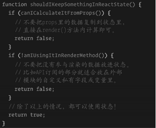

# 第3章 开发真正可复用的组件

要想开发真正可复用的组件，我们需要理解React提供的定义组件的多种方式，并知道如何根据具体情况进行选择。React引入了一种新型组件，允许将组件定义为**无状态函数**。最为关键的是要理解这种组件，并了解何时以及为何需要使用它。

你可能已经使用过组件的内部状态，但仍然不太了解其使用时机以及可能产生的问题。最好的学习方式就是阅读代码示例，我们将从一个只有单一功能的组件入手，然后将其改造为可复用组件。我们将先回顾基本概念，然后继续深入学习。本章末尾将创建一套可用的组件风格指南。

本章包含如下内容。

* 创建React组件的不同方式以及如何进行选择。
* 无状态函数式组件是什么，以及函数式组件与状态组件的区别。
* 状态的工作原理，以及何时应该避免使用它。
* 为什么为每个组件定义清晰的prop类型很重要，以及如何根据prop类型用**React Docgen**动态地生成文档。
* 将耦合组件改造为可复用组件的实例。
* 如何使用**React Storybook**创建可用的风格指南，以便为可复用组件提供文档。

<!--more-->

## 3.1 创建类

第1章中介绍了React如何利用元素将组件显示到屏幕上。

现在我们来了解一下React定义组件的不同方式以及使用各方式的原因。

再次强调，本书假设你已经在中小型应用中使用过React，也就是说，你应该具备开发组件的经验。

你可能已经根据React官网提供的示例，或者参照搭建项目的脚手架模版的风格选择过一种方式。

你应该清楚地了解prop、状态和生命周期方法这些概念，因为本章不会详细介绍这些内容。

### 3.1.1 createClass工厂方法

可以查看（编写本书时的）React文档的第一个示例，它展示了如何用React.createClass来定义组件。

先从一段很简单的代码开始：

```jsx
const Button = React.createClass({
  render() {
    return React.createElement('button');
  }
});
```

以上代码创建了一个按钮组件，并且应用的其他组件也可以引用它。

可以用纯JavaScript对其进行改写，如下所示：

```jsx
const Button = React.createClass({
  render() {
    return React.createElement('button')
  }
})
```

无须用Babel进行转译即可在任何地方运行以上代码，这样做有利于快速上手React，不用花时间学习React生态系统中的各种工具。

### 3.1.2 继承React.Component

定义React组件的第二种方式是使用ES2015语法的类。现代浏览器广泛支持class关键词，不过为了稳妥起见，可以用Babel对其进行转译。一般来讲，如果用JSX进行编程，那么Babel已经包含在工具栈中。

我们来看看如何用类重写上例中的按钮：

```jsx
class Button extends React.Component {
  render() {
    return <button />
  }
}
```

这种全新的组件定义方式随着React 0.13发布，Facebook的开发人员希望可以在社区中推广这种方式。举例来说，Facebook的员工Dan Abramov（也是活跃的社区成员）在比较createClass与继承Component时说道：

> “标准化的ES6类是更好用的利器。”

Facebook希望开发人员使用后者，因为这是ES2015标准的一项特性，但createClass工厂方法不是。

### 3.1.3 主要区别

除了语法方面的差异，上述两种方法还有以下几项主要区别。

我们将详细介绍这些区别，以便你可以掌握完整的信息，从而根据团队情况以及项目需求做出最佳选择。

**1. prop**

第一个区别在于如何定义组件期望接收的prop及其默认值。

本章后面会详细介绍prop的工作原理，目前我们先专注于如何定义它们。

createClass方法需要在作为参数传入函数的对象内定义prop，同时在getDefaultPorps内返回默认值：

```jsx
const Button = React.createClass({
  propTypes: {
    text: React.propTypes.String
  },
  getDefaultProps() {
    return {
      text: 'Click me!',
    }
  },
  render() {
    return <button>{this.props.text}</button>
  }
})
```

在以上代码中，我们用propTyps属性列出了能够传递给组件的所有prop。

接着我们用getDefaultProps函数定义了prop的默认值，如果父组件中传递了prop，那么对应的默认值会被覆盖。

如果想要用类实现同样的目的，则需要用到稍微不同的结构：

```jsx
class Button extends React.Component {
  render() {
    return <button>{this.props.text}</button>
  }
}
Button.propTypes = {
  text: React.PropTypes.string,
}

Button.defaultProps = {
  text: 'Click me!',
}
```

因为**类属性**仍处于草案结点（尚未成为ECMAScript标准的一部分），所以若想定义类的属性，则需要在创建类之后再写入属性。

由示例可见，propTypes对象与使用createClass方式创建的一模一样。

在设置默认的prop时，我们原先用函数来返回默认属性对象，但在使用类时，需要在类上定义defaultProps属性，再将默认值对象赋给它。

使用类的好处在于，只需要在JavaScript对象上定义属性，无须使用getDefaultProps这种React特有的函数。

**2. 状态**

createClass工厂方法和extends React.Component方法的另一个重大区别是，组件初始状态的定义方式不同。

和前面一样，使用createClass需要调用函数，而使用ES2015的类则需要设置实例的属性。

我们来看一个示例：

```jsx
const Button = React.createClass({
  getInitialState() {
    return {
      text: 'Click me!',
    }
  },

  render() {
    return <button>{this.state.text}</button>
  },
})
```

getInitialState方法期望返回一个对象，该对象包含每个状态属性的默认值。

如果用类定义初始状态，则需要在类的构造器方法内设置实例的状态属性：

```jsx
class Button extends React.Component {
  constructor(props) {
    super(props)

    this.state = {
      text: 'Click me!',
    }
  }

  showText = () => alert(this.state.text);

  render() {
    return <button onClick={this.showText}>{this.state.text}</button>
  }
}
```

定义状态的这两种方式等效，不过使用类的好处与前面所说的一样，即无须使用React特有的API，直接在实例上定义属性即可。

在ES2015中，若想在子类中使用this，必须先调用super方法。React还会将props对象传给父组件。

**3. 自动绑定**

createClass有一项非常方便的特性，但该特性也会隐藏JavaScript的工作原理，从而造成误解，对于新手而言尤其如此。这项特性允许我们创建事件处理器，并且当调用事件处理器时，this会指向组件本身。

第6章将介绍事件处理器的工作方式。目前，我们只专注于它们与当前组件的绑定方式。

查看以下的简单示例：

```jsx
const Button = React.createClass({
    handleClick(){
        console.log(this)
    },
    
    render(){
        return <button onClick={this.handleClick} />
    },
})
```

createClass允许我们按照以上方式设置事件处理器，这样一来，函数内部的this就会指向组件本身。这允许我们调用同一组件实例的其他方法。例如，调用this.setState()或者其他方法所产生的结果都能符合预期。

现在我们来看看this在类中的差别以及如何才能实现同样的行为。按照以下方式继承React.Component并定义组件：

```jsx
import React from 'react';
class Button extends React.Component {
  handleClick() {
    console.log(this);
  }
  render() {
    return <button onClick={this.handleClick} >Click me!</button>
  }
}

export default Button;
```

点击按钮后，控制台输出的结果为null。这是因为函数传给事件处理器后丢失了对组件的引用。

这并不意味着不能在类中使用事件处理器，只是我们需要手动绑定函数。

我们来看看那些方案可供采纳，以及它们分别适合哪种场景。

你可能已经知道，ES2015提供的箭头函数可以自动将当前的this绑定到函数体。

查看这段代码示例：

```jsx
()=>this.setState()
```

Babel会将以上代码转译为以上代码：

```jsx
var _this=this;
(function(){
    return _this.setState();
});
```

可以得知，解决**自动绑定**问题的一种可能方案就是使用箭头函数，如下所示：

```jsx
import React from 'react';
class Button extends React.Component {
  handleClick() {
    console.log(this);
  }
  render() {
    return <button onClick={() => this.handleClick()} >Click me!</button>
  }
}

export default Button;
```

这样做符合预期，也不会带来什么特殊问题。唯一的缺点在于，如果在意性能，那么就需要理解代码的本质。

实际上，在渲染方法中绑定函数会带来无法预料的副作用，因为每次渲染组件（应用在生命周期内会多次渲染组件）时都会触发箭头函数。

虽然在渲染方法内多次触发某个函数不太理想，但本书并没有什么问题。

问题在于，如果这个函数传递给子组件，那么子组件在每次更新过程中都会接收新的prop。

这可能会导致低效的渲染，进而引发问题，对于纯粹组件而言尤其如此（第9章将讨论性能方面的问题）。

解决函数绑定问题的最佳方案是在构造器内进行绑定操作，这样即使多次渲染组件，它也不会发生任何改变。

```jsx
import React from 'react';
class Button extends React.Component {
  constructor(props) {
    super(props);

    this.handleClick = this.handleClick.bind(this);
  }
  handleClick() {
    console.log(this);
  }
  render() {
    return <button onClick={this.handleClick} />
  }
}

export default Button;
```

就是这样，问题解决了！

### 3.1.4 无状态函数式组件

还有另一种定义组件的方式，它与前两种差别很大。

**React 0.14**引入了这个方法。它十分强大，可以使得代码更易维护和复用。

我们先来了解这个方法的原理及功能，然后再探讨其适用场景。

它的语法相当简洁优雅，查看以下示例：

```jsx
() => <button />
```

以上代码创建了一个空按钮，简洁的箭头函数使得其代码变得直观且极具表现力。如你所见，不需要适用createClass工厂方法或者继承Component，定义返回结果为待显示元素的函数即可。

当然，可以在函数体内使用JSX语法。

**1. props与上下文***

不能从父组件接收props对象的组件没有多大用处，而无状态函数式组件可以接收props对象作为参数：

```jsx
props => <button>{props.text}</button>
```

此外，还可以使用更简洁的ES20015解构语法：

```jsx
{{ text }} => <button>{text}</button>
```

定义props后，像继承组件那样，无状态函数就可以通过propTypes属性来接收props：

```jsx
const Button = {{ text }} => <button>{text}</button>
Button.propTypes = {
    text: React.PropTypes.string,
}
```

无状态函数式组件也接收表示上下文的第二个参数。

```jsx
(props, context) => (
    <button>{context.currency}{props.value}</button>
)
```

**2. 关键词this**

无状态函数式组件与状态组件的一项区别在于，this在无状态函数式组件的执行过程不指向组件本身。

由于这个原因，与组件实例相关的setState等方法以及生命周期方法都无法使用。

**3. 状态**

顾名思义，无状态函数式组件没有任何内部状态，这正是因为this不存在所导致的。这使得无状态函数式组件无比强大，同时又很容易使用。

无状态函数式组件只接收props（以及上下文）参数，并返回相应的元素。这体现了第2章中提到的**函数式编程**的原则。

**4. 生命周期**

无状态函数式组件没有提供任何像componentDidMount这样的生命周期钩子；它们只实现了一个类似渲染的方法，并将其他工作都交由父组件来执行。

**5. ref与事件处理器**

因为无状态函数式组件不能访问组件实例，所以如果要使用ref或者事件处理器，需要按以下方式来定义。

```jsx
() => {
    let input
    const onClick = () => input.focus()
    reutrn (
        <div>
            <input ref={e1 => (input = el)} />
            <button onClick={onClick}>Focus</button>
        </div>
    )
}
```

**6. 没有组件引用**

无状态函数式组件的另一个不同点在于，无论何时使用ReactTestUtils（第10章将详细介绍测试）来渲染它们，都无法取回对组件的引用。

例如：

```jsx
const.Button = React.createClass({
    render() {
        return <button />
    },
})

const component = ReactTestUtils.renderIntoDocument(<Button />)
```

在以上示例中，组件表示Button。

```jsx
const Button = （）=> <button />
const component = ReactTestUtils.renderIntoDocument(<Button />)
```

但这个示例中的组件为null，将组件包裹在一个`<div>`标签中是一种解决方法，如下所示。

```jsx
const component = ReactTestUtils.renderIntoDocument(<div><Button/></div>)
```

**7. 优化**

使用无状态函数式组件需要牢记一点：虽然Facebook的开发人员宣称以后会为无状态组件提供性能优化，但在编写本书时，他们还没有明显的行动。

实际上，因为没有shouldComponentUpdate方法，所以无法通知React只在props（或某个特定prop）变化时才渲染函数式组件。

虽然这不是什么大问题，但也值得考虑。

## 3.2 状态

我们已经学习了如何工厂方法、继承React类或者无状态函数式组件来创建组件。

现在我们来深入学习与状态相关的主题，了解为何使用它极其重要并弄清其工作原理。

我们将学习何时应该使用无状态函数，而不是状态组件，以及为何这代表了组件设计的一项**基本决策**。

### 3.2.1 外部库

首先，重点在于理解为何要考虑在组件中使用状态，以及它为什么能够提供多种帮助。

大部分React教程或者构建模版都包括了管理应用状态的外部库，如Redux或MobX。

这就造成了一种普遍误解，即只靠React无法写出有状态的应用，而事实远非如此。

最明显的后果就是许多开发者尝试同时学习React和Redux，以至于他们从未弄清楚如何正确使用React状态。

本节的目的就是弄清楚如何正确使用状态，并理解为何某些情况下不需要任何外部库。

### 3.2.2 工作原理

除了工厂方法和基础Component声明初始状态的方式不同，我们学习的另一个重要概念是，每个有状态的React应用都可以拥有初始状态。

在组件的生命周期中，可以使用生命周期方法或者事件处理器中的setState多次修改状态。当状态发生变化时，React就用新状态渲染组件，这也是文档经常提到React组件类似状态机的原因。

用新状态（或者其中一部分）调用setState方法时，对象会合并到当前状态上。举例来说，假设初始状态如下所示：

```jsx
this.state = {
    text: 'Click me!',
}
```

接着用新参数调用setState：

```jsx
this.setState({
    cliked: true,
})
```

最终的状态如下所示：

```jsx
{
    cliked: true,
    text: 'Click me!',
}
```

当状态发生改变时，React会再次执行渲染方法，因此除了设置新状态，我们不用做任何事。

然而某些情况下可能需要在状态更新完成时执行一些操作，React为此提供了一个回调函数：

```jsx
this.setState({
    clicked: true,
},()=>{
    console.log('the state is now',this.state)
})
```

将任意函数作为setState的第二个参数传递，状态更新完成时会触发该函数，同时组件完成渲染。

### 3.2.3 异步

应该总是将setState方法当作异步的，因为官方文档的介绍如下所示：

> 无法确保调用**setState**的同步操作[…]

实际上，如果在事件处理器中触发了setState后，尝试将当前状态值打印到控制台中，那么获得的是旧状态值：

```jsx
import React from 'react';
class Button extends React.Component {
  constructor(props) {
    super(props);

    this.handleClick = this.handleClick.bind(this);

  }
  handleClick() {
    this.setState({
      clicked: true,
    }, () => {
      console.log('the state is now', this.state)
    })
  }
  render() {
    return <button onClick={this.handleClick} >Click me!</button>
  }
}

export default Button;
```

以上述代码段为例，控制台上将会输出 the state is now null。发生这种情况的原因在于React知道如何优化事件处理器内部的状态更新，并进行批处理，以获得更好的细嫩了。

如果稍微修改一下代码：

```jsx
handleClick() {
  setTimeout(() => {
    this.setState({
      clicked: true
    })
      
    console.log('the state is now', this.state);
  })
}
```

结果将是：

```
the state is now Object {clicked: true}
```

这与我们一开始预览的一样，因为React无法优化执行过程，只能尝试尽快更新状态。

注意，示例使用setTimeout只是为了展示React的行为，你永远不要这样编写事件监听器。

### 3.2.4 React lumberjack

前文提过，React的工作方式很像状态机，每当状态改变就重新渲染。得益于这个特点，我们可以应用或撤销状态变化，并在整个过程中前进或后退，这对调试很有帮助。

react-lumberjack库对于理解以上内容相当有用。它的作者Ryan Florence参与开发了最流行的React库之一：react-router。

react-lumberjack的使用非常简单，不过要记得在生产环境中禁用它。可以像任何npm包一样安装并导入，也可以直接按以下方式从https://unpkg.com引用它。

```html
<script src="https://unpkg.com/react-lumberjack@1.0.0"></script>
```

脚本加载完成后，只需要使用应用让组件修改自身的状态即可。

如果某个地方出错或者想要调试应用的某个特殊状态，可以打开控制台并输入以下代码：

```jsx
Lumberjack.back()
```

上述代码可以在时间上回退并撤销状态的改变，再查看以下代码：

```jsx
Lumberjack.forward()
```

上述代码可以在时间上前进并重新应用状态的改变。

这个库处于试验阶段，不远的将来可能会消失，也可能成为React开发者工具的一部分，我们提到它是为了向你展示状态工作原理的实例。

### 3.2.5 使用状态

现在我们已经知道了状态的工作原理，接下来需要理解其使用时机以及何时应该避免在状态中保存值。

如果遵循规则，那么就能轻易搞清楚组件设计成无状态或有状态的时机，以及如何处理状态，以便可以在整个应用中复用组件。

首先，应该牢记只能将满足需求的最少数据放到状态中。

举例来说，如果要在点击按钮时改变标签，那么此时不应该保存标签文本，只需要保存布尔标记来表示是否已经点击按钮。

这样就正确使用了状态，我们可以始终根据布尔标记重新计算不同的值。

其次，触发事件时只应将需要更新的值添加到状态中，然后重新渲染组件。

isClicked标记和提交前的输入框的值都是很好的示例。

总的来说，应该只将记录当前UI所需的信息保存到状态中，如标签菜单的当前选中项。

判断状态是否适合保存信息的另一种方式是检查组件外部或子组件是否需要我们所维护的数据。

如果多个组件都需要跟踪同一份信息，那么应该考虑使用应用层级的状态管理器，如Redux。

接下来我们将看看哪些情况下应该避免使用状态，以遵循最佳实践指南。

**1. 可派生的值**

只要能根据props计算最终值，就不应该将任何数据保存在状态中。

例如，如果从props接收了货币单位及价格，且总要一同展示它们，那么我们可能会认为将它保存在状态中更好，并在渲染方法内使用状态值，如下所示：

```jsx
import React from 'react';

class Price extends React.Component {
  constructor(props) {
    super(props);

    this.state = {
      price: '${props.currency}${props.value}'
    }
  }

  render() {
    return <div>{this.state.price}</div>
  }
}

export default Price;
```

如果在父组件中按照以下方式创建，那么这种做法是可行的：

```jsx
<Price currency="$" value="100" />
```

问题在于，如果货币单位或价格在Price组件的生命周期内发送改变，则永远不会重新计算状态（因为只会调用构造器一次），应用就会显示错误的价格。

因此，只要可以，就应该用props来计算值。

参考前面章节的做法，可以直接在渲染方法中使用一个辅助函数：

```jsx
getPrice(){
    return `${this.props.currency}${this.props.value}`
}
```

**2. 渲染方法**

始终牢记，设置状态会触发组件重新渲染。因此，应该只将渲染方法要用到的值保存在状态中。

举例来说，如果需要保存组件要用到API订阅或超时变量，而这些数据又不会影响渲染过程，那么应该考虑将它们放入独立模块。

以下代码的做法是错误的，因为之后要用的值位于状态中，但渲染方法又没有用到，这会在设置新状态时触发一次不必要的渲染：

```jsx
  componentDidMount() {
    this.setState({
      request: API.get(...)
    })
  }

  componentWillMount() {
    this.state.request.abort
  }
```

就上述场景而言，更好的做法是将保存为组件实例的私有成员：

```jsx
componentDidMount(){
  this.request = API.get(...)
}

componentWillUnmount(){
  this.request.abort()
}
```

这种做法将请求封装到组件内部，但不会影响状态，因此，值发生改变时也就不会触发任何额外渲染。

Dan Abramov创建了一张速记图来帮助我们做出正确选择，如下所示：



**3.3 prop类型**

我们的目的是开发真正可复用的组件，为了实现这一目的，需要尽可能清晰地定义组件接口。

如果希望整个应用可以复用组件，关键要确保清晰地定义组件及其参数，以便能够直观使用。

React提供了一个可以非常简单地表达组件接口的强大工具，只要提供组件期望接收的prop名称与对应的验证规则即可。

与属性类型相关的规则也包含该属性为必须还是可选，还提供了用于编写自定义验证函数的选项。

查看以下简单示例：

```jsx
const Button = （{text}) => <button>{text}</button>
Button.propTypes = {
    text: React.PropTypes.string,
}
```

以上代码创建了一个无状态函数式组件，以接收一个类型为字符串的文本prop。

非常好，这样一来，需要用到该组件的每个开发人员都知道如何正确使用了。

然而，有时仅添加属性还不够，因为这无法告知我们没有该属性时组件能否正确工作。

例如，没有文本的情况下，按钮组件无法正常操作，解决方法就是将该prop标记为必需：

```jsx
Button.propTypes = {
    text: React.PropTypes.string.isRequired,
}
```

如果某个开发人员在另一个组件中使用了按钮组件，却没有设置文本属性，那么浏览器控制台就会给出以下警告：

```jsx
Failed prop type： Required prop `text` was not specified is `Button`
```

React提供了多种开箱即用的验证器： 从数组到数字类型，再到组件类型。

它还提供了oneOf这样的工具函数，以接受对某个特定属性有效的类型数组。

记住，我们应该始终将基本类型的prop传给组件，因为它们更容易验证和比较（第10章将介绍这种做法的优势）。

传递单一基本类型的prop有助于判断组件接口是否过泛，以及是否应该对其进行拆分。

如果意识到某个组件声明了太多prop，而且它们之间没有关联，更好的做法是将组件纵向拆分为多个组件，然后每个组件附带少量的prop和职责。

然而某些情况下不可避免地要传递对象，此时需要用模型来定义propType。

模型函数允许我们声明包含嵌套属性的对象，并为每个属性定义类型。

举例来说，如果要创建Profile组件，且该组件需要传入用户对象，其中包括必需的名字属性以及可选的姓氏属性，则可以按照以下方式定义：

```jsx
const Profile = ({ user }) = (
  <div>{user.name}{user.surname}</div>
)

Profile.propTypes = {
  user: React.ProTypes.shape({
    name: React.ProTypes.string.isRequired,
    subname: React.ProTypes.string
  }).isRequired,
}
```

如果React现有的propTypes无法满足需求，那么我们可以创建自定义函数来验证属性：

```jsx
user: React.PropTypes.shape({
    age: (props, propName) => {
        if (!(props[propName] > 0 && props[propName] < 100)) {
            return new Error(`${propName} must be between 1 and 99`)
        }
        return null
    },
})
```

例如，上述代码段验证了年龄字段是否属于特定区间；如果不属于，则返回错误。

**React Docgen**

得益于prop类型，组件的边界已经定义得很清晰了，我们还可以进行另一个操作，以便它们更易使用和共享。

诚然，如果prop类型的名称与类型都很清晰，开发人员应该就能充分利用它们，但我们可以做得更好。

可以从prop类型的定义起步，自动为组件生成文档。

react-docgen库可以实现这个目的，执行以下命令来安装这个库：

```
npm install --global react-docgen
```

React Docgen会读取组件的源代码，并从prop类型及其注释中提取相关信息。

回到我们最初创建的按钮组件示例：

```jsx
const Button = ({ text }) => <button>{text}</button>

Button.prototypes = {
  text: React.PropTypes.string
}
```

接着执行以下代码：

```
react-docgen button.js
```

最后会得到以下对象：

```json
{
    "description":"",
    "methods":[],
    "props":{
        "text":{
            "type":{
                "name":"string"
            },
            "required":false,
            "description":""
        }
    }
}
```

以上的JSON对象表示组件的接口。其中的props属性包括了类型为字符串的文本属性。

接着查看添加注释后的情况：

```jsx
/**
 * A generic button with text.
 */
const Button = ({ text }) => <button>{text}</button>

Button.prototypes = {
  /**
   * The text of the button.
   */
  text: React.PropTypes.string
}
```

再次执行命令会得到以下结果：

```json
{
    "description":"A generic button with text.",
    "displayName":"Button",
    "methods":[]
}
```

现在可以利用返回的对象来创建文档，并与团队成员共享或发布到GitHub。

输出结果为JSON实际上使得这项工具变得非常灵活，因为用JSON对象填充模版后很容易生成网页。

用docgen提供组件文档的用例可以参见优秀的**Material UI**库，其所有文档都是根据源代码自动生成的。

## 3.4 可复用组件

我们已经了解了创建组件的最佳方式及应该使用本地状态的场景。我们还学习了如何用prop类型定义清晰的接口，以便组件可以复用。

现在我们来看一个真实示例，研究如何将一个不可复用的组件改成接口清晰通用的可复用组件。

假设组件从API路径加载一个消息集合，并在屏幕上显示列表。

组件的定义方式如下所示：

```jsx
class PostList extends Component
```

其中包括构造器和一个生命周期方法：

```jsx
constructor(props) {
    super(props);

    this.state = {
        posts: []
    }
}

componentDidMount() {
    Posts.fetch().then(posts => {
        this.setState({ posts })
    })
}
```

一个空数组被赋给消息，以表示初始状态。

调用componentDidMount时会触发API调用，取回的数据将保持到状态助攻。

这种数据获取模式相当常见，第5章将介绍更多可用方式。

辅助类Posts用来与API通信，它的获取方法会返回一个Promise对象，请求成功后会返回消息列表。

现在我们来看看显示消息列表部分的代码：

```jsx
render() {
    return (
        <ul>
            {this.state.posts.map(post => (
                <li key={post.id}>
                    <h1>{post.id}</h1>
                    {post.excerpt && <p>{post.excerpt}</p>}
                </li>
            ))}
        </ul>
    )
}
```

我们在render方法内遍历了消息，并将其中的每条消息都映射为`<li>`元素。

假设始终需要显示标题字段，并将它包裹在`<h1>`标签中，而摘要属性是可选的，如果存在，就显示在段落中。

上述组件可以正常工作，而且没有任何问题。

现在，假设我们需要渲染一个类似的列表，不过这次想要显示的是从props而不是状态中获取的用户列表（以明确表示我们能应对不同场景）：

```jsx
const UserList = ({ users }) => {
  <ul>
    {users.map(user => {
      <li key={user.id}>
        <h1>{user.username}</h1>
        {user.bio && <p>{user.bio}</p>}
      </li>
    })}
  </ul>
}
```

传入用户集合，上述代码会渲染与消息示例类似的无序列表。

不同之处在于标题（heading），本例中的标题是用户名，而非之前的消息标题；还有可选部分要换成用户的简历属性，如果存在，就显示出来。

复制代码往往不是最佳解决方案，因此我们来看看React如何帮助代码符合DRY（don't repeat yourself，不要重复自己）原则。第一步先创建可复用的列表组件，通过定义通用的集合属性，对该列表组件做一些抽象并与显示的数据解耦。最主要的需求在于，消息列表要显示标题和摘要属性，而用户列表要显示用户名和简历属性。

为了实现这个需求，我们创建两个**prop**：titleKey用于指定要显示的属性名，textKey则用于指定可选部分。

可复用的新List的prop如下所示：

```jsx
List.propTypes = {
    collection: PropTypes.array,
    textKey: PropTypes.string,
    titleKey: PropTypes.string
}
```

由于List组件不包含任何状态或函数，可以将其写为无状态函数式组件：

```jsx
const List = ({ collection, textKey, titleKey }) => {
  <ul>
    {collection.map(item =>
      <Item
        key={item.id}
        text={item[textKey]}
        title={item[titleKey]}
      />
    )}
  </ul>
}
```

List组件接收prop，并对集合进行迭代，将所有数据项映射为（将要创建的）另一个组件。如你所见，子组件传入了标题和文本这两个prop，分别表示主属性和可选属性的值。

Item组件非常简洁：

```jsx
const Item = ({ text, title }) => (
    <li>
        <h1>{title}</h1>
        {text && <p>{text}</p>}
    </li>
)

Item.propTypes = {
    text: React.PropTypes.string,
    title: React.PropTypes.string,
}
```

至此，我们创建了两个接口清晰的组件，可以用它们来显示消息、用户以及任何其他类型的列表。小型组件有很多优点：它们更易维护与测试，bug的定位与修复也更方便。

非常好，现在可以重写PostList和UserList组件了，以便这两个组件可以使用通用的可复用列表并能够避免代码重复。

修改PostList组件的渲染方法，如下所示：

```jsx
render(){
    return(
        <List
            collection={this.state.posts}
            textKey="excerpt"
            titleKey="title"
        />
    )
}
```

UserList组件同理：

```jsx
const UserList = ({users})=>(
    <List
        collection={users}
        textKey="bio"
        titleKey="username"
    />
)
```

我们用prop创建通用清晰的接口，使得一个面向单一需求的组件变得可复用。

现在可以在应用中多次复用这个组件了。有了prop类型的帮助后，每个开发人员都能轻易理解它的实现。

再进一步，可以用react-docgen为这个可复用列表生成文档，具体做法参考前文。

用可复用组件代替与数据耦合的组件好处非常多。

举例来说，假设我们想要添加新的逻辑，以实现点击按钮时隐藏或显示可选区域；或者新的需求是检查标题属性是否超过25个字符，超过就要截断并加上连字符。

此时我们只需要修改一处代码，用到该组件的所有组件就都能获得本次修改成果。

## 3.5 可用的风格指南

创建API清晰的可复用组件能很好地在应用内避免代码重复，但这可不是可服用性值得关注的唯一理由。

实际上，创建接受清晰的prop并与数据解耦的简洁组件是与团队其他成员共享基础组件库的最佳方式。基础通用且可服用的组件可以作为开箱即用组件，你可以将它们共享给团队中的其他开发人员或设计师。

例如，我们在前文创建了标题与摘要文本的通用列表，正因为与所显示的数据解耦，所以可以在应用中多次使用它，只要传入正确的prop即可。如果必须实现新的分类列表，只要将分类集合传递给列表组件就可以了。

问题在于，新的开发人员有时很难确定某些组件是否已经存在或者需要新增。解决方案通常是创建一套风格指南；这是一个非常强大且高效的工具，可以在团队内共享一套元素。

风格指南收集了可以跨页面使用的每个应用组件，并提供视觉展示。它非常有用，可以在拥有不同技能的团队成员间交换信息，并随着时间及组件数量的增加保持风格一致。

遗憾的是，创建Web应用的风格指南没那么容易，因为问题往往不够明确，而且实现需求上的细微差别要重复实现某些元素。React为此提供了很大帮助，它创建了定义清晰的组件，并提供了一套风格指南，因此不需要我们再花什么精力。

不是只有React可以使得开发可复用组件变得更简单，其他工具也能帮助我们按照组件自身的代码来构建一套视觉展示库，其中之一就是react-storybook。

React Storybook分离了组件，因此无须运行整个应用就能渲染单个组件，这对开发和测试来说都非常完美。

正如名字所描述的那样，React Storybook允许你编写故事文档来表示组件的可能状态。举例来说，如果要创建一个待办事项列表，可以编写故事文档来表示选中事项，再用另一个故事文档来描述未选中事项。

这个工具在跨团队共享组件方面非常强大，还能改进与其他开发人员的合作。只要查看已有的故事文档，刚加入公司的开发人员就能弄清是否需要创建新组件，或者是否已经有组件可以解决某个特定问题。

我们将Storybook应用到前面章节中的List组件示例。首先需要安装这个库：

```jsx
npm install --save @kadira/react-storybook-addon
```

安装完成后，就可以开始编写故事文档。

列表项包含必需的标题属性和可选的文本属性，因此至少需要编写两条文档来表示相应状态。

故事文档通常放在名为stories的文件夹中，这个文件夹可以位于组件文件夹下或者文件目录中任何合适的地方。

你可以在stories文件夹下为每个组件创建一个文件。

本示例将在list.js中定义故事文档。

首先，从库中导入主要函数：

```jsx
import { storiesOf } from '@kadira/storybook'
```

接着用此函数来定义故事文档，如下所示：

```jsx
storiesOf('List',module).add('without text field',()=>(
    <List collection={posts} titleKey="title" />
))
```

可以用storiesOf函数定义组件名，并添加相应的故事文档，每条文档包括一段描述以及一个函数，该函数必须返回将要渲染的组件。

假设posts是与React相关的博客消息集合，如下所示：

```jsx
const posts = [
    {
        id:1,
        title:'Create Apps with No Configuration'
    },{
        id:2,
        title:'Mixins Considered Harmful'
    }
]
```

运行Storybook并查看组件的视觉展示前，需要进行配置。

先在应用的根文件夹下创建.storybook文件夹。

然后在.storybook文件夹下创建config.js文件来加载故事文档：

```jsx
import { configure } from '@kadira/storybook'

function loadStories(){
    require('../src/stories/list')
}

configure(loadStories, module)
```

从库中导入配置函数，然后定义另一个函数按照每条故事文档的路径加载它们。

接着将该函数传给配置函数。至此，一切就绪了。

最后需要创建npm任务，触发Storybook的可执行命令来运行它，然后在浏览器中查看风格指南。

具体做法如下所示：

```jsx
"storybook":"start-storybook -p 9001"
```

将这条命令卸载package.json的脚本部分。

现在只需要运行：

```jsx
npm run storybook
```

并在浏览器中打开http://localhost:9001。

页面左侧的故事文档列表可以访问Storybook的接口。

点击任何一条故事文档，就能在右侧看到对应的组件被渲染。

非常好，现在我们有了一套能为所有组件状态提供文档的可用风格指南，更易与设计师及产品经理共享信息。

最后再来创建第二条故事文档。

列表可以显示各项的标题和文本，因此在消息集合中加入第二个属性：

```jsx
const posts = [
    {
        id:1,
        title:'Create Apps with No Configuration',
        excerpt:'Create React App is a new officially supported...'
    },
    {
        id:2,
        title:'Mixins Considered Harmful',
        excerpt:'How do I share the code between several...'
    }
]
```

将以下代码段编写的文档添加到刚刚那条文档后面：

```jsx
.add('with text field',()=>(
    <List collection={posts} titleKey="title" textKey="excerpt"/>
))
```

现在回到浏览器，页面会自动刷新，接着就可以在左侧栏中看到两条故事文档。

点击不同的文档，右侧的组件就会更新。

选择第一条文档，就可以看到只带有标题的列表；选择第二条，就会看到既有标题又有摘要的列表。

对于更复杂的组件，可以添加多条故事文档，并显示每个组件可能具有的所有状态与变体。

## 3.6 小结

学习如何编写可复用组件的旅程就要结束了。

我们一开始深入学习了基础知识，了解了有状态与无状态组件的差别，也研究了如何将紧密耦合的组件改成可复用的。接着我们学习了组件的内部状态，以及何时应该避免使用它。此外，我们还学习了prop类型的基础知识，并将这些概念应用到我们编写的可复用组件中。

最后，我们探讨了可用的风格指南如何帮助我们更好地与团队其他成员沟通，避免重复创建组件，并确保应用内的一致性。

接下来我们将学习组合组件时所能用到的各种技巧。