# 第3章 布局

在任意用户界面设计中，有一半的工作量是以富有吸引力、灵活实用的方式组织内容。但真正的挑战是确保界面布局能够恰到好处地适应不同的窗口尺寸。

WPF用不同的容器（container）安排布局。每个容器有各自的布局逻辑——有些容器以堆栈方式布置元素，另一些容器在网格中不可见的单元格中排列元素，等等。在WPF中非常抵制基于坐标的布局，而是注重创建更灵活的布局，使布局能够适应内容的变化、不同的语言以及各种窗口尺寸。迁移到WPF的许多开发人员会觉得新布局系统令自己倍感惊奇——这也是开发人员面临的第一个真正挑战。

本章将介绍WPF布局模型的工作原理，并且将开始使用基本的布局容器。为了学习WPF布局的基础知识，本章将介绍几个通用的布局示例——从基本的对话框乃至可改变尺寸的拆分窗口。

## 3.1 理解WPF中的布局

在Windows开发人员设计用户界面的方式上，WPF布局模型是一个重大改进。在WPF问世之前，Windows开发人员使用刻板的基于坐标的布局将控件放到正确的位置。在WPF中这种方式虽然可行，但已经极少使用。大多数应用程序将使用类似于Web的流（flow）布局；在使用流布局模型时，控件可以扩大，并将其他控件挤到其他位置，开发人员能创建与显示分辨率和窗口大小无关的、在不同的显示器上正确缩放的用户界面；当窗口内容发生变化时，界面可调整自身，并且可以自如地处理语言的切换。要利用该系统的优势，首先需要进一步理解WPF布局模型的基本概念和假设。

### 3.1.1 WPF布局原则

WPF窗口只能包含单个元素。为在WPF窗口中放置多个元素并创建更贴近实用的用户界面，需要在窗口上放置一个容器，然后在这个容器中添加其他元素。

> **注意：**
>
> 造成这一限制的原因是Window类继承自ContentControl类，在第6章中将进一步分析ContentControl类。

在WPF中，布局由您使用的容器来确定。尽管有多个容器可供选择，但“理想的”WPF窗口需要遵循以下几条重要原则：

* **不应显式设定元素（如控件）的尺寸**。元素应当可以改变尺寸以适合它们的内容。例如，当添加更多的文本时按钮应当能够扩展。可通过设置最大和最小尺寸来限制可以接受的尺寸范围。
* **不应使用屏幕坐标指定元素的位置**。元素应当由它们的容器根据它们的尺寸、顺序以及（可选的）其他特定于具体布局容器的信息进行排列。如果需要在元素之间添加空白空间，可使用Margin属性。

> **提示：**
>
> 以硬编码方式设定尺寸和位置是极其不当的处理方式，因为这会限制本地化界面的能力，并且会使界面更难处理动态内容。

* **布局容器的子元素“共享”可用的空间**。如果空间允许，布局容器会根据每个元素的内容尽可能为元素设置更合理的尺寸。它们还会向一个或多个子元素分配多余的空间。
* **可嵌套的布局容器**。典型的用户界面使用Grid面板作为开始，Grid面板是WPF中功能最强大的容器，Grid面板可包含其他布局容器，包含的这些容器以更小的分组排列元素，比如带有标题的文本框、列表框中的项、工具栏上的图标以及一列按钮等。

尽管对于这几条原则而言也有一些例外，但它们反映了WPF的总体设计目标。换句话说，如果创建WPF应用程序时遵循了这些原则，将会创建出更好的、更灵活地用户界面。如果不遵循这些原则，最终将得到不是很适合WPF的并且难以维护的用户界面。

### 3.1.2 布局过程

WPF布局包括两个阶段：测量（measure）阶段和排列（arrange）阶段。在测量阶段，容器遍历所有子元素，并询问子元素它们所期望的尺寸。在排列阶段，容器在合适的位置放置子元素。

当然，元素为必总能得到最合适的尺寸——有时容器没有足够大的空间以适应所含的元素。在这种情况下，容器为了适应可视化区域的尺寸，就必须剪裁不能满足要求的元素。在后面可以看到，通常可通过设置最小窗口尺寸来避免这种情况。

> **注意：**
>
> 布局容器不能提供任何滚动支持。相反，滚动是由特定的内容控件——ScrollViewer——提供的，ScrollViewer控件几乎可用于任何地方。在第6章中将学习ScrollViewer控件的相关内容。

### 3.1.3 布局容器

所有WPF布局容器都是派生自System.Windows.Controls.Panel抽象类的面板（见图3-1）。Panel类添加了少量成员，包括三个公有属性，表3-1列出了这三个公有属性的详情。

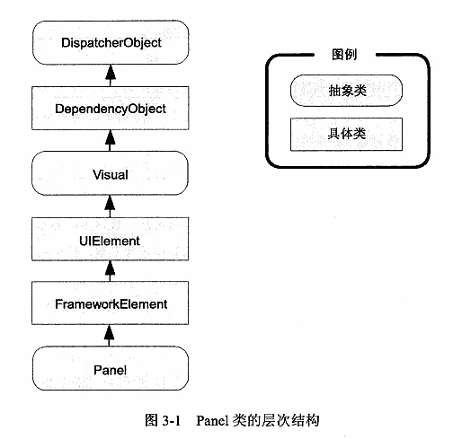

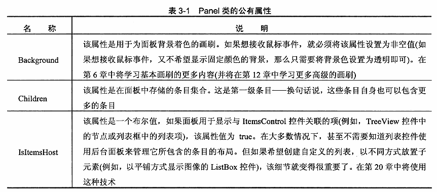

> **注意：**
>
> Panel类还包含了几个内部属性，如果希望创建自己的容器，就可以使用它们。最特别的是，可重写继承自FrameworkElement类的MeasureOverride()和ArrangeOverride()方法，以修改当组织子元素时面板处理测量阶段和排列阶段的方式。第18章将介绍如何创建自定义面板。

就Panel基类本身而言没有什么特别的，但它是其他更多特殊类的起点。WPF提供了大量可用于安排布局的继承自Panel的类，表3-2中列出了其中几个最基本的类。与所有WPF控件和大多数可视化元素一样，这些类位于System.Windows.Controls名称空间中。

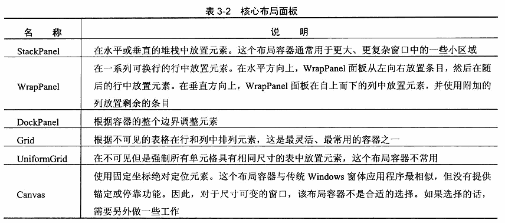

除这些核心容器外，还有几个更专业的面板，在各种控件中都可能遇到它们。这些容器包括专门用于包含特定控件子元素的面板——如TabPanel面板（在TabPanel面板中包含多个选项卡）、ToolbarPanel面板（工具栏中的多个按钮）以及ToolbarOverflowPanel面板（Toolbar控件的溢出菜单中的多个命令）。还有VirtualizingStackPanel面板，数据绑定列表控件使用该面板以大幅降低开销；还有InkCanvas控件，该控件和Canvas控件类似，但该控件支持处理平板电脑（TablePC）上的手写笔（stylus）输入（例如，根据选择的模式，InkCanvas控件支持使用指针绘制范围，以选择屏幕上的元素。也可通过普通计算机和鼠标使用InkCanvas控件，尽管这有点违反直觉）。本章将介绍InkCanvas，第19章将详细介绍VirtualizingStackPanel，在本书其他地方谈到相关控件时，将介绍其他专门的面板。

## 3.2 使用StackPanel面板进行简单布局

StackPanel面板是最简单地布局容器之一。该面板简单地在单行或单列中以堆栈形式布置其子元素。

例如，分析下面的窗口，该窗口包含4个按钮：

```xaml
<Window
    x:Class="StackPanel.MainWindow"
    xmlns="http://schemas.microsoft.com/winfx/2006/xaml/presentation"
    xmlns:x="http://schemas.microsoft.com/winfx/2006/xaml"
    xmlns:d="http://schemas.microsoft.com/expression/blend/2008"
    xmlns:local="clr-namespace:StackPanel"
    xmlns:mc="http://schemas.openxmlformats.org/markup-compatibility/2006"
    Title="Layout" Width="354" Height="223"
    mc:Ignorable="d">
    <StackPanel>
        <Label>A Button Stack</Label>
        <Button>Button 1</Button>
        <Button>Button 2</Button>
        <Button>Button 3</Button>
        <Button>Button 4</Button>
    </StackPanel>
</Window>

```

图3-2显示了最终得到的窗口。

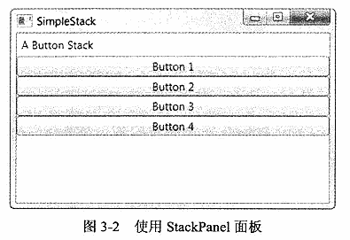

> **在Visual Studio中添加布局容器**
>
> 在Visual Studio中使用设计器创建这个示例要比较容易。首先删除Grid根元素（如果有的话）。然后将一个StackPanel面板拖动到窗口上。接下来将其他元素以所希望的自上而下的顺序（标签和4个按钮）拖放到窗口上。如果想重新排列StackPanel面板中的元素，可以简单地将它们拖动到新的位置。
>
> 虽然本书不会占用大量的篇幅来讨论Visual Studio的设计时支持特性，但实际上，自从推出首个WPF版本以来，Visual Studio已经做了很大的改进。例如，Visual Studio不再为添加到设计器中的每个新控件指定名称；而且除非您手动调整大小，Visual Studio不再添加硬编码的Width值和Height值。

默认情况下，StackPanel面板按自上而下的顺序排列元素，使每个元素的高度适合它的内容。在这个示例中，这意味着标签和按钮的大小刚好足够适应它们内部包含的文本。所有元素都被拉伸到StackPanel面板的整个宽度，这也是窗口的宽度。如果加宽窗口，StackPanel面板也会边框，并且按钮也会拉伸自身以适应变化。

通过设置Orientation属性，StackPanel面板也可用于水平排列元素：

```xaml
<StackPanel Orientation="Horizontal">
```

现在，元素指定它们的最小宽度（足以适合它们所包含的文本）并拉伸至容器面板的整个高度。根据窗口的当前大小，这可能导致一些元素不适应，如图3-3所示。

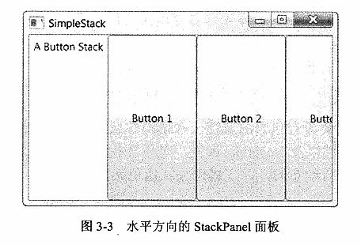

显然，这并未提供实际应用程序所需的灵活性。幸运的是，可使用布局属性对StackPanel面板和其他布局容器的工作方式进行精细调整，如稍后所述。

### 3.2.1 布局属性

尽管布局由容器决定，但子元素仍有一定的决定权。实际上，布局面板支持一小组布局属性，以便与子元素结合使用，在表3-3中列出了这些布局属性。

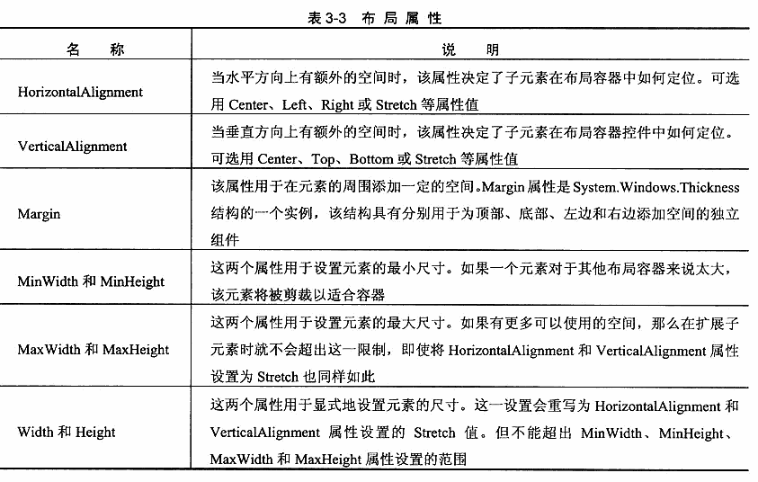

所有这些属性都从FrameworkElement基类继承而来，所以在WPF窗口中可使用的所有图形小组件都支持这些属性。

> **注意：**
>
> 您在第2章中已学习过，不同的布局容器可以为它们的子元素提供附加属性。例如，Grid对象的所有子元素可以获得Row和Column属性，以便选择容纳它们的单元格。通过附加属性可为特定的布局容器设置其特有的信息。然而，在表3-3中列出的布局属性是可以应用于许多布局面板的通用属性。因此，这些属性被定义为FrameworkElement基类的一部分。

这个属性列表就像它所没有包含的属性一样值得注意。如果查找熟悉的与位置相关的属性，例如Top属性、Right属性以及Location属性，是不会找到它们的。这是因为大多数布局容器（Canvas控件除外）都使用自动布局，并未提供显式定位元素的能力。

### 3.2.2 对齐方式

为理解这些属性的工作原理，可进一步分析图3-2中显示的简单StackPanel面板。在示例中——有一个垂直方向的StackPanel面板——VerticalAlignment属性不起作用，因为所有元素的高度都自动地调整为刚好满足各自需求。但HorizontalAlignment属性非常重要，它决定了各个元素在行的什么位置。

通常，对于Label控件，HorizontalAlignment属性的值默认为Left；对于Button控件，HorizontalAlignment属性的值默认为Stretch。这也是为什么每个按钮的宽度被调整为整列的宽度的原因所在。但可以改变这些细节：

```xaml
<StackPanel>
    <Label HorizontalAlignment="Center">A Button Stack</Label>
    <Button HorizontalAlignment="Left">Button 1</Button>
    <Button HorizontalAlignment="Right">Button 2</Button>
    <Button>Button 3</Button>
    <Button>Button 4</Button>
</StackPanel>
```

图3-4显示了最终结果。现在前面两个按钮的尺寸是它们应当具有的最小尺寸，并进行了对齐，而底部两个按钮被拉伸至整个StackPanel面板的宽度。如果改变窗口的尺寸，就会发现标签保持在中间位置，而前两个按钮分别被粘贴到两边。

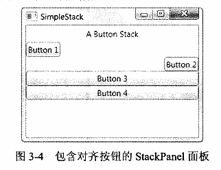

> **注意：**
>
> StackPanel面板也有自己的HorizontalAlignment和VerticalAlignment属性。这两个属性默认都被设置为Stretch，所以StackPanel面板完全充满它的容器。在这个示例中，这意味着StackPanel面板充满整个窗口。如果使用不同设置，StackPanel面板的尺寸将足够宽以容纳最宽的控件。

### 3.2.3 边距

### 3.2.4 最小尺寸、最大尺寸以及显式地设置尺寸

### 3.2.5 Border控件

Border控件不是布局面板，而是非常便于使用的元素，经常与面板一起使用。所以，在继续介绍其他布局面板之前，现在先介绍一下Border控件是有意义的。

Border类非常简单。它只能包含一段嵌套内容（通常是布局面板），并为其添加背景或在其周围添加边框。为了深入理解Border控件，只需要掌握表3-4中列出的属性就可以了。

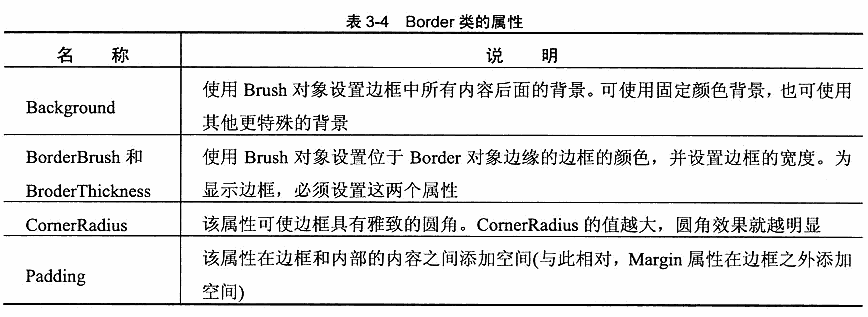

下面是一个具有轻微圆角效果的简单边框，该边框位于一组按钮的周围，这组按钮包含在一个StackPanel面板中：

```xaml
<Border Margin="5" Padding="5" VerticalAlignment="Top" Background="LightYellow" BorderBrush="SteelBlue" BorderThickness="3,5,3,5" CornerRadius="3">
    <StackPanel>
        <Button Margin="3">One</Button>
        <Button Margin="3">Two</Button>
        <Button Margin="3">Three</Button>
        <Button Margin="3">Four</Button>
    </StackPanel>
</Border>
```

图3-8显示了该例的结果。

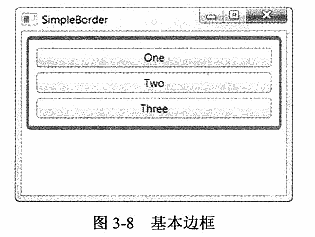

第6章将介绍有关画刷和颜色的详情，它们可用于设置BorderBrush和Background属性。

> **注意：**
>
> 从技术角度看，Border是装饰元素（decorator），装饰元素是特定类型的元素，通常用于在对象周围添加某些种类的图形装饰。所有装饰元素都继承自System.Windows.Controls.Decorator类。大多数装饰元素设计用于特定控件。例如，Button控件使用ButtonChrome装饰元素，以获取其特有的圆角和阴影背景效果；而ListBox控件使用ListBoxChrome装饰元素。还有两个更通用的装饰元素，当构造用户界面时它们非常有用：在此讨论的Border元素以及将在第12章中研究的Viewbox元素。

## 3.3 WrapPanel和DockPanel面板

显然，只使用StackPanel面板还不能帮助您创建出实用的用户界面。要设计出最终使用的用户界面，StackPanel面板还需要与其他更强大的布局容器协作。只有这样才能组装成完整的窗口。

最复杂的布局容器是Grid面板，稍后将分析该面板。在介绍Grid面板之前，有必要首先看一下WrapPanel和DockPanel面板，它们是WPF提供的两个更简单地布局容器。这两个布局容器通过不同的布局行为对StackPanel面板进行补充。

### 3.3.1 WrapPanel面板

WrapPanel面板在可能的空间中，以一次一行或一列的方式布置控件。默认情况下，WrapPanel.Orientation属性设置为Horizontal；控件从左向右进行排列，再在下一行中排列。但可将WrapPanel.Orientation属性设置为Vertical，从而在多个中放置元素。

> **提示：**
>
> 与StackPanel面板类似，WrapPanel面板实际上主要用来控制用户界面中一小部分的布局细节，并非用于控制整个窗口布局。例如，可能使用WrapPanel面板以类似工具栏控件的方式将所有按钮保持在一起。

下面的示例中定义了一系列具有不同对齐方式的按钮，并将这些按钮放到一个WrapPanel面板中：

```xaml
<WrapPanel Margin="3">
    <Button VerticalAlignment="Top">Top Button</Button>
    <Button MinHeight="60">Tall Button 2</Button>
    <Button VerticalAlignment="Bottom">Bottom</Button>
    <Button>Stretch</Button>
    <Button VerticalAlignment="Center">Centered Button</Button>
</WrapPanel>
```

图3-9显示了如何对这些按钮进行换行以适应WrapPanel面板的当前尺寸（WrapPanel面板的当前尺寸是由包含它的窗口的尺寸决定的）。正如这个示例所演示的，WrapPanel面板水平的创建了一系列假想的行，每一行的高度都被设置为所包含元素中最高元素的高度。其他控件可能被拉伸以适应这一高度，或根据VerticalAlignment（垂直对齐）属性的设置进行对齐。在图3-9的左图中，所有按钮都在位于较高的行中，并被拉伸或对齐以适应该行的高度。在右图中，有几个按钮被挤到第二行中。因为第二行没有包含特别高的按钮，所以第二行的高度保持为最小按钮的高度。因此，在该行中不必关心各按钮的VerticalAlignment属性的设置。

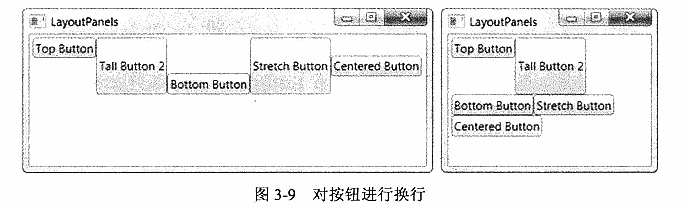

> **注意：**
>
> WrapPanel面板是唯一一个不能通过灵活使用Grid面板代替的面板。

## 3.3.2 DockPanel面板

DockPanel面板是更有趣的布局选项。它沿着一条外边缘来拉伸所包含的控件。理解该面板最简便的方法是，考虑一下位于许多Windows应用程序窗口顶部的工具栏。这些工具栏停靠到窗口顶部。与StackPanel面板类似，被停靠的元素选择它们布局的一个方面。例如，如果将一个按钮停靠在DockPanel面板的顶部，该按钮会被拉伸至DockPanel面板的整个宽度，但根据内容和MinHeight属性为其设置所需的高度。而如果将一个按钮停靠到容器左边，该按钮的高度将被拉伸以适应容器的高度，而其宽度可以根据需要自由增加。

这里很明显的问题是：子元素如何选择停靠的边？答案是通过Dock附加属性，可将该属性设置为Left、Right、Top或Bottom。放在DockPanel面板中的每个元素都会自动捕获该属性。

下面的示例在DockPanel面板的每条边上都停靠一个按钮：

```xaml
<DockPanel LastChildFill="True">
    <Button DockPanel.Dock="Top">Top Button</Button>
    <Button DockPanel.Dock="Bottom">Bottom Button</Button>
    <Button DockPanel.Dock="Left">Left Button</Button>
    <Button DockPanel.Dock="Right">Right Button</Button>
    <Button>Remaining Space</Button>
</DockPanel>
```

该例还将DockPanel面板的LastChildFill属性设置为true，该设置告诉DockPanel面板使最后一个元素占满剩余空间。图3-10显示了结果。

显然，当停靠控件时，停靠顺序很重要。在这个示例中，顶部和底部按钮充满了DockPanel使最后一个元素占满剩余空间。图3-10显示了结果。

显然，当停靠控件时，停靠顺序很重要。在这个示例中，顶部和底部按钮充满了DockPanel面板的整个边缘，这是因为这两个按钮首先被停靠。接着停靠左边和右边的按钮时，这两个按钮将位于顶部按钮和底部按钮之间。如果改变这一顺序，那么左边和右边的按钮将充满整个面板的边缘，而顶部和底部的按钮则变窄一些，因为它们将在左边和右边的两个按钮之间进行停靠。

可将多个元素停靠到同一边缘。这种情况下，元素按标记中声明的顺序停靠到边缘。而且，如果不喜欢空间分割或拉伸行为，可修改Margin属性、HorizontalAlignment（水平排列）属性以及VerticalAlignment（垂直排列）属性，就像使用StackPanel面板进行布局时所介绍的那样。下面是前面演示的程序的修改版本：

```xaml
<DockPanel LastChildFill="True">
    <Button DockPanel.Dock="Top">A Stretched Top Button</Button>
    <Button HorizontalAlignment="Center" DockPanel.Dock="Top">A Centered Top Button</Button>
    <Button HorizontalAlignment="Left" DockPanel.Dock="Top">A Left-Aligned Top Button</Button>
    <Button DockPanel.Dock="Bottom">Bottom Button</Button>
    <Button DockPanel.Dock="Left">Left Button</Button>
    <Button DockPanel.Dock="Right">Right Button</Button>
    <Button>Remaining Space</Button>
</DockPanel>
```

停靠行为保持不变。首先停靠顶部按钮，然后是底部按钮，顶部和底部按钮之间剩余的空间会被分割，并且最后一个按钮在中间。图3-11显示了最终窗口。

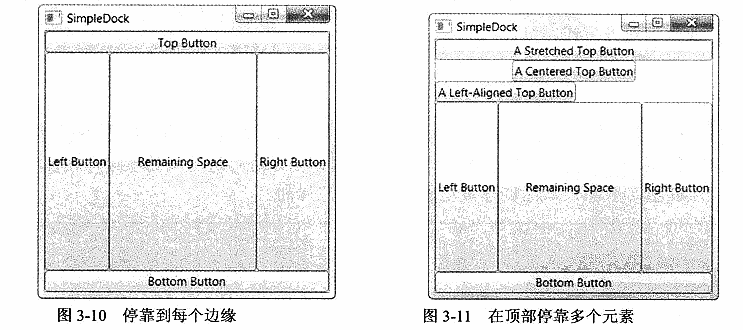

### 3.3.3 嵌套布局容器

很少单独使用StackPanel、WrapPanel和DockPanel面板。相反，它们通常用来设置一部分用户界面的布局。例如，可使用DockPanel面板在窗口的合适区域放置不同的StackPanel和WrapPanel面板容器。

例如，假设希望创建一个标准对话框，在其右下角具有OK按钮和Cancel按钮，并且在窗口的剩余部分是一块较大的内容区域。在WPF中可以采用几种方法完成这一布局，但最简单的方法如下，该方法使用前面介绍过的各种面板：

（1）创建水平StackPanel面板，用于将OK按钮和Cancel按钮放置在一起。

（2）在DockPanel面板中放置StackPanel面板，将其停靠到窗口底部。

（3）将DockPanel.LastChildFill属性设置为true，以使用窗口剩余的部分填充其他内容。在此可以添加另一个布局控件，或者只添加一个普通的TextBox控件（本例中使用的是TextBox控件）。

（4）设置边距属性，提供一定的空白空间。

下面是最终的标记：

```xaml
<DockPanel LastChildFill="True">
    <StackPanel HorizontalAlignment="Right" DockPanel.Dock="Bottom" Orientation="Horizontal">
        <Button Margin="10,10,2,10" Padding="3">OK</Button>
        <Button Margin="2,10,10,10" Padding="3">Cancel</Button>
    </StackPanel>
    <TextBox Margin="10" DockPanel.Dock="Top">This is a test.</TextBox>
</DockPanel>
```

在这个示例中，Padding属性在按钮边框与内部的内容（单词OK或Cancel）之间添加了尽量少的空间。图3-12显示了这个示例创建的相对流行的对话框。

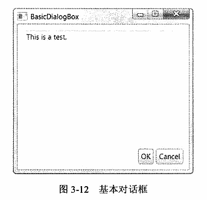

乍一看，相对于使用坐标精确地放置控件而言，这有些多余。在许多情况下，确实如此。不过，设置时间固然较长，但这样做的好处是在将来可以很方便地修改用户界面。例如，如果决定让OK按钮和Cancel按钮位于窗口底部的中间，只需要修改包含这两个按钮的StackPanel面板的对齐方式即可：

```xaml
<StackPanel HorizontalAlignment="Center" DockPanel.Dock="Bottom" Orientation="Horizontal">
```

与诸如Windows窗体的旧式用户界面框架相比，这里使用的标记更整洁、更简单也更紧凑。如果为这个窗口添加一些样式（详见第11章），还可对该窗口进行进一步的改进，并移除其他不必要的细节（如边距设置），从而创建真正的自适应用户界面。

> **提示：**
>
> 如果有一课茂密的嵌套元素树，很可能看不到整个结构。Visual Studio提供了一个方便的功能，用于显示一课表示各个元素的树，并允许您通过逐步单击进入希望查看（或修改）的元素。这一功能是指Document Outline窗口，可通过选择View | Other Windows | Document Outline菜单项来显示该窗口。

## 3.4 Grid面板

Grid面板是WPF中功能最强大的布局容器。很多使用其他布局控件能完成的功能，用Grid面板也能实现。Grid面板也是将窗口分割成（可使用其他面板进行管理的）更小区域的理想工具。实际上，由于Grid面板十分有用，因此在Visual Studio中为窗口添加新的XAML文档时，会自动添加Grid标签作为顶级容器，并嵌套在Window根元素中。

Grid面板将元素分隔到不可见的行列网格中。尽管可在一个单元格中放置多个元素（这时这些元素会相互重叠），但在每个单元格中只放置一个元素通常更合理。当然，在Grid单元格中的元素本身也可能是另一个容器，该容器组织它所包含的一组组件。

> **提示：**
>
> 尽管Grid面板被设计成不可见的，但可将Grid.ShowGridLines属性设置为true，从而更清晰地观察Grid面板。这一特性并不是真正试图美化窗口，反而是为了方便调试，设计该特性旨在帮助理解Grid面板如何将其自身分割成多个较小的区域。这一特性十分重要，因为通过该特性可准确控制Grid面板如何选择列宽和行高。

需要两个步骤来创建基于Grid面板的布局。首先，选择希望使用的行和列的数量。然后，为每个包含的元素指定恰当的行和列，从而在合适的位置放置元素。

Grid面板通过使用对象填充Grid.ColumnDefinitions和Grid.RowDefinitions集合来创建网格和行。例如，如果确定需要两行和三列，可添加以下标签：

```xaml
<Grid ShowGridLines="True">
    <Grid.RowDefinitions>
        <RowDefinition></RowDefinition>
        <RowDefinition></RowDefinition>
    </Grid.RowDefinitions>
    <Grid.ColumnDefinitions>
        <ColumnDefinition></ColumnDefinition>
        <ColumnDefinition></ColumnDefinition>
    </Grid.ColumnDefinitions>
</Grid>
```

每个元素必须被明确地放在对应的单元格中。可在单元格中放置多个元素（通常这没什么意义），或让单元格保持为空（这通常是有用的）。也可以不按顺序声明元素，正如本例中的最后两个按钮那样。但如果逐行（并在每行中按从右到左的顺序）定义控件，可使标记更清晰。

此处存在例外情况。如果不指定Grid.Row属性，Grid面板会假定该属性的值为0.对于Grid.Column属性也是如此。因此，在Grid面板的第一个单元格中放置元素时可不指定这两个属性。

> **注意：**
>
> Grid面板在预定义的行和列中放置元素。这与WrapPanel和StackPanel面板（当他们布置子元素时，会隐式地创建行或列）等布局容器不同。如果希望创建具有多行和多列的网格，就必须使用RowDefinitions和ColumnDefinitions对象显式地定义行和列。

图3-13显示了这个简单网格在两种不同尺寸的情形下是如何显示的。注意，ShowGridLines属性被设置为true，从而可以看到每列和每行之间的分割线。

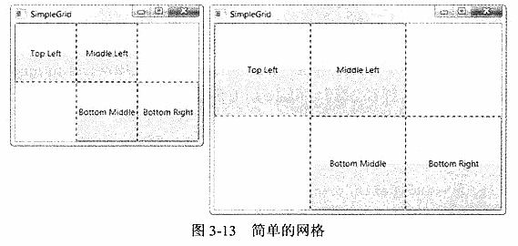

正如您所期望的，Grid面板具有在表3-3中列出的基本布局属性集。这意味着可在单元格内容的周围添加边框，从而改变元素尺寸的变化方式，使其不充满整个单元格，并且可以沿着单元格的一条边缘对齐元素。如果强制一个元素的尺寸大于单元格允许的范围，那么这个元素的部分内容会被剪裁掉。

> **在Visual Studio中使用Grid面板**
>
> 在Visual Studio设计视图中使用Grid面板时，将发现它和其他布局容器有些不同。当把一个元素拖动到Grid面板中时，Visual Studio允许将该元素放置到精确位置。Visual Studio通过设置元素的Margin属性完成这一工作。
>
> 在设置边距时，Visual Studio使用最近的角。例如，如果元素距离网格的左上角最近，那么Visual Studio通过上边和左边的边距来定位元素（并且右边和下边的边距保持为0）。如果拖动元素使其距左下角较近，那么Visual Studio设置下边和左边的边距，并将VerticalAlignment属性设置为Bottom。当网格大小发生变化时，这显然会影响元素的移动方式。
>
> Visual Studio中的边距设置过程看起来非常直接，但在大多数情况下得不到所期望的结果。您通常希望得到更灵活地流式布局，以允许一些元素可动态扩展，并将其他元素推挤到其他位置。在这种情形下，将发现通过Margin属性的硬编码定位是非常不灵活的。当添加多个元素时问题会更加严重，因为Visual Studio不能自动地添加新的单元格。因此，所有元素将被放到同一单元格中。不同元素可与Grid面板的不同拐角对齐，当窗口大小发生变化时，又会导致这些元素彼此之间相对移动（甚至互相重叠）。
>
> 一旦理解Grid面板的工作原理，就可以正确地解决这些问题。第一个技巧是在添加元素之前定义Grid面板的行和列（可通过Properties窗口编辑RowDefinitions和ColumnDefinitions集合）并对Grid面板进行配置。一旦设置好Grid面板，即可将元素拖放到Grid面板中，并使用Properties窗口或通过手动编辑XAML来配置它们的边距和对齐方式设置。

### 3.4.1 调整行和列

如果Grid面板只是按比例分配尺寸的行和列的集合，它也就没什么用处了。幸运的是，情况并非如此。为了充分发挥Grid面板的潜能，可更改每一行和每一列的尺寸设置方式。

Grid面板支持以下三种设置尺寸的方式：

* **绝对设置尺寸方式**。使用设备无关的单位精确地设置尺寸。这是最无用的策略，因为这种策略不够灵活，难以适应内容大小和容器大小的改变，而且难以处理本地化。
* **自动设置尺寸方式**。每行和每列的尺寸刚好满足需要。这是最有用的尺寸设置方式。
* **按比例设置尺寸方式**。按比例将空间分割到一组行和列中。这是对所有行和列的标准设置。例如，从图3-13中可看到当扩展Grid面板时，所有单元格都按比例增加尺寸。

为了获得最大的灵活性，可混合使用这三种尺寸设置方式。例如，创建几个自动设置尺寸的行，然后通过按比例设置尺寸的方式让最后的一行或两行充满剩余的空间，这通常是很有用的。

可通过将ColumnDefinition对象的Width属性或RowDefinition对象的Height属性设置为数值来确定尺寸设置方式。例如，下面的代码显示了如何设置100设备无关单位的绝对宽度：

```xaml
<ColumnDefinition Width="100"></ColumnDefinition>
```

为使用自动尺寸设置方式，可使用Auto值：

```xaml
<ColumnDefinition Width="Auto"></ColumnDefinition>
```

最后，为了使用按比例尺寸设置方式，需要使用星号（*）：

```xaml
<ColumnDefinition Width="*"></ColumnDefinition>
```

如果混合使用按比例尺寸设置方式和其他尺寸设置方式，就可以在剩余的任意空间按比例改变行或列的尺寸。

如果希望不均匀地分割剩余空间，可指定权重，权重必须放在星号之前。例如，如果有两行是按比例设置尺寸，并希望第一行的高度是第二行高度的一半，那么可以使用如下设置来分配剩余空间：

```xaml
<RowDefinition Height="*"></RowDefinition>
<RowDefinition Height="2*"></RowDefinition>
```

上面的代码告诉Grid面板，第二行的高度应是第一行高度的两倍。可使用您喜欢的任何数字来划分剩余空间。

> **注意：**
>
> 通多代码可以很方便地与ColumnDefinition和RowDefinition对象进行交互。只需要知道Width和Height属性是GridLength类型的对象即可。为创建表示特定尺寸的GridLength对象，只需要为GridLength类的构建函数传递一个合适的数值即可。为了创建一个表示按比例设置尺寸（*）的GridLength对象，可为GridLength类的构造函数传递数值作为第一个参数，并传递GridUnitType.Stat作为第二个参数。要指定使用自动设置尺寸方式，可使用静态属性GridLength.Atuo

使用这些尺寸设置方式，可重现图3-12中所示的简单示例对话框。使用顶级的Grid容器将窗口分成两行，而不是使用DockPanel面板。下面是所需要的标记：

```xaml
<Grid ShowGridLines="True">
    <Grid.RowDefinitions>
        <RowDefinition Height="*">
        </RowDefinition>
        <RowDefinition Height="Auto">
        </RowDefinition>
    </Grid.RowDefinitions>
    <TextBox Grid.Row="0" Margin="10">This is a test.</TextBox>
    <StackPanel Grid.Row="1" HorizontalAlignment="Right" Orientation="Horizontal">
        <Button Margin="10,10,2,10" Padding="3">OK</Button>
        <Button Margin="2,10,10,10" Padding="3">Cancel</Button>
    </StackPanel>
</Grid>
```

> **提示：**
>
> 这个Grid面板为声明任何列，如果Grid面板只有一列并且该列是按比例设置尺寸的（从而该列充满整个Grid面板的宽度），那么这是一种可使用的快捷方式。

上面的标记稍长些，但按显示顺序声明控件具有一项有点，可使标记更容易理解。在该例中使用的方法仅仅是一种选择，如果愿意，也可使用一行两列的Grid面板来代替嵌套的StackPanel面板。

> **注意：**
>
> 使用嵌套的Grid面板容器，几乎可以创建如何用户界面（例外是使用WrapPanel面板换行或换列）。但当处理用户界面中的一小部分或布置少量元素时，通常使用更特殊的StackPanel和DockPanel面板容器以便简化操作。

### 3.4.2 布局舍入

如第1章所述，WPF使用分辨率无关的测量系统。尽管该测量系统为使用各种不同的硬件提供了灵活性，但有时也会引入一些问题。其中一个问题是元素可能被对齐到子像素（subpixel）边界——换句话说，使用没有和物理像素准确对齐的小数坐标定位元素。可通过为相邻的布局容器提供非整数尺寸强制发生这个问题。但是当不希望发生这个问题时，在某些情况下该问题也可能会出现，例如当创建按比例设置尺寸的Grid面板时就可能会发生该问题。

例如，假设使用一个包含两列且具有200像素的Grid面板。如果该面板均匀分成两个按比例设置尺寸的列，那么意味着每列为100像素宽。但是如果这个Grid面板的宽度为175像素，就不能很清晰地分割成两列，并且每列为87.5像素。这意味着第二列会和原始的像素边界稍有些错位。这通常不是问题，但是如果该列包含一个形状元素、一个边框或一幅图像，那么该内容的显示可能是模糊的，因为WPF会使用反锯齿功能“混合”原来清晰的像素边界边缘。图3-14显示了这一问题。该图放大了窗口的一部分，该窗口包含两个Grid面板容器。最上面的Grid面板没有使用布局舍入（layout rounding），所以矩形的清晰边缘在特定的窗口尺寸下变得模糊了。

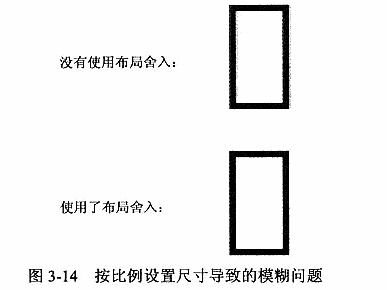

如果这个问题影响到布局，可以采用一种方法很方便地解决该问题。只需要将布局容器的UserLayoutRounding属性设置为true：

```xaml
<Grid UseLayoutRounding="True">
```

现在，WPF会确保布局容器中的所有内容对齐到最近的像素边界，从而消除了所有模糊问题。

### 3.4.3 跨越行和列

您已经看到如何使用Row和Column附加属性在单元格中放置元素。还可以使用另外两个附加属性使元素跨越多个单元格，这两个附加属性是RowSpan和ColumnSpan。这两个属性使用元素将会占有的行数和列数进行设置。

例如，下面的按钮将占据第一行中的第一个和第二个单元格的所有空间：

```xaml
<Button Grid.Row="0" Grid.RowSpan="2" Grid.Column="0">Span Button</Button>
```

下面的代码通过跨越两列和两行，拉伸按钮使其占据所有4个单元格：

```xaml
<Button Grid.Row="0" Grid.RowSpan="2" Grid.Column="0" Grid.ColumnSpan="2">Span Button</Button>
```

通过跨越行和列可得到更有趣的效果，当需要在由分割器或更长的内容区域分开的表格结构中放置元素时，这是非常方便的。

使用列跨越特征，可以只使用Grid面板重新编写图3-12中的简单示例对话框。Grid面板将窗口分割成三列，展开文本框使其占据所有的三列，并使用最后两列对齐OK按钮和Cancel按钮：

```xaml
<Grid ShowGridLines="True">
    <Grid.RowDefinitions>
        <RowDefinition Height="*" />
        <RowDefinition Height="Auto" />
    </Grid.RowDefinitions>
    <Grid.ColumnDefinitions>
        <ColumnDefinition Width="*" />
        <ColumnDefinition Width="Auto" />
        <ColumnDefinition Width="Auto" />
    </Grid.ColumnDefinitions>
    <TextBox Grid.Row="0" Grid.Column="0" Grid.ColumnSpan="3" Margin="10">This is a test.</TextBox>
    <Button Grid.Row="1" Grid.Column="1" Margin="10,10,2,10" Padding="3">OK</Button>
    <Button Grid.Row="1" Grid.Column="2" Margin="2,10,10,10" Padding="3">Cancel</Button>
</Grid>
```

大多数开发人员认为这种布局不清晰也不明智。列宽由窗口底部的两个按钮的尺寸决定，这使得难以向已经存在的Grid结构中添加新内容。即使向这个窗口增加很少的内容，也必须创建新的列集合。

正如上面所显示的，当为窗口选择布局容器时，不仅关心能否得到正确的布局行为——还希望构建便于在未来维护和增强的布局结构。一条正确的经验法则是，对于一次性的布局任务，例如排列一组按钮，使用更小的布局容器（如StackPanel）。但如果需要为窗口中的多个区域使用一致的结构（比如稍后再图3-22中演示的一列文本框），对于标准化布局而言，Grid面板是必不可少的工具。

### 3.4.4 分割窗口

每个Windows用户都见过分割条——能将窗口的一部分与另一部分分离的可拖动分割器。例如，当使用Windows资源管理器时，会看到一系列文件夹（在左边）和一系列文件（在右边）。可拖动它们之间的分割条来确定每部分占据窗口的比例。

在WPF中，分割条由GridSplitter类表示，它是Grid面板的功能之一。通过为Grid面板添加GridSplitter对象，用户就可以改变行和列的尺寸。图3-15显示了一个窗口，在该窗口中有一个GridSplitter对象，它位于Grid面板的两列之间。通过拖放分割条，用户可以改变两列的相对宽度。

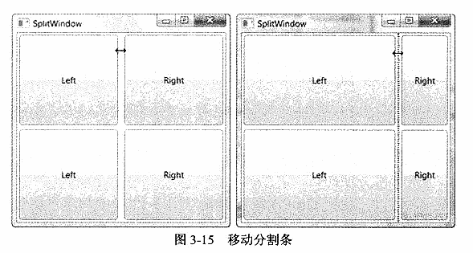

大多数开发人员认为WPF中的GridSplitter类不是最直观的。理解如何使用GridSplitter类，从而得到所期望的效果需要一定的经验。下面列出几条指导原则：

* GridSplitter对象必须放在Grid单元格中。可与已经存在的内容一并放到单元格中，这时需要调整边距设置，使它们不相互重叠。更好的方法是预留一列或一行专门用于放置GridSplitter对象，并将预留行或列的Height或Width属性的值设置为Auto。
* GridSplitter对象总是改变整行或整列的尺寸（而非改变单元格的尺寸）。为使GridSplitter对象的外观和行为保持一致，需要拉伸GridSplitter对象使其穿越整行或整列，而不是将其限制在单元格中。为此，可使用前面介绍过的RowSpan或ColumnSpan属性。例如，图3-15中GridSplitter对象的RowSpan属性被设置为2，因此被拉伸充满整列。如果不使用该设置，GridSplitter对象会显示在顶行（放置它的行）中，即使这样，拖动分割条时也会改变整列的尺寸。
* 最初，GridSplitter对象很小不易看见。为了使其更可用，需要为其设置最小尺寸。对于竖直分割条（图3-15中显示的分割条），需要将VerticalAlignment属性设置为Stretch（使分割条填满区域的整个高度），并将Width设置为固定值（如10个设备无关单位）。对于水平分割条，需要设置HorizontalAlignment属性来拉伸，并将Height属性设置为固定值。
* GridSplitter对齐方式还决定了分割条是水平的（用于改变行的尺寸）还是竖直的（用于改变列的尺寸）。对于水平分割条，需要将VerticalAlignment属性设置为Center（这也是默认值），以指明拖动分割条改变上面行和下面行的尺寸。对于竖直分割条（图3-15中显示的分割条），需要将HorizontalAlignment属性设置为Center，以改变分割条两侧列的尺寸。

> **注意：**
>
> 可使用GridSplitter对象的ResizeDirection和ResizeBehavior属性修改其尺寸调整行为。然而使这一行为完全取决于对齐方式将更简单，这也是默认设置。

您是不是觉得茫然了？为了进一步强化这些规则，分析一下在图3-15中所演示程序的实际标记是有帮助的。下面的程序清单以加粗形式显示了GridSplitter对象的细节：

```xaml
<Grid>
    <Grid.RowDefinitions>
        <RowDefinition />
        <RowDefinition />
    </Grid.RowDefinitions>
    <Grid.ColumnDefinitions>
        <ColumnDefinition MinWidth="100" />
        <ColumnDefinition Width="Auto" />
        <ColumnDefinition MinWidth="50" />
    </Grid.ColumnDefinitions>

    <Button Grid.Row="0" Grid.Column="0" Margin="3">Left</Button>
    <Button Grid.Row="0" Grid.Column="2" Margin="3">Right</Button>
    <Button Grid.Row="1" Grid.Column="0" Margin="3">Left</Button>
    <Button Grid.Row="1" Grid.Column="2" Margin="3">Right</Button>

    <GridSplitter
        Grid.Row="0" Grid.RowSpan="2" Grid.Column="1"
        Width="3" HorizontalAlignment="Center" VerticalAlignment="Stretch"
        ShowsPreview="False" />
</Grid>
```

> **提示：**
>
> 为了成功地创建GridSplitter对象，务必为VerticalAlignment、HorizontalAlignment以及Width属性（或Height属性）提供相应的属性值。

上面的标记还包含了一处额外的细节。在声明GridSplitter对象时，将ShowsPreview属性设置为false。因此，当把分割条


## 3.7 小结

本章详细介绍了WPF布局模型，并讨论了如何以堆栈、网格以及其他排列方式放置元素。可使用嵌套的布局容器组合创建更复杂的布局，可结合使用GridSplitter对象创建可变的分割窗口。本章一直非常关注这一巨大变化的原因——WPF布局模型在保持、加强以及本地化用户界面方面所具有的优点。

布局内容远不止这些。接下来的几章还将列举更多使用布局容器组织元素分组的示例，还将学习允许在窗口中排列内容的几个附加功能：

* **特殊容器**。可以使用ScrollViewer、TabItem以及Expander控件滚动内容、将内容放到单独的选项卡中以及折叠内容。与布局面板不同，这些容器只能包含单一内容。不过，可以很容易地组合使用这些容器和布局面板，以便准确实现所需的效果。第6章将尝试使用这些容器。
* **Viewbox**。需要一种方法来改变图形内容（如图像和矢量图形）的尺寸吗？Viewbox是另一种特殊容器，可以帮助您解决这一问题，而且Viewbox控件内置了缩放功能。在第12章中，您将首次接触到Viewbox容器。
* **文本布局**。WPF新增了用于确定大块格式化文本布局的新工具。可使用浮动图形和列表，并且可以使用分页、分列以及更复杂、更智能的换行功能来获得非常完美的结果。第28章将介绍文本布局的方式。