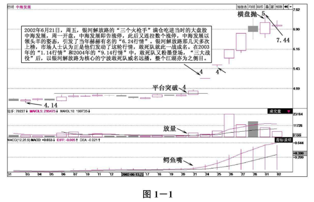

# 第一章 短线之王

“十步杀一人，千里不留行；事了拂衣去，深藏功与名。”人们说起江湖故事时，总是那么兴味盎然。涨停板敢死队，被喻为中国股市中最神秘的“短线之王”，风起于2002年，在股市翻云覆雨的十几年中，他们留下了无数令人惊诧的经典案例，却没有给中国股民留下一个清晰的身影。这是一支神秘的队伍，他们手握独门绝技，其绝妙而又凶悍的操盘手法，所向披靡，让旁观者艳羡，令局中人闻风丧胆。敢死队堪称是近年来波段实战出类拔萃的职业机构代表，其最成功之处是深刻领会并掌握了市场中个股上涨和下跌过程的惯性原理，然后在最恰当的时机严格顺势操作，作为笔者的重点研究对象，他们有很多优点值得我们去学习。

## 第一节 涨跌停板

涨跌停板制度源于国外早期证券市场，是证券市场上为了防止交易价格的暴涨暴跌，抑制过度投机现象，对每只证券当前价格的涨跌幅度予以适当限制的一种交易制度，即规定交易价格在一个交易日中的最大波动幅度为前一交易日收盘价上下百分之几，超过后停止交易。

我国证券市场现行的涨跌停板制度是1996年12月13日发布、1996年12月26日开始实施的。制度规定，除上市首日外，股票（含A股、B股）、基金类证券在一个交易日内的交易价格相对上一交易日收市价格的涨跌幅度不得超过10%（ST股票日涨跌幅限制为5%），超过涨跌幅限价的委托为无效委托。我国的涨跌停板制度与国外的区别主要在于股价达到涨跌停板后，不是完全停止交易，而是在涨跌停价位或涨跌停价位之内的交易仍可继续进行，直到当日收市为止。管理层推出涨跌停板制度的出发点是好的，主要是为了保护中小投资者的利益，但在实际操作的过程中却又存在一些弊端。

### 一、扭曲股价走势

股票的涨跌有其自身规律，用行政手段来限制只会适得其反。迄今为止还没有一只股票是因为有了涨跌停板最终涨得少了，相反往往是轻易地涨过了头，因为越是买不到越是涨得厉害，从而引起股价更加剧烈的震荡。反过来跌也一样容易跌过头，股价走势的非理性在ST股票上表现得尤其明显，今天开盘涨停，明天开盘就可能跌停。股价不仅不因涨跌停板变得理性，反而更不理性了。

### 二、给股民操作设立障碍

因为涨跌停板制度使股民的操作难度陡增，好的股票买不到，不好的股票要么卖不掉，等买到了或卖掉了，股民往往吃大亏，因为这时的股价是严重失实的，股民被憋急了容易冲动。

### 三、为主力操纵股价提供便利

涨跌停板制度给股民的操作增加难度的同时，也为主力操纵股价提供了方便。主力利用其信息优势、资金优势和跑道优势大肆做盘做图形，诱骗股民上当，或被深套，或廉价割肉。

德国哲学家黑格尔说过：“存在即合理。”既然我们不可能去改变它，那么就学会适应它，进而利用它，凡事有利必有弊，关键在于我们要学会积极面对，扬长避短。而本书主要的内容就是详细地向大家讲解怎样巧用涨停板来捕捉股市中的黑马。本节我们先了解一下涨跌停板的计算方法，智能手机上都有计算器，因此大家计算起来也很方便：

涨停板（当日上涨10%）计算公式：

```
上个交易日收盘价x1.1=今日涨停价
```

例如，招商证券（600999）在2014年11月20日收盘价为13.50元，11月21日涨停价为13.50x1.1=14.85（元）。

跌停板（当日下跌10%）计算公式：

```
上个交易日收盘价x0.9=今日跌停价
```

例如，招商证券（600999）在2015年1月16日（周五）收盘价为26.71元，1月19日（周一）跌停价为26.71x0.9=24.039（元）（四舍五入为24.04元）。

## 第二节 一战成名

现在谈起2002年的“6.24行情”，还是会令一些老股民激动不已。当天股价达到创纪录的800多亿元成交额，其中中海发展、招商银行等此前令人恐惧的大盘股，在当日拔地而起，不断大幅上涨，被股民形容为“大象起舞”。

图1-1是中海发展（600026）在2002年5月到2002年6月段时间的日K线图。该案例主要运用了五线开花之平台突破的操盘技巧，我们看到图中该股缩量构造平台，横盘整理一段时间后突现放量向上突破，这就是股价进入拉升的标志，见图中左4处。随后该股连拉了几个涨停，从当时的公开信息可以看到，敢死队参与了中海发展的操作，只是介入的时间稍晚，在中海发展的第二个涨停板才出现敢死队的影子。本次操作属于敢死队高空作业、塑造行情领涨龙头的经典，领涨地位一旦得到确立，跟风盘就会非常踊跃，为敢死队快进快出、获取短线超额利润创造了条件。该案例将敢死队操作凶悍、做多之坚决、拉升之魄力表现的淋漓尽致。



当时的数据显示，在领头羊中海发展连续6个达到10%涨幅的日子里，银行证券宁波解放南路营业部不断现身上海证券交易所公布的“龙虎榜”。例如，6月27日，中海发展一共成交了7.7354亿元，银河证券宁波解放南路营业厅成交7064万元，几乎占据了9%的份额。而作为这场战役的幕后操作者，宁波涨停板敢死队四处出击，成功地运用近1亿元的至今，赚取了2000万元的利润，上演了一幕胜利大逃亡。经此一役，涨停板敢死队一战成名，其身影如雨后春笋般遍布大大小小的营业部，股市更是流传“炒股不跟解放南，便是神仙也枉然”，从而弥补了“南雷北赵成绝响，人间不见短线王”之后的遗憾。

据悉，敢死队成员都是自有资金，连代客理财都没有。敢死队以吃主力为生，即洞悉主力动向，果断吃进，火速撤退，具体到操作风格，概况成三个字：快、准、狠。涨停板敢死队的操作手法就是典型的短线炒作，手法凶悍，永远是打短线，只赚取10%甚至5%左右就立即离场。这支涨停板敢死队虽然创造了财富传奇，多年来却一直以一种特立独行的姿态游离于公众视野之外。市场对于涨停板敢死队的认识大部分还停留在手法凶悍、勇往直前的直观印象上，对其背后的运作内情却知之甚少。敢死队在声名鹊起之时，也招来了众多非议和打击，当然这是后话了。

## 第三节 制胜法宝

有人的地方就有江湖。在股市这个大江湖中，有一群人总会掀起不同寻常的波澜，这就是股民口中的“涨停板敢死队”。说道涨停板敢死队，投资者首先会想到东吴证券杭州湖墅南路、国信证券深圳泰然九路、银行证券宁波解放南路等涨停板敢死队大佬。不过，随着各路机构、游资逐鹿股市，一些后起之秀也开始崭露头角。本节我们就来聊一聊敢死队纵横股市的制胜法宝，当然这也许揭开的只是涨停板敢死队操盘手法的冰山一角。总结涨停板敢死队长期的操作手法，我们可以归纳为以下六点：

### 一、预判市场

有人可能会问：为什么敢死队选择的股票，都会有人去跟风买入？其实他们的研究能力十分强，有报道指出，他们十分擅长基本面与股价关系的分析，而且总是提前研究最近可能出现的重大题材，还会对选出的题材进行排序，最终才确定”攻击“的对象，同时对大盘的走势也能准确把握，因此往往是一拉一个准。

### 二、兵贵神速

敢死队最大的一个特点就是“速度”奇快。当很多人没有反应过来的时候，敢死队已经完成建仓、拉升、出货一系列动作，早已赚得盆满钵满。比如，有的敢死队在具体操作时甚至还有“不论盈亏第二天坚决卖出”的规定，他们认为涨停的股票，第二个交易日一般会延续良好的势头，因此出货并不困难。即使出现亏损，也会坚决卖出，因此损失也不会很大，而且成功率极高。

### 三、控制成本

虽然敢死队是在进行短线操作，但成本控制仍是风险控制中非常重要的环节。他们懂得借助市场的力量，顺势而为，买入成本往往低于市场平均成本，因此在拉出涨停板后，也不至于马上引来解套盘，可以保证第二天安全脱身。

### 四、制造热点

有投资者感叹一天一个热点，有时甚至一天内出现几个市场热点，难以把握。这些无疑都是敢死队的杰作，特别是当市场处于弱势，机构等主力机构犹豫不决，几乎没有大动作时，敢死队们速战速决，继续上演涨停风暴。有时候甚至是无中生有的消息也成为他们疯狂炒作的题材。而资产重组则是股市永恒的题材，如高送转、定向增发等。

### 五、铁血纪律

证券市场的风险是无处不在的，只要在这个市场，不管是机构投资者还是普通投资者，随时都面临巨大的风险，即使是善于短线运作的敢死队也不例外。敢死队运作的股票也有失败的时候，但敢死队之所以乐此不疲地仍旧钟情于短线操作，并且能生存下来，一个十分关键的因素就是敢死队有着极其严格的操作纪律和止损原则，对于操作失败的股票敢于及时出局，止损了结，从而避免了重大损失，保证有足够的资金进行下一次运作。这可能就是敢死队长盛不衰的根本原因，也是普通投资者值得借鉴和学习的地方。

### 六、非常专注

敢死队都是非常专注的投资者，通常情况下，他们的一天是这样度过的：每天一早就开始研究市场信息和公司情况，开盘前就进入大户室，交易时间绝不离开盘，中午一般简单用餐，下午继续交易，收盘后开始总结一天的操作情况，晚上复盘和研究股票。他们每天研究股市超过12小时，几乎没有娱乐和其他爱好。据我所知，他们的这种习惯已经持续了很多年。毫无疑问，敢死队是市场中最为勤奋和专注的投资人，没有之一。股市是一个胜者为王的丛林，充满了危险，如果注意力不够集中，很容易成为主力猎食的对象。唯有无与伦比的专注，才能获得超乎寻常的回报。尽管过程会很枯燥，但想要获胜，这是必不可少的代价。

在笔者看来，敢死队对于大众投资心理超强的把握能力以及出现失误后的壮士断腕的勇气，才是其获利的最重要的法宝。涨停板敢死队的操盘手法，同时也诠释了市场中“适者生存”的古老法则。不过，简单复制这一模式，结果说不定会适得其反。要在这个讯息万变的市场中立于不败之地，每个投资者必须尊重市场内在的规律，并结合自身的性格、资金等特点，建立一套适合自己的盈利模式。

## 第四节 卧虎藏龙

股市如战场，在每天四个小时的大战中，各路人马搏杀其中。首先是由基金等机构组成的规模庞大的“主力集团军”；其次是散兵游勇单独作战的个人股民；另外有一支游离于两者之外，战略战术与众不同的“快速反应部队”更加引人注目，他们就是号称”涨停板敢死队“的私募游资们。接下来我们就全面透视涨停板敢死队聚集的十大营业部，对其江湖背景、操盘手法一一进行解析，因为这些卧虎藏龙的营业部目前已成为黑马的集中营。

### 一、国信泰然九路营业部

该营业部是近年来上榜次数最多的营业部，是最近几年来蜚声国内的游资后起之秀，尤其是在2010年之后，该营业部成交额一直在国内诸多营业部中首屈一指，上榜次数之多、成交金额之大，无人能出其右。从交易情况来看，快进快出仍然是其典型的风格，但是其买卖个股较为分散。

### 二、国信上海北京东路营业部

该营业部被市场人士称为上海地区证券营业部的“四大天王”之首，是华东地区赫赫有名的游资聚集地。据了解，该营业