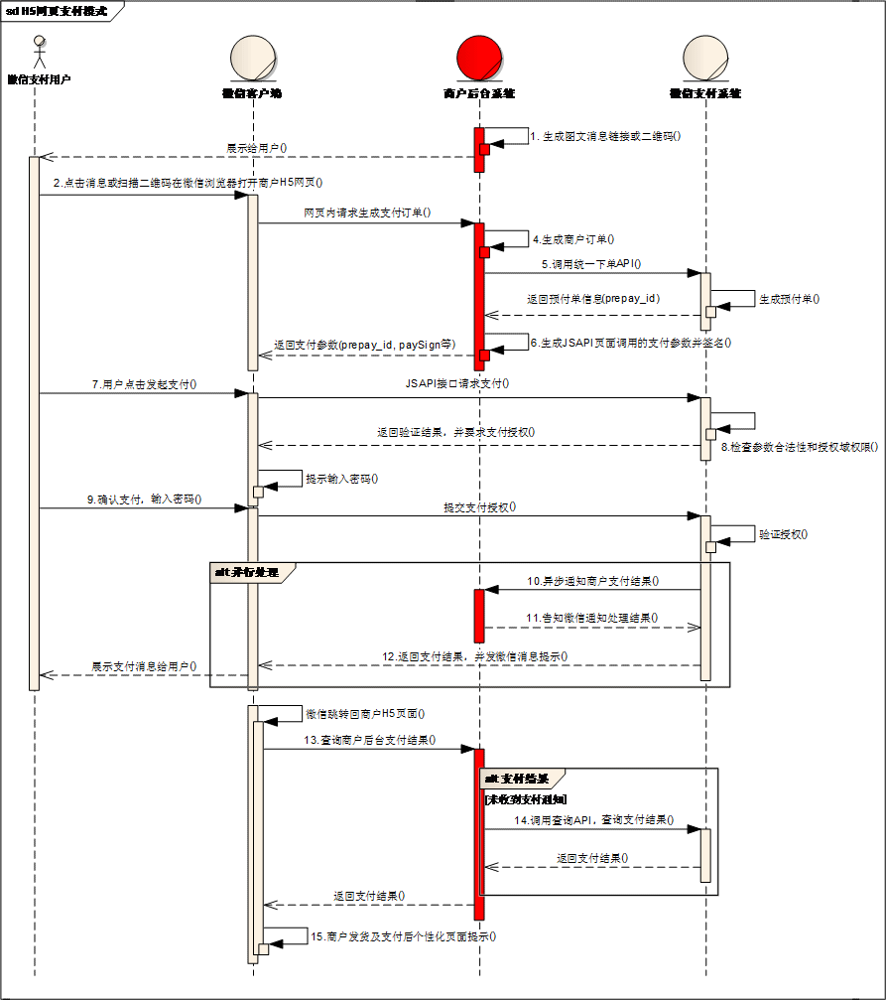

# 微信支付——开发文档

## JSAPI支付——业务流程

### 业务流程时序图

商户系统和微信支付系统主要交互：

1、商户server调用统一下单接口请求订单，api参见公共api【[统一下单API](https://pay.weixin.qq.com/wiki/doc/api/jsapi.php?chapter=9_1)】

2、商户server接收支付通知，api参见公共api【[支付结果通知API](https://pay.weixin.qq.com/wiki/doc/api/jsapi.php?chapter=9_7)】

3、商户server查询支付结果，api参见公共api【[查询订单API](https://pay.weixin.qq.com/wiki/doc/api/jsapi.php?chapter=9_2)】