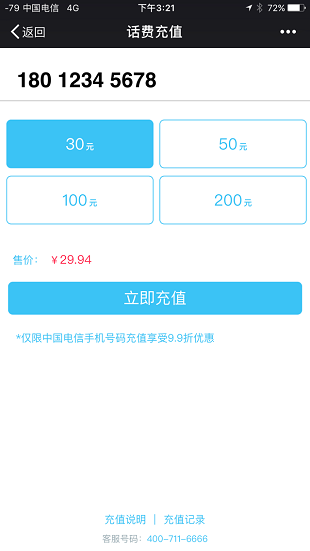
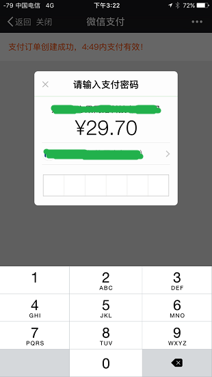
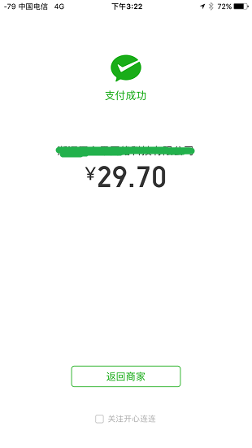
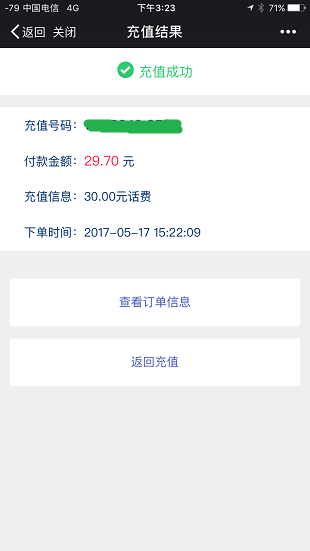
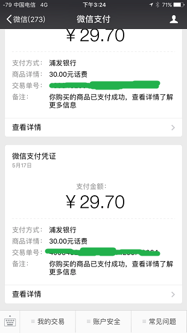

# 微信支付——开发文档

## JSAPI支付——场景介绍

### 场景介绍

商户已有H5商城网站，用户通过消息或扫描二维码在微信内打开网页时，可以调用微信支付完成下单购买的流程。

步骤（1）：如图7.1，商户下发图文消息或者通过自定义菜单吸引用户点击进入商户网页。

步骤（2）：如图7.2，进入商户网页，用户选择购买，完成选购流程。

步骤（3）：如图7.3，调起微信支付控件，用户开始输入支付密码。

步骤（4）：如图7.4，密码验证通过，支付成功。商户后台得到支付成功的通知。

步骤（5）：如图7.5，返回商户页面，显示购买成功。该页面由商户自定义。

步骤（6）：如图7.6，微信支付公众号下发支付凭证。

步骤（7）：商户公众号下发消息，提示发货成功。该步骤可选。

注意：商户也可以把商品网页的链接生成二维码，用户扫一扫打开后即可完成购买支付。

交互细节：

以下是支付场景的交互细节，请认真阅读，设计商户页面的逻辑：

（1）用户打开商户网页选购商品，发起支付，在网页通过JavaScript调用getBrandWCPayRequest接口，发起微信支付请求，用户进入支付流程。

（2）用户成功支付点击完成按钮后，商户的前端会收到JavaScript的返回值。商户可直接跳转到支付成功的静态页面进行展示。

（3）商户后台收到来自微信开放平台的支付成功回调通知，标志该笔订单支付成功。

注：（2）和（3）的触发不保证遵循严格的时序。JS API返回值作为触发商户网页跳转的标志，但商户后台应该只在收到微信后台的支付成功回调通知后，才做真正的支付成功的处理。