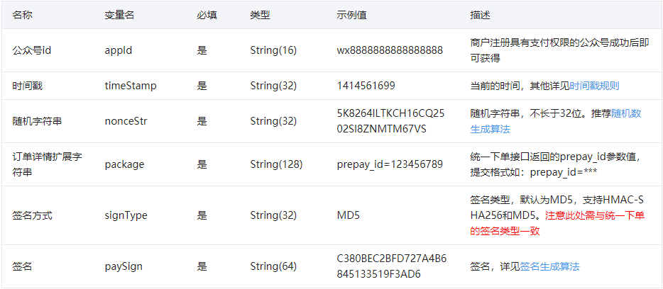
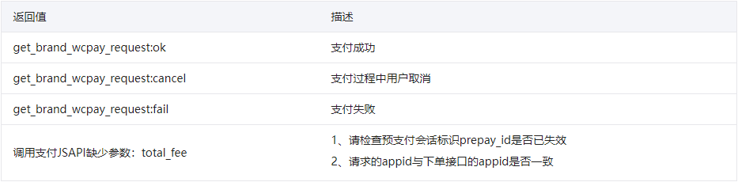

在微信浏览器里面打开H5网页中执行JS调起支付。接口输入输出数据格式为JSON。

注意：WeixinJSBridge内置对象在其他浏览器中无效。

getBrandWCPayRequest参数以及返回值定义：

1、网页端接口请求参数列表**（参数需要重新进行签名计算，参与签名的参数为：appId、timeStamp、nonceStr、package、signType，参数区分大小写。）**



2、返回结果值说明



注：JS API的返回结果get_brand_wcpay_request:ok仅在用户成功完成支付时返回。由于前端交互复杂，get_brand_wcpay_request:cancel或者get_brand_wcpay_request:fail可以统一处理为用户遇到错误或者主动放弃，不必细化区分。

示例代码如下：

```js

function onBridgeReady(){
   WeixinJSBridge.invoke(
      'getBrandWCPayRequest', {
         "appId":"wx2421b1c4370ec43b",     //公众号名称，由商户传入     
         "timeStamp":"1395712654",         //时间戳，自1970年以来的秒数     
         "nonceStr":"e61463f8efa94090b1f366cccfbbb444", //随机串     
         "package":"prepay_id=u802345jgfjsdfgsdg888",     
         "signType":"MD5",         //微信签名方式：     
         "paySign":"70EA570631E4BB79628FBCA90534C63FF7FADD89" //微信签名 
      },
      function(res){
      if(res.err_msg == "get_brand_wcpay_request:ok" ){
      // 使用以上方式判断前端返回,微信团队郑重提示：
            //res.err_msg将在用户支付成功后返回ok，但并不保证它绝对可靠。
      } 
   }); 
}
if (typeof WeixinJSBridge == "undefined"){
   if( document.addEventListener ){
       document.addEventListener('WeixinJSBridgeReady', onBridgeReady, false);
   }else if (document.attachEvent){
       document.attachEvent('WeixinJSBridgeReady', onBridgeReady); 
       document.attachEvent('onWeixinJSBridgeReady', onBridgeReady);
   }
}else{
   onBridgeReady();
}
```

