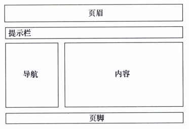
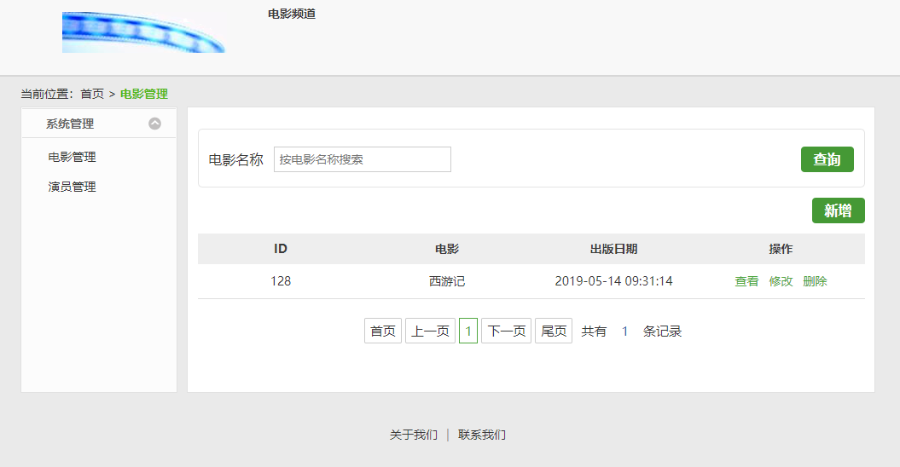
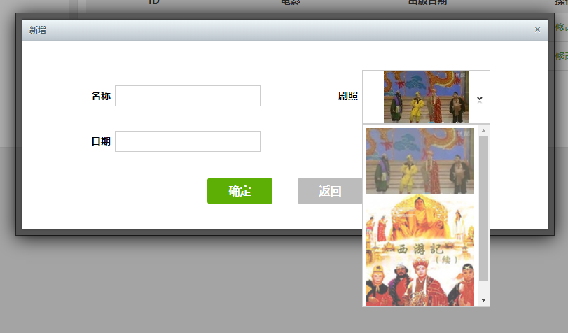
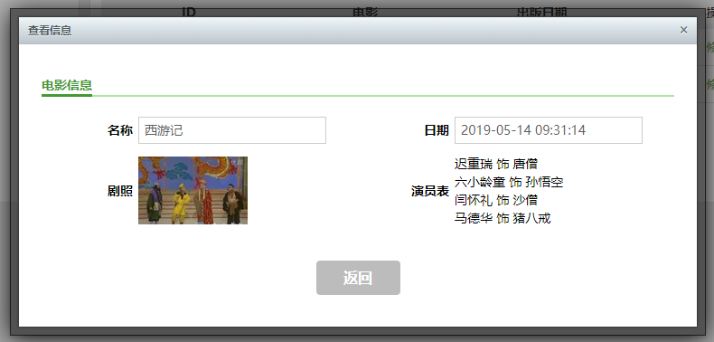
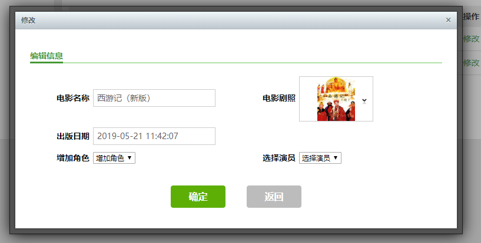
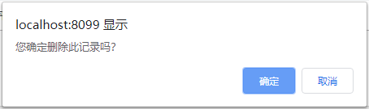
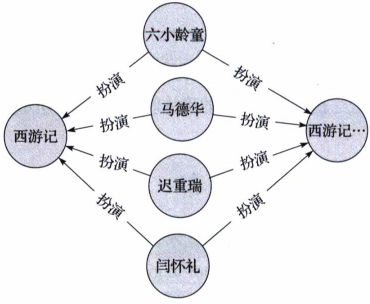

# 第3章 Spring Boot界面设计

用Spring Boot框架设计Web显示界面，我们还是使用MVC（Model View Controller，模型 - 视图 - 控制器）的概念，将数据管理、事件控制和界面显示进行分层处理，实现多层结构设计。界面设计，即视图的设计，主要是组织和处理显示的内容，界面上的事件响应最终交给了控制器进行处理，由控制器决定是否调用模型进行数据的存取操作，然后再将结果返回给合适的视图显示。

本章的实例工程使用分模块管理，如表3-1所示，即将数据管理独立成为一个工程模块，专门负责数据库管理方面的功能。而界面设计模块主要负责控制器和视图设计方面的功能。

| 项目         | 工程  | 功能                |
| ------------ | ----- | ------------------- |
| 数据管理模块 | data  | 实现使用Neo4j数据库 |
| 界面设计模块 | webui | 控制器和视图设计    |

## 3.1 模型设计

数据管理模块实现了MVC中模型的设计，主要负责实体建模和数据库持久化等方面的功能。在本章的实例中，将使用上一章的Neo4j数据库的例子，对电影数据进行管理。回顾一下，有两个节点实体（电影和演员）和一个关系实体（角色）。其中，关系实体体现了节点实体之间的关系，即一个演员在一部电影中扮演一个角色。实体建模和持久化与上一章的实现差不多。只不过为了适应本章的内容，电影节点实体和角色关系实体的建模在属性上做了些许调整。另外针对Neo4j数据库的分页查询也做了一些调整和优化。

### 3.1.1 节点实体建模

如代码清单3-1所示，在电影节点实体建模中做了一些调整，即增加一个photo属性，用来存放电影剧照，并将关系类型更改为“扮演”。需要注意的是，Neo4j还没有日期格式的数据类型，所以在读取日期类型的数据时，使用注解@DateTimeFormat进行格式转换，而在保存时，使用注解@DateLong将它转换成Long类型的数据进行存储。

``` java
package com.spring.boot.data.domain;

import com.fasterxml.jackson.annotation.JsonIdentityInfo;
import com.voodoodyne.jackson.jsog.JSOGGenerator;
import org.neo4j.ogm.annotation.GraphId;
import org.neo4j.ogm.annotation.NodeEntity;
import org.neo4j.ogm.annotation.Relationship;
import org.neo4j.ogm.annotation.typeconversion.DateLong;
import org.springframework.format.annotation.DateTimeFormat;

import java.util.ArrayList;
import java.util.Date;
import java.util.List;

/**
 * Movie
 *
 * @author shenhuanjie
 * @date 2019/5/13 16:45
 */
@JsonIdentityInfo(generator = JSOGGenerator.class)
@NodeEntity
public class Movie {
    @GraphId
    Long id;
    private String name;
    private String photo;
    @DateLong
    @DateTimeFormat(pattern = "yyyy-MM-dd HH:mm:ss")
    private Date createDate;

    @Relationship(type = "扮演", direction = Relationship.INCOMING)
    List<Role> roles = new ArrayList<>();

    public Role addRole(Actor actor, String name) {
        Role role = new Role(actor, this, name);
        this.roles.add(role);
        return role;
    }

    public Movie() {
    }

    public Long getId() {
        return id;
    }

    public void setId(Long id) {
        this.id = id;
    }

    public List<Role> getRoles() {
        return roles;
    }

    public void setRoles(List<Role> roles) {
        this.roles = roles;
    }

    public String getName() {
        return name;
    }

    public void setName(String name) {
        this.name = name;
    }

    public String getPhoto() {
        return photo;
    }

    public void setPhoto(String photo) {
        this.photo = photo;
    }

    public Date getCreateDate() {
        return createDate;
    }

    public void setCreateDate(Date createDate) {
        this.createDate = createDate;
    }
}
```

### 3.1.2 关系实体建模

电影实体对应的角色关系实体建模的关系类型也同样做了调整而改为“扮演”，如代码清单3-2所示。

```
package com.spring.boot.data.domain;

import com.fasterxml.jackson.annotation.JsonIdentityInfo;
import com.voodoodyne.jackson.jsog.JSOGGenerator;
import org.neo4j.ogm.annotation.EndNode;
import org.neo4j.ogm.annotation.GraphId;
import org.neo4j.ogm.annotation.RelationshipEntity;
import org.neo4j.ogm.annotation.StartNode;

/**
 * Role
 *
 * @author shenhuanjie
 * @date 2019/5/13 16:51
 */
@JsonIdentityInfo(generator = JSOGGenerator.class)
@RelationshipEntity(type = "扮演")
public class Role {
    @GraphId
    Long id;
    String name;
    @StartNode
    Actor actor;
    @EndNode
    Movie movie;

    public Role() {
    }

    public Role(Actor actor, Movie movie, String name) {
        this.actor = actor;
        this.movie = movie;
        this.name = name;
    }

    public Long getId() {
        return id;
    }

    public void setId(Long id) {
        this.id = id;
    }

    public String getName() {
        return name;
    }

    public void setName(String name) {
        this.name = name;
    }

    public Actor getActor() {
        return actor;
    }

    public Movie getMovie() {
        return movie;
    }

}
```

### 3.1.3 分页查询设计

对于新型的Neo4j数据库来说，由于它的资源库遵循了JPA的规范标准来设计，在分页查询方面有的地方还不是很完善，所以在分页查询中，设计了一个服务类来处理，如代码清单3-3所示。其中，使用`Class<T>`传入调用的实体对象，使用Pageable传入页数设定和排序字段设定的参数，使用Filters传入查询的一些节点属性设定的参数。

```java
package com.spring.boot.data.service;

import org.neo4j.ogm.cypher.Filters;
import org.neo4j.ogm.cypher.query.Pagination;
import org.neo4j.ogm.cypher.query.SortOrder;
import org.neo4j.ogm.session.Session;
import org.springframework.beans.factory.annotation.Autowired;
import org.springframework.data.domain.Page;
import org.springframework.data.domain.PageImpl;
import org.springframework.data.domain.Pageable;
import org.springframework.data.domain.Sort;
import org.springframework.stereotype.Service;

import java.util.ArrayList;
import java.util.Collection;
import java.util.Iterator;
import java.util.List;

/**
 * PageService
 *
 * @author shenhuanjie
 * @date 2019/5/13 16:54
 */
@Service
public class PageService<T> {
    @Autowired
    private Session session;


    public Page<T> findAll(Class<T> clazz, Pageable pageable, Filters filters) {
        Collection data = this.session.loadAll(clazz, filters, convert(pageable.getSort()), new Pagination(pageable.getPageNumber(), pageable.getPageSize()), 1);
        return updatePage(pageable, new ArrayList(data));
    }

    private Page<T> updatePage(Pageable pageable, List<T> results) {
        int pageSize = pageable.getPageSize();
        int pageOffset = pageable.getOffset();
        int total = pageOffset + results.size() + (results.size() == pageSize ? pageSize : 0);
        return new PageImpl(results, pageable, (long) total);
    }

    private SortOrder convert(Sort sort) {
        SortOrder sortOrder = new SortOrder();
        if (sort != null) {
            Iterator var3 = sort.iterator();

            while (var3.hasNext()) {
                Sort.Order order = (Sort.Order) var3.next();
                if (order.isAscending()) {
                    sortOrder.add(new String[]{order.getProperty()});
                } else {
                    sortOrder.add(SortOrder.Direction.DESC, new String[]{order.getProperty()});
                }
            }
        }
        return sortOrder;
    }
}
```

## 3.2 控制器设计

怎样将视图上的操作与模型——数据管理模块联系起来，这中间始终是控制器在起着通信桥梁的作用，它响应视图上的操作事件，然后根据需要决定是否访问数据管理模块，最后再将结果返回给合适的视图，由视图处理显示。下面将按照电影控制器的设计来说明控制器中增删查改的实现方法，演员控制器的设计与此类似，不再赘述。

### 3.2.1 新建控制器

接收新建电影的请求，以及输入一部电影的数据后的最后提交，由新建控制器进行处理。在控制器上将执行两个操作，第一个操作将返回一个新建电影的视图，第二个操作接收界面中的输入数据，并调用数据管理模块进行保存，如代码清单3-4所示。其中，create函数将返回一个新建电影的视图，它不调用数据管理模块，save函数将需要保存的数据通过调用数据管理模块存储至数据库中，并返回一个成功标志。注意，为了简化设计，将电影剧照的图片文件做了预定义处理。

```java
@RequestMapping("/new")
public ModelAndView create(ModelMap model) {
    String[] files = {"/images/movie/西游记.jpg", "/images/movie/西游记续集.jpg"};
    model.addAttribute("files", files);
    return new ModelAndView("movie/new");
}

@RequestMapping(value = "/save", method = RequestMethod.POST)
public String save(Movie movie) throws Exception {
    movieRepository.save(movie);
    logger.info("新增->ID={}", movie.getId());
    return "1";
}
```

### 3.2.2 查看控制器

查看一个电影的详细信息时，控制器首先使用请求的电影ID向数据管理模块请求数据，然后将取得的数据输出到一个显示视图上，如代码清单3-5所示。

```java
@RequestMapping(value = "/{id}")
public ModelAndView show(ModelMap model, @PathVariable Long id) {
    Movie movie = movieRepository.findOne(id);
    model.addAttribute("movie", movie);
    return new ModelAndView("movie/show");
}
```

### 3.2.3 修改控制器

若要实现对电影的修改及保存操作，需要先将电影的数据展示在视图界面上，然后接收界面的操作，调用数据管理模块将更改的数据保存至数据库中，如代码清单3-6所示。其中，为了简化设计，将剧照中的图片文件和电影角色名称做了预定义处理。修改数据时，由于从界面传回的电影对象中，丢失了其角色关系的数据（这是OGM的缺点），所以再次查询一次数据库，以取得一个电影的完整数据，然后再执行修改的操作。

``` java
@RequestMapping(value = "/edit/{id}")
public ModelAndView update(ModelMap model, @PathVariable Long id) {
    Movie movie = movieRepository.findOne(id);
    String[] files = {"/images/movie/西游记.jpg", "/images/movie/西游记续集.jpg"};
    String[] rolelist = new String[]{"唐僧", "孙悟空", "猪八戒", "沙僧"};
    Iterable<Actor> actors = actorRepository.findAll();

    model.addAttribute("files", files);
    model.addAttribute("rolelist", rolelist);
    model.addAttribute("movie", movie);
    model.addAttribute("actors", actors);

    return new ModelAndView("movie/edit");
}

@RequestMapping(method = RequestMethod.POST, value = "/update")
public String update(Movie movie, HttpServletRequest request) throws Exception {
    String rolename = request.getParameter("rolename");
    String actorid = request.getParameter("actorid");

    Movie old = movieRepository.findOne(movie.getId());
    old.setName(movie.getName());
    old.setPhoto(movie.getPhoto());
    old.setCreateDate(movie.getCreateDate());

    if (!StringUtils.isEmpty(rolename) && !StringUtils.isEmpty(actorid)) {
        Actor actor = actorRepository.findOne(new Long(actorid));
        old.addRole(actor, rolename);
    }
    movieRepository.save(old);
    logger.info("修改->ID=" + old.getId());
    return "1";
}
```

### 3.2.4 删除控制器

删除电影时，从界面上接收电影的ID参数，然后调用数据管理模块将电影删除，如代码清单3-7所示。

```java
@RequestMapping(value = "/delete/{id}", method = RequestMethod.GET)
public String delete(@PathVariable Long id) throws Exception {
    Movie movie = movieRepository.findOne(id);
    movieRepository.delete(movie);
    logger.info("删除->ID=" + id);
    return "1";
}
```

### 3.2.5 分页查询控制器

列表数据的查询使用分页的方法，按提供的查询字段参数、页码、页大小及其排序字段等参数，通过调用数据管理模块进行查询，然后返回一个分页对象Page，如代码清单-8所示。这里的分页查询调用了3.1.3节定义的分页查询服务类。

```java
@RequestMapping(value = "/list")
public Page<Movie> list(HttpServletRequest request) throws Exception {
    String name = request.getParameter("name");
    String page = request.getParameter("page");
    String size = request.getParameter("size");
    Pageable pageable = new PageRequest(page == null ? 0 : Integer.parseInt(page), size == null ? 10 : Integer.parseInt(size),
            new Sort(Sort.Direction.DESC, "id"));

    Filters filters = new Filters();
    if (!StringUtils.isEmpty(name)) {
        Filter filter = new Filter("name", name);
        filters.add(filter);
    }

    return pageService.findAll(Movie.class, pageable, filters);
}
```

## 3.3 使用Thymeleaf模版

完成了模版和控制器的设计之后，接下来的工作就是视图设计了。在视图设计中主要使用Thymeleaf模版来实现。在进行视图设计之前，先了解一下Thymeleaf模版的功能。

Thymeleaf是一个优秀的面向Java的XML/XHTML/HTML 5页面模版，并具有丰富的标签语言和函数。使用Spring Boot框架进行界面设计，一般都会选择Thymeleaf模版。

### 3.3.1 Thymeleaf配置

要使用Thymeleaf模版，首先，必须在工程的Maven管理中引入它的依赖：“spring-boot-starter-thymeleaf”，如代码清单3-9所示。

```xml
<dependency>
    <groupId>org.springframework.boot</groupId>
    <artifactId>spring-boot-starter-thymeleaf</artifactId>
</dependency>
```

其次，必须配置使用Thymeleaf模版的一些参数。在一般的Web项目中都会使用如代码清单3-10所示的配置，其中，prefix指定了HTML文件存放在webapp的/WEB-INF/views/目录下面，或者也可以指定其他路径，其他一些参数的设置其实是使用了Thymeleaf的默认设置。

在实例中，为了更方便将项目发布成jar文件，我们将使用Thymeleaf自动配置中的默认配置选项，即只要在资源文件夹resources中增加一个templates目录即可，这个目录用来存放HTML文件。

```
spring:
	thymeleaf:
		prefix: /WEB-INF/views/
		suffix: .html
		mode: HTML5
		encoding: UTF-8
		content-type: text/html
		cache: false
```

> **注意**
>
> 如果工程中增加了Thymeleaf的依赖，而没有进行任何配置，或者增加默认目录，启动应用时就会报错。

### 3.3.2 Thymeleaf功能简介

在HTML页面上使用Thymeleaf标签语言，用一个简单的关键字“th”来标注。使用Thymeleaf标签语言的典型例子如下：

```html
<h3 th:text="${actor.name}"></h3>

```

其中，th:text指定了在标签`<h3>`中显示的文本，它的值来自于关键字“`$`“所引用的内存变量，th:src设定了标签``的图片文件的链接地址，既可以是绝对路径，也可以是相对路径。下面列出了Thymeleaf的一些主要标签和函数。

| 标签、函数         | 含义                                    |
| ------------------ | --------------------------------------- |
| th:text            | 显示文本                                |
| th:utext           | 和th:text的区别是针对“unescaped text”。 |
| th:atrr            | 设置标签属性。                          |
| th:if or th:unless | 条件判断语句。                          |
| th:switch，th:case | 选择语句。                              |
| th:each            | 循环语句。                              |
| #dates             | 日期函数。                              |
| #calendars         | 日历函数。                              |
| #numbers           | 数字函数。                              |
| #strings           | 字符串函数。                            |
| #objects           | 对象函数。                              |
| #bools             | 逻辑函数。                              |
| #arrays            | 数组函数。                              |
| #lists             | 列表函数                                |

本章的实例工程将在视图设计中使用Thymeleaf的下列几个主要功能，而有关Thymeleaf的详细说明和介绍可以访问它的官方网站http://www.thymeleaf.ofg/，以获得更多的帮助。

**1. 使用功能函数**

Thymeleaf有一些日期功能函数、字符串函数、数组函数、列表函数等，代码清单3-11是Thymeleaf使用日期函数的一个例子，#dates.format是一个日期格式化的使用实例，它将电影的创建日期格式化为中文环境的使用格式“‘yyyy-MM-dd HH:mm:ss’“。

```html
th:value="${movie.createDate} ? ${#dates.format(movie.createDate,'yyyy-MM-dd HH:mm:ss')} :''"
```

**2. 使用编程语句**

Thymeleaf有条件语句、选择语句、循环语句等。代码清单3-12使用each循环语句来显示一个数据列表，即在下拉列表框中使用循环语句来显示所有的演员列表。

```html
<select name="actorid" id="actorid">
    <option value="">选择演员</option>
    <option th:each="actor:${actors}"
            th:value="${actor.id}"
            th:text="${actor.name}">
    </option>
</select>
```

**3. 使用页面框架模版**

Thymeleaf的页面框架模版时比较优秀的功能。预先定义一个layout，它具有页眉、页脚、提示栏、导航栏和内容显示等区域，如代码清单3-13所示。

* layout:frament=“prompt” 是一个提示栏，它可以让引用的视图替换显示的内容；
* fragments/nav :: nav 是一个导航栏并指定了视图文件，也就是说它不能被引用的视图替换内容；
* layout:fragment=“content” 是一个主要内容显示区域，它也能由引用的视图替换显示内容；
* fragments/footer :: footer 是一个页脚定义并且也指定了视图文件，即不被引用的视图替换显示内容。

这样设计出来的页面模版框架如图3-1所示。

```html
<div class="headerBox">
    <div class="topBox">
        <div class="topLogo f-left">
            <a href="#"></a>
        </div>
        <div class="new-nav">
            <h3>电影频道</h3>
        </div>
    </div>
</div>
<div class="locationLine" layout:fragment="prompt">
    当前位置：首页 &gt; <em>页面</em>
</div>
<table class="globalMainBox" style="position:relative;z-index:1">
    <tr>
        <td class="columnLeftBox" valign="top">
            <div th:replace="fragments/nav :: nav"></div>
        </td>
        <td class="whiteSpace"></td>
        <td class="rightColumnBox" valign="top">
            <div layout:fragment="content"></div>
        </td>
    </tr>
</table>

<div class="footBox" th:replace="fragments/footer :: footer"></div>
```



有了页面模版之后，就可以在一个主页面视图上引用上面的layout，并替换它的提示栏prompt和主要内容显示区域content，其他页眉、页脚和导航栏却保持同样的内容，如代码清单-14所示。这样就可以设计出一个使用共用模版的具有统一风格特征的界面。

```html
<html layout:decorator="/fragments/layout" xmlns:th="http://www.thymeleaf.org">
……
<div class="locationLine" layout:fragment="prompt">
    当前位置：首页 &gt; <em>电影管理</em>
</div>

<div class="statisticBox w-782" layout:fragment="content">
……
</div>

```

## 3.4 视图设计

视图设计包括列表视图、新建视图、查看视图、修改视图和删除视图设计等5个方面有关数据的增删查改的内容。

我们知道，视图上的数据存取不是直接与模型打交道，而是通过控制器来处理。在视图中对于控制器的请求，大多使用jQuery的方式来实现。jQuery是一个优秀的JavaScript程序库，并且具有很好的兼容性，几乎兼容了现有的所有浏览器。

下面的视图设计将以电影的视图设计为例说明，演员的视图设计与此类似，不再赘述。

### 3.4.1 列表视图设计

电影的列表视图是电影视图的主页，它引用了3.3节使用Thymeleaf设计的页面框架模版layout.html，在这里主要实现对数据的分页查询请求和列表数据显示，并提供了一部电影的新建、查看、修改和删除等超链接。

**1. 分页设计**

电影的列表视图的分页设计使用了“jquery.pagination.js”分页插件，编写如代码清单3-15所示的脚本，其中getOpt定义了分页工具条的一些基本属性，pageaction通过“./list”调用控制器取得分页数据列表，fillData函数将列表数据填充到HTML控件tbodyContent中。

```js
//分页的参数设置
var getOpt = function () {
    var opt = {
        items_per_page: 10,    //每页记录数
        num_display_entries: 3, //中间显示的页数个数 默认为10
        current_page: 0,   //当前页
        num_edge_entries: 1, //头尾显示的页数个数 默认为0
        link_to: "javascript:void(0)",
        prev_text: "上页",
        next_text: "下页",
        load_first_page: true,
        show_total_info: true,
        show_first_last: true,
        first_text: "首页",
        last_text: "尾页",
        hasSelect: false,
        callback: pageselectCallback //回调函数
    }
    return opt;
}
//分页开始
var currentPageData = null;
var pageaction = function () {
    $.get('./list?t=' + new Date().getTime(), {
        name: $("#name").val()
    }, function (data) {
        currentPageData = data.content;
        $(".pagination").pagination(data.totalElements, getOpt());
    });
}

var pageselectCallback = function (page_index, jq, size) {
    if (currentPageData != null) {
        fillData(currentPageData);
        currentPageData = null;
    } else
        $.get('./list?t=' + new Date().getTime(), {
            size: size, page: page_index, name: $("#name").val()
        }, function (data) {
            fillData(data.content);
        });
}

//填充分页数据
function fillData(data) {
    var $list = $('#tbodyContent').empty();
    $.each(data, function (k, v) {
        var html = "";
        html += '<tr> ' +
            '<td>' + (v.id == null ? '' : v.id) + '</td>' +
            '<td>' + (v.name == null ? '' : v.name) + '</td>' +
            '<td>' + (v.createDate == null ? '' : getSmpFormatDateByLong(v.createDate, true)) + '</td>';
        html += '<td><a class="c-50a73f mlr-6" href="javascript:void(0)" onclick="detail(\'' + v.id + '\')">查看</a><a class="c-50a73f mlr-6" href="javascript:void(0)" onclick="edit(\'' + v.id + '\')">修改</a><a class="c-50a73f mlr-6" href="javascript:void(0)" onclick="del(\'' + v.id + '\')">删除</a></td>';
        html += '</tr>';

        $list.append($(html));
    });
}

//分页结束
```

**2. 列表页面设计**

电影列表的显示页面主要定义了列表字段的名称和提供显示数据内容的控件ID，即tbodyContent，如代码清单 3-16所示。

```html
<!DOCTYPE html>
<html layout:decorator="/fragments/layout" xmlns:th="http://www.thymeleaf.org"
      xmlns:layout="http://www.ultraq.net.nz/web/thymeleaf/layout">
<head>
    <title>电影管理</title>

    <link th:href="@{/scripts/pagination/pagination.css}" rel="stylesheet" type="text/css"/>
    <link th:href="@{/scripts/artDialog/default.css}" rel="stylesheet" type="text/css"/>
    <link th:href="@{/scripts/My97DatePicker/skin/WdatePicker.css}" rel="stylesheet" type="text/css"/>
    <link th:href="@{/styles/index.css}" rel="stylesheet" type="text/css"/>

    <script th:src="@{/scripts/pagination/jquery.pagination.js}"></script>
    <script th:src="@{/scripts/jquery.smartselect-1.1.min.js}"></script>
    <script th:src="@{/scripts/My97DatePicker/WdatePicker.js}"></script>
    <script th:src="@{/scripts/movie/list.js}"></script>
</head>
<body>
<div class="locationLine" layout:fragment="prompt">
    当前位置：首页 &gt; <em>电影管理</em>
</div>

<div class="statisticBox w-782" layout:fragment="content">
    <form id="queryForm" method="get">
        <div class="radiusGrayBox782">
            <div class="radiusGrayTop782"></div>
            <div class="radiusGrayMid782">
                <div class="dataSearchBox forUserRadius">
                    <ul>
                        <li>
                            <label class="preInpTxt f-left">电影名称</label>
                            <input type="text" class="inp-list f-left w-200" placeholder="按电影名称搜索" id="name"
                                   name="name"/>
                        </li>
                        <li>
                            <a href="javascript:void(0)" class="blueBtn-62X30 f-right" id="searchBtn">查询</a>
                        </li>
                    </ul>
                </div>
            </div>
        </div>
    </form>
    <div class="newBtnBox">
        <input type="hidden" id="m_ck"/>
        <a id="addBtn" class="blueBtn-62X30" href="javascript:void(0)">新增</a>
    </div>
    <div class="dataDetailList mt-12">
        <table id="results" class="dataListTab">
            <thead>
            <tr>
                <th>ID</th>
                <th>电影</th>
                <th>出版日期</th>
                <th>操作</th>
            </tr>
            </thead>
            <tbody id="tbodyContent">
            </tbody>
        </table>
        <div class="tableFootLine">
            <div class="pagebarList pagination"/>
        </div>
    </div>
</div>

</body>
</html>
```

**3. 列表视图设计效果**

电影数据列表视图设计的最终显示效果如图3-2所示。



### 3.4.2 新建视图设计

**1. 新建对话框设计**

新建电影时，在电影主页中打开一个对话框显示新建的操作界面，对话框设计应用了“artDialog.js”的对话框插件，然后编写一个脚本来打开对话框，如代码清单3-17所示。其中“./new”是连接控制器的请求URL，注意这里使用了相对路径，这个URL通过“$.get”请求返回新建电影的HTML页面，请求链接中的ts参数传递的是当前时间，这是为了保证该链接是一个全新的链接，以使浏览器能显示一个最新的内容页面。

```js
function create() {
    $.get("./new", {ts: new Date().getTime()}, function (data) {
        art.dialog({
            lock: true,
            opacity: 0.3,
            title: "新增",
            width: '750px',
            height: 'auto',
            left: '50%',
            top: '50%',
            content: data,
            esc: true,
            init: function () {
                artdialog = this;
            },
            close: function () {
                artdialog = null;
            }
        });
    });
}
```

**2. 新建页面设计**

新建电影的页面设计，如代码清单3-18所示，这里只是部分HTML编码、其中的日期控件使用“WdatePicker.js”插件来实现。对于一部电影来说，我们需要输入名称、剧照和日期三个属性，其中剧照的图片下拉列表框使用“imageselect.js”图片下拉列表框插件来实现，并且为了简化设计，剧照中的图片文件使用了预先定义的文件，这里只要选择使用哪一个图片即可。

```html
<html xmlns:th="http://www.thymeleaf.org">
<link th:href="@{/styles/imageselect.css}" rel="stylesheet" type="text/css"/>
<script th:src="@{/scripts/imageselect.js}"></script>
<script th:src="@{/scripts/movie/new.js}"></script>

<form id="saveForm" action="./save" method="post">
    <table class="addNewInfList">
        <tr>
            <th>名称</th>
            <td><input class="inp-list w-200 clear-mr f-left" type="text" id="name" name="name" maxlength="120"/></td>
            <th>剧照</th>
            <td width="240">
                <select name="photo" id="photo">
                    <option th:each="file:${files}"
                            th:value="${file}"
                            th:text="${file}">
                    </option>
                </select>
            </td>
        </tr>
        <tr>
            <th>日期</th>
            <td>
                <input onfocus="WdatePicker({dateFmt:'yyyy-MM-dd HH:mm:ss'})" type="text"
                       class="inp-list w-200 clear-mr f-left" id="createDate" name="createDate"/>
            </td>
        </tr>
    </table>
    <div class="bottomBtnBox">
        <a class="btn-93X38 saveBtn" href="javascript:void(0)">确定</a>
        <a class="btn-93X38 backBtn" href="javascript: closeDialog()">返回</a>
    </div>
</form>
<script type="text/javascript">
    $(document).ready(function () {
        $('select[name=photo]').ImageSelect({dropdownWidth: 425});
    });
</script>

</html>
```

**3. 表单验证与提交设计**

验证新建电影表单的提交时使用“jquery.validate.min.js”插件中验证方法来实现，如代码清单-19所示。保存时调用经典的“$.ajax”方式利用POST方法进行提交，其中`headers:{“Content-type”:“application/x-www-form-urlencoded;charset=UTF-8”}`用于保证数据在传输过程中中文字符的正确性。在表单验证中，只对name和createDate两个属性进行简单的非空验证，表单的参数传递使用一个表单序列化函数serialize()来实现，它将表单控件上的对象序列化为一个个含有“键 - 值”对的字符串进行提交。

```js
$(function () {
    $('#saveForm').validate({
        rules: {
            name: {required: true},
            createDate: {required: true}
        }, messages: {
            name: {required: "必填"},
            createDate: {required: "必填"}
        }
    });
    $('.saveBtn').click(function () {
        if ($('#saveForm').valid()) {
            $.ajax({
                type: "POST",
                url: "./save",
                data: $("#saveForm").serialize(),
                headers: {"Content-type": "application/x-www-form-urlencoded;charset=UTF-8"},
                success: function (data) {
                    if (data == 1) {
                        alert("保存成功");
                        pageaction();
                        closeDialog();
                    } else {
                        alert(data);
                    }
                },
                error: function (data) {
                    var e;
                    $.each(data, function (v) {
                        e += v + " ";
                    });
                    alert(e);
                }
            });
        } else {
            alert('数据验证失败，请检查！');
        }
    });
});
```

**4. 新建视图设计效果**

新建电影的视图设计最后的显示效果如图3-3所示。



### 3.4.3 查看视图设计

**1. 查看对话框设计**

在电影的主页中单击一部电影的查看链接，将打开一个查看电影的对话框，对话框的设计如代码清单3-20所示，其“./{id}”是提取数据的链接，它将向控制器请求数据，并以HTML页面方式显示出来。

```js
function detail(id) {
    $.get("./" + id, {ts: new Date().getTime()}, function (data) {
        art.dialog({
            lock: true,
            opacity: 0.3,
            title: "查看信息",
            width: '750px',
            height: 'auto',
            left: '50%',
            top: '50%',
            content: data,
            esc: true,
            init: function () {
                artdialog = this;
            },
            close: function () {
                artdialog = null;
            }
        });
    });
}
```

**2. 查看页面设计**

电影查看页面的设计，即将数据展示出来的HTML编码，如代码清单3-21所示，需要注意的是，日期数据需要进行格式化，而演员表则使用Thymeleaf中的一个“th:each”循环语句来输出。

```html
<html xmlns:th="http://www.thymeleaf.org">
<div class="addInfBtn">
    <h3 class="itemTit"><span>电影信息</span></h3>
    <table class="addNewInfList">
        <tr>
            <th>名称</th>
            <td width="240"><input class="inp-list w-200 clear-mr f-left" type="text" th:value="${movie.name}" id="name"
                                   name="name" maxlength="16"/></td>
            <th>日期</th>
            <td>
                <input onfocus="WdatePicker({dateFmt:'yyyy-MM-dd HH:mm:ss'})" type="text"
                       class="inp-list w-200 clear-mr f-left"
                       th:value="${movie.createDate} ? ${#dates.format(movie.createDate,'yyyy-MM-dd HH:mm:ss')} :''"
                       id="createDate" name="createDate"/>
            </td>
        </tr>

        <tr>
            <th>剧照</th>
            <td width="240">
                
            </td>
            <th>演员表</th>
            <td width="240">
                <ul>
                    <li th:each="role:${movie.roles}" th:text="${role.actor.name}+' 饰 '+${role.name}"></li>
                </ul>
            </td>
        </tr>
    </table>
    <div class="bottomBtnBox">
        <a class="btn-93X38 backBtn" href="javascript:closeDialog(0)">返回</a>
    </div>
</div>
</html>
```

**3. 查看视图的设计效果**

电影查看视图设计最终完成的效果如图3-4所示。



### 3.4.4 修改视图设计

**1. 修改对话框设计**

在电影的主页中修改一部电影，首先打开一个修改电影的对话框，这个对话框的设计如代码清单3-22所示。其中通过“$.get”访问“./edit/{id}”取得数据和修改视图的HTML页面元素。

```js
function edit(id) {
    $.get("./edit/" + id, {ts: new Date().getTime()}, function (data) {
        art.dialog({
            lock: true,
            opacity: 0.3,
            title: "修改",
            width: '750px',
            height: 'auto',
            left: '50%',
            top: '50%',
            content: data,
            esc: true,
            init: function () {
                artdialog = this;
            },
            close: function () {
                artdialog = null;
            }
        });
    });
}
```

**2. 修改页面设计**

修改电影视图的页面设计如代码清单3-23所示，其中剧照的下拉列表框中增加了“选中”的代码：`th:selected="${movie.photo == file}"`，即如果电影中的剧照与下拉列表框中的剧照相同，则选中它。

在修改界面上，还增加了“增加角色“和”选择演员“的编辑项。为了简化设计这里的角色名称我们也使用了预先定义的数据。

```html
<!DOCTYPE html>
<html xmlns:th="http://www.thymeleaf.org">
<link th:href="@{/styles/imageselect.css}" rel="stylesheet" type="text/css"/>
<script th:src="@{/scripts/imageselect.js}"></script>
<script th:src="@{/scripts/movie/edit.js}"></script>

<form id="saveForm" method="post">
    <input type="hidden" name="id" id="id" th:value="${movie.id}"/>
    <div class="addInfBtn">
        <h3 class="itemTit"><span>编辑信息</span></h3>
        <table class="addNewInfList">
            <tr>
                <th>电影名称</th>
                <td width="240"><input class="inp-list w-200 clear-mr f-left" type="text" th:value="${movie.name}"
                                       id="name" name="name" maxlength="16"/></td>
                <th>电影剧照</th>
                <td width="240">
                    <select name="photo" id="photo">
                        <option th:each="file:${files}"
                                th:value="${file}"
                                th:text="${file}"
                                th:selected="${movie.photo == file}">
                        </option>
                    </select>
                </td>
            </tr>

            <tr>
                <th>出版日期</th>
                <td>
                    <input onfocus="WdatePicker({dateFmt:'yyyy-MM-dd HH:mm:ss'})" type="text"
                           class="inp-list w-200 clear-mr f-left"
                           th:value="${movie.createDate} ? ${#dates.format(movie.createDate,'yyyy-MM-dd HH:mm:ss')} :''"
                           id="createDate" name="createDate"/>
                </td>

            </tr>
            <tr>
                <th>增加角色</th>
                <td width="240">
                    <select name="rolename" id="rolename">
                        <option value="">增加角色</option>
                        <option th:each="role:${rolelist}"
                                th:value="${role}"
                                th:text="${role}">
                        </option>
                    </select>
                </td>
                <th>选择演员</th>
                <td width="240">
                    <select name="actorid" id="actorid">
                        <option value="">选择演员</option>
                        <option th:each="actor:${actors}"
                                th:value="${actor.id}"
                                th:text="${actor.name}">
                        </option>
                    </select>
                </td>
            </tr>
        </table>

        <div class="bottomBtnBox">
            <a class="btn-93X38 saveBtn" href="javascript:void(0)">确定</a>
            <a class="btn-93X38 backBtn" href="javascript:closeDialog(0)">返回</a>
        </div>
    </div>

</form>
<script type="text/javascript">
    $(document).ready(function () {
        $('select[name=photo]').ImageSelect({dropdownWidth: 425});
    });
</script>
</html>
```

**3. 修改视图的设计效果**

最终完成的修改电影视图的显示效果如图3-5所示。



### 3.4.5 删除视图设计

**1. 删除确认对话框**

如果有删除的操作，首先要给出确认提示框，只有用户单击确定后才能删除数据，否则将不做任何操作。确认提示框是调用了Windows中的确认对话框，如代码清单3-24所示。

```js
function del(id) {
    if (!confirm("您确定删除此记录吗？")) {
        return false;
    }
    $.get("./delete/" + id, {ts: new Date().getTime()}, function (data) {
        if (data == 1) {
            alert("删除成功");
            pageaction();
        } else {
            alert(data);
        }
    });
}
```

**2. 删除确认设计效果**

执行删除操作的确认效果如图3-6所示。



### 3.5 运行与发布

本章实例工程的完整代码可以通过IDEA从GitHub中检出：https://github.com/chenfromsz/spring-boot-ui.git。Spring Boot需要一个启动程序作为应用的入口，在webui模块中，我们设计了一个入口程序，如代码清单3-25所示。使用这个入口程序，就可以调试和发布工程了。

```java
package com.test.webui;

import org.springframework.boot.SpringApplication;
import org.springframework.boot.autoconfigure.SpringBootApplication;
import org.springframework.context.annotation.ComponentScan;

@SpringBootApplication
@ComponentScan(basePackages = "com.test")
public class WebuiApp {
    public static void main(String[] args) {
        SpringApplication.run(WebuiApp.class, args);
    }
}
```

通过在IDEA中打开Run/Debug Configurations对话框，增加一个Spring Boot配置，模块选择webui，工作目录选择模块webui所在的路径，主程序选择WebuiApp，并将配置保存为webui。然后在IDEA中运行该配置项目webui，即可启动应用进行测试。

如果要发布应用，可以在IDEA的Run/Debug Configurations对话框中增加一个Maven打包配置项目，工作目录选择工程的根目录，命令行中输入指令：clean package-D skipTests，并将配置保存为mvn。然后运行这个配置项目mvn进行打包，打包成功后，在“webui/target”目录中将生成webui-1.0-SNAPSHOT.jar。要运行这个程序包，可以打开一个命令行窗口，将路径切换到webui-1.0-SNAPSHOT.jar所在的目录，使用下列指令即可运行应用。

```
java -jar webui-1.0-SNAPSHOT.jar
```

最后可使用下面的URL进行访问：

```
http://localhost
```

在实例中增加了一些数据之后，在Neo4j数据库客户端中单击”扮演“关系，也可以看到电影和演员的关系图，如图3-7所示。



## 3.6 小结

本章介绍了使用MVC的多层结构方式i，以及在Spring Boot进行Web界面设计的方法，并且使用Thymeleaf模版设计了一个Web应用的页面框架。Web界面设计的一些细节，更多的是使用了HTML编码和JavaScript脚本，而HTML离不开CSS的支持，JavaScript更是借助于jQuery及其各种插件的功能。读者如需深入了解这方面的知识和技术，可查找相关的知识进行学习和研究。这里主要使用Thymeleaf模版工具来设计整体界面以及组织和处理数据的显示。

有了显示界面之后，对数据库的操作就更为方便和直观了。下一章将介绍如何使用一些技术手段来提升访问数据库的性能，以及怎样扩展访问数据库的功能。

