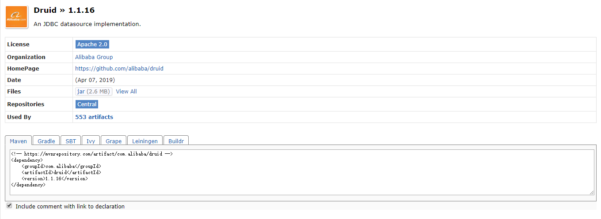
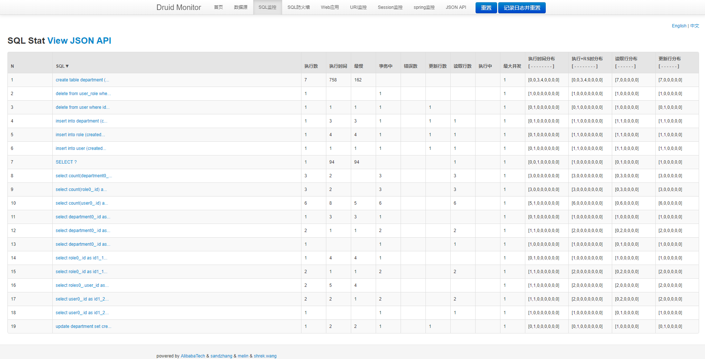
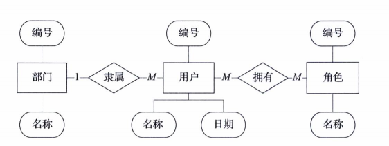
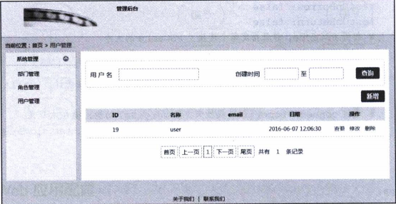
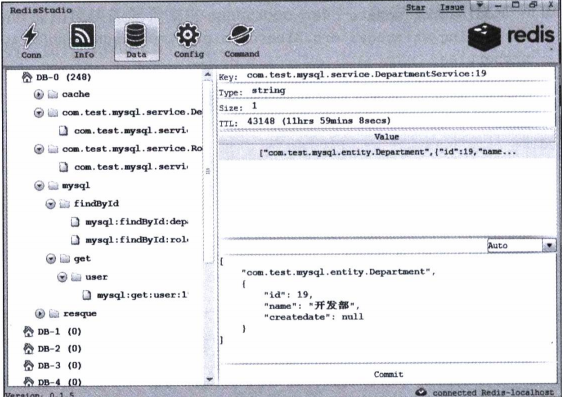

# 第4章 提高数据库访问性能

使用关系型数据库的应用系统的性能瓶颈最终还是数据库。随着业务的迅速增长，数据量会不断增大，会逐渐暴露出关系型数据库的弱点，即性能大幅下降。提升关系型数据库的访问性能是开发者的迫切任务。下面从程序开发角度，对提升数据库的访问性能进行介绍和探讨。

本章的实例工程使用了分模块的方式设计，各个模块的功能如表4-1所示。

| 项目         | 工程    | 类型     | 功能                     |
| ------------ | ------- | -------- | ------------------------ |
| 扩展功能模块 | depxpan | 程序集成 | JPA功能扩展和Redis配置等 |
| 数据管理模块 | mysql   | 程序集成 | MySQL实体建模和持久化等  |
| Web应用模块  | website | Web应用  | Web应用实例              |

## 4.1 使用Druid

Druid是一个关系型数据库连接池，它是阿里巴巴的一个开源项目。Druid支持所有JDBC兼容的数据库，包括Oracle、MySQL、Derby、PostgreSQL、SQL Server、H2等。Druid在监控、可扩展性、稳定性和性能方面具有明显的优势。通过Druid提供的监控功能，可以实时观察数据库连接池和SQL查询的工作情况。使用Druid连接池，在一定程度上可以提高数据库的访问性能。

### 4.1.1 配置Druid依赖

可以从http://mvnrepository.com/中查找Druid的依赖配置，找到合适的版本，然后复制其中Maven的配置到实例工程的扩展功能模块depxpan中。图4-1是我们查到的结果，使用的是1.0.18版本。图4-1中的HomePage是Druid的源代码链接地址。



### 4.1.2 关于XML配置

使用Spring开发框架时，XML配置是经常使用的一种配置方法，其中数据源配置就是使用XML配置中的一种。代码清单4-1是一个使用Druid连接池的XML配置。使用Spring Boot框架也能使用XML配置，只要在程序入口使用一个注解，如@ImportResource({“classpath:spring-datasource.xml”})，即可导入XML配置。但是Spring Boot不推荐这样使用，而是集中在配置文件application.properties或application.yml中进行配置。

```xml
<bean id="dataSource" class="com.alibaba.druid.pool.DruidDataSource" init-method="init" destroy-method="close">
    <!--驱动名称-->
    <property name="driverClassName" value="com.mysql.jdbc.Driver"/>
    <!--JDBC连接串-->
    <property name="url" value="jdbc:mysql://localhost:3306/test?useUnicode=true&amp;characterEncoding=utf-8"/>
    <!--数据库用户名称-->
    <property name="username" value="root"/>
    <!--数据库密码-->
    <property name="password" value="123456"/>
    <!--获取连接最大等待时间-->
    <property name="maxActive" value="20"/>
    <!--初始化大小-->
    <property name="initialSize" value="5"/>
    <!--获取连接最大等待时间-->
    <property name="maxWait" value="60000"/>
    <!--连接池最小空闲-->
    <property name="minIdle" value="2"/>
    <!--逐出连接的检测时间间隔-->
    <property name="timeBetweenEvictionRunsMillis" value="60000"/>
    <!--最小逐出时间-->
    <property name="minEvictableIdleTimeMillis" value="30000"/>
    <!--测试有效用的SQL Query-->
    <property name="validationQuery" value="SELECT 'x'"/>
    <!--连接空闲时测试是否有效-->
    <property name="testWhileIdle" value="true"/>
    <!--获取连接时测试是否有效-->
    <property name="testOnBorrow" value="false"/>
    <!--归还连接时是否测试有效-->
    <property name="testOnReturn" value="false"/>
    <!--配置监控统计拦截的filters-->
    <property name="filters" value="stat"/>
</bean>
```

### 4.1.3 Druid数据源配置

Spring Boot的数据源配置的默认类型是org.apache.tomcat.jdbc.pool.DataSource，为了使用Druid连接池，可以将数据源类型更改为com.alibaba.druid.pool.DruidDataSource，如代码清单4-2所示。其中，url、username、password是连接MySQL服务器的配置参数，其他一些参数设定Druid的工作方式。

```yml
spring:
  datasource:
    type: com.alibaba.druid.pool.DruidDataSource
    driver-class-name: com.mysql.jdbc.Driver
    url: jdbc:mysql://localhost:3306/test?characterEncoding=utf8
    username: root
    password: 123456
    # 初始化大小，最小，最大
    initialSize: 5
    minIdle: 5
    maxActive: 20
    # 配置获取连接等待超时的时间
    maxWait: 60000
    # 配置间隔多久才进行一次检测，检测需要关闭的空闲连接，单位是毫秒
    timeBetweenEvictionRunsMillis: 60000
    # 配置一个连接在池中最小生存的时间，单位是毫秒
    minEvictableIdleTimeMillis: 300000
    validationQuery: SELECT 1 FROM DUAL
    testWhileIdle: true
    testOnBorrow: false
    testOnReturn: false
    # 打开PSCache，并且指定每个连接上PSCache的大小
    poolPreparedStatements: true
    maxPoolPreparedStatementPerConnectionSize: 20
    # 配置监控统计拦截的filters，去掉后监控界面sql无法统计，'wall'用于防火墙
    filters: stat,wall,log4j
    # 通过connectProperties属性来打开mergeSql功能；慢SQL记录
    connectionProperties: druid.stat.mergeSql=true;druid.stat.slowSqlMillis=5000
    # 合并多个DruidDataSource的监控数据
    #useGlobalDataSourceStat=true
```

上面配置中的filters:stat表示已经可以使用监控过滤器，这时结合定义一个过来器，就可以用来监控数据库的使用情况。

> **注意**
>
> 在Spring Boot低版本的数据源配置中，是没有提供设定数据源类型这一功能的，这时如果要使用上面这种配置方式，就需要使用自定义的配置参数来实现。

### 4.1.4 开启监控功能

开启Druid的监控功能，可以在应用运行的过程中，通过监控提供的多维度数据来分析使用数据库的运行情况，从而可以调整程序设计，以优化数据库的访问性能。

代码清单4-3定义了一个监控服务器和一个过滤器，监控服务器设定了访问监控后台的连接地址为“/druid/*”，设定了访问数据库的白名单和黑名单，即通过访问者的IP地址来控制访问来源，增加了数据库的安全设置，还配置了一个用来登录监控后台的用户druid，并将密码设置为123456。

```java
package com.test.dbexpand;

import com.alibaba.druid.support.http.StatViewServlet;
import com.alibaba.druid.support.http.WebStatFilter;
import org.springframework.boot.context.embedded.FilterRegistrationBean;
import org.springframework.boot.context.embedded.ServletRegistrationBean;
import org.springframework.context.annotation.Bean;
import org.springframework.context.annotation.Configuration;

@Configuration
public class DruidConfiguration {
    @Bean
    public ServletRegistrationBean statViewServlet() {
        ServletRegistrationBean servletRegistrationBean = new ServletRegistrationBean(new StatViewServlet(), "/druid/*");
        //白名单：
        servletRegistrationBean.addInitParameter("allow", "192.168.1.218,127.0.0.1");
        //IP黑名单 (存在共同时，deny优先于allow) : 如果满足deny的即提示:Sorry, you are not permitted to view this page.
        servletRegistrationBean.addInitParameter("deny", "192.168.1.100");
        //登录查看信息的账号密码.
        servletRegistrationBean.addInitParameter("loginUsername", "druid");
        servletRegistrationBean.addInitParameter("loginPassword", "123456");
        //是否能够重置数据.
        servletRegistrationBean.addInitParameter("resetEnable", "false");
        return servletRegistrationBean;
    }

    @Bean
    public FilterRegistrationBean statFilter() {
        FilterRegistrationBean filterRegistrationBean = new FilterRegistrationBean(new WebStatFilter());
        //添加过滤规则.
        filterRegistrationBean.addUrlPatterns("/*");
        //添加不需要忽略的格式信息.
        filterRegistrationBean.addInitParameter("exclusions", "*.js,*.gif,*.jpg,*.png,*.css,*.ico,/druid/*");
        return filterRegistrationBean;
    }
}
```

开启监控功能后，运行应用时，可以通过网址http://localhost/durid/index.html打开控制台，输入上面程序设定的用户和密码，登录进去，可以打开如图4-2所示的监控后台。



在监控后台中，可以实时查看数据库连接池的情况，每一个被执行的SQL语句使用的次数和花费的时间、并发数等，以及一个URI请求的次数、时间和并发数等情况。这就为分析一个应用系统访问数据库的情况和性能提供了可靠、详细的原始数据，让我们能在一些基础的细节上修改和优化一个应用访问数据库的设计。

如果需要了解更多有关Druid的使用或者下载其源代码，可以访问https://github.com/alibaba/druid。

## 4.2 扩展JPA功能

使用JPA，在资源库接口定义中不但可以按照其规则约定的方法声明各种方法（像在第2章中介绍的那样），也可以使用注解@Query来定义一些简单的查询语句，如代码清单4-4所示。本节还将介绍如何在全局的范围中，扩展JPA接口的功能。

```java
package com.test.mysql.repository;

import com.test.dbexpand.jpa.repository.ExpandJpaRepository;
import com.test.mysql.entity.User;
import org.springframework.data.domain.Page;
import org.springframework.data.domain.Pageable;
import org.springframework.data.jpa.repository.Query;
import org.springframework.data.repository.query.Param;
import org.springframework.stereotype.Repository;

@Repository
public interface UserRepository extends ExpandJpaRepository<User, Long> {
    @Query("select t from User t where t.name =?1 and t.email =?2")
    User findByNameAndEmail(String name, String email);

    @Query("select t from User t where t.name like :name")
    Page<User> findByName(@Param("name") String name, Pageable pageRequest);
}
```

### 4.2.1 扩展JPA接口

首先创建一个接口，继承于JpaRepository，并将接口标记为@NoRpeositoryBean，以防被当作一般的Repository调用，如代码清单4-5所示。接口ExpandJpaRepository不仅扩展了JPA原来的findOne、findAll、count等方法，而且增加了deleteByIds、getEntityClass、nativeQuery4Map等方法，其中nativeQuery4Map用来执行原生的复杂的SQL查询语句。

```java
package com.test.dbexpand.jpa.repository;

import com.test.dbexpand.jpa.parameter.Operator;
import com.test.dbexpand.jpa.parameter.Predicate;
import org.springframework.data.domain.Page;
import org.springframework.data.domain.Pageable;
import org.springframework.data.domain.Sort;
import org.springframework.data.jpa.repository.JpaRepository;
import org.springframework.data.repository.NoRepositoryBean;

import java.io.Serializable;
import java.util.List;
import java.util.Map;

@NoRepositoryBean
public interface ExpandJpaRepository<T, ID extends Serializable> extends JpaRepository<T, ID> {

    T findOne(String condition, Object... objects);

    List<T> findAll(String condition, Object... objects);

    List<T> findAll(Iterable<Predicate> predicates, Operator operator);

    List<T> findAll(Iterable<Predicate> predicates, Operator operator, Sort sort);

    Page<T> findAll(Iterable<Predicate> predicates, Operator operator, Pageable pageable);

    long count(Iterable<Predicate> predicates, Operator operator);

    List<T> findAll(String condition, Sort sort, Object... objects);

    Page<T> findAll(String condition, Pageable pageable, Object... objects);

    long count(String condition, Object... objects);

    void deleteByIds(Iterable<ID> ids);

    Class<T> getEntityClass();

    List<Map<String, Object>> nativeQuery4Map(String sql);

    Page<Map> nativeQuery4Map(String sql, Pageable pageable);

    Object nativeQuery4Object(String sql);
}
```

这一接口的所有声明方法，必须由我们来实现。为了节省篇幅，只列出实现的部分代码，如代码清单4-6所示。完整的代码可以通过检出实例工程查看。实现代码中使用了JPQL查询语言（Java Persistence Query Language），它是JPA的查询语句规范。

```java
package com.test.dbexpand.jpa.repository;

import com.test.dbexpand.jpa.exception.DataException;
import com.test.dbexpand.jpa.parameter.Operator;
import com.test.dbexpand.jpa.parameter.Predicate;
import org.hibernate.SQLQuery;
import org.hibernate.transform.Transformers;
import org.springframework.data.domain.Page;
import org.springframework.data.domain.PageImpl;
import org.springframework.data.domain.Pageable;
import org.springframework.data.domain.Sort;
import org.springframework.data.jpa.repository.query.QueryUtils;
import org.springframework.data.jpa.repository.support.JpaEntityInformation;
import org.springframework.data.jpa.repository.support.SimpleJpaRepository;

import javax.persistence.*;
import java.io.Serializable;
import java.lang.reflect.Field;
import java.util.*;

import static org.apache.commons.lang3.StringUtils.*;

public class ExpandJpaRepositoryImpl<T, ID extends Serializable> extends SimpleJpaRepository<T, ID> implements ExpandJpaRepository<T, ID> {
    private final EntityManager entityManager;
    private final JpaEntityInformation<T, ?> jpaEntityInformation;

    public ExpandJpaRepositoryImpl(JpaEntityInformation<T, ?> jpaEntityInformation, EntityManager entityManager) {
        super(jpaEntityInformation, entityManager);
        this.entityManager = entityManager;
        this.jpaEntityInformation = jpaEntityInformation;
    }

    @Override
    public T findOne(String condition, Object... values) {
        if (isEmpty(condition)) {
            throw new NullPointerException("条件不能为空!");
        }
        T result = null;
        try {
            result = (T) createQuery(condition, values).getSingleResult();
        } catch (NoResultException e) {
            e.printStackTrace();
        }
        return result;

    }

    @Override
    public List<T> findAll(Iterable<Predicate> predicates, Operator operator) {
        return new JpqlQueryHolder(predicates, operator).createQuery().getResultList();
    }

    @Override
    public List<T> findAll(Iterable<Predicate> predicates, Operator operator, Sort sort) {
        return new JpqlQueryHolder(predicates, operator, sort).createQuery().getResultList();
    }

    @Override
    public Page<T> findAll(Iterable<Predicate> predicates, Operator operator, Pageable pageable) {
        if (pageable == null) {
            return new PageImpl<T>((List<T>) findAll(predicates, operator));
        }

        Long total = count(predicates, operator);

        Query query = new JpqlQueryHolder(predicates, operator, pageable.getSort()).createQuery();
        query.setFirstResult(pageable.getOffset());
        query.setMaxResults(pageable.getPageSize());

        List<T> content = total > pageable.getOffset() ? query.getResultList() : Collections.<T>emptyList();

        return new PageImpl<T>(content, pageable, total);
    }

    @Override
    public List<T> findAll(String condition, Object... objects) {
        return createQuery(condition, objects).getResultList();
    }


    @Override
    public List<T> findAll(String condition, Sort sort, Object... objects) {
        return createQuery(condition, sort, objects).getResultList();
    }

    @Override
    public Page<T> findAll(String condition, Pageable pageable, Object... objects) {

        if (pageable == null) {
            return new PageImpl<T>((List<T>) findAll(condition, objects));
        }

        Long total = count(condition, objects);

        Query query = createQuery(condition, pageable.getSort(), objects);
        query.setFirstResult(pageable.getOffset());
        query.setMaxResults(pageable.getPageSize());

        List<T> content = total > pageable.getOffset() ? query.getResultList() : Collections.<T>emptyList();

        return new PageImpl<T>(content, pageable, total);
    }

    @Override
    public Page<T> findAll(Pageable pageable) {
        return this.findAll("", pageable);
    }

    @Override
    public List<T> findAll(Iterable<ID> ids) {
        return this.findAll("x." + getIdName() + " in ?1", ids);
    }


    @Override
    public long count(String condition, Object... objects) {
        return new JpqlQueryHolder(condition, objects).createCountQuery().getSingleResult();
    }

    @Override
    public long count(Iterable<Predicate> predicates, Operator operator) {
        return new JpqlQueryHolder(predicates, operator).createCountQuery().getSingleResult();
    }

    @Override
    public void deleteByIds(Iterable<ID> ids) {
        List<T> tlist = super.findAll(ids);
        super.deleteInBatch(tlist);
    }


    @Override
    public Class<T> getEntityClass() {
        return jpaEntityInformation.getJavaType();
    }

    public String getIdName() {
        Class<?> entityClass = getEntityClass();
        do {
            Field[] fields = entityClass.getDeclaredFields();
            for (Field field : fields) {
                if (field.getAnnotation(Id.class) != null) {
                    return field.getName();
                }
            }
            entityClass = entityClass.getSuperclass();
        } while (entityClass != Object.class);
        throw new DataException(DataException.noID, "未设置主键");
    }

    @Override
    public List<Map<String, Object>> nativeQuery4Map(String sql) {
        Query nativeQuery = entityManager.createNativeQuery(sql);
        nativeQuery.unwrap(SQLQuery.class).setResultTransformer(Transformers.ALIAS_TO_ENTITY_MAP);
        return nativeQuery.getResultList();
    }

    @Override
    public Page<Map> nativeQuery4Map(String sql, Pageable pageable) {
        Query nativeQuery = entityManager.createNativeQuery(sql);
        nativeQuery.unwrap(SQLQuery.class).setResultTransformer(Transformers.ALIAS_TO_ENTITY_MAP);
        nativeQuery.setFirstResult(pageable.getOffset());
        nativeQuery.setMaxResults(pageable.getPageSize());

        Query countNativeQuery = entityManager.createNativeQuery("select count(*) from (" + sql + ") a");
        long total = Long.valueOf(String.valueOf(countNativeQuery.getSingleResult()));

        return new PageImpl<Map>(nativeQuery.getResultList(), pageable, total);
    }

    @Override
    public Object nativeQuery4Object(String sql) {
        Query nativeQuery = entityManager.createNativeQuery(sql);

        List results = nativeQuery.getResultList();
        if (results == null || results.size() == 0) {
            return null;
        }
        try {
            if (results.size() > 1) {
                throw new RuntimeException("结果应当只有一个，但是发现了" + results.size() + "个。");
            }
            return results.get(0);
        } catch (NoResultException e) {
            return null;
        }

    }

    private TypedQuery createCountQuery(String condition, Object[] objects) {

        JpqlQueryHolder queryHolder = new JpqlQueryHolder(condition, objects);

        return queryHolder.createCountQuery();
    }

    /**
     * 声明entityClass的查询
     */
    private Query createQuery(String condition, Sort sort, Object[] objects) {

        JpqlQueryHolder queryHolder = new JpqlQueryHolder(condition, sort, objects);

        return queryHolder.createQuery();
    }

    /**
     * 声明entityClass的查询
     */
    private Query createQuery(String condition, Object[] objects) {
        return createQuery(condition, null, objects);
    }


    private class JpqlQueryHolder {

        //别名
        private final String ALIAS = "x";

        //QUERY ALL
        private final String FIND_ALL_QUERY_STRING = "from %s " + ALIAS;

        //传入的condition 排除列表
        private final String[] IGNORE_CONSTAINS_CHARSEQUENCE = {"where", "WHERE", "from", "FROM"};

        private String condition = null;
        private Sort sort;
        private Object[] objects;
        private Iterable<Predicate> predicates;
        private Operator operator = Operator.AND;

        private JpqlQueryHolder(Iterable<Predicate> predicates, Operator operator, Sort sort) {
            this.predicates = predicates;
            this.operator = operator;
            this.sort = sort;
        }

        private JpqlQueryHolder(Iterable<Predicate> predicates, Operator operator) {
            this.operator = operator;
            this.predicates = predicates;
        }

        private JpqlQueryHolder(String condition, Sort sort, Object[] objects) {
            this(condition, objects);
            this.sort = sort;
        }

        private JpqlQueryHolder(String condition, Object[] objects) {

            if (startsWithAny(condition, IGNORE_CONSTAINS_CHARSEQUENCE)) {
                throw new DataException(DataException.noPermission, "查询条件中只能包含WHERE条件表达式!");
            }
            this.condition = trimToNull(condition);
            this.objects = objects;
        }

        private Query createQuery() {
            StringBuilder sb = new StringBuilder();
            // select x from table
            sb.append(QueryUtils.getQueryString(FIND_ALL_QUERY_STRING, jpaEntityInformation.getEntityName()))
                    //where
                    .append(applyCondition());

            Query query = entityManager.createQuery(QueryUtils.applySorting(sb.toString(), sort, ALIAS));
            applyQueryParameter(query);
            return query;
        }

        private TypedQuery<Long> createCountQuery() {
            String ql = String.format(QueryUtils.COUNT_QUERY_STRING, ALIAS, "%s");
            ql = QueryUtils.getQueryString(ql, jpaEntityInformation.getEntityName());
            ql += applyCondition();

            TypedQuery<Long> query = entityManager.createQuery(ql, Long.class);
            applyQueryParameter(query);
            return query;
        }

        private List<String> map2Conditions() {
            if (predicates == null || !predicates.iterator().hasNext()) {
                return new ArrayList<String>();
            }
            List<String> conditions = new ArrayList<String>();

            Iterator<Predicate> iterator = predicates.iterator();
            int index = 0;
            while (iterator.hasNext()) {
                Predicate predicate = iterator.next();
                if (predicate.getKey() == null) {
                    continue;
                }
                conditions.add(predicate.toCondition(String.valueOf(index)));
                index++;
            }
            return conditions;
        }

        private String applyCondition() {
            List<String> conditions = map2Conditions();
            if (condition != null) {
                conditions.add(condition);
            }
            condition = join(conditions, " " + operator.name() + " ");
            return isEmpty(condition) ? "" : " where " + condition;
        }

        private void applyQueryParameter(Query query) {
            if (objects != null) {
                int i = 0;
                for (Object value : objects) {
                    i++;
                    query.setParameter(i, value);
                }
            }
            if (predicates != null && predicates.iterator().hasNext()) {
                int index = 0;
                Iterator<Predicate> iterator = predicates.iterator();
                while (iterator.hasNext()) {
                    Predicate predicate = iterator.next();
                    predicate.setParameter(query, String.valueOf(index));
                    index++;
                }
            }
        }
    }
}
```

因为自定义的接口继承于JpaRepository，所以不但具有自定义的一些功能，而且拥有JPA原来的所有功能你，它的继承关系如图4-3所示。


### 4.2.2 装配自定义的扩展接口

自定义的接口必须在程序启动时装配，才能正常使用。首先，创建一个装配类ExpandJpaRepositoryFactoryBean，继承于JpaRepositoryFactory-Bean，用来加载自定义的扩展接口，如代码清单4-7所示。其中getTargetRepository返回自定义的接口实现：ExpandJpaRepositoryImpl。

``` java
package com.test.dbexpand.jpa.repository;

import org.springframework.data.jpa.repository.JpaRepository;
import org.springframework.data.jpa.repository.support.JpaEntityInformation;
import org.springframework.data.jpa.repository.support.JpaRepositoryFactory;
import org.springframework.data.jpa.repository.support.JpaRepositoryFactoryBean;
import org.springframework.data.repository.core.RepositoryMetadata;
import org.springframework.data.repository.core.support.RepositoryFactorySupport;

import javax.persistence.EntityManager;
import java.io.Serializable;

public class ExpandJpaRepositoryFactoryBean<R extends JpaRepository<T, ID>, T, ID extends Serializable>
        extends JpaRepositoryFactoryBean<R, T, ID> {

    protected RepositoryFactorySupport createRepositoryFactory(
            EntityManager entityManager) {
        return new ExpandJpaRepositoryFactory<T, ID>(entityManager);
    }

    private static class ExpandJpaRepositoryFactory<T, ID extends Serializable>
            extends JpaRepositoryFactory {

        private final EntityManager entityManager;

        public ExpandJpaRepositoryFactory(EntityManager entityManager) {

            super(entityManager);
            this.entityManager = entityManager;
        }

        protected Object getTargetRepository(RepositoryMetadata metadata) {
            JpaEntityInformation<T, Serializable> entityInformation = (JpaEntityInformation<T, Serializable>) getEntityInformation(metadata.getDomainType());
            return new ExpandJpaRepositoryImpl<T, ID>(entityInformation, entityManager);
        }

        protected Class<?> getRepositoryBaseClass(RepositoryMetadata metadata) {
            return ExpandJpaRepositoryImpl.class;
        }
    }
}
```

然后，在JPA配置类中，通过@EnableJpaRepositories加载定义的装配类ExpandJpaRepositoryFactoryBean，如代码清单4-8所示。其中，“`com.**.repository`”为定义接口的资源库路径，“`com.**.entity`”为实体模型的路径。

```java
package com.test.dbexpand;

import com.test.dbexpand.jpa.repository.ExpandJpaRepositoryFactoryBean;
import org.springframework.boot.orm.jpa.EntityScan;
import org.springframework.context.annotation.Bean;
import org.springframework.context.annotation.Configuration;
import org.springframework.core.Ordered;
import org.springframework.core.annotation.Order;
import org.springframework.dao.annotation.PersistenceExceptionTranslationPostProcessor;
import org.springframework.data.jpa.repository.config.EnableJpaRepositories;
import org.springframework.transaction.annotation.EnableTransactionManagement;

@Order(Ordered.HIGHEST_PRECEDENCE)
@Configuration
@EnableTransactionManagement(proxyTargetClass = true)
@EnableJpaRepositories(basePackages = "com.**.repository", repositoryFactoryBeanClass = ExpandJpaRepositoryFactoryBean.class)
@EntityScan(basePackages = "com.**.entity")
public class JpaConfiguration {
    @Bean
    PersistenceExceptionTranslationPostProcessor persistenceExceptionTranslationPostProcessor() {
        return new PersistenceExceptionTranslationPostProcessor();
    }
}
```

### 4.2.3 使用扩展接口

现在来做实体的持久化，这样就可以直接使用自定义的扩展接口了。如代码清单4-9所示，资源库接口UserRepository继承的就是前面定义的接口ExpandJapRepository。

```java
package com.test.mysql.repository;

import com.test.dbexpand.jpa.repository.ExpandJpaRepository;
import com.test.mysql.entity.User;
import org.springframework.data.domain.Page;
import org.springframework.data.domain.Pageable;
import org.springframework.data.jpa.repository.Query;
import org.springframework.data.repository.query.Param;
import org.springframework.stereotype.Repository;

@Repository
public interface UserRepository extends ExpandJpaRepository<User, Long> {
    @Query("select t from User t where t.name =?1 and t.email =?2")
    User findByNameAndEmail(String name, String email);

    @Query("select t from User t where t.name like :name")
    Page<User> findByName(@Param("name") String name, Pageable pageRequest);
}
```

使用JPA扩展接口与使用原来的JPA接口一样，调用方法基本相同，只不过有些方法被赋予更为丰富的功能，可以更加灵活地使用。代码清单4-10是一个使用扩展接口的分页查询，使用PredicateBuilder来构造一个查询参数的对象，它可以包含更多的查询参数。

```java
package com.test.mysql.service;

import com.test.dbexpand.jpa.parameter.LinkEnum;
import com.test.dbexpand.jpa.parameter.Operator;
import com.test.dbexpand.jpa.parameter.PredicateBuilder;
import com.test.mysql.entity.User;
import com.test.mysql.model.UserQo;
import com.test.mysql.redis.UserRedis;
import com.test.mysql.repository.UserRepository;
import org.springframework.beans.factory.annotation.Autowired;
import org.springframework.data.domain.Page;
import org.springframework.data.domain.PageRequest;
import org.springframework.data.domain.Pageable;
import org.springframework.data.domain.Sort;
import org.springframework.stereotype.Service;
import org.springframework.util.StringUtils;


@Service
public class UserService {
    @Autowired
    private UserRepository userRepository;
    @Autowired
    private UserRedis userRedis;
    private static final String keyHead = "mysql:get:user:";

    public User findById(Long id) {
        User user = userRedis.get(keyHead + id);
        if (user == null) {
            user = userRepository.findOne(id);
            if (user != null)
                userRedis.add(keyHead + id, 30L, user);
        }
        return user;
    }

    public User create(User user) {
        User newUser = userRepository.save(user);
        if (newUser != null)
            userRedis.add(keyHead + newUser.getId(), 30L, newUser);
        return newUser;
    }

    public User update(User user) {
        if (user != null) {
            userRedis.delete(keyHead + user.getId());
            userRedis.add(keyHead + user.getId(), 30L, user);
        }
        return userRepository.save(user);
    }

    public void delete(Long id) {
        userRedis.delete(keyHead + id);
        userRepository.delete(id);
    }

    public Page<User> findPage(UserQo userQo) {
        Pageable pageable = new PageRequest(userQo.getPage(), userQo.getSize(), new Sort(Sort.Direction.ASC, "id"));

        PredicateBuilder pb = new PredicateBuilder();

        if (!StringUtils.isEmpty(userQo.getName())) {
            pb.add("name", "%" + userQo.getName() + "%", LinkEnum.LIKE);
        }
        if (!StringUtils.isEmpty(userQo.getCreatedateStart())) {
            pb.add("createdate", userQo.getCreatedateStart(), LinkEnum.GE);
        }
        if (!StringUtils.isEmpty(userQo.getCreatedateEnd())) {
            pb.add("createdate", userQo.getCreatedateEnd(), LinkEnum.LE);
        }

        return userRepository.findAll(pb.build(), Operator.AND, pageable);
    }
}
```

## 4.3 使用Redis做缓存

在数据库使用中，数据查询是最大的性能开销。如果能借助Redis作为辅助缓存，将可以极大地提高数据库的访问性能。使用Redis做缓存，一方面可以像第2章介绍的使用Redis那样调用，另一方面，可以使用注解的方式来调用，这种方式更加简单，代码也更加简洁。

需要注意的是，Redis是一个具有持久化功能的数据库系统，若使用默认配置，存取的数据就会永久地保持在磁盘中。如果只是使用Redis来做缓存，并不需要Redis永久保存数据，可以设定在Redis保存数据的期限来实现，这样，过期的数据将自动从Redis数据库中清除。这不但能很好地利用Redis的快速存取功能，而且能彻底减轻Redis的负担。作为缓存使用的数据，最初就是从数据库中查询出来的，所以完全没有必要再做一次永久保存。始终让Redis保持轻装上阵，才能最好地发挥它的性能优势。

### 4.3.1 使用Spring Cache注解

结构简单的对象，即没有包含其他对象的实体，可以使用Spring Cache注解的方式来使用Redis缓存。要使用注解的方式调用缓存，必须在配置类中启用Spring Cache，如代码清单4-11所示。其中setDefaultExpiration指定了数据在Redis数据库中的有效期限。

``` java
package com.test.dbexpand;

import com.fasterxml.jackson.annotation.JsonAutoDetect;
import com.fasterxml.jackson.annotation.PropertyAccessor;
import com.fasterxml.jackson.databind.ObjectMapper;
import org.springframework.cache.CacheManager;
import org.springframework.cache.annotation.CachingConfigurerSupport;
import org.springframework.cache.annotation.EnableCaching;
import org.springframework.cache.interceptor.KeyGenerator;
import org.springframework.context.annotation.Bean;
import org.springframework.context.annotation.Configuration;
import org.springframework.data.redis.cache.RedisCacheManager;
import org.springframework.data.redis.connection.RedisConnectionFactory;
import org.springframework.data.redis.core.RedisTemplate;
import org.springframework.data.redis.core.StringRedisTemplate;
import org.springframework.data.redis.serializer.Jackson2JsonRedisSerializer;

import java.lang.reflect.InvocationTargetException;
import java.lang.reflect.Method;

@Configuration
@EnableCaching
public class RedisConfig extends CachingConfigurerSupport {
    @Bean
    public CacheManager cacheManager(@SuppressWarnings("rawtypes") RedisTemplate redisTemplate) {
        RedisCacheManager manager = new RedisCacheManager(redisTemplate);
        manager.setDefaultExpiration(30);//30秒
        manager.setUsePrefix(true);
        return manager;
    }
}
```

这样，就可以在对数据接口的调用中，对增删查改加入如代码清单4-12所示的注解，自动增加缓存的创建、修改和删除等功能。其中注解**@Cacheable**为存取缓存，注解**@CachePut**为修改缓存，如果不存在则创建，注解**@CacheEvict**为删除缓存，当删除数据时，如果缓存还存在，就必须删除，各个注解中的value参数是一个key的前缀，并由keyGenerator按一定的规则生成一个唯一标识。

```java
package com.test.mysql.service;

import com.test.dbexpand.jpa.parameter.LinkEnum;
import com.test.dbexpand.jpa.parameter.Operator;
import com.test.dbexpand.jpa.parameter.PredicateBuilder;
import com.test.mysql.entity.Role;
import com.test.mysql.model.RoleQo;
import com.test.mysql.redis.RoleRedis;
import com.test.mysql.repository.RoleRepository;
import org.springframework.beans.factory.annotation.Autowired;
import org.springframework.cache.annotation.CacheEvict;
import org.springframework.cache.annotation.CachePut;
import org.springframework.cache.annotation.Cacheable;
import org.springframework.data.domain.Page;
import org.springframework.data.domain.PageRequest;
import org.springframework.data.domain.Pageable;
import org.springframework.data.domain.Sort;
import org.springframework.stereotype.Service;
import org.springframework.util.StringUtils;

import java.util.List;

@Service
public class RoleService {
    @Autowired
    private RoleRepository roleRepository;
    @Autowired
    private RoleRedis roleRedis;


    @Cacheable(value = "mysql:findById:role", keyGenerator = "simpleKey")
    public Role findById(Long id) {
        return roleRepository.findOne(id);
    }

    @CachePut(value = "mysql:findById:role", keyGenerator = "objectId")
    public Role create(Role role) {
        return roleRepository.save(role);
    }

    @CachePut(value = "mysql:findById:role", keyGenerator = "objectId")
    public Role update(Role role) {
        return roleRepository.save(role);
    }

    @CacheEvict(value = "mysql:findById:role", keyGenerator = "simpleKey")
    public void delete(Long id) {
        roleRepository.delete(id);
    }
    ......
}
```

对于key的生成规则，使用如代码清单4-13所示的方法来实现，这里主要使用了调用者本身的ID属性来保证它的唯一性，其中simpleKey和objectId都是提取调用者本身的类名字和参数id作为唯一标识。

```java
@Bean
public KeyGenerator simpleKey() {
    return new KeyGenerator() {
        @Override
        public Object generate(Object target, Method method, Object... params) {
            StringBuilder sb = new StringBuilder();
            sb.append(target.getClass().getName() + ":");
            for (Object obj : params) {
                sb.append(obj.toString());
            }
            return sb.toString();
        }
    };
}

@Bean
public KeyGenerator objectId() {
    return new KeyGenerator() {
        @Override
        public Object generate(Object target, Method method, Object... params) {
            StringBuilder sb = new StringBuilder();
            sb.append(target.getClass().getName() + ":");
            try {
                sb.append(params[0].getClass().getMethod("getId", null).invoke(params[0], null).toString());
            } catch (NoSuchMethodException no) {
                no.printStackTrace();
            } catch (IllegalAccessException il) {
                il.printStackTrace();
            } catch (InvocationTargetException iv) {
                iv.printStackTrace();
            }
            return sb.toString();
        }
    };
}
```

### 4.3.2 使用RedisTemplate

由于使用Spring Cache注解的方法使用Redis缓存，只能对简单对象进行系列化操作，所以对于像实体User这样的包含了一定关系的复杂对象，或其他集合、列表对象等，就不能使用简单注解的方法来实现了，还要像第2章中介绍的方法那样使用RedisTemplate来调用Redis，其使用的效果和上面使用Cache注解的效果相同，只不过实现方法完全不同。

代码清单4-14使用RedisTemplate实现了对Redis的调用。这种方式可以很方便地对列表对象进行序列化，在数据存取时使用Json进行格式转换。这里使用分钟作为时间单位来设定数据在Redis中保存的有效期限。

``` java
package com.test.mysql.redis;

import com.google.gson.Gson;
import com.google.gson.reflect.TypeToken;
import com.test.mysql.entity.User;
import org.springframework.beans.factory.annotation.Autowired;
import org.springframework.data.redis.core.RedisTemplate;
import org.springframework.stereotype.Repository;
import org.springframework.util.StringUtils;

import java.util.List;
import java.util.concurrent.TimeUnit;

@Repository
public class UserRedis {
    @Autowired
    private RedisTemplate<String, String> redisTemplate;


    public void add(String key, Long time, User user) {
        Gson gson = new Gson();
        redisTemplate.opsForValue().set(key, gson.toJson(user), time, TimeUnit.MINUTES);
    }

    public void add(String key, Long time, List<User> users) {
        Gson gson = new Gson();
        redisTemplate.opsForValue().set(key, gson.toJson(users), time, TimeUnit.MINUTES);
    }


    public User get(String key) {
        Gson gson = new Gson();
        User user = null;
        String json = redisTemplate.opsForValue().get(key);
        if (!StringUtils.isEmpty(json))
            user = gson.fromJson(json, User.class);
        return user;
    }

    public List<User> getList(String key) {
        Gson gson = new Gson();
        List<User> ts = null;
        String listJson = redisTemplate.opsForValue().get(key);
        if (!StringUtils.isEmpty(listJson))
            ts = gson.fromJson(listJson, new TypeToken<List<User>>() {
            }.getType());
        return ts;
    }

    public void delete(String key) {
        redisTemplate.opsForValue().getOperations().delete(key);
    }
}
```

然后编写如代码清单4-15所示的代码来使用Redis缓存。即在使用原来数据库的增删查改过程中，同时使用Redis进行辅助存取，以达到提升访问速度的目的，从而缓解对原来数据库的访问压力。这样，访问一条数据时，首先从Redis读取，如果存在则不再到MySQL中读取，如果不存在再到MySQL读取，并将读取的结果暂时保存在Redis中。

```java
package com.test.mysql.service;

import com.test.dbexpand.jpa.parameter.LinkEnum;
import com.test.dbexpand.jpa.parameter.Operator;
import com.test.dbexpand.jpa.parameter.PredicateBuilder;
import com.test.mysql.entity.User;
import com.test.mysql.model.UserQo;
import com.test.mysql.redis.UserRedis;
import com.test.mysql.repository.UserRepository;
import org.springframework.beans.factory.annotation.Autowired;
import org.springframework.data.domain.Page;
import org.springframework.data.domain.PageRequest;
import org.springframework.data.domain.Pageable;
import org.springframework.data.domain.Sort;
import org.springframework.stereotype.Service;
import org.springframework.util.StringUtils;


@Service
public class UserService {
    @Autowired
    private UserRepository userRepository;
    @Autowired
    private UserRedis userRedis;
    private static final String keyHead = "mysql:get:user:";

    public User findById(Long id) {
        User user = userRedis.get(keyHead + id);
        if (user == null) {
            user = userRepository.findOne(id);
            if (user != null)
                userRedis.add(keyHead + id, 30L, user);
        }
        return user;
    }

    public User create(User user) {
        User newUser = userRepository.save(user);
        if (newUser != null)
            userRedis.add(keyHead + newUser.getId(), 30L, newUser);
        return newUser;
    }

    public User update(User user) {
        if (user != null) {
            userRedis.delete(keyHead + user.getId());
            userRedis.add(keyHead + user.getId(), 30L, user);
        }
        return userRepository.save(user);
    }

    public void delete(Long id) {
        userRedis.delete(keyHead + id);
        userRepository.delete(id);
    }
    ......
}
```

上面使用Redis缓存的两种方法，可以在一个应用中混合使用。但不管怎么使用，对于控制器来说都是完全透明的，控制器对数据接口的调用还是像以前一样，它并不清楚数据接口后端是否启用了缓存，如代码清单4-16所示。

```java
@Autowired
private UserService userService;

@RequestMapping(value = "/{id}")
public String show(ModelMap model, @PathVariable Long id) {
    User user = userService.findById(id);
    model.addAttribute("user", user);
    return "user/show";
}
```

使用缓存之后，大量的查询语句就从原来的数据库服务器中，转移到了高效的Redis服务器中执行，这将在很大程度上减轻原来数据库服务器的压力，并且提升查询的反应速度和效率。所以在很大的程度上，系统性能就得到了很好的改善。

## 4.4 Web应用模块

对于上面一些更能的实现，最后使用一个Web应用来调用，以验证使用Druid连接池和使用Redis缓存的效果，同时可以体验使用JPA扩展接口更为丰富的功能。

### 4.4.1 引用数据管理模块

实例工程中的Web应用模块将引用数据管理模块，而数据管理模块使用了第2章实例工程中MySQL模块的实体 - 关系模型设计，即使用部门、用户和角色三个实体，如图4-4所示。实体的建模还与第2章中使用的方法一样，没有做任何修改。至于实体的持久化，如前所述，只要在原来的持久化中改变资源库接口定义中继承与自定义的扩展接口即可。



### 4.4.2 Web应用配置

Web应用的界面设计使用第3章的设计来实现。这里，主要实现对部门、用户和角色三个实体的数据进行增删查改的管理。

在Web应用模块的配置文件application.yml中，配置连接MySQL和Redis服务器的一些参数，如代码清单4-17所示。

```yml
server:
  port: 8099
  tomcat:
    uri-encoding: UTF-8

spring:
  datasource:
    type: com.alibaba.druid.pool.DruidDataSource
    driver-class-name: com.mysql.jdbc.Driver
    url: jdbc:mysql://localhost:3306/dbup?characterEncoding=utf8
    username: root
    password: 123456
    # 初始化大小，最小，最大
    initialSize: 5
    minIdle: 5
    maxActive: 20
    # 配置获取连接等待超时的时间
    maxWait: 60000
    # 配置间隔多久才进行一次检测，检测需要关闭的空闲连接，单位是毫秒
    timeBetweenEvictionRunsMillis: 60000
    # 配置一个连接在池中最小生存的时间，单位是毫秒
    minEvictableIdleTimeMillis: 300000
    validationQuery: SELECT 1 FROM DUAL
    testWhileIdle: true
    testOnBorrow: false
    testOnReturn: false
    # 打开PSCache，并且指定每个连接上PSCache的大小
    poolPreparedStatements: true
    maxPoolPreparedStatementPerConnectionSize: 20
    # 配置监控统计拦截的filters，去掉后监控界面sql无法统计，'wall'用于防火墙
    filters: stat,wall,log4j
    # 通过connectProperties属性来打开mergeSql功能；慢SQL记录
    connectionProperties: druid.stat.mergeSql=true;druid.stat.slowSqlMillis=5000
    # 合并多个DruidDataSource的监控数据
    #useGlobalDataSourceStat=true

  jpa:
    database: MYSQL
    show-sql: true
  ## Hibernate ddl auto (validate|create|create-drop|update)
    hibernate:
      ddl-auto: update
      naming-strategy: org.hibernate.cfg.ImprovedNamingStrategy
    properties:
      hibernate:
        dialect: org.hibernate.dialect.MySQL5Dialect
   ## redis
  redis:
    host: 127.0.0.1
    port: 6379
    pool:
      max-idle: 8
      min-idle: 0
      max-active: 8
      max-wait: -1
```

启动应用后，运行效果如图4-5所示。除了分页数据没有做缓存之外，其他查询都做了缓存处理。在控制台上可以看到执行的SQL查询语句，一个查询，比如查看用户，如果在控制台上没有看到输出查询语句，就可以说明是调用了Redis缓存。

关于使用缓存的情况，也可以登录安装Redis的服务器，使用下列指令，查看当前所有的key。

```bash
#redis-cli
>keys *
```

下载一个Redis客户端，更加直观地查看Redis服务器的情况，如图4-6所示。





## 4.5 运行与发布

本章实例的完整代码可以直接在IDEA中通过GitHub检出：https://github.com/chenfromsz/spring-boot-dbup.git。

检出工程后，可以运行Web应用模块website进行测试。在IDEA的Run/Configuration中增加一个Spring Boot配置，模块选择website，工作目录选择website模块所在的路径，主程序选择com.test.website.WebApplication，并将配置保存为webapp。

在MySQL服务器中创建一个数据库：test，配置Web应用模块website的配置文件application.yml中连接MySQL服务器的url、username、password，以及Redis的host和port。然后运行配置项目webapp，启动完成后，在浏览器中打开网址：http://127.0.0.1。

> **注意**
>
> 因为localhost不能加入Druid的监控服务器的白名单中，所以使用localhost可能不能正常访问。而使用域名的方式是可以的，只要把域名所指向的IP加入Druid的白名单中即可。

如果要打包发布，可以在IDEA的Run/Configuration中增加一个Maven配置项目，工作目录选择工程根目录spring-boot-dbup所在的路径，在命令行中输入指令clean package，然后将配置项目保存为mvn。或者直接打开一个命令行窗口，切换到工程根目录所在路径，执行下列Maven指令：

```bash
mvn clean package
```

打包完成后，在命令行窗口中切换到模块website的target目录中，输入下列指令可运行应用：

```bash
java -jar website-1.0-SNAPSHOT.jar
```

## 4.6 小结 

本章使用Druid连接池和Redis数据库作为缓存，提升了关系型数据库的访问性能，并且通过扩展全局的JPA接口，丰富了资源库的调用功能

对于大数据时代的互联网应用来说，要从根本上提升数据库的性能，主要还在于数据库本身的设计和配置上，例如使用分布式设计的集群系统，通过合理的配置和组装，可以达到横向扩展的目的，以后通过增加设备的方式，可以随时扩充数据库的容量和提高其访问性能。

有了完备的数据库访问功能和漂亮的操作界面之后，一个应用中更重要的设计就是安全设计了。下一章将介绍使用Spring Security来为一个应用实现安全设计，从而实现用户认证和权限管理方面的功能。

