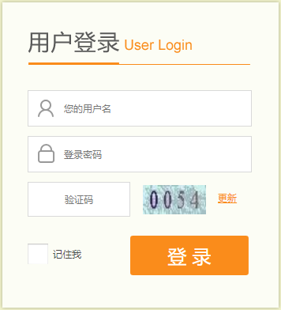

# 第5章 Spring Boot安全设计 

Web应用的安全管理， 主要包括两个方面的内容：一方面是用户身份认证，即用户登录的设计；另一方面是用户授权，即一个用户在一个应用系统中能够执行哪些操作的权限管理。权限管理的设计一般使用角色来管理，即给一个用户赋予哪些角色，这个用户就具有哪些权限。本章主要使用spring-cloud-security来进行安全管理设计。下面首先了解安全设计的依赖配置管理。

## 5.1 依赖配置管理

为了更方便地使用spring-cloud-security，将使用Spring Cloud（关于Spring Cloud将在后面的章节中介绍 ）的Maven依赖配置，如代码清单5-1所示。Spring Cloud有两个版本，第一版本的代号是Angel，第二个版本的代号是Brixton，这两个版本又包含各自的子版本，将使用Brixton.M5，因为它包含了Spring Boot 1.3.2，这和前面章节使用Spring Boot的版本相同，同时Spring Security默认的版本是4.0以上。

```xml
<parent>
    <groupId>org.springframework.cloud</groupId>
    <artifactId>spring-cloud-starter-parent</artifactId>
    <version>Brixton.M5</version>
    <relativePath/>
</parent>
......
<dependency>
    <groupId>org.springframework.cloud</groupId>
    <artifactId>spring-cloud-starter-security</artifactId>
</dependency>
```

了解依赖配置管理后，学习如何配置安全策略。

## 5.2 安全策略配置

关于系统的安全管理及各种设计，Spring Security已经大体上都实现了，只需要进行一些配置和引用，就能够正常使用。如代码清单5-2所示，安全配置类SecurityConfiguration继承了Spring Security的WebSecurityConfigurerAdapter。这里可以使用HttpSecurity的一些安全策略进行配置，各项配置的解释如下：

* loginPage：设置一个使用自定义的登录页面URL。
* loginSuccessHandler：设置自定义的一个登录成功处理器。
* permitAll：是完全运行访问的一些URL配置，并可以使用通配符来设置，这里将一些资源目录赋予可以完全访问的权限，由settings指定的权限列表页赋予了完全访问的权限。
* logout：设置使用默认的登出。
* logoutSuccessUrl：设定登出成功的链接。
* rememberMe：用来记住用户的登录状态，即用户没有执行退出时，再次打开页面将不用登录。
* csrf：即跨站请求伪造（cross-site request forgery），这是一个防止跨站请求伪造攻击的策略设置。
* accessDeniedPage：配置一个拒绝访问的提示链接。

其中，settings是引用了自定义的配置参数。

```java
public class SecurityConfiguration extends WebSecurityConfigurerAdapter {
    @Autowired
    private SecuritySettings settings;
    
    @Override
    protected void configure(HttpSecurity http) throws Exception {
        http.formLogin().loginPage("/login").permitAll().successHandler(loginSuccessHandler())
                .and().authorizeRequests()
                .antMatchers("/images/**", "/checkcode", "/scripts/**", "/styles/**").permitAll()
                .antMatchers(settings.getPermitall().split(",")).permitAll()
                .anyRequest().authenticated()
                .and().csrf().requireCsrfProtectionMatcher(csrfSecurityRequestMatcher())
                .and().sessionManagement().sessionCreationPolicy(SessionCreationPolicy.NEVER)
                .and().logout().logoutSuccessUrl(settings.getLogoutsuccssurl())
                .and().exceptionHandling().accessDeniedPage(settings.getDeniedpage())
                .and().rememberMe().tokenValiditySeconds(86400).tokenRepository(tokenRepository());
    }
}
```

### 5.2.1 权限管理规则

代码清单5-2中引用的SecuritySettings是自定义的一个配置类，如代码清单5-3所示。其中使用注解@ConfigurationProperties设定配置参数的前缀部分为securityconfig，定义的各个配置参数的意义如下：

* logoutsuccessurl：用来定义退出成功的链接。
* permitall：用来定义允许访问的URL列表。
* deniedpage：用来设定拒绝访问的信息提示链接。
* urlroles：这是一个权限管理规则，是链接地址与角色权限的配置列表。

```java
@ConfigurationProperties(prefix = "securityconfig")
public class SecuritySettings {
    private String logoutsuccssurl = "/logout";
    private String permitall = "/api";
    private String deniedpage = "/deny";
    private String urlroles;
}
```

使用自定义配置参数后，可以在工程的配置文件application.yml中对安全管理进行集中配置，如代码清单5-4所示。

```yml
securityconfig:
  logoutsuccssurl: /
  permitall: /rest/**,/bbs**
  deniedpage: /deny
  urlroles: /**/new/** = admin;
            /**/edit/** = admin,editor;
            /**/delete/** = admin
```

其中urlroles配置一个权限配置列表，这是我们设计的一种权限管理规则，列表中的每一个配置项用分号分隔，每一个配置项的等号左边是一个可以带上通配符的链接地址，等号右边是一个角色列表，角色之间用逗号分隔。每一个配置项表示包含等号左边字符串的链接地址，能够被等号右边的角色访问。

这将要求我们的控制器设计链接地址时，必须遵循这一权限管理规则，这样只要使用一个简单的配置列表，就能够覆盖整个系统的权限管理策略。设计控制器链接地址的规则如下，它包含了系统增删查改的所有操作。

* `/**/new`：新建；
* `/**/edit/**`：修改；
* `/**/delete/**`：删除；
* `/**/show/**`：查看；
* `/**/list`：列表查询；

使用这种规则之后，再来看看代码清单5-4中urlroles的权限配置，这里只需要简单的三个配置项，就已经完成了对一个应用系统所有权限的管理配置了。其中，新建操作只有manage、admin两个角色有权限，修改操作和删除操作只有admin这个角色有权限，至于没有在权限管理列表中配置的查看操作，因为没有限定角色访问，所以它能被所有用户访问。

这种权限策略配置好了之后，要让应用系统中的一个用户具有哪些权限，只要分配给这个用户一些角色就可以。

### 5.2.2 登录成功处理器

登录成功后，如果需要对用户的行为进行记录或者执行其他操作，可以使用登录成功处理器。代码清单5-5是一个登录成功处理器的定义，这里只是简单地输出了用户登录的日志。

```java
@Override
public void onAuthenticationSuccess(HttpServletRequest request, HttpServletResponse response, Authentication authentication)
        throws IOException,ServletException {
    User userDetails = (User)authentication.getPrincipal();

    log.info("登录用户user:" + userDetails.getName() + "login"+request.getContextPath());
    log.info("IP:" + getIpAddress(request));
    super.onAuthenticationSuccess(request, response, authentication);
}
```

### 5.2.3 防攻击策略

因为Spring Security的跨站请求伪造（cross-site request forgery，CSRF）即阻止跨站请求伪造攻击的功能很完善，所以使用Spring Security之后，对于新建、修改和删除等操作，必须进行特殊的处理，才能正常使用。这要求在所有上面操作请求的页面上提供如下代码片段，因为我们的页面设计使用了Thymeleaf模板，所以只要在layout.html的页头上加入下面两行代码夹克，layout.html是所有页面都会用到的一个页面文件。

``` html
<meta name="_csrf" th:content="${_csrf.token}"/>
<meta name="_csrf_header" th:content="${_csrf.headerName}"/>
```

还要在layout.html中引用脚本文件public.js，然后在public.js中增加一个函数，如代码清单5-6所示。这样做的意思是，在表单提交时放入一个token，服务端验证该token是否有效，只允许有效的token请求，否则拒绝当前操作。这样就能够很好地起到防御CSRF攻击的目的。

```js
$(function () {
	var token = $("meta[name='_csrf']").attr("content");
	var header = $("meta[name='_csrf_header']").attr("content");
	$(document).ajaxSend(function(e, xhr, options){
		xhr.setRequestHeader(header, token);
	});
});
```

如果要对第三方开发接口，上面的方法就不适用了，这时只能对特定的URL使用排除CSRF保护的方法来实现。代码清单5-7对指定的URL排除对齐进行CSRF的保护。

```java
public class CsrfSecurityRequestMatcher implements RequestMatcher {
    protected Log log = LogFactory.getLog(getClass());
    private Pattern allowedMethods = Pattern
            .compile("^(GET|HEAD|TRACE|OPTIONS)$");
    /**
     * 需要排除的url列表
     */
    private List<String> execludeUrls;

    @Override
    public boolean matches(HttpServletRequest request) {
        if (execludeUrls != null && execludeUrls.size() > 0) {
            String servletPath = request.getServletPath();
            for (String url : execludeUrls) {
                if (servletPath.contains(url)) {
                    log.info("++++" + servletPath);
                    return false;
                }
            }
        }
        return !allowedMethods.matcher(request.getMethod()).matches();
    }
}
```

然后在配置类中，加入需要排除阻止CSRF攻击的链接列表，如代码清单5-8所示，只要链接地址中包含"/rest"字符串，就将对其忽略CSRF保护策略。

```java
private CsrfSecurityRequestMatcher csrfSecurityRequestMatcher() {
    CsrfSecurityRequestMatcher csrfSecurityRequestMatcher = new CsrfSecurityRequestMatcher();
    List<String> list = new ArrayList<String>();
    list.add("/rest/");
    csrfSecurityRequestMatcher.setExecludeUrls(list);
    return csrfSecurityRequestMatcher;
}
```

### 5.2.4 记住登录状态

代码清单5-2中的安全策略配置中有一行配置：rememberMe().tokenvaliditySconds(86400).tokenRepository(tokenRepository())，它是用来记住用户登录状态的一个配置，其中86400指定记住的时间秒数，即为1天时间。为了实现这个功能，需要将一个用户的登录令牌等信息保存在数据库中，这需要在配置类中指定连接数据库的数据源，如代码清单5-9所示。

```java
@Bean
public JdbcTokenRepositoryImpl tokenRepository() {
    JdbcTokenRepositoryImpl jtr = new JdbcTokenRepositoryImpl();
    jtr.setDataSource(dataSource);
    return jtr;
}
```

同时，还应该在数据库中增加一个数据表persistent_logins，这个表结构的定义是由Spring Security提供的，使用一个实体来实现，这样做的目的只是为了在系统启动时能够创建这个表结构而已，如代码清单5-10所示，它用来保存用户、令牌和最后登录时间等信息。

```java
@Entity
@Table(name = "persistent_logins")
public class PersistentLogins implements Serializable {
    @Id
    @Column(name = "series", length = 64, nullable = false)
    private String series;
    @Column(name = "username", length = 64, nullable = false)
    private String username;
    @Column(name = "token", length = 64, nullable = false)
    private String token;
    @Temporal(TemporalType.TIMESTAMP)
    @Column(name = "last_used", nullable = false)
    private Date last_used;
......
}
```

### 5.3 登录认证设计

完成上面的安全策略配置之后，打开受保护的页面或链接时，就会引导用户到登录页面上输入用户名和密码验证用户身份。如果在安全配置中没有指定登录页面URL，Spring Security就调用其默认的登录页面。只是，Spring Security的登录页面设计很简单，不适合于一般的Web应用的登录设计。除了登录页面，Spring Security对于用户身份验证同样也已经实现了，只需要加以引用即可。

### 5.3.1 用户实体建模

可以使用第2章的实例工程MySQL模块的实体建模来建立用户体系，回顾一下，在第2章中建模的实体中包含用户、部们和角色三个对象，它们的关系是，一个用户只能属于一个部门，一个用户可以拥有多个角色，这非常适合本章的实例。除了部门和角色，用户实体的树形必须做些调整，以适合本章实例的要求，如代码清单5-11所示，即增加了邮箱、性别和密码等几个属性，其他基本相同。

```java
@Entity
@Table(name = "user")
public class User implements java.io.Serializable {
    @Id
    @GeneratedValue(strategy = GenerationType.IDENTITY)
    private Long id;
    private String name;
    private String email;
    private Integer sex;
    @DateTimeFormat(pattern = "yyyy-MM-dd HH:mm:ss")
    private Date createdate;
    private String password;

    @ManyToOne
    @JoinColumn(name = "did")
    @JsonBackReference
    private Department department;

    @ManyToMany(cascade = {}, fetch = FetchType.EAGER)
    @JoinTable(name = "user_role",
            joinColumns = {@JoinColumn(name = "user_id")},
            inverseJoinColumns = {@JoinColumn(name = "roles_id")})
    private List<Role> roles;
......
}
```

另外，在用户实体的持久化方面，也增加了几个方法以便能适用本章实例的要求，如代码清单5-12所示。其中User findByName ( String name ) 就是登录时使用用户名来查询用户的信息。

```java
@Repository
public interface UserRepository extends JpaRepository<User, Long> {
    @Query("select t from User t where t.name =?1 and t.email =?2")
    User findByNameAndEmail(String name, String email);

    @Query("select t from User t where t.name like :name")
    Page<User> findByName(@Param("name") String name, Pageable pageRequest);

    User findByName(String name);
}
```

### 5.3.2 用户身份验证

在安全配置类的定义中，使用了如代码清单5-13所示的配置，用来调用我们自定义的用户认证CustomUserDetailsService，并且指定了使用密码的加密算法为BCryptPasswordEncoder，这是Spring Security官方推荐的加密算法，比MD5算法的安全性更高。

```java
@Autowired
private CustomUserDetailsService customUserDetailsService;
@Autowired
@Qualifier("dataSource")
private DataSource dataSource;

@Override
protected void configure(AuthenticationManagerBuilder auth)
    throws Exception {
    auth.userDetailsService(customUserDetailsService).passwordEncoder(passwordEncoder());
    //remember me
    auth.eraseCredentials(false);
}

@Bean
public BCryptPasswordEncoder passwordEncoder() {
    return new BCryptPasswordEncoder();
}
```

如代码清单5-14所示，CustomUserDetailsService实现了Spring Security的UserDetailsService，重载了loadUserByUsername( String userName)，并返回自定义的SecurityUser，通过这个SecurityUser来完成用户的身份认证。其中，loadUserByUsername调用了用户资源库接口的findByName方法，取得登录用户的详细信息。

```java
@Component
public class CustomUserDetailsService implements UserDetailsService {
    @Autowired
    private UserRepository userRepository;

    @Override
    public UserDetails loadUserByUsername(String userName) throws UsernameNotFoundException {
        User user = userRepository.findByName(userName);
        if (user == null) {
            throw new UsernameNotFoundException("UserName " + userName + " not found");
        }
        return new SecurityUser(user);
    }
}
```

SecurityUser继承于实体对象User，并实现了Spring Security的UserDetails，同时重载了getAuthorities()，用来取得为用户分配的角色列表，用于后面的权限验证，它的实现如代码清单5-15所示。

```java
public class SecurityUser extends User implements UserDetails
{
    @Override
    public Collection<? extends GrantedAuthority> getAuthorities() {
        Collection<GrantedAuthority> authorities = new ArrayList<GrantedAuthority>();
        List<Role> roles = this.getRoles();
        if(roles != null)
        {
            for (Role role : roles) {
                SimpleGrantedAuthority authority = new SimpleGrantedAuthority(role.getName());
                authorities.add(authority);
            }
        }
        return authorities;
    }
}
```

### 5.3.3 登录界面设计

首先创建一个登录控制器，编写如代码清单5-16所示的代码，这个控制器很简单，它仅仅是返回对一个页面的调用，页面的设计文件是login.html。

```java
@Controller
public class LoginController {
    @RequestMapping("/login")
    public String login(){
        return "login";
    }
}
```

登录界面的设计在页面文件login.html中完成，代码清单5-17是表单设计的部分代码和一些错误提示设计。表单中设置了用户、密码和验证码邓输入框，最终使用POST方式提交，提交的链接地址是/loging，这将请求Spring Security的内部方法。

```html
            <div th:if="${param.error}">
                <input th:value="无效的用户或密码！" id="errorMsg" type="hidden"/>
            </div>
            <div th:if="${param.logout}">
                <input th:value="你已经退出！" id="errorMsg" type="hidden"/>
            </div>
            <div th:if="${#httpServletRequest.remoteUser != null}">
                <input th:value="${#httpServletRequest.remoteUser}" id="errorMsg" type="hidden"/>
            </div>
            <form th:action="@{/login}" id="loginForm" method="post">
                <div class="loginTit png"></div>
                <ul class="infList">
                    <li class="grayBox">
                        <label for="username" class="username-icon"></label>
                        <input id="username" class="username" name="username" type="text" placeholder="您的用户名"/>
                        <div class="close png hide"></div>
                    </li>
                    <li class="grayBox">
                        <label class="pwd-icon" id="pwd"></label>
                        <input id="password" name="password" class="pwd" type="password" placeholder="登录密码"/>
                        <div class="close png hide"></div>
                    </li>
                    <li class="">
                        <label class="validateLabel"></label>
                        <input id="checkCode" name="checkCode" class="checkCode" type="text" placeholder="验证码"/>
                        
                        <a class="getOther" href="javascript:void(0);" onclick="reloadImg();"
                           title="点击此处可以更新验证码。">更新</a>
                    </li>
                </ul>
                <ul class="infList reloadBtn" style="display: none;">
                    <li>
                        <a href="javascript:void(0);" onclick="tologin();">本页面已经失效。请点击此处重新登录。</a>
                    </li>
                </ul>
                <div class="loginBtnBox">
                    <div class="check-box"><input type="hidden" value="0" id="remember-me" name="remember-me"
                                                  onclick="if(this.checked){this.value = 1}else{this.value=0}"/><span
                            class="toggleCheck no-check" id="repwd"></span>记住我
                    </div>
                    <input type="button" id="loginBtn" onclick="verSubmit()" value="登 录" class="loginBtn png"/>
                </div>
            </form>
```

完成的登录界面设计效果如图5-1所示。



### 5.3.4 验证码验证

注意到上面登录界面设计中有一个验证码功能，这个功能Spring Security是没有的，必须由我们来实现。代码清单5-18是使用验证码的实现代码，其中imagecode方法是一个生成图形验证码的请求。checkcode方法实现了对这个图形验证码的验证。从验证码的生成到验证的过程中，验证码是通过Session来保存的，并且设定一个验证码的最长有效时间为5分钟。验证码的生成规则是从0~9的数字中，随机产生一个4位数，并增加一些干扰元素，最终组合成为一个图形输出。

```java
    @RequestMapping(value = "/images/imagecode")
    public String imagecode(HttpServletRequest request, HttpServletResponse response)
            throws Exception {
        OutputStream os = response.getOutputStream();
        Map<String,Object> map = ImageCode.getImageCode(60, 20, os);

        String simpleCaptcha = "simpleCaptcha";
        request.getSession().setAttribute(simpleCaptcha, map.get("strEnsure").toString().toLowerCase());
        request.getSession().setAttribute("codeTime",new Date().getTime());

        try {
            ImageIO.write((BufferedImage) map.get("image"), "JPEG", os);
        } catch (IOException e) {
            return "";
        }
        return null;
    }

    @RequestMapping(value = "/checkcode")
    @ResponseBody
    public String checkcode(HttpServletRequest request, HttpSession session)
            throws Exception {
        String checkCode = request.getParameter("checkCode");
        Object cko = session.getAttribute("simpleCaptcha") ; //验证码对象
        if(cko == null){
            request.setAttribute("errorMsg", "验证码已失效，请重新输入！");
            return "验证码已失效，请重新输入！";
        }

        String captcha = cko.toString();
        Date now = new Date();
        Long codeTime = Long.valueOf(session.getAttribute("codeTime")+"");
        if(StringUtils.isEmpty(checkCode) || captcha == null ||  !(checkCode.equalsIgnoreCase(captcha))){
            request.setAttribute("errorMsg", "验证码错误！");
            return "验证码错误！";
        }else if ((now.getTime()-codeTime)/1000/60>5){//验证码有效时长为5分钟
            request.setAttribute("errorMsg", "验证码已失效，请重新输入！");
            return "验证码已失效，请重新输入！";
        }else {
            session.removeAttribute("simpleCaptcha");
            return "1";
        }
    }
```

## 5.4 权限管理设计

用户通过身份认证，成功登录系统后，就要开始检查用户访问资源的权限，如果用户没有权限访问，将会阻止用户访问受保护的资源，并给出错误提示信息。

### 5.4.1 权限管理配置

在安全配置类中，定义了几个类，实现自定义的权限检查判断及其管理的功能，如代码清单5-19所示，各个类的意义如下：

* CustomFilterSecurityIntercceptor：权限管理过滤器。
* CustomAccessDecisionManager：权限管理决断器。
* CustomSecurityMetadataSource：权限配置资源管理器。

其中，过滤器在系统启动时开始工作，并同时导入资源管理器和权限决断器，对用户访问的资源进行管理。权限决断器对用户访问的资源与用户拥有的角色权限进行对比，以此来判断一个用户是否对一个资源具有访问权限。

```java
/**
 * 权限管理设置
 *
 * @return
 * @throws Exception
 */
@Bean
public CustomFilterSecurityInterceptor customFilter() throws Exception {
    CustomFilterSecurityInterceptor customFilter = new CustomFilterSecurityInterceptor();
    customFilter.setSecurityMetadataSource(securityMetadataSource());
    customFilter.setAccessDecisionManager(accessDecisionManager());
    customFilter.setAuthenticationManager(authenticationManager);
    return customFilter;
}

@Bean
public CustomAccessDecisionManager accessDecisionManager() {
    return new CustomAccessDecisionManager();
}

@Bean
public CustomSecurityMetadataSource securityMetadataSource() {
    return new CustomSecurityMetadataSource(settings.getUrlroles());
}
```

### 5.4.2 权限管理过滤器

权限管理过来器继承于Spring Security的AbstractSecurityInterceptor，实时监控用户的行为，防止用户访问未被授权的资源，如代码清单5-20所示。

```java
/**
 * 权限管理过滤器
 */
public class CustomFilterSecurityInterceptor extends AbstractSecurityInterceptor implements Filter {
    private static final Logger logger = Logger.getLogger(CustomFilterSecurityInterceptor.class);
    private FilterInvocationSecurityMetadataSource securityMetadataSource;

    @Override
    public void doFilter(ServletRequest request, ServletResponse response, FilterChain chain) throws IOException, ServletException {
        FilterInvocation fi = new FilterInvocation(request, response, chain);
        logger.debug("====" + fi.getRequestUrl());
        invoke(fi);
    }

    public void invoke(FilterInvocation fi) throws IOException, ServletException {
        InterceptorStatusToken token = super.beforeInvocation(fi);
        try {
            fi.getChain().doFilter(fi.getRequest(), fi.getResponse());
        } catch (Exception e) {
            logger.error(e.getMessage());
        } finally {
            super.afterInvocation(token, null);
        }
    }
    ......
}
```

### 5.4.3 权限配置资源管理器

权限配置资源管理器实现了Spring Security的FilterInvocationSerurityMetadataSource，它在启动时导入代码清单5-4的权限配置列表。如代码清单5-21所示，权限配置资源管理器为权限决断器实时提供支持，判断用户访问的资源是否在受保护的范围之内。

```java
/**
 * 权限配置资源管理器
 */
public class CustomSecurityMetadataSource implements FilterInvocationSecurityMetadataSource {
    private static final Logger logger = Logger.getLogger(CustomSecurityMetadataSource.class);

    private Map<String, Collection<ConfigAttribute>> resourceMap = null;
    private PathMatcher pathMatcher = new AntPathMatcher();

    private String urlroles;

    @Override
    public Collection<ConfigAttribute> getAllConfigAttributes() {
        return null;
    }

    public CustomSecurityMetadataSource(String urlroles) {
        super();
        this.urlroles = urlroles;
        resourceMap = loadResourceMatchAuthority();
    }

    private Map<String, Collection<ConfigAttribute>> loadResourceMatchAuthority() {

        Map<String, Collection<ConfigAttribute>> map = new HashMap<String, Collection<ConfigAttribute>>();

        if (urlroles != null && !urlroles.isEmpty()) {
            String[] resouces = urlroles.split(";");
            for (String resource : resouces) {
                String[] urls = resource.split("=");
                String[] roles = urls[1].split(",");
                Collection<ConfigAttribute> list = new ArrayList<ConfigAttribute>();
                for (String role : roles) {
                    ConfigAttribute config = new SecurityConfig(role.trim());
                    list.add(config);
                }
                //key：url, value：roles
                map.put(urls[0].trim(), list);
            }
        } else {
            logger.error("'securityconfig.urlroles' must be set");
        }

        logger.info("Loaded UrlRoles Resources.");
        return map;

    }

    @Override
    public Collection<ConfigAttribute> getAttributes(Object object)
            throws IllegalArgumentException {
        String url = ((FilterInvocation) object).getRequestUrl();

        logger.debug("request url is  " + url);

        if (resourceMap == null)
            resourceMap = loadResourceMatchAuthority();

        Iterator<String> ite = resourceMap.keySet().iterator();
        while (ite.hasNext()) {
            String resURL = ite.next();
            if (pathMatcher.match(resURL, url)) {
                return resourceMap.get(resURL);
            }
        }
        return resourceMap.get(url);
    }
	......
}
```

#### 5.4.4 权限管理决断器

权限管理的关键部分就是决断器，它实现了Spring Security的AccessDecisionManager，重载了decide函数，使用了自定义的决断管理，如代码清单5-22所示。在用户访问受保护的的资源时，决断器判断用户拥有的角色中是否对该资源具有访问权限，如果没有权限将被拒绝访问，并返回错误提示。

```java
/**
 * 权限管理决断器
 */
public class CustomAccessDecisionManager implements AccessDecisionManager {
    private static final Logger logger = Logger.getLogger(CustomAccessDecisionManager.class);

    @Override
    public void decide(Authentication authentication, Object object,
                       Collection<ConfigAttribute> configAttributes)
            throws AccessDeniedException, InsufficientAuthenticationException {
        if (configAttributes == null) {
            return;
        }

        //config urlroles
        Iterator<ConfigAttribute> iterator = configAttributes.iterator();

        while (iterator.hasNext()) {
            ConfigAttribute configAttribute = iterator.next();
            //need role
            String needRole = configAttribute.getAttribute();
            //user roles
            for (GrantedAuthority ga : authentication.getAuthorities()) {
                if (needRole.equals(ga.getAuthority())) {
                    return;
                }
            }
            logger.info("need role is " + needRole);
        }
        throw new AccessDeniedException("Cannot Access!");
    }
	......
}
```

## 5.5 根据权限设置链接

对于权限管理，我们可能希望，在一个用户访问的界面中，不是等到用户单击了一个超链接之后，才来判断用户有没有这个权限（虽然这种设计是必须的），而是按照用户拥有的权限来设置一个用户可以访问的超链接。这样的设计对于用户体验来说，显得更加友好。

以管理后台中用户管理的例子来说明如何实现根据权限来设置链接。如代码清单5-23所示，在打开用户管理主页的控制器中，读取了当前用户的权限配置，然后根据这个用户的权限列表来判断这个用户是否拥有新建、修改和删除等权限，最后把这些权限通过变量传给页面，由页面负责根据权限来设置用户可用的超链接。其中，newrole、editrole和deleterole分别表示新建、修改和删除权限的判断值。

```java
    @Value("${securityconfig.urlroles}")
    private String urlroles;

    @RequestMapping("/index")
    public String index(ModelMap model, Principal user) throws Exception{
        Authentication authentication = (Authentication)user;
        List<String> userroles = new ArrayList<>();
        for(GrantedAuthority ga : authentication.getAuthorities()){
            userroles.add(ga.getAuthority());
        }

        boolean newrole=false,editrole=false,deleterole=false;
        if(!StringUtils.isEmpty(urlroles)) {
            String[] resouces = urlroles.split(";");
            for (String resource : resouces) {
                String[] urls = resource.split("=");
                if(urls[0].indexOf("new") > 0){
                    String[] newroles = urls[1].split(",");
                    for(String str : newroles){
                        str = str.trim();
                        if(userroles.contains(str)){
                            newrole = true;
                            break;
                        }
                    }
                }else if(urls[0].indexOf("edit") > 0){
                    String[] editoles = urls[1].split(",");
                    for(String str : editoles){
                        str = str.trim();
                        if(userroles.contains(str)){
                            editrole = true;
                            break;
                        }
                    }
                }else if(urls[0].indexOf("delete") > 0){
                    String[] deleteroles = urls[1].split(",");
                    for(String str : deleteroles){
                        str = str.trim();
                        if(userroles.contains(str)){
                            deleterole = true;
                            break;
                        }
                    }
                }
            }
        }

        model.addAttribute("newrole", newrole);
        model.addAttribute("editrole", editrole);
        model.addAttribute("deleterole", deleterole);

        model.addAttribute("user", user);
        return "user/index";
    }
}
```

在用户管理的主页视图中有一个“新增”超链接，可以通过控制器传递过来的newrole值来判断这个用户对这个链接有没有权限，从而决定这个链接能不能显示出来，提供给用户使用，代码如下：

``` html
<!--判断用户是否具有“新增”超链接-->
<div class="newBtnBox" th:if="${newrole}">
    <a id="addUserInf" class="blueBtn-62X30" href="javascript:void(0)">新增</a>
</div>
```

而对于修改和删除的权限，因为页面的数据是从js中生成的，所以可以在生成用户列表的程序段中判断editrole和deleterole，从而决定是否提供这两个功能的链接，如代码清单5-24所示。

```js
//填充分页数据
function fillData(data){
    var editrole = $("#editrole").val();
    var deleterole = $("#deleterole").val();

    var $list = $('#tbodyContent').empty();
    $.each(data,function(k,v) {
        var html = "";
        html += '<tr> ' +
            '<td>' + (v.id == null ? '' : v.id) + '</td>' +
            '<td>' + (v.name == null ? '' : v.name) + '</td>' +
            '<td>' + (v.email == null ? '' : v.email) + '</td>' +
            '<td>' + (v.createdate == null ? '' : getSmpFormatDateByLong(v.createdate, true)) + '</td>';
        html += '<td><a class="c-50a73f mlr-6" href="javascript:void(0)" onclick="showDetail(\'' + v.id + '\')">查看</a>';

        if (editrole == 'true')
            html += '<a class="c-50a73f mlr-6" href="javascript:void(0)" onclick="edit(\'' + v.id + '\')">修改</a>';

        if(deleterole == 'true')
            html += '<a class="c-50a73f mlr-6" href="javascript:void(0)" onclick="del(\''+ v.id+'\')">删除</a>';

        html +='</td></tr>' ;

        $list.append($(html));
    });
}
```

其中的“修改”和“删除”权限的判断值，即代码中的editrole和deleterole，是在导入用户管理的主页时使用隐藏的输入框这种方式传递进来的，代码如下：

```html
<input type="hidden" name="editrole" id="editrole" th:value="${editrole}"/>
<input type="hidden" name="deleterole" id="deleterole" th:value="${deleterole}"/>
```

上面这种根据权限设置链接的设计，只是在一个局部操作界面上实现，在实际应用中，可以通过统筹规划全局视图，在全局的角度中实现这种设计。

## 5.6 运行与发布

本章实例工程的完整代码可以通过IDEA直接从GitHub中检出：https://github.com/chenfromsz/spring-boot-security.git。实例工程中包含两个模块：mysql和web，其中mysql模块提供数据库管理功能，web模块集成了安全管理和一个数据管理后台的功能，即用户登录后可以对用户、部门和角色等各个对象的数据进行管理。

### 5.6.1 系统初始化

为了初始化一个能够登录系统的用户，我们在工程模块mysql中编写了一个JUnit测试程序，用来生成一个具有所属部门和拥有角色的用户，如代码清单5-25所示。测试程序执行时，将初始化数据库，并生成一个部门和一个角色，同时创建一个初始用户，用户名和密码都为user，这个用户默认具有管理员的权限。

```java
package com.test.mysql.test;

import com.test.mysql.entity.Department;
import com.test.mysql.entity.Role;
import com.test.mysql.entity.User;
import com.test.mysql.repository.DepartmentRepository;
import com.test.mysql.repository.RoleRepository;
import com.test.mysql.repository.UserRepository;
import org.junit.Before;
import org.junit.Test;
import org.junit.runner.RunWith;
import org.springframework.beans.factory.annotation.Autowired;
import org.springframework.security.crypto.bcrypt.BCryptPasswordEncoder;
import org.springframework.test.context.ContextConfiguration;
import org.springframework.test.context.junit4.SpringJUnit4ClassRunner;
import org.springframework.util.Assert;

import java.util.Date;
import java.util.List;

@RunWith(SpringJUnit4ClassRunner.class)
@ContextConfiguration(classes = {JpaConfiguration.class})
public class MysqlTest {
    @Autowired
    UserRepository userRepository;
    @Autowired
    DepartmentRepository departmentRepository;
    @Autowired
    RoleRepository roleRepository;

    @Before
    public void initData() {
        userRepository.deleteAll();
        roleRepository.deleteAll();
        departmentRepository.deleteAll();

        Department department = new Department();
        department.setName("开发部");
        departmentRepository.save(department);
        Assert.notNull(department.getId());

        Role role = new Role();
        role.setName("admin");
        roleRepository.save(role);
        Assert.notNull(role.getId());

        User user = new User();
        user.setName("user");
        BCryptPasswordEncoder bpe = new BCryptPasswordEncoder();
        user.setPassword(bpe.encode("user"));
        user.setCreatedate(new Date());
        user.setDepartment(department);
        userRepository.save(user);
        Assert.notNull(user.getId());
    }

    @Test
    public void insertUserRoles() {
        User user = userRepository.findByName("user");
        Assert.notNull(user);

        List<Role> roles = roleRepository.findAll();
        Assert.notNull(roles);
        user.setRoles(roles);
        userRepository.save(user);
    }
}
```

这样，就可以在IDEA的Edit Configuration中增加一个JUnit测试配置项目，模块选择mysql，工作目录选择mysql模块所在的工程根目录，测试类选择上面的测试程序，并将配置保存为MysqlTest。

然后在MySQL服务器中创建一个test数据库，并在测试程序所在目录打开配置类JpaConfiguration的实现代码，配置数据源中的url、username、password，如代码清单5-26所示。

```java
@Bean
public DataSource dataSource() {
    DriverManagerDataSource dataSource = new DriverManagerDataSource();
    dataSource.setDriverClassName("com.mysql.jdbc.Driver");
    dataSource.setUrl("jdbc:mysql://localhost:3306/test?characterEncoding=utf8");
    dataSource.setUsername("root");
    dataSource.setPassword("123456");

    return dataSource;
}
```

最后运行测试项目MysqlTest，运行成功后生成一个初始用户，用户名和密码为user，并且该用户的所属部门为“开发部”，拥有一个管理员角色为admin。

### 5.6.2 系统运行与发布

首先，在web模块的配置文件application.yml中配置连接MySQL服务器的数据源，其他JPA和安全配置可以保持不变。

如果在IDEA中运行应用，可以在IDEA的Edit Configuration中增加一个Spring Boot配置项目，模块选择web，工作目录选择web模块所在的工程根目录，主程序选择com.test.web.WebApplication，并将配置项目保存为web。

然后运行配置项目web即可启动web应用，启动成功后，在浏览器中输入网址http://localhost访问应用。

在出现的登录界面中，输入上面生成的用户名和密码user，并输入正确的验证码，即可登录系统。登录系统后，可对用户、部门和角色进行管理。

如果要发布应用，既可以在IDEA中增加一个Maven配置，也可以打开一个命令行窗口，将目录切换到工程的根目录，然后执行下列指令来完成。

```bash
mvn clean package
```

> **注意**
>
> 使用上面的发布指令将会自动调用MysqlTest测试程序，这将删除数据库的所有资料，执行初始化操作，然后创建一个初始用户，用户名和密码都为user，并且具有管理员的权限。如果不想自动调用测试程序，可在上面指令中加入参数：-D skipTests。

打包成功后可在命令行窗口中，运行下列指令启动系统（假如当前目录为工程根目录）。

```bash
java -jar web/target/web-1.0-SNAPSHOT.jar
```

## 5.7 小结

本章使用Spring Security，实现了Web应用系统的安全管理功能，即用户认真和权限管理等功能。使用Spring Security省略了很多安全管理的设计和实现的工作，同时引用Spring Security的功能，使用一些自定义的设计，又让安全管理设计增加了很多灵活性，例如，可以设计出更加漂亮的登录界面、更加简便的权限管理措施和策略等。

Spring Security安全管理功能完善而且强大，那么对于分布式应用环境，又将怎样使用呢？下一章使用Spring Security结合OAuth2协议来设计分布式应用环境中的单点登录。

