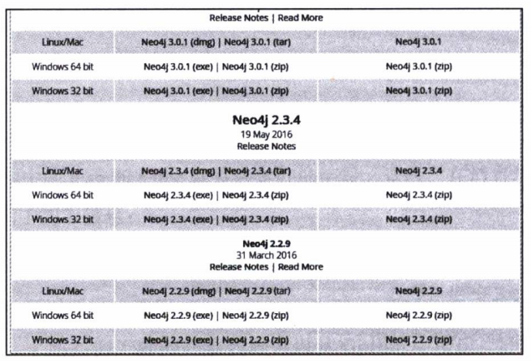
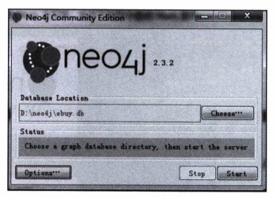
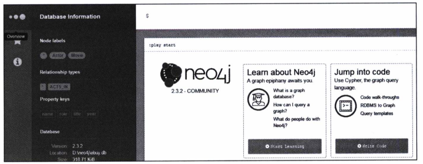

# 附录Ａ——安装Neo4j

Neo4j数据库有两个版本：社区版和商业版，社区版是开源并且免费的。社区版与商业版功能上没有什么区别，不同的是社区版只能单机使用，商业版可以做分布式集群。单机版最大可以存储10亿个结点。

Neo4j针对不现的操作系统，如MAC OSX、Linux、Windows等提供不同的安装包，可以使用下列链接选择下载社区版的不同安装包，打开链接后如图A-1所示。

http://neo4j.com/download/other-releases/



因为本书实例使用的版本是Neo4j2.3.2，所以选择Neo4j2.3.4这个比较接近的版本的安装包下载。对于系统的最低要求，参照官方说明如下：

* CPU：Intel Core i3
* 内存：2GB
* 硬盘：10GB SATA

如果使用Linux系统安装，可以先创建一个目录，或许在“/opt”目录中下载tar安装包，然后使用下列指令解压即完成安装：

```
#tar -xf 文件名
```

然后切换到Neo4j主目录，执行下列指令启动Neo4j服务：

```
#./bin/neo4j start
```

如果在Windows上安装，使用Windows的安装文件，按默认选项执行安装。安装完成后，在程序菜单中打开Neo4j Community Edition窗口，如图A-2所示。



数据库保存位置使用默认的位置即可，单击Start按钮，启动Neo4j服务。

如果不是在本地调用，需要开启远程调用功能，可以修改neo4j-server.properties配置文件来实现，即将下列配置项的注释“#”去掉即可。

```
#org.neo4j.server.webserver.address=0.0.0.0
```

还有一个配置文件neo4j.properties，可以用来配置使用内存的大小和日程保留时间等参数，这些使用默认的配置即可。

启动Neo4j服务之后，可以使用浏览器打开数据库的控制台，假设数据库安装在本地上，使用URL就可以打开控制台：

```
http://localhost:7474
```

打开后需要输入默认的用户名和密码：neo4j，首次使用会要求更改初始密码，如图A-3所示。


登录之后，在控制上可以展开左边侧边栏，如单击Overview，可以打开操作数据库的面板，查看节点和关系，如图A-4所示。



Neo4j控制台是一个用HTML5设计的漂亮的操作界面。现在就可以开始使用具有服务器的Neo4j图形数据库了。