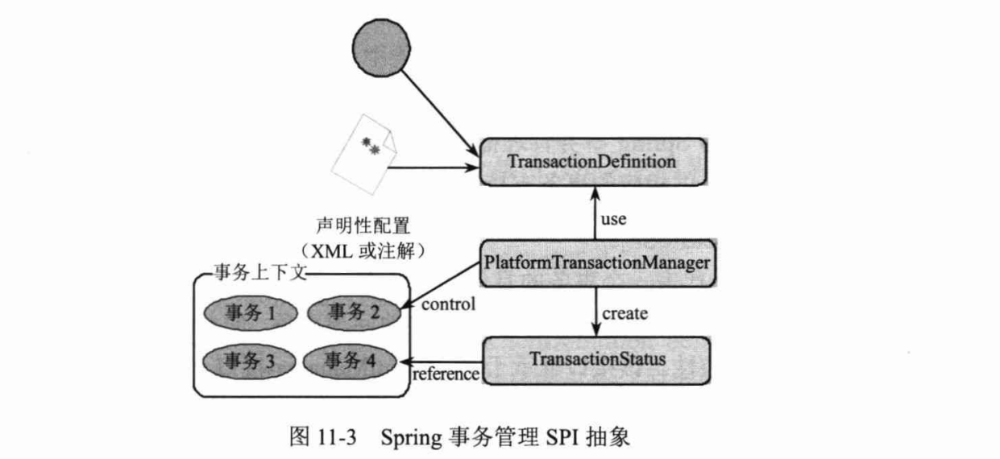
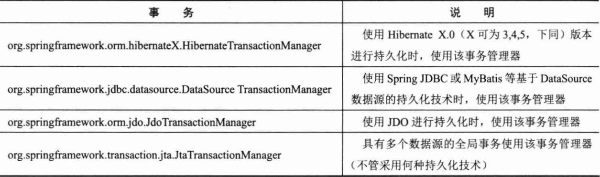

# 第11章 Spring的事务管理

> 在使用Spring开发应用时，Spring的事务管理可能是被使用最多、应用最广的功能。对于大多数应用者来说，Spring事务管理所带来的好处是实实在在的。Spring不但提供了和底层事务源无关的事务抽象，还提供了声明性事务的功能，可以让程序从事务代码中解放出来。而这正是EJB自鸣得意的地方，但现在我们有了更好、更便捷的替代方案。

**本章主要内容：**

* 事务属性值的实际意义
* ThreadLocal的工作机制
* Spring事务管理的体系结构
* 基于XML的事务配置
* 基于注解的事务配置

**本章亮点：**

* 介绍数据库事务的基础知识，它们是掌握事务配置的基础
* 深入学习ThreadLocal知识，进而揭示Spring事务同步管理器的工作原理
* Spring注解AspectJ织入的过程

## 11.1 数据库事务基础知识

Spring虽然提供了灵活方便的事务管理功能，但这些功能都是基于底层数据库本身的事务处理机制工作的。要深入了解Spring的事务管理和配置，有必要先对数据库事务的基础知识进行学习。

### 11.1.1 何为数据库事务

“一荣俱荣，一损俱损”这句话很能体现事务的思想，很多复杂的事物要分步进行，但它们组成了一个整体，要么整体生效，要么整体失败。这种思想反映到数据库上，就是多条SQL语句，要么所有执行成功，要么所有执行失败。

数据库事务有严格的定义，它必须同时满足4个特性：原子性（Atomic）、一致性（Consistency）、隔离性（IsoLation）和持久性（Durabiliy），简称为ACID。下面是对每个特性的说明。

* 原子性：表示组成一个事务的多个数据库操作是一个不可分割的原子单元，只有所有的操作执行成功，整个事务才提交。事务中的任何一个数据库操作失败，已经执行的任何操作都必须撤销，让数据库返回到初始状态。
* 一致性：事务操作成功后，数据库所处的状态和它的业务规则是一致的，即数据不会被破坏。如从A账户转账100元到B账户，不管操作成功与否，A账户和B账户的存款总额是不变的。
* 隔离性：在并发数据操作时，不同的事务拥有各自的数据空间，它们的操作不会对对方产生干扰。准确地说，并非要求做到完全无干扰。数据库规定了多种事务隔离级别，不同的隔离级别对应不同的干扰程度，隔离级别越高，数据一致性越好，但并发性越弱。
* 持久性：一旦事务提交成功后，事务中所有的数据库操作都必须被持久化到数据库中。即使在提交事务后，数据库马上崩溃，在数据库重启时，也必须保证能够通过某种机制恢复数据。

在这些事务特性中，数据“一致性”是最终目标，其他特性都是为达到这个目标而采取的措施、要求或手段。

数据库管理系统一般采用重执行日志来保证原子性、一致性和持久性。重执行日志记录了数据库变化的每一个动作，数据库在一个事务中执行一部分操作后发生错误退出，数据库即可根据重执行日志撤销已经执行的操作。此外，对于已经提交的事务，即使数据库崩溃，在重启数据库时也能够根据日志对尚未持久化的数据进行相应的重执行操作。

和Java程序采用对象锁机制进行线程同步类似，数据库管理系统采用数据库锁机制保证事务的隔离性。当多个事务试图对相同的数据进行操作时，只有持有锁的事务才能操作数据，直到前一个事务完成后，后面的事务才有机会对数据进行操作。Oracle数据库还使用了数据版本的机制，在回滚段为数据的每个变化都保存一个版本，使数据的更改不影响数据的读取。

### 11.1.2 数据并发的问题

### 11.1.3 数据库锁机制

### 11.1.4 事务隔离级别

### 11.1.5 JDBC对事务的支持

## 11.2 ThreadLocal基础知识

### 11.2.1 ThreadLocal是什么

### 11.2.2 ThreadLocal的接口方法

```java
package com.smart.basic;

/**
 * SequenceNumber
 *
 * @author shenhuanjie
 * @date 2019/6/20 16:18
 */
public class SequenceNumber {
    private static ThreadLocal<Integer> seqNum = ThreadLocal.withInitial(() -> 0);

    public int getNextNum() {
        seqNum.set(seqNum.get() + 1);
        return seqNum.get();
    }
}
```

```java
package com.smart.basic;

/**
 * TestClient
 *
 * @author shenhuanjie
 * @date 2019/6/20 16:21
 */
public class TestClient extends Thread {
    private SequenceNumber sn;

    public TestClient(SequenceNumber sn) {
        this.sn = sn;
    }

    public void run() {
        for (int i = 0; i < 3; i++) {
            System.out.println("thread[" + Thread.currentThread().getName() + "] sn[" + sn.getNextNum() + "]");
        }
    }
}
```

```java
package com.smart.basic;

import org.junit.Test;

public class SequenceNumberTest {

    @Test
    public void sequenceNumberTest() {
        SequenceNumber sn = new SequenceNumber();

        TestClient t1 = new TestClient(sn);
        TestClient t2 = new TestClient(sn);
        TestClient t3 = new TestClient(sn);
        t1.start();
        t2.start();
        t3.start();
    }
}
```

```
thread[Thread-0] sn[1]
thread[Thread-0] sn[2]
thread[Thread-0] sn[3]
thread[Thread-1] sn[1]
thread[Thread-1] sn[2]
thread[Thread-1] sn[3]
thread[Thread-2] sn[1]
thread[Thread-2] sn[2]
thread[Thread-2] sn[3]
```

### 11.2.4 与Thread同步机制的比较

### 11.2.5 Spring使用ThreadLocal解决线程安全问题

## 11.3 Spring对事务管理的支持

Spring为事务管理提供了一致的编程模版，在高层次建立了统一的事务抽象。也就是说，不管是选择Spring JDBC、Hibernate、JPA还是选择MyBatis，Spring都可以让用户用统一的编程模型进行事务管理。

### 11.3.1 事务管理关键抽象

在Spring事务管理SPI（Service Provider Interface）的抽象层主要包括3个接口，分别是PlatformTransactionManager、TransactionDefinition和TransactionStatus，它们位于org.springframework.transaction包中。通过图11-3可以描述这三者的关系。



### 11.3.2 Spring的事务管理器实现类

Spring将事务管理委托给底层具体的持久化实现框架来完成。因此，Spring为不同的持久化框架提供了PlatformTransactionManager接口的实现类。如表11-2所示。




### 11.3.3 事务同步管理器

Spring将JDBC的Connection、Hibernate的Session等访问数据库的连接或会话对象统称为资源，这些资源在同一时刻是不能多线程共享的。为了让DAO、Service类可能做到singleton，Spring的事务同步管理器类org.springframework.transaction.support.TransactionSynchronizationManager使用ThreadLocal为不同事务线程提供了独立的资源副本，同时维护事务配置的属性和运行状态信息。事务同步管理器是Spring事务管理的基石，不管用户使用的是编程式事务管理，还是声明式事务管理，都离不开事务同步管理器。

### 11.3.4 事务传播行为

当我们调用一个基于Spring的Service接口方法（如UserService#addUser()）时，它将运行于Spring管理的事务环境中，Service接口方法可能会在内部调用其他的Service接口方法以共同完成一个完整的业务操作，因此就会产生服务接口方法嵌套调用的情况。

## 11.4 编程式的事务管理

## 11.5 使用XML配置声明式事务

### 11.5.1 一个将被实施事务增强的服务接口

### 11.5.2 使用原始的TransactionProxyFactoryBean

### 11.5.3 基于aop/tx命名空间的配置

## 11.6 使用注解配置声明式事务

### 11.6.1 使用@Transactional注解

### 11.6.2 通过AspectJ LTW引入事务切面

## 11.7 集成特定的应用服务器

### 11.7.1 BEA WebLogic

### 11.7.2 WebSphere

## 11.8 小结

Spring声明式事务管理是Spring中的亮点，也是被使用最多的功能之一。Spring使声明式事务平民化，现在可以在Spring轻量级容器中享受这项曾经只能在臃肿、厚重的EJB应用服务器中才拥有的功能。

Spring事务管理是Spring AOP技术的精彩应用的案例。事务管理作为一个切面织入目标业务方法的周围，业务方法完全从事务代码中解脱出来，代码的复杂度大大降低。被织入的事务代码基于Spring事务同步管理器进行工作，事务同步管理器维护着业务类对象线程相关的资源。DAO类需要利用资源获取工具访问底层数据连接，或者直接建立在相应的持久化模版类的基础上。要了解它们的内部机制，就必须事先了解ThreadLocal的工作机制。

Spring的事务配置相对来说比较简单，这些配置主要提供两方面的信息：其一，切点信息，用于定位实施事务切面的业务类方法；其二，控制事务行为的事务属性，这些属性包括事务隔离级别、事务传播行为、超时时间、回滚规则等。理解事务属性具体配置值的实际意义是非常关键的，因此11.1节对此专门进行了讲解。

Spring通过aop/tx Schema命名空间和@Transactional注解技术，大大简化了声明式事务配置的难度。同时了解基于TransactionProxyFactoryBean代理类定义声明式事务的工作机制，有助于理解事务增强的内部过程。

