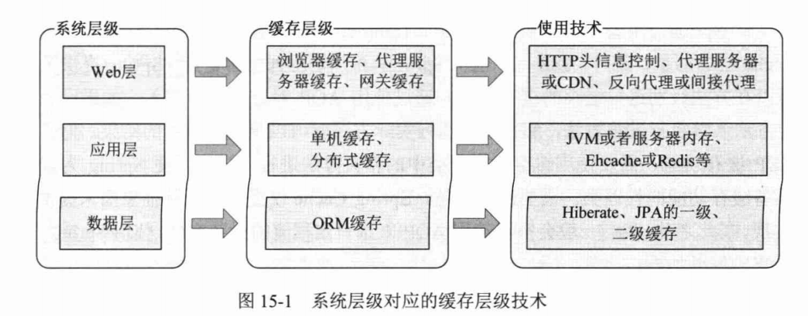

# 第15章 Spring Cache

> 伴随着信息量的爆炸式增长，以及构建的应用系统越来越多样化、复杂化，特别是伴随着近年来企业级应用互联网的趋势，缓存（Cache）对应用程序性能的优化变得越来越重要。将所需服务请求的数据放到缓存中，既可以提高应用程序的访问效率，又可以减少数据库服务器的压力，从而让用户获得更为极致的体验。
>
> Spring开发者正是因为看到了缓存在应用中的重要地位，从Spring 3.1开始，就以一贯的优雅风格提供了一种透明的缓存解决方案，这使得Spring可以在后台使用不同的缓存框架（如EhCache、GemFire、HazelCast和Guava）时保持编程的一致性。而从Spring 4.0开始则全面支持JSR-107 annotations和自定义的缓存标签。

**本章主要内容：**

* 了解缓存的基本概念
* Spring对Cache的支持
* 自定义Cache注解的使用
* 与企业级缓存的基础

**本章亮点：**

* 比较详细地介绍了Cache在系统中的使用场景和方式
* 在实际应用中开发缓存程序的实战经验

## 15.1 缓存概述

### 15.1.1 缓存的概念

缓存作为系统架构中提升性能的一种重要支撑技术，在企业级应用中的地位越来越突显。缓存技术日新月异，可选的缓存套件也琳琅满目，让人应接不暇。本节不急于介绍Spring Cache的相关知识，而是先介绍缓存的一些基本概念，再引出Sping Cache，以求先知“庐山真面目”，再从Spring的角度“一览众山小”。

所以可将缓存定义为一种存储机制，它将数据保存在某个地方，并以一种更快的方式提供服务。较为常见的一种情况是在应用中使用缓存机制，以避免方法的多次执行，从而克服性能缺陷，也可减少应用服务器或者数据库的压力。缓存的策略有很多种，在应用系统中可根据实际情况选择，通常会把一些静态数据或者变化频率不高的数据放到缓存中，如配置参数、字典表等。而有些场景可能要寻求替代方案，比如，想提升全文检索的速度，在复杂的场景下建议使用搜索引擎，如Solr或ElasticSearch。

通常在Web应用开发中，不同层级对应的缓存要求和缓存策略全然不同。如图15-1所示列举了系统不同层级对应的缓存技术选型。



使用Spring Cache带来的好处如下：

* 支持开箱即用（Out-Of-The-Box），并提供基本的Cache抽象，方便切换各种底层Cache。
* 类似于Spring提供的数据库事务管理，通过Cache注解即可实现缓存逻辑透明化，让开发者关注业务逻辑。
* 当事务回滚时，缓存也会自动回滚。
* 支持比较复杂的缓存逻辑。
* 提供缓存编程的一致性抽象，方便代码维护。

> **提示**
>
> Java缓存规范JCache API（JSR-107）对Java对象缓存进行了标准化，方便高效开发，让程序员摆脱了实现缓存有效期、互斥、假脱机（Spooling）和缓存一致性等负担。该规范提供了API，RI（参考实现）和TCK（技术兼容性套件）。

需要注意的是，Spring Cache并不针对多进程的应用环境进行专门的处理，也就是说，当应用程序处于分布式或者集群环境下时，需要针对具体的缓存进行相应的配置，如EhCache可以通过RMI、JGroups及EhCache Server等方式来配置其多播集群环境。另外，在Spring Cache抽象的操作中没有锁的概念，当多线程并发操作（更新或者删除）同一缓存项时，将可能得到过期的数据。有些缓存实现提供了锁的功能，如果需要考虑如上场景，则可以详细了解具体缓存的一些相关特性，如EhCache就提供了针对缓存元素key的Read（读）、Write（写）锁。

### 15.1.2 使用Spring Cache

```java
package com.smart.cache.domain;

import java.io.Serializable;

/**
 * User
 *
 * @author shenhuanjie
 * @date 2019/6/21 10:22
 */
public class User implements Serializable {
    private String userId;
    private String userName;
    private int age;

    public User(String userId) {
        this.userId = userId;
    }

    public String getUserId() {
        return userId;
    }

    public void setUserId(String userId) {
        this.userId = userId;
    }

    public String getUserName() {
        return userName;
    }

    public void setUserName(String userName) {
        this.userName = userName;
    }

    public int getAge() {
        return age;
    }

    public void setAge(int age) {
        this.age = age;
    }

    @Override
    public String toString() {
        return "User{" +
                "userId='" + userId + '\'' +
                ", userName='" + userName + '\'' +
                ", age=" + age +
                '}';
    }
}

```

```java
package com.smart.cache.simplecache;


import com.smart.cache.domain.User;
import org.springframework.cache.annotation.Cacheable;
import org.springframework.stereotype.Service;

/**
 * UserService
 *
 * @author shenhuanjie
 * @date 2019/6/21 10:37
 */
@Service(value = "userServiceBean")
public class UserService {
    @Cacheable(cacheNames = "users")
    public User getUserById(String userId) {
        System.out.println("real query user." + userId);
        return getFromDB(userId);
    }

    private User getFromDB(String userId) {
        System.out.println("real querying db..." + userId);
        return new User(userId);
    }
}

```

```xml
<?xml version="1.0" encoding="UTF-8"?>
<beans xmlns="http://www.springframework.org/schema/beans"
       xmlns:xsi="http://www.w3.org/2001/XMLSchema-instance" xmlns:cache="http://www.springframework.org/schema/cache"
       xmlns:p="http://www.springframework.org/schema/p"
       xsi:schemaLocation="http://www.springframework.org/schema/beans http://www.springframework.org/schema/beans/spring-beans.xsd http://www.springframework.org/schema/cache http://www.springframework.org/schema/cache/spring-cache.xsd">
    <cache:annotation-driven/>
    <bean id="userServiceBean" class="com.smart.cache.simplecache.UserService"/>
    <bean id="cacheManager"
          class="org.springframework.cache.support.SimpleCacheManager">
        <property name="caches">
            <set>
                <bean class="org.springframework.cache.concurrent.ConcurrentMapCacheFactoryBean" p:name="default"/>
                <bean class="org.springframework.cache.concurrent.ConcurrentMapCacheFactoryBean" p:name="users"/>
            </set>
        </property>
    </bean>
</beans>
```

可以看出，我们配置的基于注解的缓存起作用了，而在UserService的代码中没有看到任何缓存逻辑代码，只需一个注解@Cacheable(cacheNames="users")，就实现了基本的缓存方案，代码变得非常优雅、简洁。事实上，使用Spring Cache非常简单，开发人员只需完成两个步骤。

* 缓存定义：确定需要缓存的方法和缓存策略。
* 缓存配置：配置缓存。

接下来我们将深入了解Spring Cache，以探究其中的奥秘。

## 15.2 掌握Spring Cache抽象

### 1.5.2.1 缓存注解

### 15.2.2 缓存管理器

CacheManager是SPI（Service Provider Interface，服务提供程序接口），提供了访问缓存名称和缓存对象的方法，同时提供了管理缓存、操作缓存和移除缓存的方法。

### 15.2.3 使用SpEL表达式

### 15.2.4 基于XML的Cache声明

### 15.2.5 以编程方式初始化缓存

### 15.2.6 自定义缓存注解

## 15.3 配置Cache存储

在企业级应用中往往会有更复杂的功能和性能需求，所以在日常开发过程中，大部分情况下会使用第三方的缓存实现，而不是SimpleCacheManager的简单实现。在企业级Java领域，Spring缓存提供了与不同缓存框架的集成支持。

## 15.4 实战经验

## 15.5 小结

本章介绍了缓存的基本概念，以及Spring通过其缓存抽象所提供的相关功能。同时介绍了5个可用缓存数据或者从缓存中移除数据的重要注解（@Cacheable、@CacheEvict、@CachePut、@Caching、@CacheConfig）。此外还介绍了采用XML声明式和注解式两种方式来使用Spring Cache。列举了可抽象使用的不同缓存管理器，同时通过SpEL示例强调了定义缓存存储时表达式的重要性。

我们还学习了在应用程序启动期间自动初始化缓存，而这恰恰是企业应用程序中常见的用例。最后一节列举了主流的缓存程序实现，如EhCache、Guava和HazelCast、GemFire、JSR-107，并详细介绍了它们与Spring Cache如何集成。最后笔者总结了在实际项目中常见的一些问题，并加以分析。本章对Spring Cache的源码和原理也有一定的分析，相信读者在理解之后，也能基于Spring Cache抽象定制出符合自己应用的缓存方案。