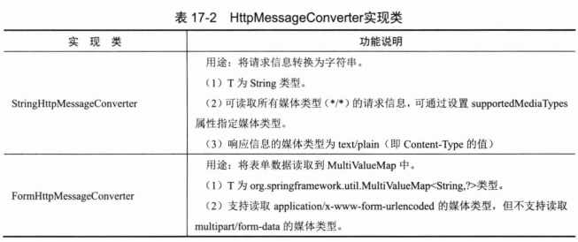
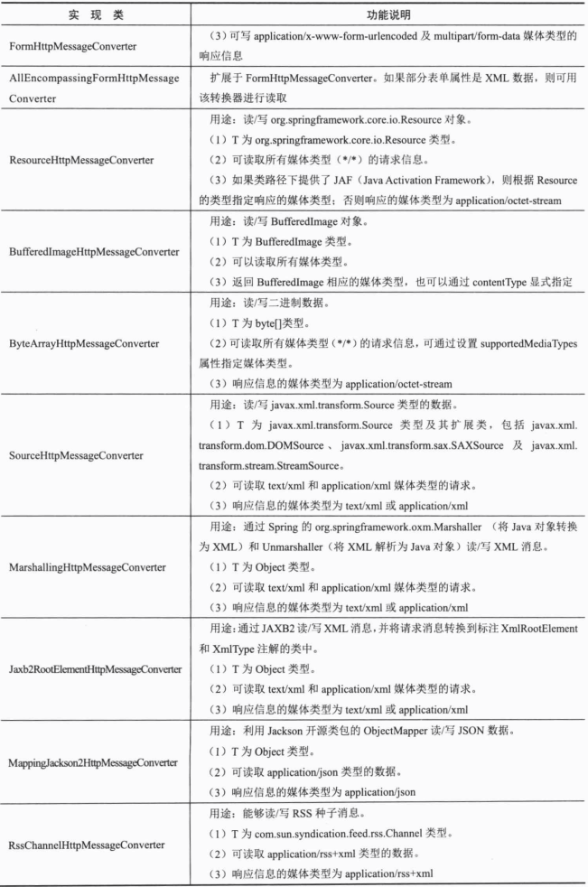
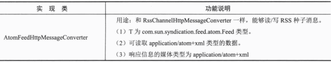
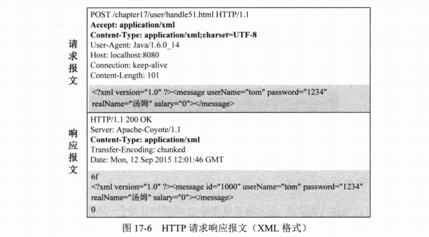
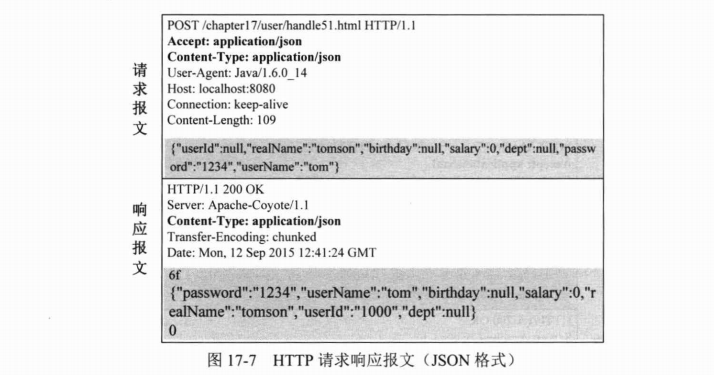
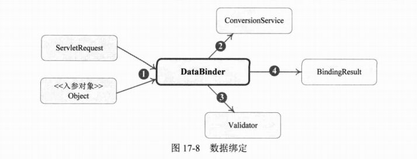
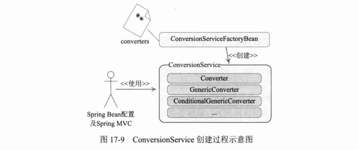

# 第17章 Spring MVC

> 大部分Java应用都是Web应用，展现层是Web应用不可忽略的重要环节。Spring为展现层提供了一个优秀的Web框架——Spring MVC。和众多其他的Web框架一样，它基于MVC的设计理念。此外，它采用了松散耦合、可插拔的组件结构，比其他的MVC框架更具扩展性和灵活性。Spring MVC通过一套MVC注解，让POJO成为处理请求的控制器，无须实现任何接口。同时，Spring MVC还支持REST风格的URL请求：注解驱动及RESt风格的Spring MVC是Spring的出色功能之一。此外，Spring MVC在数据绑定、视图解析、本地化处理及静态资源处理上都有许多不俗的表现。它在框架设计、扩展性、灵活性等方面全面超越了Struts、WebWork等MVC框架，从原来的追赶者一跃成为MVC的领跑者。

**本章主要内容：**

* Spring MVC体系概述
* 注解驱动的控制器
* 数据绑定、输入/输出格式化及数据校验
* 视图解析
* 本地化解析
* 文件上传
* WebSocket支持
* 静态资源处理、请求拦截器、异常处理

**本章亮点：**

* 深入分析并图解Spring MVC体系结构
* 对处理方法入参绑定及视图解析进行详细分析

## 17.1 Spring MVC体系概述

Spring MVC框架围绕DispatcherServlet这个核心展开，DispatcherServlet是Spring MVC的总导演、总策划，它负责截获请求并将其分派给相应的处理器处理。Spring MVC框架包括注解驱动控制器、请求及响应的信息处理、视图解析、本地化解析、上传文件解析、异常处理及表单标签绑定等内容。

### 17.1.1 体系结构

Spring MVC是基于Model2实现的技术框架，Model 2是经典的MVC（Model、View、Control）模型在Web应用中的变体，这个改变主要源于HTTP协议的无状态新。Model 2的目的和MVC一样，也是利用处理器分离模型、视图和控制，达到不同技术层级间松散耦合的结果，提高系统灵活性、复用性和可维护性。在大多数情况下，可以将Model 2与MVC等同起来。

在利用Model 2之前，把所有的展现逻辑和业务逻辑集中在一起，有时也称这种应用模式为Model 1。Model 1的主要缺点就是紧耦合，复用性差，维护成本高。

由于Spring MVC基于Model 2实现的框架，所以它底层的机制也是MVC，通过图17-1描述Spring MVC的整体架构。


从接收请求到返回响应，Spring MVC框架的众多组件通力配合、各司其职，有条不紊地完成分内的工作。在整个框架中，DispatcherServlet处于核心的位置，它负责协调和组织不同组件以完成请求并返回响应的工作。和大多数Web MVC框架一样，Spring MVC通过一个前端Servlet接收所有的请求，并将具体工作委托给其他组件进行处理，DispatcherServlet就是Spring MVC的前端Servlet。下面对Spring MVC处理请求的整体过程进行讲解。

（1）整个过程始于客户端发出一个HTTP请求，Web应用服务器接收到这个请求。如果匹配DispatcherServlet的请求映射路径（在web.xml中指定），则Web容器将该请求转交给DispatcherServlt处理。

（2）DispatcherServlet接收到这个请求后，将根据请求的信息（包括URL、HTTP方法、请求包文头、请求参数、Cookie等）及HandlerMapping的配置找到处理请求的处理器（Handler）。可见HandlerMapping看作路由控制器，将Handler看作目标主机。值得注意的是，在Spring MVC中并没有定义一个Handler接口，实际上，任何一个Object都可以成为请求处理器。

（3）当DispatcherServlet根据HandlerMapping得到对应当前请求的Handler后，通过HandlerAdapter对Handler进行封装，再以统一的适配器接口调用Handler。HandlerAdapter是Spring MVC的框架级接口，顾名思义，HandlerAdapter是一个适配器，它用统一的接口对各种Handler方法进行调用。

（4）处理器完成业务逻辑的处理后将返回一个ModelAndView给DispatcherServlet，ModelAndView包含了视图逻辑名和模型数据信息。

（5）ModelAndView中包含的是“逻辑视图名”而非真正的视图对象，DispatcherServlet借由ViewResolver完成逻辑视图名到真实视图对象的解析工作。

（6）当得到真实的视图对象View后，DispatcherServlet就使用这个View对象对ModelAndView中的模型数据进行视图渲染。

（7）最终客户端得到的响应消息可能是一个普通的HTML页面，也可能是一个XML或JSON串，甚至是一张图片或一个PDF文档等不同的媒体形式。

以上每个步骤都包含丰富的知识点，本章将逐步揭示每个组件的“庐山真面目”。不过现在请收好所有的好奇心，我们第一步要做的是在web.xml中配置好DispatcherServlet，让Spring MVC的“心脏”跳起来。

### 17.1.2 配置DispatcherServlet

DispatcherServlet是Spring MVC的“灵魂“和”心脏“它负责接收HTTP请求并协调Spring MVC的各个组件完成请求处理的工作。和任何Servlet一样，用户必须在web.xml中配置好DispatcherServlet。我们在第2章中已经配置了一个简单的DispatcherServlet，这里进一步分析其具体的配置。

要了解Spring MVC框架的工作机理，必须回答以下3个问题。

（1）DispatcherServlet框架如何截获特定的HTTP请求并交由Spring  MVC框架处理？

（2）位于Web层的Spring容器（WebApplicationContext）如何与位于业务层的Spring容器（ApplicationContext）建立关联，以使Web层的Bean可以调用业务层的Bean？

（3）如何初始化Spring MVC的各个组件，并将它们装配到DispatcherServlet中？

**1. 配置DispatcherServlet，截获特定的URL请求**

大家知道，我们可以在web.xml中配置一个Servlet，并通过`<servlet-mapping>`指定其处理的URL。这是传统的DispatcherServlet配置方式。而Spring 4.0已全面支持Servlet 3.0，因此也可以采用编程式的配置方式。这里先采用传统的web.xml的方式进行讲解，然后介绍基于Servlet 3.0的新方式。假设我们希望Spring MVC的DispatcherServlet能截获并处理所有以.html结束的URL请求，那么可以在web.xml中按如下方式进行配置，如代码清单17-1所示。

```xml
<?xml version="1.0" encoding="UTF-8"?>
<web-app xmlns="http://xmlns.jcp.org/xml/ns/javaee"
         xmlns:xsi="http://www.w3.org/2001/XMLSchema-instance"
         xsi:schemaLocation="http://xmlns.jcp.org/xml/ns/javaee http://xmlns.jcp.org/xml/ns/javaee/web-app_4_0.xsd"
         version="4.0">
    <!-- ①业务层和持久层的Spring配置文件，这些配置文件被父Spring容器所使用 -->
    <context-param>
        <param-name>contextConfigLocation</param-name>
        <param-value>classpath:/applicationContext.xml</param-value>
    </context-param>
    <listener>
        <listener-class>org.springframework.web.context.ContextLoaderListener</listener-class>
    </listener>

    <!-- ②声明DispatcherServlet -->
    <servlet>
        <servlet-name>smart</servlet-name>
        <servlet-class>org.springframework.web.servlet.DispatcherServlet</servlet-class>
        <load-on-startup>1</load-on-startup>
    </servlet>

    <!-- ③名为DispatcherServlet匹配的URL模式 -->
    <servlet-mapping>
        <servlet-name>smart</servlet-name>
        <url-pattern>.html</url-pattern>
    </servlet-mapping>
</web-app>
```

在①处，通过contextConfigLocation参数指定业务层Spring容器的配置文件（多个配置文件使用逗号分隔）。ContextLoaderListener是一个ServletContextListener，它通过contextConfigLocation参数所指定的Spring配置文件启动“业务层”的Spring容器。

在②处配置了名为smart的DispatcherServlet，它默认自动加载/WEB-INF/smart-servlet.xml（`<servlet-Name>-servlet.xml`）的Spring配置文件，启动Web层的Spring容器。

在③处，通过`<servlet-mapping>`指定DispatcherServlet处理所有以.html为后缀的HTTP请求，即所有带.html后缀的HTTP请求都会被DispatcherServlet截获并处理。

我们知道，多个Spring容器之间可设置为父子级的关系，以实现良好的解耦。在这里，“Web层”Spring容器将作为“业务层“Spring容器的子容器，即”Web层“容器可以引用”业务层“容器的Bean，而”业务层“容器却访问不到”Web层“容器的Bean。需要提醒的是，一个web.xml可以配置多个DispatcherServlet，通过其`<servlet-mapping>`配置，让每个DispatcherServlet处理不同的请求。

DispatcherServlet遵循“契约优于配置”的原则，在大多数情况下，用户无须进行额外的配置，只需按契约行事即可。

如果确实要对DispatcherServlet的默认规则进行调整，则DispatcherServlet是“敞开胸怀”的。下面是常用的一些配置参数，可通过`<servlet>`的`<init-param>`指定。

* namespace：DispatcherServlet对应的命名空间，默认为`<servlet-name>-servlet`，用于构造Spring配置文件的路径。在显式指定该属性后，配置文件对应的路径为`WEB-INF/<namespace>.xml`，而非`WEB-INF/<servlet-name>-servlet.xml`。
* contextConfigLocation：如果DispatcherServlet上下文对应的Spring配置文件有多个，则可以使用该属性按照Spring资源路径的方式制定。如“classpath:sample1.xml，classpath:sample2.xml”，DispatcherServlet将使用类路径下的sample.xml和sample2.xml这两个配置文件初始化WebApplicationContext。
* publishContext：布尔类型属性，默认值为true。DispatcherServlet根据该属性决定是否将WebApplicationContext发布到ServletContext的属性列表中，以便调用者可借由ServletContext找到WebApplicationContext实例，对应的属性名为DispatcherServlet#getServletContextAttributeName()方法的返回值。
* publishEvents：布尔类型的属性。当DispatcherServlet处理完一个请求后，是否需要向容器发布一个ServletRequestHandledEvent事件，默认值为true。如果容器中没有任何事件监听器，则可以将该属性设置为false，以便提高运行性能。

下面的代码显式指定Web层的Spring配置文件。

```xml
<!-- 声明DispatcherServlet -->
<servlet>
    <servlet-name>smart</servlet-name>
    <servlet-class>org.springframework.web.servlet.DispatcherServlet</servlet-class>
    <init-param>
        <param-name>contextConfigLocation</param-name>
        <param-value>WEB-INF/spring/webApplicationContext.xml</param-value>
    </init-param>
    <load-on-startup>1</load-on-startup>
</servlet>
```

之前提到Spring 4.0已全面支持Servlet 3.0，因此，在Servlet 3.0环境中，也可以使用编程的方式来配置Servlet容器。下面的代码可达到和代码清单17-1同样的效果。

```java
package com.smart.web.config;

import org.springframework.web.WebApplicationInitializer;
import org.springframework.web.servlet.DispatcherServlet;

import javax.servlet.ServletContext;
import javax.servlet.ServletException;
import javax.servlet.ServletRegistration;

/**
 * SmartApplicationInitializer
 *
 * @author shenhuanjie
 * @date 2019/6/21 17:39
 */
public class SmartApplicationInitializer implements WebApplicationInitializer {

    @Override
    public void onStartup(ServletContext servletContext) throws ServletException {
        ServletRegistration.Dynamic registration = servletContext.addServlet("dispatcher", new DispatcherServlet());
        registration.setLoadOnStartup(1);
        registration.addMapping("*.html");
    }
}

```

接下来看看Servlet 3.0的实现原理。在Servlet 3.0环境中，容器会在类路径中查找实现javax.setvlet.ServletContainerinitializer的类，如果发现已有实现类，就会调用它来配置Servlet容器。在Spring中，org.springframework.web.SpringServletContainerInitializer类实现了该接口，同时这个类又会查找实现org.springframework.web.WebApplicationInitializer接口的类，并将配置任务交给这些实现类去完成。另外，Spring提供了一个便利的抽象类AbstractAnnotationConfigDispatcherServletInitializer来实现这个接口，使得它在注册DispatcherServlet时只需简单地指定它的Servlet映射即可。在上述示例中，当应用部署到Servlet 3.0容器中时，容器启动时会自动发现它，并使用它来配置Servlet上下文。

**2. 探究DispatcherServlet的内部逻辑**

现在剩下的最后一个问题是：Spring如何将上下文中的Spring MVC组件装配到DispatcherServlet中？通过查看DispatcherServlet的initStrategies()方法的代码，一切真相就大白于天下了。

```java
/**
 * Initialize the strategy objects that this servlet uses.
 * <p>May be overridden in subclasses in order to initialize further strategy objects.
 */
protected void initStrategies(ApplicationContext context) {
    initMultipartResolver(context); //初始化上传文件解析器（直译为多部分请求解析器）
    initLocaleResolver(context); //初始化本地化解析器
    initThemeResolver(context); //初始化主题解析器
    initHandlerMappings(context); //初始化处理器映射器
    initHandlerAdapters(context); //初始化处理器适配器
    initHandlerExceptionResolvers(context); //初始化处理器异常解析器
    initRequestToViewNameTranslator(context); //初始化请求到视图名翻译器
    initViewResolvers(context); //初始化视图解析器
    initFlashMapManager(context);
}
```

initStrategies()方法将在WebApplicationContext初始化后自动执行，此时Spring上下文中的Bean已经初始化完毕。该方法的工作原理是：通过反射机制查找并装配Spring容器中用户显式自定义的组件Bean，如果找不到，则装配默认的组件实例。

Spring MVC定义了一套默认的组件实现类，也就是说，即使在Spring容器中没有显式定义组件Bean，DispatcherServlet也会装配好一套可用的默认组件。在spring-webmvc-4.x.jar包的org/springframework/web/servlet类路径下拥有一个DispatcherServlet.properties配置文件，该文件制定了DispatcherServlet所使用的默认组件。

```java
## 本地化解析器
org.springframework.web.servlet.LocalResolver=org.springframework.web.servlet.i18n.AcceptHeaderLocalResolver

## 主题解析器
org.springframework.web.servlet.ThemeResolver=org.springframework.web.servlet.theme.FixedThemeResolver

## 处理器映射（共2个）
org.springframework.web.servlet.HandleMapping=org.springframework.web.servlet.handler.BeanNameUrlHandlerMapping,org.springframework.web.servlet.mvc.annotation.DefaultAnnotationHandlerMapping

## 处理器适配器（共3个）
org.springframework.web.servlet.HandlerAdapter=org.springframework.web.servlet.mvc.HttpRequestHandlerAdapter,org.springframework.web.servlet.mvc.SimpleControllerHandlerAdapter,org.springframework.web.servlet.mvc.method.annotation.RequestMappingHandleAdapter

## 异常处理器（共3个）
org.springframework.web.servlet.HandlerExceptionResolver=org.springframework.web.servlet.mvc.annotation.AnnotationMethodHandlerExceptionResolver,org.springframework.web.servlet.mvc.annotation.ResponseStatusExceptionResolver,org.springframework.web.servlet.mvc.support.DefaultHandlerExceptionResolver

## 视图名称翻译器
org.springframework.web.servlet.RequestToViewNameTranslator=org.springframework.web.servlet.view.DefaultRequestToViewNameTranslator

## 视图解析器
org.springframework.web.servlet.ViewResolver=org.springframework.web.servlet.view.InternalResourceViewResolver
```

如果用户希望采用非默认类型的组件，则只需在Spring配置文件中配置自定义的组件Bean即可。Spring MVC一旦发现上下文中有用户自定义的组件，就不会使用默认的组件。下面通过表17-1进一步了解DispatcherServlet装配每种组件的过程。


有些组件最多允许存在一个实例，如MultipartResolver、LocaleResolver等，在表17-1中使用★进行标注。同一类型的组件如果存在多个，那么它们之间的优先级顺序如何确定呢？这些组件都实现了org.springframework.core.Ordered接口，可通过order属性确定优先级顺序，值越小优先级越高。

简言之，当DispatcherServlet初始化后，就会自动扫描上下文的Bean，根据名称或类型匹配的机制查找自定义的组件，找不到时则使用DispatcherServlet.properties定义的默认组件。

### 17.1.3 一个简单的实例

在学习了Spring MVC框架的整体结构后，下面通过一个简单的实例讲解Spring MVC开发的基本过程。Spring MVC应用开发一般包括以下几个步骤。

（1）配置web.xml，指定业务层对应的Spring配置文件，定义DispatcherServlet。

（2）编写处理请求的控制器（处理器）

（3）编写视图对象，这里使用JSP作为视图。

（4）配置Spring MVC的配置文件，使控制器、视图解析器等生效。

17.1.2节已经详细讲解了如何在web.xml中配置Spring业务层容器及定义DispatcherServlet的知识，所以这里直接从第（2）步开始。

**1. 编写处理请求的控制器**

Spring MVC通过@Controller注解即可将一个POJO转化为处理请求的控制器，通过@RequestMapping为控制器指定处理哪些URL的请求。UserController是一个负责用户处理的控制器，其代码如代码清单17-2所示。

```java
package com.smart.web;

import org.springframework.stereotype.Controller;
import org.springframework.web.bind.annotation.RequestMapping;

/**
 * UserController
 *
 * @author shenhuanjie
 * @date 2019/6/22 11:47
 */
@Controller // 使UserController成为处理请求的控制器
@RequestMapping("/user") // 处理来自/user URI的请求
public class UserController {

    @RequestMapping("/register") // 返回一个String类型的逻辑视图名
    public String register() {
        return "user/register";
    }
}

```

首先使用@Controller对UserController类进行标注，使其成为一个可处理HTTP请求的控制器。然后使用@RequestMapping对UserController及其register()方法进行标注，确定register()对应的请求URL。

在UserController类定义处标注的@RequestMapping限定了UserController类处理所有URL为/user的请求，它相对于Web容器部署根路径。UserController类可以定义多个处理方法，处理来自/user URI的请求。假设Web容器的部署根路径为/chapter17，则代码清单17-2中的register()方法将处理所有来自/chapter17/user/register.html的请求。值得说明的是，②处类级的@RequestMapping不是必需的，可以直接在方法中标注@RequestMapping，此时，方法处@RequestMapping指定的URI则是相对于部署根路径的。

register()方法返回一个字符串user/register，它代表一个逻辑视图名，将由视图解析器解析为一个具体的视图对象。本例中，它将映射为/WEB-INF/views/user/register.jsp。稍后，读者将了解如何装配完成这一任务的视图解析器。

**2. 编写视图对象**

我们使用一个register.jsp作为用户的注册页面，UserController#register()方法处理完成后，将转向这个register.jsp页面，如代码清单17-3所示。

```jsp
<%--
  Created by IntelliJ IDEA.
  User: shenhuanjie
  Date: 2019/6/22
  Time: 12:00
  To change this template use File | Settings | File Templates.
--%>
<%@ page contentType="text/html;charset=UTF-8" language="java" %>
<%@taglib uri="http://java.sun.com/jsp/jstl/core" prefix="c" %>
<html>
<head>
    <title>新增用户</title>
</head>
<body>
<from method="post" action="<c:url value="/user.html"/>">
    <table>
        <tr>
            <td>用户名：</td>
            <td><input type="text" name="userName"/></td>
        </tr>
        <tr>
            <td>密码：</td>
            <td><input type="password" name="password"/></td>
        </tr>
        <tr>
            <td>姓名</td>
            <td><input type="text" name="realName"/></td>
        </tr>
        <tr>
            <td colspan="2"><input type="submit" name="提交"/></td>
        </tr>
    </table>
</from>
</body>
</html>

```

register.jsp很简单，它包括了一个表单，单击“提交”按钮后，表单提交到/user.html进行处理。UserController添加了一个createUser()方法用于处理表单提交的请求，如代码清单17-4所示。

```java
package com.smart.web;

import com.smart.domain.User;
import com.smart.service.UserService;
import org.springframework.beans.factory.annotation.Autowired;
import org.springframework.stereotype.Controller;
import org.springframework.web.bind.annotation.RequestMapping;
import org.springframework.web.bind.annotation.RequestMethod;
import org.springframework.web.servlet.ModelAndView;

/**
 * UserController
 *
 * @author shenhuanjie
 * @date 2019/6/22 11:47
 */
@Controller // 使UserController成为处理请求的控制器
@RequestMapping("/user") // 处理来自/user URI的请求
public class UserController {
    @Autowired
    private UserService userService;//注入业务层的Bean

    /**
     * 处理/user的请求，不过请求的方法必须为POST
     *
     * @param user
     * @return
     */
    @RequestMapping(method = RequestMethod.POST)
    public ModelAndView createUser(User user) {
        // 将表单值映射到User对象中，调用UserService保存user，返回ModelAndView
        userService.createUser(user);
        ModelAndView mav = new ModelAndView();
        mav.setViewName("user/createSuccess");
        mav.addObject("user", user);
        return mav;
    }

    @RequestMapping("/register") // 返回一个String类型的逻辑视图名
    public String register() {
        return "user/register";
    }
}
```

createUser()方法处的@RequestMapping注解让createUser()处理URI为/user.html且请求方法为POST的请求。Spring MVC自动将表单中的数据按参数名和User属性匹配的方式进行绑定，将参数值填充到User的相应属性中。调用业务层的UserService进行业务处理，进而返回ModelAndView对象，逻辑视图名为user/createSuccess，user作为模型数据暴露给视图对象。

User对象的代码如代码清单17-5所示。

```java
package com.smart.domain;

/**
 * User
 *
 * @author shenhuanjie
 * @date 2019/6/22 12:14
 */
public class User {
    private String userId;
    private String userName;
    private String realName;

    public void setUserId(String userId) {
        this.userId = userId;
    }

    public String getUserId() {
        return userId;
    }

    public void setUserName(String userName) {
        this.userName = userName;
    }

    public String getUserName() {
        return userName;
    }

    public String getRealName() {
        return realName;
    }

    public void setRealName(String realName) {
        this.realName = realName;
    }
}

```

注意到User中的参数名和代码清单17-3中的表单组件是相同的，这样Spring MVC即可将表单组件填充到User的相应属性中。

视图解析器将user/createSuccess解析为/WEB-INF/views/user/createSuccess.jsp的视图对象，createSuccess.jsp可以访问到模型中的数据。createSuccess.jsp页面代码如代码清单17-6所示。

```jsp
<%@ page contentType="text/html;charset=UTF-8" language="java" %>
<html>
    <head>
        <title>用户创建成功</title>
    </head>
    <body>
    	恭喜，用户${user.userName}创建成功。
    </body>
</html>

```

由于UserController#createUser()通过@ModelAttribute("user")将User对象放到模型中，所以createSuccess.jsp可以通过${user.userName}访问模型中的数据。

**3. 配置Spring MVC的配置文件**

要使以上实例正常工作，需要在Spring MVC配置文件中进行简单的配置，如代码清单17-7所示。

```xml
<?xml version="1.0" encoding="UTF-8"?>
<beans xmlns="http://www.springframework.org/schema/beans"
       xmlns:xsi="http://www.w3.org/2001/XMLSchema-instance"
       xmlns:context="http://www.springframework.org/schema/context" xmlns:p="http://www.springframework.org/schema/p"
       xsi:schemaLocation="http://www.springframework.org/schema/beans http://www.springframework.org/schema/beans/spring-beans.xsd http://www.springframework.org/schema/context http://www.springframework.org/schema/context/spring-context.xsd">
    <context:component-scan base-package="com.smart.web"/>
    <bean class="org.springframework.web.servlet.view.InternalResourceViewResolver"
          p:prefix="/WEB-INF/views/"
          p:suffix=".jsp"/>
</beans>
```

在①处通过`<context:component-scan>`使Spring扫描com.smart.web包下所有的类，让标注Spring注解的类生效。而在②处定义了一个视图名称解析器，将视图逻辑名解析为`/WEB-INF/views/<viewName>.jsp`的视图对象，如图17-2所示。


**4. 运行用户注册模块**

将用户模块部署到Web服务器中，Web服务器服务端口为8080，部署根路径为/chapter17，通过http://localhost:8080/chapter17/user/register.html即可访问用户注册页面。填写用户注册信息，单击“提交”按钮将表单提交到http:localhost:8080/chapter17/user.html地址中，UserController控制器的createUser()方法响应这个请求，并导向createSuccess.jsp页面中。

对于用户注册表单提交直到返回响应这一过程，用事务对象对组件接口进行替换，得到如图17-3所示的交互图。


再简要描述一下Spring MVC处理/user.html的整个过程。

① DispatcherServlet接收到客户端的/user.html请求。

② DispatcherServlet使用DefaultAnnotationHandlerMapping查找负责处理该请求的处理器。

③ DispatcherServlet将请求分发给名为/user.html的UserController处理器。

④ 处理器完成业务处理后，返回ModelAndView对象，其中View的逻辑名为/user/createSuccess，而模型包含一个键为user的User对象。

⑤ DispatcherServlet调用InternalResourceViewResolver组件对ModelAndView中的逻辑视图名进行解析，得到真实的/WEB-INF/view/user/createSuccess.jsp视图对象。

⑥ DispatcherServlet使用/WEB-INF/view/user/createSuccess.jsp对模型中的user模型对象进行渲染。

⑦ 返回响应页面给客户端。

通过这个例子，我们了解了开发一个Spring MVC应用所需经历的大体过程。这个例子太过简单，每个步骤都是最简的实现。在本章的后续章节中，我们将对以上各个步骤进行深入分析。

## 17.2 注解驱动的控制器

### 17.2.1 使用@RequestMappig映射请求

在POJO类定义处标注@Controller，再通过`<context:component-scan/>`扫描相应的类包，即可使POJO成为一个能处理HTTP请求的控制器。

用户可以创建数量不限的控制器，分别处理不同的业务请求，如LogonController、UserController、ForumController等。每个控制器可拥有多个处理请求的方法，每个方法负责不同的请求操作。如何将请求映射到对应的控制器方法中是Spring MVC框架的重要任务之一，这项任务由@RequestMapping承担。

在控制器的类定义及方法定义处都可以标注@RequestMapping，类定义处的@RequestMapping提供初步的请求映射信息，方法定义处的@RequestMapping提供进一步的细分映射信息。DispatcherServlet截获请求后，就通过控制器上的@RequestMapping提供的映射信息确定请求所对应的处理方法。

将请求映射到控制器处理方法的工作包含一系列映射规则，这些规则是根据请求中的各种信息指定的，具体包括请求URL、请求参数、请求方法、请求头这4个方面的信息项。

**1. 通过请求URL进行映射**

@RequestMapping使用value值指定请求的URL，如@RequestMapping("/user")、@RequestMapping("/register")等。需要注意的是，@RequestMapping在类定义处指定的URL相对于Web应用的部署路径，而在方法定义处指定的URL则相对于类定义处指定的URL。如果在类定义处未标注@RequestMapping，则仅在处理方法处标注@RequestMapping，此时，方法处指定的URL则相对于Web应用的部署路径，如代码清单17-8所示。

```java
package com.smart.web;

import com.smart.domain.User;
import com.smart.service.UserService;
import org.springframework.beans.factory.annotation.Autowired;
import org.springframework.stereotype.Controller;
import org.springframework.web.bind.annotation.ModelAttribute;
import org.springframework.web.bind.annotation.RequestMapping;

/**
 * UserController
 *
 * @author shenhuanjie
 * @date 2019/6/22 11:47
 */
@Controller // 使UserController成为处理请求的控制器
public class UserController {
    @Autowired
    private UserService userService;//注入业务层的Bean

    /**
     * 处理/user的请求，不过请求的方法必须为POST
     *
     * @param user
     * @return
     */
    @RequestMapping(path = "/user/createUser")
    public String createUser(@ModelAttribute("user") User user) {
        return "user/createSuccess";
    }

    public String register(@ModelAttribute("user") User user) {
        return "user/register";
    }
}

```

这样，/user/register.html请求将由register()方法处理，而/user/createUser.html请求将由createUser()方法处理。注意，它们都相对于Web应用的部署路径。

同一控制器的多个处理方法负责处理相同业务模块的不同操作，但凡设计合理的Web应用都会将这些操作请求安排在某一相同的URL之下。所以除非特别的原因，建议不要舍弃类定义处的@RequestMapping。

@RequestMapping不但支持标准的URL，还支持Ant风格（？、*和**字符，常见4.3.2节）的和带{xxx}占位符的URL。以下URL都是合法的。

* /user/*/createUser：匹配/user/aaa/createUser、/user/bbb/createUser等URL。
* /user/**/createUser：匹配/user/createUser、/user/aa/bb/createUser等URL。
* /user/createUser??：匹配/user/createUseraa、/user/createUserbb等URL。
* /user/{userId}：匹配user/123、user/456等URL。
* /user/**/{userId}：匹配user/aaa/bbb/123、user/aaa/456等URL。
* company/{companyId}/user/{userId}/detail：匹配company/123/user/456/detail等URL。

通过@PathVariable可以将URL中的占位符参数绑定到控制器处理方法的入参中，如代码清单17-9所示。

```java
package com.smart.web;

import com.smart.service.UserService;
import org.springframework.beans.factory.annotation.Autowired;
import org.springframework.stereotype.Controller;
import org.springframework.web.bind.annotation.PathVariable;
import org.springframework.web.bind.annotation.RequestMapping;
import org.springframework.web.servlet.ModelAndView;

/**
 * UserController
 *
 * @author shenhuanjie
 * @date 2019/6/22 11:47
 */
@Controller // 使UserController成为处理请求的控制器
public class UserController {
    @Autowired
    UserService userService;

    @RequestMapping("/{userId}")
    public ModelAndView showDetail(@PathVariable("userId") String userId) {
        ModelAndView modelAndView = new ModelAndView();
        modelAndView.setViewName("user/showDetail");
        modelAndView.addObject("user", userService.getUserById(userId));
        return modelAndView;
    }
}

```

URL中的{xxx}占位符可以通过@PathVariable("xxx")绑定到操作方法的入参中。类定位处@RequestMapping的URL如果使用占位符的参数，则也可以绑定到处理方法的入参中，如代码清单17-10所示。

```java
package com.smart.web;

import org.springframework.stereotype.Controller;
import org.springframework.ui.Model;
import org.springframework.web.bind.annotation.PathVariable;
import org.springframework.web.bind.annotation.RequestMapping;

/**
 * RelativePathUriTemplateController
 *
 * @author shenhuanjie
 * @date 2019/6/22 20:12
 */
@Controller
@RequestMapping("/owners/{ownerId")
public class RelativePathUriTemplateController {
    
    @RequestMapping("/pets/{petId}")
    public void findPet(@PathVariable String ownerId, @PathVariable String petId, Model model) {
        ...
    }
}

```

在默认情况下，Java类的发射对象并未包含方法入参的名称，在Java 8.0中可以通过javac-parameters生成方法入参的元数据信息，在低版本的Java中则可以通过javac -g打开生成所有调试信息的开发，这样也会包含方法入参名的元数据信息。所以要使代码清单17-10中的findPet()入参成功绑定URL中的占位符参数，必须保证在编译时输出方法名元信息。在Maven中可以显式配置maven-compiler-plugin编译插件，开启编译输出调试信息的开关。

```xml
<plugins>
    <plugin>
        <artifactId>maven-compiler-plugin</artifactId>
        <version>${maven-compiler-plugin.version}</version>
        <configuration>
            <source>${maven.compiler.target}</source>
            <target>${maven.compiler.source}</target>
            <encoding>${maven.compiler.encoding}</encoding>
            <debug>true</debug>
        </configuration>
    </plugin>
</plugins>
```

不过编译时打开debug开关会使目标类变大，对运行效率也有一定的负面影响。正式编译部署时往往将此开关取消，所以最好在@PathVariable中显示指定绑定的参数名，以避免因编译方式不同造成参数绑定失败的隐患。

**2. 通过请求参数、请求方法或请求头进行映射**

HTTP请求报文除URL外，还拥有其他众多的信息。以下是一个标准的HTTP请求报文，如图17-4所示。


① 是请求方法，GET和POST是最常见的HTTP方法，除此以外还包括DELETE、HEAD、OPTIONS、PUT、TRACE。不过，当前的大多数浏览器只支持GET和POST，Spring提供了一个HiddenHttpMethodFilter，允许通过`_method`表单参数指定这些特殊的HTTP方法（实际上还是通过POST提交表单）。服务器端配置了HiddenHttpMethodFilter后，Spring会根据`_method`参数指定的值模拟出相应的HTTP方法，这样就可以使用这些HTTP方法对处理方法进行映射了。

② 是请求对应的URL地址，它和报文头的Host属性组成完整的请求URL。

③ 是协议名称及版本号。

④ 是HTTP的报文头，报文头包括若干个属性，格式为“属性名：属性值”，服务器端据此获取客户端的信息。

⑤ 是报文体，它将一个页面表单中的组件值通过param1=value1&param2=value2的键值对形式编码成一个格式串，它承载多个请求参数的数据。不但报文体可以传递请求参数，请求URL也可以通过类似于/chapter17/user.html?param1=value1&param2=value2的方式传递请求参数。

> **实战经验：**
>
> HttpWatch是强大的网页数据分析工具，安装后将集成到Internet Explorer工具栏中。它无须代理服务器或一些复杂的网络监控工具，就能抓取请求及响应的完整信息，包括Cookies、消息头、查询参数、响应报文等，是Web应用开发人员的必备工具。笔者有篇网文对HTTP有较全面的介绍，地址为http://www.iteye.com/topic/1124408，欢迎阅读。

@RequestMapping除了可以使用请求URL映射请求外，还可以使用请求方法、请求头参数及请求参数（报文体和URL包含的请求参数）映射请求，如代码清单17-11所示。

```java
package com.smart.web;

import org.springframework.stereotype.Controller;
import org.springframework.web.bind.annotation.RequestMapping;
import org.springframework.web.bind.annotation.RequestMethod;
import org.springframework.web.bind.annotation.RequestParam;

/**
 * UserController
 *
 * @author shenhuanjie
 * @date 2019/6/22 11:47
 */
@Controller
@RequestMapping("/user")
public class UserController {

    /**
     * 使用请求方法及请求参数映射请求
     *
     * @param userId
     * @return
     */
    @RequestMapping(path = "/delete", method = RequestMethod.POST, params = "userId")
    public String test1(@RequestParam("userId") String userId) {
        return "/user/test1";
    }

    /**
     * 使用报文头映射请求
     *
     * @param userID
     * @return
     */
    @RequestMapping(path = "/show", headers = "content-type=test/*")
    public String test2(@RequestParam("userId") String userID) {
        return "/user/test2";
    }
}

```

@RequestMapping的value、method、params及headers分别表示请求URL、请求方法、请求参数及报文头的映射条件，它们之间是与的关系，联合使用多个条件项可让请求映射更加精确化。

params和headers分别通过请求参数及报文头属性进行映射，它们支持简单的映射表达式。下面以params表达式为例进行说明，headers可以参照params来理解。

* “param1”：表示请求须包含名为param1的请求参数。

* “!param1”：表示请求不能包含名为param1的请求参数。

* "param1!=value1"：表示请求包含名为param1的请求参数，当其值不能为value1。

* {”param1=value1“，”param2“}：表示请求必须包含名为param1和param2的两个请求参数，且param1参数的值必须为value1。

### 17.2.2 请求处理方法签名

@RequestMapping像一个迎宾，将HTTP请求正确地迎接到主人的面前（负责处理该请求的方法）；主人起身相迎，进而与HTTP请求交杯换盏、把酒言欢；最后在欢声笑语中送走HTTP请求（返回响应）。Spring MVC通过分析处理方法的签名，将HTTP请求信息绑定到处理方法的相应入参中，然后再调用处理方法得到返回值，最后对返回值进行处理并返回响应。

Spring MVC对控制器处理方法签名的限制是很宽松的，用户几乎可以按自己喜欢的方式进行方法签名。在必要时对方法及方法入参标注相应的注解（如@PathVariable、@RequestParam、@RequestHeader等）即可，Spring MVC会优雅地完成剩下的工作：将HTTP请求的信息绑定到相应的方法入参中，并根据方法返回值类型做出相应的后续处理。

一般情况下，处理方法的返回值类型为ModelAndView或S他日你个，前者包含模型和逻辑视图名，而后者仅代表一个逻辑视图名。下面来看看几个典型的方法签名，如代码清单17-12所示。

```java
package com.smart.web;

import com.smart.domain.User;
import org.springframework.stereotype.Controller;
import org.springframework.web.bind.annotation.CookieValue;
import org.springframework.web.bind.annotation.RequestHeader;
import org.springframework.web.bind.annotation.RequestMapping;
import org.springframework.web.bind.annotation.RequestParam;
import org.springframework.web.servlet.ModelAndView;

import javax.servlet.http.HttpServletRequest;

/**
 * HandleController
 *
 * @author shenhuanjie
 * @date 2019/6/23 11:57
 */
@Controller
@RequestMapping("/handle")
public class HandleController {
    /**
     * 请求参数按名称匹配的方式绑定到方法入参中，方法返回的字符串代表逻辑视图名
     *
     * @param userName
     * @param password
     * @param realName
     * @return
     */
    @RequestMapping(path = "/handle1")
    public String handle1(@RequestParam("userName") String userName,
                          @RequestParam("password") String password,
                          @RequestParam("realName") String realName) {
        return "success";
    }

    /**
     * 将Cookie值及报文头属性绑定到入参中，方法返回ModelAndView
     *
     * @param sessionId
     * @param acceptLanguage
     * @return
     */
    @RequestMapping(path = "/handle2")
    public ModelAndView handle2(@CookieValue("JSESSIONID") String sessionId,
                                @RequestHeader("Accept-Language") String acceptLanguage) {
        ModelAndView mav = new ModelAndView();
        mav.setViewName("success");
        mav.addObject("user", new User());
        return mav;
    }

    /**
     * 请求参数按名称匹配的方式绑定到user的属性中，方法返回的字符串代表逻辑视图名
     *
     * @param user
     * @return
     */
    @RequestMapping(path = "/handle3")
    public String handle3(User user) {
        return "success";
    }

    /**
     * 直接将HTTP请求对象传递给处理方法，方法返回的字符串代表逻辑视图名
     *
     * @param request
     * @return
     */
    @RequestMapping(path = "/handle4")
    public String handle4(HttpServletRequest request) {
        return "success";
    }
}

```

从代码清单17-12中可以发现，Spring MVC会结合方法入参类型、入参的注解、返回值的类型，按照“契约”进行相应的处理。

### 17.2.3 使用矩阵变量绑定参数

RFC3986定义了在URI中包含name-value的规范。随之在Spring MVC 3.2中出现了@MatrixVariable注解，该注解的出现使得开发人员能够将请求中的矩阵变量（Matrix Variable）绑定到处理器的方法参数中。而Spring 4.0更全面地支持这个规范，这也是Spring 4.0众多吸引人的新特性之一。接下来我们就一起来了解这个新特性的使用方式。

在Matrix Variable中，多个变量可以使用“；”（分号）分隔，例如：

```xml
/books;author=Tom;year=2016
```

如果一个变量对应对个值，那么可以使用“，”（逗号）分隔，例如：

```xml
author=smart1,smart2,smart3
```

或者使用重复的变量名，例如：

```xml
author=smart1;author=smart2;author=smart3
```

下面举一个例子来说明，代码如下：

```java
/**
 * GET /books/22;a=11;b=22
 *
 * @param bookId
 * @param a
 */
@RequestMapping(value = "/books/{bookId}", method = RequestMethod.GET)
public void findBookId(@PathVariable String bookId, @MatrixVariable int a) {
    ...
}
```

相应的bookId和a都会被映射到这个方法中，如果匹配不到，则会报”bad request”。如果URI只是“/books/11”，则也可以映射到这个方法中，但需要指定空值不报错：@MatrixVariable(required=false)。

再来看一个更复杂的例子，以深入理解，代码如下：

```java

/**
 * GET /books/42;a=11/authors/21;q=22
 *
 * @param q1
 * @param q2
 */
@RequestMapping(value = "/books/{bookId}/authors/{authorId}",
        method = RequestMethod.GET)
public void findBook(
        @MatrixVariable(value = "a", pathVar = "bookId") int q1,
        @MatrixVariable(value = "a", pathVar = "authorId") int q2) {
    //q1==11
    //q2==22
}
```

针对每个Path Variable绑定一个Matrix Variable，然后使用value和pathVar属性就能找到该值。

另外，Matrix Variable也自带了一些属性可供选择，例如，是否必须，默认值。举一个例子来说明，代码如下：

```java
/**
 * GET /books/42
 *
 * @param q
 */
@RequestMapping(value = "/books/{bookId}", method = RequestMethod.GET)
public void findBook(@MatrixVariable(required = true, defaultValue = "1") int q) {
    //q==1
}
```

默认Matrix Variable功能是开启的，如果不希望开启该功能，则需要手工将RequestMappingHandlerMapping中的removeSemicolonContent属性设置为true，即`<mvc:annotation-driven enable-matrix-variables="true"/>`。

### 17.2.4 请求处理方法签名详细说明

本节将学习如何处理方法进行签名，包括如何设置方法入参以绑定请求信息、如何定义返回值类型、Spring MVC对不同签名的处理方法如何进行调用等内容。

**1. 使用@Requestparam绑定请求参数值**

在17.2.1节中我们指出，Java类反射对象默认不记录方法入参的名称，因此需要在方法入参处使用@RequestParam注解指定其对应的请求参数。@RequestParam注解有以下3个参数。

* value：参数名。
* required：是否必需，默认为true，表示请求中必须包含对应的参数名，如果不存在则抛出异常。
* defaultValue：默认参数名，在设置该参数时，自动将required设为false。极少情况需要使用该参数，也不推荐使用该参数。

下面的实例将userName和age请求参数分别绑定到handle11()方法的userName和age中，并自动完成类型转换。如果不存在age请求参数，则将抛出异常。

```java
/**
 * @param userName
 * @param age
 * @return
 */
@RequestMapping(path = "/handle11")
public String handle11(
        @RequestParam(value = "userName", required = false) String userName,
        @RequestParam("age") int age) {
    return "/handle11";
}
```

**2. 使用@CookieValue绑定请求中的Cookie值**

使用@CookieValue可以让处理方法入参绑定某个Cookie的值，它和@RequestParam拥有3个一样的参数。来看一个使用@CookieValue的实例，代码如下：

```java
/**
 * @param sessionId
 * @param age
 * @return
 */
@RequestMapping(path = "/handle12")
public String handle12(
        @CookieValue(value = "sessionId", required = false) String sessionId,
        @RequestParam("age") int age) {
    return "/handle12";
}
```

@CookieValue的value属性指定了Cookie的名称，required为false，表示请求中没有相应的Cookie时也不会报错。

**3. 使用RequestHeader绑定请求报文头的属性值**

如图17-4所示，请求报文包含了若干个报文头属性，服务器可据此获知客户端的信息，通过@RequestHeader即可将报文头属性值绑定到处理方法的入参中。

```java
@RequestMappint(path = "/handle13")
public String handle13(@RequestHeader("Accept-Encoding") String encoding,
                      @RequestHeader("Keep-Alive") long keepAlive){
    ...
}
```

@RequestHeader和@RequestParam拥有3个一样的参数，此处不再赘述。

**4. 使用命令/表单对象绑定请求参数值**

所谓命令/表单对象并不需要实现任何接口，仅是一个拥有若干属性的POJO。在代码清单17-12中，③处的User就是一个命令/表单对象。Spring MVC会按请求参数名和命令/表单对象属性名匹配的方式i，自动为该对象填充属性值。支持级联的属性名，如dept.deptId、dept.address.tel等。

```java
@RequestMapping(path = "/handle14")
public String handle14(User user){
    ...
}
```

假设User类的结构如图17-5所示，则如下的URL请求，其请求参数将正确地填充到User对象中。

```
/handle14.html?userName=tom&dept.deptId=1&dept.address.tel=102
```


**5. 使用Servlet API对象作为入参**

在Spring MVC中，控制器可以不依赖任何Servlet API对象，但是Spring MVC并不能阻止我们使用Servlet API的类作为处理方法的入参。以下处理方法都可以正确地工作，如代码清单17-13所示。

```java
package com.smart.web;

import org.springframework.stereotype.Controller;
import org.springframework.web.bind.annotation.RequestMapping;
import org.springframework.web.bind.annotation.RequestParam;
import org.springframework.web.servlet.ModelAndView;
import org.springframework.web.util.WebUtils;

import javax.servlet.http.Cookie;
import javax.servlet.http.HttpServletRequest;
import javax.servlet.http.HttpServletResponse;
import javax.servlet.http.HttpSession;

/**
 * UserController
 *
 * @author shenhuanjie
 * @date 2019/6/22 11:47
 */
@Controller
@RequestMapping("/user")
public class UserController {

    /**
     * 同时使用HttpServletRequest/HttpServletResponse作为入参
     *
     * @param request
     * @param response
     */
    @RequestMapping(path = "/handle21")
    public void handle21(HttpServletRequest request, HttpServletResponse response) {
        String userName = WebUtils.findParameterValue(request, "userName");
        response.addCookie(new Cookie("userName", userName));
    }

    /**
     * 仅使用HttpServletRequest作为入参
     *
     * @param request
     * @return
     */
    @RequestMapping(path = "/handle22")
    public ModelAndView handle22(HttpServletRequest request) {
        String userName = WebUtils.findParameterValue(request, "userName");
        ModelAndView mav = new ModelAndView();
        mav.setViewName("success");
        mav.addObject("userName", userName);
        return mav;
    }

    /**
     * 使用HttpSession作为入参
     *
     * @param session
     * @return
     */
    @RequestMapping(path = "/handle23")
    public String handle23(HttpSession session) {
        session.setAttribute("sessionId", 1234);
        return "success";
    }

    /**
     * 既使用HttpServletRequest,又使用基本类型的入参
     *
     * @param request
     * @param userName
     * @return
     */
    @RequestMapping(path = "/handle24")
    public String handle24(HttpServletRequest request, @RequestParam("userName") String userName) {
        return "success";
    }
}

```

在使用Servlet API的类作为入参时，Spring MVC会自动将Web层对应的Servlet对象传递给处理方法的入参。处理方法入参可以同时使用Servlet API类的入参和其他符合要求的入参，它们之间的位置顺序没有特殊要求。

值得注意的是，如果处理方法自行使用HttpServletResponse返回响应，则处理方法的返回值设置为void即可，如①处所示。

Spring MVC在org.springframework.web.context.request包中定义了若干个可代理Servlet原生API类的接口，如WebRequest和NativeWebRequest，它们也允许作为处理类的入参，通过这些代理类可访问请求对象的任何信息，如下：

```java
@RequestMapping(path = "/handle25")
public String handle25(WebRequest request) {
    String userName = request.getParameter("userName");
    return "success";
}
```

**6. 使用I/O对象作为入参**

Servlet的ServletRequest拥有getInputStream()和getReader()方法，可以通过它们读取请求的信息。相应的，Servlet的ServletResponse拥有getOutputStream()和getWriter()方法，可以通过它们输出响应信息。

Spring MVC允许控制器的处理方法使用java.io.InputStream/java.io.Reader及java.io.OutputStream/java.io.Write作为方法的入参，Spring MVC将获取ServletRequest的InputStream/Reader或ServletResponse的OutputStream/Writer，然后传递给控制器的处理方法，如 代码清单17-14所示。

```java
package com.smart.web;

import org.springframework.core.io.ClassPathResource;
import org.springframework.core.io.Resource;
import org.springframework.stereotype.Controller;
import org.springframework.util.FileCopyUtils;
import org.springframework.web.bind.annotation.RequestMapping;

import java.io.IOException;
import java.io.OutputStream;

/**
 * UserController
 *
 * @author shenhuanjie
 * @date 2019/6/22 11:47
 */
@Controller
@RequestMapping("/user")
public class UserController {

    public void handle31(OutputStream os) throws IOException {
        // 读取类路径下的图片文件
        Resource res = new ClassPathResource("/image.jps");
        // 将图片写到输出流中
        FileCopyUtils.copy(res.getInputStream(), os);
    }
}

```

**7. 其他类型的参数**

控制器处理方法的入参除支持以上类型的参数外，还支持java.util.Locale、java.security.Principal，可以通过Servlet的HttpServletRequest的getLocale()和getUserPrincipal()方法得到相应的值。如果处理方法的入参类型为Locale或Pricipal，则Spring MVC自动从请求对象中获取相应的对象并传递给处理方法的入参。

### 17.2.5 使用`HttpMessageConverter<T>`

HttpMessageConverter<T>是Spring的一个重要接口，它负责将请求信息转换为一个对象（类型为T），将对象（类型T）输出为响应信息。

DispatcherServlet默认已经安装了RequestMappingHandlerAdapter作为HandlerAdapter的组件实现类，HttpMessageConverter即由RequestMappingHandlerAdapter使用，将请求信息转换为对象，或将对象转换为响应信息。

HttpMessageConverter<T>接口定义了以下几个方法。

* Boolean canRead(Class<?>clazz，MediaType mediaType)：指定转换器可以读取对象类型，即转换器可将请求信息转换为clazz类型的对象；同时指定支持的MIME媒体类型（如text/html、application/json等），MIME媒体类型在RFC2616中定义（MIME类型说明可参见http://www.w3school.com.cn/media/media_mimeref.asp）。
* Boolean canWrite(Class<?>clazz,MediaType mediaType)：指定转换器可以将clazz类型的对象写到响应流中，响应流支持的媒体类型在mediaType中定义。
* List<MediaType>getSupportedMediaTypes()：该转换器支持的媒体类型。
* T read(Class<? extends T>clazz，HttpInputMessage inputMessage)：将请求信息刘转换为T类型的对象。
* void write(T t,MediaType contentType,HttpOutputMessage outputMessage)：将T类型的对象写到响应流中，同时指定响应的媒体类型为contentType。

**1. HttpMessageConverter<T>的实现类**

Spring为HttpMessageConverter<T>提供了众多的实现类，它们组成了一个功能强大、用途广泛的HttpMessageConverter<T>家族，具体说明如表17-2所示。







RequestMappingHandlerAdapter默认已经装配了以下HttpMessageConverter：

* StringHttpMessageConverter。
* ByteArrayHttpMessageConverter。
* SourceHttpMessageConverter。
* AllEncompassingFormHttpMessageConverter。

如果需要装配其他类型的HttpMessageConverter，则可在Spring的Web容器上下文中自行定义一个RequestMappingHandlerAdapter，如代码清单17-15所示。

```xml
<?xml version="1.0" encoding="UTF-8"?>
<beans xmlns="http://www.springframework.org/schema/beans"
       xmlns:xsi="http://www.w3.org/2001/XMLSchema-instance"
       xmlns:context="http://www.springframework.org/schema/context" xmlns:p="http://www.springframework.org/schema/p"
       xmlns:util="http://www.springframework.org/schema/util"
       xsi:schemaLocation="http://www.springframework.org/schema/beans http://www.springframework.org/schema/beans/spring-beans.xsd http://www.springframework.org/schema/context http://www.springframework.org/schema/context/spring-context.xsd http://www.springframework.org/schema/util http://www.springframework.org/schema/util/spring-util.xsd">
    <context:component-scan base-package="com.smart.web"/>
    <bean class="org.springframework.web.servlet.view.InternalResourceViewResolver"
          p:prefix="/WEB-INF/views/"
          p:suffix=".jsp"/>
    <!--    ① 定义一个RequestMappingHandlerAdapter-->
    <bean class="org.springframework.web.servlet.mvc.method.annotation.RequestMappingHandlerAdapter"
          p:messageConverters="messageConverters"/>
    <!--    ① HttpMessageConverter列表-->
    <util:list id="messageConverters">
        <bean class="org.springframework.http.converter.BufferedImageHttpMessageConverter"/>
        <bean class="org.springframework.http.converter.ByteArrayHttpMessageConverter"/>
        <bean class="org.springframework.http.converter.StringHttpMessageConverter"/>
        <bean class="org.springframework.http.converter.support.AllEncompassingFormHttpMessageConverter"/>
    </util:list>
</beans>
```

如果在Spring Web容器中显式定义了一个RequestMappingHandlerAdapter，则Spring MVC将使用它覆盖默认的RequestMappingHandlerAdapter。

**2. 使用HttpMessageConverter<T>**

如何使用HttpMessageConverter<T>将请求信息转换并绑定到处理方法的入参中呢？Spring MVC提供了两种途径。

* 使用@RequestBody/@ResponseBody对处理方法进行标注。
* 使用HttpEntity<T>/ResponseEntity<T>作为处理方法的入参或返回值。

下面分别通过实例进行说明。首先来看使用@RequestBody/@ResponseBody的例子，如代码清单17-16所示。

```java
package com.smart.web;


import org.springframework.core.io.ClassPathResource;
import org.springframework.core.io.Resource;
import org.springframework.stereotype.Controller;
import org.springframework.util.FileCopyUtils;
import org.springframework.web.bind.annotation.PathVariable;
import org.springframework.web.bind.annotation.RequestBody;
import org.springframework.web.bind.annotation.RequestMapping;
import org.springframework.web.bind.annotation.ResponseBody;

import java.io.IOException;

/**
 * UserController
 *
 * @author shenhuanjie
 * @date 2019/6/22 11:47
 */
@Controller
@RequestMapping("/user")
public class UserController {

    /**
     * 将请求报文体转换为字符串绑定到requestBody入参中
     *
     * @param requestBody
     * @return
     */
    @RequestMapping(path = "/handle41")
    public String handle41(@RequestBody String requestBody) {
        System.out.println(requestBody);
        return "success";
    }

    /**
     * 读取一张图片，并将图片数据输出到响应流中，客户端将显示这张图片
     *
     * @param imageId
     * @return
     * @throws IOException
     */
    @ResponseBody
    @RequestMapping(path = "/handle42/{imageId}")
    public byte[] handle42(@PathVariable("imageId") String imageId) throws IOException {
        System.out.println("load image of " + imageId);
        Resource res = new ClassPathResource("/image.jsp");
        byte[] fileData = FileCopyUtils.copyToByteArray(((ClassPathResource) res).getInputStream());
        return fileData;
    }
}

```

在代码清单17-15中，已经为RequestMappingHandlerAdapter注册了若干个HttpMessageConverter。handle41()方法的requestBody入参标注了一个@RequestBody注解，如①处所示，Spring MVC将根据requestBody的类型查找匹配的HttpMessageConverter。由于StringHttpMessageConverter的泛型类型对应String，所以StringHttpMessageConverter将被Spring MVC选中，用它将请求体信息进行转换并将结果绑定到requestBody入参上。

handle42()方法拥有一个@ResponseBody注解，如②处所示。由于方法返回值类型为byte[]，所以Spring MVC根据类型匹配的查找规则将使用ByteArrayHttpMessageConverter对返回值进行处理，即将图片数据流输出到客户端。

下面编写一个测试用例，通过RestTemplate对handle41()及handle42()这两个方法进行测试，如代码清单17-17所示。

```java
package com.smart.web;


import org.junit.Test;
import org.springframework.core.io.FileSystemResource;
import org.springframework.core.io.Resource;
import org.springframework.util.FileCopyUtils;
import org.springframework.util.LinkedMultiValueMap;
import org.springframework.util.MultiValueMap;
import org.springframework.web.client.RestTemplate;

import java.io.IOException;

public class UserControllerTest {

    @Test
    public void handle41() {
        RestTemplate restTemplate = new RestTemplate();
        MultiValueMap<String, String> form = new LinkedMultiValueMap<>();
        form.add("userName", "tom");
        form.add("password", "123456");
        form.add("age", "45");
        // 第一个参数为URL，第二个参数通过MultiValueMap准备报文体的参数数据
        restTemplate.postForLocation("http://localhost:8080/chapter17/user/handle41.html", form);
    }

    @Test
    public void handle42() throws IOException {
        RestTemplate restTemplate = new RestTemplate();
        // 第二个参数为报文体参数数据，第三个参数指定方法的返回值类型，第四个参数为URL占位符参数的值
        byte[] response = restTemplate.postForObject("http://localhost:8080/chapter17/user/handle42.html", null, byte[].class, "1233");
        Resource outFile = new FileSystemResource("c:image_copy.jpg");
        FileCopyUtils.copy(response, outFile.getFile());
    }
}
```

RestTemplate是Spring的模版类，在客户端程序中可使用该类调用Web服务器端的服务，它支持REST风格的URL。此外，它像RequestMappingHandlerAdapter一样拥有一张HttpMessageConverter的注册表，RestTemplate默认已经注册了以下HttpMessageConverter：

* ByteArrayHttpMessageConverter。
* StringHttpMessageConverter。
* ResourceHttpMessageConverter。
* SourceHttpMessageConverter。
* AllEncompassingFormHttpMessageConverter。

所以，在默认情况下，RestTemplate就可以利用这些HttpMessageConverter对响应数据进行相应的转换处理。可通过RestTemplate的setMessageConverters(List<HttpMessageConverter<?>>messageConverters)方法手工注册HttpMessageConverter。

和@RequestBody/@ResponseBody类似，HttpEntity<?>不但可以访问请求和响应报文体的数据，还可以访问请求和响应报文头的数据。Spring MVC根据HttpEntity的泛型类型查找对应的HttpMessageConverter。

使用HttpEntity<?>对代码清单17-16中的两个方法进行改造，完成相似的功能，如代码清单17-18所示。

```java
package com.smart.web;


import org.springframework.core.io.ClassPathResource;
import org.springframework.core.io.Resource;
import org.springframework.http.HttpEntity;
import org.springframework.http.HttpStatus;
import org.springframework.http.ResponseEntity;
import org.springframework.stereotype.Controller;
import org.springframework.util.FileCopyUtils;
import org.springframework.web.bind.annotation.PathVariable;
import org.springframework.web.bind.annotation.RequestMapping;

import java.io.IOException;

/**
 * UserController
 *
 * @author shenhuanjie
 * @date 2019/6/22 11:47
 */
@Controller
@RequestMapping("/user")
public class UserController {

    /**
     * 使用StringHttpMessageConverter将请求报文体及报文头的信息绑定到httpEntity中，在方法中可以对相应信息进行访问
     *
     * @param httpEntity
     * @return
     */
    @RequestMapping(path = "/handle43")
    public String handle43(HttpEntity<String> httpEntity) {
        long contentLen = httpEntity.getHeaders().getContentLength();
        System.out.println(httpEntity.getBody());
        return "success";
    }

    /**
     * 在方法中创建HttpEntity<byte[]>对象并返回，ByteArrayHttpMessageConverter负责将其输出到响应流中
     *
     * @param imageId
     * @return
     * @throws IOException
     */
    @RequestMapping(path = "handle44/{imageId}")
    public ResponseEntity<byte[]> handle44(@PathVariable("imageId") String imageId) throws IOException {
        Resource res = new ClassPathResource("/image.jpg");
        byte[] fileData = FileCopyUtils.copyToByteArray(res.getInputStream());
        ResponseEntity<byte[]> responseEntity = new ResponseEntity<byte[]>(fileData, HttpStatus.OK);
        return responseEntity;
    }
}

```

在①处使用HttpEntity<String>指定入参的类型，Spring MVC分析出泛型类型为String，使用StringHttpMessageConverter将请求体内容绑定到httpEntity中，返回的String类型的值为逻辑视图名。

②处的处理方法返回值类型为ResponseEntity<byte[]>，Spring MVC分析出泛型类型为<byte[]>，使用ByteArrayHttpMessageConverter输出图片数据流。

通过以上两个实例，可以得出以下几条结论。

* 当控制器处理方法使用@RequestBody/@ResponseBody或HttpEntity<T>/ResponseEntity<T>时，Spring MVC才使用注册的HttpMessageConverter对请求/响应消息进行处理。
* 当控制器处理方法使用@RequestBody/@ResponseBody或HttpEntity<T>/ResponseEntity<T>时，Spring首先根据请求头或响应头的Accept属性选择匹配的HttpMessageConverter，然后根据参数类型或泛型类型的过滤得到匹配的HttpMessageConverter，如果找不到可用的HttpMessageConverter则报错。
* @RequestBody和@ResponseBody不需要成对出现。如果方法入参使用了@RequestBody，则Spring MVC选择匹配的HttpMessageConverter将请求消息转换并绑定到该入参中。如果处理方法标注了@ResponseBody，则Spring MVC选择匹配的HttpMessageConverter将方法返回值转换并输出响应信息。
* HttpEntity<T>/ResponseEntity<T>的功能和@RequestBody/@ResponseBody相似。

**3. 处理XML和JSON**

Spring MVC提供了几个处理XML和JSON格式的请求/响应消息的HttpMessageConverter。

* MarshallingHttpMessageConverter：处理XML格式的请求或响应消息。
* Jaxb2RootElementHttpMessageConverter：同上，底层使用JAXB。
* MappingJackson2HttpMessageConverter：处理JSON格式的请求或响应消息。

因此，只要在Spring Web容器中为RequestMappingHandlerAdapter装配好相应的处理XML和JSON格式的请求/响应消息的HttpMessageConverter，并在交互中通过请求的Accept指定MIME类型，Spring MVC就可使服务器端的处理方法和客户端透明地通过XML或JSON格式的消息进行通信，开发者几乎无须关心通信层数据格式的问题，可以将精力集中到业务层的处理上。单就这一点而言，其他MVC框架和Spring MVC相比，就如诸葛亮给关云长的评语一样：”犹未及美髯公绝伦超群也。”

首先为RequestMappingHandlerAdapter装配可处理XML和JSON格式的请求/响应消息的HttpMessageConverter。

```xml
<bean class="org.springframework.web.servlet.mvc.method.annotation.RequestMappingHandlerAdapter"
      p:messageConverters-ref="messageConverters"/>

<util:list id="messageConverters">
    <bean class="org.springframework.http.converter.BufferedImageHttpMessageConverter"/>
    <bean class="org.springframework.http.converter.ByteArrayHttpMessageConverter"/>
    <bean class="org.springframework.http.converter.StringHttpMessageConverter"/>
    <bean class="org.springframework.http.converter.support.AllEncompassingFormHttpMessageConverter"/>
    <bean class="org.springframework.http.converter.xml.MarshallingHttpMessageConverter"
          p:marshaller-ref="xmlMarshaller"
          p:unmarshaller-ref="xmlMarshaller">
    </bean>
    <bean class="org.springframework.http.converter.json.MappingJackson2HttpMessageConverter"/>
</util:list>

<!--声明Marshaller，使用XStream技术-->
<bean id="xmlMarshaller" class="org.springframework.oxm.xstream.XStreamMarshaller">
    <!--使用STAX对XML消息进行处理，STAX占用内存少，响应速度也很快-->
    <property name="streamDriver">
        <bean class="com.thoughtworks.xstream.io.xml.StaxDriver"/>
    </property>
    <!--使用XStream的注解定义XML转换规则-->
    <property name="annotatedClasses">
        <!--使用XStream注解的类在此声明-->
        <list>
            <value>com.smart.domain.User</value>
        </list>
    </property>
</bean>
```

然后在控制器中编写相应的方法，如代码清单17-20所示。

```java
@RequestMapping(path = "/handle51")
public ResponseEntity<User> handle51(HttpEntity<User> requestEntity) {
    User user = requestEntity.getBody();
    user.setUserId("1000");
    return new ResponseEntity<User>(user, HttpStatus.OK);
}
```

对于服务器端的处理方法而言，除使用@RequestBody/@ResponseBody或HttpEntity<T>/ResponseEntity<T>进行方法签名外，不需要进行任何额外的处理，借由Spring MVC中装配的HttpMessageConverter，它便拥有了处理XML及JSON格式的消息的能力。

在接收到一个HTTP请求时，handle51()如何知道请求消息的格式？在处理完成后，又根据什么确定响应消息的格式？答案很简单：通过请求头的Content-Type及Accept属性确定。下面使用RestTemplate编写调用handle51()方法的客户端程序，如代码清单17-21所示。

```java
package com.smart.web;


import com.smart.domain.User;
import com.thoughtworks.xstream.io.xml.StaxDriver;
import org.junit.Assert;
import org.junit.Test;
import org.springframework.http.*;
import org.springframework.http.converter.json.MappingJackson2HttpMessageConverter;
import org.springframework.http.converter.xml.MarshallingHttpMessageConverter;
import org.springframework.oxm.xstream.XStreamMarshaller;
import org.springframework.web.client.RestTemplate;

import java.io.IOException;
import java.util.Collections;

public class UserControllerTest {

    /**
     * 使用RestTemplate测试UserController#handle51()方法
     */
    @Test
    public void testHandle51() throws IOException {
        RestTemplate restTemplate = buildRestTemplate();

        // 创建User对象，它将通过RestTemplate流化为XML请求报文
        User user = new User();
        user.setUserName("tom");
        user.setPassword("1234");
        user.setRealName("汤姆");

        // 指定请求的报文头信息
        HttpHeaders entityHeaders = new HttpHeaders();
        entityHeaders.setContentType(MediaType.valueOf("application/xml;UTF-8"));
        entityHeaders.setAccept(Collections.singletonList(MediaType.APPLICATION_XML));

        // 将User流化为XML，放到报文体中，同时指定请求方法及报文头
        HttpEntity<User> requestEntity = new HttpEntity<User>(user, entityHeaders);
        ResponseEntity<User> responseEntity = restTemplate.exchange("", HttpMethod.POST, requestEntity, User.class);

        User responseUser = responseEntity.getBody();
        Assert.assertNotNull(requestEntity);
        Assert.assertEquals("1000", responseUser.getUserId());
        Assert.assertEquals("tom", responseUser.getUserName());
        Assert.assertEquals("汤姆", responseUser.getRealName());

    }

    /**
     * 创建RestTemplate实例
     *
     * @return
     */
    private RestTemplate buildRestTemplate() {
        RestTemplate restTemplate = new RestTemplate();

        // 使用XStream流化器，使用STAX技术处理XML，同时加载使用了XSteam注解的User类
        XStreamMarshaller xmlMarshaller = new XStreamMarshaller();
        xmlMarshaller.setStreamDriver(new StaxDriver());
        xmlMarshaller.setAnnotatedClasses(new Class[]{User.class});

        // 创建处理XML报文的HttpMessageConverter，将其组装到RestTemplate中
        MarshallingHttpMessageConverter xmlConverter = new MarshallingHttpMessageConverter();
        xmlConverter.setMarshaller(xmlMarshaller);
        xmlConverter.setUnmarshaller(xmlMarshaller);
        restTemplate.getMessageConverters().add(xmlConverter);

        // 创建处理JSON报文的HttpMessageConverter.
        MappingJackson2HttpMessageConverter jsonConverter = new MappingJackson2HttpMessageConverter();
        restTemplate.getMessageConverters().add(jsonConverter);
        return restTemplate;
    }
}
```

服务器启动Web服务，运行testhandle51WhitXml()测试方法，使用网络监控工具（如TcpTrace）拦截请求响应报文，如图17-6所示。



通过以上HTTP请求/响应报文，我们清楚地知道客户端的User对象被流化为一段对应的XML报文（阴影部分），同时通过报文头属性Accept和Content-Type指定接收的MIME类型和文本请求的报文内容均为application/xml。

请求报文被服务器端的UserController#handle51()方法正确处理，它根据请求的报文头属性Accept决定将服务器端的User对象流化为XML并返回HTTP响应报文（阴影部分），同时指定响应报文的Content-Type属性为application/xml。

如果希望通过JSON方式进行通信，则仅需对客户端代码进行轻微的调整即可，服务器端代码无须作任何更改，如代码清单17-22所示。

```java
// 指定请求的报文头信息
HttpHeaders entityHeaders = new HttpHeaders();
entityHeaders.setContentType(MediaType.valueOf("application/json;UTF-8"));
entityHeaders.setAccept(Collections.singletonList(MediaType.APPLICATION_JSON));
```

将请求报文头的Content-Type及Accept属性更改为application/json即可。再次执行testhandle51()方法，观察HTTP请求/响应报文，如图17-7所示。



可见，请求报文头的Content-Type及Accept属性更改为application/json，User对象的数据以JSON格式进行传递。

### 17.2.6 使用@RestController和AsyncRestTemplate

**1. @RestController**

从Spring 4.0开始，Spring以Servlet 3.0为基础进行开发。如果使用Spring MVC测试框架，则需要指定Servlet 3.0兼容的JAR包（因为其Mock的对象都是基于Servlet 3.0的）。为方便Rest的开发，Spring引入了一个新的@RestController注解，该注解已经标注了@ResponseBody和@Controller。

```java
package com.smart.web;

import org.springframework.stereotype.Controller;
import org.springframework.web.bind.annotation.ResponseBody;

/**
 * RestController
 *
 * @author shenhuanjie
 * @date 2019/6/24 13:42
 */
@Controller
@ResponseBody
public @interface RestController {
    
}

```

这样，通过直接在控制器上标注新的@RestController，就不需要在每个@RequestMapping方法上添加@ResponseBody了。

```java
@RestController
public class UserController {
    
}
```

当我们使用REST风格开发应用程序时，Spring MVC仅需以下两行配置就可以了：

```xml
<context:component-scan base-package="com.smart.*"/>
<mvc:annotation-driven/>
```

**2. AsyncRestTemplate**

Spring 4.0添加了一个AsyncRestTemplate，支持以异步无阻塞方式进行服务访问。以下是服务器端的Rest服务实现类，如代码清单17-23所示。

```java
package com.smart.rest;

import com.smart.domain.User;
import com.smart.service.UserService;
import org.springframework.beans.factory.annotation.Autowired;
import org.springframework.web.bind.annotation.RequestMapping;
import org.springframework.web.bind.annotation.RestController;

import java.util.concurrent.Callable;

/**
 * UserController
 *
 * @author shenhuanjie
 * @date 2019/6/24 13:48
 */
@RestController
public class UserController {

    private UserService userService;

    @Autowired
    public UserController(UserService userService) {
        this.userService = userService;
    }

    @RequestMapping("/api")
    public Callable<User> api() {
        System.out.println("=====hello");
        return () -> {
            Thread.sleep(10L * 1000);//暂停10秒

            User user = new User();
            user.setId(1L);
            user.setName("haha");
            return user;
        };
    }
}

```

在这里，我们模拟一个执行时间为10秒的服务器方法，如果客户端使用RestTemplate，则将以同步方式进行调用，即客户代码需要等待服务器端返回后才继续执行。下面使用AsyncRestTemplate以异步的方式进行服务调用，如代码清单17-24所示。

```java
package com.smart.rest;

import com.smart.domain.User;
import org.junit.Test;
import org.springframework.http.ResponseEntity;
import org.springframework.util.concurrent.ListenableFuture;
import org.springframework.util.concurrent.ListenableFutureCallback;
import org.springframework.web.client.AsyncRestTemplate;

public class UserControllerTest {

    @Test
    public void api() {
        AsyncRestTemplate template = new AsyncRestTemplate();

        // 调用完后立即返回（没有阻塞）
        ListenableFuture<ResponseEntity<User>> future = template.getForEntity("http://localhost:8080/chapter17/api", User.class);

        // 处理服务器端响应的异步回调方法
        future.addCallback(new ListenableFutureCallback<ResponseEntity<User>>() {
            @Override
            public void onFailure(Throwable ex) {
                System.out.println("=====client failure:" + ex);
            }

            @Override
            public void onSuccess(ResponseEntity<User> result) {
                System.out.println("=====client get result:" + result.getBody());
            }
        });

        System.out.println("==no wait");
    }
}
```

①处的执行会立即返回，不会同步阻塞。待服务器端返回请求响应后，②处注册的回调函数会被自动异步调用。

AsyncRestTemplate默认使用SimpleClientHttpRequestFactory进行HTTP操作，其底层通过java.net.HttpURLConnection实现。也可以使用其他的实现方式，如template.setAsyncRequestFactory(new HttpComponentsAsyncClientHttpRequestFactory())语句将使用Apache的http components作为底层访问组件。

### 17.2.7 处理模型数据

对于MVC框架来说，模型数据是最重要的，因为控制（C）是为了产生模型数据（M），而视图（V）则是为了渲染模型数据。

通过前面的学习我们已经知道，Spring MVC通过@RequestMapping将请求引导到处理方法上，使用合适的方法签名将请求消息绑定到入参中。方法入参绑定请求消息只是处理方法的第一步，还有更为重要的任务等待完成，即根据入参执行相应的逻辑，参生模型数据，导向到特定视图中。

将模型数据暴露给视图是Spring MVC框架的一项重要工作。Spring MVC提供了多种途径输出模型数据，介绍如下：

* ModelAndView：当处理方法返回值类型为ModelAndView时，方法体即可通过该对象添加模型数据。
* @ModelAttribute：在方法入参标注该注解后，入参的对象就会放到数据模型中。
* Map及Model：如果方法入参为org.springframework.ui.Model、org.springframework.ui.ModelMap或java.util.Map，则当处理方法返回时，Map中的数据会自动添加到模型中。
* @SessionAttribute：将模型中的某个属性暂存到HttpSession中，以便多个请求之间可以共享这个属性。

**1. ModelAndView**

控制器处理方法的返回值如果为ModelAndView，则其既包含视图信息，又包含模型数据信息，这样Spring MVC就可以使用视图对模型数据进行渲染了。可以简单地将模型数据看成一个Map<String ,Object>对象。

在处理方法的方法体中，可以使用如下方法添加模型数据。

* ModelAndView addObject(String attributeName, Object attributeValue)。
* ModelAndView addAllObjects(Map<String,?>modelMap)。

可以通过如下方法设置视图。

* void setView(View view)：指定一个具体的视图对象。
* void setViewName(String viewName)：指定一个逻辑视图名。

ModelAndView的使用非常简单，请参照17.1.3节的实例。

**2. @ModelAttribute**

如果希望将方法入参对象添加到模型中，则仅需在相应入参前使用@ModelAttribute注解即可。来看一个具体的实例，如代码清单17-25所示。

```java
@RequestMapping(path = "/handle61")
public String handle61(@ModelAttribute("user") User user) {
    user.setUserId("1000");
    return "/user/createSuccess";
}
```

Spring MVC将请求消息绑定到User对象中，然后再以user为键将User对象放到模型中。在准备对视图进行渲染前，Spring MVC还会进一步将模型中的数据转储到视图的上下文中并暴露给视图对象。对于JSP视图来说，Spring MVC会将模型数据转储到ServletRequest的属性列表中（通过ServletRequest#setAttribute(String name,Object o)方法保存）。

handle61()方法返回的逻辑视图名为/user/createSuccess，对应createSuccess.jsp视图对象，这样createSuccess.jsp就可以使用${user.userName}等方式顺利地访问到模型中的数据了。

除了可以在方法入参上使用@ModelAttribute注解外，还可以在方法定义中使用@ModelAttribute注解。Spring MVC在调用目标处理方法前，会先逐个调用在方法级上标注了@ModelAttribute注解的方法，并将这些方法的返回值添加到模型中。下面是在方法级上使用@ModelAttribute注解的实例，如代码清单17-26所示。

```java
/**
 * 在访问UserController中任何一个请求处理方法前，Spring MVC先执行该方法，并将返回值以user为键添加到模型中
 *
 * @return
 */
@ModelAttribute("user")
public User getUser() {
    User user = new User();
    user.setUserId("1001");
    return user;
}

/**
 * 在此，模型数据会赋给User的入参，然后在根据HTTP请求消息进一步填充覆盖user对象
 *
 * @param user
 * @return
 */
@RequestMapping(path = "/handle62")
public String handle62(@ModelAttribute("user") User user) {
    user.setUserName("tom");
    return "/user/createSuccess";
}
```

在访问UserController中任何一个请求处理方法前，都会事先执行标注了@ModelAttribute的getUser()方法，并将其返回值以user为键添加到模型中。

由于②处的handle62()方法使用了入参级的@ModelAttribute注解，且属性名和①处方法级@ModelAttribute的属性名相同。这时，Spring MVC会将①处获取的模型属性先赋值给②处的入参user，然后再根据HTTP请求消息对user进行填充覆盖，得到一个整合版本的user对象。

> **提示：**
>
> 处理方法入参最多只能使用一个Spring MVC的注解，如handle62(@ModelAttribute(“user")User user)的user入参使用了@ModelAttribute，就不能再使用@RequestParam或@CookieValue。如果使用了两个注解，则Spring MVC将抛出异常。

**3. Map及Model**

Spring MVC在内部使用一个org.springframework.ui.Model接口存储模型数据，它的功能类似于java.util.Map，但它比Map易用。org.springframework.ui.ModelMap实现了Map接口，而org.springframework.ui.ExtendedModelMap扩展于ModelMap的同时实现了Model接口。

Spring MVC在调用方法前会创建一个隐含的模型对象，作为模型数据的存储容器，我们称之为“隐含模型”。如果处理方法的入参为Map或Model类型，则Spring MVC会将隐含模型的引用传递给这些入参。在方法体类，开发者可以通过这个入参对象访问到模型中的所有数据，也可以向模型中添加新的属性数据。来看一个简单的例子，如代码清单17-27所示。

```java

/**
 * 在访问UserController中任何一个请求处理方法前，Spring MVC先执行该方法，并将返回值以user为键添加到模型中
 *
 * @return
 */
@ModelAttribute("user")
public User getUser() {
    User user = new User();
    user.setUserId("1001");
    return user;
}

/**
 * Spring MVC将请求对应的隐含模型对象传递给modelMap，因此在方法中可以通过它访问模型中的数据
 *
 * @param modelMap
 * @return
 */
@RequestMapping(path = "/handle63")
public String handle63(ModelMap modelMap) {
    modelMap.addAttribute("testAttr", "value1");
    User user = (User) modelMap.get("user");
    user.setUserName("tom");
    return "/user/showUser";
}
```

Spring MVC一旦发现处理方法有Map或Model类型的入参，就会将请求内的隐含模型对象传递给这些参数，因此在方法体中可以通过这个入参对模型中的数据进行读/写操作。

**4. @SessionAttributes**

如果希望在多个请求之间共用某个模型属性数据，则可以在控制器类中标注一个@SessionAttributes，Spring MVC会将模型中对应的属性暂存到HttpSession中。来看一个实例，如代码清单17-28所示。

```java
package com.smart.rest;

import com.smart.domain.User;
import org.springframework.stereotype.Controller;
import org.springframework.ui.ModelMap;
import org.springframework.web.bind.annotation.ModelAttribute;
import org.springframework.web.bind.annotation.RequestMapping;
import org.springframework.web.bind.annotation.SessionAttributes;
import org.springframework.web.bind.support.SessionStatus;

/**
 * 将模型属性自动保存到HttpSession中
 */
@Controller
@RequestMapping("/user")
@SessionAttributes("user")
public class UserController {

    @RequestMapping(path = "/handle71")
    public String handle71(@ModelAttribute("user") User user) {
        user.setUserName("John");
        return "redirect:/user/handle72.html";
    }

    @RequestMapping(path = "/handle72")
    public String handle72(ModelMap modelMap, SessionStatus sessionStatus) {
        // 读取模型中的数据
        User user = (User) modelMap.get("user");
        if (user != null) {
            user.setUserName("Jetty");
            // 让Spring MVC清除本处理器对应的会话属性
            sessionStatus.setComplete();
        }
        return "/user/showUser";
    }
}

```

在①处标注的@SessionAttributes("user")会自动将本处理器中任何处理方法属性名为user的模型属性透明地出错了到HttpSession中。在②处，handle71()方法的User user入参会添加到隐含模型中，于是这个模型属性在handle71()方法执行时，会由Spring MVC将其透明地保存到HttpSession中。

handle71()返回的逻辑视图名为redirect:handle72.html，它将发起另一个请求，而这个请求由handle72()负责处理。handle72()和hangdle71()位于不同的请求上下文中，之所以在③处可以获取名为user的模型属性，就是因为@SessionAttributes("user")透明地将handle71()的user模型属性存储到HttpSession中，而handle72()的隐含模型又自动从HttpSession中获取到这个模型属性。

> **提示：**
>
> 我们知道，在一般情况下，控制器方法返回字符串类型的值会被当成逻辑视图名处理。但如果字符串带“forward:"或”redirect:"前缀，则Spring MVC将会对它们进行特殊处理：将“forward:"或”redirect:“当成指示符，其后的字符串作为URL处理，如”redirect:handle72.html“或”forward:http://www.baidu.com“。redirect会让浏览器发起一个新的请求，而forward请求与当前请求同属一个请求。

handle72()方法还包含一个SessionStatus入参，当调用SessionStatus#setComplete()方法时，Spring MVC会清除该控制器类的所有会话属性；否则这个会话属性会一直保存在HttpSession中。

很可惜，当启动Web应用并向handle71()发送请求时，Spring MVC会抛出以下异常信息：

```powershell
org.springframework.web.HttpSessionRequireException: Session attribute 'user' required - not found in session
...
```

这个异常曾令笔者大伤脑筋，因为Spring仅宣称，@SessionAttributes的作用是将处理方法对应的模型属性透明地保存到HttpSession中，并没有要求HttpSession中必须事先拥有对应的模型属性。通过研究Spring MVC的源码，才找到了问题的答案。

原来Spring MVC对@ModelAttribute及@SessionAttributes的处理遵循一个特定的流程，当流程条件不满足时就会报错。这个处理流程简单说明如下。

① Spring MVC在调用处理方法前，在请求线程中自动创建一个隐含的模型对象。

② 调用所有标注了@ModelAttribute的方法，并将方法返回值添加到隐含模型中。

③ 查看Session中是否存在@SessionAttributes("xxx")所指定的xxx属性，如果有，则将其添加到隐含模型中。如果隐含模型中已经有xxx属性，则该步操作会覆盖模型中已有的属性值。

④ 对标准了@ModelAttribute("xxx")处理方法的入参按如下流程处理。

④.1 如果隐含模型拥有名为xxx的属性，则将其赋给该入参，再用请求消息填充该入参对象直接返回，否则转到④.2。

④.2 如果xxx是会话属性，即在处理类定义处标注了@SessionAttributes("xxx")，则尝试从会话中获取该属性，并将其赋给该入参，然后再用请求消息填充该入参对象。**如果在会话中找不到对应的属性，则抛出HttpSessionRequireException异常**。否则转到④.3。

④.3 如果隐含模型中不存在xxx属性，且xxx也不是会话属性，则创建入参的对象实例，然后再用请求消息填充该入参。

分析代码清单17-28，由于在①处标注了@SessionAttribute("user")，因此user为会话属性，Spring MVC在对handle71(@ModelAttribute("user")User user)进行处理时，会先在隐含模型中查询是否有对应的属性，如果不存在，则继续在会话中查询该属性。由于在会话中也不存在该属性，因此报HttpSessionRequireException异常。

解决该异常的方法很简单，只需添加一个标注@ModelAttribute("user")的方法，以便让Spring MVC在处理handle71(@ModelAttribute("user")User user)方法前先向隐含模型中添加user属性，这样④.1步就会执行，而④.2步不会执行，这样就不会抛出HttpSessionRequiredException异常，如代码清单17-29所示。

```java
package com.smart.rest;

import com.smart.domain.User;
import org.springframework.stereotype.Controller;
import org.springframework.ui.ModelMap;
import org.springframework.web.bind.annotation.ModelAttribute;
import org.springframework.web.bind.annotation.RequestMapping;
import org.springframework.web.bind.annotation.SessionAttributes;
import org.springframework.web.bind.support.SessionStatus;

/**
 * 将模型属性自动保存到HttpSession中
 */
@Controller
@RequestMapping("/user")
@SessionAttributes("user")
public class UserController {
    /**
     * 该方法会向隐含模型中添加一个名为user的模型属性
     *
     * @return
     */
    @ModelAttribute("user")
    public User getUser() {
        User user = new User();
        user.setUserId("1001");
        return user;
    }

    @RequestMapping(path = "/handle71")
    public String handle71(@ModelAttribute("user") User user) {
        user.setUserName("John");
        return "redirect:/user/handle72.html";
    }

    @RequestMapping(path = "/handle72")
    public String handle72(ModelMap modelMap, SessionStatus sessionStatus) {
        // 读取模型中的数据
        User user = (User) modelMap.get("user");
        if (user != null) {
            user.setUserName("Jetty");
            // 让Spring MVC清除本处理器对应的会话属性
            sessionStatus.setComplete();
        }
        return "/user/showUser";
    }
}

```

@SessionAttributes除了可以通过属性名指定需要放到会话中的属性外，还可以通过模型属性的对象类型指定哪些模型属性需要放到会话中。如@SessionAttributes(types=User.class)会将隐含模型中所有类型为User.class的属性添加到会话中。

此外，@SessionAttributes还可以通过属性名以及types一起指定，二者都允许多值，放到会话中的属性是二者的并集。如以下声明方式都是合法的。

* @SessionAttributes(value={"user1","user2"})：将名为user1及user2的模型属性添加到会话助攻。
* @SessionAttributes(type={User.class,Dept.class})：将模型中所有类型为User及Dept的属性添加到会话中。
* @SessionAttributes(value={"user1","user2"},types={Dept.class})：将名为user1及user2的模型属性添加到会话中，同时将所有类型为Dept的模型属性添加到会话中。

## 17.3 处理方法的数据绑定

在17.2节中我们知道，Spring会根据请求方法签名的不同，将请求消息中的信息以一定的方式转换并绑定到请求方法的入参中。当请求消息到达真正需要调用的方法时（如制定的业务方法），Spring MVC还有很多工作要做，包括数据转换、数据格式化及数据校验等。

### 17.3.1 数据绑定流程剖析

Spring MVC通过反射机制对目标处理方法的签名进行分析，将请求消息绑定到处理方法的入参中。数据绑定的核心部件是DataBinder，其运行机制描述如图17-8所示。



Spring MVC主框架将ServletRequest对象及处理方法的入参对象实例传递给DataBinder，DataBinder首先调用装配在Spring Web上下文中的ConversionService组件进行数据类型转换、数据格式化等工作，将ServletRequest中的消息填充到入参对象中，然后调用Validator组件对已经绑定了请求消息数据的入参对象进行数据合法性校验，最终生成数据绑定结果BindingResult对象。BindingResult包含了已完成数据绑定的入参对象，还包含相应的校验错误对象。Spring MVC抽取BindingResult中的入参对象及校验错误对象，将它们赋给处理方法的相应入参。

后面我们将对数据绑定过程中发生的数据转换、数据格式化及数据校验等工作进行详细阐述。

### 17.3.2 数据转换

在第6章中，我们已经学习了如何编写并装配自定义属性编辑器的知识。Java标准的PropertyEditor的核心功能是将一个字符串转换为一个Java对象，以便根据界面的输入或配置文件中的配置字符串构造出一个JVM内部的Java对象。

但是Java原生的PropertyEditor存在以下不足：

* 只能用于字符串到Java对象的转换，不适用与任意两个Java类型之间的转换。
* 对源对象及目标对象所在的上下文信息（如注解、所在宿主类的结构等）不敏感，在类型转换时不能利用这些上下文信息实施高级的转换逻辑。

鉴于此，Spring在核心模型中添加了一个通用的类型转换模块，类型转换模块位于org.springframework.core.convert包中。Spring希望用这个类型转换体系替换Java标准的PropertyEditor。但由于历史原因，Spring将同时支持两者，在Bean配置、Spring MVC处理方法入参绑定中使用它们。

**1. ConversionService**

ConversionService是Spring类型转换体系的核心接口，它位于org.springframework.core.convert包中，也是该包中的唯一一个接口。ConversionService接口定义了以下4个方法。

* boolean canConvert(Class<?>sourceType,Class<?>targetType)：判断是否可以将一个Java类转换为另一个Java类。
* Boolean canConvert(TypeDescriptor sourceType,TypeDescriptor targetType)：需要转换的类将以成员变量的方式出现在宿主类中。TypeDescriptor不但描述了需转换类的信息，还描述了从宿主类的上下文信息，如成员变量上的注解，成员变量是否以数组、集合或Map的方式呈现等。类型转换逻辑可以利用这些信息作出各种灵活的控制。
* <T>T convert(Object source,Class<T>targetType)：将原类型对象转换为目标类型对象。
* Objcet convert(Object source,TypeDescriptor sourceType,TypeDescriptor targetType)：将对象从原类型对象转换为目标类型对象，此时往往会用到所在宿主类的上下文信息。

第一个和第三个接口方法类似于PropertyEditor，它们不关注类型对象所在的上下文信息，只简单地完成两个类型对象的转换，唯一的区别在于这两个方法支持任意两个类型的转换。而第二个和第四个接口方法会参考类型对象所在宿主类的上下文信息，并利用这些信息进行类型转换。

可以利用org.springframework.context.support.ConversionServiceFactoryBean在Spring的上下文中定义一个ConversionService。Spring将自动识别上下文中的ConversionService，并在Bean属性配置及Spring MVC处理方法入参绑定等场合使用它进行数据转换。具体配置如下：

```xml
<bean id="conversionService" class="org.springframework.context.support.ConversionServiceFactoryBean"/>
```

该FactoryBean创建ConversionService内建了很多转换器，可完成大多数Java类型的转换工作。除了包括将String对象转换为各种基础类型的对象外，还包括String、Number、Array、Collection、Map、Properties及Object之间的转换器。

可通过ConversionServiceFactoryBean的converters属性注册自定义的类型转换器，代码如下：

```xml
<bean id="conversionService" class="org.springframework.context.support.ConversionServiceFactoryBean">
    <property name="converters">
        <list>
            <bean class="com.smart.MyCustomConverter1"/>
            <bean class="com.smart.MyCustomConverter2"/>
        </list>
    </property>
</bean>
```

在6.2节中我们知道，通过CustomEditorConfigurer注册的自定义属性编辑器必须实现PropertyEditor接口。现在注册到ConversionServiceFactoryBean中的自定义转换器必须实现哪些接口，并满足哪些约定呢？我们将在接下来的小节中进行说明。

**2. Spring支持哪些转换器**

Spring在org.springframework.core.convert.converter包中定义了3种类型的转换器接口，实现任意一个转换器接口都可以作为自定义转换器注册到ConversionServiceFactoryBean中。这3种类型的转换器接口分别为：

* Converter<S,T>。
* GenericConverter。
* ConverterFactory。

首先需要了解的转换器接口是Converter接口，它是Spring中最简单的一个转换器接口，仅包括一个接口方法。该接口定义如下：

```java
package org.springframework.core.convert.converter;
public interace Converter<S,T>{
    T convert(S source);
}
```

T converter(S source)负责将S类型的对象转换为T类型的对象。如果希望将一种类型的对象转换为另一种类型及子类的对象，举例来说，将String转换为Number及Number子类）Integer、Long、Double等）对象，就需要一系列的Converter，如StringToInteger、StringToLong及StringToDouble等。Spring提供了一个将相同系列多个“同质”Converter封装在一起的ConverterFactory接口，定义如下：

```java
package org.springframework.core.convert.converter;
public interface ConverterFactory<S,R>{
    <T extends R>Converter<S,T>getConverter(Class<T>targetType);
}
```

S为转换的源类型，R为目标类型的基类，而T为扩展于R基类的类型。如Spring的StringToNumberConverterFactory就实现了ConverterFactory接口，封装了String转换到各种数据类型的Converter。

Converter只负责将一个类型的对象转换为另一个类型的对象，并没有考虑类型对象所在宿主类上下文的信息，因此并不能完成“复杂”类型转换工作。GenericConverter接口会根据源类对象及目标类对象所在宿主类的上下文信息进行类型转换工作，其接口定义如下：

```java
package org.springframework.core.convert.converter;
public interface GenericConverter{
    public Set<ConvertiblePair>getConvertibleTypes();
    Object conver(Object source,TypeDescriptor sourceType,TypeDescriptor targetType);
}
```

ConvertiblePair封装了源类型和目标类型，组成一个“对子”，而TypeDescriptor包含了需转换类型对象所在宿主类的信息，因此GenericConverter的convert()接口方法可以利用这些上下文信息进行类型转换工作。

ConditionalGenericConverter扩展与GenericConverter接口，并添加了一个接口方法，如下

```java
boolean matches(TypeDescriptor sourceType,TypeDescriptor targetType)
```

该接口方法根据源类型及目标类型所在宿主类的上下文信息决定是否要进行类型转换，只有该接口方法返回true时，才调用convert()方法完成类型转换。正是因为在转换之前有一个是否要进行类型转换的条件判断动作，因此该接口命名为ConditionalGenericConverter，即带“条件”的通用转换器。

ConversionServiceFactoryBean的converters属性可接受Converter、ConverterFactory、GenericConverter或ConditionalGenericConverter接口的实现类，并把这些转换器的转换逻辑统一封装到一个ConversionService实例对象中（GenericConversionService）。Spring在Bean属性配置及Spring MVC请求消息绑定时利用这个ConversionService实例完成类型转换工作。以上过程可通过图17.9来理解。



**3. 在Spring MVC中使用ConversionService**

假设处理方法有一个User类型的入参，我们希望将一个格式化的请求参数字符串直接转换为User对象，该字符串格式为：

```json
<userName>:<password>:<realName>
```

这就要求我们定义一个负责将格式化的String转换为User对象的自定义转换器，如代码清单17-30所示。

```java
package com.smart.web;

import com.smart.domain.User;
import org.springframework.core.convert.converter.Converter;

/**
 * StringToUserConverter
 *
 * @author shenhuanjie
 * @date 2019/6/24 16:40
 */
public class StringToUserConverter implements Converter<String, User> {
    
    @Override
    public User convert(String source) {
        User user = new User();
        if (source != null) {
            String[] items = source.split(":");
            user.setUserName(items[0]);
            user.setPassword(items[1]);
            user.setRealName(items[2]);
        }
        return user;
    }
}

```

编写好StringToUserConverter后，接下来将其安装到Spring上下文中，如代码清单17-31所示。

```xml
<?xml version="1.0" encoding="UTF-8"?>
<beans xmlns="http://www.springframework.org/schema/beans"
       xmlns:xsi="http://www.w3.org/2001/XMLSchema-instance"
       xmlns:context="http://www.springframework.org/schema/context" xmlns:p="http://www.springframework.org/schema/p"
       xmlns:util="http://www.springframework.org/schema/util" xmlns:mvc="http://www.springframework.org/schema/cache"
       xsi:schemaLocation="http://www.springframework.org/schema/beans http://www.springframework.org/schema/beans/spring-beans.xsd http://www.springframework.org/schema/context http://www.springframework.org/schema/context/spring-context.xsd http://www.springframework.org/schema/util http://www.springframework.org/schema/util/spring-util.xsd http://www.springframework.org/schema/cache http://www.springframework.org/schema/cache/spring-cache.xsd">
    ...
    <!--装配自定义的ConversionService-->
    <mvc:annotation-driven conversion-service="conversionService"/>
    <bean id="conversionService" class="org.springframework.context.support.ConversionServiceFactoryBean">
        <!--装配StringToUserConverter-->
        <property name="converters">
            <list>
                <bean class="com.smart.domain.StringToUserConverter"/>
            </list>
        </property>
    </bean>
</beans>
```

在①处使用了mvc命名空间的<mvc:annotation-driven/>标签，该标签可简化Spring MVC的相关配置。在默认情况下，该标签会创建并注册一个默认的DefaultAnnotationHandlerMapping和一个RequestMappingHandlerAdapter实例。如果上下文中存在自定义的对应组件Bean，则Spring MVC会自动利用自定义的Bean覆盖默认的Bean。

除此之外，<mvc:annotation-driven/>标签还会注册一个默认的ConversionService，即FormattingConversionServiceFactoryBean（参见17.3.3节），以满足大多数类型转换的需求。现在由于注册一个自定义的StringToUserConverter，因此，需要显式定义一个ConversionService覆盖<mvc:annotation-driven/>中的默认实现，这是通过设置<mvc:annotation-driven/>的conversion-service属性来完成的。

在装配好StringToUserConverter后，就可以在任何控制器的处理方法中使用这个转换器了。在UserController中添加一个使用StringToUserConverter的handle81()方法，如代码清单17-32所示。

```java
/**
 * @param user
 * @param modelMap
 * @return
 */
@RequestMapping(path = "/handle81")
public String handle81(@RequestParam("user") User user, ModelMap modelMap) {
    modelMap.put("user", user);
    return "/user/showUser";
}
```

启动Web容器，发送一个如下URL请求：

```url
http://localhost:8080/chapter17/user/handle81.html?user=tom:1234:tomson
```

user请求参数的`tom:1234:tomson`值将会被StringToUserConverter正式地转换并绑定到handle81()方法的User入参中。

**4. 使用@InitBinder和WebBindingInitializer装配自定义编辑器**

Spring MVC在支持新的转换器框架的同时，也支持JavaBeans的PropertyEditor。可以在控制器中使用@InitBinder添加自定义的编辑器，也可以通过WebBindingInitializer装配在全局范围内使用的编辑器，如代码清单17-33所示。

```java
package com.smart.rest;

import com.smart.domain.User;
import org.springframework.stereotype.Controller;
import org.springframework.web.bind.WebDataBinder;
import org.springframework.web.bind.annotation.InitBinder;
import org.springframework.web.bind.annotation.RequestMapping;

@Controller
@RequestMapping("/user")
public class UserController {

    /**
     * 在控制器初始化时使用
     *
     * @param binder
     */
    @InitBinder
    public void initBinder(WebDataBinder binder) {
        // 注册一个自定义的编辑器
        binder.registerCustomEditor(User.class, new UserEditor());
    }
}

```

另外，Spring 4.0可以使用addCustomFormatter指定格式化程序实现，这样就不需要实现一个PropertyEditory的实例，如下：

```java
package com.smart.rest;

import org.springframework.format.datetime.DateFormatter;
import org.springframework.stereotype.Controller;
import org.springframework.web.bind.WebDataBinder;
import org.springframework.web.bind.annotation.InitBinder;
import org.springframework.web.bind.annotation.RequestMapping;

@Controller
@RequestMapping("/user")
public class UserController {

    /**
     * 在控制器初始化时使用
     *
     * @param binder
     */
    @InitBinder
    public void initBinder(WebDataBinder binder) {
        binder.addCustomFormatter(new DateFormatter("yyyy-MM-dd"));
    }
}

```

Spring MVC使用WebDataBinder处理请求消息和处理方法入参的绑定工作。在②处通过registerCustomEditor()方法为User注册一个自定义的编辑器，UserEditor是实现PropertyEditor接口的编辑器。

如果希望在全局范围内使用UserEditor编辑器，则可实现WebBindingInitializer接口并在该实现类中注册UserEditor，如代码清单17-34所示。

```java
package com.smart.rest;

import com.smart.domain.User;
import org.springframework.web.bind.WebDataBinder;
import org.springframework.web.bind.support.WebBindingInitializer;
import org.springframework.web.context.request.WebRequest;

/**
 * MyBindingInitializer
 *
 * @author shenhuanjie
 * @date 2019/6/24 17:06
 */
public class MyBindingInitializer implements WebBindingInitializer {
    @Override
    public void initBinder(WebDataBinder webDataBinder, WebRequest webRequest) {
        webDataBinder.registerCustomEditor(User.class, new UserEditor());
    }
}

```

上述代码在initBinder()接口方法中注册了UserEditor编辑器。接下来还需要在Spring上下文中通过RequestMappingHandlerAdapter装配MyBindingInitializer，如代码清单17-35所示。

```xml
<bean class="org.springframework.web.servlet.mvc.method.annotation.RequestMappingHandlerAdapter">
    <property name="webBindingInitializer">
        <bean class="com.smart.rest.MyBindingInitializer"/>
    </property>
</bean>
```

对于同一个类型对象来说，如果既在ConversionService中装配了自定义转换器，又通过WebBindingInitializer装配了自定义编辑器，同时还在控制器中通过@InitBinder装配了自定义编辑器，那么Spring MVC将按以下优先顺序查找对应类型的编辑器：

* 查询通过@InitBinder装配的自定义编辑器。
* 查询通过ConversionService装配的自定义编辑器。
* 查询通过WebBindingInitializer装配的自定义编辑器。

### 17.3.3数据格式化

Spring使用转换器进行源类型对象到目标类型对象的转换，Spring的转换器并不提供输入及输出信息格式化的工作。如果需要转换的源类型数据（一般是字符串）是从客户端界面中传递过来的，为了方便使用者观看，这些数据往往具有一定的格式。举例来说，像日期、时间、数字、货币等数据都是具有一定格式的，在不同的本地化环境中，同一类型的数据还会相应地呈现不同的显示格式。

如何从格式化的数据中获取真正的数据以完成数据绑定，并将处理完成的数据输出为格式化的数据，是Spring格式化框架要解决的问题。Spring引入了一个新的格式化框架，这个框架位于org.springframework.format类包中。首先来了解一下格式化框架最重要的Formatter<T>接口。

**1. Formatter<T>**

Formatter<T>接口扩展与Printer<T>和Parser<T>接口。

```java
package org.springframework.format;
public interface Formatter<T> extends Printer<T>,Parser<T>{
    
}
```

Printer<T>负责对象的格式化输出，而Parser<T>负责对象的格式化输入，在接口中各定义了一个方法。先来看一下Printer<T>的接口方法。

```java
String print(T fieldValue,Locale locale);
```

print()接口方法将类型为T的成员对象根据本地化的不同输出为不同的格式化字符串。

……

## 17.4 视图和视图解析器

请求处理方法执行完成后，最终返回一个ModelAndView对象。对于那些返回String、View或ModelMap等类型的处理方法，Spring MVC也会在内部将它们装配成一个ModelAndView对象，该对象包含了视图逻辑名和模型对象的信息。

Spring MVC借助视图解析器（ViewResolver）得到最终的视图对象（View），这可能是我们常见的JSP视图，也可能是一个基于FreeMarker、Velocity模版技术的视图，还可能是PDF、Excel、XML、JSOn等各种形式的视图。

对于最终究竟采取何种视图对象模型数据进行渲染，处理器并不关心，处理器的工作重点聚焦在生产模型数据的工作上，从而实现MVC的充分解耦。

### 17.4.1 认识视图

### 17.8.2 装配拦截器

当收到请求时，DispatcherServlet将请求交给处理器映射（HandlerMapping），让它找出对应该请求的HandlerExecutionChain对象。

## 17.9 小结

Spring MVC 4.0和早期版本相比有了一个质的飞跃，如更全面和方便地支持REST风格的Web编程、注解驱动、处理方法签名非常灵活、处理器方法不依赖与Servlet API等。

由于Spring MVC框架在后台做了很多隐性工作，所以想深入掌握Spring MVC 4.0并非易事。本章在学习Spring MVC的各项功能的同时，深入内部了解了其后台的运作机理。只有了解了这些运作机理，才能更好地使用这个先进的MVC框架。

