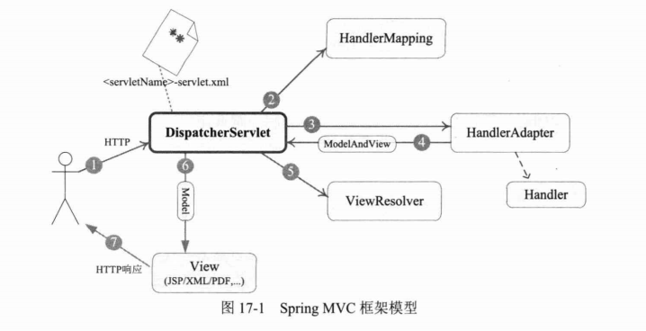
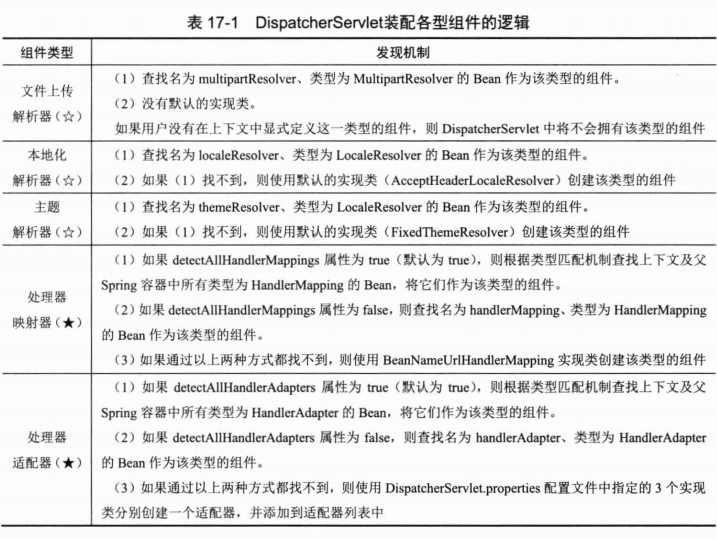
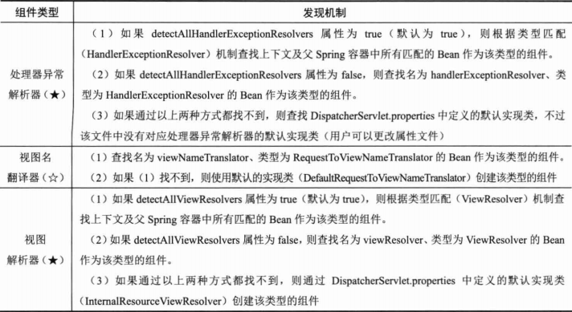
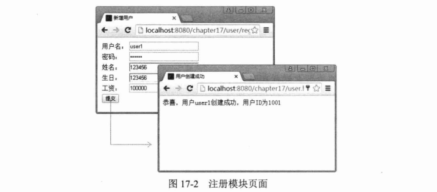
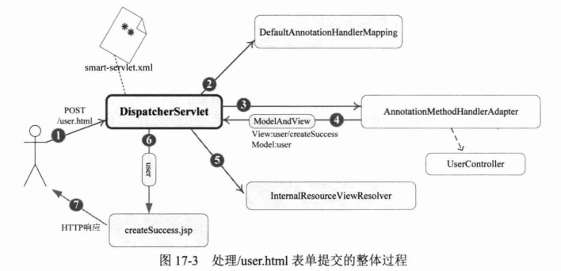
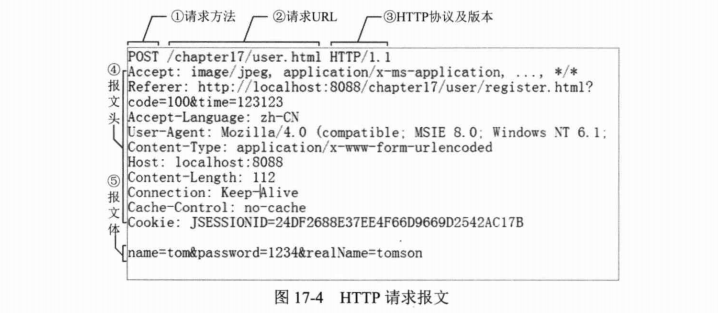
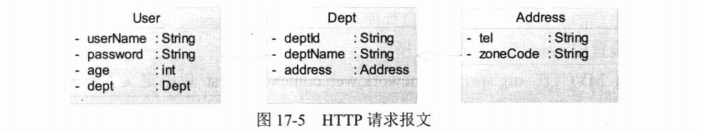

# 第17章 Spring MVC

> 大部分Java应用都是Web应用，展现层是Web应用不可忽略的重要环节。Spring为展现层提供了一个优秀的Web框架——Spring MVC。和众多其他的Web框架一样，它基于MVC的设计理念。此外，它采用了松散耦合、可插拔的组件结构，比其他的MVC框架更具扩展性和灵活性。Spring MVC通过一套MVC注解，让POJO成为处理请求的控制器，无须实现任何接口。同时，Spring MVC还支持REST风格的URL请求：注解驱动及RESt风格的Spring MVC是Spring的出色功能之一。此外，Spring MVC在数据绑定、视图解析、本地化处理及静态资源处理上都有许多不俗的表现。它在框架设计、扩展性、灵活性等方面全面超越了Struts、WebWork等MVC框架，从原来的追赶者一跃成为MVC的领跑者。

**本章主要内容：**

* Spring MVC体系概述
* 注解驱动的控制器
* 数据绑定、输入/输出格式化及数据校验
* 视图解析
* 本地化解析
* 文件上传
* WebSocket支持
* 静态资源处理、请求拦截器、异常处理

**本章亮点：**

* 深入分析并图解Spring MVC体系结构
* 对处理方法入参绑定及视图解析进行详细分析

## 17.1 Spring MVC体系概述

Spring MVC框架围绕DispatcherServlet这个核心展开，DispatcherServlet是Spring MVC的总导演、总策划，它负责截获请求并将其分派给相应的处理器处理。Spring MVC框架包括注解驱动控制器、请求及响应的信息处理、视图解析、本地化解析、上传文件解析、异常处理及表单标签绑定等内容。

### 17.1.1 体系结构

Spring MVC是基于Model2实现的技术框架，Model 2是经典的MVC（Model、View、Control）模型在Web应用中的变体，这个改变主要源于HTTP协议的无状态新。Model 2的目的和MVC一样，也是利用处理器分离模型、视图和控制，达到不同技术层级间松散耦合的结果，提高系统灵活性、复用性和可维护性。在大多数情况下，可以将Model 2与MVC等同起来。

在利用Model 2之前，把所有的展现逻辑和业务逻辑集中在一起，有时也称这种应用模式为Model 1。Model 1的主要缺点就是紧耦合，复用性差，维护成本高。

由于Spring MVC基于Model 2实现的框架，所以它底层的机制也是MVC，通过图17-1描述Spring MVC的整体架构。



从接收请求到返回响应，Spring MVC框架的众多组件通力配合、各司其职，有条不紊地完成分内的工作。在整个框架中，DispatcherServlet处于核心的位置，它负责协调和组织不同组件以完成请求并返回响应的工作。和大多数Web MVC框架一样，Spring MVC通过一个前端Servlet接收所有的请求，并将具体工作委托给其他组件进行处理，DispatcherServlet就是Spring MVC的前端Servlet。下面对Spring MVC处理请求的整体过程进行讲解。

（1）整个过程始于客户端发出一个HTTP请求，Web应用服务器接收到这个请求。如果匹配DispatcherServlet的请求映射路径（在web.xml中指定），则Web容器将该请求转交给DispatcherServlt处理。

（2）DispatcherServlet接收到这个请求后，将根据请求的信息（包括URL、HTTP方法、请求包文头、请求参数、Cookie等）及HandlerMapping的配置找到处理请求的处理器（Handler）。可见HandlerMapping看作路由控制器，将Handler看作目标主机。值得注意的是，在Spring MVC中并没有定义一个Handler接口，实际上，任何一个Object都可以成为请求处理器。

（3）当DispatcherServlet根据HandlerMapping得到对应当前请求的Handler后，通过HandlerAdapter对Handler进行封装，再以统一的适配器接口调用Handler。HandlerAdapter是Spring MVC的框架级接口，顾名思义，HandlerAdapter是一个适配器，它用统一的接口对各种Handler方法进行调用。

（4）处理器完成业务逻辑的处理后将返回一个ModelAndView给DispatcherServlet，ModelAndView包含了视图逻辑名和模型数据信息。

（5）ModelAndView中包含的是“逻辑视图名”而非真正的视图对象，DispatcherServlet借由ViewResolver完成逻辑视图名到真实视图对象的解析工作。

（6）当得到真实的视图对象View后，DispatcherServlet就使用这个View对象对ModelAndView中的模型数据进行视图渲染。

（7）最终客户端得到的响应消息可能是一个普通的HTML页面，也可能是一个XML或JSON串，甚至是一张图片或一个PDF文档等不同的媒体形式。

以上每个步骤都包含丰富的知识点，本章将逐步揭示每个组件的“庐山真面目”。不过现在请收好所有的好奇心，我们第一步要做的是在web.xml中配置好DispatcherServlet，让Spring MVC的“心脏”跳起来。

### 17.1.2 配置DispatcherServlet

DispatcherServlet是Spring MVC的“灵魂“和”心脏“它负责接收HTTP请求并协调Spring MVC的各个组件完成请求处理的工作。和任何Servlet一样，用户必须在web.xml中配置好DispatcherServlet。我们在第2章中已经配置了一个简单的DispatcherServlet，这里进一步分析其具体的配置。

要了解Spring MVC框架的工作机理，必须回答以下3个问题。

（1）DispatcherServlet框架如何截获特定的HTTP请求并交由Spring  MVC框架处理？

（2）位于Web层的Spring容器（WebApplicationContext）如何与位于业务层的Spring容器（ApplicationContext）建立关联，以使Web层的Bean可以调用业务层的Bean？

（3）如何初始化Spring MVC的各个组件，并将它们装配到DispatcherServlet中？

**1. 配置DispatcherServlet，截获特定的URL请求**

大家知道，我们可以在web.xml中配置一个Servlet，并通过`<servlet-mapping>`指定其处理的URL。这是传统的DispatcherServlet配置方式。而Spring 4.0已全面支持Servlet 3.0，因此也可以采用编程式的配置方式。这里先采用传统的web.xml的方式进行讲解，然后介绍基于Servlet 3.0的新方式。假设我们希望Spring MVC的DispatcherServlet能截获并处理所有以.html结束的URL请求，那么可以在web.xml中按如下方式进行配置，如代码清单17-1所示。

```xml
<?xml version="1.0" encoding="UTF-8"?>
<web-app xmlns="http://xmlns.jcp.org/xml/ns/javaee"
         xmlns:xsi="http://www.w3.org/2001/XMLSchema-instance"
         xsi:schemaLocation="http://xmlns.jcp.org/xml/ns/javaee http://xmlns.jcp.org/xml/ns/javaee/web-app_4_0.xsd"
         version="4.0">
    <!-- ①业务层和持久层的Spring配置文件，这些配置文件被父Spring容器所使用 -->
    <context-param>
        <param-name>contextConfigLocation</param-name>
        <param-value>classpath:/applicationContext.xml</param-value>
    </context-param>
    <listener>
        <listener-class>org.springframework.web.context.ContextLoaderListener</listener-class>
    </listener>

    <!-- ②声明DispatcherServlet -->
    <servlet>
        <servlet-name>smart</servlet-name>
        <servlet-class>org.springframework.web.servlet.DispatcherServlet</servlet-class>
        <load-on-startup>1</load-on-startup>
    </servlet>

    <!-- ③名为DispatcherServlet匹配的URL模式 -->
    <servlet-mapping>
        <servlet-name>smart</servlet-name>
        <url-pattern>.html</url-pattern>
    </servlet-mapping>
</web-app>
```

在①处，通过contextConfigLocation参数指定业务层Spring容器的配置文件（多个配置文件使用逗号分隔）。ContextLoaderListener是一个ServletContextListener，它通过contextConfigLocation参数所指定的Spring配置文件启动“业务层”的Spring容器。

在②处配置了名为smart的DispatcherServlet，它默认自动加载/WEB-INF/smart-servlet.xml（`<servlet-Name>-servlet.xml`）的Spring配置文件，启动Web层的Spring容器。

在③处，通过`<servlet-mapping>`指定DispatcherServlet处理所有以.html为后缀的HTTP请求，即所有带.html后缀的HTTP请求都会被DispatcherServlet截获并处理。

我们知道，多个Spring容器之间可设置为父子级的关系，以实现良好的解耦。在这里，“Web层”Spring容器将作为“业务层“Spring容器的子容器，即”Web层“容器可以引用”业务层“容器的Bean，而”业务层“容器却访问不到”Web层“容器的Bean。需要提醒的是，一个web.xml可以配置多个DispatcherServlet，通过其`<servlet-mapping>`配置，让每个DispatcherServlet处理不同的请求。

DispatcherServlet遵循“契约优于配置”的原则，在大多数情况下，用户无须进行额外的配置，只需按契约行事即可。

如果确实要对DispatcherServlet的默认规则进行调整，则DispatcherServlet是“敞开胸怀”的。下面是常用的一些配置参数，可通过`<servlet>`的`<init-param>`指定。

* namespace：DispatcherServlet对应的命名空间，默认为`<servlet-name>-servlet`，用于构造Spring配置文件的路径。在显式指定该属性后，配置文件对应的路径为`WEB-INF/<namespace>.xml`，而非`WEB-INF/<servlet-name>-servlet.xml`。
* contextConfigLocation：如果DispatcherServlet上下文对应的Spring配置文件有多个，则可以使用该属性按照Spring资源路径的方式制定。如“classpath:sample1.xml，classpath:sample2.xml”，DispatcherServlet将使用类路径下的sample.xml和sample2.xml这两个配置文件初始化WebApplicationContext。
* publishContext：布尔类型属性，默认值为true。DispatcherServlet根据该属性决定是否将WebApplicationContext发布到ServletContext的属性列表中，以便调用者可借由ServletContext找到WebApplicationContext实例，对应的属性名为DispatcherServlet#getServletContextAttributeName()方法的返回值。
* publishEvents：布尔类型的属性。当DispatcherServlet处理完一个请求后，是否需要向容器发布一个ServletRequestHandledEvent事件，默认值为true。如果容器中没有任何事件监听器，则可以将该属性设置为false，以便提高运行性能。

下面的代码显式指定Web层的Spring配置文件。

```xml
<!-- 声明DispatcherServlet -->
<servlet>
    <servlet-name>smart</servlet-name>
    <servlet-class>org.springframework.web.servlet.DispatcherServlet</servlet-class>
    <init-param>
        <param-name>contextConfigLocation</param-name>
        <param-value>WEB-INF/spring/webApplicationContext.xml</param-value>
    </init-param>
    <load-on-startup>1</load-on-startup>
</servlet>
```

之前提到Spring 4.0已全面支持Servlet 3.0，因此，在Servlet 3.0环境中，也可以使用编程的方式来配置Servlet容器。下面的代码可达到和代码清单17-1同样的效果。

```java
package com.smart.web.config;

import org.springframework.web.WebApplicationInitializer;
import org.springframework.web.servlet.DispatcherServlet;

import javax.servlet.ServletContext;
import javax.servlet.ServletException;
import javax.servlet.ServletRegistration;

/**
 * SmartApplicationInitializer
 *
 * @author shenhuanjie
 * @date 2019/6/21 17:39
 */
public class SmartApplicationInitializer implements WebApplicationInitializer {

    @Override
    public void onStartup(ServletContext servletContext) throws ServletException {
        ServletRegistration.Dynamic registration = servletContext.addServlet("dispatcher", new DispatcherServlet());
        registration.setLoadOnStartup(1);
        registration.addMapping("*.html");
    }
}

```

接下来看看Servlet 3.0的实现原理。在Servlet 3.0环境中，容器会在类路径中查找实现javax.setvlet.ServletContainerinitializer的类，如果发现已有实现类，就会调用它来配置Servlet容器。在Spring中，org.springframework.web.SpringServletContainerInitializer类实现了该接口，同时这个类又会查找实现org.springframework.web.WebApplicationInitializer接口的类，并将配置任务交给这些实现类去完成。另外，Spring提供了一个便利的抽象类AbstractAnnotationConfigDispatcherServletInitializer来实现这个接口，使得它在注册DispatcherServlet时只需简单地指定它的Servlet映射即可。在上述示例中，当应用部署到Servlet 3.0容器中时，容器启动时会自动发现它，并使用它来配置Servlet上下文。

**2. 探究DispatcherServlet的内部逻辑**

现在剩下的最后一个问题是：Spring如何将上下文中的Spring MVC组件装配到DispatcherServlet中？通过查看DispatcherServlet的initStrategies()方法的代码，一切真相就大白于天下了。

```java
/**
 * Initialize the strategy objects that this servlet uses.
 * <p>May be overridden in subclasses in order to initialize further strategy objects.
 */
protected void initStrategies(ApplicationContext context) {
    initMultipartResolver(context); //初始化上传文件解析器（直译为多部分请求解析器）
    initLocaleResolver(context); //初始化本地化解析器
    initThemeResolver(context); //初始化主题解析器
    initHandlerMappings(context); //初始化处理器映射器
    initHandlerAdapters(context); //初始化处理器适配器
    initHandlerExceptionResolvers(context); //初始化处理器异常解析器
    initRequestToViewNameTranslator(context); //初始化请求到视图名翻译器
    initViewResolvers(context); //初始化视图解析器
    initFlashMapManager(context);
}
```

initStrategies()方法将在WebApplicationContext初始化后自动执行，此时Spring上下文中的Bean已经初始化完毕。该方法的工作原理是：通过反射机制查找并装配Spring容器中用户显式自定义的组件Bean，如果找不到，则装配默认的组件实例。

Spring MVC定义了一套默认的组件实现类，也就是说，即使在Spring容器中没有显式定义组件Bean，DispatcherServlet也会装配好一套可用的默认组件。在spring-webmvc-4.x.jar包的org/springframework/web/servlet类路径下拥有一个DispatcherServlet.properties配置文件，该文件制定了DispatcherServlet所使用的默认组件。

```java
## 本地化解析器
org.springframework.web.servlet.LocalResolver=org.springframework.web.servlet.i18n.AcceptHeaderLocalResolver

## 主题解析器
org.springframework.web.servlet.ThemeResolver=org.springframework.web.servlet.theme.FixedThemeResolver

## 处理器映射（共2个）
org.springframework.web.servlet.HandleMapping=org.springframework.web.servlet.handler.BeanNameUrlHandlerMapping,org.springframework.web.servlet.mvc.annotation.DefaultAnnotationHandlerMapping

## 处理器适配器（共3个）
org.springframework.web.servlet.HandlerAdapter=org.springframework.web.servlet.mvc.HttpRequestHandlerAdapter,org.springframework.web.servlet.mvc.SimpleControllerHandlerAdapter,org.springframework.web.servlet.mvc.method.annotation.RequestMappingHandleAdapter

## 异常处理器（共3个）
org.springframework.web.servlet.HandlerExceptionResolver=org.springframework.web.servlet.mvc.annotation.AnnotationMethodHandlerExceptionResolver,org.springframework.web.servlet.mvc.annotation.ResponseStatusExceptionResolver,org.springframework.web.servlet.mvc.support.DefaultHandlerExceptionResolver

## 视图名称翻译器
org.springframework.web.servlet.RequestToViewNameTranslator=org.springframework.web.servlet.view.DefaultRequestToViewNameTranslator

## 视图解析器
org.springframework.web.servlet.ViewResolver=org.springframework.web.servlet.view.InternalResourceViewResolver
```

如果用户希望采用非默认类型的组件，则只需在Spring配置文件中配置自定义的组件Bean即可。Spring MVC一旦发现上下文中有用户自定义的组件，就不会使用默认的组件。下面通过表17-1进一步了解DispatcherServlet装配每种组件的过程。





有些组件最多允许存在一个实例，如MultipartResolver、LocaleResolver等，在表17-1中使用★进行标注。同一类型的组件如果存在多个，那么它们之间的优先级顺序如何确定呢？这些组件都实现了org.springframework.core.Ordered接口，可通过order属性确定优先级顺序，值越小优先级越高。

简言之，当DispatcherServlet初始化后，就会自动扫描上下文的Bean，根据名称或类型匹配的机制查找自定义的组件，找不到时则使用DispatcherServlet.properties定义的默认组件。

### 17.1.3 一个简单的实例

在学习了Spring MVC框架的整体结构后，下面通过一个简单的实例讲解Spring MVC开发的基本过程。Spring MVC应用开发一般包括以下几个步骤。

（1）配置web.xml，指定业务层对应的Spring配置文件，定义DispatcherServlet。

（2）编写处理请求的控制器（处理器）

（3）编写视图对象，这里使用JSP作为视图。

（4）配置Spring MVC的配置文件，使控制器、视图解析器等生效。

17.1.2节已经详细讲解了如何在web.xml中配置Spring业务层容器及定义DispatcherServlet的知识，所以这里直接从第（2）步开始。

**1. 编写处理请求的控制器**

Spring MVC通过@Controller注解即可将一个POJO转化为处理请求的控制器，通过@RequestMapping为控制器指定处理哪些URL的请求。UserController是一个负责用户处理的控制器，其代码如代码清单17-2所示。

```java
package com.smart.web;

import org.springframework.stereotype.Controller;
import org.springframework.web.bind.annotation.RequestMapping;

/**
 * UserController
 *
 * @author shenhuanjie
 * @date 2019/6/22 11:47
 */
@Controller // 使UserController成为处理请求的控制器
@RequestMapping("/user") // 处理来自/user URI的请求
public class UserController {

    @RequestMapping("/register") // 返回一个String类型的逻辑视图名
    public String register() {
        return "user/register";
    }
}

```

首先使用@Controller对UserController类进行标注，使其成为一个可处理HTTP请求的控制器。然后使用@RequestMapping对UserController及其register()方法进行标注，确定register()对应的请求URL。

在UserController类定义处标注的@RequestMapping限定了UserController类处理所有URL为/user的请求，它相对于Web容器部署根路径。UserController类可以定义多个处理方法，处理来自/user URI的请求。假设Web容器的部署根路径为/chapter17，则代码清单17-2中的register()方法将处理所有来自/chapter17/user/register.html的请求。值得说明的是，②处类级的@RequestMapping不是必需的，可以直接在方法中标注@RequestMapping，此时，方法处@RequestMapping指定的URI则是相对于部署根路径的。

register()方法返回一个字符串user/register，它代表一个逻辑视图名，将由视图解析器解析为一个具体的视图对象。本例中，它将映射为/WEB-INF/views/user/register.jsp。稍后，读者将了解如何装配完成这一任务的视图解析器。

**2. 编写视图对象**

我们使用一个register.jsp作为用户的注册页面，UserController#register()方法处理完成后，将转向这个register.jsp页面，如代码清单17-3所示。

```jsp
<%--
  Created by IntelliJ IDEA.
  User: shenhuanjie
  Date: 2019/6/22
  Time: 12:00
  To change this template use File | Settings | File Templates.
--%>
<%@ page contentType="text/html;charset=UTF-8" language="java" %>
<%@taglib uri="http://java.sun.com/jsp/jstl/core" prefix="c" %>
<html>
<head>
    <title>新增用户</title>
</head>
<body>
<from method="post" action="<c:url value="/user.html"/>">
    <table>
        <tr>
            <td>用户名：</td>
            <td><input type="text" name="userName"/></td>
        </tr>
        <tr>
            <td>密码：</td>
            <td><input type="password" name="password"/></td>
        </tr>
        <tr>
            <td>姓名</td>
            <td><input type="text" name="realName"/></td>
        </tr>
        <tr>
            <td colspan="2"><input type="submit" name="提交"/></td>
        </tr>
    </table>
</from>
</body>
</html>

```

register.jsp很简单，它包括了一个表单，单击“提交”按钮后，表单提交到/user.html进行处理。UserController添加了一个createUser()方法用于处理表单提交的请求，如代码清单17-4所示。

```java
package com.smart.web;

import com.smart.domain.User;
import com.smart.service.UserService;
import org.springframework.beans.factory.annotation.Autowired;
import org.springframework.stereotype.Controller;
import org.springframework.web.bind.annotation.RequestMapping;
import org.springframework.web.bind.annotation.RequestMethod;
import org.springframework.web.servlet.ModelAndView;

/**
 * UserController
 *
 * @author shenhuanjie
 * @date 2019/6/22 11:47
 */
@Controller // 使UserController成为处理请求的控制器
@RequestMapping("/user") // 处理来自/user URI的请求
public class UserController {
    @Autowired
    private UserService userService;//注入业务层的Bean

    /**
     * 处理/user的请求，不过请求的方法必须为POST
     *
     * @param user
     * @return
     */
    @RequestMapping(method = RequestMethod.POST)
    public ModelAndView createUser(User user) {
        // 将表单值映射到User对象中，调用UserService保存user，返回ModelAndView
        userService.createUser(user);
        ModelAndView mav = new ModelAndView();
        mav.setViewName("user/createSuccess");
        mav.addObject("user", user);
        return mav;
    }

    @RequestMapping("/register") // 返回一个String类型的逻辑视图名
    public String register() {
        return "user/register";
    }
}
```

createUser()方法处的@RequestMapping注解让createUser()处理URI为/user.html且请求方法为POST的请求。Spring MVC自动将表单中的数据按参数名和User属性匹配的方式进行绑定，将参数值填充到User的相应属性中。调用业务层的UserService进行业务处理，进而返回ModelAndView对象，逻辑视图名为user/createSuccess，user作为模型数据暴露给视图对象。

User对象的代码如代码清单17-5所示。

```java
package com.smart.domain;

/**
 * User
 *
 * @author shenhuanjie
 * @date 2019/6/22 12:14
 */
public class User {
    private String userId;
    private String userName;
    private String realName;

    public void setUserId(String userId) {
        this.userId = userId;
    }

    public String getUserId() {
        return userId;
    }

    public void setUserName(String userName) {
        this.userName = userName;
    }

    public String getUserName() {
        return userName;
    }

    public String getRealName() {
        return realName;
    }

    public void setRealName(String realName) {
        this.realName = realName;
    }
}

```

注意到User中的参数名和代码清单17-3中的表单组件是相同的，这样Spring MVC即可将表单组件填充到User的相应属性中。

视图解析器将user/createSuccess解析为/WEB-INF/views/user/createSuccess.jsp的视图对象，createSuccess.jsp可以访问到模型中的数据。createSuccess.jsp页面代码如代码清单17-6所示。

```jsp
<%@ page contentType="text/html;charset=UTF-8" language="java" %>
<html>
    <head>
        <title>用户创建成功</title>
    </head>
    <body>
    	恭喜，用户${user.userName}创建成功。
    </body>
</html>

```

由于UserController#createUser()通过@ModelAttribute("user")将User对象放到模型中，所以createSuccess.jsp可以通过${user.userName}访问模型中的数据。

**3. 配置Spring MVC的配置文件**

要使以上实例正常工作，需要在Spring MVC配置文件中进行简单的配置，如代码清单17-7所示。

```xml
<?xml version="1.0" encoding="UTF-8"?>
<beans xmlns="http://www.springframework.org/schema/beans"
       xmlns:xsi="http://www.w3.org/2001/XMLSchema-instance"
       xmlns:context="http://www.springframework.org/schema/context" xmlns:p="http://www.springframework.org/schema/p"
       xsi:schemaLocation="http://www.springframework.org/schema/beans http://www.springframework.org/schema/beans/spring-beans.xsd http://www.springframework.org/schema/context http://www.springframework.org/schema/context/spring-context.xsd">
    <context:component-scan base-package="com.smart.web"/>
    <bean class="org.springframework.web.servlet.view.InternalResourceViewResolver"
          p:prefix="/WEB-INF/views/"
          p:suffix=".jsp"/>
</beans>
```

在①处通过`<context:component-scan>`使Spring扫描com.smart.web包下所有的类，让标注Spring注解的类生效。而在②处定义了一个视图名称解析器，将视图逻辑名解析为`/WEB-INF/views/<viewName>.jsp`的视图对象，如图17-2所示。



**4. 运行用户注册模块**

将用户模块部署到Web服务器中，Web服务器服务端口为8080，部署根路径为/chapter17，通过http://localhost:8080/chapter17/user/register.html即可访问用户注册页面。填写用户注册信息，单击“提交”按钮将表单提交到http:localhost:8080/chapter17/user.html地址中，UserController控制器的createUser()方法响应这个请求，并导向createSuccess.jsp页面中。

对于用户注册表单提交直到返回响应这一过程，用事务对象对组件接口进行替换，得到如图17-3所示的交互图。



再简要描述一下Spring MVC处理/user.html的整个过程。

① DispatcherServlet接收到客户端的/user.html请求。

② DispatcherServlet使用DefaultAnnotationHandlerMapping查找负责处理该请求的处理器。

③ DispatcherServlet将请求分发给名为/user.html的UserController处理器。

④ 处理器完成业务处理后，返回ModelAndView对象，其中View的逻辑名为/user/createSuccess，而模型包含一个键为user的User对象。

⑤ DispatcherServlet调用InternalResourceViewResolver组件对ModelAndView中的逻辑视图名进行解析，得到真实的/WEB-INF/view/user/createSuccess.jsp视图对象。

⑥ DispatcherServlet使用/WEB-INF/view/user/createSuccess.jsp对模型中的user模型对象进行渲染。

⑦ 返回响应页面给客户端。

通过这个例子，我们了解了开发一个Spring MVC应用所需经历的大体过程。这个例子太过简单，每个步骤都是最简的实现。在本章的后续章节中，我们将对以上各个步骤进行深入分析。

## 17.2 注解驱动的控制器

### 17.2.1 使用@RequestMappig映射请求

在POJO类定义处标注@Controller，再通过`<context:component-scan/>`扫描相应的类包，即可使POJO成为一个能处理HTTP请求的控制器。

用户可以创建数量不限的控制器，分别处理不同的业务请求，如LogonController、UserController、ForumController等。每个控制器可拥有多个处理请求的方法，每个方法负责不同的请求操作。如何将请求映射到对应的控制器方法中是Spring MVC框架的重要任务之一，这项任务由@RequestMapping承担。

在控制器的类定义及方法定义处都可以标注@RequestMapping，类定义处的@RequestMapping提供初步的请求映射信息，方法定义处的@RequestMapping提供进一步的细分映射信息。DispatcherServlet截获请求后，就通过控制器上的@RequestMapping提供的映射信息确定请求所对应的处理方法。

将请求映射到控制器处理方法的工作包含一系列映射规则，这些规则是根据请求中的各种信息指定的，具体包括请求URL、请求参数、请求方法、请求头这4个方面的信息项。

**1. 通过请求URL进行映射**

@RequestMapping使用value值指定请求的URL，如@RequestMapping("/user")、@RequestMapping("/register")等。需要注意的是，@RequestMapping在类定义处指定的URL相对于Web应用的部署路径，而在方法定义处指定的URL则相对于类定义处指定的URL。如果在类定义处未标注@RequestMapping，则仅在处理方法处标注@RequestMapping，此时，方法处指定的URL则相对于Web应用的部署路径，如代码清单17-8所示。

```java
package com.smart.web;

import com.smart.domain.User;
import com.smart.service.UserService;
import org.springframework.beans.factory.annotation.Autowired;
import org.springframework.stereotype.Controller;
import org.springframework.web.bind.annotation.ModelAttribute;
import org.springframework.web.bind.annotation.RequestMapping;

/**
 * UserController
 *
 * @author shenhuanjie
 * @date 2019/6/22 11:47
 */
@Controller // 使UserController成为处理请求的控制器
public class UserController {
    @Autowired
    private UserService userService;//注入业务层的Bean

    /**
     * 处理/user的请求，不过请求的方法必须为POST
     *
     * @param user
     * @return
     */
    @RequestMapping(path = "/user/createUser")
    public String createUser(@ModelAttribute("user") User user) {
        return "user/createSuccess";
    }

    public String register(@ModelAttribute("user") User user) {
        return "user/register";
    }
}

```

这样，/user/register.html请求将由register()方法处理，而/user/createUser.html请求将由createUser()方法处理。注意，它们都相对于Web应用的部署路径。

同一控制器的多个处理方法负责处理相同业务模块的不同操作，但凡设计合理的Web应用都会将这些操作请求安排在某一相同的URL之下。所以除非特别的原因，建议不要舍弃类定义处的@RequestMapping。

@RequestMapping不但支持标准的URL，还支持Ant风格（？、*和**字符，常见4.3.2节）的和带{xxx}占位符的URL。以下URL都是合法的。

* /user/*/createUser：匹配/user/aaa/createUser、/user/bbb/createUser等URL。
* /user/**/createUser：匹配/user/createUser、/user/aa/bb/createUser等URL。
* /user/createUser??：匹配/user/createUseraa、/user/createUserbb等URL。
* /user/{userId}：匹配user/123、user/456等URL。
* /user/**/{userId}：匹配user/aaa/bbb/123、user/aaa/456等URL。
* company/{companyId}/user/{userId}/detail：匹配company/123/user/456/detail等URL。

通过@PathVariable可以将URL中的占位符参数绑定到控制器处理方法的入参中，如代码清单17-9所示。

```java
package com.smart.web;

import com.smart.service.UserService;
import org.springframework.beans.factory.annotation.Autowired;
import org.springframework.stereotype.Controller;
import org.springframework.web.bind.annotation.PathVariable;
import org.springframework.web.bind.annotation.RequestMapping;
import org.springframework.web.servlet.ModelAndView;

/**
 * UserController
 *
 * @author shenhuanjie
 * @date 2019/6/22 11:47
 */
@Controller // 使UserController成为处理请求的控制器
public class UserController {
    @Autowired
    UserService userService;

    @RequestMapping("/{userId}")
    public ModelAndView showDetail(@PathVariable("userId") String userId) {
        ModelAndView modelAndView = new ModelAndView();
        modelAndView.setViewName("user/showDetail");
        modelAndView.addObject("user", userService.getUserById(userId));
        return modelAndView;
    }
}

```

URL中的{xxx}占位符可以通过@PathVariable("xxx")绑定到操作方法的入参中。类定位处@RequestMapping的URL如果使用占位符的参数，则也可以绑定到处理方法的入参中，如代码清单17-10所示。

```java
package com.smart.web;

import org.springframework.stereotype.Controller;
import org.springframework.ui.Model;
import org.springframework.web.bind.annotation.PathVariable;
import org.springframework.web.bind.annotation.RequestMapping;

/**
 * RelativePathUriTemplateController
 *
 * @author shenhuanjie
 * @date 2019/6/22 20:12
 */
@Controller
@RequestMapping("/owners/{ownerId")
public class RelativePathUriTemplateController {
    
    @RequestMapping("/pets/{petId}")
    public void findPet(@PathVariable String ownerId, @PathVariable String petId, Model model) {
        ...
    }
}

```

在默认情况下，Java类的发射对象并未包含方法入参的名称，在Java 8.0中可以通过javac-parameters生成方法入参的元数据信息，在低版本的Java中则可以通过javac -g打开生成所有调试信息的开发，这样也会包含方法入参名的元数据信息。所以要使代码清单17-10中的findPet()入参成功绑定URL中的占位符参数，必须保证在编译时输出方法名元信息。在Maven中可以显式配置maven-compiler-plugin编译插件，开启编译输出调试信息的开关。

```xml
<plugins>
    <plugin>
        <artifactId>maven-compiler-plugin</artifactId>
        <version>${maven-compiler-plugin.version}</version>
        <configuration>
            <source>${maven.compiler.target}</source>
            <target>${maven.compiler.source}</target>
            <encoding>${maven.compiler.encoding}</encoding>
            <debug>true</debug>
        </configuration>
    </plugin>
</plugins>
```

不过编译时打开debug开关会使目标类变大，对运行效率也有一定的负面影响。正式编译部署时往往将此开关取消，所以最好在@PathVariable中显示指定绑定的参数名，以避免因编译方式不同造成参数绑定失败的隐患。

**2. 通过请求参数、请求方法或请求头进行映射**

HTTP请求报文除URL外，还拥有其他众多的信息。以下是一个标准的HTTP请求报文，如图17-4所示。



① 是请求方法，GET和POST是最常见的HTTP方法，除此以外还包括DELETE、HEAD、OPTIONS、PUT、TRACE。不过，当前的大多数浏览器只支持GET和POST，Spring提供了一个HiddenHttpMethodFilter，允许通过`_method`表单参数指定这些特殊的HTTP方法（实际上还是通过POST提交表单）。服务器端配置了HiddenHttpMethodFilter后，Spring会根据`_method`参数指定的值模拟出相应的HTTP方法，这样就可以使用这些HTTP方法对处理方法进行映射了。

② 是请求对应的URL地址，它和报文头的Host属性组成完整的请求URL。

③ 是协议名称及版本号。

④ 是HTTP的报文头，报文头包括若干个属性，格式为“属性名：属性值”，服务器端据此获取客户端的信息。

⑤ 是报文体，它将一个页面表单中的组件值通过param1=value1&param2=value2的键值对形式编码成一个格式串，它承载多个请求参数的数据。不但报文体可以传递请求参数，请求URL也可以通过类似于/chapter17/user.html?param1=value1&param2=value2的方式传递请求参数。

> **实战经验：**
>
> HttpWatch是强大的网页数据分析工具，安装后将集成到Internet Explorer工具栏中。它无须代理服务器或一些复杂的网络监控工具，就能抓取请求及响应的完整信息，包括Cookies、消息头、查询参数、响应报文等，是Web应用开发人员的必备工具。笔者有篇网文对HTTP有较全面的介绍，地址为http://www.iteye.com/topic/1124408，欢迎阅读。

@RequestMapping除了可以使用请求URL映射请求外，还可以使用请求方法、请求头参数及请求参数（报文体和URL包含的请求参数）映射请求，如代码清单17-11所示。

```java
package com.smart.web;

import org.springframework.stereotype.Controller;
import org.springframework.web.bind.annotation.RequestMapping;
import org.springframework.web.bind.annotation.RequestMethod;
import org.springframework.web.bind.annotation.RequestParam;

/**
 * UserController
 *
 * @author shenhuanjie
 * @date 2019/6/22 11:47
 */
@Controller
@RequestMapping("/user")
public class UserController {

    /**
     * 使用请求方法及请求参数映射请求
     *
     * @param userId
     * @return
     */
    @RequestMapping(path = "/delete", method = RequestMethod.POST, params = "userId")
    public String test1(@RequestParam("userId") String userId) {
        return "/user/test1";
    }

    /**
     * 使用报文头映射请求
     *
     * @param userID
     * @return
     */
    @RequestMapping(path = "/show", headers = "content-type=test/*")
    public String test2(@RequestParam("userId") String userID) {
        return "/user/test2";
    }
}

```

@RequestMapping的value、method、params及headers分别表示请求URL、请求方法、请求参数及报文头的映射条件，它们之间是与的关系，联合使用多个条件项可让请求映射更加精确化。

params和headers分别通过请求参数及报文头属性进行映射，它们支持简单的映射表达式。下面以params表达式为例进行说明，headers可以参照params来理解。

* “param1”：表示请求须包含名为param1的请求参数。

* “!param1”：表示请求不能包含名为param1的请求参数。

* "param1!=value1"：表示请求包含名为param1的请求参数，当其值不能为value1。

* {”param1=value1“，”param2“}：表示请求必须包含名为param1和param2的两个请求参数，且param1参数的值必须为value1。

### 17.2.2 请求处理方法签名

@RequestMapping像一个迎宾，将HTTP请求正确地迎接到主人的面前（负责处理该请求的方法）；主人起身相迎，进而与HTTP请求交杯换盏、把酒言欢；最后在欢声笑语中送走HTTP请求（返回响应）。Spring MVC通过分析处理方法的签名，将HTTP请求信息绑定到处理方法的相应入参中，然后再调用处理方法得到返回值，最后对返回值进行处理并返回响应。

Spring MVC对控制器处理方法签名的限制是很宽松的，用户几乎可以按自己喜欢的方式进行方法签名。在必要时对方法及方法入参标注相应的注解（如@PathVariable、@RequestParam、@RequestHeader等）即可，Spring MVC会优雅地完成剩下的工作：将HTTP请求的信息绑定到相应的方法入参中，并根据方法返回值类型做出相应的后续处理。

一般情况下，处理方法的返回值类型为ModelAndView或S他日你个，前者包含模型和逻辑视图名，而后者仅代表一个逻辑视图名。下面来看看几个典型的方法签名，如代码清单17-12所示。

```java
package com.smart.web;

import com.smart.domain.User;
import org.springframework.stereotype.Controller;
import org.springframework.web.bind.annotation.CookieValue;
import org.springframework.web.bind.annotation.RequestHeader;
import org.springframework.web.bind.annotation.RequestMapping;
import org.springframework.web.bind.annotation.RequestParam;
import org.springframework.web.servlet.ModelAndView;

import javax.servlet.http.HttpServletRequest;

/**
 * HandleController
 *
 * @author shenhuanjie
 * @date 2019/6/23 11:57
 */
@Controller
@RequestMapping("/handle")
public class HandleController {
    /**
     * 请求参数按名称匹配的方式绑定到方法入参中，方法返回的字符串代表逻辑视图名
     *
     * @param userName
     * @param password
     * @param realName
     * @return
     */
    @RequestMapping(path = "/handle1")
    public String handle1(@RequestParam("userName") String userName,
                          @RequestParam("password") String password,
                          @RequestParam("realName") String realName) {
        return "success";
    }

    /**
     * 将Cookie值及报文头属性绑定到入参中，方法返回ModelAndView
     *
     * @param sessionId
     * @param acceptLanguage
     * @return
     */
    @RequestMapping(path = "/handle2")
    public ModelAndView handle2(@CookieValue("JSESSIONID") String sessionId,
                                @RequestHeader("Accept-Language") String acceptLanguage) {
        ModelAndView mav = new ModelAndView();
        mav.setViewName("success");
        mav.addObject("user", new User());
        return mav;
    }

    /**
     * 请求参数按名称匹配的方式绑定到user的属性中，方法返回的字符串代表逻辑视图名
     *
     * @param user
     * @return
     */
    @RequestMapping(path = "/handle3")
    public String handle3(User user) {
        return "success";
    }

    /**
     * 直接将HTTP请求对象传递给处理方法，方法返回的字符串代表逻辑视图名
     *
     * @param request
     * @return
     */
    @RequestMapping(path = "/handle4")
    public String handle4(HttpServletRequest request) {
        return "success";
    }
}

```

从代码清单17-12中可以发现，Spring MVC会结合方法入参类型、入参的注解、返回值的类型，按照“契约”进行相应的处理。

### 17.2.3 使用矩阵变量绑定参数

RFC3986定义了在URI中包含name-value的规范。随之在Spring MVC 3.2中出现了@MatrixVariable注解，该注解的出现使得开发人员能够将请求中的矩阵变量（Matrix Variable）绑定到处理器的方法参数中。而Spring 4.0更全面地支持这个规范，这也是Spring 4.0众多吸引人的新特性之一。接下来我们就一起来了解这个新特性的使用方式。

在Matrix Variable中，多个变量可以使用“；”（分号）分隔，例如：

```xml
/books;author=Tom;year=2016
```

如果一个变量对应对个值，那么可以使用“，”（逗号）分隔，例如：

```xml
author=smart1,smart2,smart3
```

或者使用重复的变量名，例如：

```xml
author=smart1;author=smart2;author=smart3
```

下面举一个例子来说明，代码如下：

```java
/**
 * GET /books/22;a=11;b=22
 *
 * @param bookId
 * @param a
 */
@RequestMapping(value = "/books/{bookId}", method = RequestMethod.GET)
public void findBookId(@PathVariable String bookId, @MatrixVariable int a) {
    ...
}
```

相应的bookId和a都会被映射到这个方法中，如果匹配不到，则会报”bad request”。如果URI只是“/books/11”，则也可以映射到这个方法中，但需要指定空值不报错：@MatrixVariable(required=false)。

再来看一个更复杂的例子，以深入理解，代码如下：

```java

/**
 * GET /books/42;a=11/authors/21;q=22
 *
 * @param q1
 * @param q2
 */
@RequestMapping(value = "/books/{bookId}/authors/{authorId}",
        method = RequestMethod.GET)
public void findBook(
        @MatrixVariable(value = "a", pathVar = "bookId") int q1,
        @MatrixVariable(value = "a", pathVar = "authorId") int q2) {
    //q1==11
    //q2==22
}
```

针对每个Path Variable绑定一个Matrix Variable，然后使用value和pathVar属性就能找到该值。

另外，Matrix Variable也自带了一些属性可供选择，例如，是否必须，默认值。举一个例子来说明，代码如下：

```java
/**
 * GET /books/42
 *
 * @param q
 */
@RequestMapping(value = "/books/{bookId}", method = RequestMethod.GET)
public void findBook(@MatrixVariable(required = true, defaultValue = "1") int q) {
    //q==1
}
```

默认Matrix Variable功能是开启的，如果不希望开启该功能，则需要手工将RequestMappingHandlerMapping中的removeSemicolonContent属性设置为true，即`<mvc:annotation-driven enable-matrix-variables="true"/>`。

### 17.2.4 请求处理方法签名详细说明

本节将学习如何处理方法进行签名，包括如何设置方法入参以绑定请求信息、如何定义返回值类型、Spring MVC对不同签名的处理方法如何进行调用等内容。

**1. 使用@Requestparam绑定请求参数值**

在17.2.1节中我们指出，Java类反射对象默认不记录方法入参的名称，因此需要在方法入参处使用@RequestParam注解指定其对应的请求参数。@RequestParam注解有以下3个参数。

* value：参数名。
* required：是否必需，默认为true，表示请求中必须包含对应的参数名，如果不存在则抛出异常。
* defaultValue：默认参数名，在设置该参数时，自动将required设为false。极少情况需要使用该参数，也不推荐使用该参数。

下面的实例将userName和age请求参数分别绑定到handle11()方法的userName和age中，并自动完成类型转换。如果不存在age请求参数，则将抛出异常。

```java
/**
 * @param userName
 * @param age
 * @return
 */
@RequestMapping(path = "/handle11")
public String handle11(
        @RequestParam(value = "userName", required = false) String userName,
        @RequestParam("age") int age) {
    return "/handle11";
}
```

**2. 使用@CookieValue绑定请求中的Cookie值**

使用@CookieValue可以让处理方法入参绑定某个Cookie的值，它和@RequestParam拥有3个一样的参数。来看一个使用@CookieValue的实例，代码如下：

```java
/**
 * @param sessionId
 * @param age
 * @return
 */
@RequestMapping(path = "/handle12")
public String handle12(
        @CookieValue(value = "sessionId", required = false) String sessionId,
        @RequestParam("age") int age) {
    return "/handle12";
}
```

@CookieValue的value属性指定了Cookie的名称，required为false，表示请求中没有相应的Cookie时也不会报错。

**3. 使用RequestHeader绑定请求报文头的属性值**

如图17-4所示，请求报文包含了若干个报文头属性，服务器可据此获知客户端的信息，通过@RequestHeader即可将报文头属性值绑定到处理方法的入参中。

```java
@RequestMappint(path = "/handle13")
public String handle13(@RequestHeader("Accept-Encoding") String encoding,
                      @RequestHeader("Keep-Alive") long keepAlive){
    ...
}
```

@RequestHeader和@RequestParam拥有3个一样的参数，此处不再赘述。

**4. 使用命令/表单对象绑定请求参数值**

所谓命令/表单对象并不需要实现任何接口，仅是一个拥有若干属性的POJO。在代码清单17-12中，③处的User就是一个命令/表单对象。Spring MVC会按请求参数名和命令/表单对象属性名匹配的方式i，自动为该对象填充属性值。支持级联的属性名，如dept.deptId、dept.address.tel等。

```java
@RequestMapping(path = "/handle14")
public String handle14(User user){
    ...
}
```

假设User类的结构如图17-5所示，则如下的URL请求，其请求参数将正确地填充到User对象中。

```
/handle14.html?userName=tom&dept.deptId=1&dept.address.tel=102
```



**5. 使用Servlet API对象作为入参**

在Spring MVC中，控制器可以不依赖任何Servlet API对象，但是Spring MVC并不能阻止我们使用Servlet API的类作为处理方法的入参。以下处理方法都可以正确地工作，如代码清单17-13所示。

