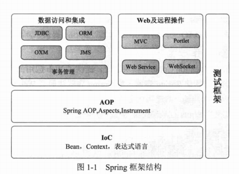

# 第1章 Spring 概述

Spring已经成为Java应用首选的full-stack开发框架，它本着“从实践中来，到实践中去”的原则，对传统EJB重量型框架的思想进行了颠覆性的个性，通过Rod Johnson天才般的演绎，使Spring在短时间内成为用户众多、社群庞大、文档丰富、极具实用性的开源开发框架。目前，Spring已经升级到4.2版本，全面支持Java SE8、Java EE7，向下兼容Java SE6/Java EE6，新添加如泛型依赖注入、Lambda表达式的支持、Groovy DSL定义Bean、核心容器的增强、Web框架增强、WebSocket模块的实现、测试增强等功能，全面支持REST风格的Web开发。Spring家族系列的子项目更加丰富，Spring在支持产品开发、大数据、云计算及微服务架构（MSA）、Mobile这些引领世界风潮的技术上拥有令人精美的表现。

**本章主要内容：**

* 认识Spring
* Spring体系及文档结构
* Spring 4.0新特性
* Spring子项目介绍

**本章亮点：**

* Spring子项目介绍
* Spring 4.0新特性

## 1.1 认识Spring

## 1.2 关于SpringSource

## 1.3 Spring带给我们什么

Spring给我们带来以下好处。

* 方便解耦，简化开发。
* AOP编程的支持。
* 声明式事务的支持。
* 方便程序的测试。
* 方便集成各种优秀框架。
* 降低Java EE API的使用难度。
* Java源码是经典的学习范例。

## 1.4 Spring体系结构

Spring核心框架由4000多个类组成，整个框架按其所属功能可以划分为5个主要模块，如图1-1所示。

**1. IoC**

Spring核心功能实现了IoC的功能，它将与类与类之间的依赖从代码中脱离出来，用配置的方式进行依赖关系描述，由IoC容器负责依赖类之间的创建、拼接、管理、获取等工作。BeanFactory接口是Spring框架的核心接口，它实现了容器许多核心的功能。

**2. AOP**

**3. 数据访问和集成**

**4. Web及远程操作**

**5. Web及远程访问**

**6. WebSocket**

## 1.5 Spring对Java版本的要求

## 1.6 Spring 4.0 新特性

### 1.6.1 全面支持Java 8.0

### 1.6.2 核心容器的增强

### 1.6.3 支持用Groovy定义Bean

### 1.6.4 Web增强

### 1.6.5 支持WebSocket

### 1.6.6 测试的增强

### 1.6.7 其他

## 1.7 Spring子项目

## 1.8 如何获取Spring

## 1.9 小结

全世界成千上万的项目都构建于Spring技术框架之上，Spring已然成为事实上标准的Java技术框架。它颠覆了传统Java开发笨重难用的学院派风格，给Java开发者带来了一股敏捷便利、灵活实用的编程之风。

Spring 4.0的核心容器、Web、测试、缓存、数据访问等方面进行了重大升级，全面支持Java 8.0、WebSocket、Groovy动态语言等，项目源码以当前灵活的Gradle构建工具进行组织，进一步增强了Spring在Java开源领域第一开源框架的领导地位。