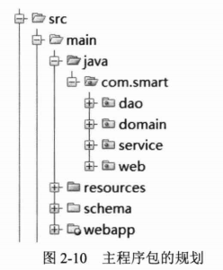
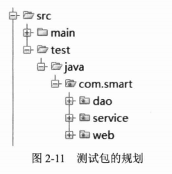

# 第2章 快速入门

本章通过一个简单的例子展现开发Spring Web应用的整体过程，通过这个实例，读者可以快速跨入Spring Web应用的世界。实例应用按持久层、业务层和展现层进行组织，从底层DAO到Web展现逐层演进，一步步地搭建起一个完整的实例。通过本章的学习， 读者可以独立完成一个典型的基于Spring的Web应用。

**本章主要内容：**

* Maven构建工具介绍
* 用户登录实例介绍
* 基于Spring JDBC的持久层实现
* 基于Spring声明式事务的业务层实现
* 基于Spring MVC的展现层实现
* 在IDEA中开发Web应用的过程
* 运行Web应用

**本章亮点：**

* 非传统Hello World的快速入门实例
* 通过IDEA开发工具讲解开发的过程
* 详尽的开发过程，使读者快速上手

## 2.1 实例概述

在进行实例项目具体开发之前，有必要先对项目的功能进行概述，以便对要实现的项目有一个整体性的认识。

### 2.1.1 比Hello World更适用的实例

为了让大家快速对Spring有一个切身的认识，没有什么比通过一个实际的例子更适合了。Hello World是比较经典的入门实例，但笔者认为Hello World太过简单，很难展现Spring的全貌。为了让Spring的功能轮廓更加清晰。之所以选择登录功能模块，出于以下3种原因：

* 读者对于登录模块的业务功能很熟悉，无须在业务功能介绍上花费时间。
* 登录模块“麻雀虽小，五脏俱全”，它涵盖了持久层数据访问操作、业务层事务管理及展现层MVC等企业应用常见的功能。
* 本书希望通过一个名为“小春”的论坛贯穿始终，以便能够由点及面，使读者在单纯技术性学习的酣战中深刻理解应用程序的整体开发流程。

Spring拥有持久层、业务层和展现层的“原生技术”，分别是Spring JDBC、声明式事务和Spring MVC。为了充分展现Spring本书的魅力，本章仅使用Spring的这些“原生技术”，在后续章节中将学习其他的持久层和展现层技术，只要用户愿意，就可以平滑地将其过度到其他实现技术中。

### 2.1.2 实例功能简介

## 2.2 环境准备

### 2.2.1 构建工具Maven

### 2.2.2 创建库表

### 2.2.3 建立工程

考虑到InterlliJ IDEA是一款非常有效且强大的IDE工具，越来越受到广大开发人员的欢迎，本书的所有示例都采用IDEA进行开发。

### 2.2.4 类包及Spring配置文件规划

**1. 类包规划**

类包以分层的方式进行组织，共划分为4个包，分别是dao、domain、service和web。领域对象从严格意义上讲属于业务层，但由于领域对象可能同时被持久层和展现层共享，所以一般将其单独划分到一个包中。如图2-10所示。

单元测试的类包和程序的类包对应，但放置在不同的文件夹下，如图2-11所示。本实例仅对业务层的业务类进行单元测试。将程序类和测试类放置在物理不同的文件夹下，方便将来程序的打包和分发，因为测试类仅在开发时有用，无须包含到部署包中。在本章的后续内容中，读者将会看到如何用Maven工具进行程序打包，体会这种包及目录的设计结构所带来的好处。

> **实战经验**
>
> 随着项目规模的增大，这种仅以分层实现划分的包结构就会显示出它的不足。一般情况下，需要在业务模块包下进一步按分层模块划分子包，如user/dao、user/service、viewspace/dao、viewspace/service等。对于由若干独立的子系统组成的大型应用，在业务分层包的前面一般还需要加上子系统的前缀。包的规划对于大型应用非常重要，它直接关系到应用部署和分发的便利性。

**2. Spring配置文件规划**

Spring可以将所有的配置信息统一到一个文件中，也可以放置到多个文件中。对于简单的应用来说，由于配置信息少，仅用一个配置文件就足以应付。随着应用规模的扩大，配置信息量的增多，仅使用一个配置文件往往难以满足要求。如果不进行仔细规划，则将给配置信息的查看和团队协作带来负面影响。

配置文件在团队协作时是资源争用的焦点，对于大型应用一般要按模块进行划分，以在一定程度上降低争用，减少团队协作的版本控制冲突。由于我们应用比较小，所以直接采用一个配置文件spring-context.xml即可。

## 2.3 持久层

持久层负责数据的访问和操作，DAO类被上层的业务类调用。Spring本身支持多种流行的ORM框架，这里使用Spring JDBC作为持久层的实现技术。为了方便阅读，我们会对本章涉及的相关知识进行必要的介绍，所以在不了解Spring JDBC的情况下，相信读者也可以轻松阅读本章的内容。

### 2.3.1 创立领域对象

领域对象（Domain Object）也被称为实体类，它代表了业务的状态，且贯穿展现层、业务层和持久层，并最终被持久化到数据库中。领域对象使数据库表操作以面向对象的方式进行，为程序扩展带来了更大的灵活性。领域对象不一定等用于数据库表，不过对于简单的应用来说，领域对象往往拥有对应的数据库表。

持久层的主要工作就是从数据库表中加载并实例化领域对象，或将领域对象持久化到数据库表中。

> **提示**
>
> 领域模型中的实体类可细分为4种类型：VO、DTD、DO、PO。PO（Persistent Object）：持久化对象，表示持久层的数据结构（如数据库表）；DO（Domain Object）：领域对象，即业务实体对象；DTO（Data Transfer Object）：数据传输对象，原来的目的是为EJB的分布式应用提供粗粒度的数据实体，以降低分布式调用的次数，提高分布式调用的性能，后来一般泛指用于展示层与服务层之间的数据传输对象，因此可以将DTO看成一个组合版的DO；VO（View Object）：视图对象，用于展示层视图状态对应的对象。从分层角度来说，PO、DO/DTO、VO分别属于持久层、服务层和展现层。对于简单模块来说，有时PO、DO和VO并没有什么区别，这时就没有必要分别定义DO和VO了，直接复用PO即可。

### 2.3.2 UserDao

在Spring 2.5以后，可以使用注解的方式定义Bean。较之于XML配置方式，注解配置方式的简单性非常明显，已经被广泛接受，成为一种趋势。所以除非没有办法，否则我们应尽量采用注解的配置方式。

### 2.3.3 LoginLogDao

### 2.3.4 在Spring中装配DAO

在编写DAO接口的实现类时，大家也许会有一个问题：在以上两个DAO实现类中没有打开/释放Connection的代码，DAO类究竟如何访问数据库呢？前面说过，样板式的操作

