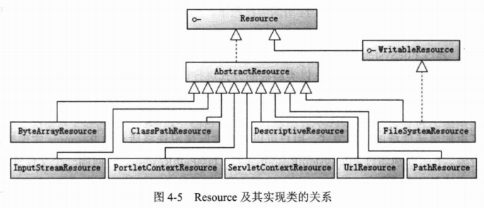
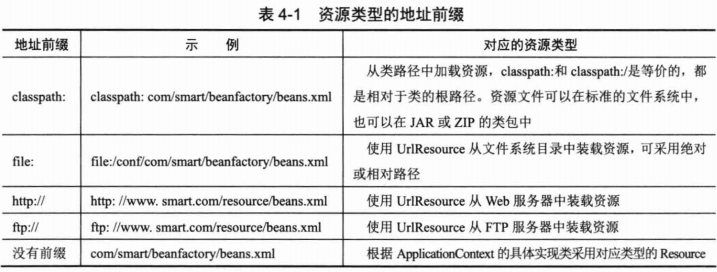
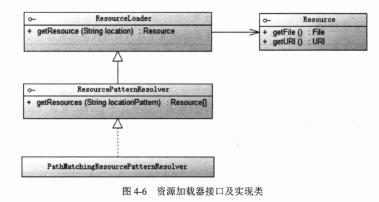
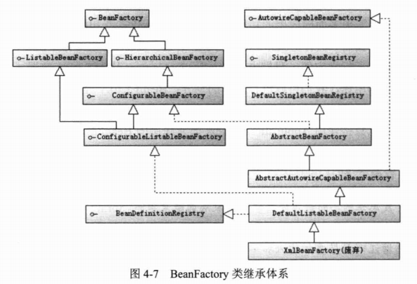
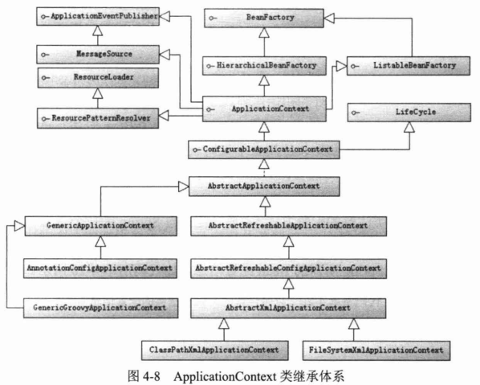
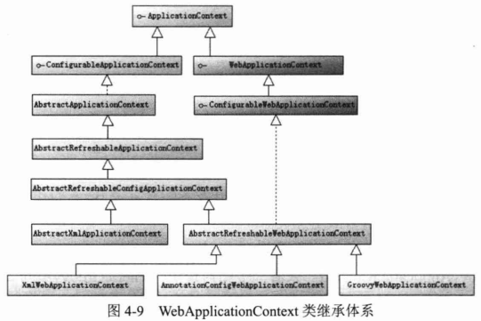
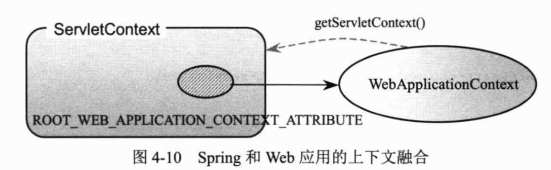
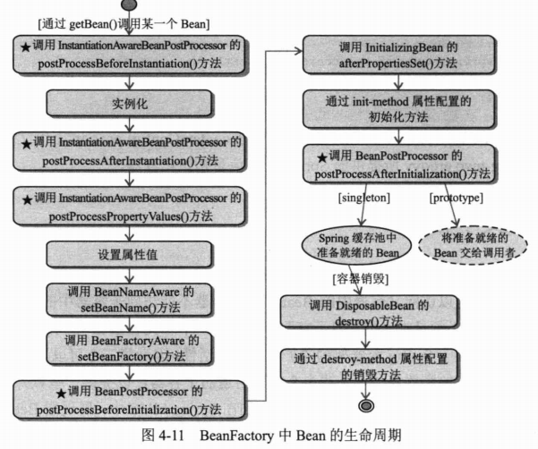
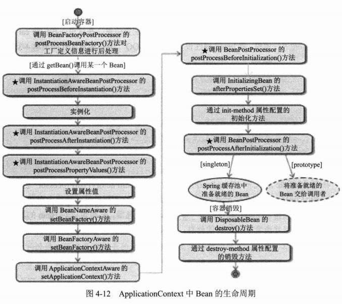

# 第4章 IoC容器

> 本章开始讲解Spring IoC容器的知识。为了理解Spring的IoC容器，我们将通过具体的实例详细地讲解IoC的概念。同时本章将对Java反射技术进行快速学习，它是Spring实现依赖注入的Java底层技术，掌握Java反射技术有助于读者深刻理解IoC的知识，做到知其然并知其所以然。以外，本章还对Spring框架3个重要的框架级接口进行了剖析，并对Bean的生命周期进行了讲解。通过本章的学习，读者可以掌握依赖注入的思想、实现原理，以及几个Spring IoC容器级接口的知识。

**本章主要内容**

* IoC概念所包含的设计思想
* Java反射技术
* BeanFactory、ApplicationContext及WebApplicationContext基础接口
* Bean的生命周期

**本章亮点**

* 通过简单明了的实例逐步讲解IoC概念和原理
* 详细分析Bean的生命周期并探讨生命周期接口的实际意义

## 4.1 IoC概述

IoC（Inverse of Control，控制反转）是Spring容器的内核，AOP、声明式事务等功能在此基础上开花结果。但是IoC这个重要的概念却比较晦涩难懂，不容易让人望文生义，这不能不说是一大遗憾。不过IoC确实包括很多内涵，它涉及代码解耦、涉及模式、代码优化等问题的考量，我们试图通过一个小例子来说明这个概念。

### 4.1.1 通过实例理解IoC的概念

### 4.1.2 IoC的类型

从注入方法上看，IoC主要可以划分为3种类型：构造函数注入、属性注入和接口注入。Spring支持构造函数注入和属性注入。

**1. 构造函数注入**

在构造函数注入中，通过调用类的构造函数，将接口实现类通过构造函数变量传入。

**2. 属性注入**

属性注入可以有选择地通过Setter方法完成调用类所需依赖的注入，更加灵活方便。

**3. 接口注入**

将调用类所有依赖注入的方法抽取到一个接口中，调用类通过实现该接口提供相应的注入方法。

由于通过接口注入需要额外声明一个接口，增加了类的数目，而且它的效果和属性注入并无本质区别，因此我们不提倡采用这种注入方式。

### 4.1.3 通过容器完成依赖关系的注入

在容器启动时，Spring根据配置文件的信息，自动实例化Bean并完成依赖关系的装配，从容器中即可返回准备就绪的Bean实例，后续可直接使用之。

Spring为什么会有这种“神奇”的力量，仅凭一个简单的配置文件，就能魔法般地实例化并装配好程序所用的Bean呢？这种“神奇”的力量归功于Java语言本身的类反射功能。下面我们独辟章节专门讲解Java语言的反射知识，为大家深刻理解Spring的技术内幕做好准备。

## 4.2 相关Java基础知识

Java语言允许通过程序化的方式间接对Class进行操作。Class文件由类装载器装载后，在JVM中将形成一份描述Class结构的元信息对象，通过该元信息对象可以获知Class的结构信息，如构造函数、属性和方法等。Java允许用户借由这个与Class相关的元信息对象间接调用Class对象的功能，这就为使用程序化方式操作Class对象开辟了途径。

### 4.2.1 简单实例

我们将从一个简单的例子开始探访Java反射机制的征程。下面的Car类拥有两个构造函数、一个方法及3个属性，如代码清单4-9所示。

```java
package com.smart.reflect;

/**
 * Car
 *
 * @author shenhuanjie
 * @date 2019/6/14 13:37
 */
public class Car {

    private String brand;
    private String color;
    private int maxSpeed;

    /**
     * 默认构造函数
     */
    public Car() {
    }

    /**
     * 带参数构造函数
     *
     * @param brand
     * @param color
     * @param maxSpeed
     */
    public Car(String brand, String color, int maxSpeed) {
        this.brand = brand;
        this.color = color;
        this.maxSpeed = maxSpeed;
    }

    /**
     * introduce
     */
    public void introduce() {
        System.out.println("brand:" + brand + ";color:" + color + ";maxSpeed:" + maxSpeed);
    }

    public String getBrand() {
        return brand;
    }

    public void setBrand(String brand) {
        this.brand = brand;
    }

    public String getColor() {
        return color;
    }

    public void setColor(String color) {
        this.color = color;
    }

    public int getMaxSpeed() {
        return maxSpeed;
    }

    public void setMaxSpeed(int maxSpeed) {
        this.maxSpeed = maxSpeed;
    }
}
```

一般情况下，我们会使用如下代码创建Car的实例：

```java
Car car = new Car();
car.setBrand("红旗CA72");
```

或者

```java
Car car = new Car("红旗CA72", "黑色", 240);
```

以上两种方法都采用传统方式直接调用目标类的方法。下面我们通过Java反射机制以一种间接的方式操控目标类，如代码清单4-10所示。

```java
package com.smart.reflect;

import java.lang.reflect.Constructor;
import java.lang.reflect.Method;

/**
 * Reflect
 *
 * @author shenhuanjie
 * @date 2019/6/14 14:46
 */
public class Reflect {

    public static Car initByDefaultConst() throws Throwable {
        // 通过类装载器获取Car类对象
        ClassLoader classLoader = Thread.currentThread().getContextClassLoader();
        Class clazz = classLoader.loadClass("com.smart.reflect.Car");

        // 获取类的默认构造器对象并通过它实例化Car
        Constructor constructor = clazz.getDeclaredConstructor((Class[]) null);
        Car car = (Car) constructor.newInstance();

        // 通过反射方法设置属性
        Method setBrand = clazz.getMethod("setBrand", String.class);
        setBrand.invoke(car, "红旗CA72");
        Method setColor = clazz.getMethod("setColor", String.class);
        setColor.invoke(car, "黑色");
        Method setMaxSpeed = clazz.getMethod("setMaxSpeed", int.class);
        setMaxSpeed.invoke(car, 200);

        return car;
    }

    public static void main(String[] args) throws Throwable {
        Car car = initByDefaultConst();
        car.introduce();
    }
}
```

运行以上程序，控制台上将打印出以下信息：

```html
brand:红旗CA72;color:黑色;maxSpeed:200
```

这说明我们完全通过编程方式调用Class的各项功能，与通过构造函数和方法直接调用类功能的效果是一致的，只不过前者是间接调用，后者是直接调用罢了。

在ReflectTest中使用了几个重要的反射类，分别是ClassLoader、Class、Constructor和Method，通过这些反射类就可以间接调用目标Class的各项功能。

### 4.2.2 类装载器ClassLoader

**1. 类装载器的工作机制**

类装载器是寻找类的节码文件并构造出类在JVM内部表示对象的组件。在Java中，类装载器把一个类装入JVM中，需要经过以下步骤：

1. 装载：查找和导入Class文件。

2. 链接：执行校验、准备和解析步骤，其中解析步骤是可以选择的。
   1. 校验：检查载入Class文件数据的正确性。
   2. 准备：给类的静态变量分配存储空间。
   3. 解析：将符号引用转换成直接引用。

3. 初始化：对类的静态变量、静态代码块执行初始化工作。

类装载工作由ClassLoader及其子类负责。ClassLoader是一个重要的Java运行时系统组件，它负责在运行时查找和装入Class字节码文件。JVM在运行时会产生3个ClassLoader：根装载器、ExtClassLoader（扩展类装载器）和AppClassLoader（应用类装载器）。其中，根装载器不是ClassLoader的子类，它使用C++语言编写，因而在Java中看不到它，根装载器负责转账JRE的核心类库，如JRE目标下的rt.jar、charsets.jar等。ExtClassLoader和AppClassLoader都是ClassLoader的子类，其中ExtClassLoader负责装载JRE扩展目录ext中的JAR类包；AppClassLoader负责装载Classpath路径下的类包。

这3个类装载器之间存在父子层级关系，即根装载器是ExtClassLoader的父装载器，ExtClassLoader是AppClassLoader的父装载器。在默认情况下，使用AppClassLoader装载应用程序的类。

```java
package com.smart.reflect;

import org.junit.Test;

/**
 * ClassLoaderTest
 *
 * @author shenhuanjie
 * @date 2019/6/14 15:34
 */
public class ClassLoaderTest {
    /**
     * classLoaderTest
     */
    @Test
    public void classLoaderTest() {
        ClassLoader classLoader = Thread.currentThread().getContextClassLoader();
        System.out.println("current loader:" + classLoader);
        System.out.println("parent loader:" + classLoader.getParent());
        System.out.println("grandparent loader:" + classLoader.getParent().getParent());
    }
}
```

运行以上代码，在控制台上将打印出以下信息：

```
current loader:sun.misc.Launcher$AppClassLoader@18b4aac2
parent loader:sun.misc.Launcher$ExtClassLoader@8efb846
grandparent loader:null
```

通过以上输出信息，我们知道当前的ClassLoader是AppClassLoader，其父ClassLoader是ExtClassLoader，祖父ClassLoader是根装载器，因为在Java中无法获得它的句柄，所以仅返回null。

JVM装载类时使用“全盘负责委托机制”，“全盘负责”是指当一个ClassLoader装载一个类时，除非显式地使用另一个ClassLoader，该类所依赖及引用的类也由这个ClassLoader载入：“委托机制”是指先委托父装载器寻找目标类，只有在找不到的情况下才从自己的类路径中查找并装载目标类。

**2. ClassLoader的重要方法**

在Java中，ClassLoader是一个抽象类，位于java.lang包中。下面对该类的一些重要接口方法进行介绍。

* **Class loadClass(String name)：**name参数指定类装载器需要装载类的名字，必须使用全限定类名。该方法有一个重载方法loadClass(String name, boolean resolver)，resolve参数告诉类装载器是否需要解析该类。在初始化类之前，应该考虑进行解析的工作，但并不是所有的类都需要解析。如果JVM只需要知道该类是否存在或找出该类的超类，那么就不需要进行解析。

每个类在JVM中都拥有一个对应的java.lang.Class对象，它提供了类结构信息的描述。数组、枚举、注解及基本Java类型（如int、double等），甚至void都拥有对应的Class对象。Class没有public的构造方法。Class对象是在装载类时由JVM通过调用类装载器中的defineClass()方法自动构造的。

### 4.2.3 Java反射机制

Class反射对象描述类语义结构，可以从Class对象中获取构造函数、成员变量、方法类等类元素的反射对象，并以编程的方式通过这些反射对象对目标类对象进行操作。这些反射对象在java.reflect包中定义。下面介绍3个主要的反射类。

* Constructor：类的构造函数反射类
* Method：类方法的反射类
* Field：类的成员变量的反射类

## 4.3 资源访问利器

### 4.3.1 资源抽象接口

JDK所提供的访问资源的类（如java.net.URL、File等）并不能很好地满足各种底层资源的访问需求，比如缺少从类路径或者Web容器的上下文中获取资源的操作类。鉴于此，Spring设计了一个Resource接口，它为应用提供了更强的底层资源访问能力。该接口拥有对应不同资源类型的实行类。先来了解一下Resource接口的主要方法。

* boolean exists()：资源是否存在。
* boolean isOpen()：资源是否打开。
* URL getURL() throws IOException：如果底层资源可以表示成URL，则该方法返回对应的URL对象。
* File getFile() throws IOException：如果底层资源对应一个文件，则该方法返回对应的File对象。
* InputStream getInputStream() throws IOException：返回资源对应的输入流。

Resource在Spring框架中起着不可或缺的作用，Spring框架使用Resource装载各种资源，包括配置文件资源、国际化属性文件资源等。下面我们来了解一下Resource的具体实现类。如图4-5所示。



* WriableResource：可写资源接口，是Spring3.1版本新加的接口，有两个实现类，即FileSystemResource和PathResource，其中PathResource是Spring 4.0提供的实现类。
* ByteArrayResource：二进制数组表示的资源，二进制数组资源可以在内存中通过程序构造。
* ClassPathResource：类路径下的资源，资源以相对于类路径的方式表示，如代码清单4-14所示。

* FileSystemResource：文件系统资源，资源以文件系统路径的方式表示。
* InputStreamResource：以输入流返回表示的资源。
* ServletContextResource：为访问Web容器上下文中的资源而设计的类，负责以相对于Web应用根目录的路径加载资源。它支持以流和URL的方式访问，在WAR解包的情况下，也可以通过File方式访问。该类还可以直接从JAR包中访问资源。
* UrlResource：URL封装了java.net.URL，它使用户能够访问任何可以通过URL表示的资源，如文件系统的资源、HTTP资源、FTP资源等。
* PathResource：Spring 4.0 提供的读取资源文件的新类。Path封装了java.net.URL、java.nio.file.Path（Java 7.0提供）、文件系统资源，它使用户能够访问任何可以通过URL、Path、系统文件路径表示的资源，如文件系统的资源、HTTP资源、FTP资源等。

有了这个抽象的资源类后，就可以将Spring的配置信息放置在任何地方（如数据库、LDAP中），只要最终可以通过Resource接口返回配置信息即可。

> **提示**
>
> Spring的Resource接口及其实现类可以在脱离Spring框架的情况下使用，它比通过JDK访问资源的API更好用、更强大。

假设有一个文件位于Web应用的类路径下，用户可以通过以下方式对这个文件资源进行访问：

* 通过FileSystemResource以文件系统绝对路径的方式进行访问。
* 通过ClassPathResource以类路径的方式进行访问。
* 通过ServletContextResource以相对于Web应用根目录的方式进行访问。

相比于通过JDK的FIle类访问文件资源的方式，Spring的Resource实现类无疑提供了更加灵活便捷的访问方式，用户可以根据实际情况选择适合的Resource实现类访问资源。下面分别通过FileSystemResource和ClassPathResource访问同一个文件资源，如代码4-14所示。

```java
package com.smart.resource;

import org.springframework.core.io.ClassPathResource;
import org.springframework.core.io.PathResource;
import org.springframework.core.io.Resource;
import org.springframework.core.io.WritableResource;

import java.io.ByteArrayOutputStream;
import java.io.IOException;
import java.io.InputStream;
import java.io.OutputStream;

/**
 * FileSourceExample
 *
 * @author shenhuanjie
 * @date 2019/6/14 16:38
 */
public class FileSource {
    public static void printFileSource() {
        try {
            String filePath = "C:/Users/shenh/Documents/Develop/Projects/Spring-In-Action/file.txt";
            WritableResource res1 = new PathResource(filePath);

            Resource res2 = new ClassPathResource("conf/file.txt");

            OutputStream stream1 = res1.getOutputStream();
            stream1.write("欢迎光临\n小春论坛".getBytes());
            stream1.close();

            InputStream ins1 = res1.getInputStream();

            ByteArrayOutputStream baos = new ByteArrayOutputStream();
            int i;
            while ((i = ins1.read()) != -1) {
                baos.write(i);
            }

            System.out.println(baos.toString());

            System.out.println("res1:" + res1.getFilename());
            System.out.println("res2:" + res2.getFilename());
        } catch (IOException e) {
            e.printStackTrace();
        }
    }
}
```

在获取资源后，用户就可以通过Resource接口定义的多个方法访问文件的数据和其他信息。

在Web应用中，用户还可以通过ServletContextResource以相对于Web应用根目录的方式访问文件资源。

对于位于远程服务器（Web服务器或FTP服务器）的文件资源，用户可以方便地通过UrlResource进行访问。

资源加载时默认采用系统编码读取资源内容。如果资源文件采用特殊的编码格式，那么可以通过EncodeResource对资源进行编码，以保证资源内容操作的正确性。

### 4.3.2 资源加载

为了访问不同类型的资源，必须使用相应的Resource实现类，这是比较麻烦的。是否可以在不显式使用Resource实现类的情况下，仅通过资源地址的特殊标识就可以访问相应的资源呢？Spring提供了一个强大的加载资源的机制，不但能够通过“classpath:”、“file:”等资源地址前缀识别不同的资源类型，还支持Ant风格带通配符的资源地址。

**1. 资源地址表达式**

首先来了解一下Spring支持哪些资源类型的地址前缀，如表4-1所示。



**2. 资源加载器**

Spring定义了一套资源加载的接口，并提供了实现类，如图4-6所示。



ResourceLoader接口仅有一个getResource(String location)方法，可以根据一个资源地址加载文件资源。不过，资源地址仅支持类型前缀的表达式，不支持Ant风格的资源路径表达式。ResourcePatternResolver扩展ResourceLoader接口，定义了一个新的接口方法getResource(String locationPattern)，该方法支持带资源类型前缀及Ant风格的资源路径表达式。PathMatchingResourcePatternResolver是Spring提供的标准实现类，来看一个例子，如代码清单4-17所示。

```java
package com.smart.resource;

import org.junit.Test;
import org.springframework.core.io.Resource;
import org.springframework.core.io.support.PathMatchingResourcePatternResolver;
import org.springframework.core.io.support.ResourcePatternResolver;

import static org.junit.Assert.assertNotNull;

/**
 * PatternResolverTest
 *
 * @author shenhuanjie
 * @date 2019/6/14 17:42
 */
public class PatternResolverTest {
    @Test
    public void getResources() throws Throwable {
        ResourcePatternResolver resolver = new PathMatchingResourcePatternResolver();
        Resource resources[] = resolver.getResources("classpath*:com/smart/**/*.xml");
        assertNotNull(resources);
        for (Resource resource : resources) {
            System.out.println(resource.getFilename());
        }
    }
}
```

由于资源路径是“classpath*:”，所以PathMatchingResoucePatternResolver将扫描所有类路径下及JAR包中对应com.smart类包下的路径，读取所有以.xml后缀的文件资源。

## 4.4 BeanFactory和ApplicationContext

Spring通过一个配置文件描述Bean及Bean之间的依赖关系，利用Java语言的反射功能实例化Bean并建立Bean之间的依赖关系。Spring的IoC容器在完成这些底层工作的基础上，还提供了Bean实例缓存、生命周期管理、Bean实例代理、事件发布、资源装载等高级服务。

Bean工程（com.springframework.beans.factory.BeanFactory）是Spring框架最核心的接口，它提供了高级IoC的配置机制。BeanFactory使管理不同类型的Java对象成为可能。应用上下文（com.springframework.context.ApplicationContext）建立在BeanFactory基础之上，提供了更多面向应用的功能，它提供了国际化支持和框架事件体系，更易于创建实际应用。我们一般称BeanFactory为IoC容器，而称ApplicationContext为应用上下文。但有时为了行文方便，我们也将ApplicationContext称为Spring容器。

对于二者的用途，我们可以进行简单的划分：BeanFactory是Spring框架的基础设施，面向Spring本书身；ApplicationContext面向使用Spring框架的开发者，几乎所有的应用场合都可以直接使用ApplicationContext而非底层的BeanFactory。

### 4.4.1 BeanFactory介绍

诚如其名，BeanFactory是一个类工厂，但和传统的类工厂不同，传统的类工厂仅负责构造一个或几个类的实例；而BeanFactory是类的通用工厂，它可以创建并管理各种类的对象。这些可被创建和管理的对象本身没有什么特别之处，仅是一个POJO，Spring称这些被创建和管理的Java对象为Bean。我们知道JavaBean是要满足一定规范的，如必须提供一个默认不带参的构造函数、不依赖于某一特定的容器等，但Spring中所说的Bean比JavaBean更宽泛一些，所以可以被Spring容器实例化并管理的Java类都可以成为Bean。

**1. BeanFactory的类体系结构**

Spring为BeanFactory提供了多种实现，最常见的是XmlBeanFactory，但在Spring 3.2中已被废弃，建议使用XmlBeanDefinitionReader、DeafultListableBeanFactory替代。BeanFactory的类继承体系设计优雅，堪称经典。通过继承体系，我们可以很容易地了解到BeanFactory具有哪些功能，如图4-7所示。



BeanFactory接口位于类结构树的顶端，它最主要的方法就是getBean(String beanName)，该方法从容器中返回特定名称的Bean。BeanFactory的功能通过其他接口得到不断扩展。下面对图4-7中涉及的其他接口分别进行说明。

* ListableBeanFactory：该接口定义了访问容器中Bean基本信息的若干方法，如查看Bean的个数、获取某一类型Bean的配置名、查看容器中是否包括某一Bean等。
* HierarchicalBeanFactory：父子级联IoC容器的接口，子容器可以通过接口方法访问父容器。
* ConfigurableBeanFactory：这是一个重要的接口，增强了IoC容器的可定制性。它定义了设置类装载器、属性编辑器、容器初始化后置处理器等方法。
* AutowireCapableBeanFactory：定义了将容器中的Bean按某种规则（如按名字匹配、按类型匹配等）进行自动装配的方法。
* SingletonBeanRegistry：定义了允许在运行期向容器注册实例Bean的方法。
* BeanDefinitionRegistry：Spring配置文件助攻每一个`<bean>`节点元素在Spring容器里都通过一个BeanDefinition对象表示，它描述了Bean的配置信息。而BeanDefinition Registry接口提供了向容器手工注册BeanDefinition对象的方法。

**2. 初始化BeanFactory**

下面使用Spring配置文件为Car提供配置信息，然后通过BeanFactory装载配置文件，启动Spring IoC容器。Spring配置文件如代码清单4-18所示。

```xml
<?xml version="1.0" encoding="UTF-8"?>
<beans xmlns="http://www.springframework.org/schema/beans"
       xmlns:xsi="http://www.w3.org/2001/XMLSchema-instance"
       xmlns:p="http://www.springframework.org/schema/p"
       xsi:schemaLocation="http://www.springframework.org/schema/beans
       http://www.springframework.org/schema/beans/spring-beans-2.5.xsd">
    
    <bean id="car" class="com.smart.Car"
          p:brand="红旗CA72"
          p:color="黑色"
          p:maxSpeed="200"/>
</beans>
```

下面通过XMLBeanDefinitionReader、DefaultListableBeanFactory实现类启动Spring IoC容器，如代码清单4-19所示。

```java
package com.smart.beanfactory;

import com.smart.Car;
import org.junit.Test;
import org.springframework.beans.factory.support.DefaultListableBeanFactory;
import org.springframework.beans.factory.xml.XmlBeanDefinitionReader;
import org.springframework.core.io.Resource;
import org.springframework.core.io.support.PathMatchingResourcePatternResolver;
import org.springframework.core.io.support.ResourcePatternResolver;

/**
 * BeanFactoryTest
 *
 * @author shenhuanjie
 * @date 2019/6/14 22:49
 */
public class BeanFactoryTest {

    @Test
    public void getBean() throws Throwable {
        ResourcePatternResolver resolver = new PathMatchingResourcePatternResolver();
        Resource res = resolver.getResource("classpath:com/smart/beanfactory/beans.xml");
        System.out.println(res.getURL());

        DefaultListableBeanFactory factory = new DefaultListableBeanFactory();
        XmlBeanDefinitionReader reader = new XmlBeanDefinitionReader(factory);
        reader.loadBeanDefinitions(res);

        System.out.println("init BeanFactory.");

        Car car = factory.getBean("car", Car.class);
        System.out.println("car bean is ready for use!");
        car.introduce();
    }
}
```

XmlBeanDefinitionReader通过Resource装载Spring配置信息并启动IoC容器，然后就可以通过BeanFactory#getBean(beanName)方法从IoC容器中获取Bean。通过BeanFactory启动IoC容器时，并不会初始化配置文件中定义的Bean，初始化动作发生在第一次调用时。对于单实例（singleton）的Bean来说，BeanFactory会缓存Bean实例，所以第二次使用getBean()获取Bean时，将直接从IoC容器的缓存中获取Bean实例。

Spring在DefaultSingletonBeanRegistry类中提供了一个用于缓存单实例Bean的缓存器，它是一个用HashMap实现的缓存器，单实例的Bean以beanName为键保存在这个HashMap中。

值得一提的是，在初始化BeanFactory时，必须为其提供一种日志框架，我们使用Log4J，即在类路径下提供Log4J配置文件，这样启动Spring容器才不会报错。

### 4.4.2 ApplicationContext介绍

如果说BeanFactory是Spring的“心脏”，那么ApplicationContext就是完整的”身躯“了。ApplicationContext由BeanFactory派生而来，提供了更多面向实际应用的功能。在BeanFactory中，很多功能需要以编程的方式实现，而在ApplicationContext中则可以通过配置的方式实现。

**1. ApplicationContext类体系结构**

ApplicationContext的主要实现类是ClassPathXmlApplicationContext和FileSystemXmlApplicationContext，前者默认从类路径加载配置文件，后者默认从文件系统中装载配置文件。下面了解一下ApplicationContexxt的类继承体系，如图4-8所示。



从图4-8中可以看出，ApplicationContext继承了HierarchicalBeanFactory和ListableBeanFactory接口，在此基础上，还通过多个其他的接口扩展了BeanFactory的功能。这些接口如下。

* ApplicationEventPublisher：让容器拥有发布应用上下文事件的功能，包括容器启动时间、关闭事件等。实现了ApplicationListener事件监听接口的Bean可以接收到容器事件，并对事件进行响应处理。在ApplicationContext抽象实现类AbstractApplicationContext中存在一个ApplicationEventMulticaster，它负责保存所有的监听器，以便在容器产生上下文事件时通知这些事件监听者。
* MessageSource：为应用提供i18n国际化消息访问的功能。
* ResourcePatternResolver：所有ApplicationContext实现类都实现了类似于PathMatchingResourcePatternResolver的功能，可以通过带前缀的Ant风格的资源文件路径装载Spring的配置文件。
* LifeCycle：该接口提供了start()和stop()两个方法，主要用于控制异步处理过程。在具体使用时，该接口同时被ApplicationContext实现及具体Bean实现，ApplicationContext会将start/stop的信息传递给容器中所有实现了该接口的Bean，以达到管理和控制JMX、任务调度等目的。

ConfigurableApplicationContext扩展于ApplicationContext，它新增了两个主要的方法：refresh()和close()，让ApplicationContext具有启动、刷新和关闭应用上下文的能力。在应用上下文关闭的情况下调用refresh()即可启动应用上下文，在已经启动的状态下调用refresh()则可清除缓存并重新装载配置信息，而调用close()则可关闭应用上下文。这些接口方法为容器的控制管理带来了便利，但作为开发者，我们并不需要过多关心这些方法。

和BeanFactory初始化相似，ApplicationContext的初始化也很简单。如果配置文件放置在类路径下，则可以优先考虑使用ClassPathXmlApplicationContext实现类。

```java
ApplicationContext ctx = new ClassPathXmlApplicationContext("com/smart/context/beans/xml");
```

对于ClassPathXmlApplicationContext来说，“com/smart/context/beans.xml"等同于”classpath:com/smart/context/beans.xml“。

如果配置文件放置在文件系统的路径下，则可以优先考虑使用FileSystemXmlApplicationContext实现类。

```java
ApplicationContext ctx = new FileSystemXmlApplicationContext("com/smart/context/beans.xml");
```

对于FileSystemXmlApplicationContext来说，"com/smart/context/beans.xml"等同于”file:com/smart/context/beans.xml“。

还可以指定一组配置文件，Spring会自动将多个配置文件在内存中”整合“成一个配置文件，如下：

```java
ApplicationContext ctx = new ClassPathXmlApplication(new String[]{"conf/beans1.xml","conf/beans2.xml"});
```

当然，FileSystemXmlApplicationContext和ClassPathXmlApplicationContext都可以显式使用带资源类型前缀的路径，它们的区别在于如果不是显式指定资源类型前缀，则分别将路径解析为文件系统路径和类路径。

在获取ApplicationContext实例后，就可以像BeanFactory一样调用个体Bean(beanName)返回Bean了。ApplicationContext的初始化和BeanFactory有一个重大的区别：BeanFactory在初始化容器时，并未实例化Bean，直到第一次访问某个Bean时才实例化目标Bean：而ApplicationContext则在初始化应用上下文时就实例化所有单实例的Bean。因此，ApplicationContext的初始化时间会比BeanFactory稍长一些，不过稍后的调用则没有“第一次惩罚”的问题。

Spring支持基于类注解的配置方式，主要功能来自Spring的一个名为JavaConfig的子项目。JavaConfig现已升级为Spring核心框架的一部分。一个标注@Configuration注解的POJO即可提供Spring所需的Bean配置信息，如代码清单4-20所示。

```java
package com.smart.context;


import com.smart.Car;
import org.springframework.context.annotation.Bean;
import org.springframework.context.annotation.Configuration;

/**
 * Beans
 *
 * @author shenhuanjie
 * @date 2019/6/15 13:07
 */
@Configuration
public class Beans {
    @Bean(name = "car")
    public Car buildCar() {
        Car car = new Car();
        car.setBrand("红旗CA72");
        car.setMaxSpeed(200);
        return car;
    }
}
```

和基于XML文件的配置方式相比，类注解的配置方式可以很容易地让开发者控制Bean的初始化过程，比基于XML文件的配置方式更加灵活。

Spring为基于注解类的配置提供了专门的ApplicationContext实现类：AnnotationConfigApplicationContext。来看一个使用AnnotationConfigApplicationContext启动Spring容器的实例，如代码清单4-21所示。

```java
package com.smart.context;

import com.smart.Car;
import org.junit.Test;
import org.springframework.context.ApplicationContext;
import org.springframework.context.annotation.AnnotationConfigApplicationContext;

import static org.junit.Assert.assertNotNull;

/**
 * AnnotationApplicationContextTest
 *
 * @author shenhuanjie
 * @date 2019/6/15 13:16
 */
public class AnnotationApplicationContextTest {
    @Test
    public void getBean() {
        // 通过一个带@Configuration的POJO装载Bean配置
        ApplicationContext ctx = new AnnotationConfigApplicationContext(Beans.class);
        Car car = ctx.getBean("car", Car.class);
        assertNotNull(car);
    }
}
```

AnnotationConfigApplicationContext将加载Beans.class中的Bean定义并调用Beans.class中的方法实例化Bean，启动容器并装配Bean。关于使用JavaConfig配置方式的详细内容，将在第5章详细介绍。

**2. WebApplicationContext类体系结构**

WebApplicationContext是专门为Web应用准备的，它允许从相对于Web根目录的路径中装载配置文件完成初始化工作。从WebApplicationContext中可以获得ServletContext的引用，整个Web应用上下文对象将作为属性放置到ServletContext中，以便Web应用环境可以访问Spring应用上下文。Spring专门为此提供了一个工具类WebApplicationContextUtils，通过该类的getWebApplicationContext(ServletContext sc)方法，可以从ServletContext中获取WebApplicationContext实例。

在非Web应用的环境中，Bean只有singleton和prototype两种作用域。WebApplicationContext为Bean添加了三个新的作用域：request、session和global session。

下面来看一下WebApplicationContext的类继承体系，如图4-9所示。



由于Web应用比一般的应用拥有更多的特性，因此WebApplicationContext扩展了ApplicationContext。WebApplicationContext定义了一个常量ROOT_WEB_APPLICATION_CONTEXT_ATTRIBUTE，在上下文启动时，WebApplicationContext实例依此为键放置在ServletContext的属性列表中，可以通过以下语句从Web容器中获取WebApplicationContext：

```java
WebApplicationContext wac = (WebApplicationContext)servletContext.getAttribute(WebApplicationContext.ROOT_WEB_APPLICATION_CONTEXT_ATTRIBUTE);
```

这正是前面提到的WebApplicationContextUtils工具类getWebApplicationCOntext(ServletContext sc)方法的内部实现方式。这样，Spring的Web应用上下文和Web容器上下文应用就可以实现互访，二者实现了融合，如图4-10所示。



ConfigurableWebApplicationContext扩展了WebApplicationContext，它允许通过配置的方式实例化WebApplicationContext，同时定义了两个重要的方法。

* setServletContext(ServletContext servletContext)：为Spring设置Web应用上下文，以便二者整合。
* setConfigLocations(String[] configLocations)：设置Spring配置文件地址，一般情况下，配置文件地址是相对于Web根目录的地址，如/WEB-INF/smart-dao.xml、/WEB-INF/smart-service.xml等。但用户也可以使用带资源类型前缀的地址，如classpath:com/smart/beans.xml等。

**3. WebApplicationContext初始化**

WebApplicationContext的初始化方式和BeanFactory、ApplicationContext有所区别，因为WebApplicationContext需要ServletContext实例，也就是说，它必须在拥有Web容器的前提下才能完成启动工作。有过Web开发经验的读者都知道，可以在web.xml中配置自启动的Servlet或定义Web容器监听器（ServletContextListener），借助二者中的任何一个，就可以完成启动Spring Web应用上下文的工作。

> **提示**
>
> 所有版本的Web容器都可以定义自启动的Servlet,但只有Servlet2.3及以上版本的Web容器才支持Web容器监听器.有些即使支持Servlet 2.3的Web服务器，也不能在Servlet初始化之前启动Web监听器，如Weblogic 8.1、WebSphere 5.x、Oracle OC4J 9.0。

Spring分别提供了用于启动WebApplicationContext的Servlet和Web容器监听器：

* org.springframework.web.context.ContextLoaderServlet。
* org.springframework.web.context.ContextLoaderListener。

二者的内部都实现了启动WebApplicationContext实例的逻辑，只要根据Web容器的具体情况选择二者之一，并在web.xml中完成配置即可。

代码清单4-24是使用了ContextLoaderListener启动WebApplicationContext的具体配置。

```xml
...
<!--指定配置文件-->
<context-param>
    <param-name>contextConfigLocation</param-name>
    <param-value>
        /WEB-INF/smart-dao.xml,/WEB-INF/smart-service.xml
    </param-value>
</context-param>

<!--声明Web容器监听器-->
<listener>
    <listener-class>
        org.springframework.web.context.ContextLoaderListener
    </listener-class>
</listener>
```

ContextLoaderListener通过Web容器上下文参数contextConfigLocation获取Spring配置文件的位置。用户可以指定多个配置文件，用逗号、空格或冒号分隔均可。对于未带资源类型前缀的配置文件路径，WebApplicationContext默认这些路径相对于Web的部署根路径。当然，也可以采用带资源类型前缀的路径配置，如"`classpath*:/smart-*.xml`"和上面的配置是等效的。

如果在不支持容器监听的低版本Web容器中，则可以采用ContextLoaderServlet完成相同的工作，如代码清单4-25所示。

```xml
...
<context-param>
    <param-name>contextConfigLocation</param-name>
    <param-value>/WEB-INF/smart-dao.xml,/WEB/INF/smart-service.xml</param-value>
</context-param>
..
<!--声明自启动的Servlet-->
<servlet>
    <servlet-name>springContextLoaderServlet</servlet-name>
    <servlet-class>
        org.springframework.web.context.ContextLoaderServlet
    </servlet-class>
    <!--启动顺序-->
    <load-on-startup>1</load-on-startup>
</servlet>
```

由于WebApplicationContext需要使用日志功能，所以用户可以将Log4J的配置文件放置在类路径WEB-INF/classes下，这时Log4J引擎即可顺利启动。如果Log4J配置文件放置在其他位置，那么用户必须在web.xml中指定Log4J配置文件的位置。Spring为启动Log4J引擎提供了两个类似于启动WebApplicationContext的实现类：Log4jConfigServlet和Log4jConfigListener，不管采用哪种方式，都必须保证能够在装载Spring配置文件前先装载Log4J配置信息，如代码清单4-26所示。

```xml
<context-param>
    <param-name>contextConfigLocation</param-name>
    <param-value>
        /WEB-INF/smart-dao.xml,/WEB-INF/smart-service.xml
    </param-value>
</context-param>

<!--指定Log4J配置文件的位置-->
<context-param>
    <param-name>log4jConfigLocation</param-name>
    <param-value>/WEB-INF/log4j.properties</param-value>
</context-param>

<!--装载Log4J配置文件的自动Servlet-->
<servlet>
    <servlet-name>log4jConfigServlet</servlet-name>
    <servlet-class>org.springframework.web.util.Log4jConfigServlet</servlet-class>
    <load-on-startup>1</load-on-startup>
</servlet>
<servlet>
    <servlet-name>springContextLoaderServlet</servlet-name>
    <servlet-class>org.springframework.web.context.ContextLoaderServlet</servlet-class>
    <load-on-startup>2</load-on-startup>
</servlet>
```

注意上面将log4jConfigServlet的启动顺序号设置为1，而将springContextLoaderServlet的启动顺序号设置为2。这样，前者将先启动，完成装载Log4J配置文件并初始化Log4J引擎的工作，紧接着后者再启动。如果使用Web监听器，则必须将Log4jConfigListener放置在ContextLoaderListener的前面。采用以上配置方式，Spring将自动使用XmlWebApplicationContext启动Spring容器，即通过XML文件为Spring容器提供Bean的配置信息。

如果使用标注@Configuration的Java类提供配置信息，则web.xml需要按以下方式配置，如代码清单4-27所示。

```xml
<web-app>
    <!--通过指定context参数，让Spring使用AnnotationConfigWebApplicationContext而非XmlWebApplicationContext启动容器-->
    <context-param>
        <param-name>contextClass</param-name>
        <param-value>
            org.springframework.web.context.support.AnnotationConfigWebApplicationContext
        </param-value>
    </context-param>
    
    <!--指定标注了@Configuration的配置类，多个可以使用逗号或空格风格-->
    <context-param>
        <param-name>contextConfigLocation</param-name>
        <param-value>
            com.smart.AppConfig,com.smart.AppConfig
        </param-value>
    </context-param>
    
    <!--ContextLoaderListener监听器将根据上面的配置使用AnnotationConfigWebApplicationContext根据contextConfigLocation指定的配置类启动Spring容器-->
    <listener>
        <listener-class>
            org.springframework.web.context.ContextLoaderListener
        </listener-class>
    </listener>
</web-app>
```

ContextLoaderListener如果发现配置了contextClass上下文参数，就会使用参数所指定的WebApplicationContext实现类（AnnotationConfigWebApplicationContext）初始化容器，该实现类会根据contextConfigLocation上下文参数指定的标注@Configuration的配置类所提供的Spring配置信息初始化容器。

### 4.4.3 父子容器

通过HierarchicalBeanFactory接口，Spring的IoC容器可以建立父子层级关系的容器体系，子容器可依访问父容器中的Bean，但父容器不能访问子容器中的Bean。在容器类，Bean的id必须是唯一的，但子容器可以拥有一个和父容器id相同的Bean。父子容器层级体系增强了Spring容器架构的扩展性和灵活性，因为第三方可以通过编程的方式为一个已经存在的容器添加一个或多个特殊用途的子容器，以提供一些额外的功能。

Spring使用父子容器实现了很多功能，比如在Spring MVC中，展现层Bean位于一个子容器中，而业务层和持久层Bean位于父容器中。这样，展现层Bean就可以应用业务层和持久层Bean，而业务层和持久层Bean则看不到展现层Bean。

## 4.5 Bean的生命周期

我们知道Web容器中的Servlet拥有明确的生命周期，Spring容器中的Bean也拥有相似的生命周期。Bean生命周期由多个特定的生命阶段组成，每个生命阶段都开出了一扇门，允许外界借由此门对Bean施加控制。

在Spring中，可以从两个层面定义Bean的生命周期：第一个层面是Bean的作用范围；第二个层面是实例化Bean时所经历的一系列阶段。下面分别对BeanFactory和ApplicationContext中Bean的生命周期进行分析。

### 4.5.1 BeanFactory中Bean的生命周期

**1. 生命周期图解**

由于Bean的生命周期所经历的阶段比较多，下面将通过图形化的方式进行描述。图4-11描述了BeanFactory中Bean生命周期的完整过程。



具体过程如下。

（1）当调用者通过getBean(beanName)向容器请求某一个Bean时，如果容器注册了org.springframework.beans.factory.config.InstantiationAwareBeanPostProcessor接口，则在实例化Bean之前，将调用接口的postProcessBeforeInstantiation()方法。

（2）根据配置情况调用Bean构造函数或工厂方法实例化Bean。

（3）如果容器注册了InstantiationAwareBeanPostProcessor接口，那么在实例化Bean之后，调用该接口的postProcessAfterInstantiation()方法，可在这里对已经实例化的对象进行一些“梳妆打扮”。

（4）如果Bean配置了属性信息，那么容器在这一步着手将配置值设置到Bean对应的属性中，不过在设置每个属性之前将先调用InstantiationAwareBeanPostProcessor接口的postProcessPropertyValues()方法。

（5）调用Bean的属性设置方法设置属性值。

（6）如果Bean实现了org.springframework.beans.factory.BeanNameAware接口，则将调用setBeanname()接口方法，将配置文件中该Bean对应的名称设置到Bean中。

（7）如果Bean实现了org.springframework.beans.factory.BeanFactoryAware接口，则将调用setBeanFactory()接口方法，将BeanFactory容器实例设置到Bean中。

（8）如果BeanFactory装配了org.springframework.beans.factory.config.BeanPostProcessor后处理器，则将调用BeanPostProcessor的Object postProcessBeforeInitialization(Object bean，String beanName)接口方法对Bean进行加工操作。其中，入参bean是当前正在处理的Bean，而beanName是当前Bean的配置名，返回的对象为加工处理后的Bean。用户可以使用该方法对某些Bean进行特殊的处理，甚至改变Bean的行为。BeanPostProcessor在Spring框架中占有重要的地位，为容器提供对Bean进行后续加工处理的切入点，Spring容器所提供的各种“神奇功能“（如AOP、动态代理等）都通过BeanPostProcessor实施。

（9）如图Bean实现了InitializingBean接口，则将调用接口的afterPropertiesSet()方法。

（10）如果在`<bean>`中通过init-method属性定义了初始化方法，则将执行这个方法。

（11）BeanPostProcessor后处理器定义了两个方法：其一是postProcessBeforeInitialization()，在第（8）步调用；其二是Object postProcessAfterInitialization(Object bean,String beanName)，这个方法在此时调用，容器再次获得对Bean进行加工处理的机会。

（12）如果在`<bean>`中指定Bean的作用范围为scope="prototype"，则将Bean返回给调用者，调用者负责Bean后续生命的管理，Spring不再管理这个Bean的生命周期。如果将作用范围设置为scope="singleton"，则将Bean放入Spring IoC容器的缓存池中，并将Bean引用返回给调用者，Spring继续对这些Bean进行后续的生命管理。

（13）对于scope=“singleton”的Bean（默认情况），当容器关闭时，将触发Spring对Bean后续生命周期的管理工作。如果Bean实现了DisposableBean接口，则将调用接口的destory()方法，可以在此编写释放资源、记录日志等操作。

（14）对于scope="singleton"的Bean，如果通过`<bean>`的destroy-method属性指定了Bean的销毁方法，那么Spring将执行Bean的这个方法，完成Bean资源的释放等操作。

Bean的完整生命周期从Spring容器着手实例化Bean开始，直到最终销毁Bean。其中经过了许多关键点，每个关键点都涉及特定的方法调用，可以将这些方法大致划分为4类。

* Bean自身的方法：如调用Bean构造函数实例化Bean、调用Setter设置Bean的属性值及通过`<bean>`的init-method和destroy-method所指定的方法。
* Bean级生命周期接口方法：如BeanNameAware、BeanFactoryAware、InitializingBean和DisposableBean，这些接口方法由Bean类直接实现。
* 容器级生命周期接口方法：在图4-11中带“★”的步骤是由InstantiationAwareBeanPostProcessor和BeanPostProcessor这两个接口实现的，一般称它们的实现类为“后处理器”。后处理器接口一般不由Bean本身实现，它们独立于Bean，实现类以容器附加装置的形式注册到Spring容器中，并通过接口反射为Spring容器扫描识别。当Spring容器创建任何Bean的时候，这些后处理器都会发生作用，所以这些后处理器的影响是全局性的。当然，用户可以通过合理地编写后处理器，让其仅对感兴趣的Bean进行加工处理。
* 工厂后处理器接口方法：包括AspectJWeavingEnabler、CustomAutowireConfigurer、ConfigurationClassPostProcessor等方法。工厂后处理也是容器级的，在应用上下文装配配置文件后立即调用。

Bean级生命周期接口和容器级生命周期接口是个性质和共性辩证统一思想的体现，前者解决Bean个性化处理的问题，而后者解决容器中某些Bean共性化处理的问题。

Spring容器中是否可以注册多个后处理器呢？答案是肯定的。只要它们同时实现org.springframework.core.Ordered接口，容器将按特定的顺序依次调用这些后处理器。所以图4-11中带“★”的步骤都可能调用多个后处理器进行一系列加工操作。

InstantiationAwareBeanPostProcessor其实是BeanPostProcessor接口的子接口，Spring为其提供了一个适配器类InstantiationAwareBeanPostProcessorAdapter，一般情况下，可以方便地扩展该适配器覆盖感兴趣的方法以定义实现类。下面将通过一个具体的实例来更好地理解Bean生命周期的各个步骤。

**2. 窥探Bean生命周期的实例**

依旧采用前面介绍的Car类，让它实现所有Bean级的生命周期接口。此外，还定义了初始化和销毁的方法，这两个方法将通过`<bean>`的init-method和destroy-method属性指定，如代码清单4-29所示。

```java
package com.smart;

import org.springframework.beans.BeansException;
import org.springframework.beans.factory.*;

/**
 * Car
 *
 * @author shenhuanjie
 * @date 2019/6/14 13:37
 */
public class Car implements BeanFactoryAware, BeanNameAware, InitializingBean, DisposableBean {

    private String brand;
    private String color;
    private int maxSpeed;

    private BeanFactory beanFactory;
    private String beanName;

    public Car() {
        System.out.println("调用Car()构造函数。");
    }

    public void setBrand(String brand) {
        System.out.println("调用setBrand()设置属性。");
        this.brand = brand;
    }

    public void intruduce() {
        System.out.println("brand:" + brand + ";color:" + color + ";maxSpeed:" + maxSpeed);
    }

    /**
     * BeanFactoryAware接口方法
     *
     * @param beanFactory
     * @throws BeansException
     */
    @Override
    public void setBeanFactory(BeanFactory beanFactory) throws BeansException {
        System.out.println("调用BeanFactoryAware.setBeanFactory()。");
        this.beanFactory = beanFactory;

    }

    /**
     * BeanNameAware接口方法
     *
     * @param beanName
     */
    @Override
    public void setBeanName(String beanName) {
        System.out.println("调用BeanNameAware.setBeanName()。");
        this.beanName = beanName;
    }

    /**
     * InitializingBean接口方法
     *
     * @throws Exception
     */
    @Override
    public void afterPropertiesSet() throws Exception {
        System.out.println("调用InitializingBean.afterPropertiesSet()。");
    }

    @Override
    public void destroy() throws Exception {
        System.out.println("调用DisposableBean.destroy()。");
    }

    public void myInit() {
        System.out.println("调用init-method所指定的myInit()，将maxSpeed设置为240");
        this.maxSpeed = 240;
    }

    public void myDestroy() {
        System.out.println("调用destroy-method所指定的myDestroy()。");
    }
}
```

Car类实现了BeanFactoryAware、BeanNameAware、InitializingBean、DisposableBean这些Bean级的生命周期控制接口；定义了myInit()和myDestroy()方法，以便在配置文件中通过init-method和destroy-method属性定义初始化和销毁方法。

MyInstantiationAwareBeanPostProcessor通过扩展InstantiationAwareBeanPostProcessor适配器InstantiationAwareBeanPostProcessorAdapter提供实现，如代码清单4-30所示。

```java
package com.smart.beanfactory;

import org.springframework.beans.BeansException;
import org.springframework.beans.PropertyValues;
import org.springframework.beans.factory.config.InstantiationAwareBeanPostProcessorAdapter;

import java.beans.PropertyDescriptor;

/**
 * MyInstantiationAwareBeanPostProcessor
 *
 * @author shenhuanjie
 * @date 2019/6/16 13:41
 */
public class MyInstantiationAwareBeanPostProcessor extends InstantiationAwareBeanPostProcessorAdapter {
    /**
     * 接口方法：在实例化Bean前调用
     *
     * @param beanClass
     * @param beanName
     * @return
     * @throws BeansException
     */
    public Object postProcessBeforeInstantiation(Class beanClass, String beanName) throws BeansException {
        // 仅对容器中的car Bean处理
        if ("car".equals(beanName)) {
            System.out.println("InstantiationAware BeanPostProcessor. postProcessBeforeInstantiation");
        }
        return null;
    }

    /**
     * 接口方法：在实例化Bean后调用
     *
     * @param bean
     * @param beanName
     * @return
     * @throws BeansException
     */
    public boolean postProcessAfterInstantiation(Object bean, String beanName) throws BeansException {
        // 仅对容器中的car Bean进行处理
        if ("car".equals(beanName)) {
            System.out.println("InstantiationAware BeanPostProcessor.postProcessAfterInstantiation");
        }
        return true;
    }

    public PropertyValues postProcessPropertyValues(PropertyValues pvs, PropertyDescriptor[] pds, Object bean, String beanName) throws BeansException {
        // 仅对容器中的car Bean进行处理，还可以通过pdst入参进行过滤
        // 仅对car的某个特定属性值进行处理
        if ("car".equals(beanName)) {
            System.out.println("Instantiation AwareBeanPostProcessor.postProcessPropertyValues");
        }
        return pvs;
    }

}
```

在MyInstantiationAwareBeanPostProcessor中，通过过滤条件仅对car Bean进行处理，对其他的Bean一概视而不见。

此外，还提供了一个BeanPostProcessor实现类，在该实现类中仅对car Bean进行处理，对配置文件所提供的属性设置值进行判断，并执行相应的“补缺补漏”操作，如代码清单4-31所示。

``` java
package com.smart.beanfactory;

import com.smart.Car;
import org.springframework.beans.BeansException;
import org.springframework.beans.factory.config.BeanPostProcessor;

/**
 * MyBeanPostProcessor
 *
 * @author shenhuanjie
 * @date 2019/6/16 14:11
 */
public class MyBeanPostProcessor implements BeanPostProcessor {

    @Override
    public Object postProcessBeforeInitialization(Object bean, String beanName) throws BeansException {
        if (beanName.equals("car")) {
            Car car = (Car) bean;
            if (car.getColor() == null) {
                System.out.println("调用BeanPostProcessor.postProcessBeforeInitialization(),color为空，设置为默认黑色。");
                car.setColor("黑色");
            }
        }
        return bean;
    }

    @Override
    public Object postProcessAfterInitialization(Object bean, String beanName) throws BeansException {
        if (beanName.equals("car")) {
            Car car = (Car) bean;
            if (car.getMaxSpeed() >= 200) {
                System.out.println("调用BeanPostProcessor.postProcessAfterInitialization(),将maxSpeed调整为200。");
                car.setMaxSpeed(200);
            }
        }
        return bean;
    }
}
```

在MyBeanPostProcessor类的postProcessBeforeInitialization()方法中，首先判断所处理的Bean是否名为car，如果是，则进一步判断该Bean的color属性是否为空；如果为空，则将该属性设置为“黑色”。在postProcessAfterInitialization()方法中，仅对名为car的Bean进行处理，判断其maxSpeed是否超过最大速度200，如果超过，则将其设置为200。

支于如何将MyInstantiationAwareBeanPostProcessor和MyBeanPostProcessor这两个后处理器注册到BeanFactory容器中，请参看代码清单4-32。

```xml
<bean id="car" class="com.smart.Car"
      init-method="myInit"
      destroy-method="myDestroy"
      p:brand="红旗CA72"
      p:color="黑色"
      p:maxSpeed="200"/>
```

通过init-method指定Car的初始化方法为myInit()；通过destroy-method指定Car的销毁方法为myDestroy()；同时通过scope定义了Car的作用范围（关于Bean作用范围的详细讨论，请参见5.8节）。

下面让容器装载配置文件，然后分别注册上面所提供的两个后处理器，如代码清单4-33所示。

```java
package com.smart.beanfactory;


import com.smart.Car;
import org.springframework.beans.factory.BeanFactory;
import org.springframework.beans.factory.config.ConfigurableBeanFactory;
import org.springframework.beans.factory.support.DefaultListableBeanFactory;
import org.springframework.beans.factory.xml.XmlBeanDefinitionReader;
import org.springframework.core.io.ClassPathResource;
import org.springframework.core.io.Resource;

/**
 * BeanLifeCycle
 *
 * @author shenhuanjie
 * @date 2019/6/16 14:24
 */
public class BeanLifeCycle {
    public static void LifeCycleInBeanFactory() {
        // 1.下面两句装配文件并启动容器
        Resource res = new ClassPathResource("com/smart/beanfactory/beans.xml");

        BeanFactory bf = new DefaultListableBeanFactory();
        XmlBeanDefinitionReader reader = new XmlBeanDefinitionReader((DefaultListableBeanFactory) bf);
        reader.loadBeanDefinitions(res);

        // 2.向容器中注册MyBeanPostProcessor后处理器
        ((ConfigurableBeanFactory) bf).addBeanPostProcessor(new MyBeanPostProcessor());

        // 3.向容器中注册MyInstantiationAwareBeanPostProcessor后处理器
        ((ConfigurableBeanFactory) bf).addBeanPostProcessor(new MyInstantiationAwareBeanPostProcessor());

        // 4.第一次从容器中获取car，将触发容器实例化该Bean，这将引发Bean生命周期方法的调用
        Car car1 = (Car) bf.getBean("car");
        car1.intruduce();
        car1.setColor("红色");

        // 5.第二次从容器中获取car，直接从缓存池中获取
        Car car2 = (Car) bf.getBean("car");

        // 6.查看car1和car2是否指向同一引用
        System.out.println("car1==car2:" + (car1 == car2));

        // 7.关闭容器
        ((DefaultListableBeanFactory) bf).destroySingletons();
    }
}
```

```java
package com.smart.beanfactory;

import org.junit.Test;

public class BeanLifeCycleTest {
    @Test
    public void lifeCycleInBeanFactoryTest() {
        BeanLifeCycle.LifeCycleInBeanFactory();
    }
}
```

1. 装载了配置文件并启动容器。
2. 在容器中注册了MyBeanPostProcessor后处理器，注意对BeanFactory类型的bf变量进行了强制类型转换，因为用于注册后处理器的addBeanPostProcessor()方法是在ConfigurableBeanFactory接口中定义的。如果有多个后处理器，则可以按照相似的方式调用addBeanPostProcessor()方法进行注册。需要强调的是，后处理器的实际调用顺序和注册顺序是无关的，在具有多个后处理器的情况下，必须通过实现的org.springframework.core.Ordered接口来确定调用顺序。
3. 按照注册MyBeanPostProcessor后处理器相同的方法注册MyInstantiationAwareBeanPostProcessor后处理器，Spring容器会自动检查后处理器是否实现了InstantiationAwareBeanPostProcessor接口，并据此判断后处理器的类型。
4. 第一次从容器中获取car Bean，容器将按图4-11中描述的Bean生命周期过程，实例化Car并将其放入缓存池中，然后再将这个Bean引用返回给调用者。
5. 再次从容器中获取car Bean，Bean将从容器缓存池中直接取出，不会引发生命周期相关方法的执行。如果Bean的作用域定义为scope="prototype"，则第二次getBean()时，生命周期方法会再次被调用，因为prototype范围的Bean每次都返回新的实例。
6. 检查car1和car2是否指向相同的对象。

运行BeanLifeCycle，在控制台上得到以下输出信息：

```
InstantiationAware BeanPostProcessor. postProcessBeforeInstantiation
调用Car()构造函数。
InstantiationAware BeanPostProcessor.postProcessAfterInstantiation
Instantiation AwareBeanPostProcessor.postProcessPropertyValues
调用BeanNameAware.setBeanName()。
调用BeanFactoryAware.setBeanFactory()。
调用InitializingBean.afterPropertiesSet()。
调用init-method所指定的myInit()，将maxSpeed设置为240
调用BeanPostProcessor.postProcessAfterInitialization(),将maxSpeed调整为200。
brand:红旗CA72;color:黑色;maxSpeed:200
car1==car2:true
调用DisposableBean.destroy()。
调用destroy-method所指定的myDestroy()。
```

仔细观察输出的信息，发现其验证了前面所介绍的Bean生命周期的完整过程。

7. 通过destroySingletons()方法关闭了容器，由于Car实现了销毁接口并指定了销毁方法，所以容器将触发调用者两个方法。

**3. 关于Bean生命周期接口的探讨**

通过实现Spring的Bean生命周期接口对Bean进行额外控制，虽然让Bean具有了更细致的生命周期阶段，但也带来了一个问题：Bean和Spring框架紧密地绑定在一起，这和Spring一直推崇的“不对应用程序类作任何限制”的理念相悖的。因此，如果用户希望将业务类完成POJO化，则可以只实现自己的业务接口，不需要和某个特定框架（包括Spring框架）的接口关联。可以通过`<bean>`的init-method和destroy-method属性配置方式为Bean指定初始化和销毁的方法，采用这种方式对Bean生命周期的控制效果和通过实现initializingBean和DisposableBean接口所达到的效果是完全相同的。采用前者的配置方式可以使Bean不需要和特定的Spring框架接口绑定，达到了框架解耦的目的。此外，Spring还拥有一个Bean后置处理器InitDestroyAnnotationBeanPostProcessor，它负责对标注了@PostConstruct、@PreDestroy的Bean进行处理，在Bean初始化后及销毁前执行相应的逻辑。喜欢注解的读者，可以通过InitDestroyAnnotationBeanPostProcessor达到和以上两种方式相同的效果（如果在ApplicationContext中，则已经默认装配了该处理器）。

对于BeanFactoryAware和BeanNameAware接口，前者让Bean感知容器（BeanFactory实例），而后者让Bean获得配置文件中对应的配置名称。一般情况下，用户几乎不需要关心这两个接口。如果Bean希望获取容器中的其他Bean，则可以通过属性注入的方式引用这些Bean；如果Bean希望在运行期获知在配置文件中的Bean名称，则可以简单地将名称作为属性注入。

但BeanPostProcessor接口却不一样，它不要求Bean去继承它，可以完全像插件一样注册到Spring容器中，为容器提供额外的功能。Spring容器充分利用了BeanPostProcessor对Bean进行加工处理，当我们讲到Spring的AOP功能时，还会对此进行分析，了解BeanPostProcessor对Bean的影响，对于深入理解Spring核心功能的工作机理将会有很大的帮助。很多Spring扩展插件或Spring子项目都是使用这些后处理器完成激动人心的功能的。

### 4.5.2 ApplicationContext中Bean的生命周期

Bean在应用上下文中的生命周期和在BeanFactory中的生命周期类似，不同的是，如果Bean实现了org.springframework.context.ApplicationContextAware接口，则会增加一个调用该接口方法setApplicationContext()的步骤，如图4-12所示。

此外，如果在配置文件中声明了工厂后处理器接口BeanFactoryPostProcessor的实现类，则应用上下文在装载配置文件之后、初始化Bean实例之前将调用这些BeanFactoryPostProcessor对配置信息进行加工处理。Spring框架提供了多个工厂后处理器，如CustomEditorConfigurer、PopertyPlaceholderConfigurer等，我们将在第5章中详细介绍它们的功用。如果在配置文件中定义了多个工厂后处理器，那么最好让它们实现org.springframework.core.Ordered接口，以便Spring以确定的顺序调用它们。工厂后处理器时容器级的，仅在应用上下文初始化时调用一次，其目的是完成一些配置文件的加工处理工作。

ApplicationContext和BeanFactory另一个最大的不同之处在于：前者会利用Java反射机制自动识别出配置文件中定义的BeanPostProcessor、InstantiationAwareBeanPostProcessor和BeanFactoryPostProcessor，并自动将它们注册到应用上下文中；而后者需要在代码中通过手工调用addBeanPostProcessor()方法进行注册。这也是为什么在应用开发时普遍使用ApplicationContext而很少使用BeanFactory的原因之一。

在ApplicationContext中，只需在配置文件中通过`<bean>`定义工厂后处理器和Bean后处理器，它们就会按预期的方式运行。



来看一个使用工厂后处理器的实例。假设我们希望对配置文件中car的brand配置属性进行调整，则可以编写一个如代码清单4-35所示的工厂处理器。

```java
package com.smart.context;

import org.springframework.beans.BeansException;
import org.springframework.beans.factory.config.BeanDefinition;
import org.springframework.beans.factory.config.BeanFactoryPostProcessor;
import org.springframework.beans.factory.config.ConfigurableListableBeanFactory;

/**
 * MyBeanFactoryPostProcessor
 *
 * @author shenhuanjie
 * @date 2019/6/16 15:36
 */
public class MyBeanFactoryPostProcessor implements BeanFactoryPostProcessor {
    /**
     * 对car <bean>的brand属性配置信息进行“偷梁换柱”的加工操作
     *
     * @param configurableListableBeanFactory
     * @throws BeansException
     */
    @Override
    public void postProcessBeanFactory(ConfigurableListableBeanFactory configurableListableBeanFactory) throws BeansException {
        BeanDefinition beanDefinition = configurableListableBeanFactory.getBeanDefinition("car");

        beanDefinition.getPropertyValues().addPropertyValue("brand", "奇瑞QQ");
        System.out.println("调用BeanFactoryPostProcessor.postProcessBean Factory()!");
    }
}
```

ApplicationContext在启动时，将首先为配置文件中的每个`<bean>`生成一个BeanDefinition对象，BeanDefinition是`<bean>`在Spring容器中的内部表示。当配置文件中所有的`<bean>`都被解析成BeanDefinition时，ApplicationContext将调用工厂后处理器的方法，因此，我们有机会通过程序的方式调整Bean的配置信息。在这里，我们将car对应的BeanDefinition进行调整，将brand属性设置为“奇瑞QQ"，具体配置如代码清单4-35所示。

```java
<!--这个brand属性的值将被工厂后处理器更改掉-->
<bean id="car" class="com.smart.Car"
      init-method="myInit"
      destroy-method="myDestroy"
      p:brand="红旗CA72"
      p:color="黑色"
      p:maxSpeed="200"/>
<!--工厂后处理器-->
<bean id="myBeanPostProcessor"
      class="com.smart.context.MyBeanPostProcessor"/>
<!--注册Bean后处理器-->
<bean id="myBeanFactoryPostProcessor"
      class="com.smart.context.MyBeanFactoryPostProcessor"/>
```

定义的BeanPostProcessor和BeanFactoryPostProcessor会自动被ApplicationContext识别并注册到容器中。注册的工厂后处理器将会对配置的属性值进行调整。还声明了一个Bean后处理器，它也可以对Bean的属性进行调整。启动容器并查看car Bean的信息，将发现car Bean的brand属性成功被工厂后处理器更改了。

## 4.6 小结

在本章中，我们深入分析了IoC的概念。控制反转的概念其实包含两个层面的意思：“控制”是接口实现类的选择控制权；而“反转”是指这种选择控制权从调用类转移到外部第三方类或容器的手中。

为了揭开Spring依赖注入的神秘面纱，透视Spring的机理，我们对Java语言的反射技术进行了快速学习。掌握了这些知识，读者不但可以深刻理解Spring的内部实现机制，还可以自己动手编写一个IoC容器。

BeanFactory、ApplicationContext和WebApplicationContext是Spring框架的3个核心接口，框架中其他大部分的类都围绕它们展开，为它们提供支持和服务。在这些支持类中，Resource是一个不可忽视的重要接口，框架通过Resource实现了和具体资源的解耦，不论它们位于何种存储介质中，都可以通过相同的实例返回。与Resource配合的另一个接口是ResourceLoader，ResourceLoader采用了策略模式，可以通过传入资源地址的信息，自动选择适合的底层资源实现类，为上层对资源的引用提供了极大的便利。

Spring为Bean提供了细致周全的生命周期过程，通过实现特定的接口或通过`<bean>`属性设置，都可以对Bean的生命周期过程施加影响。Bean的生命周期不但和其实现的接口相关，还与Bean的作用范围有关。为了让Bean安定在Spring框架上，我们推荐用配置方式而非接口方式进行Bean生命周期的控制。

