# 第5章 在IoC容器中装配Bean

在使用Spring所提供的各项丰富而神奇的功能之前，必须在Spring IoC容器中装配好Bean，并建立Bean和Bean之间的关联关系。Spring的Bean配置文件虽然已经很简单，但广大的开发者希望它做得更好。Spring对这个呼声给予了高度的重视，进行了许多重大的改进，很多原来冗长的配置拥有了简洁优雅的版本。此外，Spring还提供了多种配置方式，既可以选择一种配置，也可以同时使用多种配置。

**本章主要内容：**

* 如何使用基于Schema格式的配置
* 依赖注入的类型和配置方式
* 各种注入参数的详细讲解
* Bean的作用域
* FactoryBean的作用
* 基于注解的配置
* 基于Java类的配置
* 基于Groovy DSL的配置
* 通过编码方式动态添加Bean

**本章亮点：**

* 解答了因XML语法或JavaBean规范特殊知识点而引起的配置难题
* 对可达到相同目的的多种配置方式从实际应用角度进行了比较分析

## 5.1 Spring配置概述

### 5.1.1 Spring容器高层视图

要使应用程序中的Spring容器成功启动，需要同时具备以下三方面的条件：

* Spring框架的类包都已经放到应用程序的类路径下。
* 应用程序为Spring提供了完备的Bean配置信息。
* Bean的类都已经放到应用程序的类路径下。

Spring启动时读取应用程序提供的Bean配置信息，并在Spring容器中生成一份相应的Bean配置注册表，然后根据这张注册表实例化Bean，装配好Bean之间的依赖关系，为上层应用提供准备就绪的运行环境。

Bean配置信息是Bean的元数据信息，它由以下4个方面组成：

* Bean的实现类。
* Bean的属性信息，如数据源的连接数、用户名、密码等。
* Bean的依赖关系，Spring根据依赖关系配置完成Bean之间的装配。
* Bean的行为配置，如生命周期范围及生命周期各过程的回调函数等。

Bean元数据信息在Spring容器中的内部对应物是由一个个BeanDefinition形成的Bean注册表，Spring实现了Bean元数据信息内部表示和外部定义的解耦。Spring支持多种形式的Bean配置方式。Spring 1.0仅支持基于XML的配置，Spring 2.0新增基于注解配置的支持，Spring 3.0新增基于Java类配置的支持，而Spring 4.0则新增基于Groovy动态语言配置的支持。

图5-1描述了Spring容器、Bean配置信息、Bean实现类及用程序四者的相互关系。

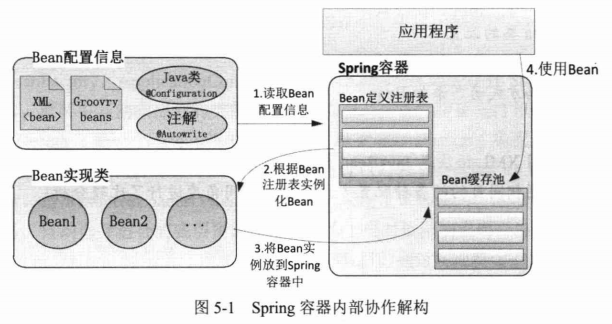

Bean配置信息首先定义了Bean的实现及依赖关系，Spring容器根据各种形式的Bean配置信息在容器内部建立Bean定义注册表；然后根据注册表加载、实例化Bean，并建立Bean和Bean之间的依赖关系；最后将这些准备就绪的Bean放到Bean缓冲池中，以供外层的应用程序进行调用。

### 5.1.2 基于XML的配置

对于基于XML的配置，Spring 1.0的配置文件采用DTD格式，Spring 2.0以后采用Schema格式，后者让不同类型的配置拥有了自己的命名空间，使得配置文件更具扩展性。此外，Spring基于Schema配置方案为许多领域的问题提供了简化的配置方法，配置工作因此得到了大幅简化。

采用基于Schema的配置格式，文件头的声明会复杂一些，先看一个简单的示例，如下：

```xml
<?xml version="1.0" encoding="UTF-8"?>
<beans
       xmlns="http://www.springframework.org/schema/beans"
       xmlns:xsi="http//www.w3.org/2001/XMLSchema-instance"
       xmlns:aop="http://www.springframework.org/schema/aop"
       xsi:schemaLocation=
       "http://www.springframework.org/schema/beans
        http://www.springframework.org/schema/beans/spring-beans-4.0.xsd
        http://www.springframework.org/schema/aop
        http://www.springframework.org/schema/aop/spring-aop-4.0.xsd">
    
    <!--默认命名空间的配置-->
    <bean id="foo" class="com.smart.Foo"/>
    
    <!--aop命名空间的配置-->
    <aop:config>
        <aop:advisor pointcut="execution(* *..PetStoreFacade.*(..))"
                     advice-ref="txAdvice"/>
    </aop:config>
</beans>
```

要了解文件头所声明的内容，需要学习一些XML Schema的知识。Schema在文档根节点中通过xmlns对文档所引用的命名空间进行声明。在上面的代码中定义了3个命名空间。

* 默认命名空间：它没有空间名，用于Spring Bean的定义。
* xsi标准命名空间：这个命名空间用于为每个文档中的命名空间指定响应的Schema样式文件，是W3C定义的标准命名空间。
* aop命名空间：这个命名空间是Spring配置AOP的命名空间，即一种自定义的命名空间。

命名空间的定义分为两个步骤：第一步指定命名空间的名称；第二步指定命名空间的Schema文档格式文件的位置，用空格或回车换行进行分隔。

在第一步中，需要指定命名空间的缩略名和全名，请看下面配置所定义的命名空间：

```xml
xmlns:aop="http://www.springframework.org/schema/aop"
```

aop为命名空间的别名，一般使用简洁易记的名称，文档后面的元素可通过命名空间别名加以区分，如`<aop:config/>`等。而http://www.springframework.org/schema/aop为空间的全限定名，习惯上用文档发布机构的官方网站和相关网站目录作为全限定名。这种命名方式既可以标识文档所属的机构，又可以很好地避免重名的问题。但从XML Schema语法来说，别名和全限定名都可以任意命名。

如果命名空间的别名为空，则表示该命名空间为文档默认命名空间。文档中无命名空间前缀的元素都属于默认命名空间，如`<beans/>`、`<bean/>`等都属于默认命名空间。

在第二步中，为每个命名空间指定了对应的Schema文档格式的定义文件，定义的语法如下：

```xml 
<命名空间1> <命名空间1Schema文件> <命名空间2> <命名空间2Schema文件> </命名空间2Schema文件>
```

命名空间使用全限定名，每个组织机构在发布Schema文件后，都会为该Schema文件提供一个引用的URL地址，一般使用这个URL地址指定命名空间对应的Schema文件。命名空间名称和对应的Schema文件地址之间使用空格或回车份额，不同的命名空间之间也使用这种分隔方法。

指定命名空间的Schema文件地址有两个用途：其一，XML解析器可以获取Schema文件并对文件进行格式合法性验证；其二，在开发环境下，IDE可以引用Schema文件对文档编辑提供诱导功能（自动补全功能）。当然，这个Schema文件的远程地址并非一定能访问，一般的IDE都提供了从本地路径查找Schema文件的功能，只有找不到时才从远程加载。

Spring 4.0配置的Schema文件放置在各模块JAR文件内一个名为config的目录下。表5-1对这些Schema文件的用途进行了说明。

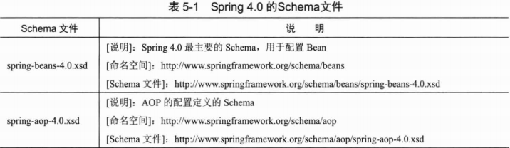

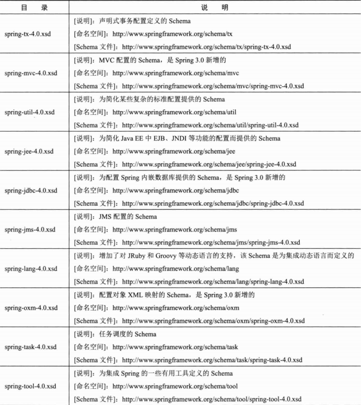

虽然Spring为AOP、声明事务、Java EE都提供了专门的Schema XML配置，但Spring也许继续使用低版本的基于DTD的XML配置方式。Spring 4.0配置的升级是向后兼容的，但我们强烈建议使用新的基于Schema的配置方式。

除支持XML配置方式外，Spring还支持基于注解、Java类及Groovy的配置方式，不同的配置方式在“质”上是基本相同的，只是存在“形”的区别。由于基于XML的配置方式是最基础、最传统的，所以我们主要以基于XML的配置方式讲解Spring的配置，其他3种配置方式则作简要介绍。

## 5.2 Bean基本配置

在记下来Bean配置的详细讲解之前，先来了解一下Bean配置的基础知识，以快速建立起Bean配置的初步概念。

### 5.2.1 装配一个Bean

在Spring容器的配置文件中定义一个简要Bean的配置片段如图5-2所示。

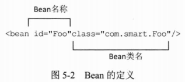

一般情况下，Spring IoC容器中的一个Bean对应配置文件中的一个`<bean>`，这种镜像映射关系应该容易理解。其中，id为这个Bean的名称，通过容器的getBean("foo")即可获取对应的Bean，在容器中起到定位查找的作用，是外部程序和Spring IoC容器进行交互的桥梁；class属性指定了Bean对应的实现类。

下面基于XML的配置文件定义了两个简单的Bean。

```xml
<?xml version="1.0" encoding="UTF-8"?>
<beans xmlns="http://www.springframework.org/schema/beans"
       xmlns:xsi="http://www.w3.org/2001/XMLSchema-instance"
       xsi:schemaLocation="http://www.springframework.org/schema/beans
       http://www.springframework.org/schema/beans/spring-beans-4.0.xsd">
    <bean id="car" class="com.smart.simple.Car"/>
    <bean id="boss" class="com.smart.simple.Boss"/>
</beans>
```

正如读者所看到的，这段配置信息提供了实例化Car和Boss这两个Bean必需的信息，Spring IoC容器完全可以据此创建这两个Bean的实例。

### 5.2.2 Bean的命名

一般情况下，在配置一个Bean时，需要为其指定一个id属性作为Bean的名称。id在IoC容器中必须是唯一的，而且id的命名需要满足XML对id的命名规范（id是XML规定的特殊属性）：必须以字母开始，后面可以是字母、数字、下画线、句号、冒号等完整结束（full stops）的符号，逗号和空格这些非完整结束符是非法的。在实际情况下，id命名约束并不会给用户带来影响，但如果用户确实希望用一些特殊字符进行Bean命名，则可以使用`<bean>`的name属性。name属性没有字符上的限制，几乎可以使用任何字符，如?ab、123等，

……

## 5.3 依赖注入

Spring支持两种依赖注入方式，分别是属性注入和构造函数注入。除此之外，Spring还支持工厂方法注入方式。在本节中，我们将了解到不同依赖注入方式的具体配置方法。

### 5.3.1 属性注入

属性注入指通过setXxx()方法注入Bean的属性值或依赖对象。由于属性注入方式具有可选择性和灵活性高的优点，因此属性注入是实际应用中最常采用的注入方式。

**1. 属性注入实例**

属性注入要求Bean提供一个默认的构造函数，并为需要注入的属性提供对应的Setter方法。Spring先调用Bean的默认构造函数实例化对象，然后通过反射的方式调用Setter方法注入属性值。来看一个简单的例子，如代码清单5-1所示。

```java
package com.smart.ditype;

/**
 * Car
 *
 * @author shenhuanjie
 * @date 2019/6/16 17:23
 */
public class Car {
    private int maxSpeed;
    public String brand;
    private double price;

    public int getMaxSpeed() {
        return maxSpeed;
    }

    public void setMaxSpeed(int maxSpeed) {
        this.maxSpeed = maxSpeed;
    }

    public String getBrand() {
        return brand;
    }

    public void setBrand(String brand) {
        this.brand = brand;
    }

    public double getPrice() {
        return price;
    }

    public void setPrice(double price) {
        this.price = price;
    }
}
```

Car类中定义了3个属性，并分别提供了对应的Setter方法。

> **提示**
>
> 默认构造函数是不带参的构造函数。Java语言规定，如果类中没有定义任何构造函数，则JVM会自动为其生成一个默认的构造函数；反之，如果类中显式定义了构造函数，则JVM不会为其生成默认的构造函数。所以假设Car类中显式定义了一个带参的构造函数，如public Car(String brand)，则需要同时提供一个默认的构造函数public Car()，否则使用属性注入时将抛出异常。

代码清单5-2是在Spring配置文件中对Car进行属性注入的配置片段。

```xml
<bean id="car" class="com.smart.ditype.Car">
    <property name="maxSpeed"><value>200</value></property>
    <property name="brand"><value>红旗CA72</value></property>
    <property name="price"><value>2000.00</value></property>
</bean>
```

**2. JavaBean关于属性命名的特殊规范**

Spring配置文件中`<property>`元素所指定的属性名和Bean实现类的Setter方法满足Sun JavaBean的属性命名规范：xxx的属性对应setXxx()方法。

一般情况下，Java的属性变量名都以小写字母开头，如maxSpeed、brand等，但也存在特殊的情况。考虑到一些特定意义的大写英文缩略词（如USA、XML等），JavaBean也允许以大写字母开头的属性变量名，不过必须满足“变量的前两个字母要么全部大写，要么全部小写”的要求，

### 5.3.2 构造函数注入

构造函数注入是除属性注入外的另一种常用的注入方式，它保证一些必要的属性在Bean实例化时就得到设置，确保Bean在实例化后就可以使用。

**1. 按类型匹配入参**

如果任何可用的Car对象都必须提供brand和price的值，若使用属性注入的方式，则只能认为地在配置时提供保证而无法在语法级提供保证，这时通过构造函数注入就可以很好地满足这一要求。使用构造函数注入的前提是Bean必须提供带参的构造函数。下面为Car提供一个可设置brand和price属性的构造函数。

```java
package com.smart.ditype;

/**
 * Car
 *
 * @author shenhuanjie
 * @date 2019/6/16 17:23
 */
public class Car {
    private int maxSpeed;
    public String brand;
    private double price;

    public Car(String brand, double price) {
        this.brand = brand;
        this.price = price;
    }

    public int getMaxSpeed() {
        return maxSpeed;
    }

    public void setMaxSpeed(int maxSpeed) {
        this.maxSpeed = maxSpeed;
    }

    public String getBrand() {
        return brand;
    }

    public void setBrand(String brand) {
        this.brand = brand;
    }

    public double getPrice() {
        return price;
    }

    public void setPrice(double price) {
        this.price = price;
    }
}
```

构造函数注入的配置方式和属性注入的配置方式有所不同，下面在Spring配置文件中使用构造函数注入的配置方式装配这个car Bean，如代码清单5-3所示。

```xml
<?xml version="1.0" encoding="UTF-8"?>
<beans xmlns="http://www.springframework.org/schema/beans"
       xmlns:xsi="http://www.w3.org/2001/XMLSchema-instance"
       xsi:schemaLocation="http://www.springframework.org/schema/beans http://www.springframework.org/schema/beans/spring-beans.xsd">
    <bean id="car" class="com.smart.ditype.Car">
        <constructor-arg type="java.lang.String">
            <value>红旗CA72</value>
        </constructor-arg>
        <constructor-arg type="double">
            <value>20000</value>
        </constructor-arg>
    </bean>
</beans>
```

在`<constructor-arg>`的元素中有一个type属性，它为Spring提供了判断配置项和构造函数入参对应关系“信息”。细心的读者可能会提出以下疑问：配置文件中`<bean>`元素的`<constructor-arg>`声明顺序难道不能用于确定的构造函数入参的顺序吗？在只有一个构造函数的情况下当然是可以的，但如果在Car中定义了多个具有相同入参的构造函数，这种顺序标识方法就失效了。此外，Spring的配置文件差利用和元素标签顺序无关的策略，这种策略可以在一定程度上保证配置信息的确定性，避免一些似是而非的问题。因此，`<constructor-arg>`位置并不会对最终的配置效果产生影响。

**2. 按索引匹配入参**

我们知道Java语言通过入参的类型及顺序区分不同的重载方法。对于代码清单5-3中的Car类，Spring仅通过type属性指定的参数类型就可以知道“红旗CA72”对应String类型的brand入参，而“2000”对应double类型的price入参。但是如果Car构造函数有两个类型相同的入参，那么仅通过type就无法确定对应关系了，这时需要通过入参索引的方式进行确定。

> **提示**
>
> 我们知道，在属性注入时，Spring按JavaBean规范找到配置属性所对应的Setter方法，并使用Java反射机制调用Setter方法完成属性注入。但Java反射机制并不会记住构造函数的入参名，因此我们无法通过指定构造函数的入参名进行构造函数注入的配置，只能通过入参类型和索引信息间接确定构函数配置项和入参的对应关系。

```java
public Car(String brand, String corp, double price) {
    this.brand = brand;
    this.price = price;
    this.corp = corp;
}
```

```xml
<bean id="car" class="com.smart.ditype.Car">
    <constructor-arg index="0" value="红旗CA72"/>
    <constructor-arg index="1" value="中国一汽"/>
    <constructor-arg index="2" value="20000"/>
</bean>
```

**3. 联合使用类型和索引匹配入参**

**4. 通过自身类型反射匹配入参**

当然，如果Bean构造函数入参的类型是可辨别的（非基础数据类型且入参类型各异），由于Java反射机制可以获取构造函数入参的类型，即使构造函数注入的配置不提供类型和索引的信息，Spring依旧可以正确地完成构造函数的注入工作。

**5. 循环依赖问题**

Spring容器能对构造函数配置的Bean进行实例化有一个前提，即Bean构造函数入参引用的对象必须已经准备就绪。由于这个机制的限制，如果两个Bean都采用构造函数注入，而且都通过构造函数入参引用对方，就会发生类似于线程死锁的循环依赖问题。

当启动Spring IoC容器时，因为存在循环依赖问题，Spring容器将无法成功启动。如何解决这个问题呢？用户只需修改Bean的代码，将构造函数注入方式调整为属性注入方式就可以了。

### 5.3.3 工厂方法注入

工厂方法是在应用中被经常使用的设计模式，它也是控制反转和单实例设计思想的主要实现方法。由于Spring IoC容器以框架的方式提供工厂方法的功能，并以透明的方式开放给开发者，所以很少需要手工编写基于工厂方法的类。正是因为工厂方法已经成为底层设施的一部分，因此工厂方法对于实际编码的重要性就降低了。不过在一些遗留系统或第三方类库中，我们还会遇到工厂方法，这时可以使用Spring工厂方法注入的方式进行配置。

**1. 非静态工厂方法**

有些工厂方法是非静态的，即必须实例化工厂类后才能调用工厂方法。下面为Car提供一个非静态的工厂类，如代码清单5-7所示。

```java
package com.smart.ditype;

/**
 * CarFactory
 *
 * @author shenhuanjie
 * @date 2019/6/17 9:25
 */
public class CarFactory {

    // 创建Car的工厂方法
    public Car createHongQiCar() {
        Car car = new Car();
        car.setBrand("红旗CA72");
        return car;
    }
}
```

工厂类负责创建一个或多个目标类实例，工厂类方法一般以接口或抽象类变量的形式返回目标类实例。工厂类对外屏蔽了目标类的实例化步骤，调用者甚至无须知道具体类是什么。在代码清单5-7中，CarFactory工厂类仅负责创建Car类型的对象，下面的配置片段使用CarFactory为Car提供工厂方法的注入，如代码清单5-8所示。

```xml
<!--工厂类Bean-->
<bean id="carFactory" class="com.smart.ditype.CarFactory"/>
<!--factory-bean指定定义的工厂类Bean：factory-method指定工厂类-->
<bean id="car" factory-bean="carFactory" factory-method="createHongQiCar"/>
```

由于CarFactory工厂类的工厂方法不是静态的，所以首先需要定义一个工厂类的Bean，然后通过factory-bean引用工厂类实例，最后通过factory-method指定对应的工厂类方法。

**2. 静态工厂方法**

很多工厂类方法都是静态的，这意味着用户在无须创建工厂类实例的情况下就可以调用工厂类方法，因此，静态工厂方法比非静态工厂方法更易使用。下面对CarFactory进行改造，将其createHongQiCar()方法调整为静态的，如代码清单5-9所示。

```java
package com.smart.ditype;

/**
 * CarFactory
 *
 * @author shenhuanjie
 * @date 2019/6/17 9:25
 */
public class CarFactory {

    // 创建Car的工厂方法
    public static Car createCar() {
        Car car = new Car();
        car.setBrand("红旗CA72");
        return car;
    }
}
```

当使用静态工厂类型的方法后，用户就无须在配置文件中定义工厂类的Bean，只需按以下方式进行配置即可：

```xml
<bean id="car" class="com.smart.ditype.CarFactory" factory-method="createCar"/>
```

直接在`<bean>`中通过class属性指定工厂类，然后再通过factory--method指定对应的工厂方法。

### 5.3.4 选择注入方式的考量

Spring提供了3种可供选择的注入方式，在实际应用中，究竟应该选择哪种注入方式呢？对于这个问题，仁者见仁，智者见智，并没有统一的标准。下面是支持使用构造函数注入的理由：

* 构造函数可以保证一些重要的属性在Bean实例化时就设置好，避免因为一些重要属性没有提供而导致一个无用Bean实例的情况。
* 不需要为每个属性提供Setter方法，减少了类的方法个数。
* 可以更好地封装类变量，不需要为每个属性指定Setter方法，避免外部错误的调用。

更多的开发者可能倾向于使用属性注入的方式，他们反对构造函数注入的理由如下：

* 如果一个类的属性众多，那么构造函数的签名将变成一个旁人庞然大物，可读性很差。
* 灵活性不强，在有些属性是可选的情况下，如果通过构造函数注入，也需要为可选的参数提供一个null值。
* 如果有多个构造函数，则需要考虑配置文件和具体构造函数匹配歧义的问题，配置上相对复杂。
* 构造函数不利于类的继承和扩展，因为子类需要引用父类复杂的构造函数。
* 构造函数注入有时会造成循环依赖的问题。

其实构造函数注入和属性注入各有自己的应用场景，Spring并没有强制用户使用哪一种方式，用户完全可以根据个人偏好做出选择，在某些情况下使用构造函数注入，而在另一些情况下使用属性注入。对于一个全新开发的应用来说，我们不推荐使用工厂方法的注入方式，因为工厂方法需要额外的类和代码，这些功能和业务是没有关系的，既然Spring容器已经以一种更优雅的方式实现了传统工厂模式的所有功能，那么我们大可不必再去做这项重复性的工作。

## 5.4 注入参数详解

在Spring配置文件中，用户不但可以将Spring、int等字面值注入Bean中，还可以将集合、Map等类型的数据注入Bean中，此外还可以注入配置文件中其他定义的Bean。

### 5.4.1 字面值

所谓“字面值”一般是指可用字符串表示的值，这些值可以通过`<value>`元素标签进行注入。在默认情况下，基本数据类型及其封装类、String等类型都可以采取字面值注入的方式。Spring容器在内部为字面值提供了编辑器，它可以将以字符串表示的字面值转换为内部变量的相应类型。Spring允许用户注册自定义的编辑器，以处理其他类型属性注入时的转换工作（关于自定义编辑器的内容，请参见第6章）。

在下面的示例中，我们为Car注入了两个属性值，并在Spring配置文件中使用字面值提供配置值，如代码清单5-10所示。

```xml
<bean id="car" class="com.smart.attr.Car">
    <property name="maxSpeed">
        <value>200</value>
    </property>
    <property name="brand">
        <value>
            <![CDATA[红旗&CA72]]>
        </value>
    </property>
</bean>
```

由于brand属性值包含一个XML的特殊符号，因此我们特意在属性值外添加了一个XML特殊标签`<![CDATA[]]>`。`<![CDATA[]]>`的作用是让XML解析器将标签中的字符串当作普通的文本对待，以防止特殊字符串对XML格式造成破坏。

XML中共有5个特殊的字符，分别是&、<、>、“、‘。如果配置文件中的注入值包括这些特殊字符，就需要进行特别处理。有两种解决方法：其一，采用本例中的`<![CDATA[]]>`特殊标签，将包含特殊字符的字符串封装起来；其二，使用XML转义序列表示这些特殊字符，这5个特殊字符所对应的XML转义序列在表2-5中进行了说明。

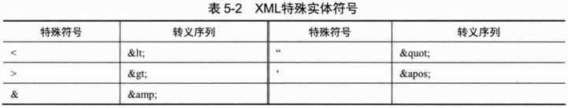

如果使用XML转义序列，则可以使用以下配置替换代码清单5-10中的配置。

```xml
<property name="brand">
    <value>红旗&amp;CA72</value>
</property>
```

### 5.4.2 引用其他Bean

Spring IoC容器中定义的Bean可以相互引用，IoC容器则充当“红娘”的角色。下面创建一个新的Boss类，Boss类中拥有一个Car类型的属性。

```java
package com.smart.attr;

/**
 * Boss
 *
 * @author shenhuanjie
 * @date 2019/6/17 10:09
 */
public class Boss {
    private Car car;

    /**
     * 设置Car属性
     *
     * @param car
     */
    public void setCar(Car car) {
        this.car = car;
    }
}
```

boss的Bean通过`<ref>`元素引用car Bean，建立起boss对car的依赖。

```xml
<!--car Bean-->
<bean id="car" class="com.smart.attr.Car"/>
<bean id="boss" class="com.smart.attr.Boss">
    <property name="car">
        <!--引用定义的car Bean-->
        <ref bean="car"></ref>
    </property>
</bean>
```

`<ref>`元素可以通过以下3个属性引用容器中的其他Bean。

* bean：通过该属性可以引用同一容器或父容器中的Bean，这是最常见的形式。
* local：通过该属性只能引用同一配置文件中定义的Bean，它可以利用XML解析器自动检验引用的合法性，以便开发人员在编写配置时能够及时发现并纠正配置错误。
* parent：引用父容器中的Bean，如`<ref parent="car">`的配置说明car的Bean是父容器中的Bean。

为了说明子容器对父容器中Bean的引用，我们来看一个具体的例子。假设有两个配置文件beans1.xml和bean2.xml，其中beans1.xml被父容器加载，其配置内容如下：

```xml
<!--在父容器中定义的car-->
<bean id="car" class="com.smart.attr.Car">
    <property name="brand" value="红旗CA72"/>
    <property name="maxSpeed" value="200"/>
    <property name="price" value="2000.00"/>
</bean>
```

而beans2.xml被子容器加载，其配置内容如下：

```xml
<!--该Bean和父容器的car Bean具有相同的id-->
<bean id="car" class="com.smart.attr.Car">
    <property name="brand" value="吉利CT5"/>
    <property name="maxSpeed" value="100"/>
    <property name="price" value="1000.00"/>
</bean>
<bean id="boss" class="com.smart.attr.Boss">
    <property name="car">
        <!--引用父容器中的car，而非定义的Bean。如果采用<ref bean="car"/>，则将引用本容器处的car-->
        <ref parent="car"/>
    </property>
</bean>
```

在beans1.xml中配置了一个car Bean，在bean2.xml中也配置了一个car Bean。分别通过父、子容器加载beans1.xml和beans2.xml，bean2.xml中的boss通过`<ref parent="car">`引用父容器中的car。

下面是分别使用父、子容器加载beans1.xml和beans2.xml配置文件的代码：

```java
package com.smart.attr;

import org.springframework.context.ApplicationContext;
import org.springframework.context.support.ClassPathXmlApplicationContext;
import org.testng.annotations.*;
import static org.testng.Assert.*;

public class ParentContainerBeanTest {

    @Test
    public void parent() {
        ClassPathXmlApplicationContext pFactory = new ClassPathXmlApplicationContext(
                new String[] { "com/smart/attr/beans1.xml" });
        ApplicationContext factory = new ClassPathXmlApplicationContext(new String[] { "com/smart/attr/beans2.xml" },
                pFactory);
        Boss boss = (Boss) factory.getBean("boss");
        assertNotNull(boss);
        System.out.println(boss.getCar().toString());
    }
}

```

运行这段代码，在控制台中打印出以下信息：

```
brand:红旗CA72/maxSpeed:200/price:2000.0
```

### 5.4.3 内部Bean

如果car Bean只被boss Bean引用，而不被容器中任何其他的Bean引用，则可以将car以内部Bean的方式注入Boss中。

```xml
<bean id="boss" class="com.smart.attr.Boss">
    <property name="car">
        <bean class="com.smart.attr.Car">
            <property name="maxSpeed" value="200"/>
            <property name="price" value="2000.00"/>
        </bean>
    </property>
</bean>
```

内部Bean和Java的匿名内部类相似，既没有名字，也不能被其他Bean引用，只能在声明处为外部Bean提供实例注入。

内部Bean即使提供了id、name、scope属性，也会被忽略，scope默认为prototype类型。关于Bean的作用域，将在5.8节进行详细介绍。

### 5.4.4 null值

如果用户尝试通过以下配置方式为car的brand属性注入一个null值，那么将会得到一个失望的结果。

```xml
<bean id="car" class="com.smart.attr.Car">
    <property name="brand">
    	<value></value>
    </property>
</bean>
```

Spring会将`<value></value>`解析为空字符串。那么，如何为属性设置一个null注入值呢？答案是必须使用专用的`<null/>`元素标签，通过它可以为Bean的字符串或其他对象类型的属性注入null值。

```xml
<property name="brand"><null/></property>
```

上面的配置代码等同于调用car.setBrand(null)方法。

### 5.4.5 级联属性

和Struts、Hibernate等框架一样，Spring支持级联属性的配置。假设我们希望在定义Boss时直接为Car的属性提供注入值，则可以采用以下配置方式：

```xml
<bean id="boss" class=com.smart.attr.Boss>
    <property name="car.brand" value="吉利CT50"/>
</bean>
```

按照上面的配置，Spring将调用Boss.getCar().setBrand("吉利CT50")方法进行属性的注入操作。这时必须对Boss类进行改造，为car属性声明一个初始化对象。

```java
public class Boss{
    private Car car=new Car();
    public Car getCar(){
        return car;
    }
    public void setCar(Car car){
        this.car=car;
    }
}
```

为Boss的car属性提供了一个非空的Car实例。如果没有为car属性提供Car对象，那么Spring在设置级联属性时将抛出NullValueNestedPathException异常。

Spring没有对级联属性的层级数进行限制，只要配置的Bean拥有对应于级联属性的类结构，就可以配置任意层级的层级属性，如`<property name="car.wheel.brand" value="双星"/>`定义了具有三级结构的层级属性。

### 5.4.6 集合类型属性

java.util包中的集合类型是最常见的数据结构类型，主要包括List、Set、Map、Properties，Spring为这些集合类型属性提供了专属的配置标签。

**1. List**

为Boss添加一个List类型的favorites属性，如下：

```java
package com.smart.attr;
...
public class Boss{
    private List favorites=new ArrayList();
    public List getFavorites(){
        return favorites;
    }
    public void setFavorites(List favorites){
        this.favorites=favorites;
    }
    ...
}
```

对应Spring中的配置片段如下：

```xml
<bean id="boss" class="com.smart.attr.Boss">
    <property name="favorites">
        <list>
            <value>看报</value>
            <value>赛车</value>
            <value>高尔夫</value>
        </list>
    </property>
</bean>
```

List属性既可以通过`<value>`注入字符串，也可以通过`<ref>`注入容器中其他的Bean。

> **提示**
>
> 假设一个属性类型可以通过字符串字面值进行配置，那么该类型对应的数组类型的属性（如String[]、int[]等）也可以采用`<list>`方式进行配置。

**2. Set**

如果Boss的favorites属性是java.util.Set，则采用如下配置方式：

```xml
<bean id="boss" class="com.smart.attr.Boss">
    <property name="favorites">
        <set>
            <value>看报</value>
            <value>赛车</value>
            <value>高尔夫</value>
        </set>
    </property>
</bean>
```

**3. Map**

下面为Boss添加一个Map类型的jobs属性：

```java
public class Boss{
    ...
    private Map jobs=new HashMap();
    public Map getJobs(){
        return jobs;
    }
    public void setJobs(Map jobs){
        this.jobs=jobs;
    }
    ...
}
```

在配置文件中可以通过以下方式为jobs属性提供配置值：

```xml
<bean id="boss" class="com.smart.attr.Boss">
    <property name="jobs">
        <map>
            <entry>
                <key>
                    <value>AM</value>
                </key>
                <value>会见客户</value>
            </entry>
            <entry>
                <key>
                    <value>PM</value>
                </key>
                <value>公司内部会议</value>
            </entry>
        </map>
    </property>
</bean>
```

假如某一Map元素的键和值都是对象，则可以采取以下配置方式：

```xml
<entry>
    <key>
        <ref bean="keyBean"/>
    </key>
    <ref bean="valueBean"/>
</entry>
```

**4. Properties**

Properties类型其实可以看作Map类型的特例。Map元素的键和值可以是任何类型的对象，而Properties属性的键和值都只能是字符串。下面为Boss添加一个Properties类型的mails属性：

```java
public class Boss{
    ...
    private Properties mails=new Properties();
    public Properties getMails(){
        return mails;
    }
    public void setMails(Properties mails){
        this.mails=mails;
    }
    ...
}
```

下面的配置片段为mails提供了配置：

```xml
<bean id="boss" class="com.smart.attr.Boss">
    <property name="mails">
        <props>
            <prop key="jobMail">john-office@smart.com</prop>
            <prop key="lifeMail">john-life@smart.com</prop>
        </props>
    </property>
</bean>
```

因为Properties键值对只能是字符串，因此其配置比Map的配置要简单一些，注意值的配置没有`<value>`子元素标签。

**5. 强类型集合**

Java 5.0 提供了强类型集合的新功能，允许为集合元素指定类型。如下面Boss类中的jobTime属性就采用了强类型的Map类型，元素的键为String类型，而值为Integer类型。

```java
public class Boss {
    ...
    private Map<String,Integer>jobTime=new HashMap<String,Integer>();
    public Map<String,Integer>getJobTime(){
        return jobTime;
    }
    public void setJobTime(Map<String,Integer>jobTime){
        this.jobTime=jobTime;
    }
    ...
}
```

在Spring中的配置和非强类型集合相同，如代码清单5-11所示。

```xml
<bean id="boss" class="com.smart.attr.Boss">
    <property name="jobTime">
        <map>
            <entry>
                <key><value>会见客户</value></key>
                <value>124</value>
            </entry>
        </map>
    </property>
</bean>
```

但Spring容器在注入强类型集合时会判断元素的类型，将设置值转换为对应的数据类型。如代码清单5-11中的设置项124将被转换为Integer类型。

**6. 集合合并**

Spring支持集合合并的功能，允许子`<bean>`继承父`<bean>`的同名属性集合元素，并将子`<bean>`中配置的集合属性值和父`<bean>`中配置的同名属性值合并起来作为最终Bean的属性值，如代码清单5-12所示。关于父子`<bean>`的内容，请参见5.6.1节。

```xml
<bean id="parentBoss" abstract="true"
      class="com.smart.attr.Boss">
    <property name="favorites">
        <set>
            <value>看报</value>
            <value>赛车</value>
            <value>高尔夫</value>
        </set>
    </property>
</bean>
<bean id="childBoss" parent="parentBoss">
    <property name="favorites">
        <set merge="true">
            <value>爬山</value>
            <value>游泳</value>
        </set>
    </property>
</bean>
```

在代码清单5-12中，通过merge="true"属性指示子`<bean>`和父`<bean>`中的同名属性值进行合并，即子Bean的favorites集合最终将拥有5个元素。如果设置为merge=“false"，则不会和父`<bean>`中的同名集合属性进行合并，即子Bean的favorites属性集合只有两个元素。

**7. 通过util命名空间配置集合类型的Bean**

如果希望配置一个集合类型的Bean，而非一个集合类型的属性，则可以通过util命名空间进行配置。首先需要在Spring配置文件头中引入util命名空间的声明。

```xml
<?xml version="1.0" encoding="UTF-8"?>
<beans xmlns="http://www.springframework.org/schema/beans"
       xmlns:xsi="http://www.w3.org/2001/XMLSchema-instance"
       xmlns:util="http://www.springframework.org/schema/util"
       xsi:schemaLocation="http://www.springframework.org/schema/beans 
                           http://www.springframework.org/schema/beans/spring-beans-4.0.xsd
                           http://www.springframework.org/schema/util
                           http://www.springframework.org/schema/util/spring-util-4.0.xsd">
    ...
</beans>
```

其次配置一个List类型的Bean，可以通过list-class显示指定List的实现类。

```xml
<util:list id="favoriteList" list-class="java.util.LinkedList">
    <value>看报</value>
    <value>赛车</value>
    <value>高尔夫</value>
</util:list>
```

再次配置一个Set类型的Bean，可以通过set-class指定Set的实现类。

```xml
<util:set id="favoriteSet">
    <value>看报</value>
    <value>赛车</value>
    <value>高尔夫</value>
</util:set>
```

最后配置一个Map类型的Bean，可以通过map-class指定Set的实现类。

```xml
<util:map id="emails">
    <entry key="AM" value="会见客户"/>
    <entry key="PM" value="公司内部会议"/>
</util:map>
```

此外，`<util:list>`和`<util:set>`支持value-type属性，指定集合中的值类型；而`<util:map>`支持key-type和value-type属性，指定Map的键和值类型。

### 5.4.7 简化配置方式

前面几节我们采用完整配置格式的配置方式，也许读者已经发现这种方式显得比较拖沓。Spring为字面值、引用Bean和集合都提供了简化的配置方式。如果没有用到完整配置格式的特殊功能，用户大可使用简化的配置方式。下面分别为上面提及的配置内容给出简化前和简化后的版本。

**1. 字面值属性**

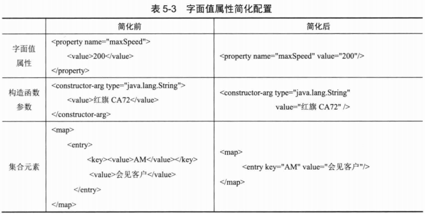

如果使用简化的方式，则将无法使用`<![CDATA[]]>`处理XML特殊字符，只能用XML转义序列对特殊字符进行转换，如`value="红旗&amp;CA72"`。

**2. 引用对象属性**

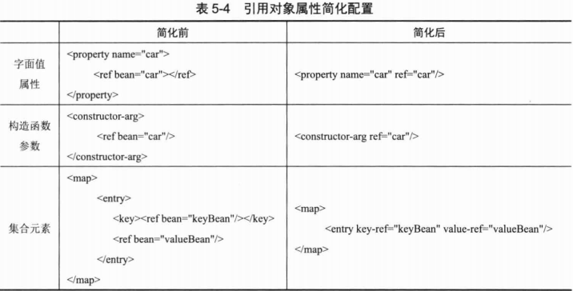

`<ref>`的简化形式对应于`<ref bean="xxx">`，而`<ref local="xxx">`和`<ref parent="xxx">`则没有对应的简化形式。

**3. 使用p命名空间**

为了简化XML文件的配置，越来越多的XML文件采用属性而非子元素配置信息。Spring从2.5版本开始引入了一个新的p命名空间，可以通过`<bean>`元素属性的方式配置Bean的属性。使用p命名空间后，基于XML的配置方式将一步简化。

使用p命名空间前，如代码清单5-13所示。

```xml
<?xml version="1.0" encoding="UTF-8" ?>
<beans xmlns="http://www.springframework.org/schema/beans"
       xmlns:xsi="http://www.w3.org/2001/XMLSchema-instance"
       xsi:schemaLocation="http://www.springframework.org/schema/beans
                           http://www.springframework.org/schema/beans/spring-beans-4.0.xsd">
    <bean id="car" class="com.smart.ditype.Car">
        <property name="brand" value="红旗&amp;CA72"/>
        <property name="maxSpeed" value="200"/>
        <property name="price" value="20000.00"/>
    </bean>
    <bean id="boss" class="com.smart.ditype.Boss">
        <property name="car" ref="car"/>
    </bean>
</beans>
```

使用p命名空间后，如代码清单5-14所示。

```xml
<?xml version="1.0" encoding="UTF-8" ?>
<beans xmlns="http://www.springframework.org/schema/beans"
       xmlns:xsi="http://www.w3.org/2001/XMLSchema-instance"
       xmlns:p="http://www.springframework.org/schema/p"
       xsi:schemaLocation="http://www.springframework.org/schema/beans
                           http://www.springframework.org/schema/beans/spring-beans-4.0.xsd">
    <bean id="car" class="com.smart.ditype.Car"
          p:brand="红旗&amp;CA72"
          p:maxSpeed="200"
          p:price="20000.00"/>
    <bean id="boss" class="com.smart.ditype.Boss"
          p:car-ref="car"/>
</beans>
```

未采用p命名空间前，`<bean>`使用`<property>`子元素配置Bean的属性；采用p命名空间后，采用`<bean>`的元素属性配置Bean的属性。

对于字面值属性，其格式为：

```xml
p:<属性名>="xxx"
```

对于引用对象的属性，其格式为：

```xml
p:<属性名>-ref="xxx"
```

正是由于p命名空间中的属性名是可变的，所以p命名空间没有对应的Schema定义文件，也就无须在xsi:schemaLocation中为p命名空间指定Schema定义文件。

> **实战经验**
>
> 在IDEA开发工具中，对Spring配置文件默认提供诱导功能，对于p命名空间的属性配置，只要输入p:就能动态分析Bean类的属性列表，开发者只要诱导选择即可。对于其他的开发工具，如Eclipse，需要安装Spring IDE for Eclipse插件，并按Alt+/组合键才能诱导。

### 5.4.8 自动装配

Spring IoC容器知道所有Bean的配置信息，此外，通过Java反射机制还可以获知实现类的结构信息，如构造函数方法的结构、属性等信息。掌握所有Bean的这些信息后，Spring IoC容器就可以按照某种规则对容器中的Bean进行自动装配，而无须通过显式的方式进行依赖配置。Spring为厌恶配置的开发人员提供了一种轻松的方法，可以按照某些规则进行Bean的自动装配。

`<bean>`元素提供了一个指定自动装配类型的属性：`autowire="<自动装配类型>"`。Spring提供了4种自动装配类型，用户可以根据具体情况进行选择，如表5-5所示。

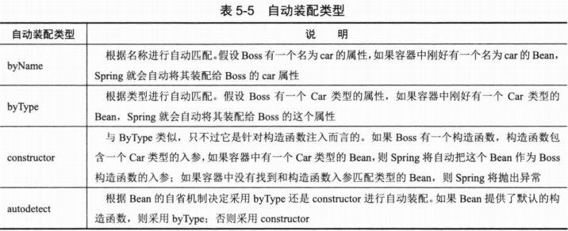

`<beans>`元素标签中的default-autowire属性可以配置全局自动匹配，default-autowire属性的默认值为no，表示不启用自动装配；其他几个可选配置值分别为byName、byType、constructor和autodetect，这几个配置值的含义是不言自明的。不过在`<beans>`中定义的自动装配策略可以被`<bean>`的自动装配策略覆盖。

自动装配以四两拨千斤的方式完成容器中Bean之间的装配工作，这种省心省力的自动装配机制确实省却了大量配置工作。在实际开发中，XML配置方式很少启用自动装配功能，而基于注解的配置方式默认采用byType自动装配策略。

## 5.5 方法注入

无状态Bean的作用域一般可以配置为singleton（单例模式），如果我们往singleton的Boss中注入prototype的Car，并希望每次调用boss Bean的getCar()方法时都能够返回一个新的car Bean，使用传统的注入方式将无法实现这样的要求。因为singleton的Bean注入关联Bean的动作仅有一次，虽然car Bean的作用范围是prototype类型，但Boss通过getCar()方法返回的对象还是最开始注入的那个car Bean。

如果希望每次调用getCar()方法都返回一个新的car Bean的实例，一种可选的方法就是让Boss实现BeanFactoryAware接口，且能够访问容器的引用，这样Boss的getCar()方法就可以采取以下实现方式来达到目的：

```java
public Car getCar(){
    // 通过getBean()返回prototype的Bean，每次都将返回新实例
    return (Car)factory.getBean("car");
}
```

但在第4章中指出，这种依赖Spring框架接口的设计将应用与Spring框架绑定在一起，部分开发者可能并喜欢。针对前面提出的需求，是否有既不与Spring框架绑定，又可享受依赖注入好处的实现方案？Spring没有让我们失望，可以通过方法注入的方案完美地解决这个问题。

### 5.5.1 lookup方法注入

Spring IoC容器拥有复写Bean方法的能力，这项魔术般的功能归功于CGLib类包。CGLib可以在运行期动态操作Class字节码，为Bean动态创建子类或实现类。关于CGLib的进一步介绍，请参见第7章。

现在声明一个MagicBoss接口，并声明一个getCar()的接口方法。

```java
package com.smart.injectfun;
public interface MagicBoss{
    Car getCar();
}
```

下面不编写任何实现类，仅通过配置为该接口提供动态实现，让getCar()接口方法每次都返回新的car Bean。

```xml
<bean id="car" class="com.smart.injectfun.Car"
      p:brand="红旗CA72"
      p:price="2000"
      scope="prototype"/>
<bean id="magicBoss" class="com.smart.injectfun.MagicBoss">
    <lookup-method name="getCar" bean="car"/>
</bean>
```

通过lookup-method元素标签为MagicBoss的getCar()提供动态实现，返回prototype类型的car Bean，这样Spring将在运行期为MagicBoss接口提供动态实现，其效果等同于：

```java
package com.smart.injectfun;

public class MagicBossImpl implements MagicBoss, ApplicationContextAware{
    private ApplicationContext ctx;
    public Car getCar(){
        return (Car)ctx.getBean("car");
    }
    public void setApplicationContext(ApplicationContext ctx)throws BeansException{
        this.ctx=ctx;
    }
}
```

因为每次调用MagicBoss的getCar()方法都会从容器中获取car Bean，由于car Bean的作用域为prototype，所以每次都返回新的car实例。

如果将car Bean的作用域设置为singleton，虽然以上配置仍然可以运行，但这时lookup所提供的方法注入就没有意义了。因为我们可以容易地编写一个MagicBoss接口实现类，用属性注入的方式达到相同的目的。所以lookup方法注入是有一定使用范围的，一般在希望通过一个singleton Bean获取一个prototype Bean时使用。

> **提示：**
>
> 由于方法注入时Spring需要用到CGLib类包，所以需要将CGLib类包加入到类路径中，否则无法使用方法注入的功能。

### 5.5.2 方法替换

在金庸笔下，“乾坤大挪移”是明教至高无上的神功，在《倚天屠龙记》里会九阳神功的张无忌最终修成了正果。在Spring IoC容器里，用户同样可以拥有这种“乾坤大挪移”的能力：可以使用某个Bean的方法去替换另一个Bean的方法。

在下面的例子中，Boss的个体Car()方法返回一辆宝马Z4。

```java
package com.smart.injectfun;
public class Boss{
    public Car getCar(){
        Car car = new Car();
        car.setBrand("宝马Z4");
        return car;
    }
}
```

Boss实现了Spring的org.springframework.beans.factory.support.MethodReplacer接口，在接口方法reimplement()中，返回一辆美人豹。

```java
package com.smart.injectfun;
import java.lang.reflect.Method;
import org.springframework.beans.factory.support.MethodReplacer;
public class Boss implements MethodReplacer{
    public Object reimplement(Object arg0,Method arg1,Object[] arg2)throws Throwable{
        Car car= new Car();
        car.setBrand("美人豹");
        return car;
    }
}
```

用于替换他人的Bean必须实现MethodReplacer接口，Spring将利用该接口的方法去替换目标Bean的方法。下面通过Spring IoC容器的“乾坤大挪移"术，用Boss的方法去替换Boss的getCar()方法。

```xml
<bean id="boss1" class="com.smart.injectfun.Boss1">
    <replaced-method name="getCar" replacer="boss1"/>
</bean>
<bean id="boss2" class="com.smart.injectfun.Boss2"></bean>
```

当从容器中返回boss1 Bean并调用其getCar()方法时，将返回一辆“美人豹”的Car，调包成功。

但这种高级功能就像《宋玉答楚王问》中所说的阳春白雪一样，在实际应用中很少使用，而属性注入、构造函数注入等“下里巴人”式的普通功能反而在实际项目总工使用最多。

## 5.6 `<bean>`之间的关系

不但可以通过`<ref>`引用另一个Bean，建立起Bean和Bean之间的依赖关系，`<bean>`元素标签之间也可以建立类似的关系，完成一些特殊的功能。

### 5.6.1 继承

OOP思想告诉我们，如果多个类拥有相同的方法和属性，则可以引入一个父类，在父类中定义这些类共同的方法和属性，以消除重复的代码。同样，如果多个`<bean>`存在相同的配置信息，则Spring允许定义一个父`<bean>`，子`<bean>`将自动继承父`<bean>`的配置信息。

下面通过一个实例，对使用和未使用父子`<bean>`的配置进行比较，从中看出父子`<bean>`给配置带来的便利性，如代码清单5-15所示。

```xml
<bean id="car1" class="com.smart.tagdepend.Car"
      p:brand="红旗CA72"
      p:price="2000.00"
      p:color="黑色"/>
<bean id="car2" class="com.smart.tagdepend.Car"
      p:brand="红旗CA72"
      p:price="2000.00"
      p:color="红色"/>
```

代码清单5-15中配置了两个car Bean，我们发现这两个Bean的配置存在大量的重复信息。事实上，二者除了color属性配置值不一样外，其他配置信息都相同。通过父子`<bean>`的继承关系就可以很好地消除这种重复的配置信息，如代码清单5-16所示。

```xml
<bean id="abstractCar" class="com.smart.tagdepend.Car"
      p:brand="红旗CA72"
      p:price="2000.00"
      p:color="黑色"
      abstract="true"/>
<bean id="car3"
      p:color="红色"
      parent="abstractCar"/>
<bean id="car4"
      p:color="白色" 
      parent="abstractCar"/>
```

在代码清单5-16中，car3和car4这两个`<bean>`都继承于abstractCar的`<bean>`，Spring会将父`<bean>`的配置信息传递给子`<bean>`。如果子`<bean>`提供了父`<bean>`已有的配置信息，那么子`<bean>`的配置信息将覆盖父`<bean>`的配置信息。

父`<bean>`的主要功能是简化子`<bean>`的配置，所以一般声明为abstract="true"，表示这个`<bean>`不实例化为一个对应的Bean。在代码清单5-16处，如果用户没有指定abstract="true"，则Spring IoC容器会实例化一个名为abstractCar的Bean。

### 5.6.2 依赖

一般情况下，可以使用`<ref>`元素标签建立对其他Bean的依赖关系，Spring负责管理这些Bean的关系。当实例化一个Bean时，Spring保证该Bean所依赖的其他Bean已经初始化。

但在某些情况下，这种Bean之间的依赖关系并不那么明显。下面举一个例子。“小春论坛”拥有很多系统参数（如会话过期时间、缓存更新时间等），这些系统参数用于控制系统的运行逻辑。我们用一个SystemSettings类表示这些系统参数。

```java
public class SystemSettings{
    public static int SESSION_TIMEOUT=30;
    public static int REFRESH_CYCLE=60;
    ...
}
```

在SystemSettings类中为每个系统参数提供了默认值，但一个灵活的论坛必须提供一个管理后台，在管理后台中可以调整这些系统参数并保存到后台数据库中，在系统启动时，初始化程序从数据库后台加载这些系统参数的配置值以覆盖默认值。

```java
public class SysInt{
    public SysInt(){
        SystemSettings.SESSION_TIMEOUT=10;
        SystemSettings.REFRESH_CYCLE=100;
    }
}
```

假设论坛有一个缓存刷新管理器，它需要根据系统参数SystemSettings.REFRESH_CYCLE创建缓存刷新定时任务。

```java
public class CacheManager{
    public CacheManager(){
        Timer timer=new Timer();
        TimeTask cacheTask=new CacheTask();
        timer.schedule(cacheTask,0,SystemSettings.REFRESH_CYCLE);
    }
}
```

在以上实例中，CacheManager依赖于SystemSettings，而SystemSettings的值由SysInit负责初始化。虽然CacheManager不直接依赖于SysInit，但从逻辑上看，CacheManager希望在SysInit加载并完成系统参数设置后再启动，以避免调用不到真实的系统参数值。如果这3个Bean都在Spring配置文件中定义，那么如何保证SysInit在CacheManager之前进行初始化呢？

Spring允许用户通过depends-on属性显式指定Bean前置依赖的Bean，前置依赖的Bean会在本Bean实例化之前创建好。

```xml
<bean id="manager" class="com.smart.tagdepend.CacheManager"
      depends-on="sysInit"/>
<bean id="sysInit" class="com.smart.tagdepend.SysInit"/>
```

通过depends-on属性将sysInit指定为manager前置依赖的Bean，这样就可以保证manager Bean在实例化并运行时所引用的系统参数是最新的设置值，而非SystemSettings类中的默认值。如果前置依赖于多个Bean，则可以通过逗号、空格或分号的方式创建Bean的名称。

### 5.6.3 引用

假设一个`<bean>`要引用另一个`<bean>`的id属性值，则可以直接使用以下配置方式：

```xml
<bean id="car" class="com.smart.tagdepend.Car"/>
<bean id="boss" class="com.smart.tagdepend.Boss"
      p:carId="car" scope="prototype"/>
```

假设希望将boss Bean的carId设置为`<bean>`的id值，虽然可以通过以字面值的形式进行设置，但二者之前并没有建立引用关系。一般情况下，在一个Bean中引用另一个Bean的id是希望在运行期通过getBean(beanName)方法获取对应的Bean。由于Spring并不会在容器启动时对属性配置值进行特殊检查，因此，即使编写错误，也需要等到具体调用时才会发现。

Spring为此提供了一个`<idref>`元素标签，可以通过`<idref>`引用另一个`<bean>`的名字。在容器启动时，Spring负责检查引用关系的正确性，这样就可以提前发现错误。因此，下面的配置是推荐的优化方案：

```xml
<bean id="car" class="com.smart.tagdepend.Car"/>
<bean id="boss" class="com.smart.tagdepend.Boss">
    <property name="carId">
        <idref bean="car"/>
    </property>
</bean>
```

假设由于配置错误，误将`<idref bean="car"/>`写为`<idref bean="car"/>`，那么Spring容器在启动时，将会抛出BeanDefinitionStoreException，提示容器中没有名为cat的Bean。

如果引用者和被引用者的`<bean>`位于同一个XML配置文件中，则可以使用`<idref local="car">`的配置方式，这时IDE的XML分析器就可以在开发期发现引用错误了。

## 5.7 整合多个配置文件

对于一个大型应用来说，可能存在多个XML配置文件，在启动Spring容器时，可以通过一个String数组指定这些配置文件。Spring还允许通过`<import>`将多个配置文件引入到一个文件中，进行配置文件的基础。这样，在启动Spring容器时，仅需指定这个合并好的配置文件即可。代码清单5-17是beans2.xml的配置文件，它引入了bean1.xml配置文件。

```xml
<import resource="classpath:com/smart/impt/beans1.xml"/>
<bean id="boss1" class="com.smart.fb.Boss" p:name="John" p:car-ref="car1"/>
<bean id="boss2" class="com.smart.fb.Boss" p:name="John" p:car-ref="car2"/>
```

假设已经在beans1.xml中配置了car1和car2的Bean，通过`<import>`的resource属性引入beans1.xml，beans2.xml就拥有了完整的配置信息，Spring容器仅需通过beans2.xml就可以加载所有的配置信息。

需要指出的是，如果一个配置文件a.xml定义的`<bean>`引用了另一个配置文件b.xml定义的`<bean>`，那么并不一定需要通过`<import>`引入b.xml，只需在启动Spring容器时，a.xml和b.xml都在配置文件列表中即可。区别在于，如果a.xml采用import引入了b.xml，相当于a.xml一个文件就包含了a.xml和b.xml两个文件的内容，因此Spring容器启动时仅需加载a.xml即可；否则就需要在启动Spring容器时，同时加载a.xml和b.xml配置文件，以便在内存中对a.xml和b.xml进行合并。

一个XML配置文件可以通过`<import>`组合多个外部的配置文件，resource属性支持Spring标准的资源路径，常见4-3节的说明。

> **实战经验**
>
> 对于大型应用来说，为了防止开发时配置文件的资源竞争，或者为了使模块便于拆卸，往往每个模块都拥有自己独立的配置文件。应用层面提供了一个整合的配置文件，通过`<import>`将各个模块整合起来。这样，在容器启动时，只需加载这个整合的配置文件即可。

## 5.8 Bean作用域

在配置文件中定义Bean时，用户不但可以配置Bean的属性值及相互之间的依赖关系，还可以定义Bean的作用域。作用域将对Bean的生命周期和创建方式产生影响。表5-6列出了Spring 4.0 支持的所有作用域类型。

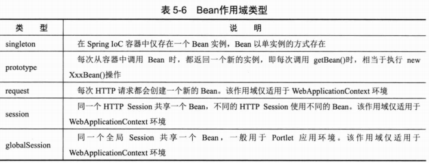

在低版本的Spring中，仅支持两个Bean作用域，所以采用singleton=“true|false"的配置方式。Spring为了向后兼容，依然支持这种配置方式。不过，Spring推荐采用新的配置方式：scope=”<作用域类型>“。

除了以上5种预定义的Bean作用域外，Spring还允许用户自定义Bean的作用域。可以先通过org.springframework.beans.factory.config.Scope接口定义新的作用域，再通过org.springframework.beans.factory.config.CustomScopeConfigurer这个BeanFactoryPostProcessor注册自定义的Bean作用域。在一般的应用中，Spring所提供的作用域已经能够满足应用的要求，用户很少需要自定义新的Bean作用域。所以本书不对此进行深入讲解，感兴趣的读者可以自行阅读Scope接口的Javadoc文档。

### 5.8.1 singleton作用域

单例模式是重要的设计模式之一。在传统的应用开发中，需要手工为每个单实例类编写特定代码，在这种情况下，类的业务逻辑代码和模式代码紧密耦合在一起。Spring以容器的方式提供天然的单例模式功能，任何POJO无须编写特殊的代码，仅通过配置就可以享用单例模式的“大餐”。

一般情况下，无状态或者状态不可变的类适合使用单例模式，不过Spring对此实现了超越。在传统开发中，由于DAO类持有Connection这个非线程安全的变量，因此往往未采用单例模式。而在Spring环境中，对于所有的DAO类都可以采用单例模式，因为Spring利用AOP和LocalThread功能，对非线程安全的变量（或称状态）进行了特殊处理，使这些非线程安全的类变成了线程安全的类（将在第7章介绍这一功能的内部机理）。

因为Spring的这一超越，所以在实际应用中，大部分Bean都能以单实例的方式运行，这也是为什么Spring将Bean的默认作用域定位singleton的原因。

singleton的Bean在同一Spring IoC容器中只有一个实例，请看下面的例子：

```xml
<bean id="car" class="com.smart.scope.Car" scope="singleton"/>
<bean id="boss1" class="com.smart.scope.Boss" p:car-ref="car"/>
<bean id="boss2" class="com.smart.scope.Boss" p:car-ref="car"/>
<bean id="boss3" class="com.smart.scope.Boss" p:car-ref="car"/>
```

car Bean声明为singleton（因为默认是singleton，所以无须显式指定），在容器中有3个其他Bean引用了car Bean。在容器内部，boss1、boss2和boss3的car属性都指向同一个Bean，如图5-3所示。

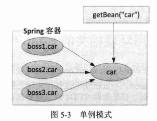

不但在配置文件中通过配置注入的car引入相同的car Bean，任何通过容器的getBean("car")方法返回的实例也指向同一个Bean。

在默认情况下，Spring的ApplicationContext容器在启动时，自动实例化所有singleton的Bean并缓存于容器中。虽然启动时会花费一些时间，但它带来两个好处：首先，对Bean提前进行实例化操作会及早发现一些潜在的配置问题；其次，Bean以缓存的方式保存，当运行时用到该Bean时无须再实例化了，提高了运行的效率。如果用户不希望在容器启动时提前实例化singleton的Bean，则可以通过lazy-init属性进行控制。

```xml
<bean id="boss1" class="com.smart.scope.Boss" p:car-ref="car" lazy-init="true"/>
```

lazy-init="true"的Bean在某些情况下依然会提前实例化：如果该Bean被其他需要提前实例化的Bean所引用，那么Spring将忽略延迟实例化的设置。

### 5.8.2 prototype作用域

采用scope="prototype"指定非单例作用域的Bean，请看下面的配置：

```xml
<bean id="car" class="com.smart.scope.Car" scope="prototype"/>
<bean id="boss1" class="com.smart.scope.Boss" p:car-ref="car"/>
<bean id="boss2" class="com.smart.scope.Boss" p:car-ref="car"/>
<bean id="boss3" class="com.smart.scope.Boss" p:car-ref="car"/>
```

通过以上配置，boss1、boss2、boss3所引用的都是一个新的car实例，每次通过容器的getBean("car")方法返回的也是一个新的car实例，如图5-4所示。

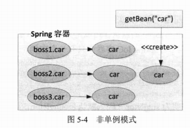

在默认情况下，Spring容器在启动时不实例化prototype的Bean。此外，Spring容器将prototype的Bean交给调用者后，就不再管理它的生命周期。

### 5.8.3 与Web应用环境相关的Bean作用域

如果用户使用Spring的WebApplicationContext，则可使用另外3种Bean的作用域：request、session和globalSessoin。不过在使用这些作用域之前，首先必须在Web容器中进行一些额外的配置。

**1. 在Web容器中进行额外配置**

在低版本的Web容器中（Servlet 2.3之前），用户可以使用HTTP请求过滤器进行配置。

```xml
<web-app>
    ...
    <filter>
        <filter-name>requestContextFilter</filter-name>
        <filter-class>org.springframework.web.filter.RequestContextFilter</filter-class>
        <filter-mapping>
            <filter-name>requestContextFilter</filter-name>
            <url-pattern>/*</url-pattern>
        </filter-mapping>
    </filter>
    ...
</web-app>
```

在高版本的Web容器中，则可以利用HTTP请求监听器进行配置。

```xml
<web-app>
    ...
    <listener>
        <listener-class>
            org.springframework.web.context.request.RequestContxtListener
        </listener-class>
    </listener>
    ...
</web-app>
```

细心的读者可能会有一个疑问：在第4章介绍WebApplicationContext初始化时，已经通过ConxtLoaderListener（或ContextLoaderServlet）将Web容器与Spring容器进行了整合，为什么在这里又要引入一个额外的RequestContextListener以支持Bean的另外3个作用域呢？通过分析两个监听器的源码，一切疑问就真相大白了，如图5-5所示。

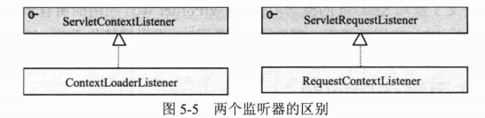

在整合Spring容器时使用ContextLoaderListener，它实现了ServletContextListener监听器接口，ServletContextListener只负责监听Web容器启动和关闭的事件。而RequestContextListener实现了ServletRequestListener监听器接口，该监听器监听HTTP请求事件，Web服务器接收的每一次请求都会通知该监听器。

Spring容器启动和关闭操作由Web容器的启动和关闭事件触发，但如果Spring容器中的Bean需要request、session和globalSession作用域的支持，Spring容器本身就必须获得Web容器的HTTP请求事件，以HTTP请求事件“驱动”Bean作用域的控制逻辑。也就是说，通过配置RequestContextListsner，Spring容器和Web容器的结合更加密切，Spring容器对Web容器中的“风吹草动”都能够察觉，因而就可以实施Web相应Bean作用域的控制了。

当然，Spring完全可以提供一个既实现ServletContextListener又实现ServletContextListener接口的监听器，这样我们仅需配置一次就可以了。探究Spring将二者分开的原因，可能出于两个方面的考虑：第一，考虑版本兼容的问题，毕竟针对Web应用的Bean作用域是从Spring2.0开始提供的；第二，这3种新增的Bean作用域的使用场合并不多，用户往往并不真的需要这些新增的Bean作用域。

**2. request作用域**

顾名思义，request作用域的Bean对应一个HTTP请求和生命周期。考虑下面的配置：

```xml
<bean name="car" class="com.smart.scope.Car" scope="request"/>
```

这样，每次HTTP请求调用car Bean时，Spring容器就会创建一个新的car Bean：请求处理完毕后，就会销毁这个Bean。

**3. session作用域**

假设将以上Car的作用域调整为session类型，如下：

```xml
<bean name="car" class="com.smart.scope.Car" scope="session"/>
```

这样配置后，car Bean的作用域横跨整个HTTP Session，Session中的所有HTTP请求都共享同一个car Bean。当HTTP Session结束后，实例才被销毁。

**4. globalSession作用域**

下面的配置片段将car的作用域设置为globalSession：

```xml
<bean name="loginController" class="com.smart.scope.Car" scope="globalSession"/>
```

globalSession作用域类似于session作用域，不过仅在Portlet的Web应用中使用。Portlet规范定义了全局Session的概念，它被组成Portlet Web应用的所有子Portlet共享。如果不在Portlet Web应用环境下，那么globalSession作用域等价于session作用域。

### 5.8.4 作用域依赖问题

假设将Web相关作用域的Bean注入singleton或prototype的Bean中，我们当然希望它能够按照预定的方式工作，即引用者应该从指定的域中取得它的引用。但如果没有进行一些额外的配置，那么我们将得到一个失望的结果。在这种情况下，需要Spring AOP“出手相救”，如代码清单5-18所示。

```xml
<?xml version="1.0" encoding="UTF-8"?>
<beans xmlns="http://www.springframework.org/schema/beans"
       xmlns:xsi="http://www.w3.org/2001/XMLSchema-instance"
       xmlns:aop="http://www.springframework.org/schema/aop"
       xsi:schemaLocation="http://www.springframework.org/schema/beans http://www.springframework.org/schema/beans/spring-beans-4.0.xsd http://www.springframework.org/schema/aop http://www.springframework.org/schema/aop/spring-aop-4.0.xsd">
    <bean name="car" class="com.smart.scope.Car" scope="request">
        <aop:scoped-proxy/>
    </bean>
    <bean id="boss" class="com.smart.scope.Boss">
        <property name="car" ref="car"/>
    </bean>
</beans>
```

在代码清单5-18中，car Bean是request作用域，它被singleton作用域的boss Bean引用。为了使boss能够从适当作用域中获取car Bean的引用，需要使用Spring AOP的语法为car Bean配置一个代理类。为了能够在配置文件中使用AOP的配置标签，需要在文档声明头中定义aop命名空间。

当boss Bean在Web环境下调用car Bean时，Spring AOP将启用动态代理智能地判断boss Bean位于哪个HTTP请求线程助攻，并从对应的HTTP请求线程域中获取对应的car Bean。我们通过图5-6对此进行剖析。

boss Bean的作用域是singleton，也就是说，在Spring容器中始终只有一个实例，而car Bean的作用域为request，所以每个调用到car Bean的HTTP请求都会创建一个car Bean。Spring通过动态代理技术，能够让boss Bean引用到对应HTTP请求的car Bean。

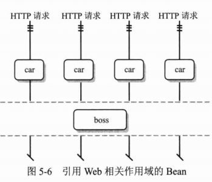

反过来，在配置文件中添加`<aop:scoped-proxy/>`后，注入boss Bean中的car Bean已经不是原来的car Bean，而是car Bean的动态代理对象。这个动态代理是Car类的子类（或实现类，假设Car是接口），Spring在动态代理子类中加入一段逻辑，以判断当前的boss需要取得那个HTTP请求相关的car Bean。

> **提示：**
>
> 动态代理所添加的逻辑其实也很简单，即判断当前boss位于哪个线程中，然后根据这个线程找到对应的HttpRequest，再从HttpRequest域中获取对应的car。因为Web容器的特性，一般情况下，一个HTTP请求对应一个独立的线程。

Java语言只能对接口提供自动代理，所以，如果需要对类提供代理，则需要在类路径中加入CGLib的类库，这时Spring将使用CGLib为类生成动态代理的子类。我们将在第7章和第8章讨论Spring AOP的相关知识。

## 5.9 FactoryBean

### 5.14 不同配置方式比较

同一功用商品或服务的多种品牌供给性是市场健康的基本要素。对于Spring来说，为实现Bean信息定义，它提供了基于XML、基于注解、基于Java类及基于Groovy这4种选项，同时还允许各种配置方式复合工程。

下面通过表5-8比较一下它们实现Bean配置的不同。

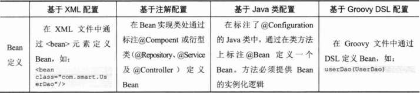

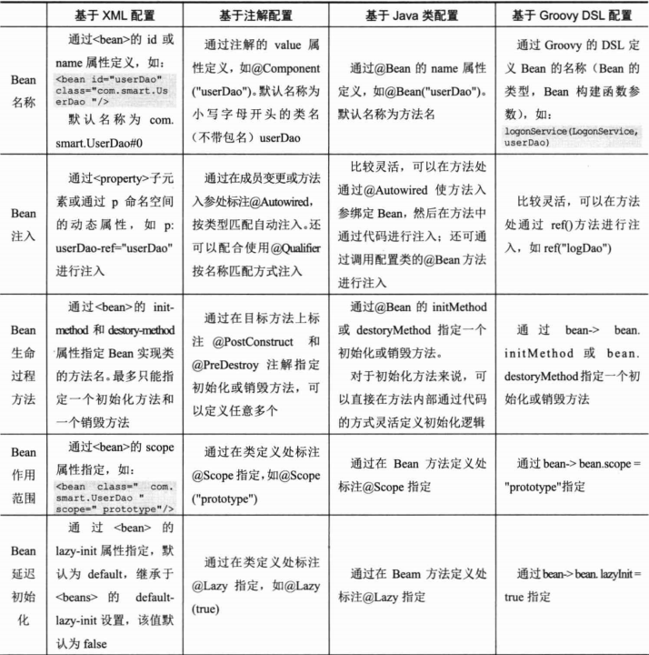

这4种配置文件很难说孰优孰劣，只能说它们都有自己的舞台和适用场景，表5-9提供了一些参考意见。

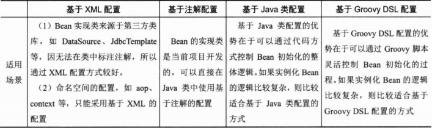

笔者一般采用XML配置DataSource、SessionFactory等资源Bean，在XML中利用aop、context命名空间进行相关主题的配置。其他所有项目中开发的Bean都通过注解配置的方式进行配置，即整个项目采用“基于XML+基于注解”的配置方式，很少采用基于Java类的配置方式。

## 5.15 小结

在本章中，我们学习了在Spring配置文件中配置Bean的相关知识。对于一般的应用来说，这些知识已经可以满足开发的需要。现在对这些知识作一个简要的回顾。

用户不但可以通过属性注入的方式建立Bean和Bean之间的依赖，也可以通过构造函数的方式完成相同的任务。但前者不管是对于代码的编写还是对于Bean的配置都具有更大的灵活性，成为大多数开发者的首选。

用户可以通过字面值的方式设置Bean的属性，也可以通过ref引用容器中其他的Bean。由于集合类型是最常使用的数据类型，因此，Spring为集合类型提供了专门的配置标签。一般情况下，可以使用Spring的简化配置方式让配置文件更加紧凑。

不但容器中的Bean可以通过配置建立起关联关系，配置文档中的`<bean>`标签也可以建立继承、依赖、引用关系，合理地使用这些关系可以简化配置、提高配置质量。

Spring提供了5个Bean作用范围。在Web应用环境下，可以使用request、session和globalSession的Bean作用域。此外，还允许通过编程的方式定义新的Bean作用域。

通过@Component及另外3个衍型注解（@Repository、@Service及@Controller），配合@Autowired就可以很好地使用基于注解的配置进行Bean的定义和注入。这种方式比在XML文件中通过`<bean>`提供的配置更加简单。

任何POJO标注了@Configuration注解后就可以为Spring容器提供Bean的定义信息，在类方法中标注@Bean相当于定义了一个Bean，同时还提供了Bean的实例化逻辑。由于Bean的实例化逻辑是在方法中定义的，因此，它可以应对一些复杂的Bean实例化场景。

不管使用何种配置方式，Bean都可以很好地将它们整合起来。在Spring容器内部，这些不同方式的Bean定义信息是大体相同的，四者之间并不存在谁替代谁的问题，它们都有自己适合的应用场景。

