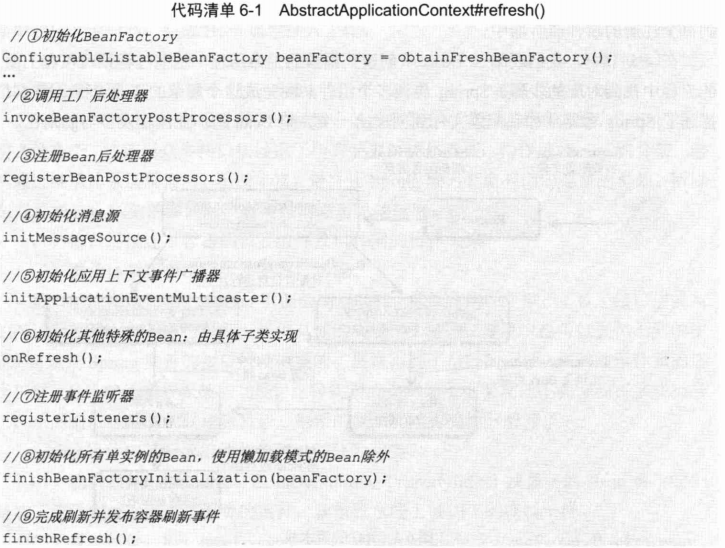
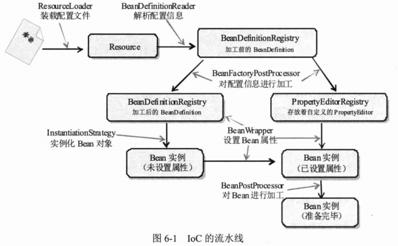
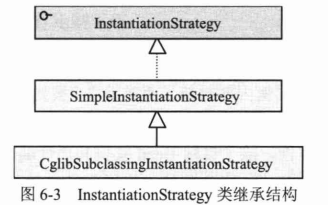
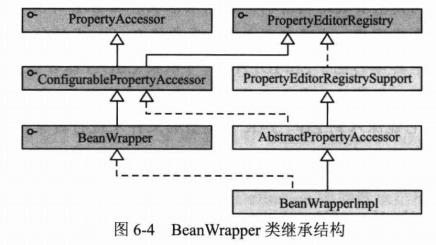
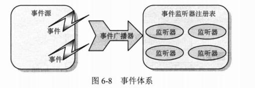

# 第6章 Spring容器高级主题

Spring容器时一部设计精妙的及其，其优异的外在表现是通过精密的内部设计实现的。本章将对Spring容器进行结构，从内部探究Spring容器的体系结构和运行机理。此外，还将对Spring容器的一些高级主题进行深入阐述。

**本章主要内容：**

* 分析Spring容器的内部结构
* Spring属性编辑器
* 使用外部属性文件
* 国际化信息
* 容器事件体系

**本章亮点：**

* 详细分析了Spring容器主要的构成类和内部流程

* 讲解了使用外部加密属性文件的技巧
* 简要扼要地介绍了相关的Java基础知识

## 6.1 Spring容器技术内幕

Spring容器就像一台构造精妙的机器，我们通过配置文件向机器传达控制信息，机器就能够按照设定的模式工作。如果将Spring容器比作一辆汽车，那么可以将BeanFactory看成汽车的发动机，而ApplicationContext则是一辆完整的汽车，它不但包括发动机，还包括离合器、变速器及底盘、车身、电气设备等其他组件。在ApplicationContext内，各个组件按步就班、有条不絮地完成汽车的各项功能。

第4章和第5章介绍了Spring容器的功用，现在让我们打开“机盖”，看看底下究竟隐藏着哪些秘密。

### 6.1.1 内部工作机制

Spring的AbstractApplicationContext是ApplicationContext的抽象实现类，该抽象类的refresh()方法定义了Spring容器在加载配置文件后的各项处理过程，这些处理过程清晰的刻画了Spring容器启动时所执行的各项操作。下面来看一下refresh()内部定义了哪些逻辑，如代码清单6-1所示。

（1）初始化BeanFactory：根据配置文件实例化BeanFactory，在obtainFreshBeanFactory()方法中，首先调用refreshBeanFactory()方法刷新BeanFactory，然后调用getBeanFactory()方法获取BeanFactory，这两个方法都是由具体子类实现的。在这一步里，Spring将配置文件的信息装入容器的Bean定义注册表（BeanDefinitionRegistry）中，但此时Bean还未初始化。

（2）调用工厂后处理器：根据反射机制从BeanDefinitionRegistry中找出所有实现了BeanFactoryPostProcessor接口的Bean，并调用其postProcessBeanFactory()接口方法。

（3）注册Bean后处理器：根据反射机制从BeanDefinitionRegistry中找出所有实现了BeanPostProcessor接口的Bean，并将它们注册到容器Bean后处理器的注册表中。

（4）初始化消息源：初始化容器的国际化消息资源。

（5）初始化应用上下文事件广播器。

（6）初始化其他特殊的Bean：这是一个钩子方法，子类可以借助这个方法执行一些特殊操作，如AbstractREfreshableWebApplicationContext就使用该方法执行初始化ThemeSource的操作。

（7）注册事件监听器。

（8）初始化所有单例的Bean，使用懒加载模式的Bean除外：初始化Bean后，将它们放入Spring容器的缓存池中。

（9）发布上下文刷新事件：创建上下文刷新事件，事件广播器负责将这些事件广播到每个注册的事件监听器中。

在4.5节中，我们观摩了Bean从创建到销毁的生命历程，这些过程都可以在上面的流程中找到对应的步骤。Spring协调多个组件共同完成这个复杂的作业流程。图6-1描述了Spring容器从加载配置文件到创建出一个完整Bean作业流程及参与的角色。

（1）ResourceLoader从存储介质中加载Spring配置信息，并使用Resource表示这个配置文件资源

（2）BeanDefinitionReader读取Resource所指向的配置文件资源，然后解析配置文件。配置文件中的每个`<bean>`解析成一个BeanDefinition对象，并保存到BeanDefinitionRegistry中。

（3）容器扫描BeanDefinitionRegistry中的BeanDefinition，使用Java反射机制自动识别出Bean工厂后处理器（实现BeanFactoryPostProcessor接口的Bean），然后调用这些Bean工厂后处理器对BeanDefinitionRegistry中的BeanDefinition进行加工处理。主要完成以下两项工作：

* 对使用占位符的`<bean>`元素标签进行解析，得到最终的配置值。这意味着对一些半成品式的BeanDefinitoin对象进行加工处理并得到成品的BeanDefinition对象。
* 对BeanDefinitionRegistry中的BeanDefinition进行扫描，通过Java发射机制找出所有属性编辑器的Bean（实现java.beans.PropertyEditor接口的Bean），并自动将它们注册到Spring容器的属性编辑器注册表中（PropertyEditorRegistry）。

（4）Spring容器从BeanDefinitionRegistry中取出加工后的BeanDefinition，并调用InstantiationStrategy着手进行Bean实例化的工作。

（5）在实例化Bean时，Spring容器使用BeanWrapper对Bean进行封装。BeanWrapper提供了很多以Java反射机制操作Bean的方法，它将结合该Bean的BeanDefinition及容器中的属性编辑器，完成Bean属性注入工作。

（6）利用容器中注册的Bean后处理器（实现BeanPostProcessor接口的Bean）对已经完成属性设置工作的Bean进行后续加工，直接装配出一个装备就绪的Bean。

Spring容器堪称一部设计精密的及其，其内部拥有众多的组件和装置。Spring的高明之处在于，它使用众多接口描绘出了所有装置的协作蓝图，构建好Spring的骨架，继而通过继承体系层层推演、不断丰富，最终让Spring成为有血有肉的完整的框架。所以在查看Spring框架的源码时，有两条清晰可见的脉络：

（1）接口层描述了容器的重要组件及组件间的协作关系。

（2）继承体系逐步实现组件的各项功能。

接口层清晰地勾勒出Spring框架的高层功能，框架脉络呼之欲出。有了接口层抽象的描述后，不但Spring自己可以提供具体的实现，任何第三方组织也可以提供不同的实现，可以说Spring完善的接口层使框架的扩展性得到了很好的保证。纵向继承体系的逐步扩展，分步骤地实现框架的功能，这种实现方案保证了框架功能不会堆积在某些类身上，从而造成过重的代码逻辑负载，框架的复杂度被完美地分解开了。

Spring组件按其所承担的角色可以划分为两类。

（1）物料组件：Resource、BeanDefinition、PropertyEditor及最终的Bean等，它们是加工流程中被加工、被消费的组件，就像流水线上被加工的物料一样。

（2）设备组件：ResourceLoader、BeanDefinitionReader、BeanFactoryPostProcessor、InstantiationStrategy及BeanWrapper等。它们就像流水线上不同环节的加工设备，对物料组件进行加工处理。

第4章介绍了Resource和ResourceLoader两个组件，本章将对其他组件进行讲解。

### 6.1.2 BeanDefinition

org.springframework.beans.factory.config.BeanDefinition是配置文件`<bean>`元素标签在容器中的内部表示。`<bean>`元素标签拥有class、scope、lazy-init等配置属性，BeanDefinition则提供了相应的beanClass、scope、lazyInit类属性，BeanDefinition就像`<bean>`的镜中人，二者是一一对应的。BeanDefinition类的继承结构如图6-2所示。

RootBeanDefinition是最常用的实现类，它对应一般性的`<bean>`元素标签。我们知道，在配置文件中可以定义父`<bean>`和子`<bean>`，父`<bean>`用RootBeanDefinition表示，子`<bean>`用ChildBeanDefinition表示，而没有父`<bean>`的`<bean>`则用RootBeanDefinition表示。AbstractBeanDefinition对二者共同的类信息进行抽象。

Spring通过BeanDefinition将配置文件中的`<bean>`配置信息转换为容器的内部表示，并将这些BeanDefinition注册到BeanDefinitionRegistry中。Spring容器的BeanDefinitionRegistry就像Spring配置信息的内存数据库，后续操作直接从BeanDefinitionRegistry中读取配置信息。一般情况下，BeanDefinition只在容器启动时加载并解析，除非容器刷新或重启，这些信息不会发生变化。当然，如果用户有特殊的需求，也可以通过编程的方式在运行期 调整BeanDefinition的定义。

创建最终的BeanDefinition主要包括两个步骤。

（1）利用BeanDefinitionReader读取承载配置信息的Resource，通过XML解析器解析配置信息的DOM对象，简单地为每个`<bean>`生成对应的BeanDefinition对象。但是这里生成的BeanDefinition可能是半成品，因为在配置文件中，可能通过占位符变量引用外部属性文件的属性，这些占位符变量在这一步里没有被解析出来。

（2）利用容器中注册的BeanFactoryPostProcessor对半成品的BeanDefinition进行加工处理，将以占位符表示的配置解析为最终的实际值，这样半成品的BeanDefinition就成为成品的BeanDefinition。

> **提示：**
>
> Spring框架源码类包层次结构清晰，但包名很长。在IDE环境下，这不是问题，但却给书面表达带来了困难。为了行文方便，常常将Spring类的包名省略。如果用户希望了解类位于哪个具体的包中，在IDEA中，可以按Ctrl+N组合键，输入类名，IDEA将自动查找出这个类。

### 6.1.3 InstantiationStrategy

org.springframework.beans.factory.support.InstantiationStrategy负责根据BeanDefinition对象创建一个Bean实例。Spring之所以将实例化Bean的工作通过一个策略接口进行描述，是为了可以方便地采用不同的实例化策略，以满足不同的应用需求，如通过CGLib类库为Bean动态创建子类再进行实例化。InstantiationStrategy类的继承结构如图6-3所示。

SimpleInstantiationStrategy是最常用的实例化策略，该策略利用Bean实现类的默认构造函数、带参构造函数或工厂方法创建Bean的实例。

CglibSubclassingInstantiationStrategy扩展了SimpleInstantiationStrategy，为需要进行方法注入的Bean提供了支持。它利用CGLib类库为Bean动态生成子类，在子类中生成方法注入的逻辑，然后使用这个动态生成的子类创建Bean的实例。

InstantiationStrategy仅负责实例化Bean的操作，相当于执行Java语言中new的功能，它并不会参与Bean属性的设置工作。所以由InstantiationStrategy返回的Bean实例实际上是一个半成品的Bean实例，属性填充的工作留待BeanWrapper来完成。

### 6.1.4 BeanWrapper

org.springframework.beans.BeanWrapper是Spring框架中重要的组件类。BeanWrapper相当于一个代理器，Spring委托BeanWrapper完成Bean属性的填充工作。在Bean实例被InstantiationStrategy创建出来之后，容器主控程序将Bean实例通过BeanWrapper包装起来，这是通过调用BeanWrapper#setWrapperInstance(Object obj)方法完成的。BeanWrapper类的继承结构如图6-4所示。

通过图6-4可以看出，BeanWrapper还有两个顶级类接口，分别是PropertyAccessor和PropertryEditorRegistry。PropertyAccessor接口定义了各种访问Bean属性的方法，如setPropertyValue(String,Object)、setPropertyValues(PropertyValues pvs)等；而PropertyEditorRegistry是属性编辑器的注册表。所以BeanWrapper实现类BeanWrapperImpl具有三重身份：

（1）Bean包裹器。

（2）属性访问器。

（3）属性编辑器注册表。

一个BeanWrapperImpl实例内部封装了两类组件：被封装的待处理的Bean，以及一套用于设置Bean属性的属性编辑器。

要顺利地填充Bean属性，除了目标Bean实例和属性编辑器外，还需要获取Bean对应的BeanDefinition，它从Spring容器的BeanDefinitionRegistry中直接获取。Spring主控程序从BeanDefinition中获取Bean属性的配置信息PropertyValue，并使用属性编辑器对PropertyValue进行转换以得到Bean的属性值。对Bean的其他属性重复这样的步骤，就可以完成Bean所有属性的注入工作。BeanWrapperImpl在内部使用Spring的BeanUtils工具类对Bean进行反射操作，设置属性。下一节将详细介绍属性编辑器的原理，并讲解如何通过配置的方式注册自定义的属性编辑器。

## 6.2 属性编辑器

### 6.2.1 JavaBean的编辑器

### 6.2.2 Spring默认属性编辑器

### 6.2.3 自定义属性编辑器

Spring的大部分默认属性编辑器都直接扩展于java.beans.PropertyEditorSupport类，开发者也可以通过扩展propertyEditorSupport实现自己的属性编辑器。

## 6.3 使用外部属性文件

### 6.3.1 PropertyPlaceholderConfigurer属性文件

### 6.3.2 使用加密的属性文件

### 6.3.3 属性文件自身的引用

## 6.4 引用Bean的属性值

## 6.5 国际化信息

### 6.5.1 基础知识

### 6.5.2 MessageSource

### 6.5.3 容器级的国际化信息资源

## 6.6 容器事件

Spring的ApplicationContext能够发布事件并且允许注册相应的事件监听器，因此，它拥有一套完善的事件发布和监听机制。我们知道，Java通过java.util.EventObject类和java.util.EventListener接口描述事件和监听器，某个组件或框架如需事件发布和监听机制，都需要通过扩展它们进行定义。在事件体系中，除了事件和监听器外，还有另外3个重要的概念。

* 事件源：事件的产生者，任何一个EventObject都必须拥有一个事件源。
* 事件监听器注册表：组件或框架的事件监听器不可能漂浮在空中，而必须有所依存。也就是说组件或框架必须提供一个地方保存事件监听器，这便是事件监听器注册表。一个事件监听器注册到组件或框架中，其实就是保存在事件监听器注册表中。当组件和框架中的事件源产生事件时，就会通知这些位于事件监听器注册表中的监听器。
* 事件广播器：它是事件和事件监听器沟通的桥梁，负责把事件通知给事件监听器。

通过图6-8可以看出这几个角色是如何各司其职的。

事件源、事件监听器注册表和事件广播器这3个角色有时可以由同一个对象承担，如java.swing包中的JButton、JCheckBox等组件，它们分别集以上3个角色于一身。

在分析了事件体系后，我们会发现事件体系其实是观察者模式的一种具体实现方式，它并没有什么神秘之处。之所以组件或框架的事件会让一些开发者觉得神奇，就是因为组件或框架通过观察者模式很好地封装了事件模型并透明地提供给使用者，使用者只需按其设定的方式定义注册事件监听器，事件体系就可以正常工作，因而我们很少会关注它的内部实现机理。

### 6.6.1 Spring事件类结构

### 6.6.2 解构Spring事件体系的具体实现

### 6.6.3 一个实例

## 6.7 小结

在本章中，我们对Spring容器进行了深度剖析，不但分析了Spring容器的运行流程，还深入Spring的内部探究其实现机理，并介绍了组成Spring容器的重要组件。Spring不但是一个优秀而实用的开发框架，该框架本身也是经典的程序设计范本，我们希望通过对其内部设计的深入分析，让读者从中吸取设计思想的精华并应用到自己的开发实践中去，而不仅仅使用Spring框架的功能。

此外，还介绍了Spring的属性编辑器、外部属性文件、国际化信息及容器事件的知识。在介绍这些知识前，我们学习了相关主题的Java知识，这些知识可以帮助读者加深对Spring相关知识的理解。

