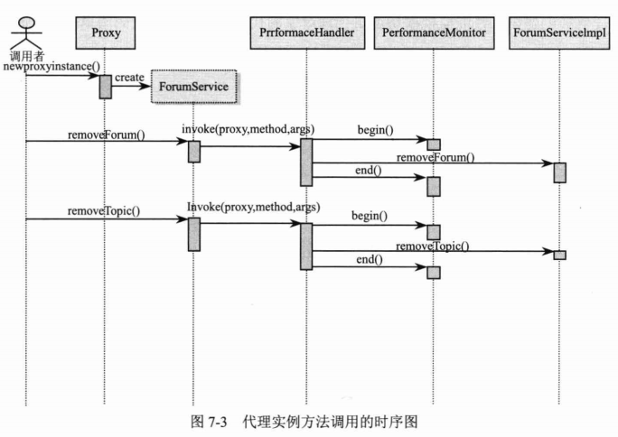
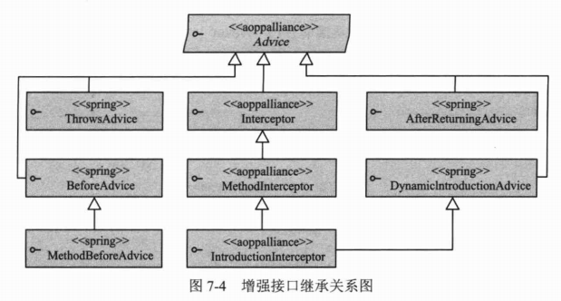
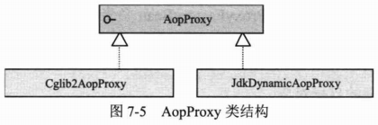
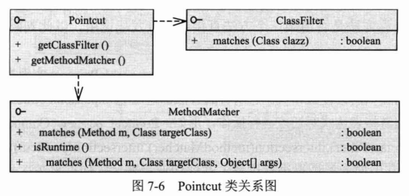

# 第7章 Spring AOP基础

Spring AOP是AOP技术在Spring中的具体实现，它是构成Spring框架的另一个重要基石。Spring AOP构建于IoC之上，和IoC“浑然天成”，统一于Spring容器之中。

本章将从Spring AOP的底层实现技术入手，一步步深入Spring AOP的内核，分析它的底层结构和实现。

**本章主要内容：**

* AOP概述
* Spring AOP所涉及的Java基础知识
* Spring AOP的增强类型
* Spring AOP的切面类型
* 通过自动代理技术创建切面

**本章亮点：**

* 通过Spring AOP所涉及的底层Java知识的学习深刻理解Spring AOP的具体实现
* 深入Spring AOP的内核分析其组成和结构
* AOP疑难问题剖析

## 7.1 AOP概述

### 7.1.1 AOP到底是什么

AOP是Aspect Oriented Programing的简称。

### 7.1.2 AOP术语

**1. 连接点（Joinpoint）**

**2. 切点（Pointcut）**

**3. 增强（Advice）**

**4. 目标增强（Target）**

**5. 引介（Introduction）**

**6. 织入（Weaving）**

根据不同的实现技术，AOP有3种织入方式

（1）编译期织入，这要求使用特殊的Java编译器。

（2）类装载期织入，这要求使用特殊的类装载器。

（3）动态代理织入，在运行期内为目标类添加增强生成子类的方式。

Spring采用动态代理织入，而AspectJ采用编译期织入和类装载期织入。

**7. 代理（Proxy）**

**8. 切面（Aspect）**

切面由切点和增强（引介）组成，它既包含横切逻辑的定义，也包括连接点的定义。Spring AOP就是负责实施切面的框架，它将切面所定义的横切逻辑织入切面所指定的连接点中。

AOP的工作重心在于如何将增强应用于目标对象的连接点上。这里包括两项工作：第一，如何通过切点和增强定位到连接点上；第二，如何在增强中编写切面的代码。

### 7.1.3 AOP的实现者

AOP工具的设计目标是把横切的问题（如性能监视、事务管理）模块化。使用类似OOP的方式进行切面的编程工作。位于AOP工具核心的是连接点模型，它提供了一种机制，可以定位到需要在哪里发生横切。

**1. AspectJ**

AspectJ是语言级的AOP实现

**2. AspectWerkz**

AspectWerkz是基于Java的简单、动态、轻量级的AOP框架

**3. JBoss AOP**

**4. Spring AOP**

Spring AOP使用纯Java实现，它不需要专门的编译过程，也不需要特殊的类装载器，它在运行期间通过代理方式向目标类织入增强代码。Spring并不尝试提供最完整的AOP实现，相反，它侧重于提供一种和Spring IoC容器整合的AOP实现，用以解决企业级开发中的常见问题。在Spring中可以无缝地将Spring AOP、IoC和AspectJ整合在一起。

## 7.2 基础知识

Spring AOP使用动态代理技术在运行期间织入增强的代码，为了揭示Spring AOP底层的工作机理，有必要学习涉及的Java知识。Spring AOP使用了两种代理机制：一种是基于JDK的动态代理；另一种是基于CGLib的动态代理。之所以需要两种代理机制，很大程度上是因为JDK本身只提供接口的代理，而不支持类的代理。

### 7.2.1 带有横切逻辑的实例

下面通过具体化代码实现7.1节所介绍的例子的性能监视横切逻辑，并通过动态代理技术对此进行改造。在调用每一个目标类方法时启动方法的性能监视，在目标类方法调用完成时记录方法的花费时间，如代码清单7-2所示。

```java
package com.smart.proxy;

/**
 * ForumServiceImpl
 *
 * @author shenhuanjie
 * @date 2019/6/19 10:35
 */
public class ForumServiceImpl implements ForumService {
    /**
     * removeTopic
     *
     * @param topicId
     */
    @Override
    public void removeTopic(int topicId) {
        // 开始对该方法进行性能监视
        PerformanceMonitor.begin("com.smart.proxy.ForumServiceImpl.removeTopic");
        System.out.println("模拟删除Topic记录 ：" + topicId);
        try {
            Thread.currentThread().sleep(20);
        } catch (Exception e) {
            throw new RuntimeException(e);
        }

        // 结束对该方法的性能监视
        PerformanceMonitor.end();
    }

    /**
     * removeForum
     *
     * @param forumId
     */
    @Override
    public void removeForum(int forumId) {
        // 开始对该方法进行性能测试
        PerformanceMonitor.begin("com.smart.proxy.ForumServiceImpl.removeForum");
        System.out.println("模拟删除Forum记录 ：" + forumId);
        try {
            Thread.currentThread().sleep(20);
        } catch (Exception e) {
            throw new RuntimeException(e);
        }
        // 结束对该方法的性能监视
        PerformanceMonitor.end();
    }
}
```

在代码清单7-2中，粗体表示的代码就是具有横切逻辑特征的代码，每个Service类和每个业务方法体前后都执行相同的代码逻辑：方法调用前启动PerformanceMonitor；方法调用后通知PerformanceMonitor结束性能监视并记录性能监视结果。

PerformanceMonitor是性能监视的实现类，下面给出一个非常简单的实现版本，如代码清单7-3所示。

```java
package com.smart.proxy;

/**
 * PerformanceMonitor
 *
 * @author shenhuanjie
 * @date 2019/6/19 10:38
 */
public class PerformanceMonitor {
    // 通过一个ThreadLocal保存与调用线程相关的性能监视信息
    private static ThreadLocal<MethodPerformance> performanceRecord = new ThreadLocal<>();

    // 启动对某一目标方法的性能监视
    public static void begin(String method) {
        System.out.println("begin monitor...");
        MethodPerformance mp = new MethodPerformance(method);
        performanceRecord.set(mp);
    }

    public static void end() {
        System.out.println("end monitor...");
        MethodPerformance mp = performanceRecord.get();

        //打印出方法性能监视的结果信息
        mp.printPerformance();
    }
}
```

用于记录性能监视信息的MethodPerformance类的代码如代码清单7-4所示。

```java
package com.smart.proxy;

/**
 * MethodPerformace
 *
 * @author shenhuanjie
 * @date 2019/6/19 10:39
 */
public class MethodPerformance {
    private long begin;
    private long end;
    private String serviceMethod;

    public MethodPerformance(String serviceMethod) {
        this.serviceMethod = serviceMethod;
        this.begin = System.currentTimeMillis();
    }

    public void printPerformance() {
        end = System.currentTimeMillis();
        long elapse = end - begin;
        System.out.println(serviceMethod + " 花费 " + elapse + " 毫秒\n");
    }
}
```

通过下面的代码测试拥有性能监视能力的ForumServiceImpl业务方法：

```java
package com.smart.proxy;

import org.junit.Test;

public class ForumServiceTest {

    @Test
    public void ForumServiceTest() {
        ForumService forumservice = new ForumServiceImpl();
        forumservice.removeForum(10);
        forumservice.removeTopic(1012);
    }
}
```

得到以下输出信息：

```
begin monitor...
模拟删除Forum记录 ：10
end monitor...
com.smart.proxy.ForumServiceImpl.removeForum 花费 21 毫秒

begin monitor...
模拟删除Topic记录 ：1012
end monitor...
com.smart.proxy.ForumServiceImpl.removeTopic 花费 21 毫秒
```

正如代码清单7.2所示，当某个方法需要进行性能监视时，必须调整方法代码，在方法体前后分别添加开启性能监视和结束性能监视的代码。这些非业务逻辑的性能监视代码破坏了ForumServiceImpl业务逻辑的纯粹性。通果代理的方式将业务类方法中开启和结束性能监视的横切代码从业务类中完全移除，并通过JDK或CGLib动态代理技术将横切代码动态织入目标方法的相应位置。

### 7.2.2 JDK动态代理



### 7.2.3 CGLib动态代理

CGLib采用底层的字节码技术，可以为一个类创建子类，在子类中采用方法拦截的技术拦截所有父类方法的调用并顺势织入横切逻辑。

### 7.2.4 AOP联盟

### 7.2.5 代理知识小结

Spring AOP的底层就是通过使用JDK或CGLib动态代理技术为目标Bean织入横切逻辑的。这里对动态创建代理对象作一个小结。

虽然通过PerformanceHandler或CglibProxy实现了性能监视横切逻辑的动态织入，但这种实现方式存在3个明显需要改进的地方。

（1）目标类的所有方法都添加了性能监视横切逻辑，而有时这并不是我们所期望的，我们可能只希望对业务类中的某些特定方法添加横切逻辑。

（2）通过硬编码的方式制定了织入横切逻辑的织入点，即在目标类业务方法的开始和结束前织入代码。

（3）手工编写代理实例的创建过程，在为不同类创建代理时，需要分别编写相应的创建代码，无法做到通用。

以上3个问题在AOP中占用重要的地位，因为Spring AOP的主要工作就是围绕以上3点展开的：Spring AOP通过Pointcut（切点）指定在哪些类的那些方法上织入横切逻辑，通过Advice（增强）描述横切逻辑和方法的具体织入点（方法前、方法后、方法的两端等）。此外，Spring通过Advisor（切面）将Pointcut和Advice组装起来。有了Advisor的信息，Spring就可以利用SDK或CGLib动态代理技术采用统一的方式为目标Bean创建织入切面的代理对象了。

JDK动态代理所创建的代理对象，在Java1.3下，性能差强人意。虽然在高版本的JDK中动态代理对象的性能得到了很大的提高，但有研究表明，CGLib所创建的动态代理对象的性能依旧比JDK所创建的动态代理对象的性能高不少（大概10倍）。但CGLib在创建代理对象时所花费的事件却比JDK动态代理多（大概8倍）。对于singleton的代理对象或者具有示例池的代理，因为无须频繁地创建代理对象，所以比较适合采用CGLib动态代理技术；反之则适合采用JDK动态代理技术。

## 7.3 创建增强类

Spring使用增强类定义横切逻辑，同时由于Spring只支持方法连接点，增强还包括在方法的哪一点加入横切代码的方位信息，所以增强既包含横切逻辑，又包含部分连接点的信息。

### 7.3.1 增强类型

Spring支持5种类型的增强，先来了解一下增强接口继承关系图，如图7-4所示。



带`<<spring>>`标识的接口是Spring所定义的扩展增强接口；带`<<aoppalliance>>`标识的接口则是AOP联盟定义的接口。按照增强在目标类方法中的连接点位置，可以分为以下5类。

* 前置增强：org.springframework.aop.BeforeAdvice代表前置增强。因为Spring只支持方法级的增强，所以MethodBeforeAdvice是目前可用的前置增强，表示在目标方法执行前实施增强，而BeforeAdvice是为了将来版本扩展需要而定义的。
* 后置增强：org.springframework.aop.AfterReturningAdvice代表后置增强，表示在目标方法执行后实施增强。
* 环绕增强：org.aopalliance.intercept.MethodInterceptor代表环绕增强，表示在目标方法执行前后实施增强。
* 异常抛出增强：org.springframework.aop.ThrowsAdvice代表抛出异常增强，表示在目标方法抛出异常后实施增强。
* 引介增强：org.springframework.aop.IntroductionInterceptor代表引介增强，表示在目标类中添加一些新的方法和属性。

这些增强接口都有一些方法，通过实现这些接口方法，并在接口方法中定义横切逻辑，就可以将它们织入目标类方法的相应连接点位置。

### 7.3.2 前置增强

**1. 保证使用礼貌用语的实例**

```java
package com.smart.advice;

/**
 * Waiter
 *
 * @author shenhuanjie
 * @date 2019/6/19 14:39
 */
public interface Waiter {
    /**
     * greeTo
     *
     * @param name
     */
    void greeTo(String name);

    /**
     * serveTo
     *
     * @param name
     */
    void serveTo(String name);
}
```

```java
package com.smart.advice;

/**
 * NaiveWaiter
 *
 * @author shenhuanjie
 * @date 2019/6/19 14:39
 */
public class NaiveWaiter implements Waiter {
    /**
     * greeTo
     *
     * @param name
     */
    @Override
    public void greeTo(String name) {
        System.out.println("greet to " + name + "...");
    }

    /**
     * serveTo
     *
     * @param name
     */
    @Override
    public void serveTo(String name) {
        System.out.println("serve to " + name + "...");
    }
}
```

```java
package com.smart.advice;

import org.springframework.aop.MethodBeforeAdvice;

import java.lang.reflect.Method;

/**
 * GreetingBeforeAdvice
 *
 * @author shenhuanjie
 * @date 2019/6/19 14:41
 */
public class GreetingBeforeAdvice implements MethodBeforeAdvice {
    @Override
    public void before(Method method, Object[] objects, Object o) throws Throwable {
        String clientName = (String) objects[0];
        System.out.println("How are you! Mr." + clientName + ".");
    }
}
```

BeforeAdvice是前置增强的接口，方法前置增强的MethodBeforeAdvice接口是其子类。Spring目前只提供方法调用的前置增强，在以后的版本中可能会看到Spring提供的其他类型的前置增强，这正是BeforeAdvice接口存在的意义。MethodBeforeAdvice接口仅定义了唯一的方法：before(Method method,Object[] args,Object obj)throws Throwable。其中，method为目标类的方法；args为目标类方法的入参；而obj为目标类实例。当该方法发生异常时，将阻止目标类方法的执行。

```java
package com.smart.advice;

import org.junit.Test;
import org.springframework.aop.BeforeAdvice;
import org.springframework.aop.framework.ProxyFactory;

public class BeforeAdviceTest {

    @Test
    public void beforeTest() {
        Waiter target = new NaiveWaiter();
        BeforeAdvice advice = new GreetingBeforeAdvice();

        // Spring提供的代理工厂
        ProxyFactory pf = new ProxyFactory();

        //设置代理目标
        pf.setTarget(target);

        // 为代理目标添加增强
        pf.addAdvice(advice);

        Waiter proxy = (Waiter) pf.getProxy();
        proxy.greeTo("John");
        proxy.serveTo("Tom");
    }
}
```

```
How are you! Mr.John.
greet to John...
How are you! Mr.Tom.
serve to Tom...
```

**2. 解剖ProxyFactory**

Spring定义了org.springframework.aop.framework.AopProxy接口，并提供了两个final类型的实现类，如图7-5所示。



**3. 在Spring中配置**

使用ProxyFactory比直接使用CGLib或JDK动态代理技术创建代理省了很多事，如大家预想的一样，可以通过Spring的配置以“很Spring的方式”声明一个代理，如代码清单7-14所示。

```xml
<?xml version="1.0" encoding="UTF-8"?>
<beans xmlns="http://www.springframework.org/schema/beans"
       xmlns:xsi="http://www.w3.org/2001/XMLSchema-instance" xmlns:p="http://www.springframework.org/schema/p"
       xsi:schemaLocation="http://www.springframework.org/schema/beans http://www.springframework.org/schema/beans/spring-beans.xsd">
    <bean id="greetingAdvice" class="com.smart.advice.GreetingBeforeAdvice"/>
    <bean id="target" class="com.smart.advice.NaiveWaiter"/>
    <bean id="waiter" class="org.springframework.aop.framework.ProxyFactoryBean"
          p:proxyInterfaces="com.smart.advice.Waiter"
          p:interceptorNames="greetingAdvice"
          p:target-ref="target"/>
</beans>
```

ProxyFactoryBean的几个常用的可配置属性。

* target：代理的目标对象。
* proxyInterfaces：代理所要实现的接口，可以是多个接口。该属性还有一个别名属性interfaces。
* interceptorNames：需要织入目标对象的Bean列表，采用Bean的名称指定。这些Bean必须实现了org.aopalliance.intercept.MethodInterceptor或org.springframework.aop.Advisor的Bean，配置中的顺序对应调用的顺序。
* singleton：返回的代理是否是单实例，默认为单实例。
* optimize：当设置为true时，强制使用CGLib动态代理。对于singleton的代理。
* proxyTargetClass：是否对类进行代理（而不是对接口进行代理）。当设置为true时，使用CGLib动态代理。

```java
@Test
public void proxyFactoryBeanTest() {
    String configPath = "com/smart/advice/beans.xml";
    ApplicationContext ctx = new ClassPathXmlApplicationContext(configPath);
    Waiter waiter = (Waiter) ctx.getBean("waiter");
    waiter.greeTo("John");
}
```

```
How are you! Mr.John.
greet to John...
```

### 7.3.3 后置增强

后置增强在目标类方法调用后执行。

```java
package com.smart.advice;

import org.springframework.aop.AfterReturningAdvice;

import java.lang.reflect.Method;

/**
 * GreetingAfterAdvice
 *
 * @author shenhuanjie
 * @date 2019/6/19 15:07
 */
public class GreetingAfterAdvice implements AfterReturningAdvice {
    @Override
    public void afterReturning(Object o, Method method, Object[] objects, Object o1) throws Throwable {
        System.out.println("Please enjoy yourself!");
    }
}
```

```xml
<?xml version="1.0" encoding="UTF-8"?>
<beans xmlns="http://www.springframework.org/schema/beans"
       xmlns:xsi="http://www.w3.org/2001/XMLSchema-instance" xmlns:p="http://www.springframework.org/schema/p"
       xsi:schemaLocation="http://www.springframework.org/schema/beans http://www.springframework.org/schema/beans/spring-beans.xsd">
    <bean id="greetingBefore" class="com.smart.advice.GreetingBeforeAdvice"/>
    <bean id="greetingAfter" class="com.smart.advice.GreetingAfterAdvice"/>
    <bean id="target" class="com.smart.advice.NaiveWaiter"/>
    <bean id="waiter" class="org.springframework.aop.framework.ProxyFactoryBean"
          p:proxyInterfaces="com.smart.advice.Waiter"
          p:interceptorNames="greetingBefore,greetingAfter"
          p:target-ref="target"/>
</beans>
```

```
How are you! Mr.John.
greet to John...
Please enjoy yourself!
```

### 7.3.4 环绕增强

介绍完前置、后置增强，环绕增强的作用就显而易见了。环绕增强允许在目标类方法调用前后织入横切逻辑，它综合实现了前置、后置增强的功能。

```java
package com.smart.advice;


import org.aopalliance.intercept.MethodInterceptor;
import org.aopalliance.intercept.MethodInvocation;

/**
 * GreetingInterceptor
 *
 * @author shenhuanjie
 * @date 2019/6/19 15:12
 */
public class GreetingInterceptor implements MethodInterceptor {

    /**
     * invoke：截获目标类方法的执行，并在前后添加横切逻辑
     *
     * @param invocation
     * @return
     * @throws Throwable
     */
    @Override
    public Object invoke(MethodInvocation invocation) throws Throwable {
        // 目标方法入参
        Object[] args = invocation.getArguments();
        String clientName = (String) args[0];
        //在目标方法执行前调用
        System.out.println("How are you! Mr." + clientName + '.');
        //通过反射机制调用目标方法
        Object obj = invocation.proceed();
        // 在目标方法执行后调用
        System.out.println("Please enjoy yourself!");

        return obj;
    }
}

```

```xml
<?xml version="1.0" encoding="UTF-8"?>
<beans xmlns="http://www.springframework.org/schema/beans"
       xmlns:xsi="http://www.w3.org/2001/XMLSchema-instance" xmlns:p="http://www.springframework.org/schema/p"
       xsi:schemaLocation="http://www.springframework.org/schema/beans http://www.springframework.org/schema/beans/spring-beans.xsd">
    <!--<bean id="greetingBefore" class="com.smart.advice.GreetingBeforeAdvice"/>-->
    <bean id="greetingAround" class="com.smart.advice.GreetingInterceptor"/>
    <!--<bean id="greetingAfter" class="com.smart.advice.GreetingAfterAdvice"/>-->
    <bean id="target" class="com.smart.advice.NaiveWaiter"/>
    <bean id="waiter" class="org.springframework.aop.framework.ProxyFactoryBean"
          p:proxyInterfaces="com.smart.advice.Waiter"
          p:interceptorNames="greetingAround"
          p:target-ref="target"/>
</beans>
```

```
How are you! Mr.John.
greet to John...
Please enjoy yourself!
```

### 7.3.5 异常抛出增强

异常抛出增强最适合的应用场景是事务管理，当参与事务的某个DAO发生异常时，事务管理器必须 回滚事务。

```java
package com.smart.advice;

import java.sql.SQLException;

/**
 * ForumService
 *
 * @author shenhuanjie
 * @date 2019/6/19 15:20
 */
public class ForumService {
    public void removeForum(int forumId) {
        // do sth
        throw new RuntimeException("运行异常");
    }

    public void updateForum(Forum forum) throws Exception {
        // do sth
        throw new SQLException("数据更新操作异常");
    }
}
```

```java
package com.smart.advice;

import org.springframework.aop.ThrowsAdvice;

import java.lang.reflect.Method;

/**
 * TransactionManager
 *
 * @author shenhuanjie
 * @date 2019/6/19 15:23
 */
public class TransactionManager implements ThrowsAdvice {
    public void afterThrowing(Method method, Object[] args, Object target, Exception ex) throws Throwable {
        System.out.println("-------------");
        System.out.println("method：" + method.getName());
        System.out.println("抛出异常：" + ex.getMessage());
        System.out.println("成功回滚事务。");
    }
}
```

ThrowsAdvice异常抛出增强接口没有定义任何方法，它是一个标签接口，在运行期Spring使用反射机制自行判断，必须采用以下签名形式定义异常抛出的增强方法：

```java
void afterThrowing([Method method,Object[] args,Object target],Throwable);
```

方法名必须为afterThrowing，方法入参规定如下：前3个入参Method method、Object[]args、Object target是可选的（3个入参要么提供，要么不提供），而最后一个入参是Throwable或其子类。

### 7.3.6 引介增强

引介增强是一种比较特殊的增强类型，它不是在目标方法周围织入增强，而是为目标类创建新的方法和属性，所以引介增强的连接点是类级别的，而非方法级别的。通过引介增强，可以为目标类添加一个接口的实现，即原来目标类未实现某个接口，通过引介增强可以为目标类创建实现某接口的代理。这种功能富有吸引力，因为它能够在横向上定义接口的实现方法，思考问题的角度发生了很大的变化。

Spring定义了引介增强接口IntroductionInterceptor，该接口没有定义任何方法，Spring为该接口提供了DelegatingIntroductionInterceptor实现类。一般情况下，通过扩展该实现类定义自己的引介增强类。

```java
package com.smart.introduce;

/**
 * Monitorable
 *
 * @author shenhuanjie
 * @date 2019/6/19 15:43
 */
public interface Monitorable {
    void setMonitorActive(boolean active);
}
```

```java
package com.smart.introduce;

import com.smart.proxy.PerformanceMonitor;
import org.aopalliance.intercept.MethodInvocation;
import org.springframework.aop.support.DelegatingIntroductionInterceptor;

/**
 * ControllablePerformanceMonitor
 *
 * @author shenhuanjie
 * @date 2019/6/19 15:42
 */
public class ControllablePerformanceMonitor extends DelegatingIntroductionInterceptor implements Monitorable {
    private ThreadLocal<Boolean> MonitorStatusMap = new ThreadLocal<Boolean>();

    /**
     * setMonitorActive
     *
     * @param active
     */
    @Override
    public void setMonitorActive(boolean active) {
        MonitorStatusMap.set(active);
    }

    /**
     * invoke
     *
     * @param mi
     * @return
     * @throws Throwable
     */
    public Object invoke(MethodInvocation mi) throws Throwable {
        Object obj = null;

        if (MonitorStatusMap.get() != null && MonitorStatusMap.get()) {
            PerformanceMonitor.begin(mi.getClass().getName() + "." + mi.getMethod().getName());
            obj = super.invoke(mi);
            PerformanceMonitor.end();
        } else {
            obj = super.invoke(mi);
        }
        return obj;
    }
}
```

```xml
<?xml version="1.0" encoding="UTF-8"?>
<beans xmlns="http://www.springframework.org/schema/beans"
       xmlns:xsi="http://www.w3.org/2001/XMLSchema-instance" xmlns:p="http://www.springframework.org/schema/p"
       xsi:schemaLocation="http://www.springframework.org/schema/beans http://www.springframework.org/schema/beans/spring-beans.xsd">
    <bean id="pmonitor" class="com.smart.introduce.ControllablePerformanceMonitor"/>
    <bean id="forumServiceTarget" class="com.smart.introduce.ForumService"/>
    <bean id="forumService" class="org.springframework.aop.framework.ProxyFactoryBean"
          p:interfaces="com.smart.introduce.Monitorable"
          p:target-ref="forumServiceTarget"
          p:proxyTargetClass="true"
    />
</beans>
```

## 7.4 创建切面

在介绍增强时，读者可能会注意到一个问题：增强被织入目标类的所有方法中。假设我们希望有选择地织入目标类的某些特定方法中，就需要使用切点进行目标连接点的定位。描述连接点是进行AOP编程最主要的工作，为了突出强调这一点，再次给出Spring AOP如何定位连接点。

增强提供了连接点方位信息，如织入到方法前面、后面等，而切点进一步描述了织入哪些方法上。

Spring通过org.springframework.aop.Pointcut接口描述切点，Pointcut由ClassFilter和MethodMatcher构成，它通过ClassFilter定位到某些特定类上，通过MethodMatcher定位到某些特定方法上，这样Pointcut就拥有了描述某些特定方法的能力。可以简单地用SQL复合查询条件来理解Pointcut的功用。Pointcut类关系图如图7-6所示。



## 7.6 小结

AOP是OOP的延伸，它为程序开发提供了一个崭新的思考角度，可以将重复性的横切逻辑抽取到统一的模块中。通过OOP的纵向抽象和AOP的横向抽取，程序才可以真正解决重复性代码问题。

Spring采用JDK动态代理和CGLib动态代理技术在运行期织入增强，所以不需要装备特殊的编译器或类装载器就可以使用AOP的功能。要使用JDK动态代理，目标类必须实现接口，而CGLib不对目标类作任何限制，它通过动态生成目标类子类的方式提供代理。JDK在创建代理对象的性能高于CGLIb，而生成的代理对象的运行性能却比CGLib的低。如果是singleton的代理，则推荐使用CGLib动态代理。

Spring只能在方法级别上织入增强，Spring提供了4种类型的方法增强，分别是前置增强、后置增强、环绕增强和异常抛出增强，此外还有一种特殊的引介增强。引介增强是类级别的，它为目标类织入新的接口实现。从广义上说，增强其实就是一种最简单的切面，它既包括横切代码又包括切点信息，只不过它的切点只是简单的方法相对位置信息。所以增强一般需要和切点联合才可以表示一个更具实用性的切面。

在Spring中，普通的切点通过目标类名和方法名描述连接点的信息。流程切点是比较特殊的切点，它通过方法调用堆栈的运行环境信息来决定连接点。有时需要通过切点的交叉或合并描述一个最终的切点，这时可以使用ComposablePointcut的复合切点。

切面是增强和切点的联合体，可以很方便地通过Spring提供的ProxyBeanFactory将切面织入不同的目标类中。当然，为每个目标类手工配置一个切面是比较烦琐的，Spring利用BeanPostProcessor可干涉Bean生命周期的机制，提供了一些可以自动创建代理、织入切面的自动代理创建器，其中DefaultAdvisorAutoProxyCreator是功能强大的自动代理创建器，它可以将容器中所有Advisor自动织入目标Bean中。

