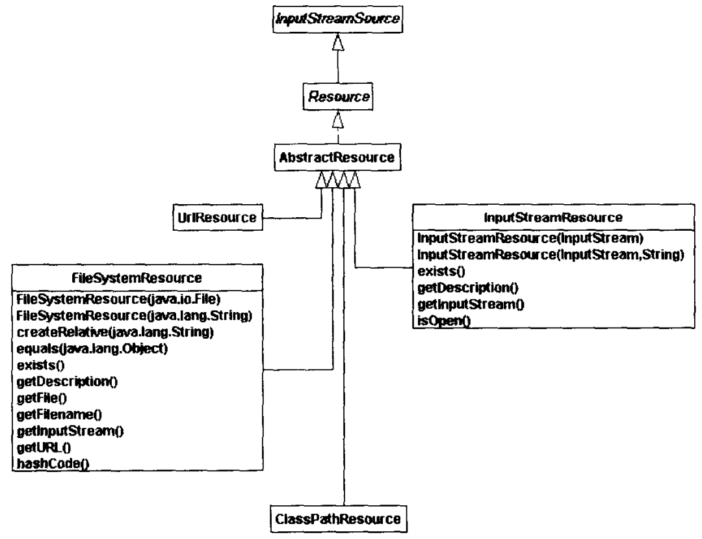
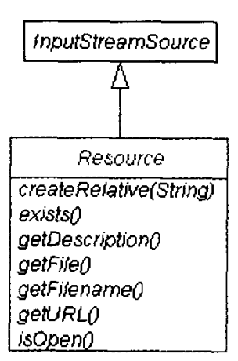

# 第1章 Spring启程

> 本章内容将给出若干个基于Spring开发的相关实例，使得开发者能够了解Spring基础知识，从而为深入了解Spring其他内容奠定基础。

## 1.1 背景知识

作为Open Source框架，Spring是很令人振奋的。Spring从一开始，直到现在，而且包括以后，将持续获得更多开发者的青睐，因为它是优秀的、是为开发者设计的实用框架。现在的Open Source框架很多，但是属于Java/J2EE架构级的优秀框架不多，包括现有流行的Struts、Tapestry等都不是。研究Spring的过程，是很有意义的一件事情，因为它将业界的各种开发经验（包括Open Source的和非Open Source领域的）融入到其中。

Spring提供的控制反转（Inversion of Control，IoC）和面向方面编程（Aspect-Oriented Programming，AOP）插件式架构降低了应用组件之间的依赖性。借助于XML定义文件，开发者能够在运行时连接不同的应用组件。这对于单元测试特别有用，特别是那些需要针对不同客户实施不同配置的应用而言。

目前，存在的依赖注入类型有3种：基于设值（setter-based）方法、基于构建器（constructor-based）以及基于接口（interface-based）注入。Spring IoC支持前两种，即借助于Spring开发者可以通过构建器，或者设值方法创建对象，并对对象的状态进行管理。

其中，依赖注入是Spring框架的基础。Spring在基于依赖注入的基础之上，同时还提供了其他大量的功能，比如Spring MVC框架、事务管理框架、DAO支持、支持主流O/R Mapping工具、支持各种标准J2EE组件技术的基础（JMS/JavaMail/EJB/Web服务器）、集成各种视图（Web视图和非Web视图）技术。这也是使用Spring IoC容器优于其他IoC容器的理由。

## 1.2 运行Spring实例应用

为阐述清楚Spring IoC框架帮助开发者完成了哪些工作，本章给出的运行实例起到了很重要的作用，即开发者通过代码能够很清楚地看到Spring的具体内容。

### 1.2.1 实例1：example1

example1（所有的源代码位于example1项目中）并没有使用Spring框架。本章将通过一系列重构步骤，并最终借助于Spring提供的IoC框架来实现实例应用。接下来，给出大体步骤（详细内容，请参考example1项目）。

首先，开发者需要实现FileHelloStr.java类。

```java
package com.openv.spring;


import org.apache.commons.logging.Log;
import org.apache.commons.logging.LogFactory;

import java.io.FileNotFoundException;
import java.io.IOException;
import java.io.InputStream;
import java.util.Properties;

/**
 * 基于文件形式，读取HelloWorld所需的字符串
 *
 * @author shenhuanjie
 * @date 2019/6/5 10:49
 */
public class FileHelloStr {
    protected static final Log log = LogFactory.getLog(FileHelloStr.class);
    private String propFileName;

    public FileHelloStr(String propFileName) {
        this.propFileName = propFileName;
    }

    public String getContent() {
        String helloWorld = "";

        try {
            Properties properties = new Properties();
            InputStream is = getClass().getClassLoader().getResourceAsStream(propFileName);
            properties.load(is);
            is.close();
            helloWorld = properties.getProperty("hellWorld");
        } catch (FileNotFoundException ex) {
            log.error(ex);
        } catch (IOException ex) {
            log.error(ex);
        }
        return helloWorld;
    }
}

```

上述类实现了对传入的、名为propFileName的属性文件的读取工作，并能够打印出异常信息。

其次，开发者还需要实现HelloWorld.java类。

```java
package com.openv.spring;

import org.apache.commons.logging.Log;
import org.apache.commons.logging.LogFactory;

/**
 * 获得HelloWorld字符串
 *
 * @author shenhuanjie
 * @date 2019/6/5 11:14
 */
public class HelloWorld {
    protected static final Log log = LogFactory.getLog(HelloWorld.class);

    public String getContent() {
        FileHelloStr fhStr = new FileHelloStr("helloWorld.properties");
        String helloWorld = fhStr.getContent();

        return helloWorld;
    }
}
```

上述 类调用了FileHelloStr。

第三部，开发者需要实现HelloWorldClient.java类，从而实现对HelloWorld类的调用。

```java
package com.openv.spring;

import org.apache.commons.logging.Log;
import org.apache.commons.logging.LogFactory;

/**
 * HelloWorld客户应用
 *
 * @author shenhuanjie
 * @date 2019/6/5 11:16
 */
public class HelloWorldClient {
    protected static final Log log = LogFactory.getLog(HelloWorld.class);

    public static void main(String[] args) {
        HelloWorld hw = new HelloWorld();
        log.info(hw.getContent());
    }
}
```

第四步，开发者还需要编写helloWorld.properties文件，内容如下：

```xml
hellWorld="Hello World!"
```

最后，运行example1应用。

通过上述过程，开发者可以看出：HelloWorld明显依赖于FileHelloStr。如果开发者需要通过其他途径获得“Hello World！”信息，则需要重构现有的FileHelloStr类，即通过更通用的HelloStr接口形式给出。一种较好的实现方式是将创建FileHelloStr对象的职责委派给HelloWorldClient客户。example2实现了这种需求。

### 1.2.2 实例2：example2

example2所有的源代码位于example2项目中。为实现上述需求，开发者需要对example1完成如下几方面的重构（请开发者特别注意粗体内容）。

首先，创建HelloStr接口。

``` java
package com.openv.spring;

/**
 * HelloStr接口
 *
 * @author shenhuanjie
 * @date 2019/6/5 11:32
 */
public interface HelloStr {
    public String getContent();
}
```

其次，声明FileHelloStr实现了HelloStr接口。

```java
package com.openv.spring;


import org.apache.commons.logging.Log;
import org.apache.commons.logging.LogFactory;

import java.io.FileNotFoundException;
import java.io.IOException;
import java.io.InputStream;
import java.util.Properties;

/**
 * 基于文件形式，读取HelloWorld所需的字符串
 *
 * @author shenhuanjie
 * @date 2019/6/5 10:49
 */
public class FileHelloStr implements HelloStr {
    protected static final Log log = LogFactory.getLog(FileHelloStr.class);
    private String propFileName;

    public FileHelloStr(String propFileName) {
        this.propFileName = propFileName;
    }

    public String getContent() {
        String helloWorld = "";

        try {
            Properties properties = new Properties();
            InputStream is = getClass().getClassLoader().getResourceAsStream(propFileName);
            properties.load(is);
            is.close();
            helloWorld = properties.getProperty("hellWorld");
        } catch (FileNotFoundException ex) {
            log.error(ex);
        } catch (IOException ex) {
            log.error(ex);
        }
        return helloWorld;
    }
}
```

FileHelloStr.java的其他内容同example1。

第三，重构HelloWorld类。

```java
package com.openv.spring;

import org.apache.commons.logging.Log;
import org.apache.commons.logging.LogFactory;

/**
 * 获得HelloWorld字符串
 *
 * @author shenhuanjie
 * @date 2019/6/5 11:14
 */
public class HelloWorld {
    protected static final Log log = LogFactory.getLog(HelloWorld.class);
    private HelloStr hStr;

    public HelloWorld(HelloStr hStr) {
        this.hStr = hStr;
    }

    public String getContent() {
        return hStr.getContent();
    }
}
```

最后，开发者需要重构HelloWorldClient客户应用。

```java
package com.openv.spring;

import org.apache.commons.logging.Log;
import org.apache.commons.logging.LogFactory;

/**
 * HelloWorld客户应用
 *
 * @author shenhuanjie
 * @date 2019/6/5 11:16
 */
public class HelloWorldClient {
    protected static final Log log = LogFactory.getLog(HelloWorld.class);

    public static void main(String[] args) {
        FileHelloStr fhStr = new FileHelloStr("helloWorld.properties");
        HelloWorld hw = new HelloWorld(fhStr);
        log.info(hw.getContent());
    }
}
```

至此，开发者可以运行客户应用了。具体输出结果同example1，这里不再给出。

开发者应该注意到：HelloWorld不再操作FileHelloStr了，而是对FileHelloStr实现的HelloStr接口进行操作。从而，现在的HelloWorld更加通用了。但是，现有的应用还是存在一个问题，即开发者必须在其实现的客户代码中创建FileHelloStr对象，并连接到HelloWorld中。因此，开发者需要借助于工厂类，以注入HelloWorld和FileHelloStr的依赖性。这正是example3需要解决的问题。

### 1.2.3 实例3：example3

example3所有的源代码位于example3项目中。为实现上述需求，开发者需要对example2完成如下几个方面的重构（请开发者特别注意粗体内容）。

首先，创建HelloWorldFactory.java工厂。

```java
package com.openv.spring;

/**
 * 注入HelloWorld和HelloStr依赖性
 *
 * @author shenhuanjie
 * @date 2019/6/5 12:20
 */
public class HelloWorldFactory {
    public static HelloWorld getFileHelloWorld() {
        HelloStr hStr = new FileHelloStr("helloWorld.properties");
        HelloWorld hw = new HelloWorld(hStr);
        
        return hw;
    }
}
```

其次，重构客户代码。

```java
package com.openv.spring;

import org.apache.commons.logging.Log;
import org.apache.commons.logging.LogFactory;

/**
 * HelloWorld客户应用
 *
 * @author shenhuanjie
 * @date 2019/6/5 11:16
 */
public class HelloWorldClient {
    protected static final Log log = LogFactory.getLog(HelloWorld.class);

    public static void main(String[] args) {
        HelloWorld hw = HelloWorldFactory.getFileHelloWorld();
        log.info(hw.getContent());
    }
}
```

最后，运行客户代码，结果同上。

其中，HelloWorldFactory负责创建和集成客户应用所需的对象。至此，开发者终于借助于依赖注入（HelloWorldFactory类）实现了反转控制。

> **注意**
>
> 上述example1、example2、example3都没有使用到Spring。借助于Spring提供的核心工厂模式，开发者能够消除手工编写工厂类的需要。基于Spring的example4解决了这个问题，即将创建对象的工作交由Spring负责，从而消除了对工厂类、方法的需要。

### 1.2.4 实例4：example4

对于开发过大型应用系统的开发者而言，他们都熟知：应用系统越大，相应的工厂类越多。一般情况下，工厂类都是简单的、仅提供静态方法和变量的单实例。它们将创建对象，并将这些对象绑定在一起。显而易见，这将存在大量的重复代码。

Spring框架最基本的一项功能就是，充当创建对象的工厂。其具体工作步骤如下：

* 读取并分析Spring配置文件（比如，基于XML文件格式）。
* 通过Java反射机制，创建并集成上述配置文件中定义的对象。
* 将创建的对象传回给开发者的应用代码。因此，开发者不用编写工厂类，其前提是需要使用Spring框架。

至于重构example3，即开发example4（所有的源代码位于example4项目中）的步骤如下。

首先，编写Spring配置文件，即appcontext.xml（开发者也可以基于其他格式编写Spring配置文件，本书其他部分将讨论到相关内容）。

```xml
<?xml version="1.0" encoding="UTF-8"?>

<!DOCTYPE beans PUBLIC "-//SPRING//DTD BEAN//EN"
        "http://www.springframework.org/dtd/spring-beans.dtd">
<beans>
    <bean name="fileHelloWorld"
          class="com.openv.spring.HelloWorld">
        <constructor-arg>
            <ref bean="fileHello"/>
        </constructor-arg>
    </bean>

    <bean name="fileHello"
          class="com.openv.spring.FileHelloStr">
        <constructor-arg>
            <value>helloWorld.properties</value>
        </constructor-arg>
    </bean>
</beans>
```

上述Spring配置文件的根元素为beans，它含有一个或多个bean元素。其中，bean元素用于描述应用代码中的JavaBean对象。

通过name属性能够唯一标识某JavaBean。比如，在上述代码中，通过传入“fileHelloWorld”字符串能够访问到HelloWorld对象。另外，class属性能够确定待实例化的类，比如上述代码中的“class="com.openv.spring.FileHelloStr"“。当Spring创建JavaBean实例时，bean的constructor-arg子元素值将传入到其构建器中，比如上述代码中的helloWorld.properties。如果构建器存在多个参数，则开发者可以使用index属性（或者type属性）指定对应的参数取值。

通过ref元素能够引用Spring配置文件中的其他已定义的JavaBean。比如，上述代码中的fileHelloWorld引用了fileHello。为将取值传递给构建器（或者设置方法），开发者需要使用value元素。其中，Spring能够将value元素取值转换为相应的Java类型。

其次，重构HelloWorldClient客户代码。

```bash
六月 05, 2019 12:47:08 下午 org.springframework.beans.factory.xml.XmlBeanDefinitionReader loadBeanDefinitions
信息: Loading XML bean definitions from class path resource [applicationContext.xml]
六月 05, 2019 12:47:08 下午 com.openv.spring.HelloWorld <init>
信息: "Hello World!"
```

开发者应该注意到，上述输出结果同前面3个实例有所不同，即除了应用本身的输出信息外，还包含了Spring的输出信息。

通过输出信息，可以获悉：创建了两个单实例的HelloWorld和FileHelloStr，即Spring默认时仅创建单实例的JavaBean，通过Spring配置文件中bean元素的singleton属性能够控制创建Java实例的方式。

至于本实例中的HelloWorldClient客户应用的具体解释，本书将在第3章给出。

### 1.2.5 Maven POM文件： pom.xml

```xml
<?xml version="1.0" encoding="UTF-8"?>
<project xmlns="http://maven.apache.org/POM/4.0.0"
         xmlns:xsi="http://www.w3.org/2001/XMLSchema-instance"
         xsi:schemaLocation="http://maven.apache.org/POM/4.0.0 http://maven.apache.org/xsd/maven-4.0.0.xsd">
    <modelVersion>4.0.0</modelVersion>

    <groupId>com.openv.spring</groupId>
    <artifactId>example</artifactId>
    <packaging>pom</packaging>
    <version>1.0-SNAPSHOT</version>

    <dependencies>
        <!-- https://mvnrepository.com/artifact/commons-logging/commons-logging -->
        <dependency>
            <groupId>commons-logging</groupId>
            <artifactId>commons-logging</artifactId>
            <version>1.2</version>
        </dependency>
        <!-- https://mvnrepository.com/artifact/org.springframework/spring -->
        <dependency>
            <groupId>org.springframework</groupId>
            <artifactId>spring</artifactId>
            <version>2.5.6</version>
        </dependency>

    </dependencies>

    <build>
        <plugins>
            <plugin>
                <groupId>org.apache.maven.plugins</groupId>
                <artifactId>maven-compiler-plugin</artifactId>
                <version>2.3.2</version>
                <configuration>
                    <source>1.8</source>
                    <target>1.8</target>
                </configuration>
            </plugin>
        </plugins>
    </build>
</project>
```

## 1.3 Spring I/O实用类

开发者在example4中实用了ClassPathResource类装载applicationContext.xml文件。Spring在整个框架中提供了org.springframework.core.io包，供方便装载相关资源使用。当然，无论是XML，还是文件，还是URL，core.io包都提供了很好的支持。图1-1展示了其中的主要类。



其中，提供了Resource接口的不同实现。比如，基于URL的UrlResource、基于输入流的InputStreamResource、基于文件系统的FileSystemResource、基于应用classpath的ClassPathResource。从图1-1可以看出，开发者可以从不同位置、以不同方式装载Spring配置文件。这对于基于Spring或非Spring的应用的单元测试、集成测试而言，特别有意义。

Resource接口的具体内容见图1-2所示。



## 1.4 小结

本章通过4个实例，研究了Spring提供的IoC初步内容，Spring提供的功能远不止这些。至此，开发者应该对Spring有了初步认识，并且能够根据本章内容，开发一些简单的Java应用。

另外，本章还介绍了org.springframework.core.io包。它为装载Spring配置文件提供了最直接的支持。借助于core.io，开发者能够顺利地完成应用的单元测试和集成测试。

在深入Spring开发Java/J2EE应用之前，开发者应该掌握Spring的安装和构建。这正是第2章的研究内容。


