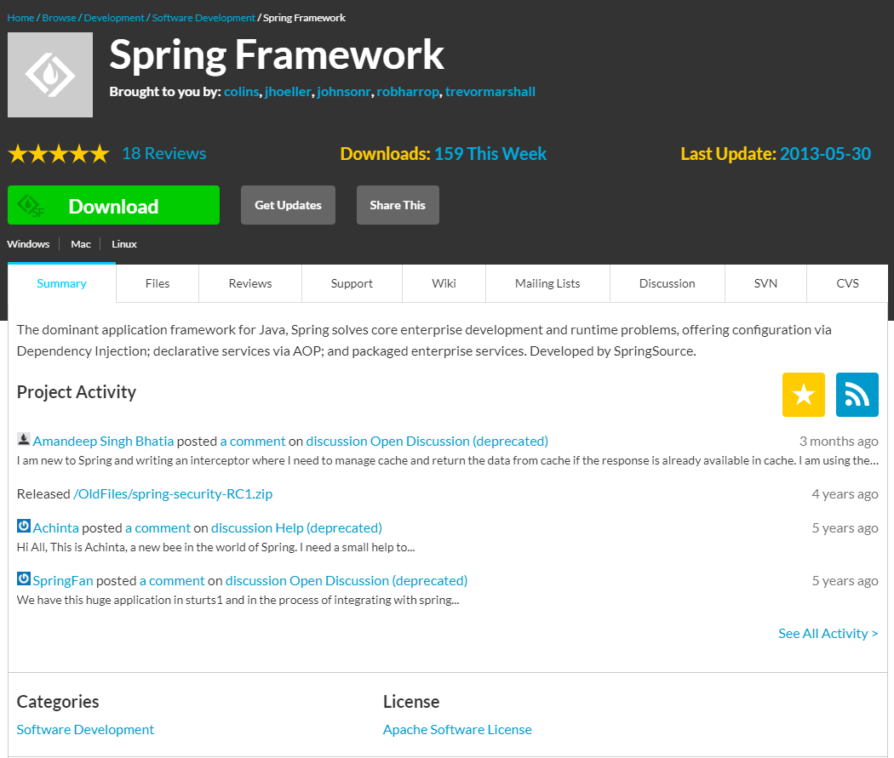
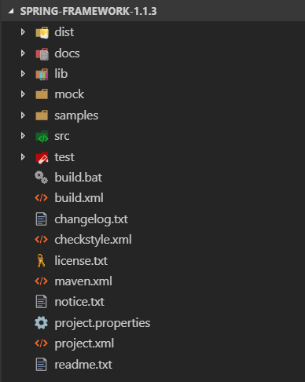
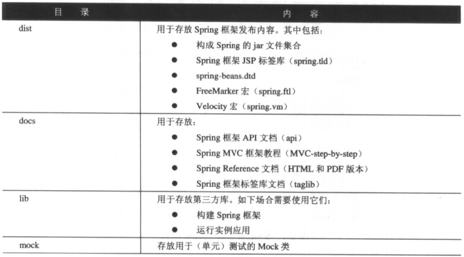
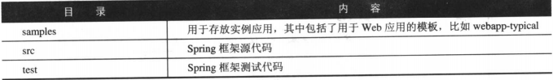

# 第2章 安装和构建Spring

Spring，是为企业级应用提供“一站式”服务的框架。

正如开发者所知，在提供优秀的开发工具和采用先进的软件技术前提下，开发出良好的软件产品也是不容易完成的任务。尽管J2EE平台承诺，开发Java/J2EE应用很简洁、高效，但实际情况不是如此。因为，开发过程往往难于控制进度、开发效率低下，而且很多开发者并没有真正用好J2EE组件技术。

Spring确信：J2EE应该易于使用：针对接口编程，而不是类；最大化使用JavaBean，以配置应用；OO设计是最为重要的，甚至比J2EE更重要；不要过度使用受查异常（Checked Exception）；利于测试，无论是单元测试，还是集成测试。这些内容，Spring都表现得很优秀，而且在持续改进。

Spring同时提供了二进制发布版和相应的源代码。开发者通过SourceForge网站（http://www.sourceforge.net/projects/springframework/）能够获得它们。借助于源代码，开发者能够更好地理解Spring架构，而且利于应用的调试。当然，开发者也可以构建Spring的自定义版本，从而能够满足自身的业务需求和架构需求。

本章内容将带领开发者研究Spring框架的安装和构建过程。

## 2.1 获得二进制文件

通过SourceForge Spring项目入口，开发者能够获得Spring发布版的持续更新版本。具体网址位于：http://www.sourceforge.net/projects/springframework/，如图2-1所示。

Spring二进制发布版同时提供两种版本。一种是Spring二进制发布版本身，而不提供其依赖的第三方库，比如spring-framework-1.1.3.zip。另一种是包含了其依赖的第三方库，比如spring-framework-1.1.3-with-dependencies.zip。本书建议开发者直接下载第二种发布版。

### 发布版目录结构

开发者在下载完成Spring后，通过解开发布版zip文件，能够浏览到如图2-2所示目录结构。

其中的主要目录所包含的内容如表2-1所示。

开发者可能已经注意到，Spring框架二进制发布版中也包含了用于构建目的的Spring框架源代码。请开发者注意，这并不完整。这同2.2节待介绍的基于CVS访问获得Spring框架的所有源代码及相关说明文件有所区别，比如Spring框架二进制发布版中并没有包含如何构建Spring Reference文档的readme.txt文件（位于\docs\reference目录下）。因此，本书将基于2.2节给出的内容来研究Spring的构建过程。

## 2.2 基于源代码构建Spring

现如今，大量的Open Source项目都是基于CVS管理的，而Eclipse IDE对CVS的支持相当完美，因此采用基于Eclipse IDE 开发Open Source项目成了很自然的事情，比如JBoss应用服务器项目、Spring框架项目。

在开发者下载Spring框架源代码后，可以发现Spring框架项目本身就是一个基于Eclipse的Java Project。

## 2.3 安装Spring

开发者在下载Spring二进制发布版后（或者在构建Spring之后）能够在解压后的二进制发布版目录中看到dist目录（对于开发者构建的Spring而言，也存在对应的dist目录）。其中的内容就是Spring框架提供的，即开发应用需要使用dist目录包含的jar文件集合。对于不同的类型应用，比如Web应用和非Web应用，所需要的jar文件有所区别。主要的Spring jar文件解释如表2-2所示。

另外，由于Spring框架本身使用了第三方类库，因此开发者还需要将lib目录下的应用需要的jar文件拷贝到目的应用中，比如Hibernate库。具体详情，开发者可以参考readme.txt文件（位于二进制发布版或源代码发布版的根目录下）。

对于不同的使用情形，一般都可以根据如下给出的建议来安装Spring。

* 对于简单的Java应用，只需要将使用到的jar文件拷贝到Java应用的classpath路径中。一般情况下，这类应用只需要spring-core.jar文件，比如example4。当然，如果存在数据访问逻辑，则需要依据操作数据库方式的不同，而拷贝不同的jar文件。
* 对于J2EE应用，比如B/S应用，则需要将使用到的jar文件拷贝到Web容器（比如，Tomcat或Jetty）或J2EE应用服务器（比如，JBoss，WebSphere以及WebLogic）中。如果需要将Spring框架提供的jar文件作为Web容器和J2EE应用服务器的全局库，即供所有的Web应用使用，则jar文件具体拷贝到的目标位置需要依据具体的服务器的情况而定；如果仅仅需要将Spring框架提供的jar文件供单个Web应用使用，则可以将jar文件拷贝到Web应用的WEB-INF/lib目录下。
* 由于spring.jar文件包含了其他的jar文件，因此在不考虑目标应用打包大小的前提下，简单地使用spring.jar文件最有效，而且不易出错。

## 2.4 小结

本章内容重点给出了Spring框架的安装和构建。其中，还重点给出了若干个Ant任务。开发者可以使用它们，从而为自己的项目服务，尤其是Clover的使用。

第3章内容将开始研究Spring框架提供的IoC容器。