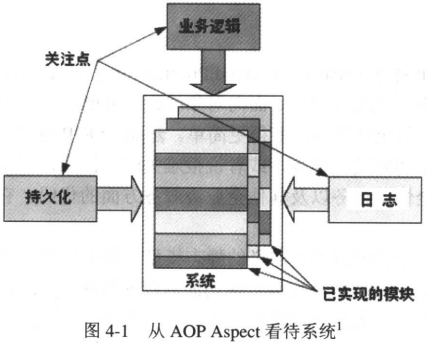
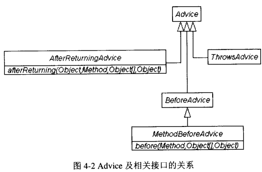

# 第4章 面向方面编程（Spring AOP）

AOP，即面向方面编程（Aspect-Oriented Programming），是最近在J2EE领域（当然，也包括.NET领域）最热门的名词之一。面向对象编程（OOP）是当今软件开发的主要模式，这使得架构并实现大型的企业级项目变得更简单。然而，OOP更多地从系统的垂直切面关注问题，对于系统的横切面关注甚少，或者说很难关注。比如，开发者可以看到，在系统中到处都是日志、安全性、事务以及其他企业级服务方面的代码，它们大量地存在于各个实现类中。

AOP允许开发者动态修改OOP定义的静态模型，即不用修改原始的OO模型，甚至可以不用修改OO代码本身，即可完成对横切面问题的解决。比如，将系统中处理日志、安全性、事务及其他企业级服务的代码集中放置在一个地方。因此，AOP使得OOP中的重复代码能够大范围减少。

Spring AOP承诺：尽管不提供最完整的AOP实现，但是会将具体的AOP实现（包括其他AOP实现）与Spring IoC集成在一起，以解决企业用用中常见的问题。

本章内容将阐述AOP基础知识，并在其基础上深入研究Spring AOP提供的具体实现。其中，将给出大量的实际使用实例。

## 4.1 AOP及Spring AOP背景知识

通常，为满足整个企业应用某方面的需求，开发者（架构师）需要整理出系统的关注点。图4-1形象地描述了关注点，它能够从AOP Aspect角度看待系统。比如，持久化、日志、应用的业务逻辑通常被认为是应用需要重点解决的问题。因此，它们通常作为关注点看待。从整个系统角度考虑，它往往是由大量的关注点构成的。试想，在收银系统（POS）中，业务架构师往往需要考虑如下方面的关注点：收银管理、用户管理、销售管理、促销管理、外设管理、报表查询等。除了这些业务功能之外，还需要涉及到系统的便携性、可维护性、对用户进行评审能力的强弱、健壮性。

因此，大体而言，所有的关注点可以分为两类：核心关注点和横切关注点。其中，核心关注点主要是关注系统的业务逻辑；横切关注点主要关注系统级的服务，供业务逻辑使用。在整个业务逻辑中，到处都涉及到横切关注点。因此，对于各个已实现的模块（业务逻辑）而言，都将有大量的横切关注点（系统级服务，比如日志、事务、安全性）实现为它服务。

对于业务逻辑关注点，使用OO技术能够很好地实现。对于不同企业应用而言，在不同行业，业务逻辑存在很大不同。因此，借助于OO技术能够很好地实现它。但是，由于业务逻辑的差异性，使得开发者不能够提供统一的框架来满足各种各样的业务需求。

对于横切关注点，可以使用AOP技术来实现。因为横切关注点关注的是系统级服务，这类服务对于大部分应用而言都是最常见的，很容易将它们抽象出来，并加以实现。而本章内容正是关注于横切关注点的。



面向对象技术将应用系统分解成由层次结构组成的对象，而AOP能够将它分解成方面（Aspect）看待。由于两者看待问题的角度不同，使得开发者必须区别对待系统。本书不对AOP的术语及基础知识进行过多的介绍。Spring涉及到的内容很丰富，而且它集成了大量的Open Source项目和非Open Source项目，因此过多地关注各项目的背景及知识会使得本书负荷太大。而且，本书也不想为此而付出过多的篇幅。毕竟，本书是专注于Spring的。因此，在整本书的讨论中，涉及到各种项目时，都没有细心地对它们进行讨论。如果开发者不熟悉相应的内容，则可以查看相关资料。

基于AOP，业界存在各种各样的AOP实现。比如，JBoss AOP、Spring AOP、AspectJ、AspectWerkz等。各自实现的功能也不一样。当然，连接点模型（joinpoint）的强弱在很大程度上决定了AOP实现功能的强弱。其中joinpoint是指AOP Aspect能够在应用系统中执行的地方，比如某个方法调用之前、修改某个域之前。本书专注于Spring AOP。因此，开始进入Spring AOP视野吧。

Spring AOP实现是Spring 框架的重要组成部分，它实现了AOP联盟约定的接口。当然，如果开发者不需要适用AOP，而只需要Spring IoC容器（即BeanFactory和ApplicationContext，前面章节有介绍），则可以不使用，Spring框架能够提供这种灵活性。这类似于JBoss中的JMX MBean服务实现，即如果某应用不需要JBoss提供的、基于JMX MBean实现的MBean服务，比如邮件服务，则开发者可以删除相应的服务配置文件。

Spring AOP是由100%Java开发完成的，因为它能够秉承Java的一切优势，“一次编写，到处运行”。目前，Spring AOP只实现了方法级的joinpoint。有些AOP实现支持域级的joinpoint，比如JBoss AOP、AspectJ。当然，尽管Spring也能够用于J2SE、J2ME应用的开发，但开发者主要是在J2EE应用中使用它，更何况Spring Team也推荐在J2EE中使用。J2EE应用中，AOP能够拦截到方法级的操作已经足够了。因此，实用的Spring并没有遗憾。再者，OOP倡导的是基于setter/getter方法访问域，而不是直接访问域，因此Spring有足够的理由仅仅提供方法级的joinpoint。以后如何，谁也无法预料。为使得SpringIoC能够很方便地使用到非常健壮、灵活的企业级服务，则需要借助于Spring AOP实现。因为Spring AOP能够提供如下几个方面的优势。

* 允许开发者使用声明式企业级服务，比如事务服务、安全性服务。EJB开发者都知道。EJB组件能够使用J2EE容器提供的声明式服务。但是，这些服务需要借助于EJB容器，否则EJB组件无法使用。而Spring AOP却不需要EJB容器，即借助于Spring的事务抽象框架便能够在EJB容器外部使用企业级、声明式服务。
* 开发者可以开发满足业务需求的自定义方面。类似于JBoss服务器中的拦截器开发一样，如果标准的J2EE安全性不能够满足业务需求，则必须开发拦截器。当然，对于JBoss4.0而言，借助于JBossAOP实现类似功能更简单。
* 开发Spring AOP Advice很方便。因为这些AOP Advice仅仅是POJO类。借助于Spring提供的ProxyFactoryBean，能够快速地搭建Spring AOP Advice使能应用。

为开发AOP使能应用，开发者需要开发AOP Advice，这也是AOP开发中所需要开发的主要内容。因为，Advice含有AOP Aspect的主要逻辑。其中，本书将AOP中的Advice一词约定为“装备”。在AOP中，通常存在如下5种装备（Advice）类型：

* Before装备：在执行目标操作之前执行的装备。
* Throws装备：如果目标操作在执行过程中抛出了异常，则该装备会执行。由于Spring AOP提供了强类型化的Throws装备，因此开发者可以采用Java捕捉异常的机制来开发应用，而不用对异常信息或Throwable进行造型。
* After装备：在执行目标操作之后执行的装备。
* Around装备：在方法调用前后执行的装备。这种装备的功能最强大，因此它能够在目标操作执行前后实现特定的行为。而且，Around装备的使用最为灵活。
* Introduction装备：由于Introduction装备能够为类新增方法，因此在所有5种装备中，它最复杂、也最难掌握。考虑到篇幅因素，本书不对这种装备进行阐述。当然，借助于上述5种装备，基本上能够解决J2EE应用中的常见问题。

因此，本书将重点研究Spring AOP装备的内容。由于开发者在开发企业级应用过程中，经常会使用上述几种装备类型，因此下节内容将重点阐述它们。

## 4.2 Spring AOP装备

在开发实际应用过程中，由于各自的业务需求都不同，因此开发者需要灵活选用Spring AOP装备。对于Spring AOP装备而言，开发者通常会涉及到如下几个接口：

* org.springframework.aop.MethodBeforeAdvice：用于实现Before装备。
* org.springframework.aop.AfterReturningAdvicd：用于实现After装备。
* org.springframework.aop.ThrowsAdvice：用于实现Throws装备。
* org.aopalliance.intercept.MethodInterceptor：可供实现Around装备使用。

它们之间的关系如图4-2所示



### 4.2.1 Before装备

本书将结合example5展开对Before装备的研究。为实现Before装备，开发者需要实现MethodBeforeAdvice接口。比如，example5实现的LoggingBeforeAdvice装备如下。

```java
package com.openv.spring;

import org.apache.commons.logging.Log;
import org.apache.commons.logging.LogFactory;
import org.springframework.aop.MethodBeforeAdvice;

import java.lang.reflect.Method;

/**
 * LoggingBeforeAdvice：Before装备实现
 *
 * @author shenhuanjie
 * @date 2019/6/6 15:56
 */
public class LoggingBeforeAdvice implements MethodBeforeAdvice {

    protected static final Log log = LogFactory.getLog(LoggingBeforeAdvice.class);

    /**
     * Callback before a given method is invoked.
     *
     * @param method method being invoked
     * @param args   arguments to the method
     * @param target target of the method invocation. May be <code>null</code>.
     * @throws Throwable if this object wishes to abort the call.
     *                   Any exception thrown will be returned to the caller if it's
     *                   allowed by the method signature. Otherwise the exception
     *                   will be wrapped as a runtime exception.
     */
    @Override
    public void before(Method method, Object[] args, Object target) throws Throwable {
        log.info("before: The Invocation of getContent() ");
    }
}

```

开发者是否注意到，Before装备需要实现before方法。该方法将调用目标操作前被调用。这很适用于那些安全性要求的方法，即在调用目标操作前检查客户的身份。为将上述LoggingBeforeAdvice装备配置在Spring IoC容器中，开发者还需要提供appcontext.xml文件。具体如下（其中，包含的IHelloWorld及其实现并没有给出，开发者可以参考Eclipse中的example5项目）。

