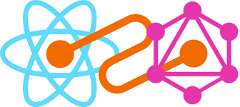
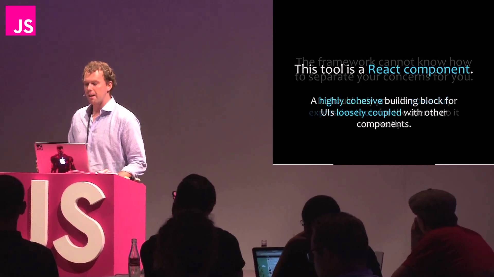
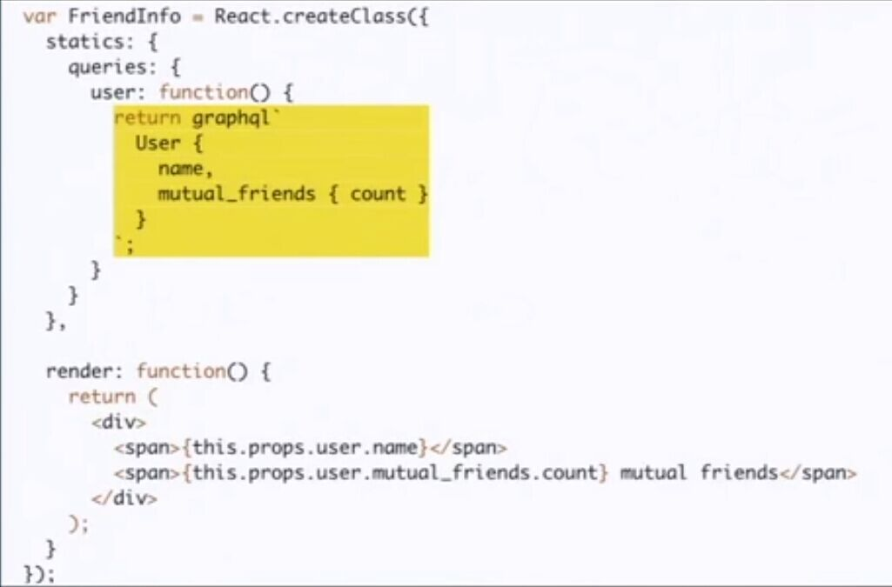

# Facebook的Web开发三板斧：React.js、Relay和GraphQL

Eric Florenzano最近在自己的博客上发表了一篇题为《Facebook教我们如何构建网站》的文章，他认为软件开发有些时候需要比较大的跨越，而这将会在2015年再次上演，主角们则是Facebook的React.js、Relay和GraphQL。

Eric Florenzano在该文章中提到：2003年Brad Fitzpatrick发布了Memcached，由此开启了LiveJournal架构的时代；2004年Google发布了MapReduce论文，由此诞生了Hadoop并开始风靡世界；2007年Amazon发布了Dynamo存储系统，让我们知晓了如何通过线性扩展的方式让数据库和应用程序一起工作，并导致了Cassandra、Riak等数据库的产生；2010年Twitter教会了我们如何通过客户端模板让服务器端变成一些简单的API，并引发了Web应用的又一次大转变；2012年Google发布了Angular.js 1.0，并最终成为流行的Web开发框架，这一切都有一个共同点，那就是：公司或者创业团队从生产中得到了沉痛的教训，从失败中找到了向前的出路，然后在将自己的技术突破共享出来的时候引发了一系列的变革。Fitzpatrick相信，在2015年Facebook将会通过React.js、Relay和GraphQL三把利剑引发Web应用开发的另一次跨越。

Fitzpatrick做出如此判断的理由主要是基于Facebook的员工在一些演讲中所透露出的Web开发理念。例如，Pete Hunt在2013年的JSConf上做了题为《React：重新思考最佳实践》的演讲，讲述了Facebook之所以会避开某些“最佳实践”的原因，Pete Hunt认为JS模板分离了技术，但是并没有分离关注点，而框架并不知道如何分离关注点，解决这一问题的方案是组件，要充分利用JavaScript的能力，削弱模板的作用；Daniel Schafer和Jing Chen在2015年的React.js Conf上讲述了Facebook如何通过GraphQL改变既有的数据获取方式，让开发者更容易地在React应用中获取数据；Christopher Chedeau在《React：CSS in JS》中讲述了在大规模使用CSS时所面临的问题以及如何通过JS来解决。

总的来说，Facebook提出的Web开发理念可以概括为：**将应用分解为一个个独立的组件，与该组件相关的样式、标记、验证以及数据要求都放到组件定义的内部，对于自我渲染所需的所有数据每一个组件都有明确的声明且保存在该组件内部，同时对于哪些行为会改变组件的状态，组件状态改变之后会有哪些反应也要有明确的定义。**通过这种方式编写的组件能够封装它自身的逻辑，使得组件高内聚，组件之间低耦合，增强了复用性，同时也降低了开发人员的运维难度和复杂性。

毫无疑问，Facebook提出的技术与理念对于大部分Web网站开发团队而言还是有一定借鉴意义的，其中的思想也值得我们深思与学习，但是Fitzpatrick的判断是否真的会实现，Facebook的React.js、Relay和GraphQL是否会引发Web开发的再一次变革，只有等待时间来验证了。

## 什么是Relay

Relay是Facebook在React.js Conf（2015年1月）上首次公开的一个新框架，用于为React应用处理数据层问题。

在Relay中，每个组件都使用一种叫做GraphQL的查询语句声明对数据的依赖。组件可以使用`this.props`访问获取到的数据。

开发者可以自由地组合React组件，而Relay负责把不同组件的数据查询语句（原文的`query`）集中高效地组织并处理，向组件提供精确粒度的数据（没有多余数据），当数据变化时通知相应组件更新，并在客户端维护一份包含所有数据的数据缓存`store`。

## 什么是GraphQL

GraphQL是一种用于描述复杂、嵌套的数据依赖的查询语句。它已经在Facebook的原生APP上使用了多年。

在服务器端，我们通过配置将GraphQL与底层的数据查询代码映射起来。这层配置使得GraphQL可以访问不同的底层存储系统。Relay使用GraphQL作为数据查询语句，但并不指定GraphQL的具体实现。

## 与Flux的关系

在某些方面Relay的灵感来自于Flux，但是理论模型变得更加简化。Relay用缓存所有GraphQL数据的唯一的store代替了Flux中分散的store；相对于Flux由组件自行监听数据变更，Relay用框架管理数据订阅和视图更新。 Instead of actions, modifications take the form of mutations

在Facebook，我们有完全使用Flux的项目，有完全使用Relay的项目，也有两者兼用的项目。一个我们逐渐意识到的模式是让Relay管理应用级的数据流，而让Flux管理数据之外的应用状态。

## 关于Relay与GraphQL的介绍

译注：Flux更多像是一个理念宣言，在Flux身上有太多不成熟、不细化的感觉（千奇百怪的声称基于Flux的框架就是例子），而所有这些问题，答案可能就在最近公布的Relay中，虽然Relay还没开源，但通过简单的介绍和视频，译者认为它像是把Flux的理念成熟化、框架化，非常值得React开发者关注。

原文：[Introducing Relay and GraphQL](http://facebook.github.io/react/blog/2015/02/20/introducing-relay-and-graphql.html)
视频地址（强烈建议观看）：https://www.youtube.com/watch?v=9sc8Pyc51uU

## React应用如何获取数据

如今，Web开发从单纯的构建界面变得更加接近应用（application）。数据获取是一个棘手的问题，特别是当应用变得复杂的时候。在[React.js Conf**7**](http://conf.reactjs.com/)上，Facebook公布了两个项目，用于帮助开发者简化数据层的问题，即使面对拥有众多参与者、复杂得像Facebook一样的项目。

这两个项目——Relay和GraphQL——已经在Facebook的产品中使用了一段时间了，我们很高兴将来能够把他们贡献给开源社区。现在，让我们先分享一些额外的信息。

## Relay理念

Relay是根据在Facebook构建大型应用的经验而诞生的。我们的首要任务是让开发者能以符合直觉的方式构建正确、高性能的WEB应用。它的设计使得即使是大型团队也能以高度隔离的方式应对功能变更。获取数据、数据变更、性能，都是让人头痛的问题。Relay则致力于简化这些问题，把复杂的部分交给框架处理，让开发者更加专注于应用本身。

将查询语句放到视图层代码中，开发者只需查看组件本身的代码就可以轻易理解组件的行为：**不需要考虑和理解组件所处的上下文**。组件可以在任何地方重用，而不用修改它的父组件或服务器端代码为它传递或准备数据。

译者注：上图在原博中没有，为视频中截下来的代码截图，展示了Relay的query与展示代码混杂，图中`黄色`部分既为GraphQL语句。

**代码混杂**（原文为Co-location，意为将数据查询语句放在视图组件代码中）将开发者带入了“幸福的坑”(猜测此处的“坑”是指这种混杂看起来像是反模式)，他们可以细粒度地获取需要的数据字段，而对粒度的声明就在视图层代码上。这意味着性能自然地得到了提升（更难获取冗余数据），而组件变得更加健壮（同样得益于显式的数据依赖声明，字段缺失的情况也得以避免，组件不会在运行时因为渲染缺失的字段而挂掉）。

Relay通过维护组件与数据间的依赖——在依赖的数据就绪前组件不会被渲染——为开发者提供更加可预测的开发环境。另外，数据查询语句是静态声明的（换句话说，我们可以在渲染前抽离分析整个组件树的查询语句），而GraphQL语法提供了对有效数据的准确描述，因此我们可以通过校验数据查询语句来尽早地发现开发者所犯的错误。

组件只能访问在数据查询语句中声明过的字段，即使其它字段已经被缓存在数据Store中（其它组件可能需要这些字段）。这杜绝了隐式的数据依赖导致的潜在bug。

通过统一的抽象来处理所有的数据获取工作，我们得以处理很多在应用中普遍而重复的问题：

- **性能**： 所有的查询都经过框架统一处理，否则会变得非常低效。重复的查询会被自动合并并批处理成高效的、最小化的。同样地，框架知道哪些数据之前被请求过，或者哪些请求正在进行当中，因此数据查询可以自动去重至最小化。
- **监听**： 所有的数据都存放在唯一的Store中，对该Store的读取也由框架管理。这意味着框架了解哪个组件关心哪些数据，数据变化时哪些组件应该重新渲染；组件不再需要自行监听数据更新。
- **公共范式**： 可以更容易地构造公共范式。在大会上 [Jing**3**](https://twitter.com/jingc)给出的例子是分页：如果你在初始状态有10条记录，翻页意味着声明你总共需要15条数据（注：每页5条记录，这儿的翻页类似于下拉刷新，新数据append到当前的后面），框架会分析出你需要和数据和现有数据之间的差值并构建最小查询，然后在服务器返回数据时更新视图。
- **简化服务器端**： 相比于分散的响应端点（响应每个action，每个路由项），GraphQL接口可以作为底层资源对外的统一门面
- **统一处理数据变更**： Relay有统一的处理数据变更（写数据）的模式，在概念上它被抽象成了数据查询模型。你可以理解成一次数据变更由两条数据查询语句组成：一条是带有副作用的——你提供描述变更的变量（例如：往一条记录中添加一条评论），另一条则指明了当变更完成后更新View视图所需要的数据（例如：评论总数），然后数据像正常的数据流一样被框架处理。我们可以乐观地立即渲染客户端，即在假设数据变更成功的前提下更新视图，在最后提交更新，如果服务器端返回异常则尝试重试或回滚视图。(注：此段翻译不是太有信心，原文的表述看得不怎么明白)

## 译者后记：

之前有看过Flux的相关资料，也试着自己写过基于Flux的[框架**10**](https://github.com/kpaxqin/Fluxify)和demo，但总觉得Flux更像一个半成品：对服务器端交互的问题没有很好地回答，手工订阅的action必定会面临膨胀等……

Relay像是Flux进一步成熟和发展的产物，某种程度上说甚至有了Angular的影子：更细粒度的声明式的数据依赖管理，框架监听处理数据变化。

目前的资料还比较少，很多问题需要等待更进一步的资料或代码才能弄明白，不过Relay可以说是继Flux后往前走的一大步，非常值得继续关注