# 第1章 初始小程序

微信小程序自2016年9月21日内测以来，就引起广泛关注，越来越多的开发者开始研究如何使用它，在业界刮起了一阵不小的飓风。小程序不仅在商业上具备很大潜力，同时在技术上解决了一套代码多段运行和动态发版的两大痛点，用户在微信中扫一扫或搜一下即可打开具备原生体验的应用，这给开发者带来了很大的想象空间。小程序还在测试阶段就有大量开发者尝试为其开发各种框架，其中腾讯云还开发了一套微信小程序解决方案（https://www.qcloud.com/solution/la.html），由此可见小程序在业界的影响力非同小可。本章将介绍小程序的接入流程，并展示第一个小程序的开发过程，使读者快速入门，简单体验小程序的开发流程。

## 1.1 简介

按官方定义来讲，小程序是一种不需要下载安装即可使用的应用，它实现了应用“触手可及”的梦想，用户扫一扫或者搜一下即可打开应用。也体现了“用完即走”的理念，用户不用担心是否安装太多应用的问题。应用将无处不在，随时可用，但又无需安装卸载。

从技术角度来讲，小程序采用了类似[React Native](https://reactnative.cn/)和[Weex](http://weex.apache.org/cn/)一样的解析技术。开发者可编写一套代码在多端运行（Android微信、iOS微信和浏览器容器），同时相比公众号H5应用，小程序具备更好的原生体验。严格来讲，小程序也是需要下载和安装的，只是由于技术实现方案以及官方规定小程序包容量不得超过1M，使得下载、安装（部署）过程特别快，用户在感官上察觉不到它在安装而已。为了达到用完即走、快速开发的目的，小程序提供了一套完整的开发框架、丰富的组件和API，相比React Native和Weex，小程序将技术与商业进行了完美的结合。

## 1.2 接入流程

小程序与订阅号、服务号、企业号是并行的体系，具有独立的注册、发布流程。开发小程序首先需要在微信公众平台上注册小程序，完善基本信息，然后下载开发者工具进行编码，最后通过开发者工具提交代码，官方审核通过后便可发布。要注意的是，现阶段每个机构账号只允许注册最多50个小程序，每个小程序一年需要交纳300元，所有小程序都需要绑定一个电子邮箱，一个手机号码最多只能绑定5个小程序。

### 1.2.1 注册小程序账号

注册小程序只需如下四步：

1）在微信公众平台官网首页（mp.weixin.qq.com）点击右上角的“立即注册”按钮，如图1-1所示。

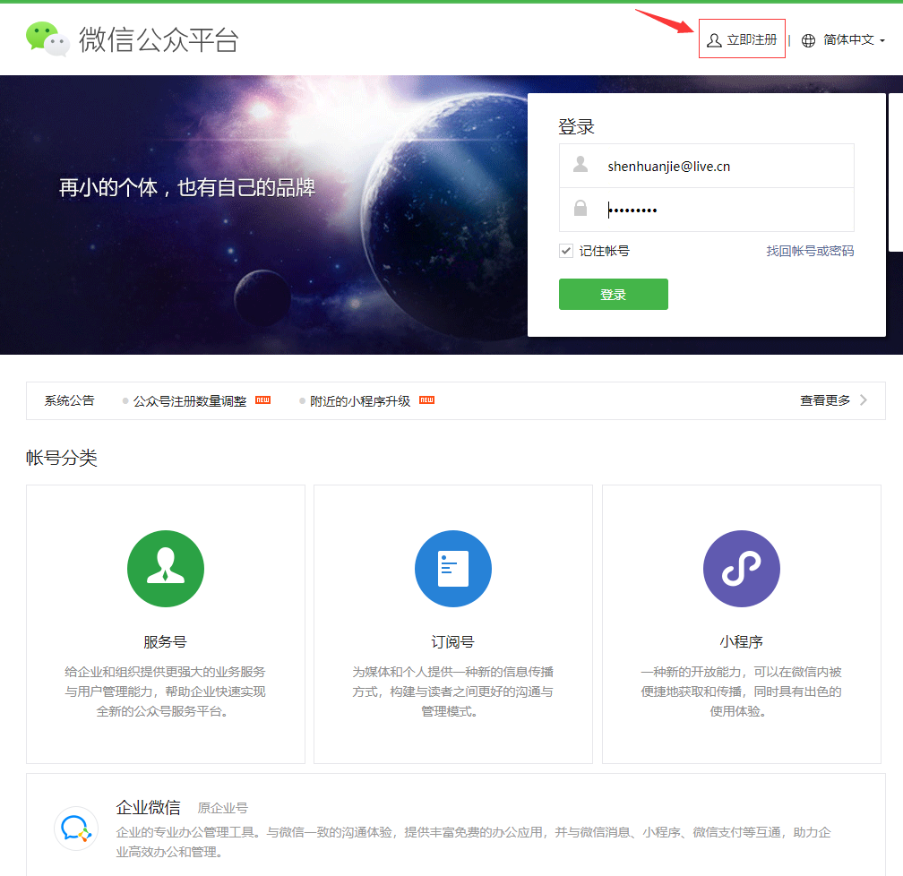

2）选注册的账号类型，选择“小程序”，如图1-2所示。

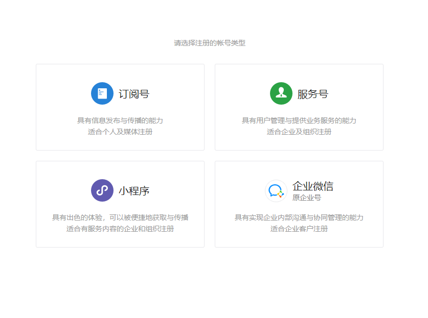

3）进入账号信息页面，填写未注册过公共平台、开发平台、企业号、未绑定个人号的邮箱，这个邮箱将作为以后登录小程序后台的账号，如图1-3所示。

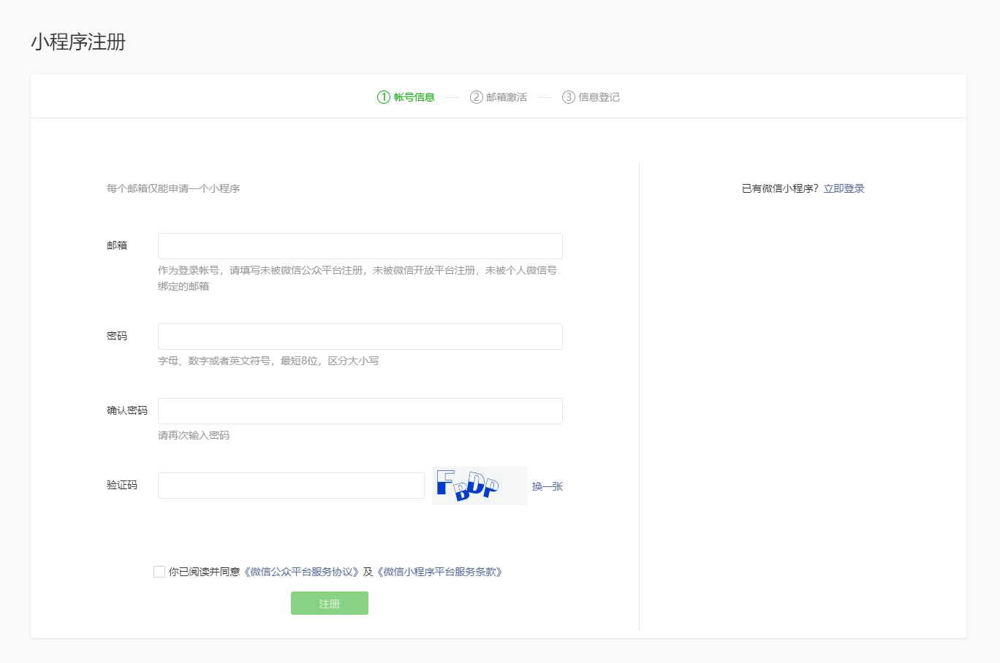

4）填写个人账号信息后，会收到一封激活邮件，点击激活链接，进入主体信息页面填写相关内容，即可完成注册流程，主体信息一经提交后便不可修改，如图1-4所示。

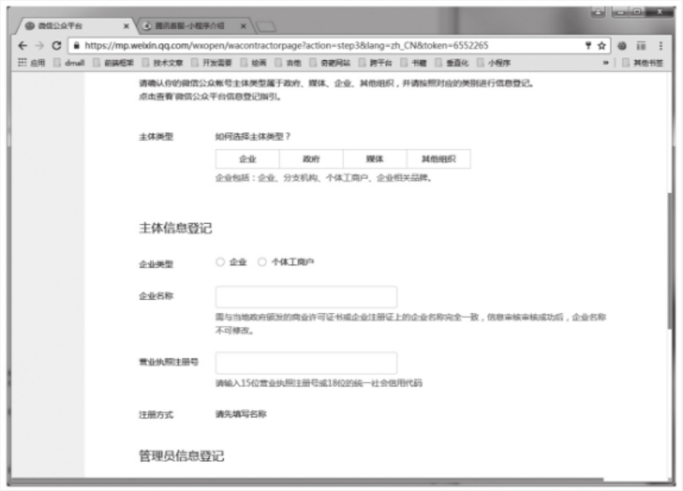

### 1.2.2 开发环境准备

完成账号注册后，需要登录微信公共平台官网（mp.weixin.qq.com），根据流程完善小程序信息，如图1-5所示。需要注意的是，目前小程序名称一旦确定后便不能修改。

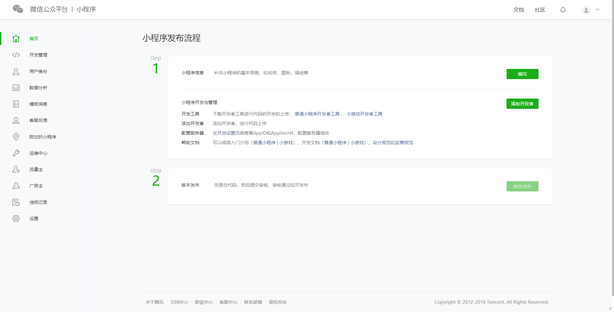

开发小程序之前还需要进入“用户身份-开发者”，绑定开发者，如图1-6所示。只有绑定的开发者才能使用开发者工具编写小程序，一个小程序最多可以绑定20个开发者，未认证的小程序最多可以绑定10个开发者。

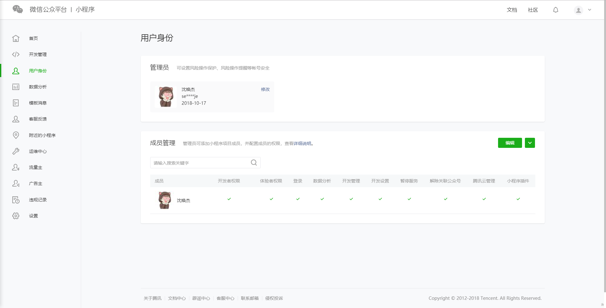

添加开发者后，需要进入“设置-开发设置”，获取AppID，如图1-7所示。AppID十分重要，只有填写了AppID的项目才能通过手机微信扫码进行真机测试。

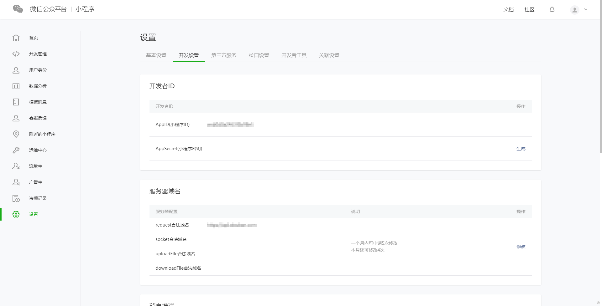

最后便可到首页下载开发者工具，如图1-8所示。小程序开发工具主要用于小程序调试、预览，虽然自带了代码编辑功能，但还是建议使用自己熟悉的编辑器对代码进行编辑（如：sublime、atom、brackets等）。

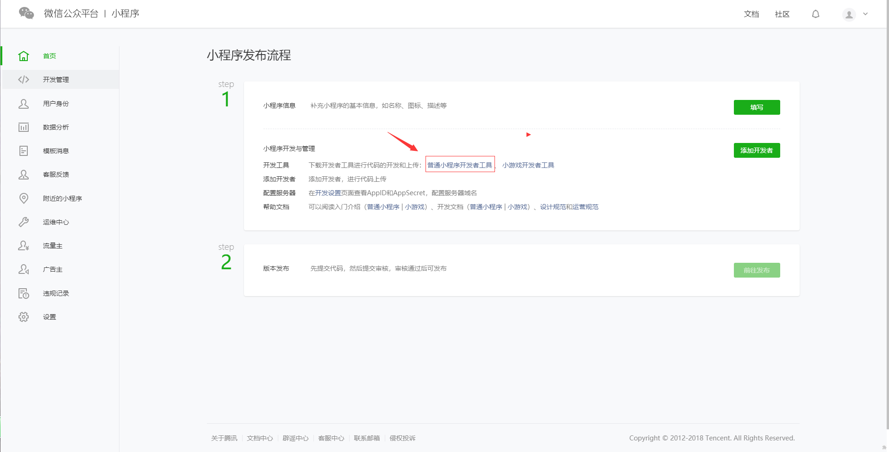

## 1.3 第一个小程序

完成开发准备后我们便可以开始编写小程序，微信小程序的开发十分简单，大家可以快速上手。下面我们利用官方提供的demo让大家对小程序开发有初步认识。

1）打开微信开发者工具。第一次启动需要扫描二维码登录，如图1-9所示，开发权限配置参照上一小节。

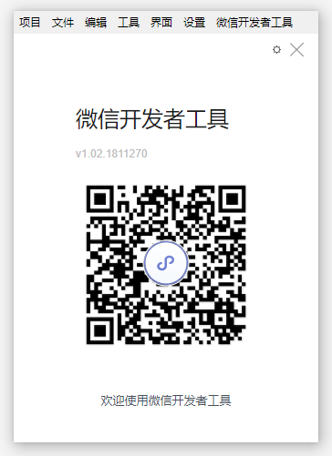

2）登录后选择“添加项目”。

3）在填写项目信息之前，先创建一个空目录作为项目之一目录。

4）填写项目信息。如果没有AppID可以选择“无AppID”；填写项目名称，项目名称在微信开发工具中是唯一的；项目目录选择刚才创建的空目录，这里一定要保证刚才创建的目录为空目录，这样下面会出现“在当前目录中创建quick start项目”选项，勾选这个选项，如图1-10所示，然后点击“添加项目”按钮。

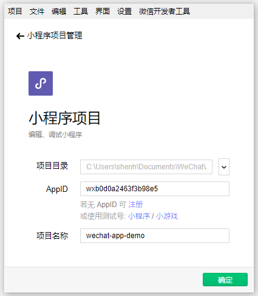

创建好后的界面如图1-11所示。

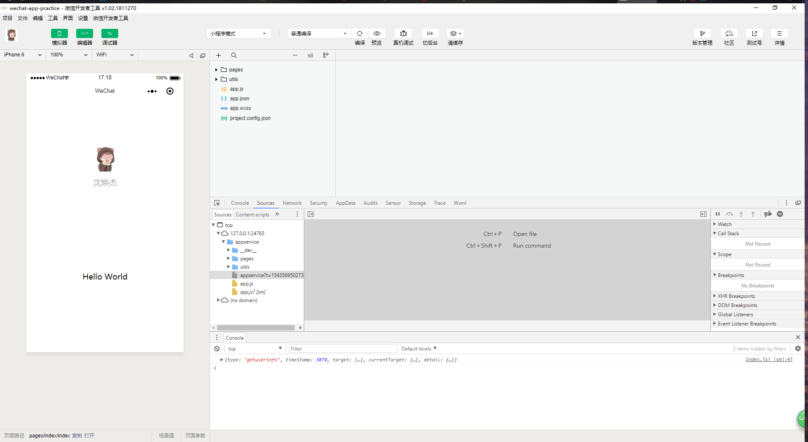

这样我们便成功创建了第一个小程序，这个demo是官方提供的示例，第一个页面展示了当前登录的用户信息，点击头像会跳转到一个记录当前小程序启动时间的日志页面。为了让大家进一步体验小程序开发，我们修改index.wxml，将“{{motto}}“替换为”我的第一个小程序“

```html
<!--index.wxml-->
<view class="container">
  <view class="userinfo">
    <button wx:if="{{!hasUserInfo && canIUse}}" open-type="getUserInfo" bindgetuserinfo="getUserInfo"> 获取头像昵称 </button>
    <block wx:else>
      <image bindtap="bindViewTap" class="userinfo-avatar" src="{{userInfo.avatarUrl}}" mode="cover"></image>
      <text class="userinfo-nickname">{{userInfo.nickName}}</text>
    </block>
  </view>
  <view class="usermotto">
      <!-- 修改这句代码 -->
    <text class="user-motto">我的第一个小程序</text>
  </view>
</view>
```

修改后点击“重启”，如图1-12所示。

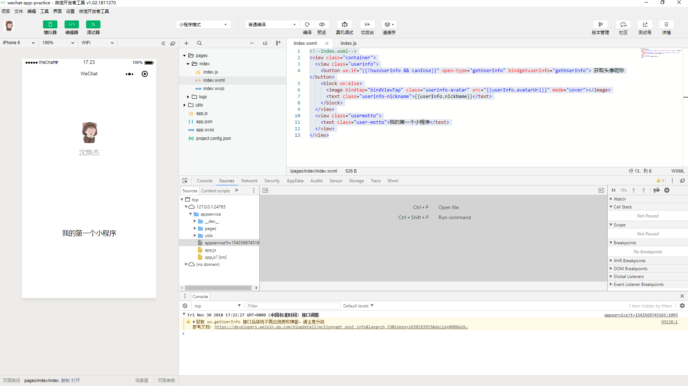

重启后，登录界面提示语由原来的“Hello World”变成了“我的第一个小程序”，如图1-13所示。

填写了AppID的项目可以选择“项目-预览”（如图1-14所示），扫描二维码在微信中体验项目。

至此我们简单体验了一个小程序的创建过程，但对于一个喜欢“刨根问底”学习者来说，这个案例远远不够，可能会有很多问题，例如：

* 小程序启动入口在哪里？
* index.wxml、index.wxss、index.js等文件是否可以重新命名？它们之间的关系是什么？目录结构有怎样的规范？
* WXML、WXSS文件是什么？怎么感觉很像HTML和CSS？
* 小程序开发有哪些限制？

大家可以先按自己理解尝试修改项目中相关的文件，看看能产生什么效果，把过程中遇到的问题记录下来，带着问题阅读后面的章节。