# 第2章 小程序开发核心

上一章讲解了小程序创建流程，本章主要为大家讲解小程序框架及核心内容。小程序框架可让开发者在微信中用尽可能简单、高效的方式开发出具有原生App体验的服务，这套框架控制着小程序完整的生命周期，负责页面的加载、渲染、销毁等工作，它是小程序的核心，学习小程序前，我们一定要对这套框架有深入的了解。本章主要对小程序目录结构、文件类型进行详细分析，重点介绍小程序视图层WXML、MXSS，逻辑层JS，这些是小程序开发的核心内容。本章个别小结内容比较深，学习过程中不必过于深究，能对框架有个整体认识即可。

## 2.1 简介

小程序框架将整个系统划分为视图层和逻辑层，视图层是由框架设计的标签语言WXML（WeiXin Markup Language）和用于描述WXML组件样式的WXSS（WeiXIn Style Sheets）组成，它们的关系就像HTML和CSS的关系。WXML和WXSS在渲染时会被框架解析为不同端的本地渲染文件，这样保证一套代码能在多处运行，并且能最大化地接近原生App。渲染原理和React Native、Weex十分接近，开发过程中我们不必深究WXML的渲染原理，只需要有个大致了解即可。小程序逻辑层是一套运行在本地JavaScript引擎的JavaScript代码，在此基础上框架实现了一套模块化机制，让每个JS文件有独立的作用域和模块化能力，这套模块化机制遵循CommonJS规范，熟悉NodeJs的开发者应该有一定了解。

小程序整体开发流程非常接近前端HTML+CSS+JavaScript的开发模式，与前端开发不同的是，在小程序中没有DOM的概念，在本地的JavaScript引擎中也没有window、document等对象，我们不能想当然地通过操作DOM来操作页面，小程序中的视图层和逻辑层的交互式通过数据绑定和事件响应实现的，这是一种单向绑定的机制。这套机制需要首先将逻辑层和视图层的数据和事件进行绑定，当需要修改页面时，逻辑层只需要调用特定的setData方法修改已绑定的数据，这时框架会自动触发WXML重新渲染，达到逻辑层对视图层的控制；当框架接收到用户交互操作时，会根据视图层绑定的事件，执行逻辑层中对应的事件函数，达到逻辑层对视图层的响应，视图层与逻辑层的关系如图2-1所示。这套机制是小程序框架的工作原理，在后续内容中我们将反复提及，加深大家对它的理解。

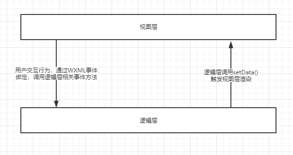

## 2.2 “徒手”创建小程序

为了让开发者更好地理解小程序框架运行机制，接下来将带领大家“徒手”创建一个结构最简单的小程序，这样每个细节都是开发者自己完成的，这对理解小程序框架有很大帮助。步骤如下：

* 1）创建项目目录
* 2）按图2-2所示的目录结构创建文件：


* 3）打开app.json，写入以下代码：

```json
{
    "pages":{
        /* 指定默认启动页面地址 */
        "pages/index/index"
    }
}
```

* 4）打开index.wxml，写入以下代码：

```html
<view bindtap="countClick">我是index页面，你点击了{{count}}次</view>
```

* 5）打开index.js文件，写入以下代码：

```js
Page({
    data:{
        count:0
    },
    countClick:function(){
        this.setData({
            count:this.data.count+1
        });
    }
});
```

就这么几步，一个最简单的小程序便搭建好了，项目中仅包含一个index页面，这个目录结构是最简单、最基础的小程序结构。接下来我们将它导入开发者工具中看看运行效果。

* 6）打开微信开发者工具，填写AppId和项目名称，点击“选择”按钮添加项目，项目目录选择刚才创建的目录，点击“添加项目”完成添加，如图2-3所示：

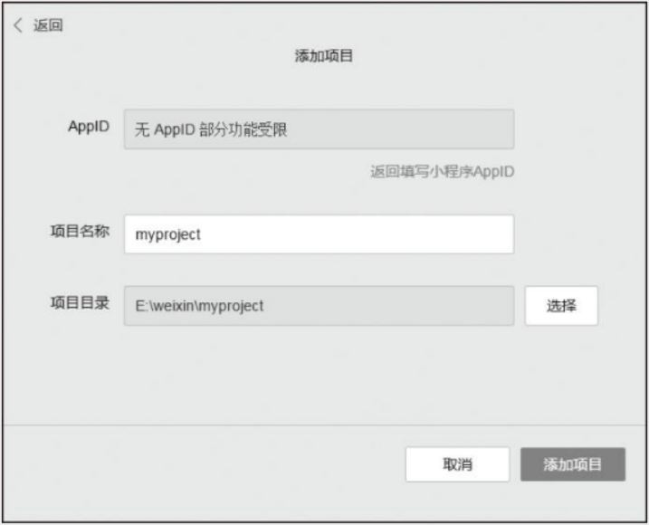

* 7）导入项目后我们便能看到运行界面，当我们点击文字时，点击次数也会随之增加（如图2-4所示）。

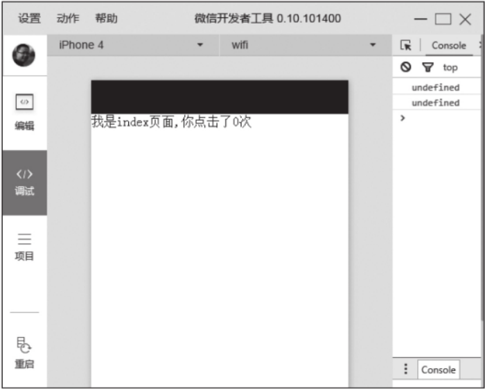

这就是最简单的小程序，所有复杂的项目都是围绕这个结构进行拓展的。当运行这个项目时，框架首先会解析配置文件app.json，通过pages设置找到默认首页页面（pages第一个路径默认为首页），然后加载目录中index.wxml、index.wxss、index.js、index.json这4个文件进行页面渲染。

在index.wxml文件中，我们简单实用了`<view/>`组件，页面渲染时，框架将逻辑层中data的count属性与视图层的count进行了绑定，所以一打开页面会显示点击次数为0。当点击`<view/>`时，会触发tap事件，这时视图层根据`<view/>`组件bindtap属性值，将绑定的countClick事件发送给逻辑层，逻辑层根据方法名找到对应的事件处理函数countClick并执行。countClick函数中，我们调用了setData方法修改count值，并触发视图层渲染，所以页面中的数字随着点击次数增加，这种视图层和逻辑层之间相互通信的机制便是小程序的数据绑定和事件响应系统。

在一个完整的小程序中，文件主要分为框架程序主体文件和页面文件两大类：

* 框架程序主体文件是系统级别文件，一个项目只有一份，分别是app.json、app.js和app.wxss，它们分别控制小程序整体配置、逻辑和整体样式，小程序启动时只会执行一次。这3个文件必须放在项目根目录，且文件名必须是app，其中app.json和app.js是必须的。
* 一个小程序有一个或多个页面，一个页面由.wxml、.wxss、.js和json四个文件组成，它们分别控制页面的结构、样式、逻辑和配置，其中.wxml文件和.js文件是必须的，按照框架设定，同一个页面的这4个文件必须具有相同的路径和文件名，所以在这个项目中我们将它们放置在路径下且文件名统一为index，其中index目录名和页面文件名不一致，为了便于管理我们尽量将页面目录名和页面文件名保持一致。

现在我们对小程序框架有个大致的认识，下面，将分别为大家讲解框架主体文件和框架页面的特性及使用方法。

## 2.3 框架主体文件

框架主体文件由app.json、app.js、app.wxss构成，这3个文件必须放置在项目根目录，一个小程序只有一份，它们负责小程序整体的配置：

* **app.json：**小程序公共设置，配置小程序全局配置。
* **app.js：**小程序逻辑文件，主要用于注册小程序全局实例，编译时会和其他页面逻辑文件打包成一份JavaScript文件。
* **app.wxss：**小程序公共样式表，对所有页面的布局文件都有效。

app.json和app.js是必须存在的，app.wxss不是必须创建的，可以根据项目情况进行创建。接下来我们逐个分析每个文件。

### 2.3.1 配置文件（app.json）

app.json是小程序配置文件，编写时要严格遵循json的格式规范。app.json在程序加载时加载，负责对小程序的全局配置，其配置项有：

* **pages：**设置页面路径，必填项。
* **window：**设置默认页面的窗口表现。
* **tabBar：**设置tab的表现。
* **networkTimeout：**设置网络超时时间。
* **debug：**设置是否开启debug模式，默认关闭。

app.json文件内容整体结构如下：

```json
{
    // 页面路径设置
    "pages":[],
    // 默认页面的窗口设置
    "window":{},
    // 底部tab设置
    "tabBar":{},
    // 设置网络请求API的超时时间
    "networkTimeout":{},
    // 是否为debug模式
    "debug":false
}
```

**1. pages配置**

pages负责注册小程序页面，必须填写，value值为一个包含页面路径的数组，用来指定小程序由哪些页面构成，每一项由页面“路径+文件名”组成，如下所示：

```json
{
    "pages":[
        "pages/index/index"
    ]
}
```

pages数组中页面路径不需要填写文件名后缀名，渲染页面时框架会自动寻找路径.json，.js，.wxml，.wxss四个文件进行整合，如上文配置中的路径，页面加载时框架会自动匹配寻找四个文件，路径中的文件名可以和目录名不一致，但在项目过程中，为了便于管理，建议文件名和目录名保持一致。pages配置数组第一项代表小程序的初始页面。小程序中增加、删除页面，都需要对pages进行修改，并且重启项目。

**2. window配置**

window负责设置小程序状态栏、导航条、标题、窗口背景色等系统级样式。属性有：

* **navigationBarBackgroundColor：**导航栏背景颜色，值为HexColor（十六进制颜色值），如：“#ff83fa”，默认值为”#000000“。
* **navigationBarTextStyle：**导航栏标题颜色，仅支持black/white，默认值为white。
* **navigationBarTitleText：**导航栏标题文字内容。
* **backgroundColor：**窗口背景色，值为HexColor（十六进制颜色值），如：“#ff83fa”，默认值为”#000000“。
* **backgroundTextStyle：**下拉背景字体、Loading图的样式，仅支持dark/light。
* **enablePullDownRefresh：**是否开启下拉属性，默认为false，开启后，当用户下拉时会触发页面onPullDownrefresh事件。

配置项目如图2-5所示。

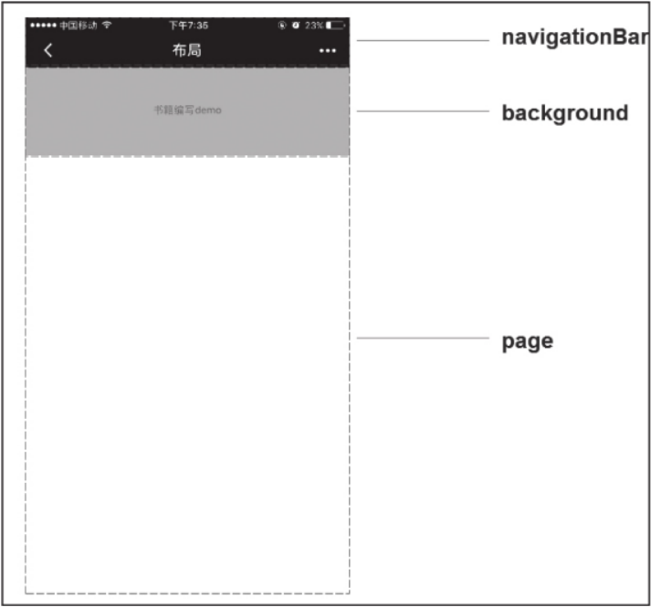

**3. tabBar配置**

当程序顶部或底部需要菜单栏时，我们可以通过配置tabBar快速实现，tabBar是个非必填项目。可配置属性如下：

* **color：**tab上的文字默认颜色，值为HexColor（十六进制颜色值），必填项。
* **selectedColor：**tab上的文字选中时的颜色，值为HexColor（十六进制颜色值），必填项。
* **backgroundColor：**tab的背景色，值为HexColor（十六进制颜色值），必填项。
* **borderStyle：**tabbar上边框的颜色，仅支持black/white，默认值为black。
* **list：**tab的列表，必填项，其值为一个数组，最少2个、最多5个tab，数组中每一项是一个对象，代表一个tab的相关配置，每项的相关配置如下：
  * **pagePath：**页面路径，必须在pages中先定义，必填项。
  * **text：**tab上按钮的文字，必填项。
  * **iconPath：**tab上icon图片的相对路径，icon大小限制为40kb，必填项。
  * **selectedIconPath：**选中时图片的相对路径，icon大小限制为40kb，必填项。
  * **position：**tab在顶部或底部显示，可选值为bottom、top，默认值为bottom。

代码清单如下：

```json
{
    "pages":[
        "pages/index/index"，
        "pages/search/search"，
        "pages/list/list"
    ],
    "tabBar":{
        "color":"#000000",
        "selectedColor":"#ff7f50",
        "backgroundColor":"#ffffff",
        "borderStyle":"black",
        "list":[
            {
                "iconPath":"images/home.png",
                "selectedIconPath":"images/home-selected.png",
                "pagePath":"pages/index/index",
                "text":"首页"
            },
            {
                "iconPath":"images/search.png",
                "selectedIconPath":"images/search-selected.png",
                "pagePath":"pages/search/search",
                "text":"搜索"
            },
            {
                "iconPath":"images/list.png",
                "selectedIconPath":"images/list-selected.png",
                "pagePath":"pages/list/list",
                "text":"列表"
            },
        ],
        "borderStyle":"bottom"
    }
}
```

配置后页面效果如图2-6所示。


**4. networkTimeout配置**

小程序中各种网络请求API的超时时间只能通过networkTimeout统一设置，不能在API中单独设置，具体的网络请求API可参考后面章节，networkTimeout支持的属性有：

* **request：**设置wx.request的超时时间，单位毫秒。
* **connectSocket：**设置wx.connectSocket的超时时间，单位毫秒。
* **uploadFile：**设置wx.uploadFile的超时时间，单位毫秒。
* **downloadFile：**设置wx.downloadFile的超时时间，单位毫秒。

示例代码如下：

```json
{
    "pages":[
        "pages/index/index"
    ],
    "networkTimeout":{
        "request":60000,
        "connectSocket":60000
    }
}
```

**5. debug配置**

此配置项控制是否开启debug模式，默认是关闭的。开启debug模式后，在开发者工具的控制面板，调试信息以info的形式输出，如图2-7所示。其中信息有Page的注册、页面路由、数据更新、事件触发，可以帮助开发者快速定位一些常见问题。


示例代码如下：

```json
{
    "pages":[
        "pages/inde/index"
    ],
    "debug":true
}
```

以上便是app.json的5类配置项，这些配置项都是全局的，小程序中除了app.json这种全局配置文件还有页面配置文件，当路由到对应页面时，页面配置文件的配置项将会覆盖全局配置，页面配置文件将在后续内容中进行详细介绍。

### 2.3.2 小程序逻辑（app.js）

小程序中逻辑文件分为页面逻辑文件和小程序逻辑文件，app.js便是小程序逻辑文件，在这个文件中，我们可以通过App()函数注册小程序生命周期函数、全局方法和全局属性，已注册的小程序实例可以在其他逻辑层代码中通过getApp()获取。

**1. 注册小程序**

App()函数用于注册一个小程序，参数为一个Object对象，在这个参数对象中我们可以注册自定义方法和属性供全局使用，就像在quick start项目中，我们利用App()注册了用户登录信息。App()函数必须在app.js中注册，且不能注册多个，其参数属性如下：

* **onLaunch：**生命周期函数，监听小程序初始化。当小程序初始化完成时，就会触发onLaunch，onLaunch事件全局只会触发一次。
* **onShow：**生命周期函数，监听小程序显示。当小程序启动，或者从后台进入前台显示时都会触发onShow。
* **onHide：**生命周期函数，监听小程序隐藏。当小程序从前台进入后台会触发。
* **其他：**开发者可以添加任意的函数或数据到Object参数中，这些属性会被注册到小程序对象中，其他逻辑文件可以通过getApp()函数获取已注册的小程序实例。

关于小程序生命周期函数的执行时机我们要特别讲解一下：当启动一个小程序时，首先会依次触发onLaunch和onShow方法，然后通过app.json的pages属性注册相应的页面，最后根据默认路径加载首页；当用户点击左上角关闭，或者按了设备Home按钮离开微信时，小程序并没有直接销毁，而是进入了后台，这两种情况都会触发onHide方法；当再次唤醒微信（针对点击Home按钮离开微信）或再次从微信中打开小程序时，又会从后台进入前台，这时会触发onShow方法。只有当小程序进入后台一定时间，或者系统资源占用过高，才会被真正销毁。

注册小程序示例代码如下：

```js
App({
    onLaunch:function(){
        // 小程序初始化完成时执行
    },
    onShow:function(){
        // 显示小程序时执行
    },
    onHide:function(){
        // 隐藏小程序时执行
    },
    globalFunction:'我是全局函数',
    globalData:'我是全局属性'
});
```

**2. 获取小程序实例**

注册小程序后，在其他逻辑文件中，可以通过全局函数getApp()获取小程序实例，例如：

```javascript
var app = getApp();
console.log(app.globalData);
```

在App()注册的函数中，我们可以使用this直接获取App实例，而不用getApp()方法。通过getApp()获取实例后，可以获取注册的属性、调用注册的方法，但不要私自调用生命周期函数（onLaunch、onShow、onHide），这样会打乱项目逻辑，除非你已经对它们很熟悉。

### 2.3.3 全局样式（app.wxss）

app.wxss是全局样式表，对项目中每个页面都有效，可将一些系统级别的统一样式风格写入这个文件，页面渲染时，框架页中的.wxss文件样式会覆盖app.wxss中相同的选择器样式。WXSS是小程序基于CSS拓展的一套样式语言，它实现了CSS的大部分规则，其具体介绍请参考下一节。

小程序框架主体相关的文件app.json、app.js、app.wxss我们已经全部介绍完成，下面为大家介绍框架页面相关的文件。

## 2.4 框架页面文件

小程序中一个框架页面包含4个文件，同一框架页面的这4个文件必须具有相同的路径与文件名，进入小程序时或页面跳转时，小程序会根据app.json配置的路径找到对应的资源进行渲染。

* .js文件：页面逻辑文件，必要项。
* .wxml文件：页面结构文件，必要项。
* .wxss文件：页面样式文件。
* .json文件：页面配置文件。

与框架主体文件相比框架页面文件多了一种页面结构文件，其余3个文件和框架主体文件的功能类同，下面我们一一讲解每个文件作用。

### 2.4.1 页面配置文件

我们首先讲解页面配置文件，页面配置文件和框架配置文件一样，是一个json文件，与框架配置文件不同的是，页面配置文件是非必要存在的，同时页面配置文件的配置项只有window，控制当前页面的窗口表现，window的属性和app.json一致。渲染页面时，页面中的window配置项会覆盖app.json中的相同配置项。

由于页面的.json只能配置window相关属性，编写时只需直接写出属性，不用写window这个键，如下所示：

```json
{
    "navigationBarBackgroundColor":"#000000",
    "navigationBarTextStyle":"black",
    "navigationBarTitleText":"我的页面",
    "backgroundColor":"#efefef",
    "backgroundTextStyle":"light"
}
```

### 2.4.2 页面逻辑文件（JavaScript）

页面逻辑文件主要功能有：设置初始化数据，注册当前页面生命周期函数，注册事件处理函数等。小程序的逻辑层文件是JavaScript文件，所有的逻辑文件，包括app.js，最终将会打包成一个js文件，在小程序启动时运行，知道小程序销毁，类似于ServiceWorker，所以逻辑层也称为App Service。

在小程序中，每个逻辑文件有独立的作用域，并具备模块化能力。由于JavaScript逻辑文件是运行在纯JavaScript引擎中而并非运行在浏览器中，一些浏览器提供的特有的对象，如document、window等，在小程序中都无法使用，同理，一些基于document、window的框架如：jQuery、Zepto都不能再小程序中使用，同时我们不能通过操作DOM改变页面，这时需要我们将面向DOM操作的编程思想转化为数据绑定和事件响应。

**1. 注册页面 **

在页面逻辑文件中需要通过Page()函数注册页面，指定页面的初始数据、生命周期函数、事件处理函数等，参数为一个Object对象，其属性如下：

* **data：**页面的初始数据，数据格式必须是可转成JSON格式的对象类型。当页面第一次渲染时，data会以JSON的形式由逻辑层传至渲染成，渲染层可以通过WXML对数据进行绑定。
* **onLoad：**生命周期函数，页面加载时触发。一个页面只会调用一次，接收页面参数，可以获取wx.navigateTo、wx.redirectTo以及中的query参数。
* **onShow：**生命周期函数，页面显示时触发。每次打开页面都会调用一次。
* **onReady：**生命周期函数，页面初次渲染完成时触发。一个页面生命周期中只会调用一次，代表当前页面已经准备妥当，可以和视图层进行交互。一些对界面的设置，操作需要在页面准备妥当后调用，如wx.setNavigationBarTitle需要在onReady之后设置，详细可以参考后面的”页面生命周期“小节.
* **onHide：**生命周期函数，页面隐藏时触发。
* **onUnload：**生命周期函数，页面卸载时触发。
* **onPullDownrefresh：**页面相关时间处理函数，用户下拉时触发。使用时需要将app.json配置中的window的enablePullDownRefresh属性设置为true。当处理完数据刷新后，可以调用wx.stopPullDownrefresh方法停止当前页面的下拉刷新。
* **onReachBottom：**页面上拉触底事件的处理函数。
* **其他：**开发者可以添加任意的函数或数据到Object参数中，可以用this访问这些函数和数据。

```javascript
// 获取app实例
var app = getApp();
Page({
    data:{
        // 页面初始化数据
        count:0
    },
    onLoad:function(){
        // 页面加载时执行
    },
    onShow:function(){
        // 页面打开时执行
        console.log(app.globalData);
    },
    onReady:function(){
        // 页面初次渲染完成执行，一个页面只会调用一次
    },
    onHide:function(){
        // 页面隐藏时执行
    },
    onUnload:function(){
        // 页面卸载时执行
    },
    onPullDownRefresh:function(){
        // 下拉刷新时执行
    },
    onReachBottom:function(){
        // 下拉触底时执行
    },
    // 自定义函数，可与渲染层中的组件进行事件绑定
    countClick:function(){
        // 触发视图层重新渲染
        this.setData({
            count:this.data.count+1
        });
    },
    // 自定义数据
    customData:{
        name:'微信'
    }
});
```

页面的生命周期函数比小程序的生命周期函数略微复杂一点，弄懂其执行顺序能避免在不恰当的生命周期函数中调用还未创建的对象或方法，小程序框架以栈的形式维护了当前的所有页面，当发生路由切换时，页面栈和生命周期函数的关系如下：

* 小程序初始化：默认页面入栈，依次触发默认页面onLoad、onShow、onReady方法。
* 打开新页面：新页面入栈，依次触发新页面onLoad、onShow、onReady方法。
* 页面重定向：当前页面出桟并卸载，触发当前页面onUnload方法，新页面入栈，触发新页面onLoad、onShow、onReady方法。
* 页面返回：页面不断出桟并卸载，触发当前弹出页面onUnload方法，直到返回目标页面，新页面入栈，触发新页面onShow方法。
* Tab切换：当前页面出桟但不卸载，仅触发onHide方法，新页面入栈，如果当前页面是新加载的，触发onLoad、onShow、onReady方法，如果当前页面已加载过，仅触发onShow方法。
* 程序从前台到后代：触发当前页面onHide方法，触发App onHide方法。
* 程序从后台到前台：触发小程序onShow方法，触发页面onShow方法。

整体来说，如果页面在生命周期中，只会触发onShow和onLoad方法，只有加载和卸载时才会触发onLoad、onReady和onUnload方法，而触发页面卸载只有页面返回和页面重定向两种操作。页面生命周期函数的执行顺序不用死记硬背，开发过程中可以开启app.json中的debug模式，路由切换时，小程序、页面的生命周期函数执行顺序都会在控制台以info形式输出，在后面小节中我们将对页面生命周期作简单介绍。

**2. 获取当前页面栈**

有注册就有获取，getCurrentPage()函数便是用于获取当前页面栈的实例，页面栈以数组形式按栈顺序给出，第一个元素为首页，最后一个元素为当前页面。不要尝试修改页面栈，这会导致路由以及页面状态错误。

示例代码如下：

```javascript
// 获取页面栈
var pages=getCurrentPages();
// 获取当前页面对象
var currentPage=page[pages.length-1];
```

**3. 事件处理函数**

页面对象中注册的函数可以和视图层中的组件进行绑定，当达到触发条件时，就会执行Page中定义的相应事件，这类自定义函数统称为事件处理函数。小程序中组件的事件分为通用事件和特殊事件，事件类型请参考后面2.4.3节中“事件”小节。

实例代码如下：

```html
<view bindtap="event">点击执行逻辑事件</view>
```

```js
Page({
    event:function(){
        console.log('点击了view');
    }
});
```

**4. 触发视图层渲染**

页面首次加载时，框架会结合初始化数据渲染页面，在逻辑层中则需主动调用Page.prototype.setData()方法，而不能直接修改Page的data值，这样不仅无法触发视图层渲染，还会造成数据不一致。当Page.prototype.setData()被调用时，会将数据从逻辑层发送到视图层触发视图层重绘，同时会修改Page的data值。setData()接收一个Object对象参数，方法会自动将this.data中的key对应的值变成Object参数中key对应的值。当Object参数key对应的值和this.data中key对应的值一致时，将不会触发视图层渲染。在项目中我们一定要保证视图层和逻辑层的数据一致。

Object参数的key值非常灵活，可以按数据路径的形式给出，如array[5].info、object.subkey，并且这样使用时，不需要在this.data中预先定义。

示例代码如下：

```html
<view>{{text}}</view>
<button bindtap="changeText">修改普通数据</button>
<view>{{object.subObject.objectText}}</view>
<button bindtap="changeObjectText">修改对象数据</button>
<view>{{array[0].arrayText}}</view>
<button bindtap="changeArrayText">修改数组数据</button>
<view>{{newField.newFieldText}}</view>
<button bindtap="addNewData">添加新字段</button>
```

```js
Page({
    data:{
        text:'normal data',
        object:{
            subObject:{
                objectText:'object data'
            }
        },
        array:[
            {
                arrayText:'array data'
            }
        ]
    },
    changeText:function(){
        this.setData({
            // 普通索引
            text:'new normal data'
        });
    },
    changeObjectText:function(){
        this.setData({
            // 按路径索引
            'object.subObject.objectText':'new object data'
        });
    },
    changeArrayText:function(){
        this.setData({
            // 按路径索引
            'array[0].arrayText':'new array data'
        });
    },
    addNewDadta:function(){
        this.setData({
            // 修改一个已绑定，但未在data中定义的数据
            'newField.newFieldText':'add new data'
        });
    }
});
```

**5. 页面生命周期**

页面的生命周期整体关系着页面视图层线程和页面逻辑层线程，注册页面时，Object参数中很多属性都是生命周期函数，这些函数的调用和页面生命息息相关，程序视图层线程和逻辑层线程关系如图2-8所示。

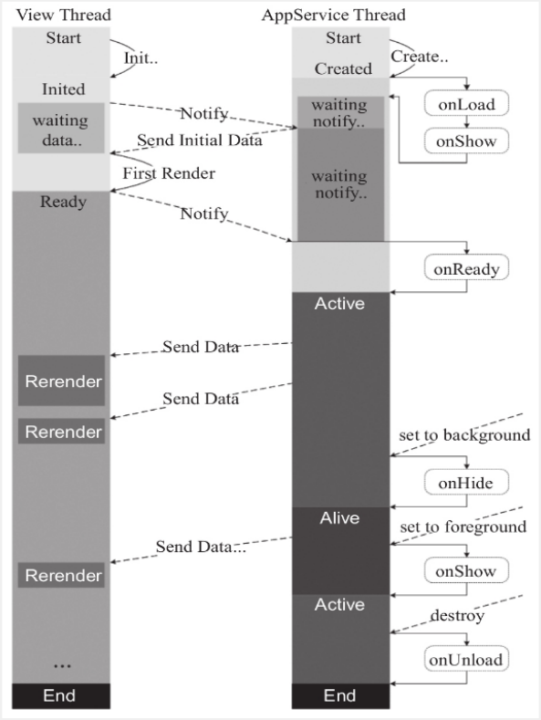

如图2-8，线程启动后视图层和逻辑层相互监听，当逻辑层线程触发onLoad、onShow方法后会把初始数据data传送给视图线程，视图层完成第一次渲染后触发逻辑层onReady方法，代表页面已经准备妥当，之后我们便可通过setData方法主动触发视图层渲染。当页面被调往后台时，触发onHide方法，这时逻辑层线程并没有销毁，我们仍然可以通过代码控制视图层渲染，只是可能不会在界面上表现出来。当页面从后台回到前台时，触发onShow方法，最后当页面销毁时，触发onUnload方法。整体来看onLoad、onReady和onUnload方法在生命周期中只会调用一次，生命周期内显示、隐藏页面都是触发onShow和onHide方法，在路由方式中，只有页面重定向和页面返回会结束当前生命周期，当进入一个已加载的页面时只会触发onShow方法，不会触发onLoad和onReady方法。

### 2.4.3 页面结构文件（WXML）

WXML（WeiXin Markup Language）是框架设计的一套标记语言，用于渲染界面，WXML的渲染原理和React Native思路一致，通过一套标记语言，在不同平台被解析为不同端的渲染文件，如2-9所示。

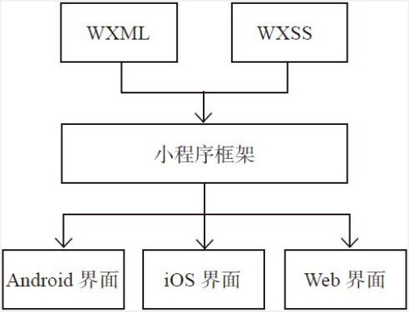

从图中我们能看出，WXML语言最终会转译为宿主端对应的语言，所以WXML中所使用的标签一定是小程序定义的标签，不能使用自定义标签，这样才能保证页面能被正确转译。使用微信开发者工具开发时，在WXML中编写一些HTML标签或自定义标签仍然会被正常解析，这会给开发者造成一种小程序能直接支持HTML标签的误解。这是因为微信开发者工具内核是浏览器内核，同时小程序框架并没对WXML中的标签和WXSS中的内容进行强验证，所以HTML和CSS能直接被解析，但这种不合法的WXML在手机微信中是不能正常显示的。开发过程中我们一定要拿真机进行测试，保证程序能正常运行。

WXML具有数据绑定、列表渲染、条件渲染、模板、事件等能力。

**1. 数据绑定**

小程序中页面渲染时，框架会将WXML文件同对应Page的data进行绑定，在页面中我们可以直接使用data中的属性。小程序的数据绑定使用Mustache语法（双大括号）将变量或简单的运算规则包起来，主要有以下几种渲染方式。

**（1）简单绑定**

简单绑定是指我们使用Mustache语法（双大括号）将变量包起来，在模板中直接作为字符串输出使用，可作用于内容、组件属性、控制属性、关键字等输出，其中关键字输出是指将JavaScript中的关键字按其真值输出。

示例代码如下：

```html
<!-- 作为内容 -->
<view>{{content}}</view>
<!-- 作为组件属性 -->
order
<!-- 作为控制属性 -->
<view wx:if="{{showContent}}">作为属性渲染</view>
<!-- 关键字 -->
<view>{{2}}</view>
<checkbox checked="{{false}}"></checkbox>
```

```js
Page({
    data:{
        border:'solid 1px #000',
        id:1,
        content:'内容',
        showContent:false
    }
});
```

运行效果如图2-10所示

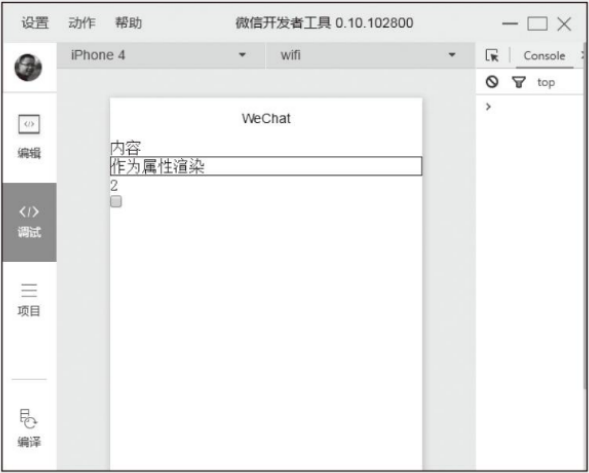

> **注意**
>
> 组件属性为boolean类型时，不要直接写checked=“false”，这样checked的值是一个false的字符串，转成boolean类型后代表为true，这种情况一定要使用关键字输出：checked=“{{false}}”

**（2）运算**

在{{}}内可以做一些简单的运算，支持的运算有三元运算、算数运算、逻辑判断、字符串运算，这些运算均符合JavaScript运算规则。我们利用如下示例为大家展示：

```html
<!-- 三元表达式 -->
<view>{{showContent?'显示文本':'不显示文本'}}</view>
<!-- 算数运算符 -->
<view>{{num1+num2}}+1+{{num3}}=?</view>
<!-- 字符串运算 -->
<view>{{"name:"+name}}</view>
<!-- 逻辑判断 -->
<view>{{num3>0}}</view>
<!-- 数据路径运算 -->
<view>{{object.age}} {{array[1]}}</view>
```

```js
Page({
  data: {
    showContent: false,
    num1: 1,
    num2: 2,
    num3: 3,
    name: 'weixin',
    object: {
      age: 12
    },
    array: ['array1', 'array2']
  }
})
```

执行后界面如图2-11所示。

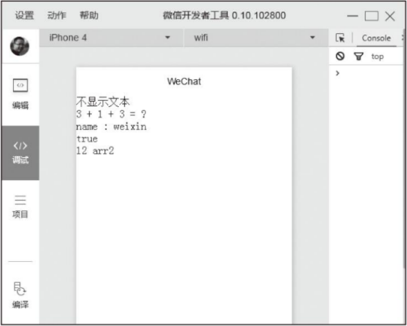

**（3）组合**

data中的数据可以在模板再次组合成新的数据结构，这种组合常常在数组或对象中使用。

**数组组合**比较简单，可以直接将值放置到数组某个下标下：

```html
<view>{{[value,2,3,'stringtype']}}</view>
```

```js
Page({
  data: {
    value: 0
  }
})
```

最终页面组合成的对象为[0,2,3,‘stringtype’]。

**对象组合**有3种组合方式，这里我们以数据注入模板为例。

第一种，直接将数据作为value值进行组合：

```html
<template is="temp" data="{{name:value1,age:value2}}"></template>
```

```js
Page({
  data: {
    value1: 'value1',
    value2: 'value2'
  }
})
```

最终组合出的对象为{name:‘value1’,age:‘value2’}。

第二种，通过“…”将一个对象展开，把key-value值拷贝到新的结构中：

```html
<template is="temp" data="{{...obj1,key5:5,...obj2,key6:6}}"></template>
```

```js
Page({
  data: {
    obj1: {
      key1: 1,
      key2: 2
    },
    obj2: {
      key3: 3,
      key4: 4
    }
  }
});
```

最终组合成的对象为{key1:1,key2:2,key5:5,key3:3 key4:4,key6:6}

第三种，如果对象key和value相同，可以只写key值：

```html
<template is="temp" data="{{key1,key2}}"></template>
```

```js
Page({
    data:{
        key1:1,
        key2:2
    }
});
```

这种写法最后组合成的对象是{key: 1, key2: 2}

上述3种方式可以根据项目灵活组合，要注意的是和js中的对象一样，如果一个组合中有相同的属性名时，后面的属性将会覆盖前面的属性，如：

```html
<template is="temp" data="{{...obj,key1:3}}"></template>
```

```js
Page({
    data:{
        key1:1,
        key2:2
    }
});
```

示例中key1是重复的属性，那么后面的属性将会覆盖前面的属性，最终组合成的对象为{key1: 3, key2: 2}。

**2. 条件渲染**

**（1）wx:if**

除了简单的数据绑定，我们常常会使用逻辑分支，这时候可以使用wx:if=“{{判断条件}}”来进行条件渲染，当条件成立时渲染该代码块：

```html
<view wx:if="{{showContent}}">内容</view>
```

```js
Page({
    data:{
        showContent:false
    }
});
```

示例中view代码块将不会渲染，只有当showContent的值为true时才渲染。和普通的编程语言一样，WXML也支持wx:elif和wx:else，如：

```html
<view wx:if="{{false}}">1</view>
<view wx:elif="{flase}">2</view>
<view wx:else>3</view>
```

示例中页面只渲染最后一个`<view/>`。wx:elif和wx:else必须和wx:if配合使用，否则会导致页面解析出错，在项目中大家一定要注意。

**（2）block wx:if**

wx:if是一个控制属性，可以添置在任何组件标签上，但如果我们需要包装多个组件，又不想影响布局，这时就需要使用`<block/>`标签将需要包装的组件放置在里面，通过wx:if作判断。`<block/>`不是一个组件，仅仅是一个包装元素，页面渲染过程中不做任何渲染，由属性控制，如下所示。

```html
<block wx:if="{{true}}">
	<view>view组件</view>
    <image/>
</block>
```

**（3）wx:if与hidden**

除了wx:if组件，也可以通过hidden属性控制组件是否显示，开发者难免有疑问，这两种方式该怎样取舍，这里我们整理了两种方式的区别：

* **wx:if** 控制是否渲染条件块内的模板，当其条件值切换时，会触发局部渲染以确保条件在切换时销毁或重新渲染。wx:if 是**惰性**的，如果在初始渲染条件为false时，框架将什么也不做，在条件第一次为真时才局部渲染。
* **hidden** 控制组件是否显示，组件始终会被渲染，只是简单控制显示与隐藏，并不会触发重新渲染和销毁。

综合两个渲染流程可以看出，由于wx:if 会触发框架局部渲染过程，在频繁切换状态的场景中，会产生更大的消耗，这时会尽量使用hidden；在运行时条件变动不大的场景中我们使用wx:if ，这样能保证页面有更高的渲染，而不用把所有组件都渲染出来。

**3. 列表渲染**

**（1）wx:for**

组件的wx:for 控制属性用于遍历数组，重复渲染该组件，遍历过程中当前项的下标变量名默认为index，数组当前项变量名默认为item，如：

```html
<view wx:for="{{array}}">array</view>
```

```js
Page({
    data:{
        array:['val1','val2']
    }
});
```

通过遍历array，页面渲染了两个`<view/>`，结果如图2-12所示。

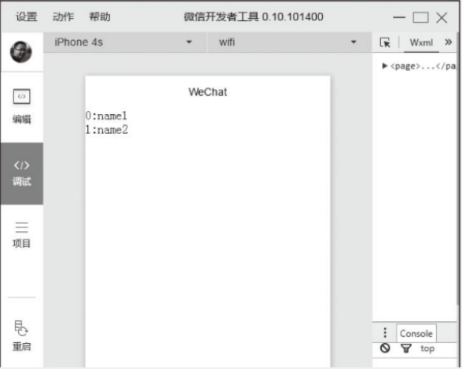

**（2）wx:for-index 和 wx:for-item**

index、item变量名可以通过wx:for-index、wx:for-item属性修改，如：

```html
<view wx:for="{{array}}" wx:for-index="index" wx:for-item="item">
	{{index}}:{item.name}
</view>
```

```js
Page({
    data:[
        {
            name:'val1'
        },
        {
            name:'val2'
        }
    ]
});
```

渲染结果如图2-13所示。

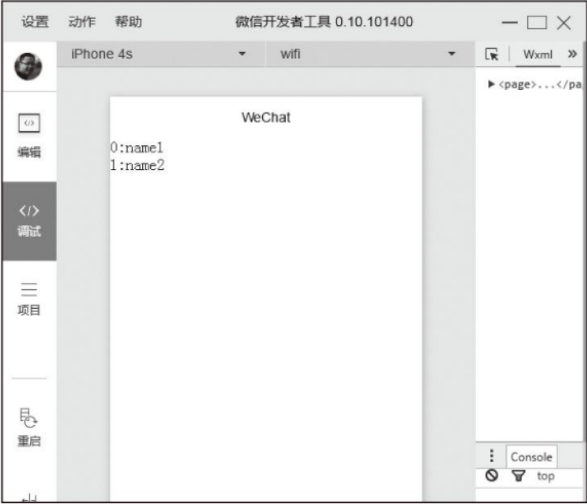

普通遍历中我们没必要修改index、item变量名，当wx:for 嵌套使用时，就有必要设置变量名，避免变量名冲突，下面我们遍历一个二维数组：

```html
<view wx:for="{{array}}" wx:for-index="index" wx:for-item="item">
	<block wx:for="item" wx:for-item="subIndex" wx:for-item="subItem">
        bItem
    </block>
</view>
```

```js
Page({
    data:{
        array:[
            [1,2,3],
            [4,5,6],
            [7,8,9]
        ]
    }
});
```

渲染效果如图2-14所示。

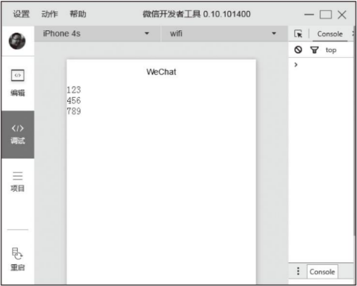

在本示例中，我们使用了`<block/>`标签，和block wx:if 一样，wx:for 可以直接在`<block/>`标签上使用，以渲染一个包含多个节点的结构块。

**4. 模板**

在项目过程中，常常会遇到某些相同的结构在不同的地方反复出现，这时可以将相同的布局代码片段放置在一个模板中，在不同的地方传入对应的数据进行渲染，这样能避免重复开发，提高开发效率。

**（1）定义模板**

定义模板非常简单，在`<templage/>`内定义代码片段，设置`<templage/>`的name属性，指定模板名称即可。如：

```html
<templage name="template">
	<view>内容</view>
    <view>{{content}}</view>
</templage>
```

**（2）使用模板**

使用模板时，设置is属性指向需要使用的模板，设置data属性，将模板所需的变量传入。模板拥有自己的作用域，只能使用data属性传入的数据，而不是直接使用Page中的data数据，渲染时，`<template/>`标签将被模板中的代码块完全替换。

示例代码如下：

```html
<template name="template">
	<view>内容</view>
    <view>{{content}}</view>
    <view>{{name}}</view>
    <view>{{obj.key1}}</view>
    <view>{{key2}}</view>
</template>
<template is="template" data="{{content:'内容',name,obj,...obj2}}"/>
```

```js
Page({
    data:{
        name:'template',
        obj:{
            key1:'val1'
        },
        obj2:{
            key2:'val2'
        }
    }
});
```

执行效果如图2-15所示。

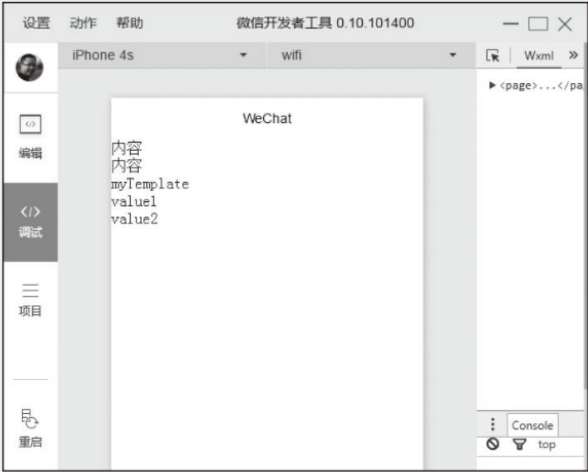

模板可以嵌套使用，如下所示：

```html
<template name="bTemplate">
	<view>b template content</view>
</template>
<template name="aTemplate">
	<view>a template content</view>
    <template is="bTemplate"></template>
</template>
<template is="aTemplate"></template>
```

执行效果如图2-16所示。

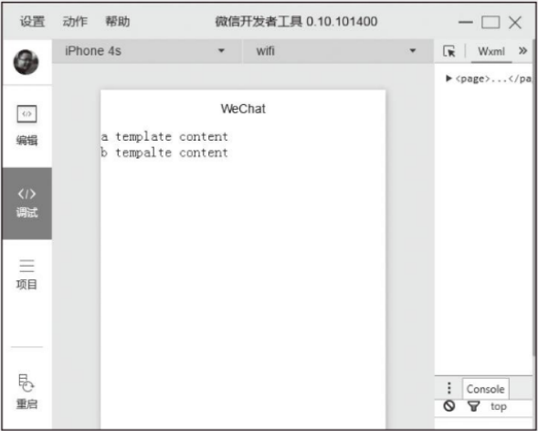

> **注意**
>
> 模板is属性支持数据绑定，在项目过程中我们可以通过属性绑定动态决定使用哪个模板，如：

```html
<template is="{{templateName}}" data="data"></template>
```

**5. 事件**

WXML中的事件系统和HTML中DOM事件系统极其相似，也是通过在组件上设置“bind（或catch）+事件名”属性进行事件绑定，当触发事件时，框架会调用逻辑层中对应的事件处理函数，并将当前状态通过参数传递给事件处理函数，由于小程序中没有DOM节点概念，所以事件只能通过WXML绑定，不能通过逻辑层动态绑定。官方对WXML事件的定义如下：

* 事件是视图层到逻辑层的通讯方式。
* 事件可以将用户的行为反馈到逻辑层进行处理。
* 事件可以绑定在组件上，当触发事件时，就会执行逻辑层中对应的事件处理函数。
* 事件对象可以携带额外信息，如id、dataset、touches。

**（1）事件分类**

事件分为冒泡事件和非冒泡事件：

* 冒泡事件：当一个组件上的事件被触发后，该事件会向父节点传递。
* 非冒泡事件：当一个组件上的事件被触发后，该事件不会向父节点传递。

有前端开发经验的开发者应该对事件冒泡都有一定了解，当一个事件被触发后，该事件会沿该组件向父级对象传播，从里到外依次执行，直到结点最顶层，这个是个非常有用的特性，通常用于实现事件代理，具体实现方案将在下文中具体讨论。

WXML冒泡事件如下：

* touchstart：手指触摸动作开始。
* touchmove：手指触摸后移动。
* touchcancel：手指触摸动作被打断，如来电提醒、弹窗。
* touchend：手指触摸动作结束。
* tap：手指触摸后马上离开。
* longtap：手指触摸后，超过350ms再离开。

对于冒泡事件每个组件都默认支持的，除上述事件之外的其他组件定义事件如无特殊声明都是非冒泡事件，如：`<form/>`的submit事件，`<scroll-view/>`的scroll事件，详细信息请参考各组件文档。

**（2）事件绑定**

在之前内容中，已经多次实现事件绑定，大家应该比较熟悉了，事件绑定的写法和组件的属性一样，以key、value形式组织。

* **key：**以bind或catch开头，然后跟上事件类型，字母均小写，如：bingtap，catchtouchstart。
* **value：**事件函数名，对应Page中定义的同名函数。找不到同名函数会导致报错。

绑定时bind事件绑定不会阻止冒泡事件向上冒泡，catch事件绑定会阻止冒泡事件向上冒泡。

冒泡示例如下：

```html
<view bindtap="tap1">
	view1
    <view catchtap="tap2">
    	view2
        <view bindtap="tap3">
        	view3
        </view>
    </view>
</view>
```

如上述示例中，点击view3时会先后触发tap3和tap2事件，由于view2通过catch阻止了tap事件冒泡，这时tap1将不会执行，点击view2只触发tap2，点击view1只触发tap1。

**（3）事件对象**

如果没有特殊说明，当组件触发事件时，逻辑层绑定该事件的事件处理函数会收到一个事件对象，如：

```html
<view bindtap="event">view</view>
```

```js
Page({
    event:function(e){
        console.log(e);
    }
});
```

上述代码中，event参数e便是事件对象，这和JavaScript事件绑定特别像。上述代码执行后事件对象输出如下：

```json
{
    "type":"tap",
    "timeStamp":6571,
    "target":{
        "id":"",
        "offsetLeft":0,
        "offsetTop":0,
        "dataset":{
            
        }
    },
    "currentTarget":{
        "id":"",
        "offsetLeft":0,
        "offsetTop":0,
        "dataset":{
            
        }
    },
    "detail":{
        "x":15,
        "y":11
    },
    "touches":[
        {
            "identifier":0,
        	"pageX":15,
        	"pageY":11,
        	"clientX":15,
        	"clientY":11
    	}
    ],
    "changedTouches":[
        {
            "identifier":0,
            "pageX":15,
            "pageY":11,
            "clientX":15,
            "clientY":11
        }
    ]
}
```

事件对象属性基本可分为三类：BaseEvent、CustomEvent、TouchEvent。

**BaseEvent**为基础事件对象属性，包括：

* tpye：事件类型。
* timeStamp：事件生成时的时间戳，页面打开到触发所经过的毫秒数。
* target：触发事件源组件（即冒泡开始的组件）的相关属性集合，属性如下：
  * id：事件源组件的id。
  * tagName：事件源组件的类型。
  * dataset：事件源组件上由data-开头的自定义属性组成的集合。
  * currentTarget：事件绑定的当前组件的相关属性集合，属性如下：
    * id：当前组件的id。
    * tagName：当前组件的类型。
    * dataset：当前组件上由data-开头的自定义属性组成的集合。

`<canvas/>`中的触摸事件不可冒泡，所以没有currentTarget。

dataset是组件的自定义数据，通过这种方式可以将组件的自定义属性传递给逻辑层。书写方式为：以data-开头，多个单词由连字符“-”连接，属性名不能有大写（大写最终会被转为小写），最终在dataset中将连字符转成驼峰形式，如：

```html
<view bindtap="event" data-name="weixin" data-age="12">
	dataset示例
</view>
```

```js
Page({
    event:function(e){
        console.log(e.currentTarget.dataset);
    }
});
```

最后dataset打印出来为：

```json
{
    "name":"weixin",//连字符被转成驼峰
    "age":"12"//所有大写字符都被转为小写
}
```

**CustomEvent**为自定义事件对象（继承BaseEvent），只有一个属性：

* detail：额外信息，通常传递组件特殊信息。

detail没有统一的格式，在`<form/>`的submit方法中它是{“value”:{},“formId”:“”}，在`<swiper/>`的change事件中它是{“current”:current}，具体内容参考组件相关文档。

**TouchEvent**为触摸事件对象（继承BaseEvent）属性如下所示：

* touches：触摸事件，当前停留在屏幕中的触摸点信息的数组。
* changedTouches：触摸事件，当前变化的触摸点信息的数组，如从无变有（touchstart）、位置变化（touchmove）、从有变无（touchend、touchcancel）。

由于支持多点触摸，所以touches和changedTouches都是数组格式，每个元素为一个Touch对象（canvas触摸事件中为CanvasTouch对象）。

Touch对象相关属性如下：

* identifier：触摸点的标识符。
* pageX，pageY：距离文档左上角的距离，文档的左上角为原点，横向为X轴，纵向为Y轴。
* clientX，clientY：距离页面可显示区域（屏幕除去导航条）左上角的距离，横向为X轴，纵向为Y轴。

CanvasTouch对象相关属性如下：

* identifier：触摸点的标识符。
* x、y：距离Canvas左上角的距离，Canvas的左上角为原点，横向为X轴，纵向为Y轴。

**6. 引用**

一个WXML可以通过import或include引入其他WXML文件，两种方式都能引入WXML文件，区别在于import引入WXML文件后只接受模板的定义，忽略模板定义之外的所有内容，而且使用过程中有作用域的概念。与import相反，include则是引入文件中除`<template/>`以外的代码直接拷贝到`<include/>`位置，整体来说import是引入模板定义，include是引入组件。

**（1）import**

`<import/>`的src属性是需要被引入文件的相对地址，`<import/>`引入会忽略引入文件中`<template/>`定义以外的内容，如下例中，在a.wxml引入b.wxml，b.wxml中`<view/>`和`<template is="bTemplate"/>`都被忽略，仅引入了模板的定义，在a.wxml中能使用b.wxml中定义的模板：

```html
<import src="b.wxml"/>
<template is="bTemplate" data=""/><!-- 使用b.wxml中定义的模板 -->
<view>内容</view><!-- import引入时会被忽略 -->
<template name="bTemplate">
	<view>b template content</view>
</template>
<template is="bTemplate"/><!-- import引用时会被忽略 -->
```

上述代码中，a.wxml中的`<view/>`并没有被渲染，如图2-17所示。

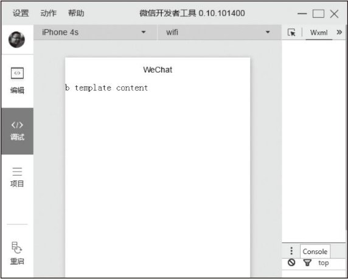

import引用有作用域概念，只能直接使用引入的定义模板，而不能使用间接引入的定义模板，如下例，在a.wxml中引入b.wxml，b.wxml再引入c.wxml，这样a能直接使用b中定义的模板，b能使用c中定义的模板，但a不能使用c中的模板：

```html
<import src="b.wxml"/>
<template is="bTemplate"/>
<template is="cTemplate"/><!-- 不能直接调用c.wxml中的模板 -->
<import src="c.wxml"/>
<view>b content</view><!-- import时会被忽略 -->
<template name="bTemplate">
    <template is="cTemplate"/>
    <view>b template content</view>
</template>
<template is="cTemplate"/><!-- import时被忽略 -->
<template name="cTemplate">
	<view>c template content</view>
</template>
```

渲染效果如图2-18所示。

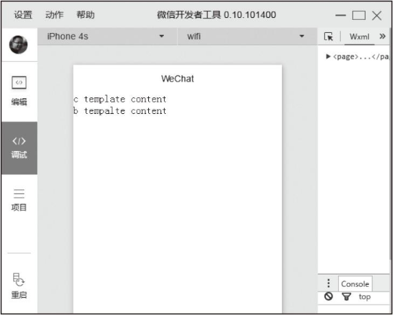

**（2）include**

include引入会将模板定义标签外的内容（含模板使用标签）直接赋值替换`<include/>`，我们基于上个案例进行修改，大家对比一下：

```html
<include src="b.wxml" />
<!-- 不能调用b.wxml中的模板 -->
<template is="bTemplate" />
<!-- 不能调用c.wxml中的模板 -->
<template is="cTemplate" />
<include src="c.wxml" />
<!-- 不会被忽略 -->
<view>b content</view>
<template name="bTemplate">
  <!-- 不会调用c.wxml中的模板，引用时已被忽略 -->
  <template is="cTemplate" />
  <view>b template content {{name}}</view>
</template>
<!-- 没有被忽略，能正常调用自己文件中的模板 -->
<template is="bTemplate" data="{{name}}" />
<template name="cTemplate">
  <view>c template content</view>
</template>
```

```js
Page({
  data: {
    // 能将数据注入到b.wxml中
    name: '2'
  }
});
```

运行效果如图2-19所示。

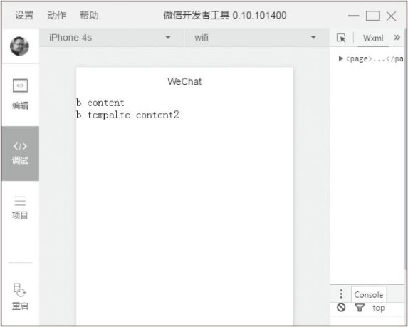

通过对比发现，import更适合引用模板定义文件，include更适合引入组件文件，在项目中大家可以根据特性灵活实用。

WXML虽然是一门新表情语言，但大部分规则和其他前端模板语言大同小异，本节WXML规则整体可分为数据绑定、事件机制、模板语法（条件渲染、列表渲染）、页面引用（引用规则、模板），大家可以对比其他模板语言学习。

### 2.4.4 页面样式文件（WXSS）

WXSS（WeiXin Style Sheets）是基于CSS拓展的样式语言，用于描述WXML的组件样式，决定WXML的组件该怎么显示，它具有CSS的大部分特性，在CSS基础上WXSS拓展了尺寸单位、样式导入特性，对CSS选择器属性做了部分兼容，目前官方文档没有给出WXSS具体具备CSS哪些特性，在开发过程中不能想当然地使用CSS属性，一定要使用iOS和Android真机进行调试，本小节主要讲述WXSS和CSS的不同点，后续布局章节会讲解CSS盒子模型布局相关属性，其余CSS属性大家可以参考W3C规范，在WXSS中我们甚至能使用一些兼容性写法，不过在开发过程中我们一定要开启开发者工具中“开启上传代码时样式文件自动补全”功能，这样小程序会自动补全其余一些样式的兼容性写法，保证在不同终端达到统一视觉效果。

**1. 尺寸单位**

CSS中原有尺寸单位在不同尺寸屏幕中不能完美实现元素按比例缩放，WXSS在此基础上拓展了两种尺寸单位：rpx（responsive pixel）和rem（root em），这两种尺寸单位都是相对单位，最终会被换算成px，使用rpx和rem布局页面能让页面界面在不同尺寸屏幕中按比例缩放。

**（1）rpx**

在渲染过程中rpx会按比例转化为px，WXSS规定屏幕宽度为750rpx，如在iPhone6中，屏幕宽度为375rpx，即750rpx=375rpx，那么在iPhone6中1rpx=0.5px。

**（2）rem**

同rpx一样，WXSS规定屏幕宽度为20rem，同样在iPhone6中，屏幕宽度为375px，即20rem=375px，所以在iPhone6中1rem=18.75px；

| 设备         | rpx换算px（屏幕宽度/750） | px换算rpx（750/屏幕宽度） | rem换算px（屏幕宽度/20） | px换算rem（20/屏幕宽度） |
| ------------ | ------------------------- | ------------------------- | ------------------------ | ------------------------ |
| iPhone5      | 1rpx=0.42px               | 1px=2.34rpx               | 1rem=15.75px             | 1px=0.06349px            |
| iPhone6      | 1rpx=0.5px                | 1px=2rpx                  | 1rem=18.75px             | 1px=0.053px              |
| iPhone6 Plus | 1rpx=0.552px              | 1px=1.81rpx               | 1rem=20.7px              | 1px=0.04830px            |

在设计界面时，如果要实现尺寸自适应，设计师可以用iPhone6作为视觉标准。由于rpx和rem最终要被换算为px，在某些情况下可能会存在除不尽的情况，会导致界面中出现毛刺，这种情况大家要多留意、多测试以尽量避免这种情况。

**2. 选择器**

CSS选择器用于选择需要添加样式的元素，WXSS实现了CSS的部分选择器，使用规则和CSS一样，熟悉CSS的同学会很快上手，参见表2-2。

| 选择器          | 样例          | 样例描述                                 |
| --------------- | ------------- | ---------------------------------------- |
| .class          | .className    | 选择所有拥有class=“className”的组件      |
| #id             | #idName       | 选择拥有id=“idName”的组件                |
| element         | view          | 选择所有view组件                         |
| element,element | view,checkbox | 选择所有文档的view组件和所有checkbox组件 |
| ::after         | view::after   | 在view组件后插入内容                     |
| ::before        | view:before   | 在view组件前面插入内容                   |

WXSS和CSS代码结构一样，一段样式前面是选择器，后面是以大括号括起来的样式组合，每个样式以分号结束，如下所示：

```
选择器 { 样式1；样式2 }
```

选择器使用规则和CSS也是一致的，如下所示：

```css
/* 选择所有class含有class的组件 */

.class {
  border: solid 1px #000;
}

/* 选择所有view组件且class含有class的组件，并设置边框 */

view.class {
  border: solid 1px #000;
}

/* 选择所有view组件中子节点class含有class的组件，并设置边框 */

view .class {
  border: solid 1px #000;
}

/* 选所有class含有content组件中所有checkbox组件和radiobox组件，并设置它们的边框 */

.content checkbox, .content radiobox {
  border: solid 1px #000;
}

/* 选择所有view组件且class含有class的组件，在其后面插入新内容，内容为content */

view.class::after {
  content: 'new content';
}
```

**3. 内联样式**

同HTML一样，样式除了写在WXSS文件中，也可以通过设置style、class属性控制样式，一般静态样式可以统一写到class中，style样式会在运行时解析，如非特别需要，尽量避免将静态样式写入style，以免影响渲染速度，例如：

```css
<!-- 通过style动态设置样式 -->
<view style="border: solid 1px #000; background-color: {{color}}"></view>
<!-- 通过class选择器设置样式 -->
<view class="className className1"></view>
```

**4. 样式导入**

通常在项目中为了便于管理会将WXSS按职责拆分为多个文件，这时便需要@import语句在当前WXSS文件中导入其他WXSS文件，@import后写入需要导入WXSS文件的相对路径，用“;”表示语句结束，例如：

```css
.common-veiw { border: solid 1px #000; }
@import "common.wxss";
.page-container { padding:10px; }
```

至此，小程序框架页面相关的4个文件已介绍完成，大家对每个文件的功能、内容应该都有了一定了解，在本章最后一节中，我们将探讨小程序的模块化。

## 2.5 模块化

小程序逻辑层语言是JavaScript，而JavaScript作为脚本语言在设计初期仅是为了实现简单的页面交互，由Brendan Eich在1995年花了不到十天时间发明出来，语言本身缺失了很多用于支撑大型项目的设计，而现在前端业务越来越复杂，代码也越来越多，很多问题就暴露出来。模块化主要解决JavaScript中命名冲突和文件依赖这两个问题，现在模块化在前端中使用比较广泛，如Node.js、Requirejs、Seajs、Webpack等，它们大部分都遵循或者接近CommonJS规范，甚至ES6也针对模块化提出了自己的规范。目前前端模块化没有一个统一的解决方案，在不同环境、不同框架中的实现都不一样，本节将重点讨论小程序的模块化规范。

### 2.5.1 模块化简介

最早前端JavaScript代码量不大，统一放在一个文件内，如下面一段代码：

```js
var name = 'weixin',
	age = 12;

function getName() {
	// 实现代码
}

function getAge() {
	// 实现代码
}
```

后来前端代码越来越多，为了便于管理和工作拆分，我们不得不把代码拆分为多个文件，这时将上述代码封装到user.js文件中，需要用时引入页面（或打包到一个文件）就行。初期团队成员少，一切都运行正常，直到团队越来越大，开始有人抱怨：我想定义一个name变量但user.js中已经存在，我不得不定义为myName；为什么我在自己代码中定了getAge方法就导致别人代码出问题了呢？通过这种文件拆分的工作我们只是对代码做了物理上的分离，能初步实现多人开发和简单的代码管理，但并没有真正做到作用域的隔离，由于不知道其他文件内已存在的变量名，甚至让全局冲突问题变得更容易、更严重。

再后来为了避免这种全局冲突，大家决定参考Java的方式，引入命名空间和闭包来解决变量冲突问题。于是user.js里的代码变成了如下这样：

```js
(function() {
	myProject = myProject || {}; // 定义全局命名空间
	myProject.user = {};
	myProject.user.name = 'weixin';
	var age = 12; // 闭包内变量，外部不能访问
	myProject.user.getName = function() {
		// 实现代码
	}

	myProject.user.getAge = function() {
		// 实现代码
	}
})();
```

这样别的同事可以通过myProject.user获取name，调用getName和getAge方法，通过命名空间，的确能缓解大部分冲突，但是为此我们不得不记住很长一串命名空间，同时当我使用user这个空间后，别人就不能使用，这也不能完美地解决问题。同时更可怕的是 如果user.js依赖另外一个utils.js，别的同事必须通过阅读user.js源码搞懂这层依赖关系，按顺序引入utils.js、user.js，直接引入user.js将会导致他代码出错，如果utils还依赖别的资源他还得必须搞懂相关的所有依赖，而他仅仅是想调用我的getName方法，这对调用的同事来说无疑是个噩梦。这时我们需要一种新的组织方式，于是诞生了模块化：

* 模块是一段JavaScript代码，具有统一的基本书写格式。
* 模块之间通过基本交互规则，能彼此引用，协同工作。

目前模块化的规范不统一，大致可分为CommonJS和ES6两种规范，大家有兴趣可以参考网上相关资料，小程序模块化机制比较接近CommonJS规范，无论哪种规范，学习起来都十分简单。

### 2.5.2 文件作用域

小程序中一个JavaScript文件就是一个模块，在这个文件中声明的变量和函数只在该文件有效，不同文件中的相同变量名和函数名是不会互相影响的。模块中可以调用一些全局的方法，如下例中通过调用getApp()获取小程序实例：

```js
App({
	globalData: {
		// 定义全局属性
		name: 'weixin',
	}
});

var privatyData = "value1"; // privatyData只能在a.js中使用
var appData = getApp();
appData.globalData.name += ' app';

var privatyData = "value2"; // privatyData不会和a.js中同名变量冲突
var appData = getApp();

// 当a.js在b.js前执行后,这里会输出"weixin app value2"
console.log(appData.globalData.name + '' + privatyData);
```

### 2.5.3 模块的使用

模块接口的暴露和引入十分简单：

* 通过exports暴露接口。
* 通过require(path)引入依赖，path是需要引入的模块文件的相对路径。

示例代码如下：

```js
/* mod.js */
var privateData = 'weixin';

function run(who) {
	console.log(who + ' run');
}
function walk(who) {
	console.log(who + ' walk');
}

module.exports = {
	run: run,
	walk: walk
}
```

```js
/* otherMod.js */
var mod=require('mod.js');
Page({
	onShow:function(){
		mod.run('somebody');
		mod.walk('somebody');
	}
})
```

需要注意的是：

* exports是module.exports的一个引用，因此在模块里面随意更改exports的指向会造成未知的错误。所以我们更推荐开发者采用module.exports来暴露模块接口，除非你已经很清晰地知道这两者的关系。
* 小程序目前不支持直接引入node_modules，开发者需要使用node_modules时建议拷贝出相关代码到小程序目录中。

通过模块化我们能实现代码真正的隔离，可以多人并行开发，降低大型项目管理难度，这对前端工程化具有很大促进作用。

### 2.5.4 其他

**1. JavaScript运行环境**

微信小程序逻辑代码运行在三端：iOS、Android和用于调试的开发者工作，这三端是各自不同的三个解析引擎：

* 在iOS上，小程序的JavaScript代码是运行在JavaScriptCore中。
* 在Android上，小程序的JavaScript代码是通过X5内核来解析。
* 在开发工具上，小程序的JavaScript代码是运行在nwjs（chrome内核）中。

虽然尽管三端的环境十分相似，但是至少在目前对一些语法、特性的支持还是有一些区别，在开发过程中要尽可能地在三端进行调试。

**2. ES6语法以及API支持**

在小程序中，开发者可以使用ES6语法进行编码，在0.10.101000以及之后版本的开发工具中，会默认使用babel将开发者ES6代码转换为三端都能很好支持的ES5的代码，帮助开发者解决环境不同所带来的开发问题。如果没有使用ES6语法，开发者可以在项目设置中关闭这个功能。

转换过程中需要注意：

* 这种转换只会帮助开发者处理语法上问题，新的ES6的API，例如Promise等需要开发者自行引入Polyfill或者别的类库。
* 为了提高代码质量，在开启ES6转换功能的情况下，默认启用JavaScript严格模式，请参考“use strict”。

## 2.6 小结

小程序框架是小程序开发的核心，本章重点讲解了框架的大致原理、规范，剖析了所涉及的每个文件，小程序这种基于数据的编码方式和前端基于DOM的编码方式很大不同，大家要着重了解熟悉，了解小程序运行原理后，后续学习组件和API将会非常简单。