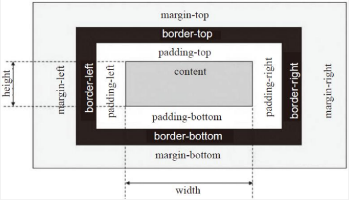
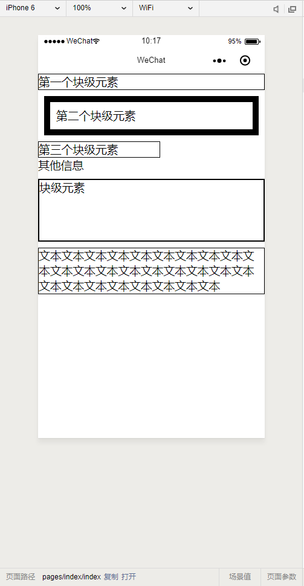
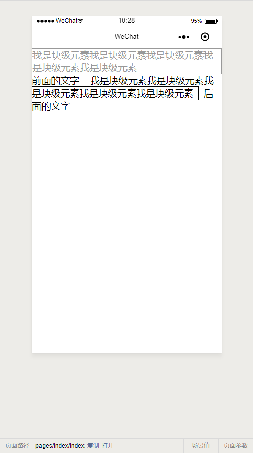
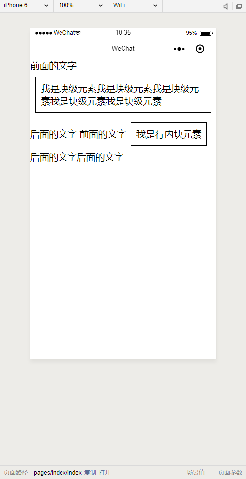
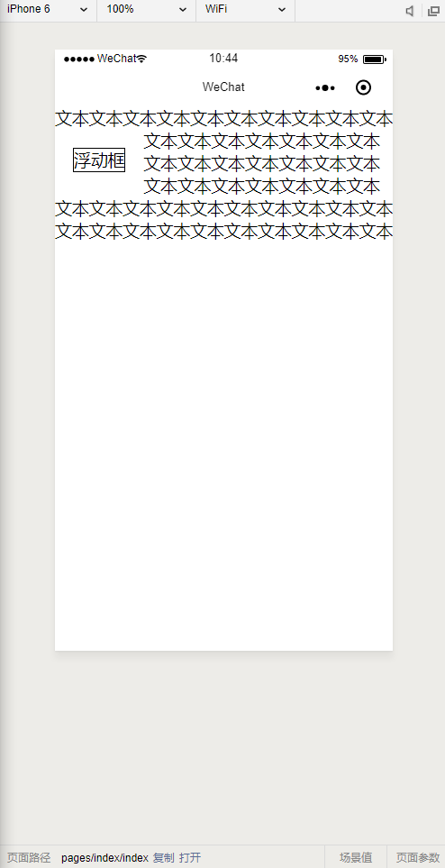
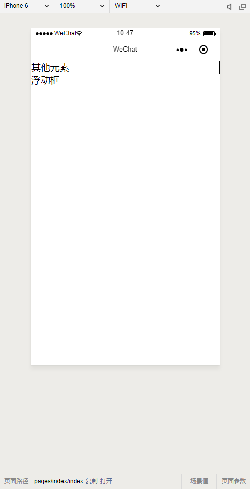
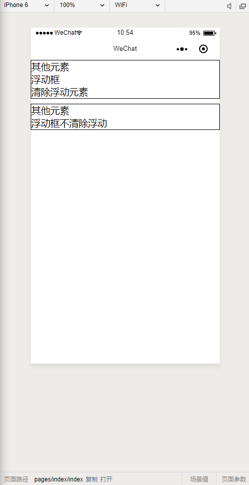
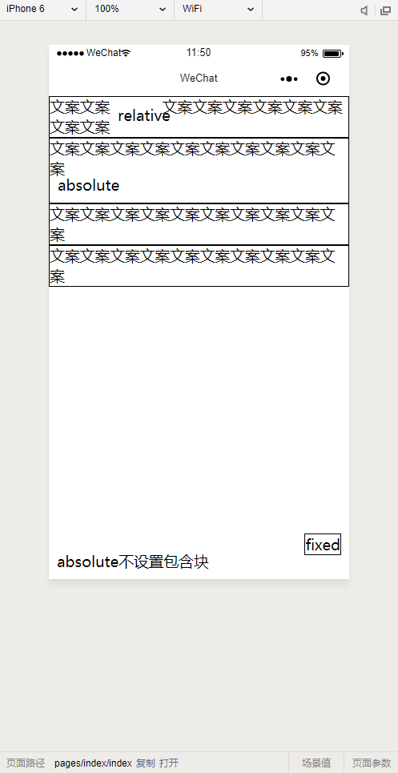
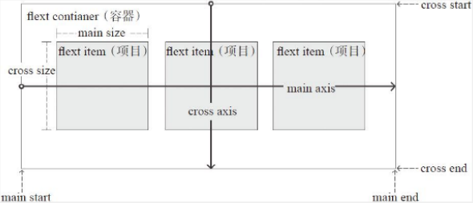
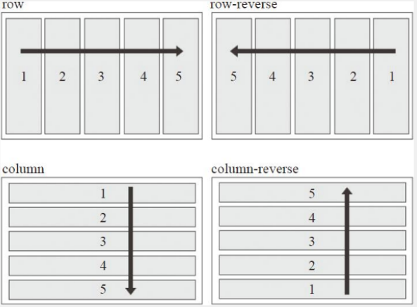

# 第3章 布局

WXSS实现了CSS布局相关的大部分规范，但在一些细节上有差异，甚至同样的语法在小程序调试工具和微信中的表现也存在差异。

本章主要讲述CSS布局相关的一些基础知识，包括经典的盒子模型、浮动定位、绝对定位以及近几年提出的Flex布局。

这些基础知识在WXSS也是通用的。对于其他一些特性，开发者可在开发过程中尝试，如果大家相对CSS有更深的了解可以参考网络资料或《CSS权威指南》。

这里再次提醒大家，在代码编写过程中一定要开启开发者工具中的这个功能：“开启上传代码时样式文件自动补全”，否则在学习本章Flex布局时会存在不同终端兼容性问题。

## 3.1 基础知识

### 3.1.1 盒子模型

盒子模型是CSS布局的基础，CSS假定每个元素都会生成一个或多个矩形框，每个元素框中心都有一个内容区（content），这个内容区周围有内边距（padding）、边框（border）和外边距（margin），这些项默认宽度为0，这个矩形框就是常说的盒子模型，如图3-1所示。



简单来说，HTML中每一个元素就是一个盒子，同理，在小程序中每一个组件就是个盒子，元素的宽度、高度就是内容区域宽度、高度，不包含内边距、边框和外边框，我们可以通过元素width、height、padding、border、margin属性控制盒子样式。盒子模型根据浏览器具体实现可分为W3C的标准盒子模型和IE盒子模型，这两种盒子模型在宽度和高度的计算上不一致，IE盒子模型的宽度和高度是包含内边距和边框的，我们这里讲述的主要是W3C的盒子模型，WXSS完全遵守W3C盒子模型规范。

CSS中的布局都是基于盒子模型，不同类型元素对盒子模型的处理也是不同的，块级元素的处理就和行内元素不同，浮动元素和定位元素的处理也是不相同的，接下来我们逐一讨论这些差异。

### 3.1.2 块级元素

元素按显示方式主要可以分为块级元素和行内元素，元素的显示方式是由display属性控制的，块级元素会默认占一行高度，一般一行内只有一个块级元素（浮动后除外），当再添加新的块级元素时，新元素会自动换行显示。块级元素一般作为容器出现，用于组织结构。一些元素默认就是块级元素，如小程序中的`<view/>`组件，而一些则默认是行内元素，我们可以通过修改元素display属性为block，将一个元素强制设置块级元素。

一个块级元素的元素框与其父元素的width相同，块级元素的width+marginLeft+marginRight+paddingLeft+paddingRight刚好等于父级元素内容区宽度，显示时默认撑满父元素内容区。块级元素高度由其子元素决定，父级元素高度会随内容元素变化而变化。块级元素特点总结如下：

* 总是在新行上开始。
* 宽度默认为width+marginLeft+marginRight+paddingLeft+paddingRight刚好等于父级元素内容区宽度，除非设定一个新宽度，这里需要注意，当设置块级元素宽度为100%时，如果当前块级元素存在padding、margin会导致块级元素溢出父元素。
* 盒子模型高度默认由内容决定。
* 盒子模型中高度、宽度及外边距和内边距都可控制。
* 可以容纳行内元素和其他块级元素。

示例：

`<view/>`组件默认是块级元素，下面我们使用`<view/>`为大家演示块级元素的特性，如图3-2所示。



代码如下：

```html
<!-- 每个块级元素占领一行 -->
<view style="border: solid 1px;">第一个块级元素</view>
<!-- 默认情况下块级元素的元素框和父级元素的width相同，刚好撑满内容区 -->
<view style="border: solid 10px;margin: 10px;padding: 10px;">第二个块级元素</view>
<!-- 即使宽度不足，仍会占领一行让其余元素换行 -->
<view style="border: solid 1px;width: 200px;">第三个块级元素</view>
其他信息
<!-- 父级元素高度随内容决定，内容为块级元素 -->
<view style="margin-top: 10px;border: solid 1px;">
	<view style="height: 100px;">块级元素</view>
</view>
<!-- 父级元素高度随内容决定，内容为文本流情况 -->
<view style="margin-top: 10px;border: solid 1px;">
	文本文本文本文本文本文本文本文本文本文本文本文本文本文本文本文本文本文本文本文本文本文本文本文本文本文本文本
</view>
```

块级元素还有很多特性，比如水平格式化、垂直格式化等，我们不在这里一一列举，大家可以查阅相关资料。

### 3.1.3 行内元素

除了块级元素，最常见的就是行内元素了，通过设置display属性为inline可以将一个元素设置为行内元素，小程序中`<text/>`就是一个行内组件。行内元素没有块级元素那么简单直接，块级元素只是生成框，通常不允许其他内容与这些框并存，行内元素特点总结如下：

* 和其他非块级元素都在一行上。
* 盒子模型中高度、宽度、上下margin、上下padding设置均无效，只能设置左右margin和左右padding。
* 宽度就是文字或图片的宽度，不可改变。
* 行内元素宽度、高度不能直接设置。
* 行内元素只能容纳文本或其他行内元素，在行内元素中放置块级元素会引起不必要的混乱。

如图3-3中的示例，大家可以对比本例中块级元素和行内元素的区别，我们设置了行内元素的margin，布局时上下margin都被忽略了。本例中我们将上下padding设置为0，大家可以尝试设置为其他值，这时会发现上下padding会生效，但是不会影响布局，本例中行内元素换行是因为上面的块级元素强制占位一行。



本例代码如下：

```html
<!-- 块级元素 -->
<view style='border:solid 1px #999;color: #999;'>我是块级元素我是块级元素我是块级元素我是块级元素我是块级元素</view>
<!-- 通过修改display属性的行内元素 -->
前面的文字<view style="border: solid 1px;margin: 10px;padding: 0 10px;display: inline;">我是块级元素我是块级元素我是块级元素我是块级元素我是块级元素</view>后面的文字
```

### 3.1.4 行内块元素

行内块元素是块级元素和行内元素的混合物，当display属性为inline-block时，元素就被设置为一个行内块元素，行内块元素可以设置宽、高、内边距和外边距，可以简单认为行内块元素是把块级元素以行的形式展现，保留了块级元素对宽、高、内边距、外边距的设置，它就像一张图一样放在文本行中，如图3-4所示。



代码如下：

```html
<!-- 行内块元素宽度撑满父级宽度情况 -->
前面的文字<view style="border: solid 1px;margin: 10px;padding: 10px;display: inline-block;">我是块级元素我是块级元素我是块级元素我是块级元素我是块级元素</view>后面的文字
<!-- 行内块元素宽度不足父级宽度的情况 -->
前面的文字<view style="border: solid 1px;margin: 10px;padding: 10px;display: inline-block;">我是行内块元素</view>后面的文字后面的文字
```

## 3.2 浮动和定位

了解基本盒子模型后，本小节开始讲解定位相关的内容，定位的基本思想很简单，它允许你定义元素框相对其正常位置应该出现在哪，或者相对于父元素、另一个元素甚至浏览器窗口本身的位置。浮动和定位是我们常用的布局方案，WXSS也支持Flex布局方案，接下来我们将对这三种布局方案一一讲解。

### 3.2.1 浮动

浮动不完全是定位，同时它也不是正常流布局，通过设置float属性，浮动的框可以向左或者向右移动，直到其外边缘碰到包含框或另一个浮动框的边框为止。由于浮动框不在文档的普通流中，文档在普通流中会表现得浮动框不存在一样，其他内容会环绕过去，如图3-5所示。



代码如下：

```html
<view>
	文本文本文本文本文本文本文本文本文本文本文本文本文本文本文本文本文本
	<view style="display: block;float: left;border: solid 1px;margin: 20px;">浮动框</view>
	文本文本文本文本文本文本文本文本文本文本文本文本文本文本文本文本文本文本文本文本文本文本文本文本文本文本文本文本文本文本文本文本文本文本
</view>
```

上例中浮动区域在它当前的位置往左浮动，直至父元素内容框，其他文本都环绕而过。由于元素浮动时不在普通流中，这会导致父级元素忽略浮动元素高度，形成坍塌，如图3-6所示。



代码如下：

```html
<!-- 父级元素高度只会包含第一元素，忽略浮动元素 -->
<view style="border: solid 1px;">
	<view>其他元素</view>
	<view style="float: left;">浮动框</view>
</view>
```

本例中父级元素的边框并没有包裹浮动框，虽然这是浮动的一个特性，并不是一个bug，但在某些情况下我们仍然希望在使用浮动的同时，父级元素的高度能包裹浮动元素，这时我们就需要了解浮动的另一个属性：clear（清除）。当设置元素clear时，可以确保当前元素的左边、右边或左右两边同时不能出现浮动的元素，如图3-7所示。



代码如下：

```html
<!-- 父元素会包含清除浮动元素 -->
<view style="border: solid 1px;">
	<view>其他元素</view>
	<view style="float: left;">浮动框</view>
	<!-- 设置当前元素左边不能出现浮动元素 -->
	<view style="clear: left;">清除浮动元素</view>
</view>
<view style="border: solid 1px;margin-top: 10px;">
	<view>其他元素</view>
	<view style="float: left;">浮动框</view>
	<view>不清除浮动</view>
</view>
```

在上例中有个特别有意思的现象，父元素虽然会忽略浮动元素（如浮动高度示例中产生的坍塌），但是不会忽略其他元素（包括清除浮动的元素），而清除浮动的元素总在浮动元素下方，所以在显示时视觉上父元素就把所有元素都包含进去了，如上例中无论非浮动元素在哪里，父元素边框都包含了非浮动元素。利用这个特性，如果把上例中清除浮动的高度置为0使其看不见，这时父元素仍然会包裹它，这样就能防止浮动元素父元素高度坍塌，网上利用after伪属性清除浮动就是这个原理。这里我们对比使用元素和after伪属性2种实现方案，如图3-8所示。

WXML文件的代码如下：

```html
<!-- 添加高度为0的元素清除浮动 -->
<view style="border: solid 1px;">
	<view>其他元素</view>
	<view style="float: left;">浮动框</view>
	<view style="clear: both;height: 0;"></view>
</view>
<!-- 利用伪属性在后面插入一个元素清除浮动 -->
<view style="border: solid 1px;margin-top: 10px;" class="clearfix">
	<view>其他元素</view>
	<view style="float: left;">浮动框</view>
</view>
<!-- 不清除浮动对比 -->
<view style="border: solid 1px;margin-top: 10px;">
	<view>其他元素</view>
	<view style="float: left;">浮动框</view>
</view>
```

WXSS文件的代码如下：

```css
.clearfix:after {
	display: block;
	height: 0;
	clear: both;
	content: '';
}
```

在实际项目中，为了复用性和便携性，我们通常使用.clearfix类清除浮动。

### 3.2.2 定位

元素的定位由position属性控制，position有4种不同类型的定位，会影响元素框生成的方法：

* **static：** 元素框正常生成。块级元素生成一个矩形框，作为文档流的一部分，行内元素则会创建一个或多个行框，置于其父元素中，static是position的默认值。
* **relative：** 元素框偏移某个距离。元素仍保持其未定位前的形状，它原本所占的空间仍保留。
* **absolute：**  元素框从文档流中完全删除，并相对于其包含块定位，包含块可能是文档中的另一个元素或者是初始包含块。对于absolute来说，包含块是离当前元素最近的position为absolute或relative的父元素，如果父元素中没有任何absolute或relative布局的元素，那么包含块就是根元素。使用position布局后，元素原先在正常文档流中所占用的空间会关闭，就好像该元素原来不存在一样。元素定位后生成一个块级框，不论原来它在正常流中生成何种类型的框。
* **fixed：** 元素框的表现类似于将position设置为absolute，不过其包含块是视窗本身。

示例如图3-9所示。



代码如下：

```html
<!-- relative相对之前位置进行移动，原占有空间不会被关闭 -->
<view style="border: solid 1px;">
	文案文案<text style="position: relative;top: 10px;left: 10px;">relative</text>文案文案文案文案文案文案文案文案
</view>
<!-- absolute依赖于包含块，原占有空间会被关闭 -->
<view style="border: solid 1px;position: relative;height: 80px;">
	文案文案<text style="position: absolute;left: 10px;bottom: 10px;">absolute</text>文案文案文案文案文案文案文案文案
</view>
<!-- 没有找到最近的absolute或relative元素会直接认为根元素是包含块，原占有空间会关闭 -->
<view style="border: solid 1px;">
	文案文案<text style="position: absolute;left: 10px;bottom: 10px;">absolute不设置包含块</text>文案文案文案文案文案文案文案文案
</view>
<!-- fixed直接认为视窗本身为包含块，原占有空间会关闭 -->
<view style="border: solid 1px;">
	文案文案<text style="position: fixed;right: 10px;bottom: 30px;border: solid 1px;">fixed</text>文案文案文案文案文案文案文案文案
</view>
```

## 3.3 Flex布局

浮动和定位是基于盒子模型的传统布局解决方案，它在处理一些特殊布局时非常不方便，比如垂直居中，2009年W3C提出了一种新的方案Flex布局，该布局可以简单快速地完成各种伸缩性的设计。Flex是Flexible Box的缩写，即为弹性盒子布局，可以为传统盒子模型带来更大的灵活性，目前主流浏览器都支持这种布局，小程序WXSS也对其进行了实现，项目中可以随意使用。

### 3.3.1 基本概念

Flex布局主要由容器和项目构成，采用Flex布局的元素，称为Flex容器（flex container），它的所有直接子元素自动成为容器成员，成为Flex项目（flex item）。

可以设置display:flex或display:inline-flex将任何一个元素指定为Flex布局，如图3-10所示，容器默认存在两根轴，水平的主轴（main axis）和垂直的交叉轴（cross axis），主轴开始的位置（及主轴与边距的交叉点）叫main start，结束的位置叫main end，main start和main end和主轴的方向有关；交叉轴开始的位置叫cross start，结束的位置叫cross end，cross start和cross end和交叉轴方向有关。

项目默认沿主轴从主轴开始的位置到主轴结束的位置进行排列，项目在主轴上占据的空间叫main size，在交叉轴上占据的空间叫cross size。



### 3.3.2 容器属性

容器支持的属性有：

* **display：** 通过设置display属性，指定元素是否为Flex布局。
* **flex-direction：** 指定主轴方向，决定了项目的排列方式。
* **flex-wrap：** 排列换行设置。
* **flex-flow：** flex-direction和flex-wrap的简写形式。
* **justify-content：** 定义项目在主轴上的对齐方式。
* **align-items：** 定义项目在交叉轴上的对齐方式。
* **align-content：** 定义多根轴线的对齐方式，如果只有一根轴线，该属性不起作用。

**1. display**

display用来指定该元素是否为Flex布局，语法为：

```css
.flex-box{
    display: flex|inline-flex;
  }
```

其属性值如下：

* **flex：** 用于产生块级Flex布局。
* **inline-flex：** 用于产生行内Flex布局，行内容器符合行内元素的特性，同时在容器内又符合Flex布局规范。

设置Flex布局以后，子元素的float、clear和vertical-align属性将会失效。

**2. flex-direction**

flex-direction用于指定主轴的方向，即项目排列的方向，语法为：

```css
.flex-box{
    flex-direction:row|row-reverse|colum|colum-reverse;
}
```

它有4个值（如图3-11）：

*  **row：** 主轴为水平方向，起点在左端，默认值。
* **row-reverse：** 主轴为水平方向，起点在右端。
* **colum：** 主轴为垂直方向，起点在上沿。
* **colum-reverse：** 主轴为垂直方向，起点在下沿。



## 3.4 小结

布局是构建页面的基础，如果使用时不小心会产生一些意料之外的问题。在使用布局时，需要在合适的场景使用合适的定位技术，对元素的定位、重叠、叠放顺序、大小和放置等都要仔细考虑。如果使用浮动，还需要考虑浮动和正常流的关系，在合适的位置还需要清除浮动，这些细节都是在布局中需要考虑的点。

下一章我们将讲解组件相关的知识，掌握布局后，我们只需将组件放置在合适的布局中，即可构建出需要的界面。