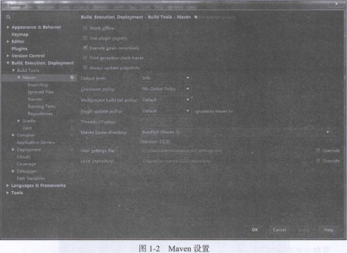
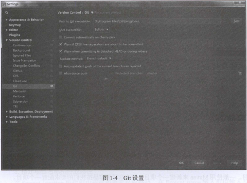
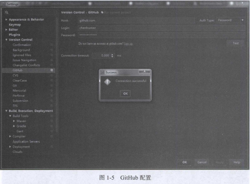
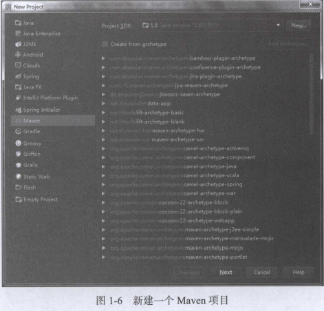
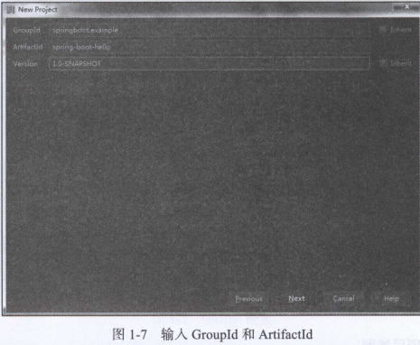
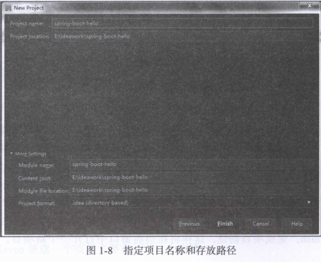
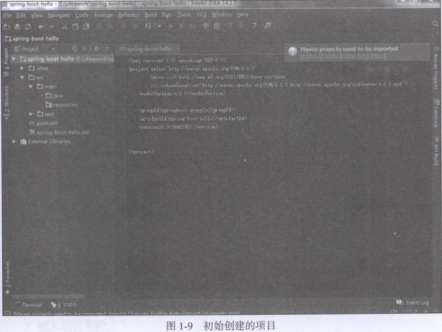

# 第1章 Spring Boot入门

在使用Spring Boot框架进行各种开发体验之前，要先配置好开发环境。首先安装JDK，然后选择一个开发工具，如Eclipse IDE和IntelliJ IDEA（以下简称IDEA）都是不错的选择。对于开发工具的选择，本书极力推荐使用IDEA，因为它为Spring Boot提供了许多更好和更贴切的支持，本书的实例都是使用IDEA创建的。同时，还需要安装Apache Maven和Git客户端。所有这些都准备好之后，我们就能开始使用Spring Boot了。

## 1.1 配置开发环境

下面的开发环境配置主要以使用Windows操作系统为例，如果你使用的是其他操作系统，请对照其相关配置进行操作。

### 1.1.1 安装JDK

JDK（Java SE Development Kit）需要1.8及以上版本，可以从Java的[官网](http://www.oracle.com/technetwork/java/javase/downloads/index.html)下载安装包。如果访问官网速度慢的话，也可以通过百度搜索JDK，然后在百度软件中心下载符合你的Windows版本和配置的JDK1.8安装包。

安装完成后，配置环境变量JAVA_HOME，例如，使用路径`D:\Program Files\Java\jkd1.8.0_25`（如果你安装的是这个目录的话）。`JAVA_HOME`配置好之后，将``%JAVA_HOME%\bin`加入系统的环境变量path中。完成后，打开一个命令行窗口，输入命令java -version，如果能正确输出版本号则说明安装成功了。输出版本的信息如下：

```shell
java version "1.8.0_161"
Java(TM) SE Runtime Environment (build 1.8.0_161-b12)
Java HotSpot(TM) 64-Bit Server VM (build 25.161-b12, mixed mode)
```

### 1.1.2 安装InterlliJ IDEA

IDEA需要14.0以上的版本，可以从其官网http://jetbrains.com/下载免费版，本书的实例是使用IDEA14.1.15版本开发的。IDEA已经包含Maven插件，版本是3.05，这已经能够适用我们开发的要求。安装完成后，打开IDEA，将显示如图1-1所示的欢迎界面，在这里可以看到IDEA的版本号。


### 1.1.3 安装Apache Maven

为了能够在命令行窗口中使用Maven来管理工程，可以安装一个Maven管理工具。通过Maven的官网http://maven.apache.org/download.cgi下载3.0.5以上的版本，下载完成后加压缩即可，例如，解压到D盘上是不错的做法，然后将Maven的安装路径（如`D:\apache-maven-3.2.3\bin`）也加入Windows的环境变量path中。安装完成后，在命令行窗口中执行指令：mvn -v，将输出如下的版本信息以及系统的一些环境信息。

```shell
Maven home: C:\Program Files\Maven\bin\..
Java version: 1.8.0_161, vendor: Oracle Corporation
Java home: C:\Program Files\Java\jdk1.8.0_161\jre
Default locale: zh_CN, platform encoding: GBK
OS name: "windows 10", version: "10.0", arch: "amd64", family: "windows"
```

建议更改IDEA中的Maven资源库的存放路径，可以先在Maven安装路径中创建一个资源库目录，如repository。然后打开Maven的配置文件，即安装目录conf中的settings.xml，找到下列代码，将路径更改为repository所在的位置，并保存在注释符下面。

例如找到下列代码行：

```xml
<localRepository>/path/to/local/repo</localRepository>
```

复制出来改为如下所示：

```xml
<localRepository>D:\apache-maven-3.2.3\repository</localRepository>
```

改好后可以拷贝一份settings.xml放置在${user.home}/.m2/下面，这样做可以不用修改IDEA的Maven这个配置。在图1-2所示的Maven配置界面中，User Settings File保存了默认位置，Local Repository使用了上面配置的路径`D:\apache-maven-3.2.3\repository`，而Maven程序还是使用了IDEA自带的版本。



### 1.1.4 安装Git客户端

由于本书的实例工程都存放在GitHub（`https://github.com/`）中，所以还需要在GitHub中免费注册一个用户（可以通过E-mail直接注册免费用户），以方便在IDEA中从GitHub检出本书的实例工程。当然，如果不想注册，通过普通下载的方法也能取得实例工程的源代码。GitHub是世界级的代码库服务器，如果你愿意，也可以将它作为你的代码库服务器，在这里还可以搜索到全世界的开发者分享出来的源程序。图1-3是打开GitHub的首页。


IDEA还需要Git客户端程序的支持。可以从其官网`https://git-scm.com/download/`下载Git客户端安装包。安装非常简单，按提示单击“下一步”并选择好安装路径即可。安装完成后，在Windows的资源管理器中，单击鼠标右键弹出的菜单中将会多出如下几个选择菜单：

```
Git Init Here
Git Gui
Git Bash
```

其中Git Bash是一个带有UNIX指令行窗口，在这里可以执行一些Git指令，用来提交或者检出项目。

在IDEA中对Git的设置，只要指定git.exe执行文件的位置即可。图1-4是IDEA中Git客户端的配置，其中Git的路径被设置在``D:\Program Files\Git\bin\git.exe`中，这主要由安装Git客户端的位置而定。



如果已经在GitHub中注册了用户，即可以打开如图1-5所示的GitHub配置，输入用户名和密码，然后单击Test按钮，如果设置正确的话将会返回连接成功的提示。



> **提示：**上面IDEA的一些设置界面都可以单击工具栏上的Settings按钮打开，打开File菜单，选择Settings同样也可以打开。

## 1.2 创建项目工程

现在，可以尝试使用IDEA来创建一个项目工程。如果是第一次打开IDEA。可以选择Create New Project创建一个新工程。如果已经打开了IDEA，在File菜单中选择New Project，也能打开New Project对话框，如图1-6所示。使用IDEA创建一个Spring Boot项目有很多方法，这里只介绍使用Maven和Spring Initalizr两种方法来创建一个新项目。一般使用Maven来新建一个项目，因为这样更容易按我们的要求配置一个项目。



### 1.2.1 使用Maven新建项目

使用Maven新建一个项目主要有以下三个步骤。

**1. 选择项目类型**

在图1-6中的Project SDK下拉列表框中选择前面安装的Java 1.8，如果下拉列表中不存在Java 1.8，可以单击New按钮，找到安装Java的位置，选择它。然后在左面侧边栏的项目类型中，选择Maven项目，即可使用Maven作为项目的管理工具。至于Maven中的archetype，因为我们并不打算使用其中任何一种类型，所以不用勾选，然后单击Next进入下一步。

**2. 输入GroupId和ArtifactId**

在GroupId输入框中输入“springboot.example”，在ArtifactId输入框中输入”spring-boot-hello“，Version输入框中保存默认值，如图1-7所示，单击Next进入下一步。



**3. 指定项目名称和存放路径**

在Project location编辑框中选择和更改存放路径，在Project name输入框中输入与ArtifactId相同的项目名称：“spring-boot-hello”，如图1-8所示。



单击Finish，完成项目创建，这样将在当前窗口中打开一个新项目，如图1-9所示。其中，在工程根目录中生成了一个pom.xml，即Maven的项目对象模型（Project Object Model），并生成了源代码目录java、资源目录resources和测试目录test等，即生成了一个项目的一些初始配置和目录结构。



下一节将使用这个项目工程来创建第一个使用Spring Boot开发框架的应用实例。

### 1.2.2 使用Spring Initializr新建项目

新建一个Spring Boot项目，也可以使用Spring Initializr的方式，这种方式很简单，如图1-10所示。注意Initializr Service URL为https://start.spring.io，这将会连接网络，以查询Spring Boot的当前可用版本和组件列表。使用这种方式新建项目大体上也需要三个步骤。

**1. 选择类型**

可以使用默认选项，注意Type为Maven Project，Java Version为1.8