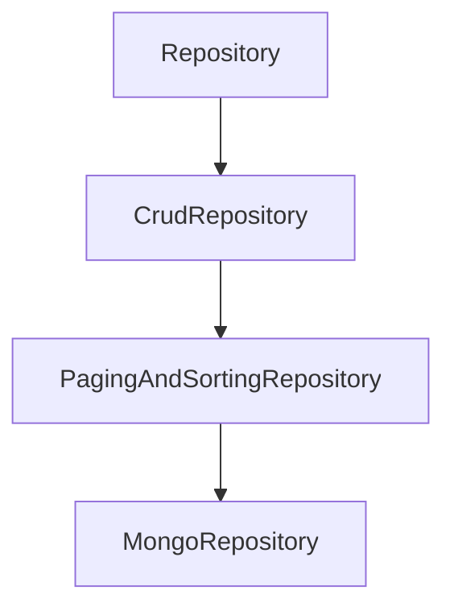

# 第2章 在Spring Boot中使用数据库

使用数据库是开发基本应用的基础。借助于开发框架，我们已经不用编写原始的访问数据库的代码，也不用调用JDBC（Java Data Base Connectivity）或者连接池等诸如此类的被称作底层的代码，我们将在高级的层次上访问数据库。而Spring Boot更是突破了以前所有开发框架访问数据库的方法，在前所未有的更加高级的层次上访问数据库。因为Spring Boot包含一个功能强大的资源库，为使用Spring Boot的开发者提供了更加简便的接口进行访问。

> **提示：** 可以将Maven的中央仓库修改为阿里云的仓库地址，加快jar包的加载速度。参考博文：[Maven将中央仓库修改为阿里云的仓库地址](http://www.shenhuanjie.com/2018/11/20/maven-changes-the-central-warehouse-to-ali-clouds-warehouse-address/)

本章将介绍怎样使用传统的关系型数据库，以及近期一段时间异军突起的NoSQL（Not Only SQL）数据库。

本章的实例工程使用了分模块的方式构建，各模块的定义如表2-1所示。

| 项目        | 工程    | 功能        |
| ----------- | ------- | ----------- |
| MySQL模块   | mysql   | 使用MySQL   |
| Redis模块   | redis   | 使用Redis   |
| MongoDB模块 | mongodb | 使用MongoDB |
| Neo4j模块   | meo4j   | 使用Neo4j   |

> **提示**：运行此实例需要从GitHub获取源码：[https://github.com/shenhuanjie/spring-boot-db](https://github.com/shenhuanjie/spring-boot-db)，并导入IDEA。

<!--more-->
## 2.1 使用MySQL

对于传统关系型数据库来说，Spring Boot使用JPA（Java Persistence API）资源库来实现对数据库的操作，使用MySQL也是如此。简单地说，JPA就是为POJO（Plain Ordinary Java Object）提供持久化的标准规范，即将Java的普通对象通过对象关系映射（Object-Relational Mapping，ORM）持久化到数据库中。

### 2.1.1 MySQL依赖配置

为了使用JPA和MySQL，首先在工程中引入它们的Maven依赖，如代码清单2-1所示。其中，指定了在运行时调用MySQL的依赖。

```xml
<?xml version="1.0" encoding="UTF-8"?>
<project xmlns="http://maven.apache.org/POM/4.0.0"
         xmlns:xsi="http://www.w3.org/2001/XMLSchema-instance"
         xsi:schemaLocation="http://maven.apache.org/POM/4.0.0 http://maven.apache.org/xsd/maven-4.0.0.xsd">
    <parent>
        <artifactId>spring-boot-db</artifactId>
        <groupId>springboot.db</groupId>
        <version>1.0-SNAPSHOT</version>
    </parent>
    <modelVersion>4.0.0</modelVersion>

    <artifactId>mysql</artifactId>

    <dependencies>
        <dependency>
            <groupId>org.springframework.boot</groupId>
            <artifactId>spring-boot-starter-data-jpa</artifactId>
        </dependency>
        <dependency>
            <groupId>mysql</groupId>
            <artifactId>mysql-connector-java</artifactId>
            <scope>runtime</scope>
        </dependency>
    </dependencies>
</project>
```

> **提示：** 模块pom.xml只需加上对应的引用即可，父级pom.xml则加上全局的spring.boot 引用。

```xml
<?xml version="1.0" encoding="UTF-8"?>
<project xmlns="http://maven.apache.org/POM/4.0.0"
         xmlns:xsi="http://www.w3.org/2001/XMLSchema-instance"
         xsi:schemaLocation="http://maven.apache.org/POM/4.0.0 http://maven.apache.org/xsd/maven-4.0.0.xsd">
    <modelVersion>4.0.0</modelVersion>

    <groupId>springboot.db</groupId>
    <artifactId>spring-boot-db</artifactId>
    <packaging>pom</packaging>
    <version>1.0-SNAPSHOT</version>
    <modules>
        <module>mysql</module>
        <module>mongodb</module>
        <module>neo4j</module>
        <module>redis</module>
    </modules>

    <parent>
        <groupId>org.springframework.boot</groupId>
        <artifactId>spring-boot-starter-parent</artifactId>
        <version>1.4.2.RELEASE</version>
    </parent>

    <properties>
        <project.build.sourceEncoding>UTF-8</project.build.sourceEncoding>
        <java.version>1.8</java.version>
    </properties>

    <dependencies>
        <dependency>
            <groupId>org.springframework.boot</groupId>
            <artifactId>spring-boot-starter-web</artifactId>
        </dependency>
        <dependency>
            <groupId>org.springframework.boot</groupId>
            <artifactId>spring-boot-starter-actuator</artifactId>
        </dependency>
        <dependency>
            <groupId>org.springframework.boot</groupId>
            <artifactId>spring-boot-starter-test</artifactId>
            <scope>test</scope>
        </dependency>
    </dependencies>
</project>
```


### 2.1.2 实体建模

首先创建一些普通对象，用来与数据库的表建立映射关系，接着演示如何使用JPA对数据库进行增删改查等存取操作。

假如现在有三个实体：部门、用户和角色，并且它们具有一定的关系，即一个用户只能隶属于一个部门，一个用户可以拥有多个角色。它们的关系模型如图2-1所示。

 

Spring Boot的实体建模与使用Spring框架时的定义方法一样，同样比较方便的是使用了注解的方式来实现。

部门实体的建模如代码清单2-2所示，其中注解@Table指定关联的数据库的表名，注解@Id定义一条记录的唯一标识，并结合注解@GeneratedValue将其设置为自动生成。部门实体只有两个字段：id和name。程序中省略了Getter和Setter方法的定义，这些方法可以使用IDEA的自动生成工具很方便地生成。

```java
package dbdemo.mysql.entity;

import javax.persistence.*;

@Entity
@Table(name = "department")
public class Department {
    @Id
    @GeneratedValue(strategy = GenerationType.IDENTITY)
    private Long id;
    private String name;

    public Department() {
    }

    public Long getId() {
        return id;
    }

    public void setId(Long id) {
        this.id = id;
    }

    public String getName() {
        return name;
    }

    public void setName(String name) {
        this.name = name;
    }

}

```

用户实体包含三个字段：id、name和createdate，用户实体建模如代码清单2-3所示。其中注解@ManyToOne定义它与部门的多对一关系，并且在数据库表中用字段did来表示部门的ID，注解@ManyToMany定义与角色实体的多对多关系，并且用中间表user_role来存储它们各自的ID，以表示它们的对应关系。日期类型的数据必须使用注解@DateTimeFormat来进行格式化，以保证它在存取时能提供正确的格式，避免保存失败。注解@JsonBackReference用来防止关系对象的递归访问。

```java
package dbdemo.mysql.entity;

import com.fasterxml.jackson.annotation.JsonBackReference;
import com.fasterxml.jackson.annotation.JsonIgnore;
import org.springframework.format.annotation.DateTimeFormat;

import javax.persistence.*;
import java.util.Date;
import java.util.List;

@Entity
@Table(name = "user")
public class User implements java.io.Serializable{
    @Id
    @GeneratedValue(strategy = GenerationType.IDENTITY)
    private Long id;
    private String name;
    @DateTimeFormat(pattern = "yyyy-MM-dd HH:mm:ss")
    private Date createdate;

    @ManyToOne
    @JoinColumn(name = "did")
    @JsonBackReference
    private Department deparment;

    @ManyToMany(cascade = {}, fetch = FetchType.EAGER)
    @JoinTable(name = "user_role",
            joinColumns = {@JoinColumn(name = "user_id")},
            inverseJoinColumns = {@JoinColumn(name = "roles_id")})
    private List<Role> roles;

    public User() {
    }

    public Long getId() {
        return id;
    }

    public void setId(Long id) {
        this.id = id;
    }

    public String getName() {
        return name;
    }

    public void setName(String name) {
        this.name = name;
    }

    public Date getCreatedate() {
        return createdate;
    }

    public void setCreatedate(Date createdate) {
        this.createdate = createdate;
    }

    public Department getDeparment() {
        return deparment;
    }

    public void setDeparment(Department deparment) {
        this.deparment = deparment;
    }

    public List<Role> getRoles() {
        return roles;
    }

    public void setRoles(List<Role> roles) {
        this.roles = roles;
    }
}
```

角色实体建模比较简单，只要按设计的要求，定义id和name字段即可，当然同样必须保证id的唯一性并将其设定为自动生成。角色实体的建模如代码清单2-4所示。

```java
package dbdemo.mysql.entity;

import javax.persistence.*;

@Entity
@Table(name = "role")
public class Role implements java.io.Serializable{
    @Id
    @GeneratedValue(strategy = GenerationType.IDENTITY)
    private Long id;
    private String name;

    public Role() {
    }

    public Long getId() {
        return id;
    }

    public void setId(Long id) {
        this.id = id;
    }

    public String getName() {
        return name;
    }

    public void setName(String name) {
        this.name = name;
    }
}
```

### 2.1.3 实体持久化

通过上面三个实体的定义，实现了使用Java的普通对象（POJO）与数据库表建立映射关系（ORM），接下来使用JPA来实现持久化。

用户实体使用JPA进行持久化的例子如代码清单2-5所示。它是一个接口，并继承于JPA资源库JpaRepository接口，使用注解@Repository将这个接口也定义为一个资源库，使它能被其他程序引用，并为其他程序提供存取数据库的功能。

使用相同的方法，可以定义部门实体和角色实体的资源库接口。接口同样继承于JpaRepository接口，只要注意使用的参数是各自的实体对象即可。

```java
package dbdemo.mysql.repository;

import dbdemo.mysql.entity.User;
import org.springframework.data.jpa.repository.JpaRepository;
import org.springframework.stereotype.Repository;

import java.util.Date;
import java.util.List;

@Repository
public interface UserRepository extends JpaRepository<User, Long> {
    User findByNameLike(String name);
    User readByName(String name);
    List<User> getByCreateddateLessThan(Date star);
}

```

```java
package dbdemo.mysql.repository;

import dbdemo.mysql.entity.Department;
import org.springframework.data.jpa.repository.JpaRepository;
import org.springframework.stereotype.Repository;

@Repository
public interface DepartmentRepository extends JpaRepository<Department, Long> {
    
}
```

```java
package dbdemo.mysql.repository;

import dbdemo.mysql.entity.Role;
import org.springframework.data.jpa.repository.JpaRepository;
import org.springframework.stereotype.Repository;

@Repository
public interface RoleRepository extends JpaRepository<Role, Long> {
    
}
```

这样就实现存取数据库的功能了。现在可以对数据库进行增删改查、进行分页查询和指定排序的字段等操作。

或许你还有疑问，我们定义的实体资源库接口并没有声明一个方法，也没有对接口有任何实现的代码，甚至一条SQL查询语句都没有写，这怎么可能？

是的，使用JPA就是可以这么简单。我们来看看JpaRepository的继承关系，你也许会明白一些。如图2-2所示，JpaRepository继承于PagingAndSortingRepository，它提供了分页和排序功能，PagingAndSortingRepository继承于CrudRepository，它提供了简单的增删改查功能。

 

因为定义的接口继承于JpaRepository，所以它传递性地继承上面所有这些接口，并拥有这些接口的所有方法，这样就不难理解为何它包含那么多功能了。这些接口提供的一些方法如下：

 

JPA还提供了一些自定义声明方法的规则，例如，在接口中使用关键值findBy、readBy、getBy作为方法名的前缀，拼接实体类中的属性字段（首个字母大写），并可选择拼接一些SQL查询关键字来组合成一个查询方法。例如，对于用户实体，下列查询关键字可以这样使用：

 

又如下列对用户实体类自定义的方法声明，它们都是符合JPA规则的，这些方法也不用实现，JPA将会代理实现这些方法。

```java
User findByNameLike(String name);
User readByName(String name);
List<User> getByCreateddateLessThan(Date star);
```

### 2.1.4 MySQL测试

现在，为了验证上面设计的正确性，我们用一个实例来测试一下。

首先，增加一个使用JPA的配置类，如代码清单2-6所示。其中@EnableTransactionManagement启用了JPA的事务管理；@EnableJpaRepositories启用了JPA资源库并制定了上面定义的接口资源库的位置；@EntityScan指定了定义实体的位置，它将导入我们定义的实体。注意，在测试时使用的JPA配置类可能与这个配置略有不同，这个配置的一些配置参数是从配置文件中读取的，而测试时使用的配置类把一些配置参数都包含在类定义中了。

```java
package dbdemo.mysql.config;

import org.springframework.boot.orm.jpa.EntityScan;
import org.springframework.context.annotation.Bean;
import org.springframework.context.annotation.Configuration;
import org.springframework.core.Ordered;
import org.springframework.core.annotation.Order;
import org.springframework.dao.annotation.PersistenceExceptionTranslationPostProcessor;
import org.springframework.data.jpa.repository.config.EnableJpaRepositories;
import org.springframework.transaction.annotation.EnableTransactionManagement;


@Order(Ordered.HIGHEST_PRECEDENCE)
@Configuration
@EnableTransactionManagement(proxyTargetClass = true)
@EnableJpaRepositories(basePackages = "dbdemo.**.repository")
@EntityScan(basePackages = "dbdemo.**.entity")
public class JpaConfiguration {

    @Bean
    PersistenceExceptionTranslationPostProcessor persistenceExceptionTranslationPostProcessor(){
        return new PersistenceExceptionTranslationPostProcessor();
    }

}
```

其次，在MySQL数据库服务器中创建一个数据库test，然后配置一个可以访问这个数据库的用户及其密码。数据库的表结构可以不用创建，在程序运行时将会按照实体的定义自动创建。如果还没有创建一个具有完全权限访问数据库test的用户，可以在连接MySQL服务器的查询窗口中执行下面指令，这个指令假设你将在本地中访问数据库。

```sql
grant all privileges on test.* to 'root'@'localhost' identified by '123456';
```

然后，在Spring Boot的配置文件application.yml中使用如代码清单2-7所示的配置，用来设置数据源和JPA的工作模式。

```yaml
spring:
  datasource:
    url: jdbc:mysql://localhost:3306/test?characterEncoding=utf8
    username: root
    password: 12345678
  jpa:
    database: MYSQL
    show-sql: true
  #Hibernate ddl auto (validate|create|create-drop|update)
    hibernate:
      ddl-auto: update
      naming-strategy: org.hibernate.cfg.ImprovedNamingStrategy
    properties:
      hibernate:
        dialect: org.hibernate.dialect.MySQL5Dialect
```

配置中将ddl-auto设置为update，就是使用Hibernate来自动更新表结构的，即如果数据表不存在则创建，或者如果修改了表结构，在程序启动时则执行表结构的同步更新。

最后，编写一个测试程序，如代码清单2-8所示。测试程序首先初始化数据库，创建一个部门，命名为“开发部”，创建一个角色，命名为admin，创建一个用户，命名为user，同时将它所属部门设定为上面创建的部门，并将现有的所有角色都分配给这个用户。然后使用分页的方式查询所有用户的列表，并从查到的用户列表中，打印出用户的名称、部门的名称和第一个角色的名称等信息。

```java
package dbdemo.mysql.test;

import dbdemo.mysql.entity.Department;
import dbdemo.mysql.entity.Role;
import dbdemo.mysql.entity.User;
import dbdemo.mysql.repository.DepartmentRepository;
import dbdemo.mysql.repository.RoleRepository;
import dbdemo.mysql.repository.UserRepository;

import org.junit.Before;
import org.junit.Test;
import org.junit.runner.RunWith;
import org.slf4j.Logger;
import org.slf4j.LoggerFactory;
import org.springframework.beans.factory.annotation.Autowired;
import org.springframework.data.domain.Page;
import org.springframework.data.domain.PageRequest;
import org.springframework.data.domain.Pageable;
import org.springframework.data.domain.Sort;
import org.springframework.test.context.ContextConfiguration;
import org.springframework.test.context.junit4.SpringJUnit4ClassRunner;
import org.springframework.util.Assert;

import java.util.*;

@RunWith(SpringJUnit4ClassRunner.class)
@ContextConfiguration(classes = {JpaConfiguration.class})
public class MysqlTest {
    private static Logger logger = LoggerFactory.getLogger(MysqlTest.class);

    @Autowired
    UserRepository userRepository;
    @Autowired
    DepartmentRepository departmentRepository;
    @Autowired
    RoleRepository roleRepository;

    @Before
    public void initData(){
        userRepository.deleteAll();
        roleRepository.deleteAll();
        departmentRepository.deleteAll();

        Department department = new Department();
        department.setName("开发部");
        departmentRepository.save(department);
        Assert.notNull(department.getId());

        Role role = new Role();
        role.setName("admin");
        roleRepository.save(role);
        Assert.notNull(role.getId());

        User user = new User();
        user.setName("user");
        user.setCreatedate(new Date());
        user.setDeparment(department);

        List<Role> roles = roleRepository.findAll();
        Assert.notNull(roles);
        user.setRoles(roles);

        userRepository.save(user);
        Assert.notNull(user.getId());
    }

    @Test
    public void findPage(){
        Pageable pageable = new PageRequest(0, 10, new Sort(Sort.Direction.ASC, "id"));
        Page<User> page = userRepository.findAll(pageable);
        Assert.notNull(page);
        for(User user : page.getContent()) {
            logger.info("====user==== user name:{}, department name:{}, role name:{}",
                    user.getName(), user.getDeparment().getName(), user.getRoles().get(0).getName());
        }
    }
}
```

> **提示：**test目录下同样加入JpaConfiguration配置类

```java
package dbdemo.mysql.test;


import org.springframework.context.annotation.Bean;
import org.springframework.context.annotation.Configuration;
import org.springframework.dao.annotation.PersistenceExceptionTranslationPostProcessor;
import org.springframework.data.jpa.repository.config.EnableJpaRepositories;
import org.springframework.jdbc.datasource.DriverManagerDataSource;
import org.springframework.orm.jpa.JpaTransactionManager;
import org.springframework.orm.jpa.LocalContainerEntityManagerFactoryBean;
import org.springframework.orm.jpa.vendor.Database;
import org.springframework.orm.jpa.vendor.HibernateJpaVendorAdapter;
import org.springframework.transaction.PlatformTransactionManager;
import org.springframework.transaction.support.TransactionTemplate;

import javax.sql.DataSource;
import java.util.Properties;


@Configuration
@EnableJpaRepositories(basePackages = "dbdemo.**.repository")
public class JpaConfiguration {

    @Bean
    PersistenceExceptionTranslationPostProcessor persistenceExceptionTranslationPostProcessor(){
        return new PersistenceExceptionTranslationPostProcessor();
    }

    @Bean
    public DataSource dataSource() {
        DriverManagerDataSource dataSource = new DriverManagerDataSource();
        dataSource.setDriverClassName("com.mysql.jdbc.Driver");
        dataSource.setUrl("jdbc:mysql://localhost:3306/test?characterEncoding=utf8");
        dataSource.setUsername("root");
        dataSource.setPassword("123456");

        return dataSource;
    }

    @Bean
    public LocalContainerEntityManagerFactoryBean entityManagerFactory() {
        LocalContainerEntityManagerFactoryBean entityManagerFactoryBean = new LocalContainerEntityManagerFactoryBean();
        entityManagerFactoryBean.setDataSource(dataSource());
        entityManagerFactoryBean.setPackagesToScan("dbdemo.mysql.entity");
        entityManagerFactoryBean.setJpaProperties(buildHibernateProperties());
        entityManagerFactoryBean.setJpaVendorAdapter(new HibernateJpaVendorAdapter() {{
            setDatabase(Database.MYSQL);
        }});
        return entityManagerFactoryBean;
    }

    protected Properties buildHibernateProperties()
    {
        Properties hibernateProperties = new Properties();

        hibernateProperties.setProperty("hibernate.dialect", "org.hibernate.dialect.MySQL5Dialect");
        hibernateProperties.setProperty("hibernate.show_sql", "true");
        hibernateProperties.setProperty("hibernate.use_sql_comments", "false");
        hibernateProperties.setProperty("hibernate.format_sql", "true");
        hibernateProperties.setProperty("hibernate.hbm2ddl.auto", "update");
        hibernateProperties.setProperty("hibernate.generate_statistics", "false");
        hibernateProperties.setProperty("javax.persistence.validation.mode", "none");

        //Audit History flags
        hibernateProperties.setProperty("org.hibernate.envers.store_data_at_delete", "true");
        hibernateProperties.setProperty("org.hibernate.envers.global_with_modified_flag", "true");

        return hibernateProperties;
    }

    @Bean
    public PlatformTransactionManager transactionManager() {
        return new JpaTransactionManager();
    }

    @Bean
    public TransactionTemplate transactionTemplate() {
        return new TransactionTemplate(transactionManager());
    }
}
```

好了，现在可以使用JUnit来运行这个测试程序了，在IDEA的Run/Debug Configuration配置中增加一个JUnit配置项，模块选择mysql，工作目录选择模块所在的根目录，程序选择dbdemo.mysql.test.MysqlTest，并将配置项目名称保存为mysqlTest，如图2-3所示。

 

用Debug方式运行测试配置项目mysqltest，可以在控制台中看到执行的过程和结果。如果状态栏中显示为绿色，并且提示“All Tests passed”，则表示测试全部通过。在控制台中也可以查到下列打印信息：

```bash
dbdemo.mysql.test.MysqlTest - ====user==== ,user name:user,department name:开发部,role name:admin
```

这时如果在MySQL服务器中查看数据库test，不但可以看到表结构都已经创建了，还可以看到上面测试生成的一些数据。

这是不是很激动人心？在Spring Boot使用数据库，就是可以如此简单和有趣。到目前为止，我们不仅没有写过一条查询语句，也没有实现一个访问数据库的方法，但是已经能对数据库执行所有的操作，包括一般的增删改查和分页查询。

## 2.2 使用Redis

关系型数据库在性能上总是存在一些这样那样的缺陷，所以大家有时候在使用传统关系型数据库时，会与具有高效存取功能的缓存系统结合使用，以提高系统的访问性能。在很多流行的缓存系统中，Redis是一个不错的选择。Redis是一种可以持久存储的缓存系统，是一个高性能的key-value数据库，它使用键-值对的方式来存储数据。

### 2.2.1 Redis依赖配置

需要使用Redis，可在工程的Maven配置中加入spring-boot-starter-redis依赖，如代码清单2-9所示。其中gson是用来转换Json数据格式的工具，mysql是引用了上一节的模块，这里使用2.1节定义的实体对象来存取数据，演示Redis中的存取操作。

```xml
<?xml version="1.0" encoding="UTF-8"?>
<project xmlns="http://maven.apache.org/POM/4.0.0"
         xmlns:xsi="http://www.w3.org/2001/XMLSchema-instance"
         xsi:schemaLocation="http://maven.apache.org/POM/4.0.0 http://maven.apache.org/xsd/maven-4.0.0.xsd">
    <parent>
        <artifactId>spring-boot-db</artifactId>
        <groupId>springboot.db</groupId>
        <version>1.0-SNAPSHOT</version>
    </parent>
    <modelVersion>4.0.0</modelVersion>

    <artifactId>redis</artifactId>

    <dependencies>
        <dependency>
            <groupId>org.springframework.boot</groupId>
            <artifactId>spring-boot-starter-redis</artifactId>
        </dependency>
        <dependency>
            <groupId>com.google.code.gson</groupId>
            <artifactId>gson</artifactId>
            <version>2.2.4</version>
        </dependency>
        <dependency>
            <groupId>springboot.db</groupId>
            <artifactId>mysql</artifactId>
            <version>${project.version}</version>
        </dependency>
    </dependencies>

</project>
```

### 2.2.2 创建Redis服务类

Redis提供了下列几种数据类型可供存取：

* string；
* hash；
* list；
* set及zset；

在实例中，将使用string即字符串类型来演示数据的存取操作。对于Redis，Spring Boot没有提供像JPA那样相应的资源库接口，所以只能仿照上一节中Repository的定义编写一个实体User的服务类，如代码清单2-10所示。这个服务类可以存取对象User以及由User组成的列表List，同时还提供了一个删除的方法。所有这些方法都是使用RedisTemplate来实现的。

```java
package dbdemo.redis.repository;

import com.google.gson.Gson;
import com.google.gson.reflect.TypeToken;
import dbdemo.mysql.entity.User;
import org.springframework.beans.factory.annotation.Autowired;
import org.springframework.data.redis.core.RedisTemplate;
import org.springframework.stereotype.Repository;
import org.springframework.util.StringUtils;

import java.util.List;
import java.util.concurrent.TimeUnit;

@Repository
public class UserRedis {
    /**
     * 这些方法都是使用RedisTemplate来实现的。
     */
    @Autowired
    private RedisTemplate<String, String> redisTemplate;

    /**
     * Add User
     *
     * @param key
     * @param time
     * @param user
     */
    public void add(String key, Long time, User user) {
        Gson gson = new Gson();
        redisTemplate.opsForValue().set(key, gson.toJson(user), time, TimeUnit.MINUTES);
    }

    /**
     * Add User List
     *
     * @param key
     * @param time
     * @param users
     */
    public void add(String key, Long time, List<User> users) {
        Gson gson = new Gson();
        redisTemplate.opsForValue().set(key, gson.toJson(users), time, TimeUnit.MINUTES);
    }

    /**
     * Get User
     *
     * @param key
     * @return
     */
    public User get(String key) {
        Gson gson = new Gson();
        User user = null;
        String userJson = redisTemplate.opsForValue().get(key);
        if (!StringUtils.isEmpty(userJson))
            user = gson.fromJson(userJson, User.class);
        return user;
    }

    /**
     * Get User List
     *
     * @param key
     * @return
     */
    public List<User> getList(String key) {
        Gson gson = new Gson();
        List<User> ts = null;
        String listJson = redisTemplate.opsForValue().get(key);
        if (!StringUtils.isEmpty(listJson))
            ts = gson.fromJson(listJson, new TypeToken<List<User>>() {
            }.getType());
        return ts;
    }

    /**
     * Delete Obj
     *
     * @param key
     */
    public void delete(String key) {
        redisTemplate.opsForValue().getOperations().delete(key);
    }
}
```

Redis没有表结构的概念，所以要实现MySQL数据库中表的数据（即普通Java对象映射的实体数据）在Redis中存取，必须做一些转换，使用JSON格式的文本作为Redis与Java普通对象互相交换数据的存储格式。这里使用Gson工具将类对象转换为JSON格式的文本进行存储，要取出数据时，再将JSON文本转化为Java对象。

因为Redis使用key-value的方式存储数据，所以存入时要生成一个唯一的key，而要查询或删除数据时，就可以使用这个唯一的key进行相应的操作。

保存在Redis数据库中的数据默认是永久存储的，可以指定一个时限来确定数据的生命周期，超过指定时限的数据将被Redis自动清除。在代码清单2-10中我们以分钟为单位设定了数据的存储期限。

另外，为了能正确调用RedisTemplate，必须对其进行一些初始化工作，即主要对它存取的字符串进行一个JSON格式的系列化初始配置，如代码清单2-11所示。

```java
package dbdemo.redis.config;

import com.fasterxml.jackson.annotation.JsonAutoDetect;
import com.fasterxml.jackson.annotation.PropertyAccessor;
import com.fasterxml.jackson.databind.ObjectMapper;
import org.springframework.cache.annotation.CachingConfigurerSupport;
import org.springframework.context.annotation.Bean;
import org.springframework.context.annotation.Configuration;
import org.springframework.data.redis.connection.RedisConnectionFactory;
import org.springframework.data.redis.core.RedisTemplate;
import org.springframework.data.redis.core.StringRedisTemplate;
import org.springframework.data.redis.serializer.Jackson2JsonRedisSerializer;

@Configuration
public class RedisConfig {

    @Bean
    public RedisTemplate<String, String> redisTemplate(
            RedisConnectionFactory factory) {
        StringRedisTemplate template = new StringRedisTemplate(factory);
        Jackson2JsonRedisSerializer jackson2JsonRedisSerializer = new Jackson2JsonRedisSerializer(Object.class);
        ObjectMapper om = new ObjectMapper();
        om.setVisibility(PropertyAccessor.ALL, JsonAutoDetect.Visibility.ANY);
        om.enableDefaultTyping(ObjectMapper.DefaultTyping.NON_FINAL);
        jackson2JsonRedisSerializer.setObjectMapper(om);
        template.setValueSerializer(jackson2JsonRedisSerializer);
        template.afterPropertiesSet();
        return template;
    }
}
```

### 2.2.3 Redis测试

如果还没有按照Redis服务器，可以参照本书附录C提供的方法安装，然后在工程的配置文件application.yml中配置连接Redis服务器等参数，如代码清单2-12所示。其中host和port分别表示Redis数据库服务器的IP地址和开放端口，database可以不用指定，由Redis根据存储情况自动选定（注：测试时这些配置是集中在一个配置类中实现的）。

```yaml
spring:
  redis:
  # database: 1
    host: 127.0.0.1
    port: 6379
    pool:
      max-idle: 8
      min-idle: 0
      max-active: 8
      max-wait: -1
```

现在编写一个JUnit测试程序，来演示如何在Redis服务器中存取数据，如代码清单2-13所示。测试程序创建一个部门对象并将其命名为“开发部”，创建一个角色对象并把它命名为admin，创建一个用户对象并把它命名为user，同时设定这个用户属于“开发部”，并把admin这个角色分配给这个用户。接着测试程序使用类名等参数生成一个key，并使用这个key清空原来的数据，然后用这个key存储现在这个用户的数据，最后使用这个key查询用户，并将查到的信息打印出来。

```java
package dbdemo.redis.test;


import dbdemo.mysql.entity.Department;
import dbdemo.mysql.entity.Role;
import dbdemo.mysql.entity.User;
import dbdemo.redis.repository.UserRedis;
import org.junit.Before;
import org.junit.Test;
import org.junit.runner.RunWith;
import org.slf4j.Logger;
import org.slf4j.LoggerFactory;
import org.springframework.beans.factory.annotation.Autowired;
import org.springframework.test.context.ContextConfiguration;
import org.springframework.test.context.junit4.SpringJUnit4ClassRunner;
import org.springframework.util.Assert;

import java.util.ArrayList;
import java.util.Date;
import java.util.List;


@RunWith(SpringJUnit4ClassRunner.class)
@ContextConfiguration(classes = {RedisConfig.class, UserRedis.class})
public class RedisTest {
    private static Logger logger = LoggerFactory.getLogger(RedisTest.class);

    @Autowired
    UserRedis userRedis;

    @Before
    public void setup() {
        Department department = new Department();
        department.setName("开发部");

        Role role = new Role();
        role.setName("admin");

        User user = new User();
        user.setName("user");
        user.setCreatedate(new Date());
        user.setDepartment(department);

        List<Role> roles = new ArrayList<>();
        roles.add(role);

        user.setRoles(roles);

        userRedis.delete(this.getClass().getName() + ":userByName:" + user.getName());
        userRedis.add(this.getClass().getName() + ":userByName:" + user.getName(), 10L, user);

    }

    @Test
    public void get() {
        User user = userRedis.get(this.getClass().getName() + ":userByName:user");
        Assert.notNull(user);
        logger.info("======user====== name:{}, department:{}, role:{}",
                user.getName(), user.getDepartment().getName(), user.getRoles().get(0).getName());
    }
}
```

> **提示：**可以使用RedisStudio进行可视化监控


要运行这个测试程序，可以在IDEA的Run/Debug Configuration配置中增加一个JUnit配置项目，模块选择redis，工作目录选择模块所在的根目录，类选择这个测试程序即dbdemo.redis.test.RedisTest，并将配置保存为redistest。

使用Debug方式运行测试项目redistest。如果测试通过，会输出一个用户的用户名、所属部门和拥有角色等简要信息，如下所示：

```
INFO dbdemo.redis.test.RedisTest - ======user====== name:user, department:开发部, role:admin
```

对于Redis的使用，还可以将注解方式与调用数据库的方法相结合，那样就不用再编写像上面那样的服务类，并且使用起来更加简单，这将在后面的章节中介绍。

## 2.3 使用MongoDB

在当前流行的NoSQL数据库中，MongoDB是大家接触比较早而且用得比较多的数据库。MongoDB是文档型的NoSQL数据库，具有大数据量、高并发等优势，但缺点是不能建立实体关系，而且也没有事务管理机制。

### 2.3.1 MongoDB依赖配置

在Spring Boot中使用MongoDB也像使用JPA一样容易，并且同样拥有功能完善的资源库。同样的，要使用MongoDB，首先必须在工程的Maven中引入它的依赖，如代码清单2-14所示。除了MongoDB本身的依赖之外，还需要一些附加的工具配套使用。

```xml
<dependencies>
    <dependency>
        <groupId>org.springframework.data</groupId>
        <artifactId>spring-data-mongodb</artifactId>
    </dependency>
    <dependency>
        <groupId>org.pegdown</groupId>
        <artifactId>pegdown</artifactId>
        <version>1.4.1</version>
    </dependency>
    <dependency>
        <groupId>org.springframework.boot</groupId>
        <artifactId>spring-boot-starter-hateoas</artifactId>
    </dependency>
    <dependency>
        <groupId>com.fasterxml.jackson.core</groupId>
        <artifactId>jackson-annotations</artifactId>
    </dependency>
</dependencies>
```

### 2.3.2 文档建模

MongoDB是文档型数据库，使用MongoDB也可以像使用关系型数据库那样为文档建模。如代码清单2-15所示，为用户文档建模，它具有用户名、密码、用户名称、邮箱和注册日期等字段，有一个用来保存用户的数据集，还定义了一个构造函数，可以很方便地用来创建一个用户实例。

```java
package dbdemo.mongo.models;

import org.springframework.data.annotation.Id;
import org.springframework.data.annotation.PersistenceConstructor;
import org.springframework.data.mongodb.core.index.Indexed;
import org.springframework.data.mongodb.core.mapping.Document;

import javax.validation.constraints.NotNull;
import java.util.Date;
import java.util.HashSet;
import java.util.Set;

@Document(collection = "user")
public class User {
    @Id
    private String userId;
    @NotNull
    @Indexed(unique = true)
    private String username;
    @NotNull
    private String password;
    @NotNull
    private String name;
    @NotNull
    private String email;
    @NotNull
    private Date registrationDate = new Date();
    private Set<String> roles = new HashSet<>();

    public User() {
    }

    @PersistenceConstructor
    public User(String userId, String username, String password, String name, String email,
                Date registrationDate, Set<String> roles) {
        this.userId = userId;
        this.username = username;
        this.password = password;
        this.name = name;
        this.email = email;
        this.registrationDate = registrationDate;
        this.roles = roles;

    }

    public String getUserId() {
        return userId;
    }

    public void setUserId(String userId) {
        this.userId = userId;
    }

    public String getUsername() {
        return username;
    }

    public void setUsername(String username) {
        this.username = username;
    }

    public String getPassword() {
        return password;
    }

    public void setPassword(String password) {
        this.password = password;
    }

    public String getName() {
        return name;
    }

    public void setName(String name) {
        this.name = name;
    }

    public String getEmail() {
        return email;
    }

    public void setEmail(String email) {
        this.email = email;
    }

    public Date getRegistrationDate() {
        return registrationDate;
    }

    public void setRegistrationDate(Date registrationDate) {
        this.registrationDate = registrationDate;
    }

    public Set<String> getRoles() {
        return roles;
    }

    public void setRoles(Set<String> roles) {
        this.roles = roles;
    }

    @Override
    public String toString() {
        return "User{" +
                "userId=" + userId +
                ", username='" + username + '\'' +
                ", password='" + password + '\'' +
                ", name='" + name + '\'' +
                ", email='" + email + '\'' +
                ", registrationDate=" + registrationDate +
                ", roles=" + roles +
                '}';
    }

}
```

### 2.3.3 文档持久化

MongoDB也有像使用JPA那样的资源库，如代码清单2-16所示，为用户文档创建了一个Repository接口，继承于MongoRepository，实现了文档持久化。

```java
package dbdemo.mongo.repositories;


import dbdemo.mongo.models.User;
import org.springframework.data.mongodb.repository.MongoRepository;


public interface UserRepository extends MongoRepository<User, String> {
    User findByUsername(String username);
}
```

MongoRepository的继承关系如图2-4所示，看起来跟JPA的资源库的继承关系没有什么两样，它也包含访问数据库的丰富功能。



代码清单2-17是用在测试中的使用MongoDB的一个配置类定义，其中@PropertySource指定读取数据库配置文件的位置和名称，@EnableMongoRepositories启用资源库并设定定义资源库接口放置的位置，这里使用环境变量Environment来读取配置文件的一些数据库配置参数，然后使用一个数据库客户端，连接MongoDB服务器。

```java
package dbdemo.mongo.test;

import com.mongodb.Mongo;
import com.mongodb.MongoClient;
import com.mongodb.MongoCredential;
import com.mongodb.ServerAddress;
import org.springframework.beans.factory.annotation.Autowired;
import org.springframework.context.annotation.Bean;
import org.springframework.context.annotation.Configuration;
import org.springframework.context.annotation.PropertySource;
import org.springframework.core.env.Environment;
import org.springframework.data.mongodb.config.AbstractMongoConfiguration;
import org.springframework.data.mongodb.repository.config.EnableMongoRepositories;

import java.util.ArrayList;
import java.util.List;


@Configuration
@EnableMongoRepositories(basePackages = "dbdemo.mongo.repositories")
@PropertySource("classpath:test.properties")
public class TestDataSourceConfig extends AbstractMongoConfiguration {

    @Autowired
    private Environment env;

    @Override
    public String getDatabaseName() {
        return env.getRequiredProperty("mongo.name");
    }

    @Override
    @Bean
    public Mongo mongo() throws Exception {
        ServerAddress serverAddress = new ServerAddress(env.getRequiredProperty("mongo.host"));
        List<MongoCredential> credentials = new ArrayList<>();
        return new MongoClient(serverAddress, credentials);
    }

}
```

### 2.3.4 MongoDB测试

如果还没有安装MongoDB服务器，可以参照附录B的方法安装并启动一个Mon共DB服务器。然后，使用如代码清单2-18所示的配置方法配置连接服务器的一些参数，该配置假定你的MongoDB服务器安装在本地，并使用默认的数据库端口：27017。

```bash
# MongoDB
mongo.username=test
mongo.password=test
mongo.host=localhost
mongo.name=test
mongo.port=27017
```

这样就可以编写一个JUnit测试例子来测试UserRepository接口的使用情况，如代码清单2-19所示。测试例子首先使用用户文档类创建一个用户对象实例，然后使用资源接口调用save方法将用户对象保存到数据库中，最后使用findAll方法查询所有用户的列表，并使用一个循环输出用户的简要信息。

```java
package dbdemo.mongo.test;


import dbdemo.mongo.models.User;
import dbdemo.mongo.repositories.UserRepository;
import org.junit.Before;
import org.junit.FixMethodOrder;
import org.junit.Test;
import org.junit.runner.RunWith;
import org.slf4j.Logger;
import org.slf4j.LoggerFactory;
import org.springframework.beans.factory.annotation.Autowired;
import org.springframework.test.context.ContextConfiguration;
import org.springframework.test.context.junit4.SpringJUnit4ClassRunner;
import org.springframework.util.Assert;

import java.util.Date;
import java.util.HashSet;
import java.util.List;
import java.util.Set;


@RunWith(SpringJUnit4ClassRunner.class)
@ContextConfiguration(classes = {TestDataSourceConfig.class})
@FixMethodOrder
public class RepositoryTests {
    private static Logger logger = LoggerFactory.getLogger(RepositoryTests.class);
	
    @SuppressWarnings("SpringJavaAutowiringInspection")
    @Autowired
    UserRepository userRepository;

    @Before
    public void setup() {
        Set<String> roles = new HashSet<>();
        roles.add("manage");
        User user = new User("1", "user", "12345678", "name", "email@com.cn", new Date(), roles);
        userRepository.save(user);
    }

    @Test
    public void findAll() {
        List<User> users = userRepository.findAll();
        Assert.notNull(users);
        for (User user : users) {
            logger.info("===user=== userid:{}, username:{}, pass:{}, registrationDate:{}",
                    user.getUserId(), user.getName(), user.getPassword(), user.getRegistrationDate());
        }
    }
}

//	> db.user.find()
//	{ "_id" : "1", "_class" : "dbdemo.mongo.models.User", "username" : "user", "pass
//		word" : "12345678", "name" : "name", "email" : "email@com.cn", "registrationDate
//		" : ISODate("2016-04-13T06:27:02.423Z"), "roles" : [ "manage" ] }
```

现在可以在IDEA的Run/Debug Configuration配置中增加一个JUnit测试项目，模块选择mongodb，工作目录选择模块所在的工程根目录，类选择上面编写的测试例子，即dbdemo.mongo.test.RepositoryTests，并将配置保存为mongotest。

使用Debug方式运行测试项目mongotest。如果通过测试，将输出查到的用户的简要信息，如下所示：

```
dbdemo.mongo.test.RepositoryTests - ===user=== userid:1, username:name, pass:12345678, registrationDate: Tue Jun 07 14:26:02 CST 2016
```

这时使用MongoDB数据库客户端输入下面的查询指令，也可以查到这条文档的详细信息，这是一条JSON结构的文本信息。

```json
> db.user.find()
{ "_id" : "1", "_class" : "dbdemo.mongo.models.User", "username" : "user", "password" : "12345678", "name" : "name", "email" : "email@com.cn", "registrationDate", ISODate("2016-04-13T06:27:02.423Z"), "roles" : ["mange"] }
```


## 2.4 使用Neo4j

有没有既具有传统关系型数据库的优点，又具备NoSQL数据库优势的一种数据库呢？Neo4j就是一种这样的数据库。Neo4j是一个高性能的NoSQL图数据库，并且具备完全事务特性。Neo4j将结构化数据存储在一张图上，图中每一个结点的属性表示数据的内容，每一条有向边表示数据的关系。Neo4j没有表结构的概念，它的数据用结点的属性来表示。

### 2.4.1 Neo4j依赖配置

在Spring Boot中使用Neo4j非常容易，因为有spring-data-neo4j提供了强大的支持。首先，在工程的Maven管理中引入Neo4j的相关依赖，如代码清单2-20所示。

```xml
<dependencies>
    <dependency>
        <groupId>org.springframework.boot</groupId>
        <artifactId>spring-boot-starter-data-rest</artifactId>
    </dependency>
    <dependency>
        <groupId>org.springframework.data</groupId>
        <artifactId>spring-data-neo4j</artifactId>
        <version>4.0.0.RELEASE</version>
    </dependency>
    <dependency>
        <groupId>com.voodoodyne.jackson.jsog</groupId>
        <artifactId>jackson-jsog</artifactId>
        <version>1.1</version>
        <scope>compile</scope>
    </dependency>
</dependencies>
```

### 2.4.2 结点和关系实体建模

虽然Neo4j没有表结构的概念，但它有结点和关系的概念。例如，现在有演员和电影两个实体，它们的关系表现为一个演员在一部电影中扮演一个角色。那么就可以创建演员和电影两个节点实体，和一个角色关系实体。它们的实体-关系模型如图2-5所示。这个实体-关系模型的定义比起关系型数据库的实体-关系模型的定义要简要得多，但是它更加形象和贴切地表现了实体之间的关系。更难能可贵的是，这个实体-关系模型是可以不经过任何转换而直接存入数据库的，也就是说，在Neo4j图数据库中保存的数据与图2-5所示的相同，它仍然是一张图。这对于业务人员和数据库设计人员来说，它的意义相同。所以使用Neo4j数据库，将在很大程度上减轻了设计工作和沟通工作。


像JPA使用了ORM意义，Neo4j使用了对象-图形映射（Object-Graph Mapping，OGM）的方式来建模。代码清单2-21是演员节点实体建模，使用注解@JsonIdentityInfo是防止查询数据库时引发递归访问效应，注解@NodeEntity标志这个类是一个节点实体，注解@GraphId定义了节点的一个唯一性标识，它将在创建结点时由系统自动生成，所以它是不可缺少的。这个节点预定义了其他两个属性，name和born。节点的属性可以随需要增加或减少，这并不影响结点的使用。

```java
package dbdemo.neo4j.domain;


import com.fasterxml.jackson.annotation.JsonIdentityInfo;
import com.voodoodyne.jackson.jsog.JSOGGenerator;
import org.neo4j.ogm.annotation.GraphId;
import org.neo4j.ogm.annotation.NodeEntity;

@JsonIdentityInfo(generator = JSOGGenerator.class)
@NodeEntity
public class Actor {
    @GraphId
    Long id;
    private String name;
    private int born;

    public Actor() {
    }

    public String getName() {
        return name;
    }

    public void setName(String name) {
        this.name = name;
    }

    public void setBorn(int born) {
        this.born = born;
    }

    public int getBorn() {
        return born;
    }

}
```

代码清单2-22是电影节点实体建模，注解@Realtionship表示`List<Role>`是一个关系列表，其中type设定了关系的类型，direction设定这个关系的方向，Relationship.INCOMING表示以这个节点为终点。addRole定义了增加一个关系的方法。

```java
package dbdemo.neo4j.domain;

import com.fasterxml.jackson.annotation.JsonIdentityInfo;
import com.voodoodyne.jackson.jsog.JSOGGenerator;
import org.neo4j.ogm.annotation.GraphId;
import org.neo4j.ogm.annotation.NodeEntity;
import org.neo4j.ogm.annotation.Relationship;

import java.util.ArrayList;
import java.util.List;

@JsonIdentityInfo(generator = JSOGGenerator.class)
@NodeEntity
public class Movie {
    @GraphId
    Long id;
    String title;
    String year;

    @Relationship(type = "ACTS_IN", direction = Relationship.DIRECTION)
    List<Role> roles = new ArrayList<>();

    public Role addRole(Actor actor, String name) {
        Role role = new Role(actor, this, name);
        this.roles.add(role);
        return role;
    }

    public Movie() {
    }

    public Long getId() {
        return id;
    }

    public String getTitle() {
        return title;
    }

    public void setTitle(String title) {
        this.title = title;
    }

    public String getYear() {
        return year;
    }

    public void setYear(String year) {
        this.year = year;
    }

    public List<Role> getRoles() {
        return roles;
    }
}
```

代码清单2-23是角色的关系实体建模，注解@RelationshipEntity表明这个类是一个关系实体，并用type指定了关系的类型，其中@StartNode指定起始节点的实体，@EndNode指定终止节点的实体，这说明了图中一条有向边的起点和终点的定义。其中定义了一个创建关系的构造函数Role（Actor actor, Movie movie, String name），这里的name参数用来指定这个关系的属性。

```java
package dbdemo.neo4j.domain;


import com.fasterxml.jackson.annotation.JsonIdentityInfo;
import com.voodoodyne.jackson.jsog.JSOGGenerator;
import org.neo4j.ogm.annotation.EndNode;
import org.neo4j.ogm.annotation.GraphId;
import org.neo4j.ogm.annotation.RelationshipEntity;
import org.neo4j.ogm.annotation.StartNode;

@JsonIdentityInfo(generator = JSOGGenerator.class)
@RelationshipEntity(type = "ACTS_IN")
public class Role {
    @GraphId
    Long id;
    String role;
    @StartNode
    Actor actor;
    @EndNode
    Movie movie;

    public Role() {
    }

    public Role(Actor actor, Movie movie, String name) {
        this.actor = actor;
        this.movie = movie;
        this.role = name;
    }

    public Long getId() {
        return id;
    }

    public void setId(Long id) {
        this.id = id;
    }

    public String getRole() {
        return role;
    }

    public void setRole(String role) {
        this.role = role;
    }

    public Actor getActor() {
        return actor;
    }

    public Movie getMovie() {
        return movie;
    }

}
```

### 2.4.3 节点实体持久化

像对其他数据库的访问和存取等操作一样，spring-data-neo4j提供了功能丰富的资源库可供调用，因此，对于演员和电影节点实体，可以创建它们对应的资源库接口，实现实体的持久化。代码清单2-24是电影资源库接口的定义，它继承于GraphRepository接口，实现了电影实体的持久化。使用相同方法可以对演员的节点实体实现持久化。关系实体却不用实现持久化，当保存结点实体时，结点实体的关系将会同时保存。

```java
package dbdemo.neo4j.repositories;

import dbdemo.neo4j.domain.Movie;
import org.springframework.data.neo4j.repository.GraphRepository;
import org.springframework.data.repository.query.Param;
import org.springframework.stereotype.Repository;

@Repository
public interface MovieRepository extends GraphRepository<Movie> {
    Movie findByTitle(@Param("title") String title);
}
```

其中GraphRepository接口的继承关系也遵循了Spring Boot 资源库定义的规则，即使用与JPA相同的标准规范，所以它同样包含使用数据库的丰富功能，如图2-6所示。


### 2.4.4 Neo4j测试

代码清单2-24是Neo4j的数据库配置类，其中@EnableTransactionManagement启用了事务管理，@EnableNeo4jRepositories启用了Neo4j资源库并指定了我们定义的资源库接口的位置，在重载的SessionFactory函数中设定了定义实体的位置，这将促使定义的实体被作为域对象导入，RemoteServer设定连接Neo4j服务器的URL、用户名和密码，这些参数要依据安装Neo4j服务器的情况来设置。如果没有安装Neo4j服务器，可参考附录A的方法进行安装，安装完成后启动服务器已备使用。

```java
package dbdemo.neo4j.config;

import org.neo4j.ogm.session.SessionFactory;
import org.springframework.context.annotation.Configuration;
import org.springframework.data.neo4j.config.Neo4jConfiguration;
import org.springframework.data.neo4j.repository.config.EnableNeo4jRepositories;
import org.springframework.transaction.annotation.EnableTransactionManagement;


@Configuration
@EnableTransactionManagement
@EnableNeo4jRepositories(basePackages = {"dbdemo.neo4j.repositories"})
public class Neo4jConfig extends Neo4jConfiguration {
//SDN 升级到4.1.5，连接服务器的配置改在ogm.properties中设定，这样可以访问Neo4j 2.x 到 3.x 版本
//    @Override
//    public Neo4jServer neo4jServer() {
//        return new RemoteServer("http://192.168.1.221:7474","neo4j","12345678");
//    }

    @Override
    public SessionFactory getSessionFactory() {
        return new SessionFactory("dbdemo.neo4j.domain");
    }
}
```

现在可以编写一个测试程序来验证和演示上面编写的代码的功能，如代码清单2-26所示。这个测试程序分别创建了三部电影和三个演员，以及三个演员在三部电影中各自扮演的角色，然后按照电影标题查出一部电影，按照其内在的关系输出这部电影的信息和每个演员扮演的角色。这些数据的内容参照了Neo4j帮助文档中提供的示例数据。

```java
package dbdemo.neo4j.test;

import dbdemo.neo4j.config.Neo4jConfig;
import dbdemo.neo4j.domain.Actor;
import dbdemo.neo4j.domain.Movie;
import dbdemo.neo4j.domain.Role;
import dbdemo.neo4j.repositories.ActorRepository;
import dbdemo.neo4j.repositories.MovieRepository;
import org.junit.Before;
import org.junit.Test;
import org.junit.runner.RunWith;
import org.slf4j.Logger;
import org.slf4j.LoggerFactory;
import org.springframework.beans.factory.annotation.Autowired;
import org.springframework.test.context.ContextConfiguration;
import org.springframework.test.context.junit4.SpringJUnit4ClassRunner;
import org.springframework.util.Assert;


@RunWith(SpringJUnit4ClassRunner.class)
@ContextConfiguration(classes = {Neo4jConfig.class})
public class MovieTest {
    private static Logger logger = LoggerFactory.getLogger(MovieTest.class);

    @Autowired
    MovieRepository movieRepository;
    @Autowired
    ActorRepository actorRepository;

    @Before
    public void initData() {
        movieRepository.deleteAll();
        actorRepository.deleteAll();

        Movie matrix1 = new Movie();
        matrix1.setTitle("The Matrix");
        matrix1.setYear("1999-03-31");

        Movie matrix2 = new Movie();
        matrix2.setTitle("The Matrix Reloaded");
        matrix2.setYear("2003-05-07");

        Movie matrix3 = new Movie();
        matrix3.setTitle("The Matrix Revolutions");
        matrix3.setYear("2003-10-27");

        Actor keanu = new Actor();
        keanu.setName("Keanu Reeves");

        Actor laurence = new Actor();
        laurence.setName("Laurence Fishburne");

        Actor carrieanne = new Actor();
        carrieanne.setName("Carrie-Anne Moss");

        matrix1.addRole(keanu, "Neo");
        matrix1.addRole(laurence, "Morpheus");
        matrix1.addRole(carrieanne, "Trinity");
        movieRepository.save(matrix1);
        Assert.notNull(matrix1.getId());

        matrix2.addRole(keanu, "Neo");
        matrix2.addRole(laurence, "Morpheus");
        matrix2.addRole(carrieanne, "Trinity");
        movieRepository.save(matrix2);
        Assert.notNull(matrix2.getId());

        matrix3.addRole(keanu, "Neo");
        matrix3.addRole(laurence, "Morpheus");
        matrix3.addRole(carrieanne, "Trinity");
        movieRepository.save(matrix3);
        Assert.notNull(matrix3.getId());
    }

    @Test
    public void get() {
        Movie movie = movieRepository.findByTitle("The Matrix");
        Assert.notNull(movie);
        logger.info("===movie=== movie:{}, {}", movie.getTitle(), movie.getYear());
        for (Role role : movie.getRoles()) {
            logger.info("====== actor:{}, role:{}", role.getActor().getName(), role.getRole());
        }
    }
}
```

在IDEA的Run/Debug Configuration配置中增加一个JUnit的配置项目，模块选择neo4j，工作目录选择模块所在的根目录，测试程序选择MovieTest这个类，并将配置保存为neo4jtest。

使用Debug模式运行测试项目neo4jtest，如果测试通过，将在控制台中看到输出查询的这部电影和所有演员及其扮演的角色，如下所示：

```
=== movie === movie:The Matrix, 1999-03-31
===== actor:keanu Reeves, role:Neo
===== actor:Laurence Fishburne, role:Morpheus
===== actor:Carrie-Anne Moss, role:Trinty
```

这时，在数据库客户端的控制台上，单击左侧栏的关系类型ACTS_IN，可以看到一个很酷的图形，图中每部电影和每个演员是一个节点，节点的每条有向边代表了这个演员在那部电影中扮演的角色，如图2-7所示。


## 2.5 小结

这一章，我们一口气学习使用了4种数据库：MySQL、Redis、MonogoDB、Neo4j，除了Redis以外，都使用了由Spring Boot提供的资源库来访问数据库并对数据库执行了一般的存取操作。可以看出，在Spring Boot框架中使用数据库非常简单、容易，这主要得益于Spring Boot资源库的强大功能，Spring Boot资源库整合了第三方资源，它把复杂的操作变成简单的调用，它把所有“辛苦、繁重的事情”都包揽了，然后将“微笑和鲜花”献给了我们。为此，我们应该说声谢谢，谢谢开发Spring Boot框架及所有第三方提供者的程序员们，因为有了他们辛勤的付出，才有了我们今天使用上的便利。

本章实例的完整代码可以在IDEA中直接从GitHub中检出。

本章实例都是使用JUnit的方式来验证的，为了能使用友好的界面来运行应用，下一章将介绍如何使用Thymeleaf来进行界面设计。

