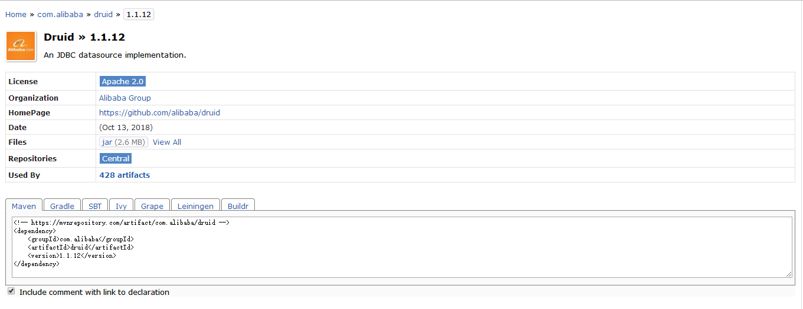

# 第4章 提高数据库访问性能

使用关系型数据库的应用系统的性能瓶颈最终还是数据库。随着业务的迅速增长，数据量会不断增大，会逐渐暴露出关系型数据库的弱点，即性能大幅下降。提升关系型数据库的访问性能是开发者的迫切任务。下面从程序开发角度，对提升数据库的访问性进行介绍和探讨。

本章的实例工程使用了分模块的方式设计，各个模块的功能如表4-1所示。

| 项目         | 工程    | 类型     | 功能                     |
| ------------ | ------- | -------- | ------------------------ |
| 扩展功能模块 | dpexpan | 程序集成 | JPA功能扩展和Redis配置等 |
| 数据管理模块 | mysql   | 程序集成 | MySQL实体建模和持久化等  |
| Web应用模块  | website | Web应用  | Web应用实例              |

## 4.1 使用Druid

Druid是一个关系型数据库连接池，它是阿里巴巴的一个开源项目。Druid支持所有JDBC兼容的数据库，包括Oracle、MySQL、Derby、PostgreSQL、SQL Server、H2等。Druid在监控、可扩展性、稳定性和性能方面具有明显的优势。通过Druid提供的监控功能，可以实时观察数据库连接池和SQL查询的工作情况。使用Druid连接池，在一定程度上可以提高数据库的访问性能。

### 4.1.1 配置Druid依赖

可以从[https://mvnrepository.com/](https://mvnrepository.com/)中查找Druid的依赖配置，找到合适的版本，然后复制其中的Maven的配置到实例工程的扩展功能模块dpexpan中。图4-1是我们查到的结果，使用的是1.0.18版本。图4-1中的HomePage是Druid的源代码链接地址。



### 4.1.2 关于XML配置

使用Spring开发框架时，XML配置是经常使用的一种配置方法，其中数据源配置就是使用XML配置中的一种。代码清单4-1是一个使用Druid连接池的XML配置。使用Spring Boot框架也能使用XML配置，只要在程序入口使用一个注解，如@ImportResource({“classpath:spring-datasource.xml”})，即可导入XML配置。但是，Spring Boot不推荐这样使用，而是集中在配置文件application.properties或application.yml中进行配置。

### 4.1.3 Druid数据源配置

Spring Boot的数据源配置的默认类型是org.apache.tomcat.jdbc.pool.DataSource，为了使用Druid连接池，可以将数据源类型更改为com.alibaba.druid.pool.DruidDataSource，如代码清单4-2所示。其中，url、username、password是连接MySQL服务器的配置参数，其他一些参数设定Druid的工作方式。

```yaml
spring:
  datasource:
    type: com.alibaba.druid.pool.DruidDataSource
    driver-class-name: com.mysql.jdbc.Driver
    url: jdbc:mysql://localhost:3306/test?characterEncoding=utf8
    username: root
    password: 123456
    # 初始化大小，最小，最大
    initialSize: 5
    minIdle: 5
    maxActive: 20
    # 配置获取连接等待超时的时间
    maxWait: 60000
    # 配置间隔多久才进行一次检测，检测需要关闭的空闲连接，单位是毫秒
    timeBetweenEvictionRunsMillis: 60000
    # 配置一个连接在池中最小生存的时间，单位是毫秒
    minEvictableIdleTimeMillis: 300000
    validationQuery: SELECT 1 FROM DUAL
    testWhileIdle: true
    testOnBorrow: false
    testOnReturn: false
    # 打开PSCache，并且指定每个连接上PSCache的大小
    poolPreparedStatements: true
    maxPoolPreparedStatementPerConnectionSize: 20
    # 配置监控统计拦截的filters，去掉后监控界面sql无法统计，'wall'用于防火墙
    filters: stat,wall,log4j
    # 通过connectProperties属性来打开mergeSql功能；慢SQL记录
    connectionProperties: druid.stat.mergeSql=true;druid.stat.slowSqlMillis=5000
    # 合并多个DruidDataSource的监控数据
    #useGlobalDataSourceStat=true
```

上面配置中的filters:stat表示已经可以使用监控过滤器，这时结合定义一个过滤器，就可以用来监控数据库的使用情况。

> **注意：**在Spring Boot低版本的数据源配置中，是没有提供设定数据源类型这一功能的，这时如果要使用上面这种配置方式，就需要使用自定义的配置参数来实现。

### 4.1.4 开启监控功能

开启Druid的监控功能，可以在应用运行的过程中，通过监控提供的多维度数据来分析使用数据库的运行情况，从而可以调整程序设计，以优化数据库的访问性能。

代码清单4-3定义了一个监控服务器和一个过滤器，监控服务器设定了访问监控后台的地址为“/druid/*”，设定了访问数据库的白名单和黑名单，即通过访问者的IP地址来控制访问来源，增加了数据库的安全设置，还配置了一个用来登录监控后台的用户druid，并将密码设置为123456。

```java
package com.test.dbexpand;

import com.alibaba.druid.support.http.StatViewServlet;
import com.alibaba.druid.support.http.WebStatFilter;
import org.springframework.boot.context.embedded.FilterRegistrationBean;
import org.springframework.boot.context.embedded.ServletRegistrationBean;
import org.springframework.context.annotation.Bean;
import org.springframework.context.annotation.Configuration;

@Configuration
public class DruidConfiguration {
    @Bean
    public ServletRegistrationBean statViewServle() {
        ServletRegistrationBean servletRegistrationBean = new ServletRegistrationBean(new StatViewServlet(), "/druid/*");
        //白名单：
        servletRegistrationBean.addInitParameter("allow", "192.168.1.218,127.0.0.1");
        //IP黑名单 (存在共同时，deny优先于allow) : 如果满足deny的即提示:Sorry, you are not permitted to view this page.
        servletRegistrationBean.addInitParameter("deny", "192.168.1.100");
        //登录查看信息的账号密码.
        servletRegistrationBean.addInitParameter("loginUsername", "druid");
        servletRegistrationBean.addInitParameter("loginPassword", "123456");
        //是否能够重置数据.
        servletRegistrationBean.addInitParameter("resetEnable", "false");
        return servletRegistrationBean;
    }

    @Bean
    public FilterRegistrationBean statFilter() {
        FilterRegistrationBean filterRegistrationBean = new FilterRegistrationBean(new WebStatFilter());
        //添加过滤规则.
        filterRegistrationBean.addUrlPatterns("/*");
        //添加不需要忽略的格式信息.
        filterRegistrationBean.addInitParameter("exclusions", "*.js,*.gif,*.jpg,*.png,*.css,*.ico,/druid/*");
        return filterRegistrationBean;
    }
}
```

