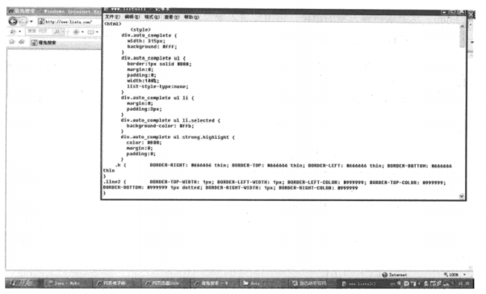

# 第1章 全面剖析网络爬虫

你知道百度、Google是如何获取数以亿计的网页并且实时更新的吗？你知道在搜索引擎领域人们常说的Spider是什么吗？本章将全面介绍网络爬虫的方方面面。读完之后，你将完全有能力自己写一个网络爬虫，随意捉取互联网上任何感兴趣的东西。

既然百度、Google这些搜索引擎巨头已经帮我们捉取了互联网上的大部分信息，为什么还要自己写爬虫呢？因为深入整合信息的需求是广泛存在的。在企业中，爬虫抓取下来的信息可以作为数据仓库多维展现的数据源，也可以作为数据挖掘的来源，甚至有人为了炒股，专门抓取股票信息。既然从美国中情局到普通老百姓都需要，那还等什么，让我们快开始吧。

## 1.1 抓取网页

网络爬虫的基本操作是抓取网页。那么如何才能随心所欲地获得自己想要的页面？这一节将从URL开始讲起，然后告诉大家如何抓取网页，并给出一个使用Java语言抓取网页的例子。最后，要讲一讲抓取过程中的一个重要问题：**如何处理HTTP状态码**。

### 1.1.1 深入理解URL

抓取网页的过程其实和读者平时使用IE浏览器浏览网页的道理是一样的。比如，你打开一个浏览器，输入猎兔搜索网站的网址，如图1.1所示。


“打开”网页的过程其实就是浏览器作为一个浏览的“客户端”，向服务器端发送了一次请求，把服务器端的文件“抓”到本地，再进行解释、展现。更进一步，可以通过浏览器端查看“抓取”过来的文件的源代码。选择”查看“|”源文件“命令，就会出现从服务器上“抓取”下来的文件源代码，如图1.2所示。



在上面的例子中，我们在浏览器的地址中输入的字符串叫做URL。那么，什么是URL呢？直观地址，URL就是在浏览器端输入的`http://www.lietu.com`这个字符串。下面我们深入介绍有关URL的知识。

在理解URL之前，首先要理解URI的概念。什么是URI？Web上每种可用的资源，如HTML文档、图像、视频片段、程序等都由一个通用资源标志符（Universal Resource Identifier,URI）进行定位。

URI通常由三部分组成：

1. 访问资源的命名机制；
2. 存放资源的主机名；
3. 资源自身的名称，由路径表示。

如下面的URI：

```html
http://www.webmonkey.com.cn/html/html140/
```

我们可以这样解释它：这是一个可以通过HTTP协议访问的资源，位于主机`www.webmonkey.com.cn`上，通过路径“/html/html140”访问。

URL是URI的一个子集。它是Uniform Resource Locator的缩写，译为”统一资源定位符“。通俗地说，URL是Internet上描述信息资源的字符串，主要用在各种WWW客户端程序和服务器程序上，特别是著名的Mosaic。采用URL可以用一种统一的格式来描述各种信息资源，包括文件、服务器的地址和目录等。URL的格式由三部分组成：

* 第一部分是协议（或称为服务方式）。
* 第二部分是存有该资源的主机IP地址（有时也包括端口号）。
* 第三部分是主机资源的具体地址，如目录和文件名等。

第一部分和第二部分用“://”符号隔开，第二部分和第三部分用“/“符号隔开。第一部分和第二部分是不可缺少的，第三部分有时可以省略。

根据URL的定义，我们给出了常用的两种URL协议的例子，供大家参考。

**1. HTTP协议的URL示例**

使用超级文本传输协议HTTP，提供超级文本信息服务的资源。

例：http://www.peopledaily.com.cn/channel/welcome.htm

其计算机域名为www.peopledaily.com.cn。超级文本文件（文件类型为.html）是在目录/channel下的welcome.htm。这是中国人民日报的一台计算机。

例：http://www.rol.cn.net/talk/talk1.htm

其计算机域名为www.rol.cn.net。超级文本文件（文件类型为.html）是在目录/talk下的talk1.htm。这是瑞得聊天室的地址，可由此进入瑞得聊天室的第1室。

**2. 文件的URL**

用URL表示文件时，服务器方式用file表示，后面要有主机IP地址、文件的存取路径（即目录）和文件名等信息。有时可以省略目录和文件名，但“/“符号不能省略。

例：file://ftp:yoyodyne.com/pub/files/foobar.txt

上面这个URL代表存放在主机ftp.yoyodyne.com上的pub/files/目录下的一个文件，文件名是foobar.txt。

例：file://ftp.yoyodyne.com/pub

代表主机ftp.yoyodyne.com上的目录/pub。

例：file://ftp.yoyodyne.com/

代表主机ftp.yoyodyne.com的根目录。

爬虫最主要的处理对象就是URL，它根据URL地址取得所需要的文件内容，然后对它进行进一步的处理。因此，准确地理解URL对理解网络爬虫至关重要。从下一节开始，我们将详细地讲述如何根据URL地址来获的网页内容。

### 1.1.2 通过指定的URL抓取网页内容

上一节详细介绍了URL的构成，这一节主要阐述如何根据给定的URL来抓取网页。

所谓网页抓取，就是把URL地址中指定的网络资源从网络流中读取出来，保存到本地。类似于使用程序模拟IE浏览器的功能，把URL作为HTTP请求的内容发送到服务器端，然后读取服务器端的响应资源。

Java语言是为网络而生的编程语言，它把网络资源看成是一种文件，它对网络资源的访问和对本地文件的访问一样方便。它把请求和响应封装为流。因此我们可以根据相应内容，获得响应流，之后从流中按字节读取数据。例如，java.net.URL类可以对相应的Web服务器发出请求并且获得响应文档。java.net.URL类有一个默认的构造函数，使用URL地址为参数，构造URL对象：

```java
URL pageURL=new URL(path);
```

接着，可以通过获得的URL对象来取得网络流，进而像操作本地文件一样来操作网络资源：

```java
InputStream stream = pageURL.openStream();
```

在实际的项目中，网络环境比较复杂，因此，只用java.net包中的API来模拟IE客户端的工作，代码量非常大。需要处理HTTP返回的状态码，设置HTTP代理，处理HTTPS协议等工作。为了便于应用程序的开发，实际开发时常常使用Apache的HTTP客户端开源项目——[HttpClient](http://www.shenhuanjie.com/2018/11/27/the-basic-use-of-httpclient-summary-i/)。它完全能够处理HTTP连接中的各种问题，使用起来非常方便。只需在项目中引入HttpClient.jar包，就可以模拟IE来获取网页内容。例如：

```java
//创建一个客户端，类似于打开一个浏览器
HttpClient httpclient=new HttpClient();

//创建一个get方法，类似于在浏览器地址栏中输入一个地址
GetMethod getmethod=newGetMethod("http://www.blablabla.com");

//回车，获得响应状态码
int statusCod=httpclient.executeMethod(getMethod);

//查看命中情况，可以获得的东西还有很多，比如head、cookies等
System.out.println("response="+getMethod.getResponseBodyAsString());

//释放
getMethod.releaseConnection();
```

上面的示例代码是使用HttpClient进行请求与响应的例子。第一行表示创建一个客户端，相当于打开浏览器。第二行使用get方式对http://www.blablabla.com进行请求。第三行执行请求，获取响应状态。第四行的getMethod.getResponseBodyAsString()方法能够以字符串方式获取返回的内容。这也是网页抓取所需要的内容。在这个示例中，只是简单地把返回的内容打印出来，而在实际项目中，通常需要把返回的内容写入本地文件并保存。最后还要关闭网络连接，以免造成资源消耗。

这个例子是用get方式来访问Web资源。通常，get请求方式吧需要传递给服务器的参数作为URL的一部分传递给服务器。但是，HTTP协议本身对URL字符串长度有所限制。因此不能传递过多的参数给服务器。为了避免这种问题，通常情况下，采用post方法进行HTTP请求，HttpClient包对post方法也有很好的支持。例如：

```java
//得到post方法
PostMethod postMethod=new PostMethod("http://www.saybot.com/postme");

//使用数组来传递参数
NameValuePair[] postData=new nameValuePair[2];

//设置参数
postData[0]=new NameValuePair("武器"，"枪");
postData[2]=new NameValuePair("什么枪"，"神枪");
postMethod.addParameters(postData);

//回车，获得响应状态码
int statusCode=httpclient.executeMethod(getMethod);

//查看命中情况，可以获得的东西还有很多，比如head、cookies等
System.out.pringln("response="+getMethod.getResponseBodyAsString());

//释放
getMethod.releaseConnection();
```

上面的例子说明了如何使用post方法来访问Web资源。与get方法不同，post方法可以使用NameValuePair来设置参数，因此可以设置“无限”多的参数。而get方法采用把参数写在URL里面的方式，由于URL有长度限制，因此传递参数的长度会有限制。

有时，我们执行爬虫程序的机器不能直接访问Web资源，而是需要通过HTTP代理服务器去访问，HttpClient对代理服务器也有很好的支持。如：

```java
//创建HttpClient相当于打开一个代理
HttpClient httpClient=new HttpClient();

//设置代理服务器的IP地址和端口
httpClient.getHostConfiguration().setProxy("192.168.0.1",9527);

//告诉httpClient，使用抢先认证，否则你会收到“没有资格”的恶果
httpClient.getParams().setAuthenticationPreemptive(true);

//MyProxyCredentialsProvder返回代理的credential(username/password)
httpClient.getParams().setParameter(CredentialsProvider.PROVIDER,new MyProxyCredentialsProvider());

//设置代理服务器的用户名和密码
httpClient.getState().setProxyCredentials(new AuthScope("192.168.0.1",AuthScope.ANY_PORT,AuthScope.ANY_REALM),new UsernamePasswordCredentials("username","password"));
```


